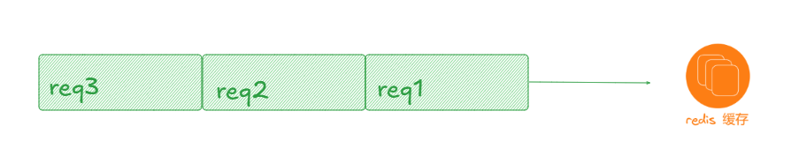
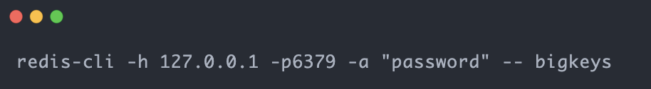
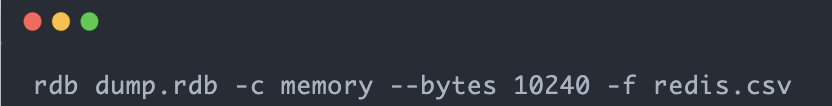
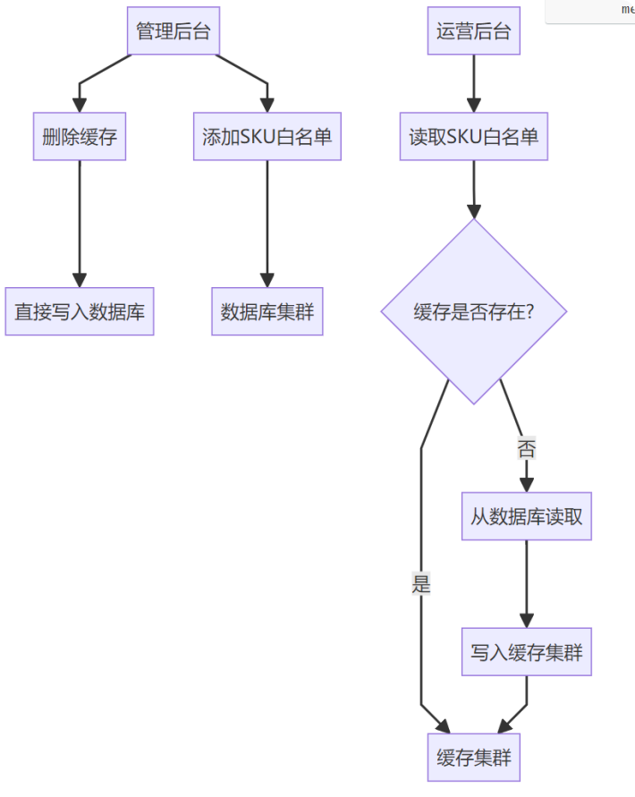
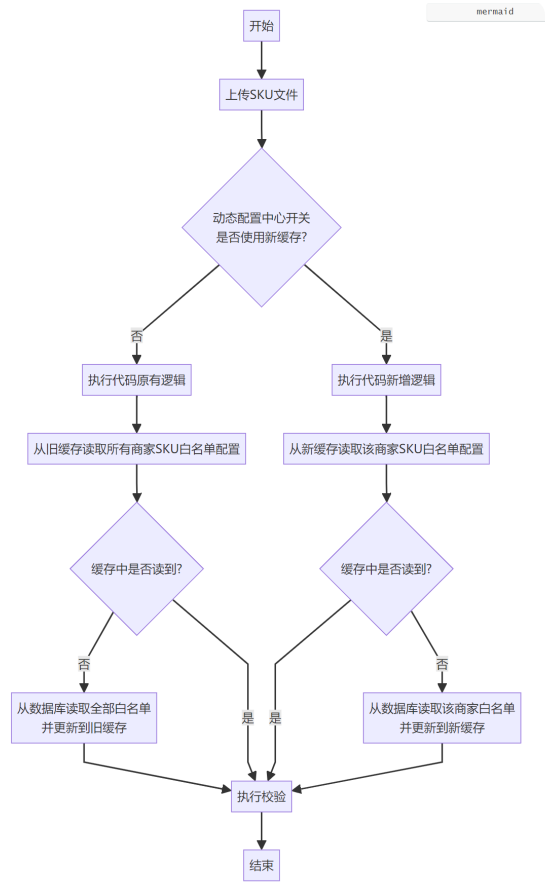
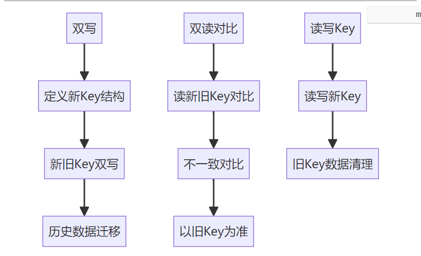

从今天之后的一段时间内，华仔会带着大家一起从零开始搭建并研发一套高并发的电商实战项目，这里会涉及到很多互联网大厂开发过程中所使用的核心技术和架构设计模式，希望大家学完之后可以用到自己的简历中。

接下来我们会重点架构设计和开发一下我们高并发电商实战前端 Web 项目的相关功能 。

这是第八十八篇，本篇我们继续进行电商实战项目设计与开发，本篇我们来实战下「**Redis 分布式缓存大 Key 监控与切分处理方案**」。

文章汇总位置：[https://wx.zsxq.com/dweb2/index/columns/51122554151214](https://wx.zsxq.com/dweb2/index/columns/51122554151214)

源码授权与获取地址：[https://articles.zsxq.com/id\_1s85grnaae4p.html](https://articles.zsxq.com/id_1s85grnaae4p.html)

本章源码地址：[https://gitcode.net/u011359591/huazai-ecshop/-/tree/ecshop-chapter-88](https://gitcode.net/u011359591/huazai-ecshop/-/tree/ecshop-chapter-88)

## **01 前言**

上篇，我们重点实战下「**微服务全家桶之网关服务 Gateway 的接入**」[【电商实战项目第八十七篇】华仔电商实战项目接入微服务全家桶之网关服务 Gateway](https://articles.zsxq.com/id_gi5wqti852aw.html), 今天我们来看下之前遗留的一个重要模块：「**Redis 分布式缓存大 Key 监控与切分处理方案**」。

## **02 缓存大 Key 基础知识及治理方案**

## **2.1 什么是大 Key**

集合类型元素数量 > 5000 或者单个 value 大于 1M。当然这个标准不是绝对的，而是需要根据具体的业务场景和Redis 集群的实际情况来灵活调整。

## **2.2 什么是大 Key 问题**

Redis 作为单线程应用程序，它的请求处理模式类似排队系统，就像下面的图一样，所有请求只能依序逐个处理。一旦处于队列前面的请求处理时间过长，后续请求的等待时间就会被迫延长。

  

在请求处理过程中，若涉及的键（Key）或键关联的值（Value）数据量过大，Redis 针对这个请求的 I/O 操作耗时以及整体处理时间都将显著增加。

倘若这种情况频繁发生，不仅 Redis 的吞吐会下降，而且大量后续请求都会因长时间得不到响应，而导致延迟上涨，甚至引发超时。在实际应用场景中，这种现象被定义为「**大 Key 问题**」，而那些数据量过大的键（Key）与值（Value）则被称为「**大 Key**」。

当然，要判断什么是「**大 Key** 」，我们得综合考虑两个因素：「**Key 大小**」、「**Key 中包含的成员数量**」。

不过，对于 Key 究竟要达到多大规模或者包含的成员数量具体为多少才能够被认定为「**大 Key** 」，实际上并没有一个统一的标准，这个标准得根据你的 Redis 配置来定。

接下来，我给你分享一些阿里云提供的关于大 Key 的参考标准，这些标准可以作为你判断和处理大 Key 问题的参考。

1.  从 Key 的数据量来说，一个 String 类型的 Key，如果它的数据量达到 5MB，我们就可以认为它是一个「**大 Key**」。
2.  从 Key 成员数量来看，一个 ZSET 类型的 Key，如果它包含的成员数量超过了 10,000 个，这也符合「**大 Key**」的定义。
3.  从 Key 的成员数据量来看，一个 Hash 类型的 Key，即使它的成员数量只有 2,000 个，但如果这些成员的 Value（值）加起来总大小超过了 100MB，那它同样可以被视为「**大 Key**」。

##   
**2.3 大 Key带来的风险**

1.  「**大 Key**」发生热点访问，响应积压在服务端后内存暴涨，最终导致服务端被杀造成数据丢失
2.  严重影响 QPS、TP99 等指标，对大Key进行的慢操作会导致后续的命令被阻塞，从而导致一系列慢查询。
3.  hgetall、smembers 等时间复杂度O（N）的命令使用不当，容易造成CPU使用率过高。
4.  集群各分片内存使用不均。某个分片占用内存较高或OOM，发送缓存区增大等，导致该分片其他Key被逐出，同时也会造成其他分片的资源浪费。
5.  集群各分片的带宽使用不均。某个分片被流控，其他分片则没有这种情况，且影响宿主机上的其它应用。
6.  数据迁移失败 过大的Key（如超过1G），在迁移、缩容、扩容，主从全量同步在序列化过程中，内存上涨，数据同步失败，且存在数据丢失风险。

##   
**2.4 如何发现大 Key**

这里提供三种方式。

[https://help.aliyun.com/zh/redis/user-guide/identify-and-handle-large-keys-and-hotkeys/](https://help.aliyun.com/zh/redis/user-guide/identify-and-handle-large-keys-and-hotkeys/)

[https://help.aliyun.com/zh/redis/user-guide/use-the-real-time-key-statistics-feature?spm=a2c4g.11186623.0.0.60a83dedbfDLwe#task-2096542](https://help.aliyun.com/zh/redis/user-guide/use-the-real-time-key-statistics-feature?spm=a2c4g.11186623.0.0.60a83dedbfDLwe#task-2096542)

### **2.4.1 redis-cli --bigkeys 查找大 Key**

可以通过 [redis-cli --bigkeys](http://redis-cli%20--bigkeys/) 命令查找大 key：

  

使用的时候注意事项：

1.  最好选择在从节点上执行该命令。因为主节点上执行时，会阻塞主节点。
2.  如果没有从节点，那么可以选择在 Redis 实例业务压力的低峰阶段进行扫描查询，以免影响到实例的正常运行；或者可以使用 -i 参数控制扫描间隔，避免长时间扫描降低 Redis 实例的性能。

该方式的不足之处：

1.  这个方法只能返回每种类型中最大的那个 bigkey，无法得到大小排在前 N 位的 bigkey。
2.  对于集合类型来说，这个方法只统计集合元素个数的多少，而不是实际占用的内存量。但是，一个集合中的元素个数多，并不一定占用的内存就多。因为，有可能每个元素占用的内存很小，这样的话，即使元素个数有很多，总内存开销也不大。

###   
**2.4.2 scan 命令查找大 Key**

使用 SCAN 命令对数据库扫描，然后用 TYPE 命令获取返回的每一个 key 的类型。

对于 String 类型，可以直接使用 STRLEN 命令获取字符串的长度，也就是占用的内存空间字节数。

对于集合类型来说，有两种方法可以获得它占用的内存大小：

1.  如果能够预先从业务层知道集合元素的平均大小，那么，可以使用下面的命令获取集合元素的个数，然后乘以集合元素的平均大小，这样就能获得集合占用的内存大小了。List 类型：LLEN 命令；Hash 类型：HLEN 命令；Set 类型：SCARD 命令；Sorted Set 类型：ZCARD 命令。
2.  如果不能提前知道写入集合的元素大小，可以使用 MEMORY USAGE 命令（需要 Redis 4.0 及以上版本），查询一个键值对占用的内存空间。

### **2.4.3 RdbTools 工具查找大 Key**

使用 RdbTools 第三方开源工具，可以用来解析 Redis 快照（RDB）文件，找到其中的大 key。

比如，下面这条命令，将大于 10 kb 的 key 输出到一个表格文件。

## **2.5 大 Key 治理方案**

在深入了解了大 Key 问题之后，我们来探讨一个实际问题：如果在实际应用中，我们不得不将超过大 Key 标准的数据存储到 Redis 中，我们应该如何进行优化以规避大 Key 问题呢？

###   
**2.4.1 事前预防**

事前预防的基本思路是在缓存设计的时候，缓存中只存储必要的数据，且需要考虑将存储空间变小，具体的手段有：

1.  对于JSON类型，可以删除不使用的Field；或者使用@JsonProperty 注解让 FiledName 字符集缩小。
2.  采用 Protobuf 等压缩算法，利用时间换空间，通过压缩技术减少数据的体积，使其符合大 Key 的标准，从而减少对 Redis 性能的影响。
3.  对于集合类型，设计上尽量避免整存整取。

### **2.4.2 事中监控**

事中做好监控，对于缓存大Key，早发现，早治理。

### **2.4.3 事中拆分**

缓存大Key已经存在，那么应该怎么办？

这里分2种情况进行考虑：

1.  评估这些「**大 Key** 」是否还有存在的意义和价值，是否可以删除，对于可以删除的可以使用 SCAN 命令进行循序渐进式删除「**大 Key** 」；对于不可以直接删除的这种，是否可以将数据转移到其他的介质进行存储。
2.  对于不能直接删除的「**大 Key** 」，进行「**分而治之** 」，再通俗一点就是将「**大 Key** 」进行拆分：
3.  String 类型的「**大 Key** 」：可以尝试将对象分拆成几个 Key-Value，使用 MGET 或者多个 GET 组成的 pipeline 获取值，分拆单次操作的压力，对于集群来说可以将操作压力平摊到多个分片上，降低对单个分片的影响。
4.  集合类型的「**大 Key** 」，每次只需操作部分元素：将集合类型中的元素分拆。以 Hash 类型为例，可以在客户端定义一个分拆 Key 的数量N，每次对 HGET 和 HSET 操作的 field 计算哈希值并取模 N，确定该 field 落在哪个 Key 上。

## **2.6 大 Key 治理案例**

### **2.6.1 业务场景和架构说明**

在我们电商活动管理系统，系统有 2 个应用：后台管理端、运营端；（后台管理端是管理人员进行操作；运营端可以创建营销活动）存储使用的是MySQL和Redis。

系统中有一个这样的场景，简单来说就是，后台管理端可以添加 sku 白名单，这个白名单是以「**商家 ShopNumber + skuId** 」为一条记录写入 MySQL 中的；运营端在创建营销活动，需要上传 sku，上传的时候需要读取 sku 白名单进行校验。

系统现状是，在查询 sku 白名单的时候使用了 Redis 缓存。缓存模式采用的是「**旁路缓存**」。

1.  添加 SKU 白名单的流程是，写入数据库，并删除缓存；
2.  读取 SKU 白名单的流程是，先从缓存读取，缓存中没有则读取数据库，并将结果写入缓存。
3.  缓存的数据类型是String，value为数据库中的全量SKU白名单记录，是以JSON字符串存储的。

> 旁路缓存：读取缓存、读取数据、更新缓存和操作都是在应用程序中完成的。

但是随着业务的发展，添加的SKU白名单逐渐增多，发展成为了缓存大Key。截止治理之前，数据库的配置表中存在1w+ 条sku白名单记录，也就是说 Redis 的一个String结果存储了 1w+条的白名单记录。

这里也许有人问，一张表中存储1w+条数据，也是没有压力的啊，其实这张配置表中不仅有商家 SKU 白名单配置，还包括系统中其他所有的配置信息存储，数据量还是可观的。

### **2.6.2 比较直接的治理方案**

该业务场景中，缓存大Key是不可以直接进行删除处理的，处理思路是将其拆分为一些小的Key。

分析场景，商家可以登录运营端进行创建营销活动，在创建营销活动和上传SKU的过程中，只需要查询该商家的SKU白名单，那么存储和查询全部都是不必要的，那么可以将全量白名单数据按照商家维度进行拆分存储和查询。

关于缓存结构的选择，我使用的是「**Hash 结构（新缓存）**」、「**key 与原缓存 String 结构 key 相同**」、「**field 为商家 ShopNumber**」、「**value 为 sku 白名单列表**」。

大概流程图如下：

新缓存Hash结构key与原缓存String结构 key 完全相同，意味着新的Hash结构缓存和旧的String缓存是无法共存的，**原只能选择其一，意味着不存在百分比切量的过程，一步到位切量，是不是很直接？**

这样激进的方案是基于什么的考量呢？

1.  **夜间流量几乎为0，且缓存切换操作秒级完成，风险可控**。运营端系统，商家创建促销活动基本都是工作时间，晚上和凌晨几乎没有流量；而且，新旧缓存切换可以秒级完成：
2.  ①运营端添加测试SKU白名单，删除缓存。
3.  ②将开关切到新缓存；风险可控。
4.  **方案支持秒级回滚**
5.  ①运营端添加测试SKU白名单，删除缓存。
6.  ②将开关切到旧缓存。
7.  **代码改动和上线部署工作量小**。这个方案可以保持管理后端删除缓存的逻辑不变，也就是在添加SKU白名单的时候还是删除所有的白名单缓存；只需要改动运营后端代码，且上线部署只需要部署运营端。
8.  虽然管理后端删除缓存为全量删除，存在管理端添加商家A的SKU白名单，导致缓存中的商家B、商家C等的白名单数据也被删除（其实是无需删除的），综合评估可以**暂时保持现状，后续再优化**。

###   
**2.6.3 相对稳妥的治理方案**

这里分三个阶段：「**双写**」、「**双读对比**」和「**读写新 Key**」等阶段。

### **2.6.3.1 双写阶段**

在不影响现有业务的情况下，将新数据同时写入旧key和新key。

### **2.6.3.2 双读对比阶段**

验证新key的数据与旧key的数据是否一致，并准备切换读操作到新key。

### **2.6.3.3 读写新 Key 阶段**

将所有读写操作都切换到新key，并废弃旧key；需要注意删除大key时要避免阻塞Redis服务。

### **2.6.3.4 注意事项**

1.  **数据一致性**：在整个治理过程中，需要确保数据的一致性。特别是在双写和双读对比阶段，要仔细验证数据是否一致。
2.  **性能影响**：在双写和双读对比阶段，由于需要同时操作旧key和新key，可能会对性能产生一定影响。因此，需要在业务低峰期进行这些操作，并监控系统的性能指标。
3.  **错误处理**：在治理过程中，可能会遇到各种错误情况（如数据不一致、网络问题等）。需要制定完善的错误处理机制来确保系统的稳定性和可用性。
4.  **备份和恢复**：在执行治理操作之前，建议对Redis数据进行备份。以便在出现问题时可以快速恢复数据。

综上，基于真实的线上缓存大Key治理案例，区别于「**稳妥**」的治理方案，可以选择一种「**简单直接**」的治理策略。对于缓存大 Key 进行简单总结一下：

1.  对于使用缓存，需要考虑缓存大Key问题，设计和开发过程中尽量避免。
2.  如果已经出现，考虑删除，如果不可以删除，考虑拆分。
3.  最终可以在权衡之下，选择最适合自己的方案。