从今天之后的一段时间内，华仔会带着大家一起从零开始搭建并研发一套高并发的电商实战项目，这里会涉及到很多互联网大厂开发过程中所使用的核心技术和架构设计模式，希望大家学完之后可以用到自己的简历中。

接下来我们会重点架构设计和开发一下我们高并发电商实战前端 Web 项目的相关功能 。

这是第八十五篇，本篇我们继续进行电商实战项目设计与开发，本篇我们正式介绍一期项目最后一个重要模块之「**支付服务基于策略模式+工厂模式实现微信下单、退款、状态查询、支付回调功能开发**」。

文章汇总位置：[https://wx.zsxq.com/dweb2/index/columns/51122554151214](https://wx.zsxq.com/dweb2/index/columns/51122554151214)

源码授权与获取地址：[https://articles.zsxq.com/id\_1s85grnaae4p.html](https://articles.zsxq.com/id_1s85grnaae4p.html)

本章源码地址：[https://gitcode.net/u011359591/huazai-ecshop/-/tree/ecshop-chapter-86](https://gitcode.net/u011359591/huazai-ecshop/-/tree/ecshop-chapter-86)

## **01 前言**

通过前面三篇，我们把「**支付服务**」相关业务场景、支付宝、微信支付使用场景、前期准备工作、支付宝接入都梳理了一下，今天我们来重点实战下「**支付服务基于策略模式+工厂模式实现微信下单、退款、状态查询、支付回调功能开发**」。

[【电商实战项目第八十三篇】华仔电商实战支付服务业务介绍与支付宝、微信支付申请、接入](https://articles.zsxq.com/id_zi7dpq1wn0nl.html)

[【电商实战项目第八十四篇】华仔电商实战支付服务之安全攻防相关知识梳理](https://articles.zsxq.com/id_2nr02me3l6us.html)

[【电商实战项目第八十五篇】华仔电商实战支付服务基于策略+工厂模式开发支付宝下单|退款|查询|支付回调|内网穿透工具介绍](https://articles.zsxq.com/id_mujsqum4vrpw.html)

## **02 微信支付文档流程梳理**

## **2.1 Native支付产品文档流程**

### **2.1.1 文档地址**

先贴一下⽂档入口地址（失效后自行搜索）：[https://pay.weixin.qq.com/doc/v3/merchant/4012791874](https://pay.weixin.qq.com/doc/v3/merchant/4012791874)

### **2.1.2 接入指引**

文档地址：[https://pay.weixin.qq.com/doc/v3/merchant/4012791870](https://pay.weixin.qq.com/doc/v3/merchant/4012791870)

### **2.1.2.1 熟悉微信支付接口规则**

正式进入开发前，开发者需要先阅读[基本规则](https://pay.weixin.qq.com/doc/v3/merchant/4012081709)、[签名和验签规则](https://pay.weixin.qq.com/doc/v3/merchant/4012365342)了解调用微信支付接口的基本规则和签名规则。

  
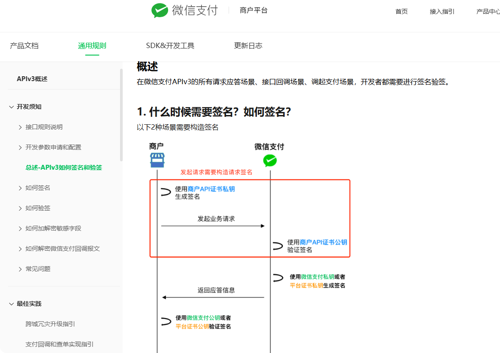

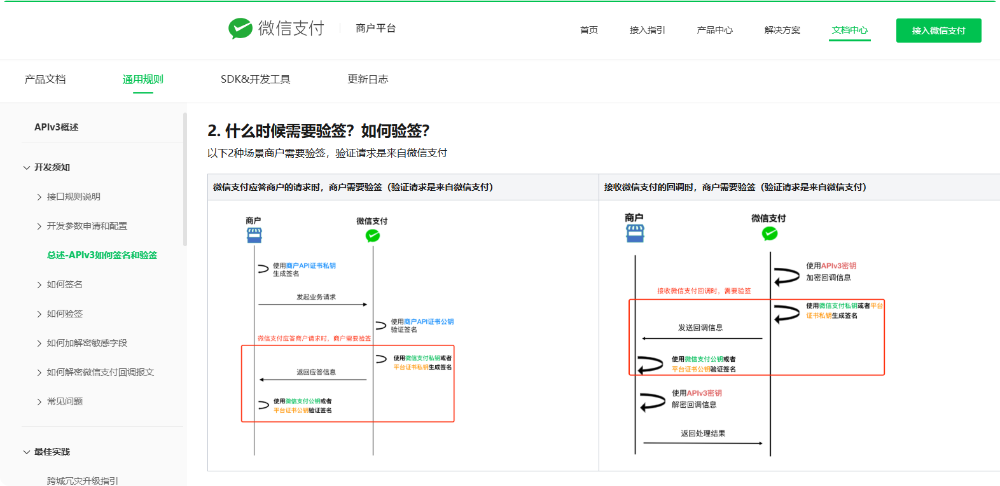

### **2.1.2.2 接入前支付参数准备**

在发起接口请求时，开发者需传入必要参数，如商户号、appid、密钥及证书序列号等，获取方式详见：[普通商户模式开发必要参数说明](https://pay.weixin.qq.com/doc/v3/merchant/4013070756)。

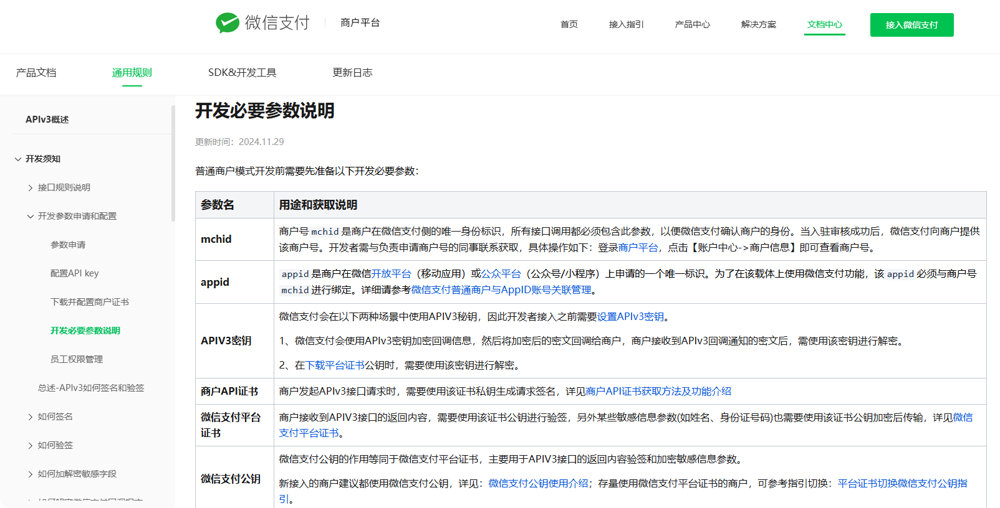

### **2.1.3 整体业务开发流程**

业务开发流程如下：

1.  商户后端调用[JSAPI/小程序下单](https://pay.weixin.qq.com/doc/v3/merchant/4012791856)接口获取预支付ID（prepay\_id）后，在微信客户端前端页面调用[WeixinJSBridge](https://pay.weixin.qq.com/doc/v3/merchant/4012791857)对象方法调起微信支付界面。
2.  当用户取消支付或支付成功后点击"完成"按钮，会返回拉起支付前页面，同时商户前端页面将收到回调，此时商户后端需调用[查询订单API](https://pay.weixin.qq.com/doc/v3/merchant/4012791859)接口确认订单状态，并根据订单状态进行相应的业务逻辑处理（在商户页面向用户展示查询到的订单支付状态、在商户内部系统更新订单状态等），如果订单支付成功，微信支付系统还会发送[支付成功回调通知](https://pay.weixin.qq.com/doc/v3/merchant/4012791861)给商户。具体的支付回调和查单的实现方案，商户可以参考[支付回调和查单实现指引](https://pay.weixin.qq.com/doc/v3/merchant/4012075249)。
3.  最后商户可通过[下载交易账单](https://pay.weixin.qq.com/doc/v3/merchant/4012791866)进行对账。特殊需要退款的订单，也可调用[退款接口](https://pay.weixin.qq.com/doc/v3/merchant/4012791862)完成退款。

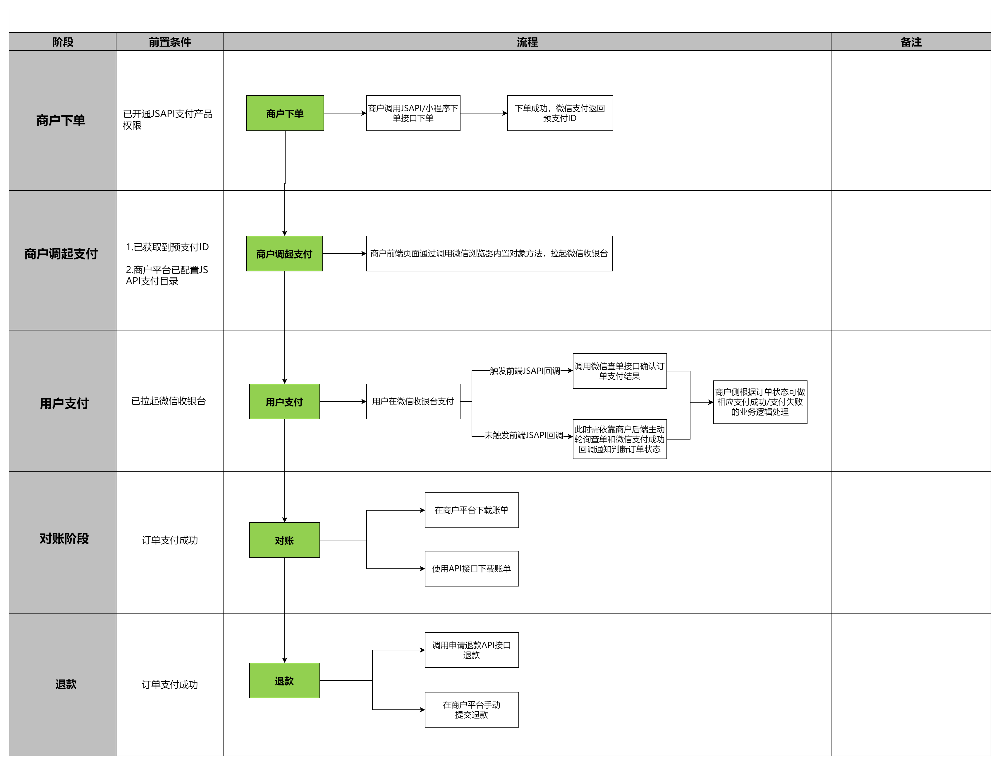

### **2.1.3.1 商户下单**

商户通过调用[Native支付下单API](https://pay.weixin.qq.com/doc/v3/merchant/4012791877)接口生成订单并获取二维码code\_url，随后将该code\_url传递至前端，由前端将其转换为二维码图片展示给用户。

  
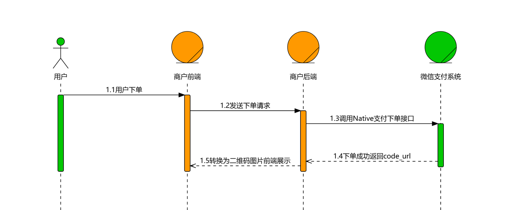

下单接口关键参数说明：

1.  time\_expire：支付结束时间。若传递该参数，则用户只能在订单设置的支付结束时间time\_expire之前进行支付，超过支付结束时间后，用户支付将收到："订单已超过商户设置的最晚支付成功时间，请重新发起支付"的提示，商户需对订单进行关单处理。若不传该参数，默认订单支付有效期为7天，用户可在7天内进行支付，超出7天，订单将被关闭。
2.  code\_url：二维码链接。此URL用于生成支付二维码，然后提供给用户扫码支付。code\_url有效期为2小时，超过2小时，商户需要使用原下单参数重新请求下单接口，获取新的code\_url。

### **2.1.3.2 用户扫码调起支付**

用户通过微信扫一扫，扫商户前端展示的支付二维码图片来调起微信收银台。具体请参考[Native调起支付](https://pay.weixin.qq.com/doc/v3/merchant/4012791878)

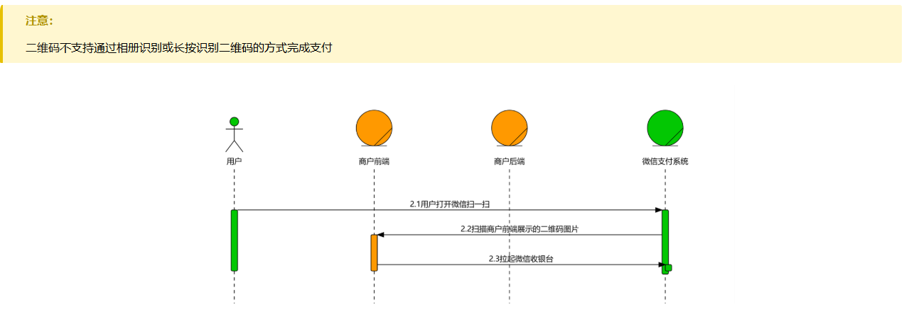

### **2.1.3.3 用户支付**

用户在微信收银台完成支付/取消支付，商户后端则需要轮询调用[普通支付查询订单API](https://pay.weixin.qq.com/doc/v3/merchant/4012791880)接口获取订单状态，并根据订单状态向用户展示支付结果。

同时，如果用户支付成功，微信支付系统会向商户发送[支付成功回调](https://pay.weixin.qq.com/doc/v3/merchant/4012791882)。未收到回调时，商户也可调用[查询订单API](https://pay.weixin.qq.com/doc/v3/merchant/4012791880)接口确认订单状态。具体实现方案商户可以参考[支付回调和查单实现指引](https://pay.weixin.qq.com/doc/v3/merchant/4012075249)。

若商户需要限制用户支付的时间，有以下两种方式：

1.  下单时通过time\_expire参数，设置订单的支付结束时间，超过设置的结束时间后，商户进行关单处理。
2.  商户在自己的系统内进行倒计时，超过有效期，进行关单处理。

若因特殊原因需在用户可支付时间范围内关闭订单，商户可通过调用[查询订单API](https://pay.weixin.qq.com/doc/v3/merchant/4012791880)接口确认订单状态，若订单仍是未支付状态，商户可以调用[关闭订单API](https://pay.weixin.qq.com/doc/v3/merchant/4012791881)接口关单，关单后可以将订单当作失败终态处理。

  
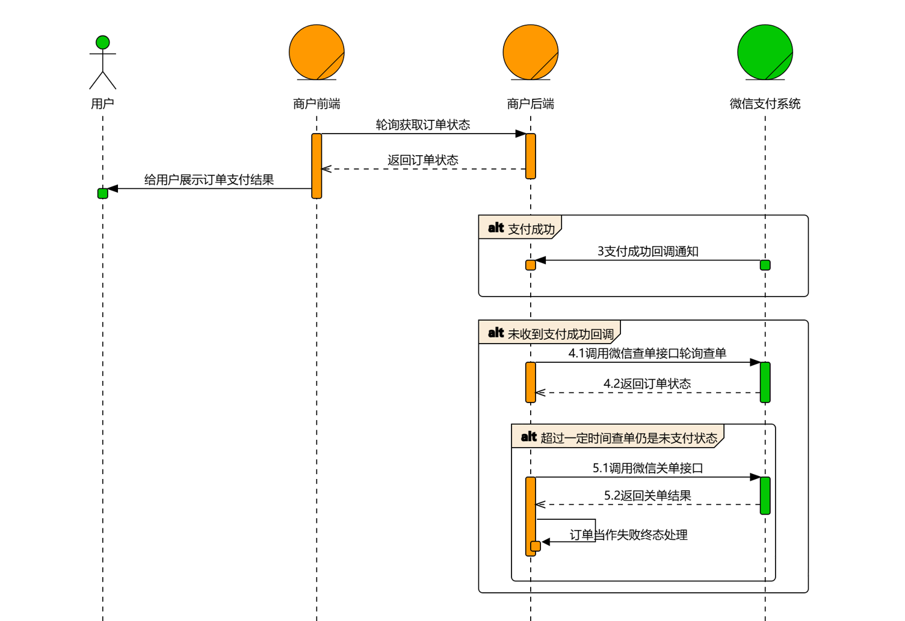

### **2.1.3.4 商户对账**

详细参考：[账单产品介绍](https://pay.weixin.qq.com/doc/v3/merchant/4013071215)

### **2.1.3.5 订单退款**

详细参考：[退款产品介绍](https://pay.weixin.qq.com/doc/v3/merchant/4013071001)

### **2.1.3.6 普通支付订单状态流转图**

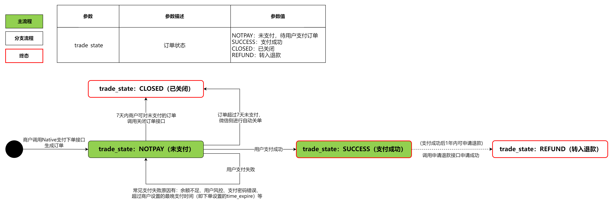

1.  商户调用[Native支付下单](https://pay.weixin.qq.com/doc/v3/merchant/4012791877)接口下单成功后，商户可以调用[查询订单](https://pay.weixin.qq.com/doc/v3/merchant/4012791880)接口来确认订单状态，详情请参考[支付回调和查单实现指引](https://pay.weixin.qq.com/doc/v3/merchant/4012075249)。
2.  当订单状态处于未支付(trade\_state：NOTPAY)时，用户可对订单进行支付，若用户支付失败，订单状态不变。
3.  7天内商户可对无需继续支付的订单（例如用户超过商户系统内部规定的支付时间，或超过商户下单设置的最晚支付时间（time\_expire）的订单）调用关单接口，使订单关闭，或超过7天后由微信侧自动关单。关单后，订单状态会从未支付(trade\_state：NOTPAY)流转为已关闭(trade\_state：CLOSED)。
4.  当用户成功支付订单时，订单状态会从未支付(trade\_state：NOTPAY)流转为支付成功(trade\_state：SUCCESS)。
5.  当订单状态为支付成功(trade\_state：SUCCESS)时，如果用户需要退款，商户可调用申请退款接口(仅支持支付成功后1年内的订单)，退款申请成功后，订单状态会从支付成功(trade\_state：SUCCESS)流转为转入退款(trade\_state：REFUND)，退款状态可通过查询退款单接口进行确认。
6.  以下三个状态为终态：
7.  trade\_state：CLOSED
8.  trade\_state：SUCCESS
9.  trade\_state：REFUND

## **03 多渠道支付对接-实战微信接入**

本篇我们只开发「**微信支付**」功能，由于我目前没有「**已认证的服务号**」，暂时无法测试微信支付，这里我们先只实现相关功能。

  
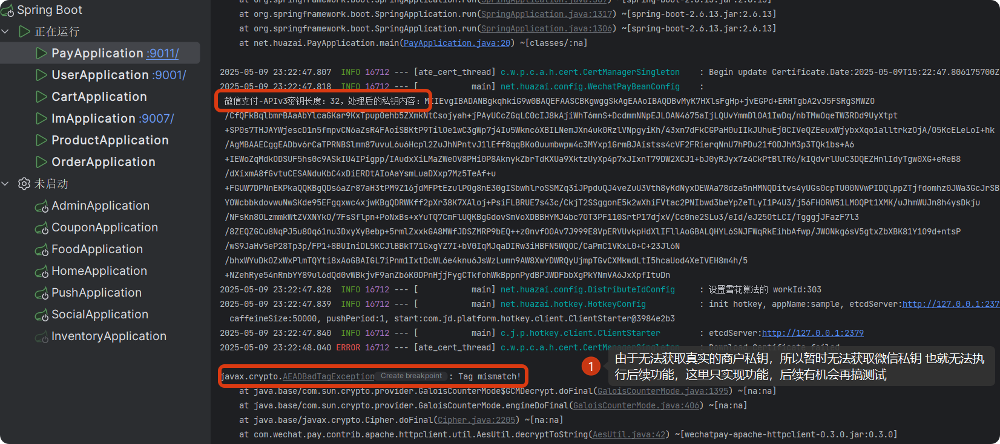

## **3.1 项目接入微信支付**

### **3.1.1 Nacos 参数配置**

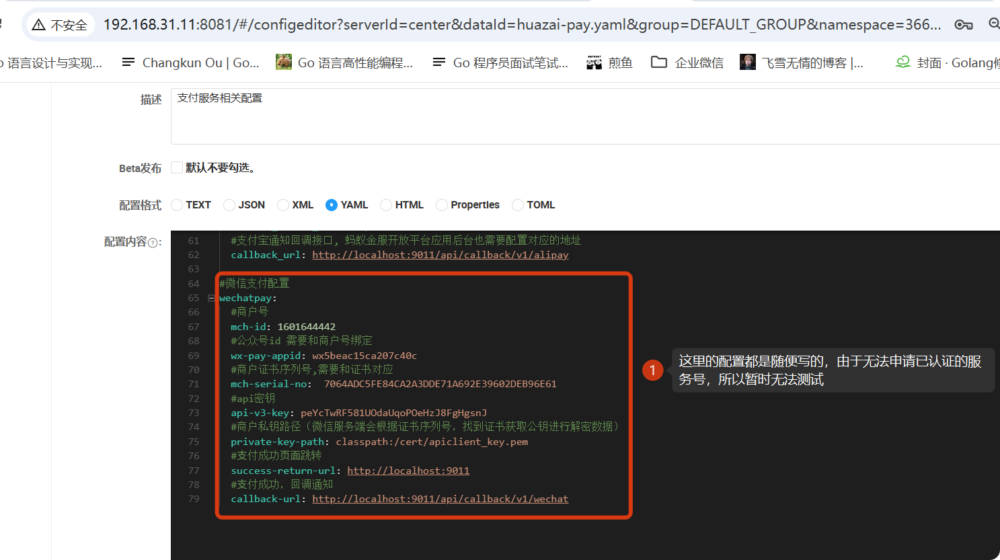

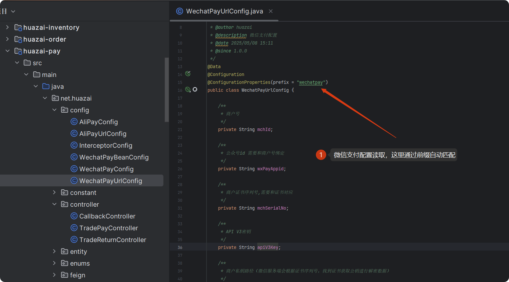

### **3.1.2 证书配置**

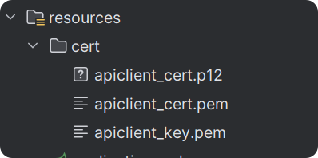

> 欢迎使用微信支付！
> 
> 附件中的三份文件（证书pkcs12格式、证书pem格式、证书密钥pem格式）,为接口中强制要求时需携带的证书文件。
> 
> 证书属于敏感信息，请妥善保管不要泄露和被他人复制。
> 
> 不同开发语言下的证书格式不同，以下为说明指引：
> 
> 证书pkcs12格式（apiclient\_cert.p12）
> 
> 包含了私钥信息的证书文件，为p12(pfx)格式，由微信支付签发给您用来标识和界定您的身份
> 
> 部分安全性要求较高的API需要使用该证书来确认您的调用身份
> 
> windows上可以直接双击导入系统，导入过程中会提示输入证书密码，证书密码默认为您的商户号（如：1900006031）
> 
> 证书pem格式（apiclient\_cert.pem）
> 
> 从apiclient\_cert.p12中导出证书部分的文件，为pem格式，请妥善保管不要泄漏和被他人复制
> 
> 部分开发语言和环境，不能直接使用p12文件，而需要使用pem，所以为了方便您使用，已为您直接提供
> 
> 您也可以使用openssl命令来自己导出：openssl pkcs12 -clcerts -nokeys -in apiclient\_cert.p12 -out apiclient\_cert.pem
> 
> 证书密钥pem格式（apiclient\_key.pem）
> 
> 从apiclient\_cert.p12中导出密钥部分的文件，为pem格式
> 
> 部分开发语言和环境，不能直接使用p12文件，而需要使用pem，所以为了方便您使用，已为您直接提供
> 
> 您也可以使用openssl命令来自己导出：openssl pkcs12 -nocerts -in apiclient\_cert.p12 -out apiclient\_key.pem
> 
> 备注说明：
> 
> 由于绝大部分操作系统已内置了微信支付服务器证书的根CA证书, 2018年3月6日后, 不再提供CA证书文件（rootca.pem）下载

### **3.1.3 微信支付依赖包**

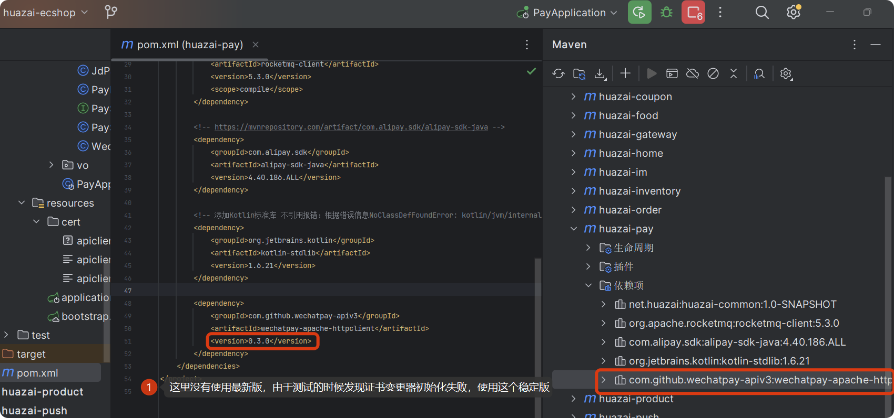

### **3.1.4 微信支付-商户私钥证书读取**

这里使用微信⽀付API v3的 [Apache HttpClient](https://github.com/wechatpay-apiv3/wechatpay-apache-httpclient/tree/v0.3.0) 扩展，实现了请求签名的⽣成和应答签名的验证。

商户申请商户API证书时，会⽣成商户私钥，并保存在本地证书⽂件夹的⽂件 [apiclient\_key.pem](http://apiclient_key.pem/) 中。商户开发者可以使⽤⽅法 [PemUtil.loadPrivateKey()](http://pemutil.loadprivatekey\(\)/) 加载证书。

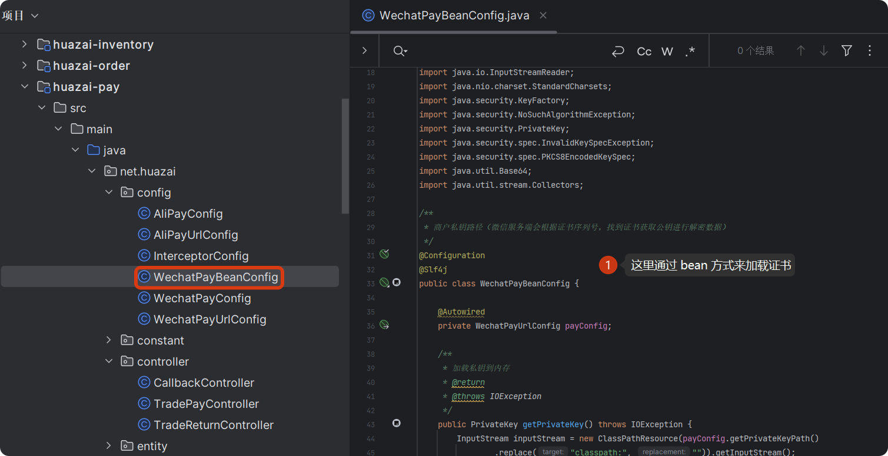

避免平台证书过期，微信提供了定时更新平台证书功能, 如下：

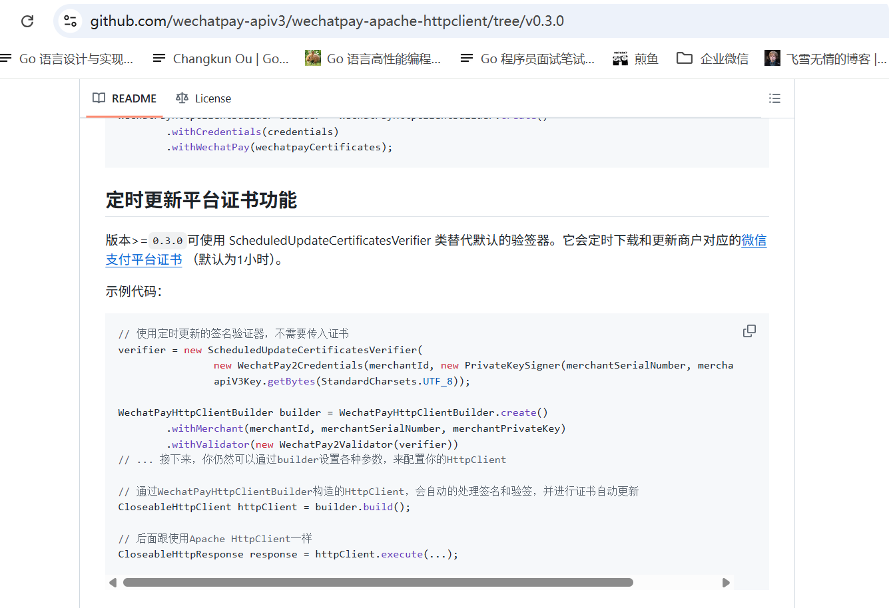

### **3.1.5 微信支付-APIV3 证书与密钥使用说明**

之前的说过的应⽤和⽀付平台的交互图：

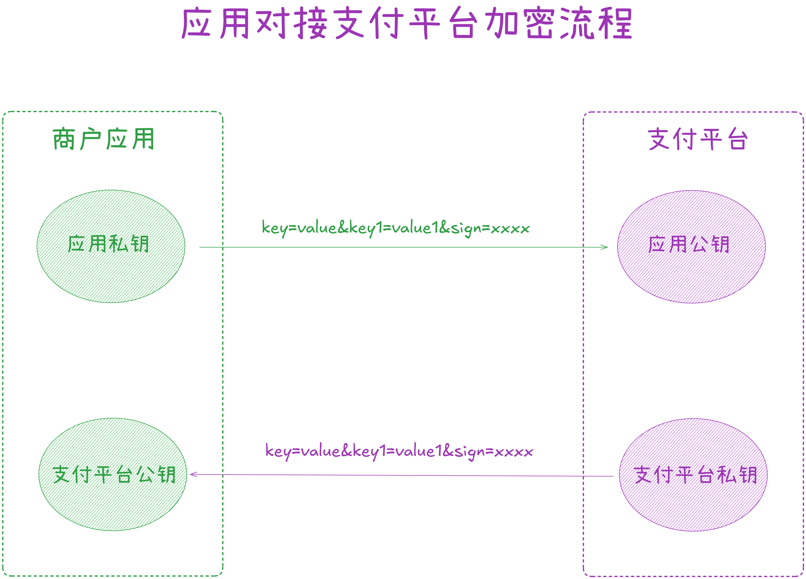

微信签名和验签的交互图（商户证书和平台证书的使⽤说明）文档地址：[https://pay.weixin.qq.com/doc/v3/merchant/4012365342](https://pay.weixin.qq.com/doc/v3/merchant/4012365342)

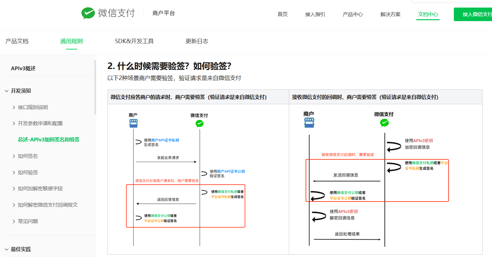

### **3.1.6 微信支付-基于SDK二次封装 HttpClient && 证书管理实战**

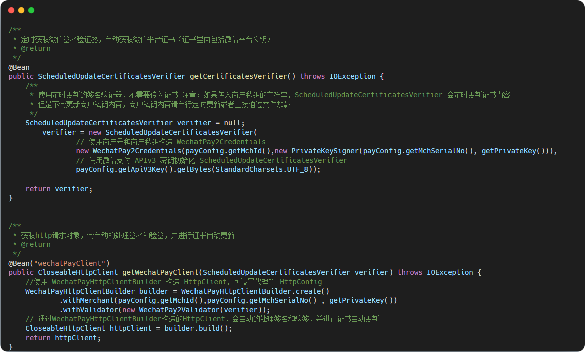

## **3.2 基于策略模式+工厂模式微信支付接入**

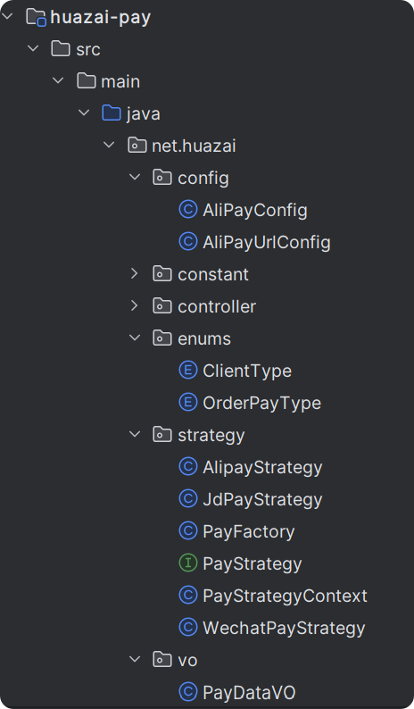

调用关系图如下：

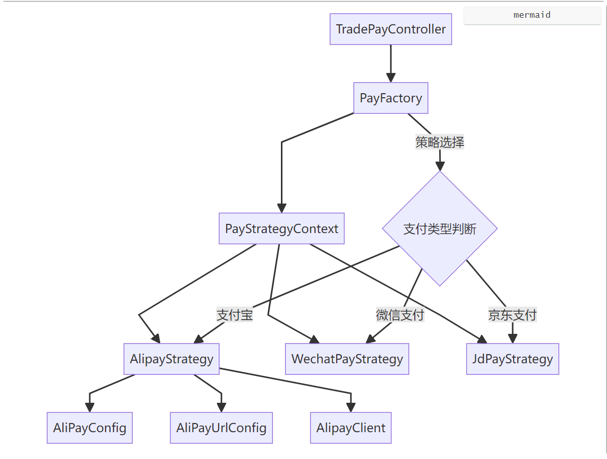

接下来，这里我们只看下微信支付策略的功能实现。

### **3.2.1 WechatPayStrategy 微信支付策略**

我们使用 Native 方式来进行支付对接，实现上面定义的 4 个方法，文档地址：[https://pay.weixin.qq.com/doc/v3/merchant/4012791877](https://pay.weixin.qq.com/doc/v3/merchant/4012791877)

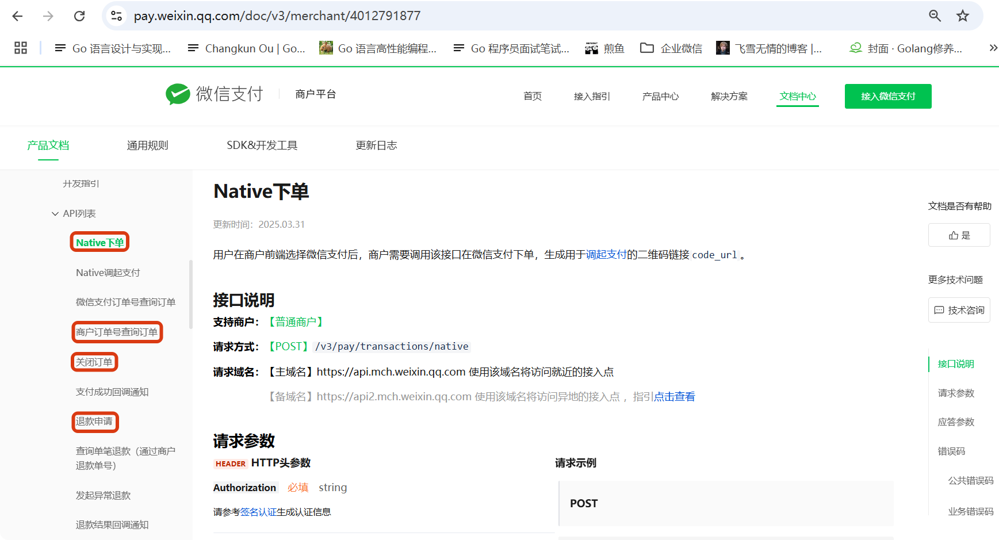

package net.huazai.strategy;

import com.alibaba.fastjson.JSONObject;

import lombok.extern.slf4j.Slf4j;

import net.huazai.config.WechatPayConfig;

import net.huazai.config.WechatPayUrlConfig;

import net.huazai.vo.PayDataVO;

import org.apache.http.client.methods.CloseableHttpResponse;

import org.apache.http.client.methods.HttpGet;

import org.apache.http.client.methods.HttpPost;

import org.apache.http.entity.StringEntity;

import org.apache.http.impl.client.CloseableHttpClient;

import org.apache.http.util.EntityUtils;

import org.springframework.beans.factory.annotation.Autowired;

import org.springframework.http.HttpStatus;

import org.springframework.stereotype.Service;

import java.math.BigDecimal;

import java.text.SimpleDateFormat;

import java.util.Date;

/\*\*

\* 微信支付

\* @author huazai

\* @date 2025-04-04 11:13

\*/

@Service

@Slf4j

public class WechatPayStrategy implements PayStrategy {

/\*\*

\* 微信支付配置

\*/

@Autowired

private WechatPayUrlConfig wechatPayUrlConfig;

/\*\*

\* 微信支付客户端

\*/

@Autowired

private CloseableHttpClient wechatPayClient;

/\*\*

\* 下单

\* 文档地址：https://pay.weixin.qq.com/doc/v3/merchant/4012791877

\* @param payDataVO

\* @return

\*/

@Override

public String payOrder(PayDataVO payDataVO) {

log.info("支付模块-微信准备构建表单请求: payDataVO={}", payDataVO);

/\*\*

\* 过期时间 RFC 3339格式

\*/

SimpleDateFormat sdf \= new SimpleDateFormat("yyyy-MM-dd'T'HH:mm:ssXXX");

/\*\*

\* 支付订单过期时间

\*/

String timeExpire \= sdf.format(new Date(System.currentTimeMillis() + payDataVO.getOrderPayTimeoutMills()));

JSONObject amountObj \= new JSONObject();

// 微信支付需要以分为单位

int amount \= payDataVO.getPayAmount().multiply(BigDecimal.valueOf(100)).intValue();

amountObj.put("total", amount);

amountObj.put("currency", "CNY");

/\*\*

\* 构建请求参数

\*/

JSONObject payObj \= new JSONObject();

/\*\*

\* 商户号

\*/

payObj.put("mchid", wechatPayUrlConfig.getMchId());

/\*\*

\* 商户订单号

\* 商户系统内部订单号，只能是数字、大小写字母\_-\*且在同一个商户号下唯一，详见【商户订单号】。

\* 特殊规则：最小字符长度为6

\* 示例值：1217752501201407033233368018

\* 注意：如果同一时间有多个订单需要支付，商户订单号不能重复。

\*/

payObj.put("out\_trade\_no", payDataVO.getOutTradeNo());

/\*\*

\* 应用ID

\* 微信开放平台审核通过的应用APPID。

\* 示例值：wxd678efh567hg6787

\* 注意：请确保在微信支付商户平台中已设置该应用的APPID。

\*/

payObj.put("appid", wechatPayUrlConfig.getWxPayAppid());

payObj.put("description", payDataVO.getTitle());

/\*\*

\* 通知地址

\* 异步接收微信支付结果通知的回调地址，通知url必须为外网可访问的url，不能携带参数。

\* 如果参数中传了private\_key，则商户必须使用商户证书中对应的私钥将notify\_url和time\_expire字段进行签名，并放在url?sign=SIGN参数中，两者用&连接。

\* 通知url必须为外网可访问的url，不能携带参数。

\* 如果参数中传了private\_key，则商户必须使用商户证书中对应的私钥将notify\_url和time\_expire字段进行签名，并放在url?sign=SIGN参数中，两者用&连接。

\* 注意：

\* 1. URL必须为直接可访问的URL，不能携带任何参数。

\* 2. 通知url必须为外网可访问的url，不能携带参数。

\* 3. 支持http和https。

\* 4. 域名必须保持不变。

\* 5. 如果使用了pay.weixin.qq.com域名的证书，则必须使用该域名。

\* 6. 支持对通知url进行加密，详见微信支付平台证书。

\* 7. 不支持S2S模式。

\* 8. 异步接收微信支付结果通知的回调地址，通知url必须为外网可访问的url，不能携带参数。

\*

\*/

payObj.put("notify\_url", wechatPayUrlConfig.getCallbackUrl());

payObj.put("time\_expire", timeExpire);

/\*\*

\* 订单金额

\*/

payObj.put("amount", amountObj);

/\*\*

\* 附加数据

\* 附加数据，在查询API和支付通知中原样返回，可作为自定义参数使用。

\* 示例值：自定义数据

\* 注意：附加数据中不能包含空格，换行，转义字符等特殊字符，若要传递特殊字符，请先进行转码。

\*/

payObj.put("attach", "{\\"buyerId\\":" + payDataVO.getBuyerId() + "}");

/\*\*

\* 处理请求body参数

\*/

String body \= payObj.toJSONString();

log.info("支付模块-微信支付请求参数:{}", body);

/\*\*

\* 将请求参数设置到请求对象中

\*/

StringEntity entity \= new StringEntity(body,"utf-8");

entity.setContentType("application/json");

HttpPost httpPost \= new HttpPost(WechatPayConfig.NATIVE\_ORDER);

httpPost.setHeader("Accept","application/json");

httpPost.setEntity(entity);

String result \= "";

/\*\*

\* 执行请求

\*/

try (CloseableHttpResponse response \= wechatPayClient.execute(httpPost)) {

/\*\*

\* 响应码

\*/

int statusCode \= response.getStatusLine().getStatusCode();

/\*\*

\* 响应体

\*/

String responseStr \= EntityUtils.toString(response.getEntity());

log.info("支付模块-微信支付构建下单响应码:{}, 响应体:{}", statusCode, responseStr);

if (statusCode == HttpStatus.OK.value()) {

JSONObject jsonObject \= JSONObject.parseObject(responseStr);

if (jsonObject.containsKey("code\_url")) {

result = jsonObject.getString("code\_url");

}

}else {

log.error("支付模块-微信支付构建下单下单响应失败:{}, 响应体:{}", statusCode, responseStr);

}

} catch (Exception e){

log.error("支付模块-微信支付响应异常:{}", e.toString());

}

return result;

}

@Override

public String refundOrder(PayDataVO payDataVO) {

return null;

}

/\*\*

\* 微信支付查询订单状态

\* 文档地址：https://pay.weixin.qq.com/doc/v3/merchant/4012791880

\* @param payDataVO

\* @return

\*/

@Override

public String queryOrderPayStatus(PayDataVO payDataVO) {

/\*\*

\* 商户订单号

\*/

String outTradeNo \= payDataVO.getOutTradeNo();

/\*\*

\* 构建请求参数

\*/

String url \= String.format(WechatPayConfig.NATIVE\_QUERY,outTradeNo, wechatPayUrlConfig.getMchId());

HttpGet httpGet \= new HttpGet(url);

httpGet.setHeader("Accept","application/json");

String result \= "";

try (CloseableHttpResponse response \= wechatPayClient.execute(httpGet)) {

/\*\*

\* 响应码

\*/

int statusCode \= response.getStatusLine().getStatusCode();

/\*\*

\* 响应体

\*/

String responseStr \= EntityUtils.toString(response.getEntity());

log.info("支付模块-微信支付查询支付状态响应码:{}, 响应体:{}", statusCode, responseStr);

if (statusCode == HttpStatus.OK.value()) {

JSONObject jsonObject \= JSONObject.parseObject(responseStr);

if(jsonObject.containsKey("trade\_state")){

result = jsonObject.getString("trade\_state");

}

} else {

log.error("支付模块-微信支付查询支付状态响应失败:{}, 响应体:{}", statusCode, responseStr);

}

}catch (Exception e){

log.error("支付模块-微信支付查询支付状态响应异常:{}", e.toString());

}

return result;

}

/\*\*

\* 关闭订单

\* 文档地址：https://pay.weixin.qq.com/doc/v3/merchant/4012791881

\* @param payDataVO

\* @return

\*/

@Override

public String closeOrder(PayDataVO payDataVO) {

/\*\*

\* 商户订单号

\*/

String outTradeNo \= payDataVO.getOutTradeNo();

JSONObject payObj \= new JSONObject();

payObj.put("mchid", wechatPayUrlConfig.getMchId());

String body \= payObj.toJSONString();

log.debug("支付模块-微信支付关闭订单请求参数:{}",body);

//将请求参数设置到请求对象中

StringEntity entity \= new StringEntity(body,"utf-8");

entity.setContentType("application/json");

String url \= String.format(WechatPayConfig.NATIVE\_CLOSE\_ORDER, outTradeNo);

HttpPost httpPost \= new HttpPost(url);

httpPost.setHeader("Accept","application/json");

httpPost.setEntity(entity);

String result \= "";

try (CloseableHttpResponse response \= wechatPayClient.execute(httpPost)) {

/\*\*

\* 响应码

\*/

int statusCode \= response.getStatusLine().getStatusCode();

log.debug("支付模块-微信支付关闭订单响应码:{},无响应体",statusCode);

if(statusCode == HttpStatus.NO\_CONTENT.value()){

result = "CLOSE\_SUCCESS";

}

} catch (Exception e) {

log.error("支付模块-微信支付关闭订单响应异常:{}", e.toString());

}

return result;

}

}

## **3.3 内网穿透工具介绍与使用**

直接参考上篇的内容即可：[【电商实战项目第八十五篇】华仔电商实战支付服务基于策略+工厂模式开发支付宝下单|退款|查询|支付回调|内网穿透工具介绍](https://articles.zsxq.com/id_av14xeqa092i.html)

## **3.4 微信支付V3版本回调+验签流程梳理**

### **3.4.1 回调验签流程**

文档地址: [https://pay.weixin.qq.com/doc/v3/merchant/4012791882](https://pay.weixin.qq.com/doc/v3/merchant/4012791882)

> 需要注意:同样的通知可能会多次发送给商户系统，商户系统必须能够正确处理重复的通知。
> 
> 推荐的做法是：当商户系统收到通知进⾏处理时，先检查对应业务数据的状态，并判断该通知是否已经处理，如果未处理，则再进⾏处理；如果已处理，则直接返回结果成功。在对业务数据进⾏状态检查和处理之前，要采⽤数据锁进⾏并发控制，以避免函数᯿⼊造成的数据混乱。
> 
> 如果在所有通知频率后没有收到微信侧回调，商户应调⽤查询订单接⼝确认订单状态确保回调URL是外部可正常访问的，且不能携带后缀参数。
> 
> 微信回调通知重复问题（不⼀定准确按照时间间隔推送，需要保证幂等性处理）重复通知的时候，微信的请求id是⼀样的，⽤这个做请求幂等性处理，响应给微信的内容不规范 或者 超过5秒没响应
> 
> 测试的问题：如果有多个未响应的，则测试的请求id，可能有之前的请求继续回调过来。

核⼼流程操作如下:

1.  获取报⽂
2.  验证签名（确保是微信传输过来的）
3.  解密（AES对称解密出原始数据）
4.  处理业务逻辑
5.  响应请求

/\*\*

\* 微信支付回调通知

\* 1、获取报文

\* 2、验证签名（确保是微信传输过来的）

\* 3、解密（AES对称解密出原始数据）

\* 4、处理业务逻辑

\* 5、响应请求

\* 文档地址：https://pay.weixin.qq.com/doc/v3/merchant/4013053420

\* @param request

\* @param response

\* @return

\*/

@RequestMapping("wechat")

@ResponseBody

public Map<String, String> wechatPayCallback(HttpServletRequest request, HttpServletResponse response) {

log.info("支付模块-微信支付异步回调通知结果请求:{}", request);

/\*\*

\* 获取报文

\*/

String body \= getRequestBody(request);

/\*\*

\* 应答随机串

\*/

String nonceStr \= request.getHeader("Wechatpay-Nonce");

/\*\*

\* 微信传递过来的应答签名

\*/

String signature \= request.getHeader("Wechatpay-Signature");

/\*\*

\* 证书序列号（微信平台）

\*/

String serialNo \= request.getHeader("Wechatpay-Serial");

/\*\*

\* 应答时间戳

\*/

String timestamp \= request.getHeader("Wechatpay-Timestamp");

/\*\*

\* 注意：这里的body是加密后的密文

\* 构造签名串

\* 应答时间戳\\n

\* 应答随机串\\n

\* 应答报文主体\\n

\*/

String signStr \= Stream.of(timestamp, nonceStr, body).collect(Collectors.joining("\\n", "", "\\n"));

log.info("支付模块-微信支付异步回调通知-报文:{}，应答随机串:{}，应答签名:{}，证书序列号:{}，应答时间戳:{}，组装的签名串:{}", body, nonceStr, signature, serialNo, timestamp, signStr);

Map<String, String> map = new HashMap<>(2);

try {

/\*\*

\* 验证签名是否通过

\*/

boolean result \= verifiedSign(serialNo, signStr, signature);

if (result) {

/\*\*

\* 解密后的明文

\*/

String plainBody \= decryptBody(body);

log.info("支付模块-微信支付异步回调通知解密后的明文:{}",plainBody);

Map<String, String> paramsMap = convertWechatPayMsgToMap(plainBody);

/\*\*

\* 处理业务逻辑

\*/

callbackService.handlerOrderCallbackMsg(OrderPayType.WECHAT\_PAY,paramsMap);

/\*\*

\* 响应微信

\*/

map.put("code", "SUCCESS");

map.put("message", "成功");

}

} catch (Exception e) {

log.error("支付模块-微信支付异步回调通知异常:{}", e.toString());

}

return map;

}

/\*\*

\* 转换body为map

\* @param plainBody

\* @return

\*/

private Map<String,String> convertWechatPayMsgToMap(String plainBody){

Map<String,String> paramsMap = new HashMap<>(2);

JSONObject jsonObject \= JSONObject.parseObject(plainBody);

/\*\*

\* 商户订单号

\*/

paramsMap.put("out\_trade\_no",jsonObject.getString("out\_trade\_no"));

/\*\*

\* 交易状态

\*/

paramsMap.put("trade\_state",jsonObject.getString("trade\_state"));

/\*\*

\* 附加数据

\* 附加数据，在查询API和支付通知中原样返回，可作为自定义参数使用。

\* 注意：附加数据中不能包含空格和特殊字符

\* 示例值：自定义数据

\*/

paramsMap.put("account\_no",jsonObject.getJSONObject("attach").getString("accountNo"));

log.info("支付模块-微信支付异步回调通知-转换前的报文:{}，转换后的参数:{}", plainBody, paramsMap);

return paramsMap;

}

/\*\*

\* 解密 body 的密文

\* "resource": {

\* "original\_type": "transaction",

\* "algorithm": "AEAD\_AES\_256\_GCM",

\* "ciphertext": "",

\* "associated\_data": "",

\* "nonce": ""

\* }

\* @param body

\* @return

\*/

private String decryptBody(String body) throws UnsupportedEncodingException, GeneralSecurityException {

AesUtil aesUtil \= new AesUtil(wechatPayUrlConfig.getApiV3Key().getBytes("utf-8"));

/\*\*

\* 解析json

\*/

JSONObject object \= JSONObject.parseObject(body);

JSONObject resource \= object.getJSONObject("resource");

String ciphertext \= resource.getString("ciphertext");

String associatedData \= resource.getString("associated\_data");

String nonce \= resource.getString("nonce");

/\*\*

\* 解密

\*/

return aesUtil.decryptToString(associatedData.getBytes("utf-8"),nonce.getBytes("utf-8"),ciphertext);

}

/\*\*

\* 验证签名

\* @param serialNo 微信平台-证书序列号

\* @param signStr 自己组装的签名串

\* @param signature 微信返回的签名

\* @return

\* @throws UnsupportedEncodingException

\*/

private boolean verifiedSign(String serialNo, String signStr, String signature) throws UnsupportedEncodingException {

return verifier.verify(serialNo, signStr.getBytes("utf-8"), signature);

}

/\*\*

\* 读取请求数据流

\* @param request

\* @return

\*/

private String getRequestBody(HttpServletRequest request) {

/\*\*

\* 读取数据流

\*/

StringBuffer sb \= new StringBuffer();

try (ServletInputStream inputStream \= request.getInputStream();

BufferedReader reader \= new BufferedReader(new InputStreamReader(inputStream));

) {

String line;

while ((line = reader.readLine()) != null) {

sb.append(line);

}

} catch (IOException e) {

log.error("支付模块-微信支付异步回调通知-读取数据流异常:{}", e.toString());

}

return sb.toString();

}

## **3.5 微信支付V3版本全链路测试**

由于证书、密钥、相关配置不是正式的，无法进行测试，如果大家有可用的配置也可以发我来进行测试。

最后我们以一张图来总结下整个「**支付+对账**」流程，关于「**对账**」这里我们并没有实现， 实现思路在前面已经给出了：

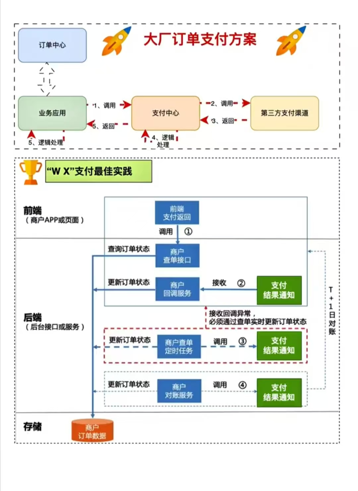