从今天之后的一段时间内，华仔会带着大家一起从零开始搭建并研发一套高并发的电商实战项目，这里会涉及到很多互联网大厂开发过程中所使用的核心技术和架构设计模式，希望大家学完之后可以用到自己的简历中。

接下来我们会重点架构设计和开发一下我们高并发电商实战前端 Web 项目的相关功能 。

这是第八十四篇，本篇我们继续进行电商实战项目设计与开发，本篇我们正式介绍一期项目最后一个重要模块之「**支付服务之安全攻防相关知识梳理**」。

文章汇总位置：[https://wx.zsxq.com/dweb2/index/columns/51122554151214](https://wx.zsxq.com/dweb2/index/columns/51122554151214)

源码授权与获取地址：[https://articles.zsxq.com/id\_1s85grnaae4p.html](https://articles.zsxq.com/id_1s85grnaae4p.html)

本章源码地址：[https://gitcode.net/u011359591/huazai-ecshop/-/tree/ecshop-chapter-84](https://gitcode.net/u011359591/huazai-ecshop/-/tree/ecshop-chapter-84)

## **01 前言**

上篇 [【电商实战项目第八十三篇】华仔电商实战支付服务业务介绍与支付宝、微信支付申请、接入](https://articles.zsxq.com/id_zi7dpq1wn0nl.html) 中，我们把「**支付服务**」相关业务场景、支付宝、微信支付使用场景、前期准备工作都梳理了一下，今天我们来重点梳理下整个电商实战项目中「**支付服务之安全攻防相关知识梳理**」。

##   
**02 安全攻防知识**

## **2.1 常见加密算法**

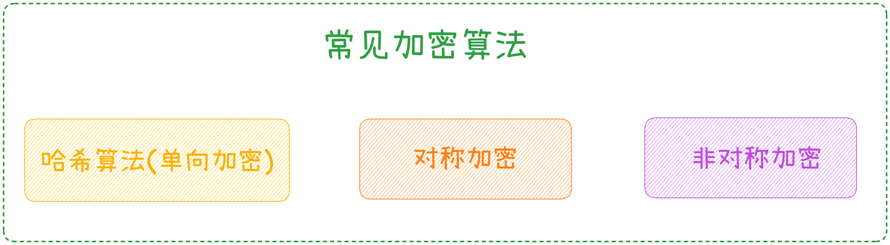

### **2.1.1 对称加密**

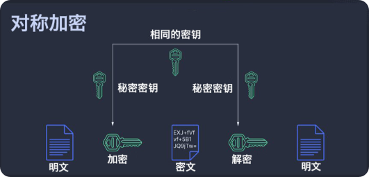

对称密钥算法(Symmetric-key algorithm)，又称为对称加密、私钥加密、共享密钥加密，是密码学中的一类加密算法。

其特点是，在加密和解密时使用相同的密钥，或是使用两个可以简单地相互推算的密钥。这一个或一组密钥需要在两个或多个成员之间共享，以便维持专属的通讯联系。

具体可以参考这篇：[https://blog.csdn.net/qq\_26721093/article/details/138759471](https://blog.csdn.net/qq_26721093/article/details/138759471)

### **2.2.1.1 优缺点**

1.  优点：操作比较简单,加密速度快,秘钥简单。
2.  缺点：秘钥上⾯，⼀旦被窃取，信息会暴露，安全性不⾼。

###   
**2.2.1.2 使用场景**

当消息发送⽅需要加密大量数据时使⽤。

### **2.2.1.3 常见算法**

1.  DES： 全称：Data Encryption Standard，现已被破解。
2.  3DES：全称: Triple Data Encryption Algorithm, 暂时未被破解。
3.  解释: 3DES 是在 DES 基础算法上的改良，该算法可向下兼容 DES 加密算法，但计算性能不⾼，暂时还未被破解
4.  AES: 全称：Advanced Encryption Standard，暂未被破解。

AES是目前最流行的对称加密算法，它支持前面描述的各种分组模式，而AES的核心算法，就是上述分组模式中的块加密与块解密。

AES块加密的基本逻辑是：先将密钥扩展为4个一组的N轮密钥；在执行块加密时，将输入的16个字节的明文块进一步拆分为4个小块，然后利用准备好的每一轮密钥对这四个小块做N轮的加密运算。

加密流程如下：

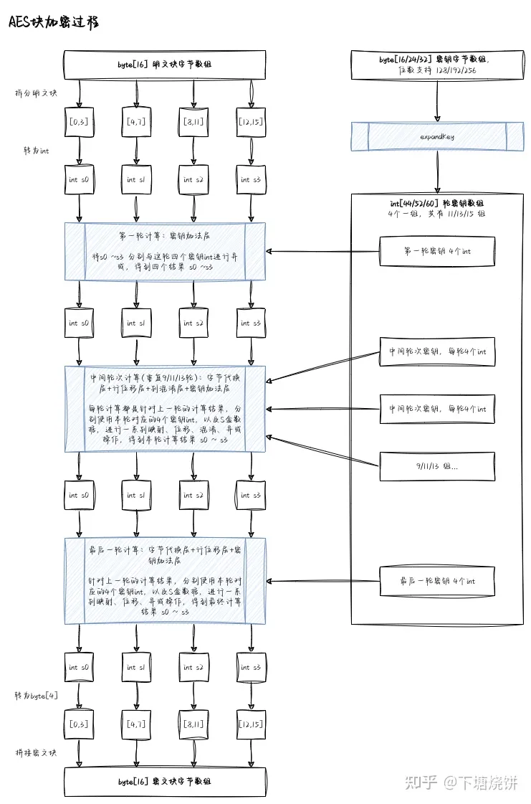

### **2.1.2 非对称加密**

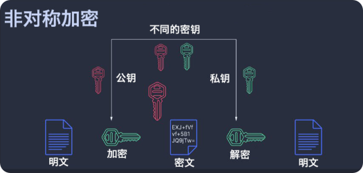

非对称加密，也称为公钥加密，是一种加密方式，相对于对称加密，它使用两个不同的密钥，一个公钥和一个私钥。公钥可以公开，任何人都可以使用它来加密消息，但只有私钥的持有者才能将其解密。

在非对称加密中，公钥和私钥是一对密钥，它们是由数学算法生成的。公钥可以被广泛分发，而私钥则必须保密。当A想要给B发送加密消息时，A使用B的公钥对消息进行加密，然后将密文发送给B。B收到密文后，使用自己的私钥进行解密，得到原始的消息。

具体可以参考这篇：[https://www.cnblogs.com/primihub/p/18267025](https://www.cnblogs.com/primihub/p/18267025)

> 注意：⾮对称加密具有双向性，即公钥和私钥中的任⼀个均可⽤作加密，此时另⼀个则⽤作解密

### **2.1.1.1 优缺点**

1.  优点：安全性更⾼，公钥是公开的，秘钥是⾃⼰保存的，不需要将私钥给别⼈。
2.  缺点：加密和解密花费时间⻓、速度慢，只适合对少量数据进⾏加密。

### **2.1.1.2 使用场景**

数字签名与验证。

### **2.1.1.3 常见算法**

RSA，DSA，ECC等，ECC也是⽐特币底层⽤的比较多的算法。

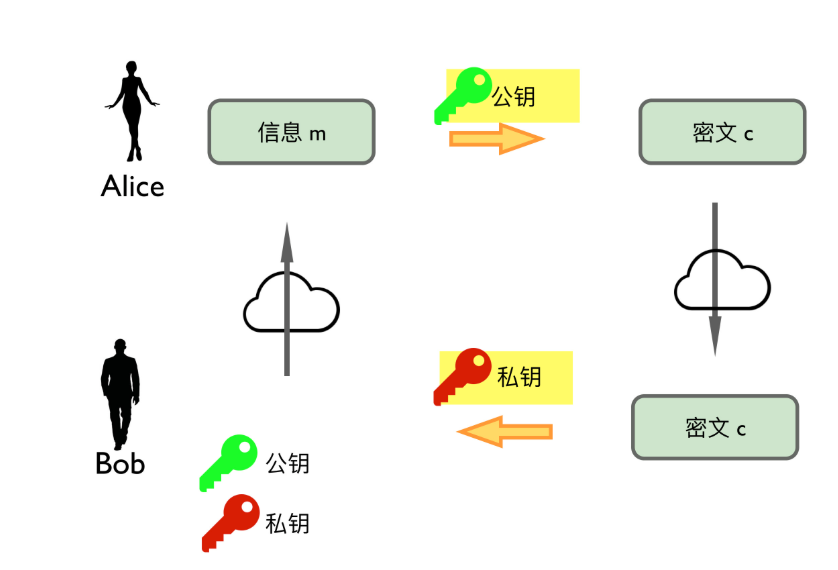

如图，咱们思考一下这个过程里面的安全性。暴露在互联网上的首先是「**公钥**」，然后是「**密文**」，非对称加密的算法本身是公开的。但是即使「**公钥密文算法**」都被攻击者拿到他也不能解密拿到信息的，所以整个过程是安全的。

非对称加密本身没有对称加密的鸡生蛋的问题，所以是当代密码学也就是互联网密码学的核心技术。同时，非对称加密可以帮忙解决对称加密的鸡生蛋问题，那就是先让 Alice 跟 Bob 用非对称加密的方式来互相共享一个对称加密的秘钥，然后再用对称加密的方式来传递大段信息。

互联网上通信一般都是把两种加密方式配合起来用的。

##   
**2.2 数据完整性保障-数据摘要**

### **2.2.1 Hash 算法-单向加密**

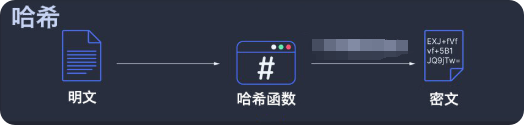

加密过程中不需要使⽤密钥，输⼊明⽂后由系统直接经过加密算法处理成密⽂，密⽂⽆法解密。

只有重新输⼊明⽂，并经过同样的加密算法处理，得到相同的密⽂并被系统重新识别后，才能真正解密。

### **2.2.1.1 优缺点**

1.  优点：
2.  数据完整性验证：哈希值可以用来验证数据是否被篡改。
3.  快速检索：在数据库等应用中，哈希值可以快速定位数据。
4.  匿名性：在某些匿名通信协议中，哈希可以用来保护用户身份。
5.  缺点：
6.  碰撞风险：存在找到两个不同输入产生相同输出的可能性，尽管这种概率非常低，但仍然是安全隐患。
7.  不可逆性：一旦数据被哈希，就无法从哈希值恢复原始数据（除非存在预计算表或彩虹表）。
8.  安全性问题：随着技术的发展，一些旧的哈希算法（如MD5和SHA-1）的安全性已经被证明不足，需要定期更新或替换。

### **2.2.1.2 使用场景**

⽂件完整性校验和(Checksum)算法、常规密码等。对称加密和⾮对称加密有秘钥，⽽只有hash摘要算法，没有秘钥。

### **2.2.1.3 常用算法**

1.  MD5
2.  优点：速度快，生成结果为128位。
3.  缺点：已被证明存在碰撞弱点，即存在不同的输入产生相同的输出。
4.  SHA-1
5.  优点：生成结果为160位，比MD5更安全。
6.  缺点：同样存在碰撞弱点，已被认为不再安全。
7.  SHA-256
8.  优点：属于SHA-2系列，生成结果为256位，比SHA-1更安全。
9.  缺点：虽然比SHA-1更安全，但在某些情况下仍可能受到攻击。
10.  SHA-3
11.  优点：是SHA-2的继任者，设计时考虑了安全性增强和抗攻击性。
12.  缺点：相对于SHA-256，SHA-3的计算速度略慢，但这是为了增加安全性。
13.  Blake2
14.  优点：设计时考虑了安全性，支持多种输出长度，速度快。
15.  缺点：相对较新，可能在某些旧的硬件或软件环境中缺乏支持。

### **2.2.2 彩虹表暴力破解**

⽹站：[https://www.cmd5.com/](https://www.cmd5.com/)

密码存储常⽤⽅式：

1.  双重MD5
2.  MD5+加盐
3.  双重MD5+加盐

##   
**2.3 支付平台非对称与对称加密应用**

⽀付宝和微信⽀付加密⽅式：采⽤ 「**RSA 非对称加密**」+「**对称加密**」混合使⽤。

商户应⽤和⽀付平台通信-都是采⽤ HTTPS 通信（「**CA 机构**」\+ 「**SSL 证书**」），业务参数使⽤⾮对称加密通讯：「**私钥加密**」\- 「**公钥解密**」。

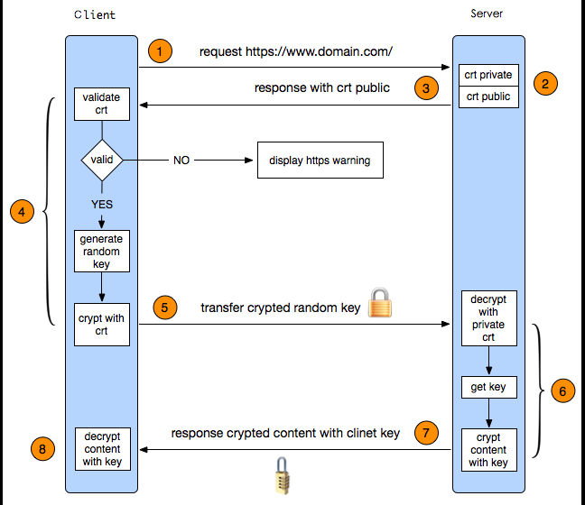

### **2.3.1 支付宝非对称加密通信流程**

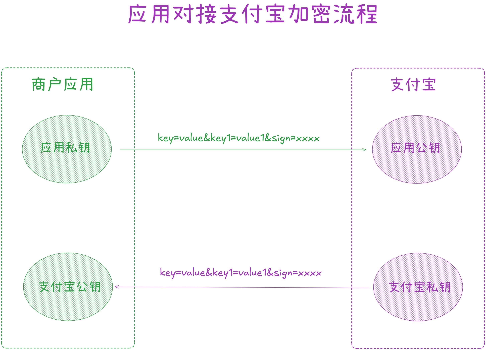

这里为什么需要两套公钥与私钥：

1.  ⼀套是⽤来保证步骤 【统⼀下单】时的信息安全。
2.  ⼀套是⽤来保证⽀付平台回调时的信息安全。

  
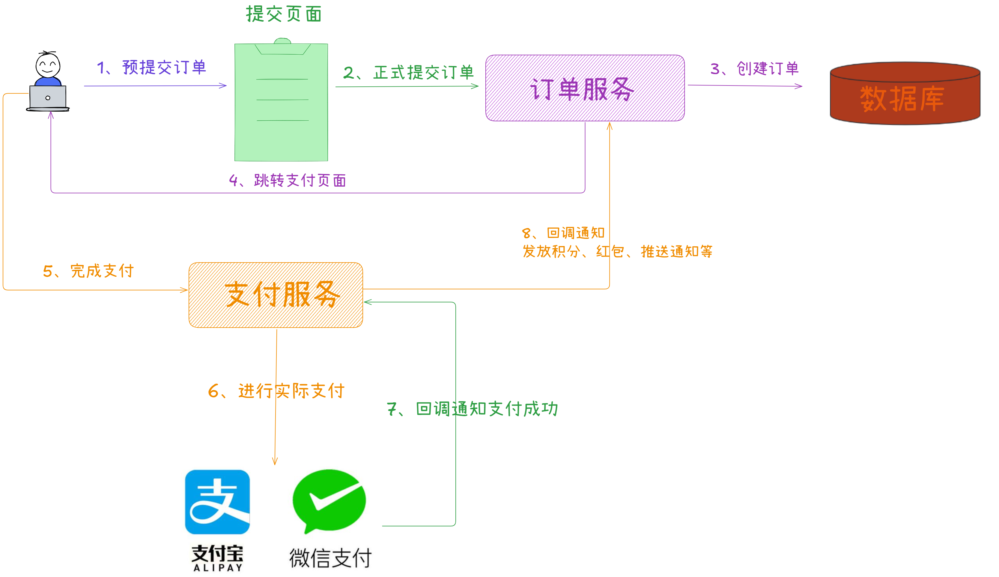

手机网站支付文档地址：[https://opendocs.alipay.com/apis/api\_1/alipay.trade.wap.pay?scene=API002020081300013628](https://opendocs.alipay.com/apis/api_1/alipay.trade.wap.pay?scene=API002020081300013628)

项目依赖包添加和样例代码：[https://opendocs.alipay.com/common/02kkv2?pathHash=358ff034](https://opendocs.alipay.com/common/02kkv2?pathHash=358ff034)

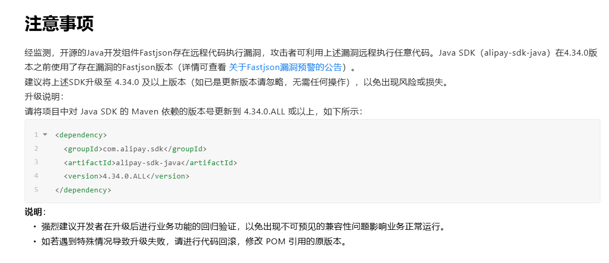

### **2.3.1.1 支付宝开发助手**

⽀付宝开放平台开发助⼿即密钥⽣成⼯具，⽤于对应⽤的客户端服务端之间的交互进⾏加密保护。⼯具主要功能有⽣成密钥、签名、验签、格式转换、密钥匹配、智能反馈、开放社区等。

文档地址：[https://opendocs.alipay.com/common/02kipl?pathHash=84adb0fd](https://opendocs.alipay.com/common/02kipl?pathHash=84adb0fd)

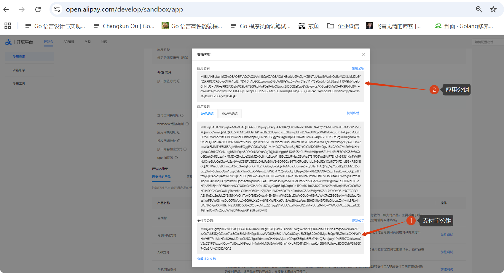