从今天之后的一段时间内，华仔会带着大家一起从零开始搭建并研发一套高并发的电商实战项目，这里会涉及到很多互联网大厂开发过程中所使用的核心技术和架构设计模式，希望大家学完之后可以用到自己的简历中。

接下来我们会重点架构设计和开发一下我们高并发电商实战项目中的「**后管服务创建优惠券服务**」。

这是第六十一篇，本篇我们继续进行电商实战项目设计与开发，本篇对「**优惠券后管服务**」中优惠券模板创建功能开发。

文章汇总位置：[https://wx.zsxq.com/dweb2/index/columns/51122554151214](https://wx.zsxq.com/dweb2/index/columns/51122554151214)

源码授权与获取地址：[https://articles.zsxq.com/id\_1s85grnaae4p.html](https://articles.zsxq.com/id_1s85grnaae4p.html)

本章源码地址：[https://gitcode.net/u011359591/huazai-ecshop/-/tree/ecshop-chapter-61](https://gitcode.net/u011359591/huazai-ecshop/-/tree/ecshop-chapter-61)

## **01 前言**

终于要设计与研发电商项目代码了，今天我们主要对「**优惠券后管服务**」中优惠券模板创建功能开发。

前面两篇我们搞了后管服务以及对接了「**权限管理**」、「**后台账号、角色服务**」、「**商品相关服务**」、「**美食笔记服务**」、「**用户管理服务**」等模块，接下来我们重点来设计并开发一下「**优惠券后管服务**」相关功能。

## **02 创建优惠券模板**

## **2.1 创建优惠券模板流程分析**

我们先来分析下创建优惠券模板的流程图，优惠券分为「**平台优惠券**」和「**店铺优惠券**」，其中「**平台优惠券**」由平台运营人员创建和管理员审批；而由商家在商家后台直接创建，无需审核。

  
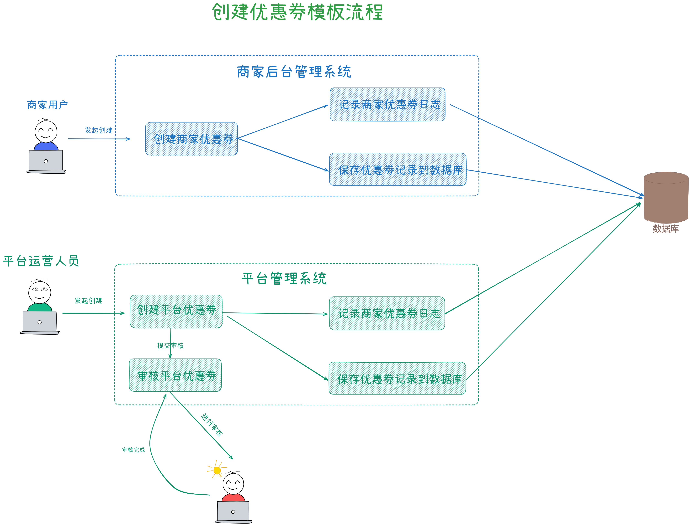

##   
**2.2 优惠券模板数据表**

目前需要两张数据表，如下：

CREATE TABLE \`coupon\_template\` (

\`id\` bigint NOT NULL AUTO\_INCREMENT COMMENT 'ID',

\`coupon\_name\` varchar(256) CHARACTER SET utf8mb4 COLLATE utf8mb4\_general\_ci DEFAULT '' COMMENT '优惠券名称',

\`shop\_number\` bigint NOT NULL DEFAULT '0' COMMENT '店铺编号',

\`coupon\_category\` tinyint(1) NOT NULL DEFAULT '0' COMMENT '优惠券分类 0:商家券 1:平台券',

\`coupon\_target\` tinyint(1) NOT NULL DEFAULT '0' COMMENT '优惠对象 0:商品专属 1:全店通用 2: 无门槛',

\`product\_id\` json NOT NULL COMMENT '优惠商品id，数组格式',

\`coupon\_type\` tinyint(1) NOT NULL DEFAULT '0' COMMENT '优惠券类型 0:立减券 1:满减券 2:折扣券',

\`receive\_type\` tinyint(1) NOT NULL DEFAULT '0' COMMENT '优惠券领取方式 0:手动领取 1:新人券 2:赠送券 3:会员券',

\`coupon\_start\_time\` datetime DEFAULT CURRENT\_TIMESTAMP COMMENT '优惠券有效期开始时间',

\`coupon\_end\_time\` datetime DEFAULT CURRENT\_TIMESTAMP COMMENT '优惠券有效期结束时间',

\`coupon\_count\` int NOT NULL DEFAULT '0' COMMENT '优惠券发行数量',

\`coupon\_received\_count\` int NOT NULL DEFAULT '0' COMMENT '优惠券已经领取的数量',

\`coupon\_receive\_rule\` json DEFAULT NULL COMMENT '优惠券领取规则',

\`coupon\_consume\_rule\` json DEFAULT NULL COMMENT '优惠券消耗规则',

\`coupon\_status\` tinyint(1) NOT NULL DEFAULT '0' COMMENT '优惠券状态 0:生效中 1:已结束',

\`coupon\_audit\_status\` tinyint(1) NOT NULL DEFAULT '0' COMMENT '优惠券审核状态 0:待审核 1:已通过 2:已驳回',

\`coupon\_del\` tinyint(1) NOT NULL DEFAULT '0' COMMENT '删除标识 0:未删除 1:已删除',

\`create\_time\` datetime DEFAULT CURRENT\_TIMESTAMP COMMENT '创建时间',

\`update\_time\` datetime DEFAULT CURRENT\_TIMESTAMP ON UPDATE CURRENT\_TIMESTAMP COMMENT '修改时间',

PRIMARY KEY (\`id\`),

KEY \`idx\_shop\_number\` (\`shop\_number\`) USING BTREE

) ENGINE\=InnoDB AUTO\_INCREMENT\=1 DEFAULT CHARSET\=utf8mb4 COLLATE=utf8mb4\_general\_ci COMMENT\='优惠券模板表';

CREATE TABLE \`coupon\_template\_log\` (

\`id\` bigint NOT NULL AUTO\_INCREMENT COMMENT 'ID',

\`coupon\_template\_id\` bigint NOT NULL DEFAULT '0' COMMENT '优惠券模板ID',

\`operator\_uid\` bigint NOT NULL DEFAULT '0' COMMENT '操作人',

\`operation\_log\` text CHARACTER SET utf8mb4 COLLATE utf8mb4\_general\_ci COMMENT '操作日志',

\`operation\_original\_data\` varchar(1024) CHARACTER SET utf8mb4 COLLATE utf8mb4\_0900\_ai\_ci DEFAULT NULL COMMENT '原始数据',

\`operation\_updated\_data\` varchar(1024) CHARACTER SET utf8mb4 COLLATE utf8mb4\_0900\_ai\_ci DEFAULT NULL COMMENT '修改后数据',

\`create\_time\` datetime DEFAULT CURRENT\_TIMESTAMP COMMENT '创建时间',

PRIMARY KEY (\`id\`)

) ENGINE\=InnoDB DEFAULT CHARSET\=utf8mb4 COLLATE=utf8mb4\_general\_ci COMMENT\='优惠券模板操作日志表';

其中优惠券「**领取规则**」、「**消耗规则**」会经常变化，所以这里采用 JSON 来存储，后续随着业务的发展发生变化就不需要改动表字段，直接改动 JSON 内容即可。

其中规则配置如下：

// coupon\_receive\_rule 示例

{

"perUserLimit": 5, // 每人限领

"usageInstructions": "xxx" // 使用说明

}

// coupon\_consume\_rule 示例（满减券）

{

"useLimit": 100, // 使用条件 满 x 元可用

"maxAmountLimit": 10000, // 最大优惠券金额

"timeLimitPeriod": 48, // 自领取优惠券后有效时间，单位小时

}

## **2.3 基于责任链设计模式来创建优惠券模板**

### **2.3.1 什么是责任链设计模式**

先来看下什么是「**责任链设计模式**」。

「**责任链设计模式**」的英文翻译是 Chain Of Responsibility Design Pattern。在 GoF 的《设计模式》中，它是这么定义的：

Avoid coupling the sender of a request to its receiver by giving more than one object a chance to handle the request. Chain the receiving objects and pass the request along the chain until an object handles it.

简单翻译如下：将请求的发送和接收解耦，让多个接收对象都有机会处理这个请求。将这些接收对象串成一条链，并沿着这条链传递这个请求，直到链上的某个接收对象能够处理它为止。

简单来说：在该设计模式中，多个处理器（也就是刚刚定义中说的“接收对象”）依次处理同一个请求。一个请求先经过 A 处理器处理，然后再把请求传递给 B 处理器，B 处理器处理完后再传递给 C 处理器，以此类推，形成一个链条。链条上的每个处理器各自承担各自的处理职责，因此叫作「**责任链模式**」，如下图所示：

  
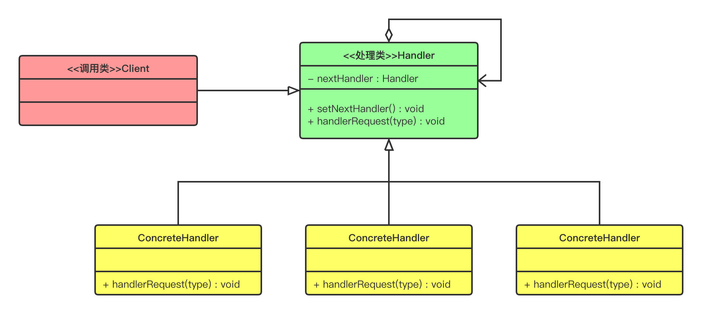

如果还不理解的话，再给大家举个例子，SpringMvc 中可以定义拦截器，并且可以定义多个。当一个用户发起请求时，顺利的话请求会经过所有拦截器，最终到达业务代码逻辑，SpringMvc 拦截器设计就是使用了「**责任链设计模式**」。

为什么说顺利的话会经过所有拦截器？这是因为请求不满足拦截器自定义规则会被打回，但这并不是「**责任链设计模式**」的唯一处理方式，继续往下看。

在「**责任链设计模式**」中，多个处理器依次处理同一个请求。一个请求先经过 A 处理器处理，然后再把请求传递给 B 处理器，B 处理器处理完后再传递给 C 处理器，以此类推，形成一个链条，链条上的每个处理器「**各自承担各自的处理职责**」**。**

责任链模式中多个处理器形成的处理器链在进行处理请求时，有两种处理方式：

1.  请求会被**所有的处理器都处理一遍，不存在中途终止的情况**，可以参照 MyBatis 拦截器理解。
2.  处理器链执行请求中，某一处理器执行时，**如果不符合自定义规则的话，就会停止流程，并且生效的未执行处理器并不会执行了**，可以参照 SpringMvc 拦截器理解。

下面通过代码来展示两种方式的不同：

### **2.3.1.1 非终止模式**

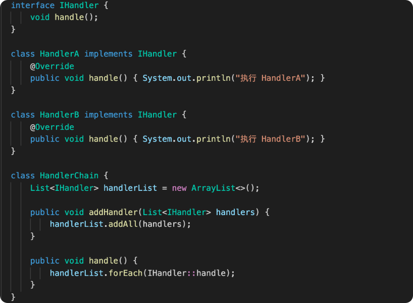

可以看出，[IHandler](http://ihandler%20/) 负责抽象处理器行为，[handle()](http://handle\(\)/) 则是不同处理器具体需要执行的方法，[HandleA](http://handlea/)、[HandleB](http://handleb%20/) 为具体需要执行的处理器类，[HandlerChain](http://handlerchain%20/) 则是将处理器串成一条链执行的处理器链。

这种责任链执行方式会将所有的**处理器都会全部执行一遍**，不会被打断。Mybatis 拦截器用的正是此类型，这种类型**重点在对请求过程中的数据或者行为进行改变****。**

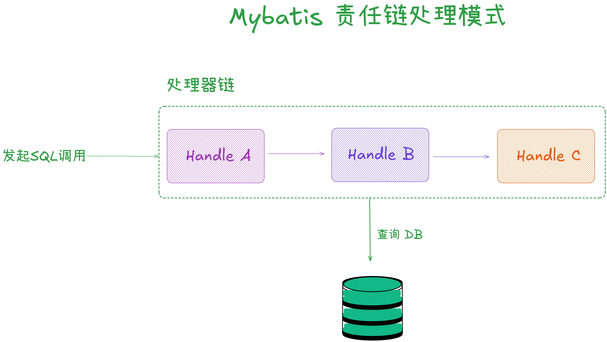

###   
**2.3.1.2 终止模式**

而另外一种责任链模式实现，则是会对请求**有阻断作用**，阻断产生的前置条件是在处理器中自定义的，代码中的实现较简单，可以参考 SpringMvc 拦截器的实现流程。

  
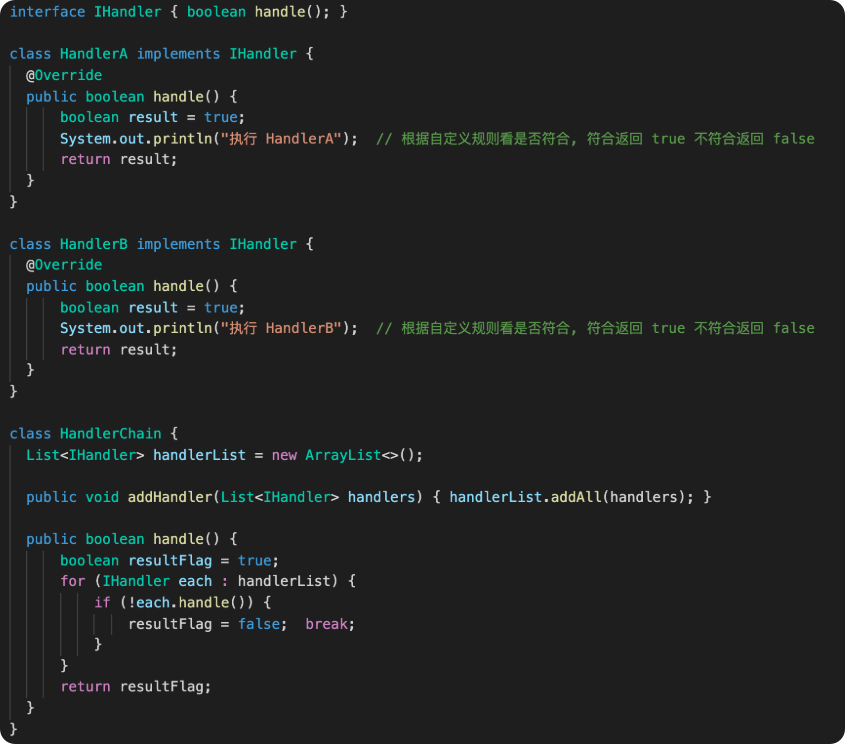

根据代码看的出来，在每一个 [IHandler](http://%20ihandler%20/) 实现类中会返回一个布尔类型的返回值，如果返回布尔值为 false，那么责任链发起类会中断流程，剩余处理器将不会被执行。就像我们定义在 SpringMvc 中的 Token 拦截器，如果 Token 失效就不能继续访问系统，处理器将请求打回。

  
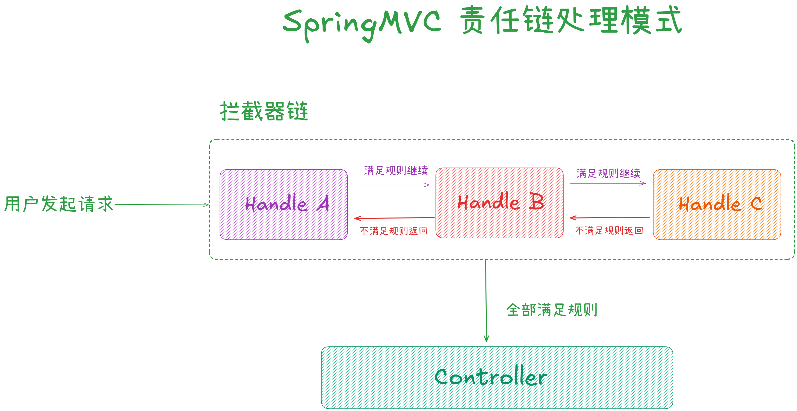

### **2.3.2 责任链业务场景设计及好处**

假设，当我们**系统处在一个下游系统**，因为业务需求系统中所使用的**基础数据需要从上游中台同步到系统数据库**。

基础数据包含了很多类型数据，**只要是人为录入就可能会存在问题，遵从对上游系统不信任原则**，需要对数据接收时进行一系列校验。

最初是要进行一系列验证原则才能入库的，从我们系统的接入数据规则而言，个人觉得需要支持以下几套规则：

1.  **必填项校验**：如果数据无法满足业务所必须字段要求，数据一旦落入库中就会产生一系列问题。
2.  **非法字符校验**：因为数据如何录入，上游系统的录入规则是什么样的我们都不清楚，这项规则也是必须的。
3.  **长度校验**：同上如果系统某字段长度限制 100，但是接入来的数据 200 长度，这也会造成问题。
4.  等等。

当然真实中不止这三套。**一旦将责任链设计模式嵌入数据同步流程**，就会**完全符合开闭原则，提高代码的扩展性**。

这里要再强调下，**设计模式的应用场景一定要灵活掌握**，只有这样才能在合适的业务场景合理运用对象的设计模式。

这里为什么要采用**责任链设计模式**来实现呢？

如果不使用责任链模式，上面说的真实同步场景面临两个问题：

1.  代码逻辑和校验规则需要写到一起，**那么这个类/方法会奇大无比**。减少代码复杂性一贯方法是：**将大块代码逻辑拆分成函数，将大类拆分成小类**，是应对代码复杂性的常用方法。这样拆分是能解决代码复杂性，但是还会面临第二个问题。
2.  **开闭原则**：添加一个新的功能应该是在已有代码基础上扩展代码，而非修改已有代码。大家设想一下，假设你写了三套校验规则，运行过一段时间，这时候领导让加第四套，是不是要在原有代码上改动。

### **2.3.3 责任链设计模式创建模板流程**

这里我们采用同 SpringMVC 拦截器链模式的处理器方式，整个处理流程图如下：

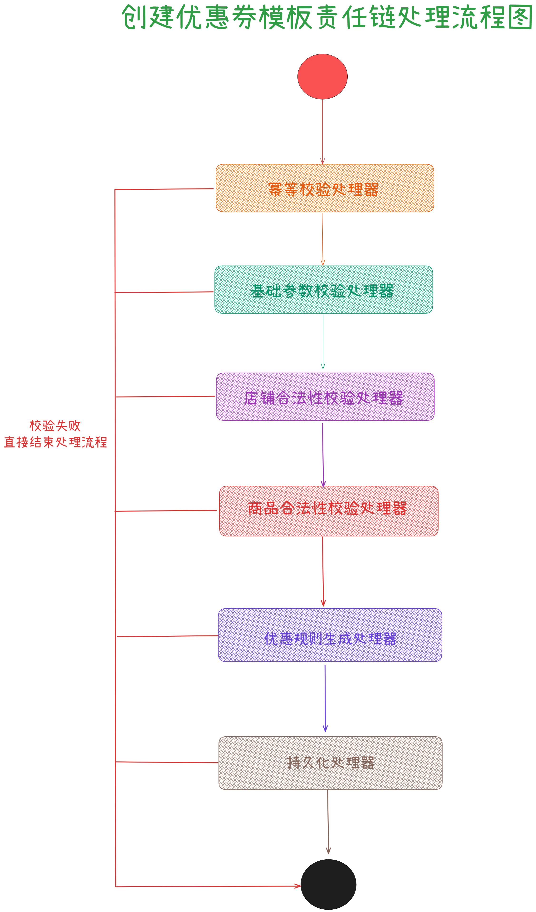

### **2.3.3.1 责任链处理器梳理**

这里我们先来梳理下都有哪些处理器，如下：

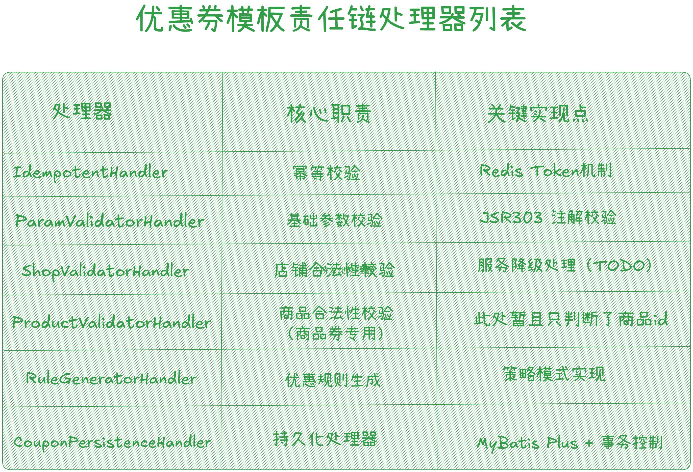

代码目录结构如下：

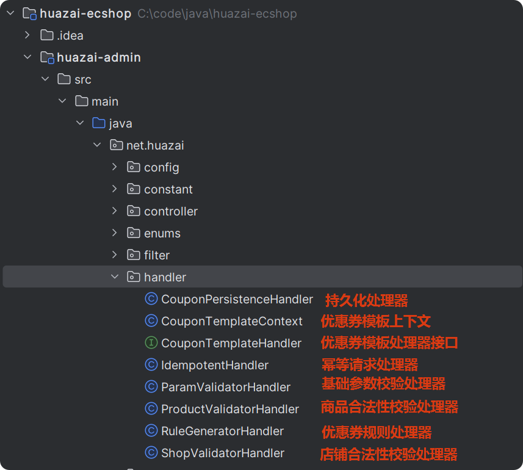

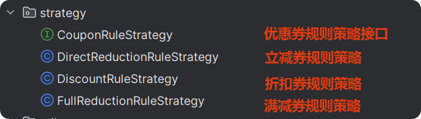

### **2.3.3.2 责任链处理器实现**

具体代码实现：

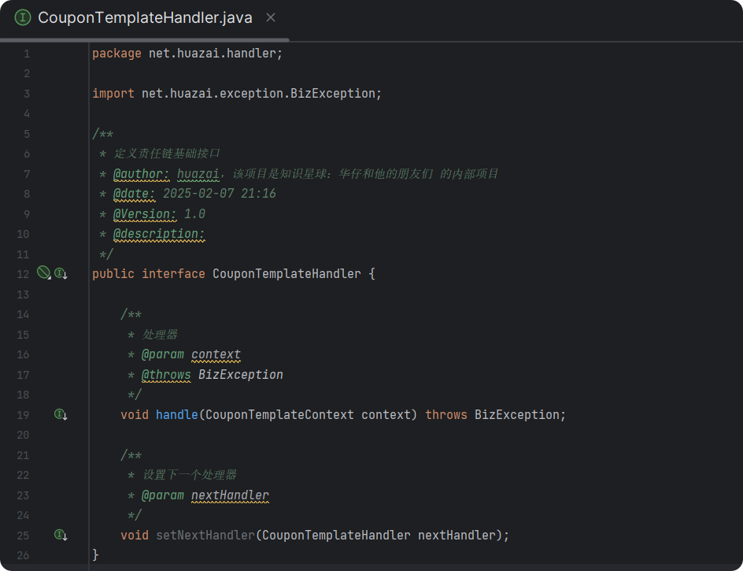

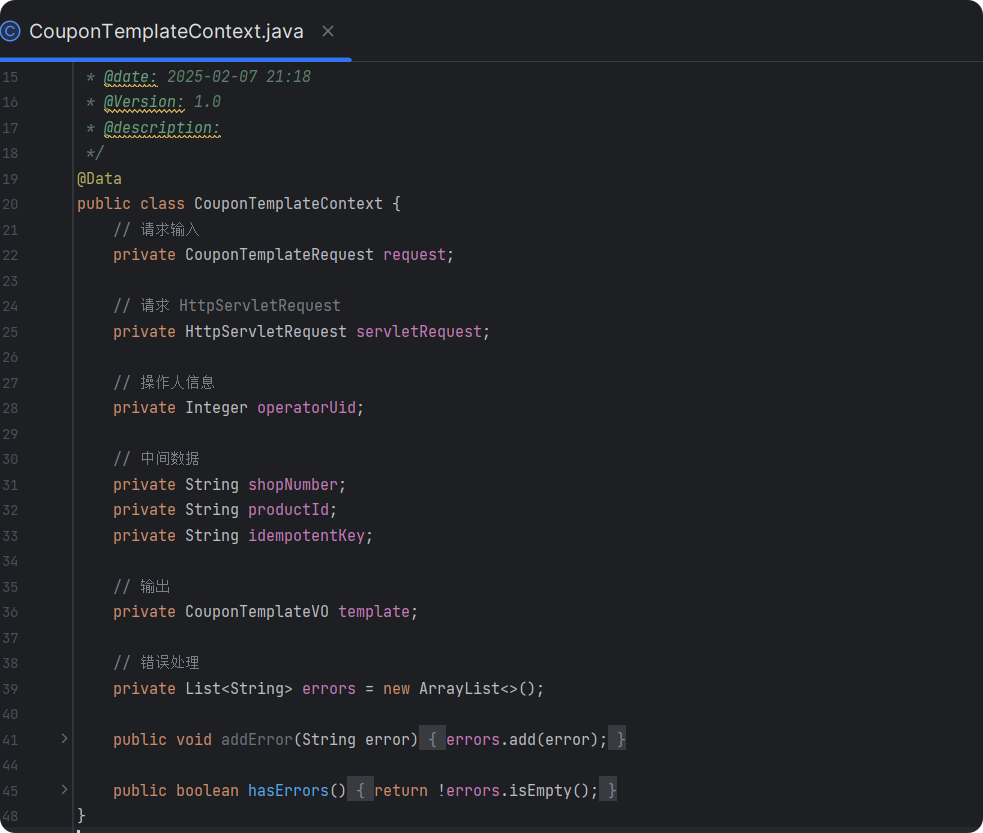

这里来看几个处理器的实现，具体详细的自行查看源代码即可。

**1、幂等请求校验处理器**

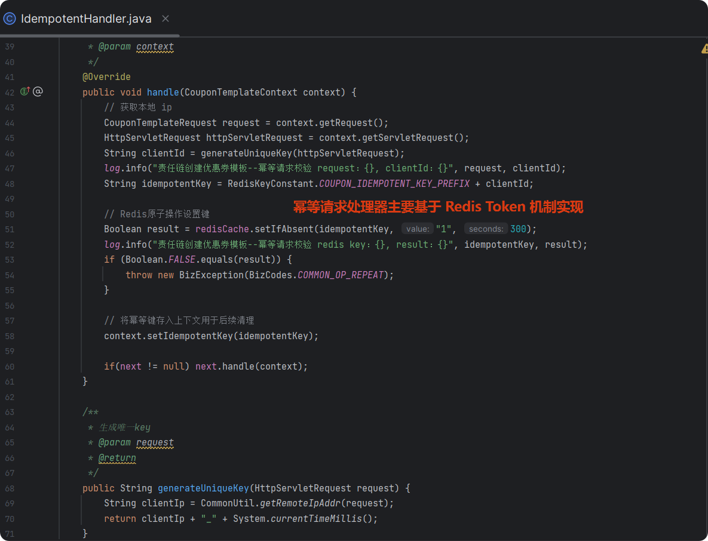

**2、优惠券规则生成处理器**

/\*\*

\* @className: 规则生成处理器 RuleGeneratorHandler

\* @author: huazai，该项目是知识星球：华仔和他的朋友们 的内部项目

\* @date: 2025-02-07 23:29

\* @Version: 1.0

\* @description:

\*/

@Component

@Order(500)

@Slf4j

public class RuleGeneratorHandler implements CouponTemplateHandler {

/\*\*

\* 定义下一个处理器

\*/

private CouponTemplateHandler next;

/\*\*

\* 策略

\*/

private final Map<CouponType, CouponRuleStrategy> strategies;

// 策略模式注入

public RuleGeneratorHandler(

@Qualifier("directReductionRuleStrategy") CouponRuleStrategy directReductionRuleStrategy,

@Qualifier("discountRuleStrategy") CouponRuleStrategy discountStrategy,

@Qualifier("fullReductionRuleStrategy") CouponRuleStrategy fullReductionStrategy

) {

strategies = Map.of(

CouponType.INSTANT, directReductionRuleStrategy,

CouponType.DISCOUNT, discountStrategy,

CouponType.FULL\_REDUCTION, fullReductionStrategy

);

}

/\*\*

\* 当前处理器

\* @param context

\*/

@Override

public void handle(CouponTemplateContext context) {

if (context == null) {

log.error("责任链创建优惠券模板--规则生成处理器 context：{}", context);

throw new IllegalArgumentException("CouponTemplateContext cannot be null");

}

CouponTemplateRequest request \= context.getRequest();

if (request == null) {

log.error("责任链创建优惠券模板--规则生成处理器 request：{}", request);

throw new IllegalArgumentException("CouponTemplateRequest in context cannot be null");

}

CouponType couponType \= CouponType.fromCodeNum(request.getCouponType());

CouponRuleStrategy strategy \= strategies.get(couponType);

log.info("责任链创建优惠券模板--规则生成处理器 couponType：{}, strategy：{}", couponType, strategy);

if (strategy == null) {

log.error("责任链创建优惠券模板--规则生成处理器 strategy 为空：{}", strategy);

throw new BizException(BizCodes.ADMIN\_COUPON\_RULE\_GENERATE\_ERROR);

}

String ruleJson \= strategy.generateRule(context.getRequest());

log.info("责任链创建优惠券模板--规则生成处理器 ruleJson：{}", ruleJson);

context.getTemplate().setCouponConsumeRule(ruleJson);

if(next != null) next.handle(context);

}

/\*\*

\* 设置下一个处理器

\* @param next

\*/

@Override

public void setNextHandler(CouponTemplateHandler next) {

this.next = next;

}

}

**3、持久化优惠券模板处理器**

/\*\*

\* @className: 持久化处理器 CouponPersisterHandler

\* @author: huazai，该项目是知识星球：华仔和他的朋友们 的内部项目

\* @date: 2025-02-07 23:59

\* @Version: 1.0

\* @description:

\*/

@Component

@Order(700)

@Transactional(propagation = Propagation.REQUIRED)

@Slf4j

public class CouponPersistenceHandler implements CouponTemplateHandler {

@Autowired

private CouponTemplateMapper templateMapper;

@Autowired

private CouponTemplateLogMapper couponTemplateLogMapper;

/\*\*

\* 定义下一个处理器

\*/

private CouponTemplateHandler next;

/\*\*

\* 当前处理器

\* @param context

\*/

@Override

public void handle(CouponTemplateContext context) {

CouponTemplateVO template \= context.getTemplate();

// 重新获取下 shopNumber

template.setShopNumber(context.getShopNumber());

List<String> productIdList = Arrays.asList(context.getProductId().split(","));

ObjectMapper objectMapper \= new ObjectMapper();

try {

String productIdsJson \= objectMapper.writeValueAsString(productIdList);

log.info("责任链创建优惠券模板--持久化处理器 json productId：{}", productIdsJson);

template.setProductId(productIdsJson);

} catch (JsonProcessingException e) {

log.error("责任链创建优惠券模板--持久化处理器处理商品id出现异常 e：{}", e.toString());

throw new RuntimeException(e);

}

CouponTemplateDO couponTemplateDO \= new CouponTemplateDO();

BeanUtils.copyProperties(template, couponTemplateDO);

log.info("责任链创建优惠券模板--持久化处理器 template：{}, couponTemplateDO：{}", template, couponTemplateDO);

int rows \= templateMapper.insert(couponTemplateDO);

log.info("责任链创建优惠券模板-持久化处理器：rows：{}, couponTemplateDO：{}", rows, couponTemplateDO);

// 记录日志信息

saveTemplateExtend(couponTemplateDO.getId(), context);

if(next != null) next.handle(context);

}

/\*\*

\* 记录日志信息

\* @param context

\*/

private void saveTemplateExtend(Long id, CouponTemplateContext context) {

CouponTemplateLogDO logDO \= new CouponTemplateLogDO();

log.info("责任链创建优惠券模板--持久化处理器 记录日志信息 templateId：{}, uid：{}, context：{}", id, context.getOperatorUid(), context.getRequest().toString());

logDO.setCouponTemplateId(id);

logDO.setOperatorUid(context.getOperatorUid().longValue());

logDO.setOperationLog("创建优惠券模板" + context);

logDO.setOperationOriginalData(context.getRequest().toString());

logDO.setOperationUpdatedData("");

int rows \= couponTemplateLogMapper.insert(logDO);

log.info("责任链创建优惠券模板-持久化处理器：rows：{}, logDO：{}", rows, logDO);

}

/\*\*

\* 设置下一个处理器

\* @param next

\*/

public void setNextHandler(CouponTemplateHandler next){

this.next = next;

}

}

### **2.3.3.3 责任链规则策略实现**

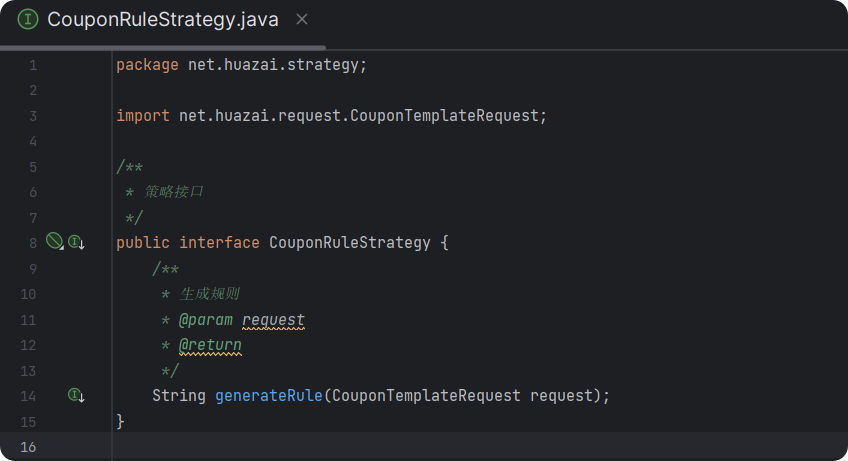

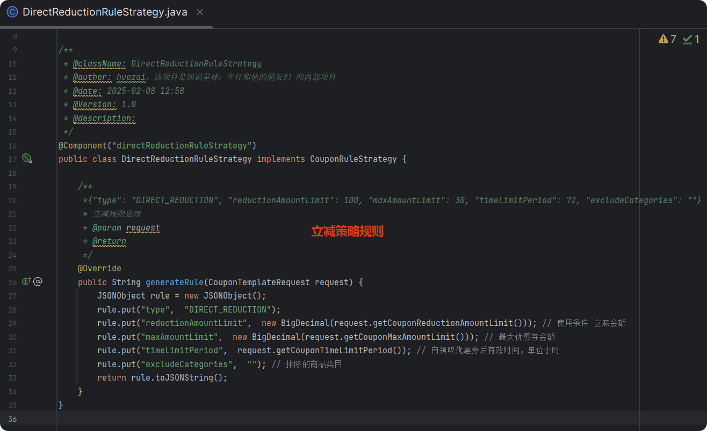

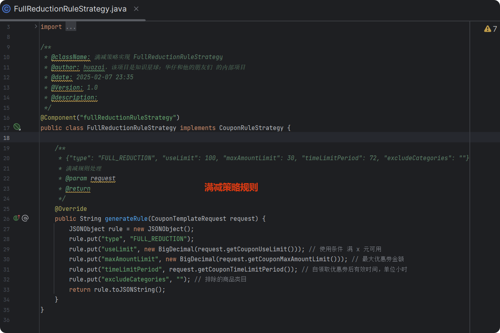

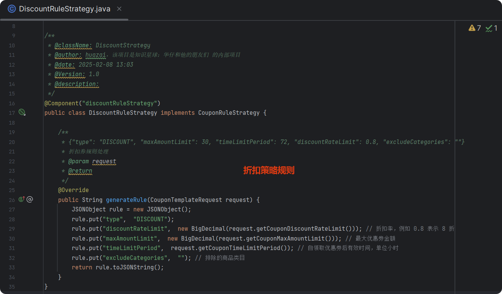

### **2.3.3.4 责任链创建优惠券模板**

/\*\*

\* 基于责任链设计模式创建优惠券模板

\* @param request CouponRequest 新增参数

\* @return

\*/

@Override

@Transactional(rollbackFor = Exception.class)

public boolean create(CouponTemplateRequest request) {

/\*\*

\* 获取责任链上下文

\*/

CouponTemplateContext context \= new CouponTemplateContext();

// 设置请求体

context.setRequest(request);

LoginUserVO loginUserVo \= SecurityUtil.getLoginUserVo();

// 设置操作人

context.setOperatorUid(loginUserVo.getUser().getId());

try {

// 初始化模板对象

initTemplate(context);

// 添加空检查

if (handlers == null || handlers.isEmpty()) {

log.error("责任链创建优惠券模板出现异常，处理器未配置");

throw new IllegalStateException("责任链处理器未配置");

}

// 按 Order 顺序执行责任链相关处理器，这里的顺序是基于 @Order(xxx) 来进行排序的

handlers.stream()

.sorted(AnnotationAwareOrderComparator.INSTANCE)

.forEach(handler -> {

if (!context.hasErrors()) {

handler.handle(context);

}

});

if (context.hasErrors()) {

log.error("责任链创建优惠券模板出现异常：{}", context.getErrors());

throw new CompositeException(context.getErrors());

}

return context.getTemplate().getId() > 0;

} catch (Exception e) {

log.error("责任链创建优惠券模板出现异常2：{}", e.toString());

// 清理幂等Key

if (context.getIdempotentKey() != null) {

redisCache.delete(context.getIdempotentKey());

}

// 异常转换

handleException(e);

return false;

}

}

/\*\*

\* 初始化优惠券模板

\* @param context

\*/

private void initTemplate(CouponTemplateContext context) {

CouponTemplateRequest template \= context.getRequest();

template.setCouponStatus(false);

template.setCouponDel(false);

template.setCouponAuditStatus(1);

CouponTemplateVO couponTemplateVO \= new CouponTemplateVO();

BeanUtils.copyProperties(template, couponTemplateVO);

log.info("初始化优惠券模板,请求：{}, VO：{}", template, couponTemplateVO);

context.setTemplate(couponTemplateVO);

}

/\*\*

\* 处理异常

\* @param e

\* @return

\*/

private ApiResult handleException(Exception e) {

if (e instanceof BizException) {

BizException be \= (BizException) e;

log.error("责任链创建优惠券模板出现异常3：{}", be.getMessage());

return ApiResult.doError(be.getCode(), be.getMessage());

}

return ApiResult.doResult(BizCodes.COMMON\_SERVER\_ERROR);

}

测试结果如下：

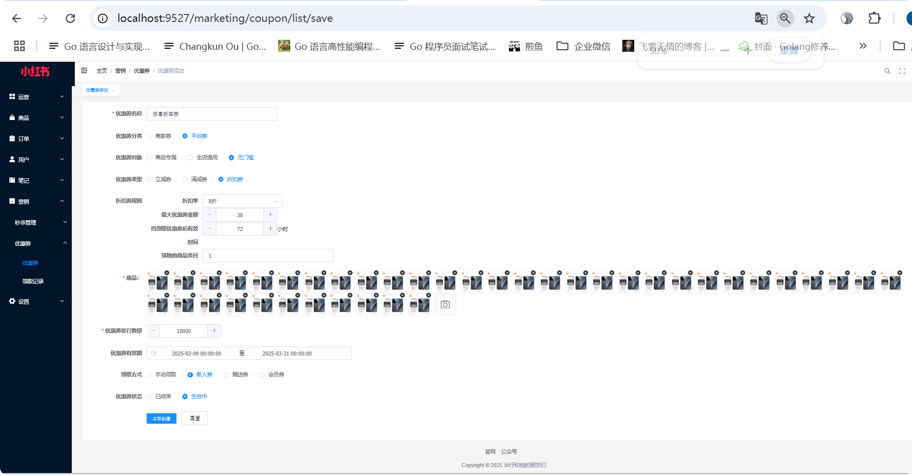

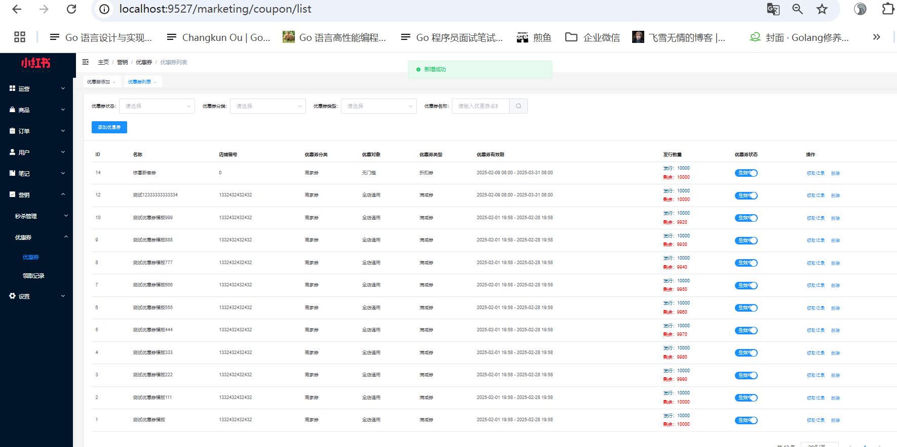

出现规则错误后如下：

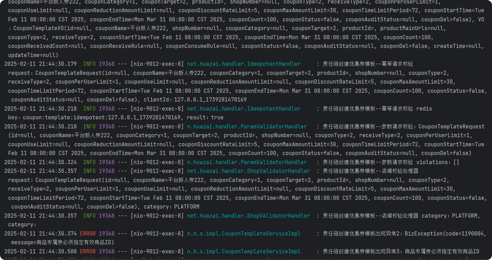

### **2.3.4 优惠券模板列表、删除、修改状态**

这些功能就比较简单了，主要是前端需要做下调整，具体代码实现自己查看。

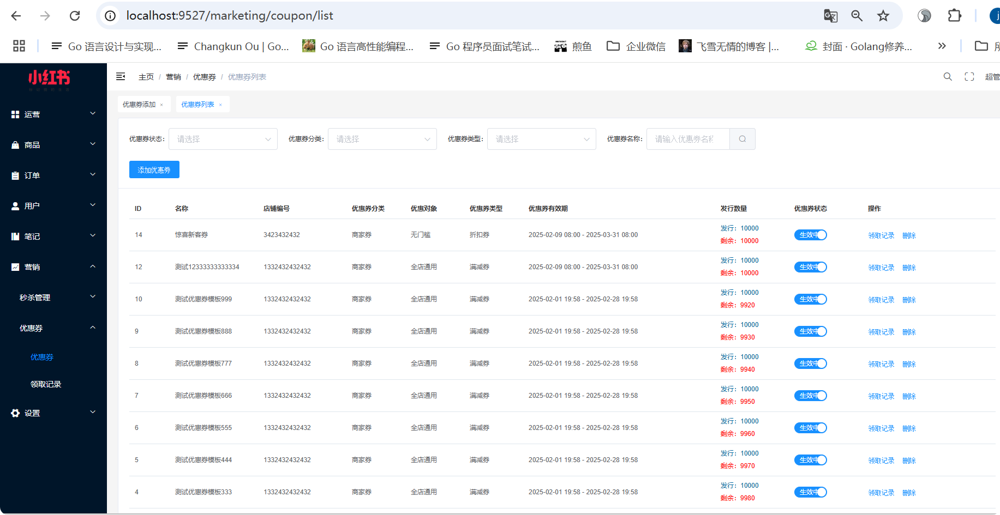

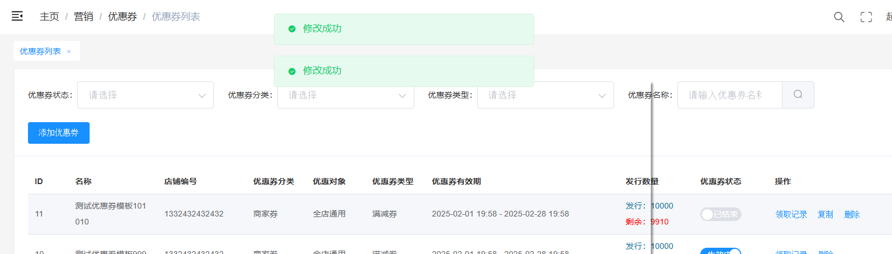

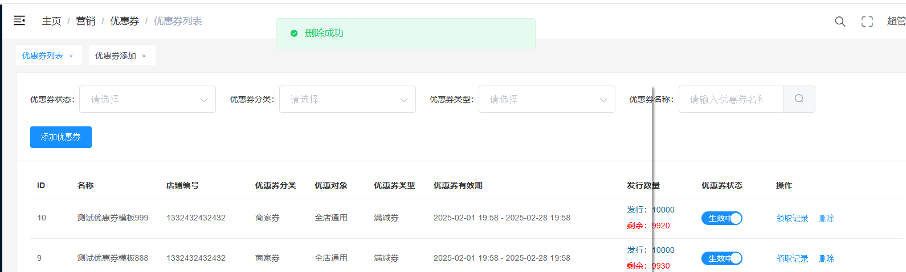