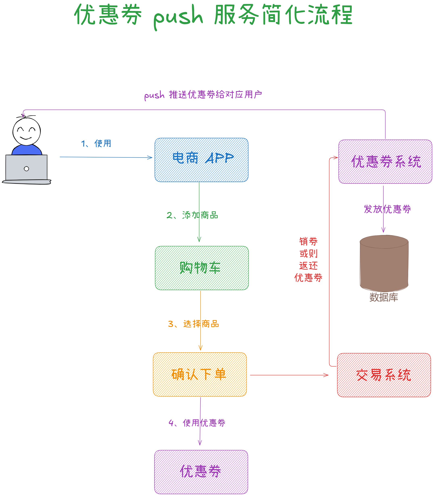
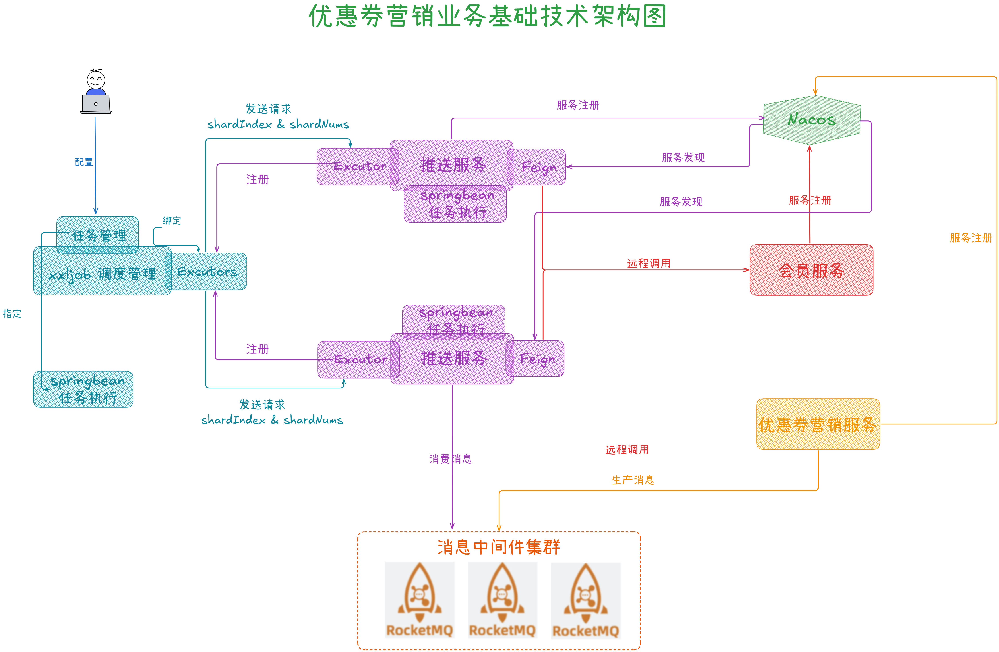
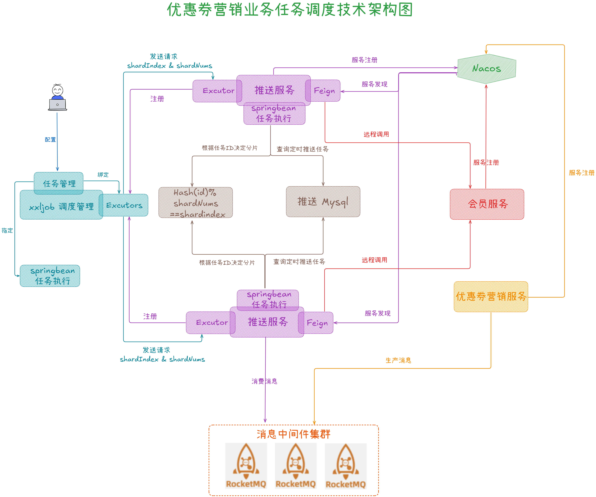
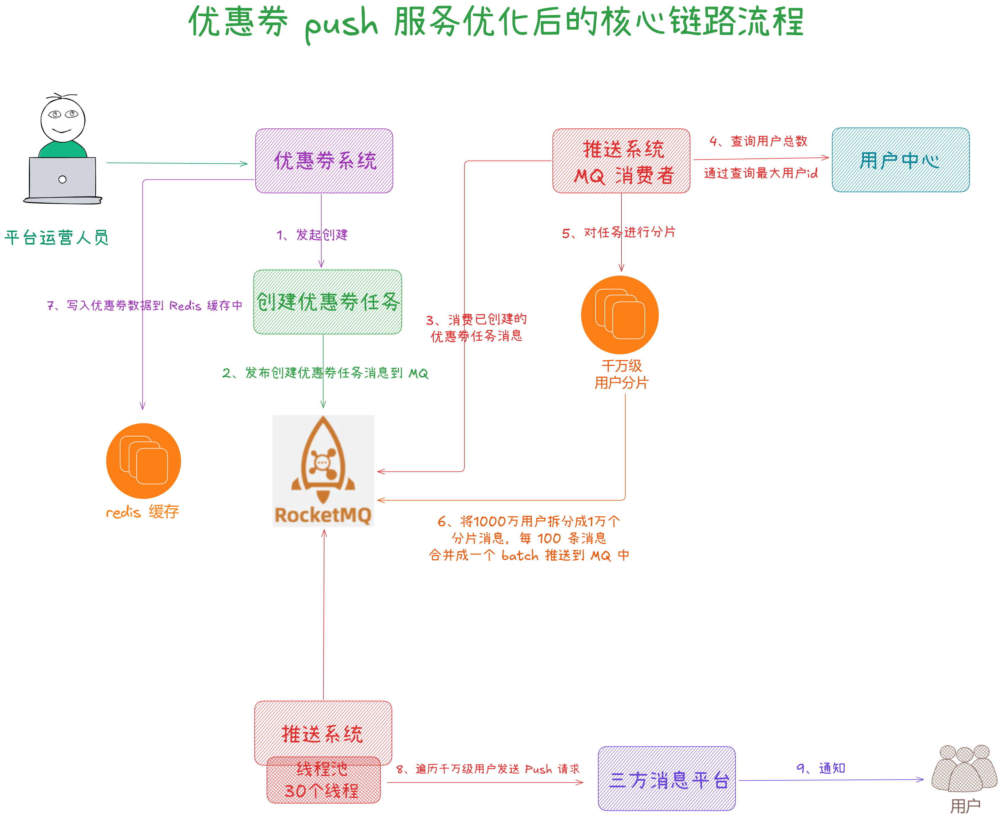

从今天之后的一段时间内，华仔会带着大家一起从零开始搭建并研发一套高并发的电商实战项目，这里会涉及到很多互联网大厂开发过程中所使用的核心技术和架构设计模式，希望大家学完之后可以用到自己的简历中。

接下来我们会重点架构设计和开发一下我们高并发电商实战项目中的「**后管服务优惠券服务**」。

这是第六十三篇，本篇我们继续进行电商实战项目设计与开发，本篇对「**优惠券后管服务**」中营销推送业务架构设计。

文章汇总位置：[https://wx.zsxq.com/dweb2/index/columns/51122554151214](https://wx.zsxq.com/dweb2/index/columns/51122554151214)

源码授权与获取地址：[https://articles.zsxq.com/id\_1s85grnaae4p.html](https://articles.zsxq.com/id_1s85grnaae4p.html)

本章源码地址：[https://gitcode.net/u011359591/huazai-ecshop/-/tree/ecshop-chapter-63](https://gitcode.net/u011359591/huazai-ecshop/-/tree/ecshop-chapter-63)

## **01 前言**

今天我们主要对「**优惠券后管服务**」中营销推送业务架构设计，本篇主要是业务架构设计，没有代码实现，为了保持分支的完整性和学习的连贯性，没有代码的分支也会保留。

##   
**02 优惠券营销业务场景分析**  

通常情况下，营销系统主要有「**优惠券**」和「**促销活动**」两种营销方式，这里我们重点分析 「**优惠券营销场景**」。

在 [【电商实战项目第五十八篇】华仔电商实战支撑千万级优惠券服务数据库设计及架构设计](https://articles.zsxq.com/id_5xzd7dh5ewmu.html) 这篇中已经简单剖析过，今天我们再来深度剖析下。

##   
**2.1 优惠券营销场景**

「**优惠券营销系统**」会发各种各样的优惠券给用户，让用户领券。有些APP也会不知不觉给用户发放一些优惠券，希望通过优惠券来吸引用户，让用户去购买商品。比如：新客券，当你浏览某个店铺或者商品时会弹出或者展示对应的优惠券，领取后会进行优惠。

当发送优惠券时，其实就是在数据库中给这个用户增加一条优惠券的数据，这样就完成了「**发券**」。但此时这个优惠券还不属于用户，需要用户去「**确认**」并且执行「**领券**」操作。这样在数据库中才有用户的一条优惠券数据，在后续的购买流程中用户才能「**用券**」。当用户使用了优惠券进行订单支付后，还要对该优惠券进行「**销券**」处理。

## **2.2 优惠券营销 push 场景**

当「**优惠券营销系统**」发放优惠券时，需要对用户进行 Push 推送通知用户可以「**领券**」，吸引用户购物和消费。

除了需要「**推送优惠券**」给用户吸引其来购物和消费外，还会定时「**推送热门商品**」。推荐系统会根据用户的历史商品浏览记录、商品购买记录，通过算法推导出用户可能感兴趣的商品及热门商品。

热门商品包括：浏览量最高的爆款、购买量最高的爆款、评价最高的爆款等。

整个推送服务底层会基于「**XXL-job**」来管理，一个简化流程如下:

## **03 优惠券营销业务架构设计**

## **3.1 优惠券营销基础技术架构**

大家都知道，我们的微服务都是以「**Nacos**」作为服务「**注册中心**」，当「**推送服务**」、「**优惠券营销服务**」、「**会员服务**」启动时都会向「**Nacos**」进行服务注册。「**推送服务**」、「**优惠券服务**」、「**会员服务**」通过服务「**注册中心**」拿到各系统的地址，就可以通过「**Feign**」进行相互间的服务提供和调用。

当需要进行消息推送时，会先部署一个「**RocketMQ**」消息中间件集群，然后将消息发送到「**RocketMQ**」集群，接着推送系统就可以从「**RocketMQ**」集群消费这些消息进行推送。

后续如果需要「**定时任务调度**」，那么就可能会涉及到「**XXL-job**」的调度。假设「**推送服务**」部署了多台机器，希望消费消息时能以「**分布式的方式**」在每个「**推送服务**」中处理一部分定时任务。此时就需要部署一个「**XXL-job**」调度管理中心，然后在上面配置一组「**Excutors**」。而每个「**推送服务**」如果要和「**XXL-job**」进行对接，也需要配置一组「**Excutors**」。

当「**推送服务**」启动后，它的「**Excutor**」会往「**XXL-job**」调度管理中心进行注册。这样「**XXL-job**」调度管理中心的某个「**Excutors**」便能知道各「**推送服务**」上「**Excutor**」的 IP 和端口号。

之后便可以通过「**XXL-job**」调度管理中心配置一个「**任务管理**」对「**定时任务**」进行管理，让「**定时任务**」可以绑定到一个「**Excutors**」分组上，也就是「**定时任务**」在执行时会发送请求给「**推送服务**」的「**Excutor**」来执行分布式调度任务的，最后「**推送服务**」的「**Excutor**」便会通过 SpringBean 方式来执行任务。

如下图所示：

## **3.2 分布式任务调度 XXL-job 执行原理**

当多个「**推送服务**」节点都要从数据库里查询同一批「**推送任务**」时，「**XXL-job**」是如何决定由谁来执行哪些任务？

举例说明：当从数据库查出同一批「**推送任务**」有10个，「**推送服务1**」可以执行其中 5 个任务，「**推送服务2**」可以执行另外 5 个任务。

下面来剖析下其执行过程：

1.  「**XXL-job**」首先要配置一组「**Excutors**」，「**推送服务**」在启动时就需要启动一个「**Excutor**」，并且会「**注册**」到「**XXL-job**」里指定名字的一个「**Excutors**」中。「**XXL-job**」收到「**推送服务 Excutor**」的注册请求后，会根据注册的名字把它们划分到对应的一组「**Excutors**」里面。
2.  然后开发便可以在「**XXL-job**」配置定时调度任务，「**绑定某组 Excutors**」以及「**指定执行任务的 SpringBean**」。当配置好的定时任务执行时间到达时，就会找到所绑定的「**Excutors**」，发送执行任务请求给「**推送服务 Excutor**」。
3.  「**推送服务 Excutor**」收到「**XXL-job**」发送的执行任务请求后，便会找到「**指定的 SpringBean 去执行任务**」。每个推送系统的「**SpringBean**」接着会从 MySQL 里查询出相关的推送任务。
4.  为了决定每个「**推送服务的 SpringBean**」该执行哪些推送任务。「**XXL-job**」在发送执行任务请求给「**推送服务 Excutor**」时，会带上「**shardIndex**」和「**shardNums**」。
5.  其中「**shardNums**」指的是当前执行定时任务的「**推送服务 Excutor**」一共有多少个节点，每一个节点可以认为是任务执行的分片。「**shardIndex**」就是对各个定时任务节点进行标号，比如发给「**推送服务1**」的 shardIndex=1，发送给「**推送服务2**」的 shardIndex=2。
6.  最后「**推送服务**」的「**SpringBean**」从数据库查出来一批推送任务时：就会根据任务 ID 的 Hash 值对「**shardNums**」进行取模。通过取模结果和推送系统所属的「**shardIndex**」是否一样，来决定这个任务是属于哪个分片，从而实现多个节点对同一批任务的分布式调度。

## **3.3 优惠券营销推送技术挑战**

### **3.3.1 优惠券营销推送核心链路**

不论是发放优惠券活动，还是其他优惠活动，都会面临这样的难点和挑战：需要给「**海量用户**」进行推送，而且「**限制在一定时间内完成**」所有推送任务。比如中型电商平台每天需要进行推送的用户量是「**千万级用户**」的，一天下来需要推送的消息次数甚至到「**亿级**」。所以在量非常大的时候，需要系统支撑「**高并发**」，也就是需要使用RocketMQ 来削峰填谷，然后再由消费者慢慢消费，比如调用第三方平台的 SDK 完成消息推送或写入数据到数据库。

核心链路如下：

### **3.3.2 千万级用户量下的优惠券营销推送技术挑战**

这里要解决的问题如下：面向「**特定人群**」或者「**全量用户**」发送优惠券。这里的挑战在于需要面对大量用户进行任务推送处理。

对于一个中大型电商平台来说，其用户量基本都是「**千万级**」的。如果向这 1000 万用户发放「**优惠券**」，那么就需要往「**数据库**」中插入1000 万条用户持有优惠券的数据记录。

在这个过程中会遇到一些问题，我们来梳理下：

1.  如果直接查询千万级的「**全量用户**」，可能会直接把 MySQL 压垮，导致查不到数据。
2.  如果分页一批一批的查询「**全量用户**」，那么每一批要查多少数据不好确定。如果一批查 1000 条数据，千万级用户就要查 1万次，每次查询耗费 100 ms，就需要总共查 1000 s。如果更大会「**消耗更多内存**」，甚至会「**触发 FullGC**」，导致系统频繁停顿。
3.  如果对千万级用户进行全量遍历，一个用户封装成一条 Push 消息发到 MQ 里，就会有 1000 万条 Push 消息。1000 万条 Push 消息会对 RocketMQ 发起 1000 万次请求，假如每次 Push 消息耗费 10 ms，总共就需要 10 万秒。因此会产生大量的「**网络通信开销**」和「**耗时过长**」。
4.  对每个用户发放优惠券的数据时，数据库会面临「**高并发写压力**」，影响系统运行的稳定性。

### **3.3.3 千万级用户量下的优惠券营销推送技术优化**

针对这些问题，我们来看下如何进行调优。

这里给出几个优化的方向：

1.  创建完优惠券任务后发送一条「**优惠券任务已创建**」的消息到 RocketMQ 中，对推送任务做一些预处理。
2.  对推送任务进行任务分片：将整个推送任务拆分成1万个「**分片任务**」，每个任务处理 1000 个用户的推送。利用 RocketMQ 的 batch 「**批量写机制**」，将每 100 条任务消息合并成一条 batch 任务消息发送到 RocketMQ。
3.  「**多线程**」并发进行任务推送：如果采用单线程的话整个处理过程太慢了，所以这里会采用多线程进行推送，比如 4核8G 的机器，开启 30 个线程并发处理推送任务。

那么优化后的核心链路如下:

### **3.3.4 基于 RocketMQ 千万级用户推送削峰填谷**

在千万级用户推送的场景里，RocketMQ扮演的角色主要是两个：

1.  异步化解耦提升接口性能：运营人员在「**优惠券营销服务**」创建优惠券任务时，会发布促销优惠券任务已创建的消息到 RocketMQ。然后消费该消息进行预处理。进行预处理时会查询千万级用户总数、将千万级用户推送任务分片成 1 万个任务、然后每 100 个任务 batch批量发送到 RocketMQ。
2.  对瞬时海量消息进行削峰填谷：进行预处理时「**优惠券营销服务**」对千万级用户的「**推送任务分片**」成 1 万个任务时，就会瞬时发送 1 万条消息到 RocketMQ。此时只能用 RocketMQ 削峰填谷，因为「**优惠券营销服务**」直接调用「**推送服务**」的 Push 接口处理一个任务，最快也要几分钟。

因此「**优惠券营销服务**」在进行预处理时，不能同步给「**推送服务**」处理，最好用 RocketMQ 对这 1 万条推送任务的消息进行暂存，之后由 RocketMQ 的消费者对这些消息慢慢地按自己的速率进行处理。