从今天之后的一段时间内，华仔会带着大家一起从零开始搭建并研发一套高并发的电商实战项目，这里会涉及到很多互联网大厂开发过程中所使用的核心技术和架构设计模式，希望大家学完之后可以用到自己的简历中。

接下来我们会重点架构设计和开发一下我们高并发电商实战前端 Web 项目的相关功能 。

这是第六十九篇，本篇我们继续进行电商实战项目设计与开发，本篇我们实战下「**优惠券服务接入分库分表功能**」。

文章汇总位置：[https://wx.zsxq.com/dweb2/index/columns/51122554151214](https://wx.zsxq.com/dweb2/index/columns/51122554151214)

源码授权与获取地址：[https://articles.zsxq.com/id\_1s85grnaae4p.html](https://articles.zsxq.com/id_1s85grnaae4p.html)

本章源码地址：[https://gitcode.net/u011359591/huazai-ecshop/-/tree/ecshop-chapter-69](https://gitcode.net/u011359591/huazai-ecshop/-/tree/ecshop-chapter-69)

## **01 前言**

通过前面十几篇的「**优惠券业务介绍**」、「**优惠券架构设计**」、「**优惠券高并发场景功能实现**」等，优惠券服务相关功能已经接近尾声了，后续关于优惠券的「**锁定**」、「**核销**」、「**退还**」等功能会在「**订单服务**」时再进行补充。

[【电商实战项目第五十七篇】华仔电商实战支撑千万级优惠券服务业务场景介绍](https://articles.zsxq.com/id_2com984wpl4v.html)

[【电商实战项目第五十八篇】华仔电商实战支撑千万级优惠券服务数据库设计及架构设计](https://articles.zsxq.com/id_5xzd7dh5ewmu.html)

[【电商实战项目第五十九篇】华仔电商实战正式接入后台管理 Web 项目](https://articles.zsxq.com/id_bu5tmwihhcpu.html)

[【电商实战项目第六十篇】华仔电商实战用户、商品、美食笔记正式接入后台管理 Web 项目](https://articles.zsxq.com/id_s2jha8q9e873.html)

[【电商实战项目第六十一篇】华仔电商实战后管服务基于责任链设计模式创建优惠模板功能开发](https://articles.zsxq.com/id_zu63tnsld1v1.html)

[【电商实战项目第六十二篇】华仔电商实战后管服务基于 RocketMQ 5.x 延时消息处理优惠券模板结束状态及缓存预热](https://articles.zsxq.com/id_574ss4q6g43s.html)

[【电商实战项目第六十三篇】华仔电商实战优惠券后管服务之营销推送业务架构设计](https://articles.zsxq.com/id_6t8vu16ww2mb.html)

[【电商实战项目第六十四篇】华仔电商实战后管服务安装部署分布式调度管理平台 XXL-Job 3.0 最新版](https://articles.zsxq.com/id_udbfdw6w1lwz.html)

[【电商实战项目第六十五篇】华仔电商实战通过线程池+任务分片+分片消息合并优化千万级用户量优惠券推送任务](https://articles.zsxq.com/id_u2dl8rwcgb0h.html)

[【电商实战项目第六十六篇】华仔电商实战千万级用户量优惠券推送任务之库存扣减/用户领券/推送任务失败记录后续功能完善](https://articles.zsxq.com/id_ukhxikrv59xf.html)

[【电商实战项目第六十七篇】华仔电商实战商品、购物车、卡券相关服务正式接入前端 Web 项目](https://articles.zsxq.com/id_92ams2taclq9.html)

[【电商实战项目第六十八篇】华仔电商实战高并发场景下领取优惠券之缓存 + MQ 异步架构设计与功能实现](https://articles.zsxq.com/id_lgqol1oinofu.html)

今天我们来重点实战下「**优惠券服务分库分表功能**」。

## **02 分库分表理论知识**

## **2.1 业务场景分析**

在开始之前，我们先来剖析下业务场景，在我们的「**优惠券服务**」的业务场景中，主要有两个场景需要处理「**分库分表**」：

1.  「**创建优惠券**」场景主要是商家来创建的，按照市面流行的淘宝、京东、拼多多非官方数据统计，商家数量已有近几千万。这里我们假设每个商家会创建 100 张优惠券，那优惠券模板表预估会接近几百亿数据量。
2.  「**用户领取优惠券**」场景主要是 C 端用户来领取的，对于我们千万级的用户量来说，「**用户领券记录**」数据量也是非常大的，甚至数据量会超过「**优惠券模板**」的数据。考虑到大量用户频繁领取优惠券导致写入操作较为频繁，因此也需要进行分库。

## **2.2 分库分表概述**

简单的来说，分库就是是将原本的单库拆分为多库，分表是将原来的单表拆分为多表。

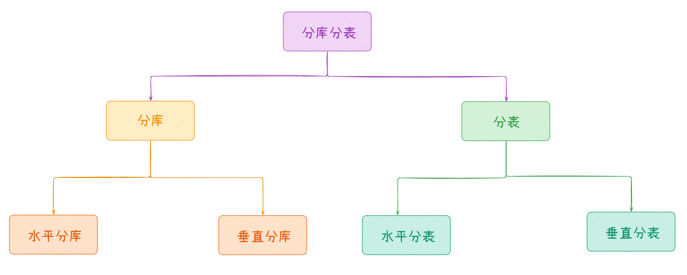

如图所示：

分库有两种模式：

1.  垂直分库：按业务模块将数据库拆分成多个独立的数据库，比如电商库，当业务拆分后就是用户库、订单库、商品库。垂直分库把一个库的压力分摊到多个库，提升了一些数据库性能，但并没有解决由于单表数据量过大导致的性能问题，所以就需要配合后边的分表来解决。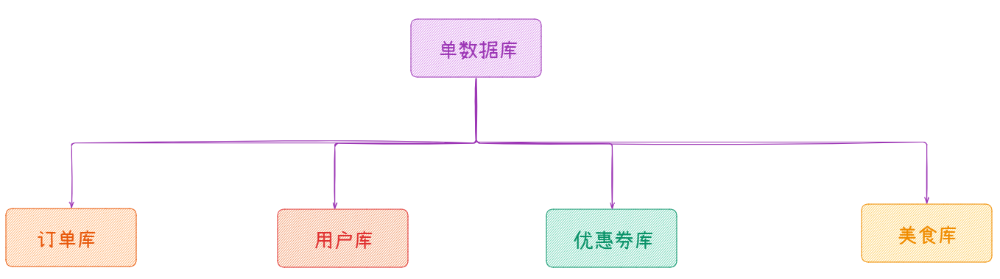
2.  水平分库：它把同一个表按一定规则拆分到不同的数据库中，每个库可以位于不同的服务器上，以此实现水平扩展，是一种常见的提升数据库性能的方式。比如订单库，分库之后就是订单库\_0，订单库\_1, 订单库\_2。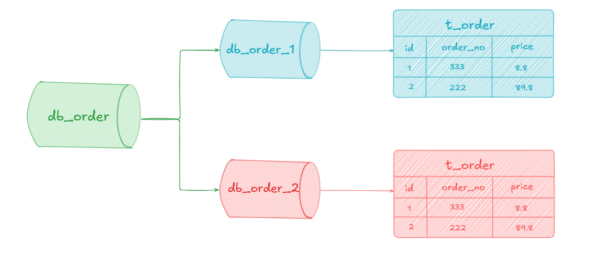

分表也有两种模式：

1.  垂直分表：针对业务上字段比较多的大表进行的，一般是把业务宽表中比较独立的字段，或者不常用的字段拆分到单独的数据表中，是一种大表拆小表的模式。比如订单表，拆分后就是订单表、订单扩展表。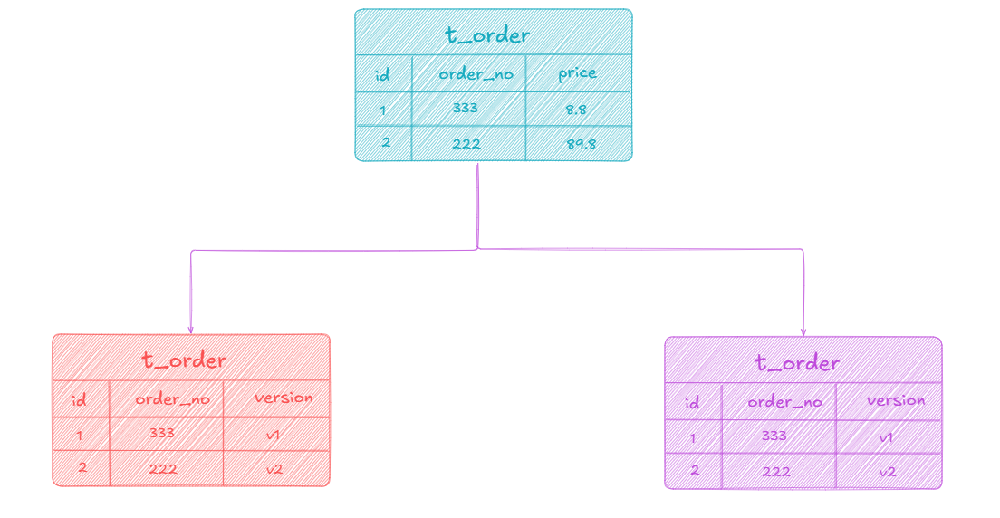
2.  水平分表：是在同一个数据库内，把一张大数据量的表按一定规则，切分成多个结构完全相同表，而每个表只存原表的一部分数据。比如订单表，拆分后就是订单表\_0，订单表\_1，订单表\_2，...., 订单表\_10。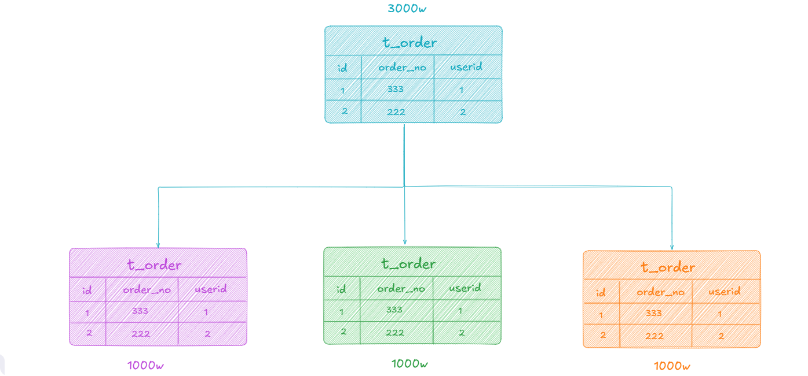

那么垂直拆分与水平拆分的优缺点又有哪些呢？ 我们来总结下：

垂直拆分的优点：

1.  提高性能：每个数据库专注于特定的业务模块。
2.  降低耦合度：不同业务模块之间互不影响。

垂直拆分的缺点：

1.  跨库关联查询困难：需要通过中间件或服务层处理跨库关联。
2.  事务管理复杂：跨库事务难以保证一致性。

水平拆分的优点：

1.  提高并发能力：每个分片可以独立处理请求。
2.  降低单表压力：避免单表数据量过大导致的性能问题。

水平拆分的缺点：

1.  数据一致性难保证：跨分片事务难以管理。
2.  查询复杂度增加：需要聚合多个分片的结果。

### **2.2.1 什么时候开始分表**

当出现以下三种情况的时候，我们需要考虑分表：

1.  单表的数据量过大，比如单表要保持在 2000 万以下。
2.  单表存在较高的写入场景，可能引发行锁竞争，比如用户高频领券场景。
3.  当表中包含大量的 TEXT、LONGTEXT 或 BLOB 等大字段。

分表的数量通常按照「**数据的存量**」、「**每年的增量**」来预估的。假如我们的存量数据为 1 亿，每年的增量大概 1000 万，那么我们的分表数量要在 10 张以上，才能保证最近 10 年不需要考虑重复分表的情况。

> 分表数量计算公式 = （存量数据 + 每年的增量 \* 期望保存的年数）/ 2000 万 === 向上取最近的 2 的幂。

### **2.2.2 什么时候开始分库**

当出现以下两种情况时，我们需要考虑通过分库提升整体系统的性能：

1.  当单库支持的连接数已经不足以满足业务客户端需求。
2.  当数据量已经超过单库实例的处理能力。

### **2.2.3 什么时候既分库又分表**

当出现以下两种场景下，需要进行分库又分表：

1.  **高并发写入场景**：当业务面临高并发的写入请求时，单库可能无法满足写入压力，就可以将数据按照一定规则拆分到多库中，每个数据库处理部分数据的写入请求，从而提高写入性能。
2.  **海量数据场景**：随着数据量的不断增加，单库的存储和查询性能可能逐渐下降。就将数据按照一定的规则拆分到多表中，每个表存储部分数据，从而分散数据的存储压力，提高查询性能。

## **2.3 分库分表设计**

这里需要考虑两种情况。

### **2.3.1 如何选择分片键**

1.  数据均匀性：分片键应该保证数据的均匀分布在各个分片上，避免出现热点数据集中在某个分片上的情况。
2.  业务关联性：分片键应该与业务关联紧密，这样可以避免跨分片查询和跨库事务的复杂性。
3.  数据不可变：一旦选择了分片键，它应该是不可变的，不能随着业务的变化而频繁修改。

### **2.3.2 分库分表算法有哪些**

分库分表的算法会根据业务的不同而变化，在业界常用的有三种：

1.  范围分片（Range Sharding）：按某个字段的范围进行拆分。
2.  按用户 ID 的范围将数据拆分为 user\_0（ID 1-1000）、user\_1（ID 1001-2000）等。
3.  按时间范围将日志数据拆分为 log\_202301, log\_202302 等。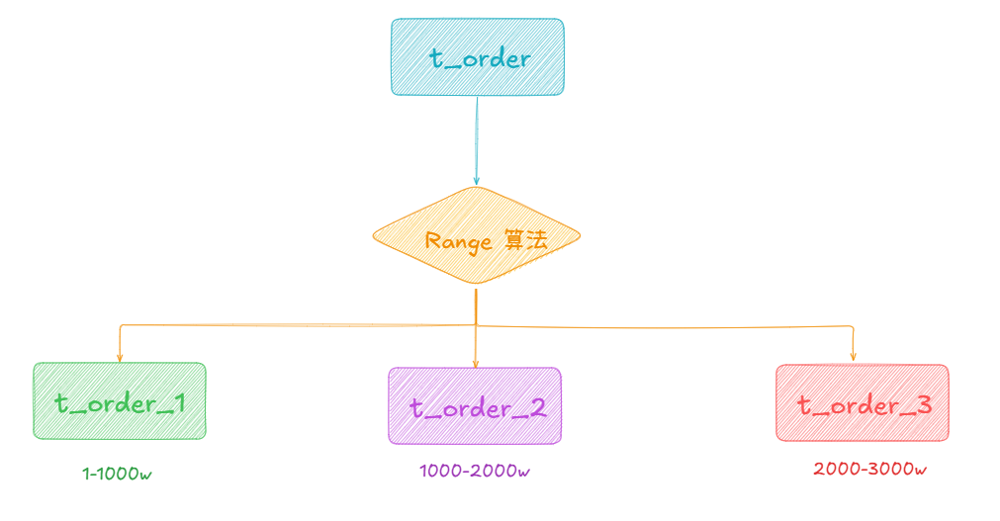
4.  哈希取模分片（Hash Sharding）: 按某个字段的哈希值进行拆分。
5.  用户 ID 的哈希值决定数据存入哪个分片。
6.  商品 ID 的哈希值决定数据存入哪个分片。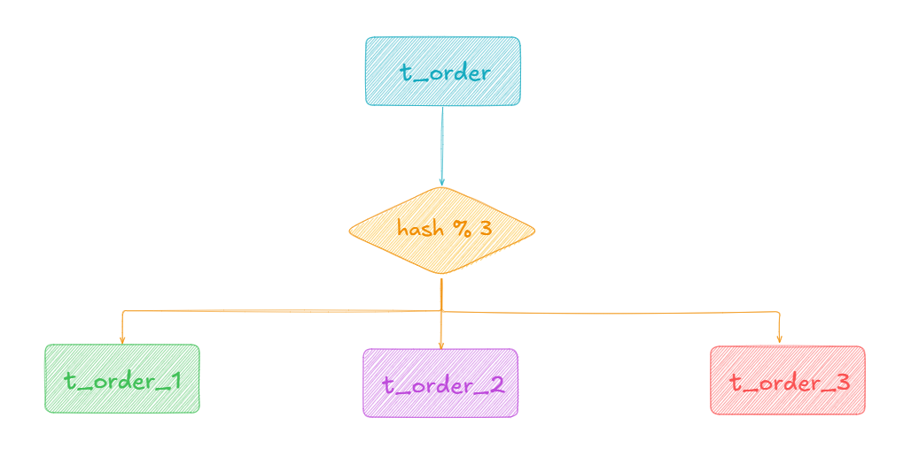
7.  一致性哈希（Consistent Hashing）：一种更高级的哈希策略，能够有效避免数据倾斜和热点问题。
8.  使用一致性哈希算法将用户 ID 映射到特定的分片。
9.  当新增或删除分片时，只需要重新映射少量数据。

## **2.4 分库分表框架选择**

市面上目前支持「**分库分表**」的开源框架主要有两款：

1.  Mycat：[https://gitee.com/MycatOne/Mycat2](https://gitee.com/MycatOne/Mycat2)
2.  ShardingSphere：[https://shardingsphere.apache.org](https://shardingsphere.apache.org/)

这里我们选择使用 [ShardingSphere](http://shardingsphere/) 来作为我们项目的「**分库分表**」框架，主要是它是 Apache 旗下的项目，有较大的社区支持，得到了广泛的认可和使用。它的社区活跃度较高，更新和新功能的开发较为迅速。最重要的是： [ShardingSphere](http://shardingsphere/) 提供了更为灵活和丰富的分库分表策略，支持广泛的分片规则，包括范围、哈希、复合分片等。

  
shardingsphere 特点：

1.  适用于任何基于Java的ORM框架，如：JPA, Hibernate, Mybatis, Spring JDBC Template或直接使用JDBC
2.  基于任何第三方的数据库连接池，如：DBCP, C3P0, BoneCP, Druid, HikariCP等
3.  支持任意实现JDBC规范的数据库。目前支持MySQL，Oracle，SQLServer和PostgreSQL

其架构图如下：

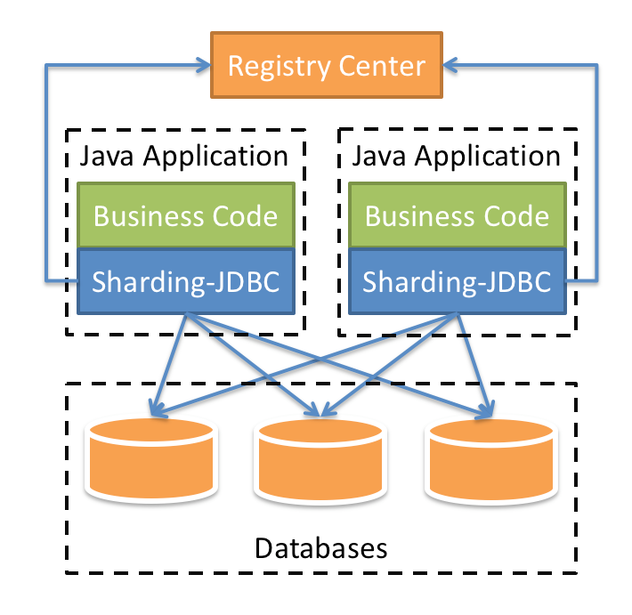

## **2.5 优惠券模板及用户领券记录如何分库分表**

其实整个项目从「**单库单表**」改造成「**分库分表**」，要改造的工程量还是比较大的，需要将对应服务的「**主键/分片键**」进行统一处理，这里我们只做「**优惠券服务的分库分表**」的改造，其他服务的改造后续再单独处理。

### **2.5.1 优惠券模板如何分库分表**

这里有两张表需要拆分，模板表和模板操作日志表：

CREATE TABLE \`coupon\_template\` (

\`id\` bigint NOT NULL AUTO\_INCREMENT COMMENT 'ID',

\`coupon\_name\` varchar(256) CHARACTER SET utf8mb4 COLLATE utf8mb4\_general\_ci DEFAULT '' COMMENT '优惠券名称',

\`shop\_number\` bigint NOT NULL DEFAULT '0' COMMENT '店铺编号',

\`coupon\_category\` tinyint(1) NOT NULL DEFAULT '0' COMMENT '优惠券分类 0:商家券 1:平台券',

\`coupon\_target\` tinyint(1) NOT NULL DEFAULT '0' COMMENT '优惠对象 0:商品专属 1:全店通用 2: 无门槛',

\`product\_id\` json NOT NULL COMMENT '优惠商品id，数组格式',

\`coupon\_type\` tinyint(1) NOT NULL DEFAULT '0' COMMENT '优惠券类型 0:立减券 1:满减券 2:折扣券',

\`receive\_type\` tinyint(1) NOT NULL DEFAULT '0' COMMENT '优惠券领取方式 0:手动领取 1:新人券 2:赠送券 3:会员券',

\`coupon\_start\_time\` datetime DEFAULT CURRENT\_TIMESTAMP COMMENT '优惠券有效期开始时间',

\`coupon\_end\_time\` datetime DEFAULT CURRENT\_TIMESTAMP COMMENT '优惠券有效期结束时间',

\`coupon\_count\` int NOT NULL DEFAULT '0' COMMENT '优惠券发行数量（原库存）',

\`coupon\_received\_count\` int NOT NULL DEFAULT '0' COMMENT '优惠券已经领取的库存数量',

\`coupon\_sale\_count\` int NOT NULL COMMENT '优惠券可售库存数量',

\`coupon\_receive\_rule\` json DEFAULT NULL COMMENT '优惠券领取规则',

\`coupon\_consume\_rule\` json DEFAULT NULL COMMENT '优惠券消耗规则',

\`sale\_version\` int NOT NULL DEFAULT '0' COMMENT '可售库存版本号（乐观锁控制）',

\`version\` int NOT NULL DEFAULT '0' COMMENT '版本号（乐观锁控制）',

\`coupon\_status\` tinyint(1) NOT NULL DEFAULT '0' COMMENT '优惠券状态 0:生效中 1:已结束',

\`coupon\_audit\_status\` tinyint(1) NOT NULL DEFAULT '0' COMMENT '优惠券审核状态 0:待审核 1:已通过 2:已驳回',

\`coupon\_del\` tinyint(1) NOT NULL DEFAULT '0' COMMENT '删除标识 0:未删除 1:已删除',

\`create\_time\` datetime DEFAULT CURRENT\_TIMESTAMP COMMENT '创建时间',

\`update\_time\` datetime DEFAULT CURRENT\_TIMESTAMP ON UPDATE CURRENT\_TIMESTAMP COMMENT '修改时间',

PRIMARY KEY (\`id\`),

KEY \`idx\_shop\_number\` (\`shop\_number\`) USING BTREE

) ENGINE\=InnoDB AUTO\_INCREMENT\=1 DEFAULT CHARSET\=utf8mb4 COLLATE=utf8mb4\_general\_ci COMMENT\='优惠券模板表';

CREATE TABLE \`coupon\_template\_log\` (

\`id\` bigint NOT NULL AUTO\_INCREMENT COMMENT 'ID',

\`coupon\_template\_id\` bigint NOT NULL DEFAULT '0' COMMENT '优惠券模板ID',

\`operator\_uid\` bigint NOT NULL DEFAULT '0' COMMENT '操作人',

\`operation\_log\` text CHARACTER SET utf8mb4 COLLATE utf8mb4\_general\_ci COMMENT '操作日志',

\`operation\_original\_data\` varchar(1024) CHARACTER SET utf8mb4 COLLATE utf8mb4\_0900\_ai\_ci DEFAULT NULL COMMENT '原始数据',

\`operation\_updated\_data\` varchar(1024) CHARACTER SET utf8mb4 COLLATE utf8mb4\_0900\_ai\_ci DEFAULT NULL COMMENT '修改后数据',

\`create\_time\` datetime DEFAULT CURRENT\_TIMESTAMP COMMENT '创建时间',

PRIMARY KEY (\`id\`)

) ENGINE\=InnoDB AUTO\_INCREMENT\=1 DEFAULT CHARSET\=utf8mb4 COLLATE=utf8mb4\_general\_ci COMMENT\='优惠券模板操作日志表';

### **2.5.1.1 优惠券模板分库分表总体规划**

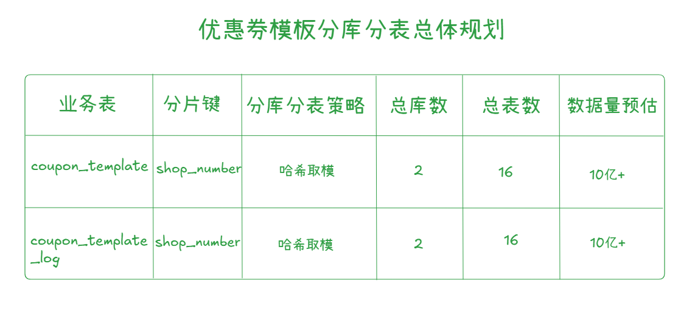

### **2.5.1.2 优惠券模板具体的分片规则**

### **1、 优惠券模板表（coupon\_template）**

actualDataNodes: ds\_${0..1}.coupon\_template\_${0..15}

分库算法：

分库值 = shop\_number.hashCode().abs() % 2

分库策略表达式：ds\_${分库值}

分表算法：

分表值 = (shop\_number.hashCode().abs() % 16)

分表策略表达式：coupon\_template\_${分表值}

数据分布示例：

shop\_number=1001 → hashCode=1001 → 库：1001%2=1 → 表：1001%16=9 → ds\_1.coupon\_template\_9

### **2、 优惠券模板日志表（coupon\_template\_log）**

同模板表规则一致，如下：

actualDataNodes: ds\_${0..1}.coupon\_template\_${0..15}

分库算法：

分库值 = shop\_number.hashCode().abs() % 2

分库策略表达式：ds\_${分库值}

分表算法：

分表值 = (shop\_number.hashCode().abs() % 16)

分表策略表达式：coupon\_template\_${分表值}

数据分布示例：

shop\_number=1001 → hashCode=1001 → 库：1001%2=1 → 表：1001%16=9 → ds\_1.coupon\_template\_9

### **2.5.2 用户领券记录如何分库分表**

这里有一张表需要拆分，领券记录表：

CREATE TABLE \`user\_coupon\` (

\`id\` bigint NOT NULL AUTO\_INCREMENT COMMENT 'ID',

\`user\_id\` bigint NOT NULL DEFAULT '0' COMMENT '用户ID',

\`coupon\_template\_id\` bigint NOT NULL DEFAULT '0' COMMENT '优惠券模板ID',

\`receive\_time\` datetime DEFAULT NULL COMMENT '优惠券领取时间',

\`receive\_count\` tinyint(1) NOT NULL DEFAULT '0' COMMENT '优惠券领取次数',

\`coupon\_start\_time\` datetime DEFAULT CURRENT\_TIMESTAMP COMMENT '优惠券有效期开始时间',

\`coupon\_end\_time\` datetime DEFAULT CURRENT\_TIMESTAMP COMMENT '优惠券有效期结束时间',

\`coupon\_used\_time\` datetime DEFAULT CURRENT\_TIMESTAMP COMMENT '优惠券使用时间',

\`coupon\_origin\` tinyint(1) NOT NULL DEFAULT '0' COMMENT '领券来源 0:平台发放 1:商家店铺领取',

\`coupon\_status\` tinyint(1) NOT NULL DEFAULT '0' COMMENT '使用状态 0:未使用 1:锁定 2:使用 3:已过期 4:已撤回',

\`coupon\_del\` tinyint(1) NOT NULL DEFAULT '0' COMMENT '删除标识 0:未删除 1:已删除',

\`create\_time\` datetime DEFAULT CURRENT\_TIMESTAMP COMMENT '创建时间',

\`update\_time\` datetime DEFAULT CURRENT\_TIMESTAMP ON UPDATE CURRENT\_TIMESTAMP COMMENT '修改时间',

PRIMARY KEY (\`id\`),

UNIQUE KEY \`idx\_user\_coupon\_receive\_count\` (\`user\_id\`,\`coupon\_template\_id\`,\`receive\_count\`) USING BTREE,

KEY \`idx\_user\_id\` (\`user\_id\`) USING BTREE

) ENGINE\=InnoDB AUTO\_INCREMENT\=1 DEFAULT CHARSET\=utf8mb4 COLLATE=utf8mb4\_general\_ci COMMENT\='用户优惠券领取记录表';

### **2.5.2.1 用户领券记录分库分表总体规划**

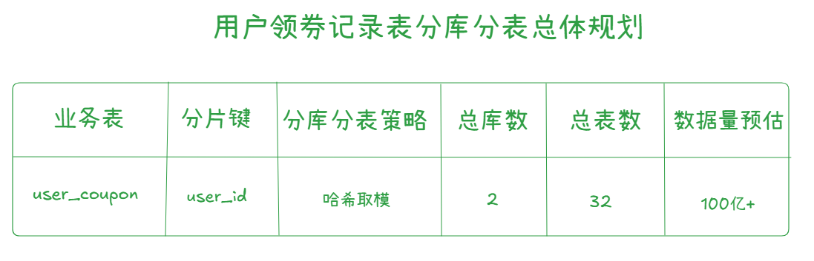

### **2.5.2.2 用户领券记录表 user\_coupon 具体的分片规则**

actualDataNodes: ds\_${0..1}.user\_coupon\_${0..31}

分库算法：

分库值 = user\_id.hashCode().abs() % 2

分库策略表达式：ds\_${分库值}

分表算法：

分表值 = (user\_id.hashCode().abs() % 32)

分表策略表达式：user\_coupon\_${分表值}

数据分布示例：

user\_id=20005 → hashCode=20005 → 库：20005%2=1 → 表：20005%32=5 → ds\_1.user\_coupon\_5

### **2.5.3 拆分后的数据库表结构**

通过上面的分析，我们最后将 **coupon\_template 和 coupon\_template\_log 表拆分为 16 个，而 user\_coupon 拆分为 32 个。**

如图所示：

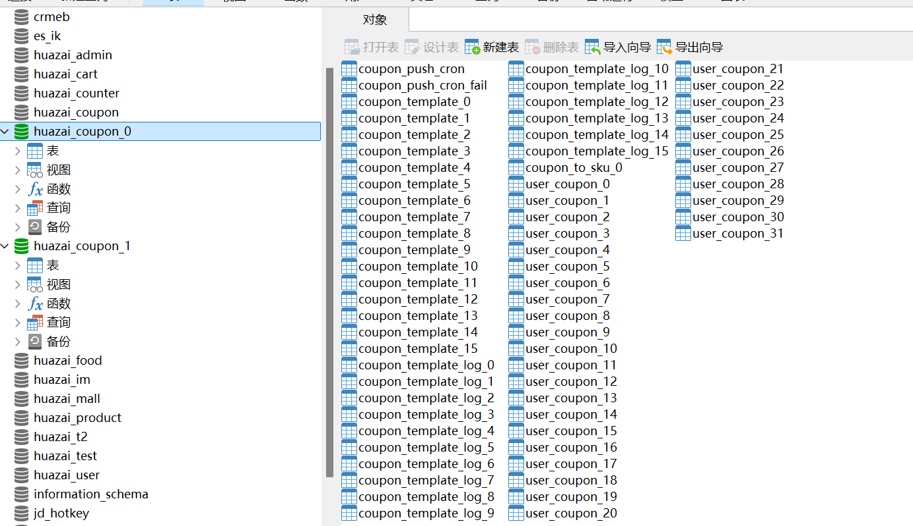

## **2.6 ShardingSphere 项目实战**

在我们整个项目中，目前需要接入「**分库分表**」的服务有「**优惠券服务 huazai-coupon**」、「**推送服务 huazai-push**」、「**后管服务 huazai-admin**」，其他的服务暂时先不接入「**分库分表**」。

根据上面的分析，「**用户 ID**」是作为 「**用户领券记录表**」的分片键来处理的，所以「**用户服务 huazai-user**」是需要一个类似 「**雪花算法**」来生成全局唯一 ID 的。

那么这里我们会拆分为两种，通过配置来「**启动/关闭分库分表**」。

### **2.6.1 优惠券、推送服务、后管服务分库分表实战**

### **2.6.1.1 公共服务分库分表依赖加载**

之前 [shardingsphere-spring-boot-starter](https://mvnrepository.com/artifact/org.apache.shardingsphere/shardingsphere-jdbc-core-spring-boot-starter) 最新版只有 5.2.1 是 2022 年的，里面应该有很多问题，目前测试服务都启动不了。

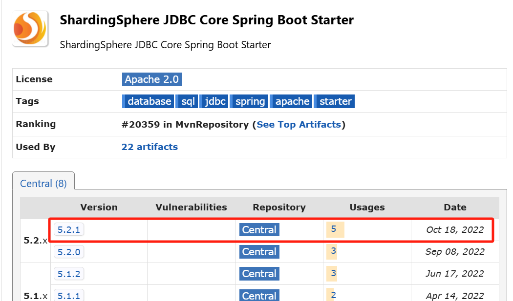

后面统一使用了最新版的 [shardingsphere-jdbc](https://mvnrepository.com/artifact/org.apache.shardingsphere/shardingsphere-jdbc) 来作为后续分库分表底层实现库，在 common 包中统一添加依赖。

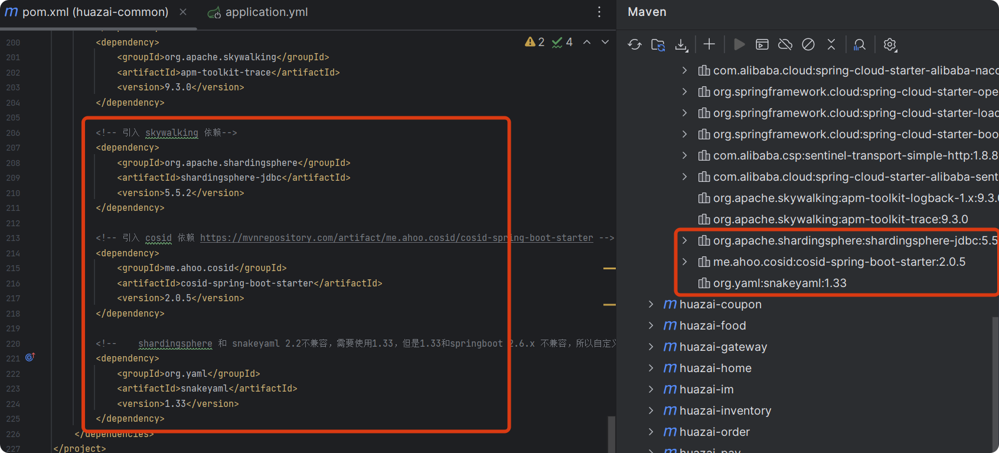

### **2.6.1.2 公共服务分库分表算法**

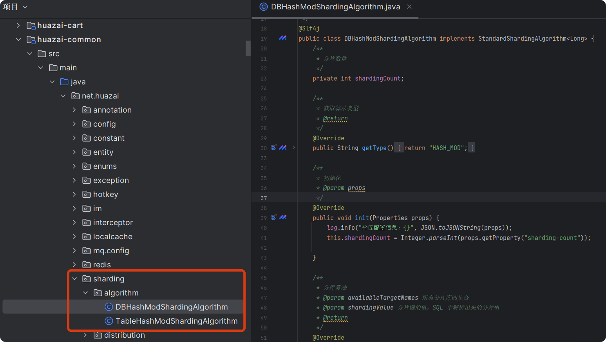

这里需要实现 StandardShardingAlgorithm 标准分库分表算法的几个方法，即可实现。

package net.huazai.sharding.algorithm;

import com.alibaba.fastjson2.JSON;

import lombok.extern.slf4j.Slf4j;

import org.apache.shardingsphere.sharding.api.sharding.standard.PreciseShardingValue;

import org.apache.shardingsphere.sharding.api.sharding.standard.RangeShardingValue;

import org.apache.shardingsphere.sharding.api.sharding.standard.StandardShardingAlgorithm;

import java.util.\*;

/\*\*

\* @className: DBHashModShardingAlgorithm

\* @author: huazai，该项目是知识星球：华仔和他的朋友们 的内部项目

\* @date: 2025-03-06 22:38

\* @Version: 1.0

\* @description: 分库分表算法

\*/

@Slf4j

public class DBHashModShardingAlgorithm implements StandardShardingAlgorithm<Long> {

/\*\*

\* 分片数量

\*/

private int shardingCount;

/\*\*

\* 获取算法类型

\* @return

\*/

@Override

public String getType() {

return "HASH\_MOD";

}

/\*\*

\* 初始化

\* @param props

\*/

@Override

public void init(Properties props) {

log.info("分库配置信息：{}", JSON.toJSONString(props));

this.shardingCount = Integer.parseInt(props.getProperty("sharding-count"));

}

/\*\*

\* 分库算法

\* @param availableTargetNames 所有分片库的集合

\* @param shardingValue 分片键的值，SQL 中解析出来的分片值

\* @return

\*/

@Override

public String doSharding(Collection<String> availableTargetNames, PreciseShardingValue<Long> shardingValue) {

log.info("进入数据库精准分片 availableTargetNames:{}, preciseShardingValue:{}", JSON.toJSONString(availableTargetNames), JSON.toJSONString(shardingValue));

// 1. 获取实际存在的数据库节点数量

// int databaseCount = availableTargetNames.size();

// 2. 计算哈希值并取模 确保分片键非空

if (shardingValue.getValue() == null) {

throw new IllegalArgumentException("db 分片键不可为空！");

}

long shardingKey \= shardingValue.getValue();

int hashCode \= Math.abs(Long.hashCode(shardingKey));

int modValue \= hashCode % shardingCount;

log.info("进入数据库精准分片计算哈希值并取模 shardingKey:{}, hashCode:{}, modValue:{}", shardingKey, hashCode, modValue);

// 3. 排序数据库名称确保一致性

List<String> sortedDatabases = new ArrayList<>(availableTargetNames);

Collections.sort(sortedDatabases);

log.info("进入数据库精准分片结果 sortedDatabases:{}, db:{}", sortedDatabases, sortedDatabases.get(modValue));

return sortedDatabases.get(modValue);

}

/\*\*

\* 范围分片算法

\* @param availableTargetNames

\* @param rangeValue

\* @return

\*/

@Override

public Collection<String> doSharding(Collection<String> availableTargetNames, RangeShardingValue<Long> rangeValue) {

return availableTargetNames;

}

}

package net.huazai.sharding.algorithm;

import com.alibaba.fastjson2.JSON;

import com.google.common.collect.Range;

import lombok.extern.slf4j.Slf4j;

import org.apache.shardingsphere.sharding.api.sharding.standard.PreciseShardingValue;

import org.apache.shardingsphere.sharding.api.sharding.standard.RangeShardingValue;

import org.apache.shardingsphere.sharding.api.sharding.standard.StandardShardingAlgorithm;

import java.util.\*;

/\*\*

\* @className: TableHashModShardingAlgorithm

\* @author: huazai，该项目是知识星球：华仔和他的朋友们 的内部项目

\* @date: 2025-03-06 22:38

\* @Version: 1.0

\* @description: 分库分表算法

\*/

@Slf4j

public class TableHashModShardingAlgorithm implements StandardShardingAlgorithm<Long> {

/\*\*

\* 分片数量

\*/

private int shardingCount;

/\*\*

\* 获取算法类型

\* @return

\*/

@Override

public String getType() {

return "HASH\_MOD";

}

/\*\*

\* 初始化

\* @param props

\*/

@Override

public void init(Properties props) {

log.info("分表配置信息：{}", JSON.toJSONString(props));

this.shardingCount = Integer.parseInt(props.getProperty("sharding-count"));

}

/\*\*

\* 分表算法

\* @param availableTargetNames 所有分片表的集合

\* @param shardingValue 分片键的值，SQL 中解析出来的分片值

\* @return

\*/

@Override

public String doSharding(Collection<String> availableTargetNames, PreciseShardingValue<Long> shardingValue) {

log.info("进入数据表精准分片 availableTargetNames:{}, preciseShardingValue:{}", JSON.toJSONString(availableTargetNames), JSON.toJSONString(shardingValue));

// 1. 计算哈希值并取模

// 确保分片键非空

if (shardingValue.getValue() == null) {

throw new IllegalArgumentException("table 分片键不可为空！");

}

long shardingKey \= shardingValue.getValue();

int hashCode \= Math.abs(Long.hashCode(shardingKey));

int modValue \= hashCode % shardingCount;

log.info("进入数据表精准分片计算哈希值并取模 shardingKey:{}, hashCode:{}, modValue:{}", shardingKey, hashCode, modValue);

// 2. 拼接真实表名

String logicTableName \= shardingValue.getLogicTableName();

String actualTableName \= logicTableName + "\_" + modValue;

log.info("进入数据表精准分片计算真实表名 logicTableName:{}, actualTableName:{}", logicTableName, actualTableName);

// 3. 验证表名有效性

if (availableTargetNames.contains(actualTableName)) {

log.info("进入数据表精准分片返回真实表名结果 actualTableName:{}", actualTableName);

return actualTableName;

}

throw new IllegalArgumentException("Invalid table sharding value: " + modValue);

}

/\*\*

\* 范围分片算法

\* @param availableTargetNames

\* @param rangeShardingValue

\* @return

\*/

@Override

public Collection<String> doSharding(Collection<String> availableTargetNames, RangeShardingValue<Long> rangeShardingValue) {

log.info(" 进入数据表范围分片计算，availableTargetNames:{}, rangeShardingValue:{}",

JSON.toJSONString(availableTargetNames), JSON.toJSONString(rangeShardingValue));

Range<Long> valueRange = rangeShardingValue.getValueRange();

String logicTableName \= rangeShardingValue.getLogicTableName();

Set<String> matchedTables = new LinkedHashSet<>();

// 1. 处理无边界或开放区间的情况（如 value > 100）

if (!valueRange.hasLowerBound() || !valueRange.hasUpperBound()) {

log.warn(" 范围分片缺少明确边界，默认路由到全部分表");

return availableTargetNames;

}

// 2. 提取分片键范围边界值

long lowerValue \= valueRange.lowerEndpoint();

long upperValue \= valueRange.upperEndpoint();

// 3. 计算边界值的哈希取模结果

int lowerMod \= Math.abs(Long.hashCode(lowerValue)) % shardingCount;

int upperMod \= Math.abs(Long.hashCode(upperValue)) % shardingCount;

// 4. 生成可能的分片序列（仅适用于顺序分片键）

Set<Integer> modValues = new HashSet<>();

if (lowerMod <= upperMod) {

for (int i \= lowerMod; i <= upperMod; i++) modValues.add(i);

} else {

// 处理模值环绕（如 lowerMod=8, upperMod=2，分片数=10）

for (int i \= lowerMod; i < shardingCount; i++) modValues.add(i);

for (int i \= 0; i <= upperMod; i++) modValues.add(i);

}

// 5. 匹配实际表名

for (int mod : modValues) {

String tableName \= logicTableName + "\_" + mod;

if (availableTargetNames.contains(tableName)) {

matchedTables.add(tableName);

}

}

// 6. 兜底逻辑：若未匹配到有效分表，返回全表

if (matchedTables.isEmpty()) {

log.warn(" 范围分片未命中有效分表，路由到全部分表");

return availableTargetNames;

}

log.info(" 范围分片命中分表：{}", JSON.toJSONString(matchedTables));

return matchedTables;

}

}

### **2.6.1.3 后管服务优惠券分库分表实战**

### **1、启动配置适配**

首先需要做启动配置的 shardingsphere 适配，之前是直接使用 JDBC 来接管的，这里需要改成 shardingsphere 来接管。

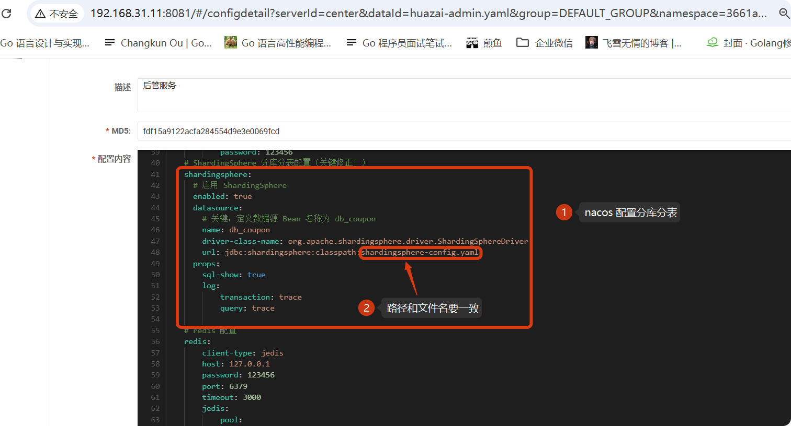

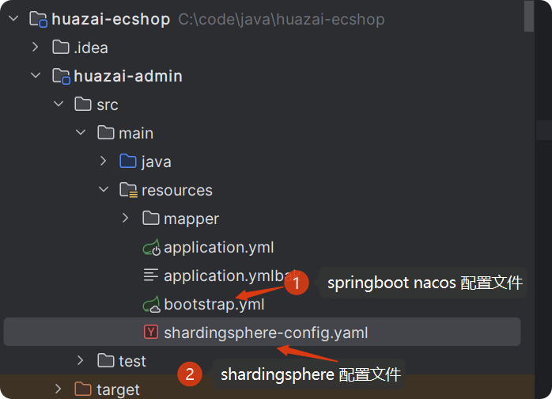

创建 ShardingSphere 自定义分片配置文件 [shardingsphere-config.yaml](http://shardingsphere-config.yaml/) 配置内容如下：

\# 数据源集合

dataSources:

\# 逻辑数据源名称

ds\_0:

\# 数据源类型

dataSourceClassName: com.zaxxer.hikari.HikariDataSource

\# 数据库驱动

driverClassName: com.mysql.cj.jdbc.Driver

\# 数据库连接

jdbcUrl: jdbc:mysql://127.0.0.1:3306/huazai\_coupon\_0?useUnicode=true&characterEncoding=UTF-8&rewriteBatchedStatements=true&allowMultiQueries=true&serverTimezone=Asia/Shanghai

username: root

password: 123456

connectionTimeout: 30000

maximumPoolSize: 20

minimumIdle: 5

idleTimeout: 600000

maxLifetime: 1800000

ds\_1:

\# 数据源类型

dataSourceClassName: com.zaxxer.hikari.HikariDataSource

\# 数据库驱动

driverClassName: com.mysql.cj.jdbc.Driver

\# 数据库连接

jdbcUrl: jdbc:mysql://127.0.0.1:3306/huazai\_coupon\_1?useUnicode=true&characterEncoding=UTF-8&rewriteBatchedStatements=true&allowMultiQueries=true&serverTimezone=Asia/Shanghai

username: root

password: 123456

connectionTimeout: 30000

maximumPoolSize: 20

minimumIdle: 5

idleTimeout: 600000

maxLifetime: 1800000

\# ShardingSphere 规则配置，包含：数据分片、数据加密、读写分离等

rules:

\- !SHARDING # 关键：使用标准 sharding 块

tables: # 需要分片的数据库表集合

coupon\_template: # 优惠券模板表

\# 真实存在数据库中的物理表

actualDataNodes: ds\_${0..1}.coupon\_template\_${0..15} # 由数据源名 + 表名组成

databaseStrategy: # 分库策略

standard: # 单分片键分库

shardingColumn: shop\_number # 分片键

shardingAlgorithmName: coupon\_template\_database\_mod # 库分片算法名称，对应 rules\[0\].shardingAlgorithms

tableStrategy: # 分表策略

standard: # 单分片键分表

shardingColumn: shop\_number # 分片键

shardingAlgorithmName: coupon\_template\_table\_mod # 表分片算法名称，对应 rules\[0\].shardingAlgorithms

keyGenerateStrategy:

column: id

keyGeneratorName: cosId-snowflake

user\_coupon:

actualDataNodes: ds\_${0..1}.user\_coupon\_${0..31}

databaseStrategy:

standard:

shardingColumn: user\_id

shardingAlgorithmName: user\_coupon\_database\_mod

tableStrategy:

standard:

shardingColumn: user\_id

shardingAlgorithmName: user\_coupon\_table\_mod

keyGenerateStrategy:

column: id

keyGeneratorName: cosId-snowflake

shardingAlgorithms: # 分片算法定义集合

coupon\_template\_database\_mod: # 优惠券分库算法定义

type: CLASS\_BASED # 根据自定义库分片算法类进行分片

props: # 分片相关属性

\# 自定义库分片算法Class

algorithmClassName: net.huazai.sharding.algorithm.DBHashModShardingAlgorithm

sharding-count: 2 # 分片总数量

strategy: standard # 分片类型，单字段分片

\# 新增算法类型标识（兼容不同版本）

algorithm-type: HASH\_MOD

coupon\_template\_table\_mod: # 优惠券分表算法定义

type: CLASS\_BASED # 根据自定义库分片算法类进行分片

props: # 分片相关属性

\# 自定义表分片算法Class

algorithmClassName: net.huazai.sharding.algorithm.TableHashModShardingAlgorithm

sharding-count: 16 # 分片总数量

strategy: standard # 分片类型，单字段分片

\# 新增算法类型标识（兼容不同版本）

algorithm-type: HASH\_MOD

user\_coupon\_database\_mod:

type: CLASS\_BASED

props:

algorithmClassName: net.huazai.sharding.algorithm.DBHashModShardingAlgorithm

sharding-count: 2

strategy: standard # 分片类型，单字段分片

\# 新增算法类型标识（兼容不同版本）

algorithm-type: HASH\_MOD

user\_coupon\_table\_mod:

type: CLASS\_BASED

props:

algorithmClassName: net.huazai.sharding.algorithm.TableHashModShardingAlgorithm

sharding-count: 32

strategy: standard # 分片类型，单字段分片

\# 新增算法类型标识（兼容不同版本）

algorithm-type: HASH\_MOD

keyGenerators: # 分布式序列算法配置

cosId-snowflake:

type: SNOWFLAKE # 雪花ID生成算法

props:

epoch: 1477929600000 # 自定义起始时间戳，毫秒值

worker-id: ${SHARDING\_WORKER\_ID:0} # 机器ID 会在 SnowFlakeWorkIdConfig 进行设置

as-string: false # 是否返回字符串

auditors:

sharding\_key\_required\_auditor:

type: DML\_SHARDING\_CONDITIONS

\# 单表规则（处理不需要分片的表）

\- !SINGLE

tables:

\- ds\_0.coupon\_push\_cron

\- ds\_1.coupon\_push\_cron

\- ds\_0.coupon\_push\_cron\_fail

\- ds\_1.coupon\_push\_cron\_fail

\- ds\_0.coupon\_to\_sku

\- ds\_1.coupon\_to\_sku

props:

\# 配置 ShardingSphere 默认打印 SQL 执行语句

sql-show: true

\# 开启全链路日志（定位分片算法是否触发）

log:

transaction: trace

query: trace

**这个分支会对之前的功能进行分片键的处理，包括列表、详情查询、更新、删除、新增等功能改造。**

另外这里 workerid 会在服务启动时进行初始化，将 [SHARDING\_WORKER\_ID](http://sharding_worker_id%20/) 的设置逻辑迁移到 Spring Bean 的初始化阶段，确保在 ShardingSphere 加载配置前完成。

  
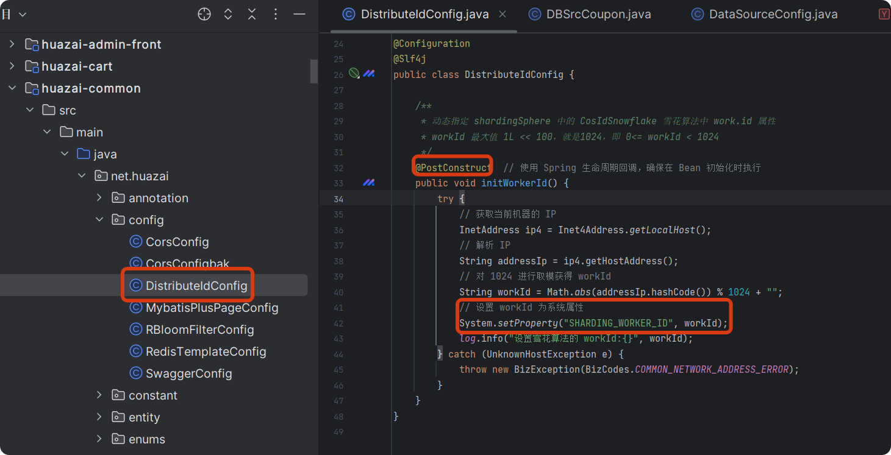

### **2、数据源配置适配**

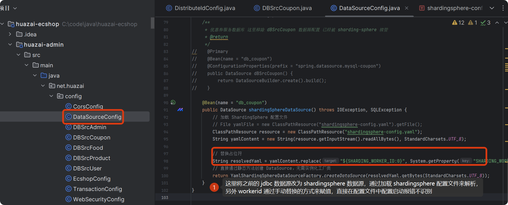

### **3、启动后管服务**

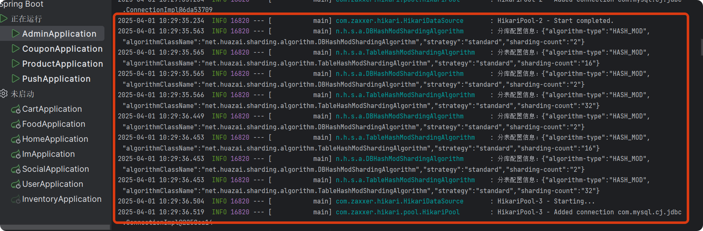

### **4、测试后管服务优惠券相关**

### **4.1、 查询优惠券/领券列表**

这里暂时没做分片键处理，就直接 union all，后续再优化。

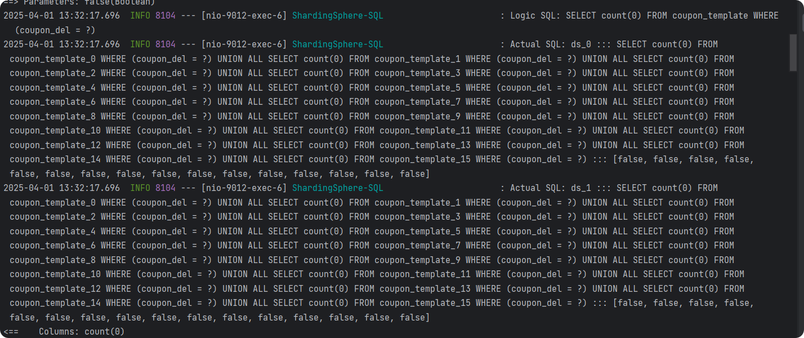

SqlSession \[org.apache.ibatis.session.defaults.DefaultSqlSession@7041357e\] was not registered for synchronization because synchronization is not active

JDBC Connection \[org.apache.shardingsphere.driver.jdbc.core.connection.ShardingSphereConnection@45fca4f2\] will not be managed by Spring

\==> Preparing: SELECT count(0) FROM coupon\_template WHERE (coupon\_del = ?)

\==> Parameters: false(Boolean)

2025-04-01 13:32:17.696 INFO 8104 --- \[nio-9012-exec-6\] ShardingSphere-SQL : Logic SQL: SELECT count(0) FROM coupon\_template WHERE (coupon\_del = ?)

2025-04-01 13:32:17.696 INFO 8104 --- \[nio-9012-exec-6\] ShardingSphere-SQL : Actual SQL: ds\_0 ::: SELECT count(0) FROM coupon\_template\_0 WHERE (coupon\_del = ?) UNION ALL SELECT count(0) FROM coupon\_template\_1 WHERE (coupon\_del = ?) UNION ALL SELECT count(0) FROM coupon\_template\_2 WHERE (coupon\_del = ?) UNION ALL SELECT count(0) FROM coupon\_template\_3 WHERE (coupon\_del = ?) UNION ALL SELECT count(0) FROM coupon\_template\_4 WHERE (coupon\_del = ?) UNION ALL SELECT count(0) FROM coupon\_template\_5 WHERE (coupon\_del = ?) UNION ALL SELECT count(0) FROM coupon\_template\_6 WHERE (coupon\_del = ?) UNION ALL SELECT count(0) FROM coupon\_template\_7 WHERE (coupon\_del = ?) UNION ALL SELECT count(0) FROM coupon\_template\_8 WHERE (coupon\_del = ?) UNION ALL SELECT count(0) FROM coupon\_template\_9 WHERE (coupon\_del = ?) UNION ALL SELECT count(0) FROM coupon\_template\_10 WHERE (coupon\_del = ?) UNION ALL SELECT count(0) FROM coupon\_template\_11 WHERE (coupon\_del = ?) UNION ALL SELECT count(0) FROM coupon\_template\_12 WHERE (coupon\_del = ?) UNION ALL SELECT count(0) FROM coupon\_template\_13 WHERE (coupon\_del = ?) UNION ALL SELECT count(0) FROM coupon\_template\_14 WHERE (coupon\_del = ?) UNION ALL SELECT count(0) FROM coupon\_template\_15 WHERE (coupon\_del = ?) ::: \[false, false, false, false, false, false, false, false, false, false, false, false, false, false, false, false\]

2025-04-01 13:32:17.696 INFO 8104 --- \[nio-9012-exec-6\] ShardingSphere-SQL : Actual SQL: ds\_1 ::: SELECT count(0) FROM coupon\_template\_0 WHERE (coupon\_del = ?) UNION ALL SELECT count(0) FROM coupon\_template\_1 WHERE (coupon\_del = ?) UNION ALL SELECT count(0) FROM coupon\_template\_2 WHERE (coupon\_del = ?) UNION ALL SELECT count(0) FROM coupon\_template\_3 WHERE (coupon\_del = ?) UNION ALL SELECT count(0) FROM coupon\_template\_4 WHERE (coupon\_del = ?) UNION ALL SELECT count(0) FROM coupon\_template\_5 WHERE (coupon\_del = ?) UNION ALL SELECT count(0) FROM coupon\_template\_6 WHERE (coupon\_del = ?) UNION ALL SELECT count(0) FROM coupon\_template\_7 WHERE (coupon\_del = ?) UNION ALL SELECT count(0) FROM coupon\_template\_8 WHERE (coupon\_del = ?) UNION ALL SELECT count(0) FROM coupon\_template\_9 WHERE (coupon\_del = ?) UNION ALL SELECT count(0) FROM coupon\_template\_10 WHERE (coupon\_del = ?) UNION ALL SELECT count(0) FROM coupon\_template\_11 WHERE (coupon\_del = ?) UNION ALL SELECT count(0) FROM coupon\_template\_12 WHERE (coupon\_del = ?) UNION ALL SELECT count(0) FROM coupon\_template\_13 WHERE (coupon\_del = ?) UNION ALL SELECT count(0) FROM coupon\_template\_14 WHERE (coupon\_del = ?) UNION ALL SELECT count(0) FROM coupon\_template\_15 WHERE (coupon\_del = ?) ::: \[false, false, false, false, false, false, false, false, false, false, false, false, false, false, false, false\]

<== Columns: count(0)

<== Row: 2

<== Total: 1

2025-04-01 13:32:17.755 INFO 8104 --- \[nio-9012-exec-6\] ShardingSphere-SQL : Logic SQL: SELECT id,coupon\_name,shop\_number,coupon\_category,coupon\_target,product\_id,coupon\_type,receive\_type,coupon\_start\_time,coupon\_end\_time,coupon\_count,coupon\_received\_count,coupon\_sale\_count,coupon\_receive\_rule,coupon\_consume\_rule,version,coupon\_status,coupon\_audit\_status,coupon\_del,create\_time,update\_time FROM coupon\_template WHERE (coupon\_del = ?) ORDER BY id DESC

LIMIT ?

2025-04-01 13:32:17.755 INFO 8104 --- \[nio-9012-exec-6\] ShardingSphere-SQL : Actual SQL: ds\_0 ::: SELECT id,coupon\_name,shop\_number,coupon\_category,coupon\_target,product\_id,coupon\_type,receive\_type,coupon\_start\_time,coupon\_end\_time,coupon\_count,coupon\_received\_count,coupon\_sale\_count,coupon\_receive\_rule,coupon\_consume\_rule,version,coupon\_status,coupon\_audit\_status,coupon\_del,create\_time,update\_time FROM coupon\_template\_0 WHERE (coupon\_del = ?) ORDER BY id DESC

LIMIT ? ::: \[false, 20\]

2025-04-01 13:32:17.756 INFO 8104 --- \[nio-9012-exec-6\] ShardingSphere-SQL : Actual SQL: ds\_0 ::: SELECT id,coupon\_name,shop\_number,coupon\_category,coupon\_target,product\_id,coupon\_type,receive\_type,coupon\_start\_time,coupon\_end\_time,coupon\_count,coupon\_received\_count,coupon\_sale\_count,coupon\_receive\_rule,coupon\_consume\_rule,version,coupon\_status,coupon\_audit\_status,coupon\_del,create\_time,update\_time FROM coupon\_template\_1 WHERE (coupon\_del = ?) ORDER BY id DESC

LIMIT ? ::: \[false, 20\]

2025-04-01 13:32:17.756 INFO 8104 --- \[nio-9012-exec-6\] ShardingSphere-SQL : Actual SQL: ds\_0 ::: SELECT id,coupon\_name,shop\_number,coupon\_category,coupon\_target,product\_id,coupon\_type,receive\_type,coupon\_start\_time,coupon\_end\_time,coupon\_count,coupon\_received\_count,coupon\_sale\_count,coupon\_receive\_rule,coupon\_consume\_rule,version,coupon\_status,coupon\_audit\_status,coupon\_del,create\_time,update\_time FROM coupon\_template\_2 WHERE (coupon\_del = ?) ORDER BY id DESC

LIMIT ? ::: \[false, 20\]

2025-04-01 13:32:17.756 INFO 8104 --- \[nio-9012-exec-6\] ShardingSphere-SQL : Actual SQL: ds\_0 ::: SELECT id,coupon\_name,shop\_number,coupon\_category,coupon\_target,product\_id,coupon\_type,receive\_type,coupon\_start\_time,coupon\_end\_time,coupon\_count,coupon\_received\_count,coupon\_sale\_count,coupon\_receive\_rule,coupon\_consume\_rule,version,coupon\_status,coupon\_audit\_status,coupon\_del,create\_time,update\_time FROM coupon\_template\_3 WHERE (coupon\_del = ?) ORDER BY id DESC

LIMIT ? ::: \[false, 20\]

2025-04-01 13:32:17.756 INFO 8104 --- \[nio-9012-exec-6\] ShardingSphere-SQL : Actual SQL: ds\_0 ::: SELECT id,coupon\_name,shop\_number,coupon\_category,coupon\_target,product\_id,coupon\_type,receive\_type,coupon\_start\_time,coupon\_end\_time,coupon\_count,coupon\_received\_count,coupon\_sale\_count,coupon\_receive\_rule,coupon\_consume\_rule,version,coupon\_status,coupon\_audit\_status,coupon\_del,create\_time,update\_time FROM coupon\_template\_4 WHERE (coupon\_del = ?) ORDER BY id DESC

LIMIT ? ::: \[false, 20\]

2025-04-01 13:32:17.756 INFO 8104 --- \[nio-9012-exec-6\] ShardingSphere-SQL : Actual SQL: ds\_0 ::: SELECT id,coupon\_name,shop\_number,coupon\_category,coupon\_target,product\_id,coupon\_type,receive\_type,coupon\_start\_time,coupon\_end\_time,coupon\_count,coupon\_received\_count,coupon\_sale\_count,coupon\_receive\_rule,coupon\_consume\_rule,version,coupon\_status,coupon\_audit\_status,coupon\_del,create\_time,update\_time FROM coupon\_template\_5 WHERE (coupon\_del = ?) ORDER BY id DESC

LIMIT ? ::: \[false, 20\]

2025-04-01 13:32:17.756 INFO 8104 --- \[nio-9012-exec-6\] ShardingSphere-SQL : Actual SQL: ds\_0 ::: SELECT id,coupon\_name,shop\_number,coupon\_category,coupon\_target,product\_id,coupon\_type,receive\_type,coupon\_start\_time,coupon\_end\_time,coupon\_count,coupon\_received\_count,coupon\_sale\_count,coupon\_receive\_rule,coupon\_consume\_rule,version,coupon\_status,coupon\_audit\_status,coupon\_del,create\_time,update\_time FROM coupon\_template\_6 WHERE (coupon\_del = ?) ORDER BY id DESC

LIMIT ? ::: \[false, 20\]

2025-04-01 13:32:17.756 INFO 8104 --- \[nio-9012-exec-6\] ShardingSphere-SQL : Actual SQL: ds\_0 ::: SELECT id,coupon\_name,shop\_number,coupon\_category,coupon\_target,product\_id,coupon\_type,receive\_type,coupon\_start\_time,coupon\_end\_time,coupon\_count,coupon\_received\_count,coupon\_sale\_count,coupon\_receive\_rule,coupon\_consume\_rule,version,coupon\_status,coupon\_audit\_status,coupon\_del,create\_time,update\_time FROM coupon\_template\_7

WHERE (coupon\_del = ?) ORDER BY id DESC

LIMIT ? ::: \[false, 20\]

2025-04-01 13:32:17.756 INFO 8104 --- \[nio-9012-exec-6\] ShardingSphere-SQL : Actual SQL: ds\_0 ::: SELECT id,coupon\_name,shop\_number,coupon\_category,coupon\_target,product\_id,coupon\_type,receive\_type,coupon\_start\_time,coupon\_end\_time,coupon\_count,coupon\_received\_count,coupon\_sale\_count,coupon\_receive\_rule,coupon\_consume\_rule,version,coupon\_status,coupon\_audit\_status,coupon\_del,create\_time,update\_time FROM coupon\_template\_8

WHERE (coupon\_del = ?) ORDER BY id DESC

LIMIT ? ::: \[false, 20\]

2025-04-01 13:32:17.756 INFO 8104 --- \[nio-9012-exec-6\] ShardingSphere-SQL : Actual SQL: ds\_0 ::: SELECT id,coupon\_name,shop\_number,coupon\_category,coupon\_target,product\_id,coupon\_type,receive\_type,coupon\_start\_time,coupon\_end\_time,coupon\_count,coupon\_received\_count,coupon\_sale\_count,coupon\_receive\_rule,coupon\_consume\_rule,version,coupon\_status,coupon\_audit\_status,coupon\_del,create\_time,update\_time FROM coupon\_template\_9

WHERE (coupon\_del = ?) ORDER BY id DESC

LIMIT ? ::: \[false, 20\]

2025-04-01 13:32:17.756 INFO 8104 --- \[nio-9012-exec-6\] ShardingSphere-SQL : Actual SQL: ds\_0 ::: SELECT id,coupon\_name,shop\_number,coupon\_category,coupon\_target,product\_id,coupon\_type,receive\_type,coupon\_start\_time,coupon\_end\_time,coupon\_count,coupon\_received\_count,coupon\_sale\_count,coupon\_receive\_rule,coupon\_consume\_rule,version,coupon\_status,coupon\_audit\_status,coupon\_del,create\_time,update\_time FROM coupon\_template\_10 WHERE (coupon\_del = ?) ORDER BY id DESC

LIMIT ? ::: \[false, 20\]

2025-04-01 13:32:17.756 INFO 8104 --- \[nio-9012-exec-6\] ShardingSphere-SQL : Actual SQL: ds\_0 ::: SELECT id,coupon\_name,shop\_number,coupon\_category,coupon\_target,product\_id,coupon\_type,receive\_type,coupon\_start\_time,coupon\_end\_time,coupon\_count,coupon\_received\_count,coupon\_sale\_count,coupon\_receive\_rule,coupon\_consume\_rule,version,coupon\_status,coupon\_audit\_status,coupon\_del,create\_time,update\_time FROM coupon\_template\_11 WHERE (coupon\_del = ?) ORDER BY id DESC

LIMIT ? ::: \[false, 20\]

2025-04-01 13:32:17.756 INFO 8104 --- \[nio-9012-exec-6\] ShardingSphere-SQL : Actual SQL: ds\_0 ::: SELECT id,coupon\_name,shop\_number,coupon\_category,coupon\_target,product\_id,coupon\_type,receive\_type,coupon\_start\_time,coupon\_end\_time,coupon\_count,coupon\_received\_count,coupon\_sale\_count,coupon\_receive\_rule,coupon\_consume\_rule,version,coupon\_status,coupon\_audit\_status,coupon\_del,create\_time,update\_time FROM coupon\_template\_12 WHERE (coupon\_del = ?) ORDER BY id DESC

LIMIT ? ::: \[false, 20\]

2025-04-01 13:32:17.756 INFO 8104 --- \[nio-9012-exec-6\] ShardingSphere-SQL : Actual SQL: ds\_0 ::: SELECT id,coupon\_name,shop\_number,coupon\_category,coupon\_target,product\_id,coupon\_type,receive\_type,coupon\_start\_time,coupon\_end\_time,coupon\_count,coupon\_received\_count,coupon\_sale\_count,coupon\_receive\_rule,coupon\_consume\_rule,version,coupon\_status,coupon\_audit\_status,coupon\_del,create\_time,update\_time FROM coupon\_template\_13 WHERE (coupon\_del = ?) ORDER BY id DESC

LIMIT ? ::: \[false, 20\]

2025-04-01 13:32:17.756 INFO 8104 --- \[nio-9012-exec-6\] ShardingSphere-SQL : Actual SQL: ds\_0 ::: SELECT id,coupon\_name,shop\_number,coupon\_category,coupon\_target,product\_id,coupon\_type,receive\_type,coupon\_start\_time,coupon\_end\_time,coupon\_count,coupon\_received\_count,coupon\_sale\_count,coupon\_receive\_rule,coupon\_consume\_rule,version,coupon\_status,coupon\_audit\_status,coupon\_del,create\_time,update\_time FROM coupon\_template\_14 WHERE (coupon\_del = ?) ORDER BY id DESC

LIMIT ? ::: \[false, 20\]

2025-04-01 13:32:17.756 INFO 8104 --- \[nio-9012-exec-6\] ShardingSphere-SQL : Actual SQL: ds\_0 ::: SELECT id,coupon\_name,shop\_number,coupon\_category,coupon\_target,product\_id,coupon\_type,receive\_type,coupon\_start\_time,coupon\_end\_time,coupon\_count,coupon\_received\_count,coupon\_sale\_count,coupon\_receive\_rule,coupon\_consume\_rule,version,coupon\_status,coupon\_audit\_status,coupon\_del,create\_time,update\_time FROM coupon\_template\_15 WHERE (coupon\_del = ?) ORDER BY id DESC

LIMIT ? ::: \[false, 20\]

2025-04-01 13:32:17.756 INFO 8104 --- \[nio-9012-exec-6\] ShardingSphere-SQL : Actual SQL: ds\_1 ::: SELECT id,coupon\_name,shop\_number,coupon\_category,coupon\_target,product\_id,coupon\_type,receive\_type,coupon\_start\_time,coupon\_end\_time,coupon\_count,coupon\_received\_count,coupon\_sale\_count,coupon\_receive\_rule,coupon\_consume\_rule,version,coupon\_status,coupon\_audit\_status,coupon\_del,create\_time,update\_time FROM coupon\_template\_0 WHERE (coupon\_del = ?) ORDER BY id DESC

LIMIT ? ::: \[false, 20\]

2025-04-01 13:32:17.756 INFO 8104 --- \[nio-9012-exec-6\] ShardingSphere-SQL : Actual SQL: ds\_1 ::: SELECT id,coupon\_name,shop\_number,coupon\_category,coupon\_target,product\_id,coupon\_type,receive\_type,coupon\_start\_time,coupon\_end\_time,coupon\_count,coupon\_received\_count,coupon\_sale\_count,coupon\_receive\_rule,coupon\_consume\_rule,version,coupon\_status,coupon\_audit\_status,coupon\_del,create\_time,update\_time FROM coupon\_template\_1

WHERE (coupon\_del = ?) ORDER BY id DESC

LIMIT ? ::: \[false, 20\]

......

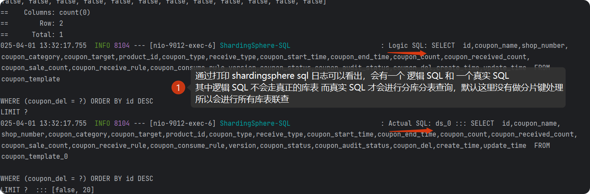

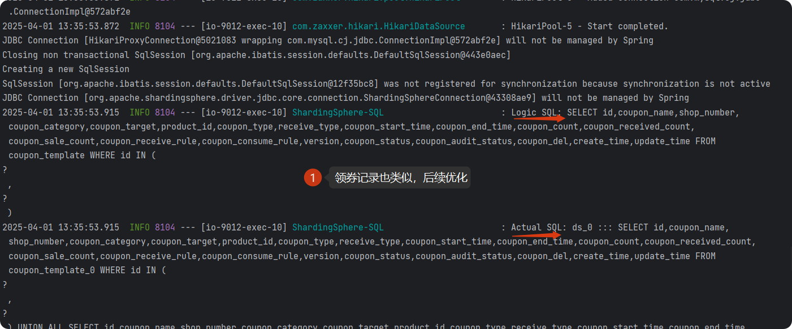

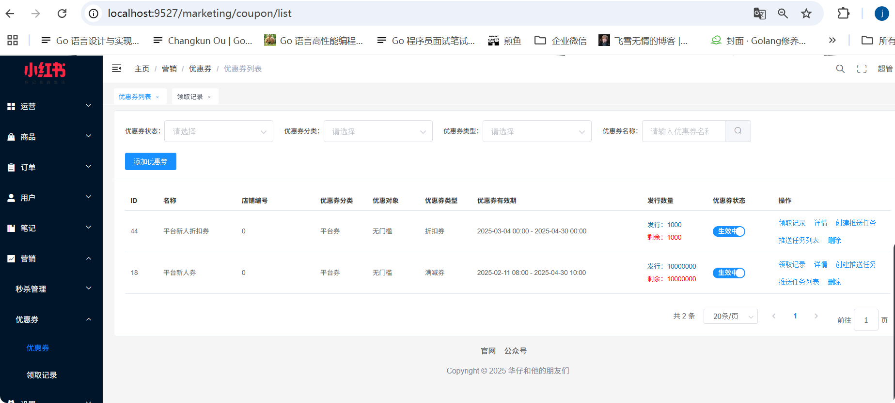

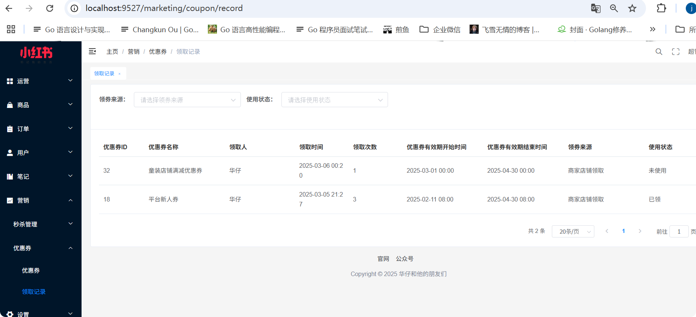

### **4.2、 添加优惠券**

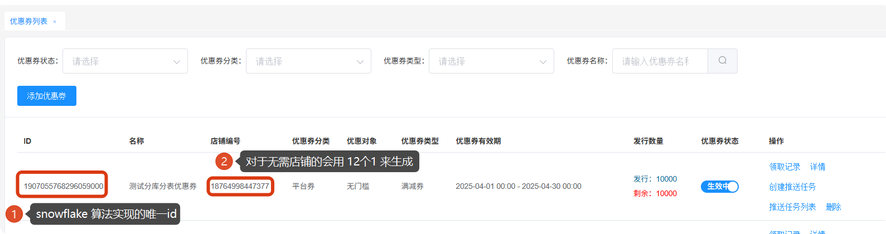

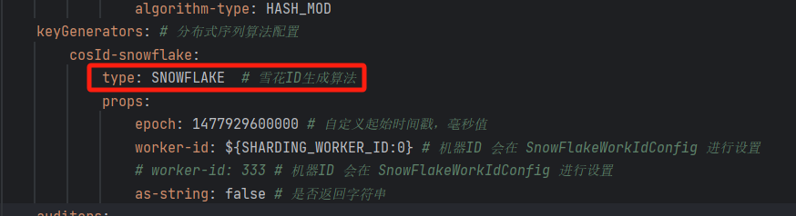

首先上面是通过 snowflake 算法生成的，目前日志如下：

2025-04-01 21:01:41.003 INFO 20848 --- \[nio\-9012\-exec\-3\] n.h.s.impl.CouponTemplateServiceImpl : 初始化优惠券模板,请求：CouponTemplateRequest(id=null, couponName=测试分库分表优惠券, couponCategory=true, couponTarget=2, productId=, shopNumber=null, couponType=1, receiveType=0, couponPerUserLimit=2, couponUseLimit=1000, couponReductionAmountLimit=null, couponDiscountRateLimit=null, couponMaxAmountLimit=300, couponTimeLimitPeriod=72, couponStartTime=Tue Apr 01 00:00:00 CST 2025, couponEndTime=Wed Apr 30 00:00:00 CST 2025, couponCount=10000, couponStatus=false, couponAuditStatus=null, couponDel=false), VO：CouponTemplateVO(id=null, couponName=测试分库分表优惠券, shopNumber=null, couponCategory=true, couponTarget=2, productId=, productMainUrls=null, couponType=1, receiveType=0, couponStartTime=Tue Apr 01 00:00:00 CST 2025, couponEndTime=Wed Apr 30 00:00:00 CST 2025, couponCount=10000, couponReceivedCount=null, couponReceiveRule=null, couponConsumeRule=null, couponStatus=false, couponAuditStatus=null, couponDel=false, createTime=null, updateTime=null)

2025-04-01 21:01:41.028 INFO 20848 --- \[nio\-9012\-exec\-3\] net.huazai.handler.IdempotentHandler : 责任链创建优惠券模板--幂等请求校验 request：CouponTemplateRequest(id=null, couponName=测试分库分表优惠券, couponCategory=true, couponTarget=2, productId=, shopNumber=null, couponType=1, receiveType=0, couponPerUserLimit=2, couponUseLimit=1000, couponReductionAmountLimit=null, couponDiscountRateLimit=null, couponMaxAmountLimit=300, couponTimeLimitPeriod=72, couponStartTime=Tue Apr 01 00:00:00 CST 2025, couponEndTime=Wed Apr 30 00:00:00 CST 2025, couponCount=10000, couponStatus=false, couponAuditStatus=null, couponDel=false), clientId：127.0.0.1\_1743512501025

2025-04-01 21:01:41.041 INFO 20848 --- \[nio\-9012\-exec\-3\] net.huazai.handler.IdempotentHandler : 责任链创建优惠券模板--幂等请求校验 redis key：coupon:template:idempotent:127.0.0.1\_1743512501025, result：true

2025-04-01 21:01:41.041 INFO 20848 --- \[nio\-9012\-exec\-3\] n.huazai.handler.ParamValidatorHandler : 责任链创建优惠券模板--参数请求校验：CouponTemplateRequest(id=null, couponName=测试分库分表优惠券, couponCategory=true, couponTarget=2, productId=, shopNumber=null, couponType=1, receiveType=0, couponPerUserLimit=2, couponUseLimit=1000, couponReductionAmountLimit=null, couponDiscountRateLimit=null, couponMaxAmountLimit=300, couponTimeLimitPeriod=72, couponStartTime=Tue Apr 01 00:00:00 CST 2025, couponEndTime=Wed Apr 30 00:00:00 CST 2025, couponCount=10000, couponStatus=false, couponAuditStatus=null, couponDel=false)

2025-04-01 21:01:41.069 INFO 20848 --- \[nio\-9012\-exec\-3\] n.huazai.handler.ParamValidatorHandler : 责任链创建优惠券模板--参数请求校验 violations：\[\]

2025-04-01 21:01:41.073 INFO 20848 --- \[nio\-9012\-exec\-3\] net.huazai.handler.ShopValidatorHandler : 责任链创建优惠券模板--店铺校验处理器 request：CouponTemplateRequest(id=null, couponName=测试分库分表优惠券, couponCategory=true, couponTarget=2, productId=, shopNumber=null, couponType=1, receiveType=0, couponPerUserLimit=2, couponUseLimit=1000, couponReductionAmountLimit=null, couponDiscountRateLimit=null, couponMaxAmountLimit=300, couponTimeLimitPeriod=72, couponStartTime=Tue Apr 01 00:00:00 CST 2025, couponEndTime=Wed Apr 30 00:00:00 CST 2025, couponCount=10000, couponStatus=false, couponAuditStatus=null, couponDel=false), category：PLATFORM

2025-04-01 21:01:41.073 INFO 20848 --- \[nio\-9012\-exec\-3\] net.huazai.handler.ShopValidatorHandler : 责任链创建优惠券模板--店铺校验处理器 平台券无需 shopNumber：18764998447377

2025-04-01 21:01:41.074 INFO 20848 --- \[nio\-9012\-exec\-3\] n.h.handler.ProductValidatorHandler : 责任链创建优惠券模板--商品校验处理器 request：CouponTemplateRequest(id=null, couponName=测试分库分表优惠券, couponCategory=true, couponTarget=2, productId=, shopNumber=null, couponType=1, receiveType=0, couponPerUserLimit=2, couponUseLimit=1000, couponReductionAmountLimit=null, couponDiscountRateLimit=null, couponMaxAmountLimit=300, couponTimeLimitPeriod=72, couponStartTime=Tue Apr 01 00:00:00 CST 2025, couponEndTime=Wed Apr 30 00:00:00 CST 2025, couponCount=10000, couponStatus=false, couponAuditStatus=null, couponDel=false), target：NO\_THRESHOLD

2025-04-01 21:01:41.074 INFO 20848 --- \[nio\-9012\-exec\-3\] n.h.handler.ConsumeRuleGeneratorHandler : 责任链创建优惠券模板--消耗规则生成处理器 couponType：FULL\_REDUCTION, strategy：net.huazai.strategy.FullReductionRuleStrategy@a77505a

2025-04-01 21:01:41.077 INFO 20848 --- \[nio\-9012\-exec\-3\] n.h.handler.ConsumeRuleGeneratorHandler : 责任链创建优惠券模板--消耗规则生成处理器 ruleJson：{"maxAmountLimit":300,"useLimit":1000,"type":"FULL\_REDUCTION","timeLimitPeriod":72,"excludeCategories":""}

2025-04-01 21:01:41.077 INFO 20848 --- \[nio\-9012\-exec\-3\] n.h.h.ReceviceRuleGeneratorHandler : 责任链创建优惠券模板--领取规则生成处理器, strategy：net.huazai.strategy.ReceiveRuleStrategy@7ad81b6a

2025-04-01 21:01:41.077 INFO 20848 --- \[nio\-9012\-exec\-3\] n.h.h.ReceviceRuleGeneratorHandler : 责任链创建优惠券模板--领取规则生成处理器 ruleJson：{"perUserLimit":2,"type":"RECEIVE\_RULE","usageInstructions":"限时购、闪购等商品不可用"}

2025-04-01 21:01:41.080 INFO 20848 --- \[nio\-9012\-exec\-3\] n.h.handler.CouponPersistenceHandler : 责任链创建优惠券模板--持久化处理器 json productId：\[""\]

2025-04-01 21:01:41.086 INFO 20848 --- \[nio\-9012\-exec\-3\] n.h.handler.CouponPersistenceHandler : 责任链创建优惠券模板--持久化处理器 template：CouponTemplateVO(id=null, couponName=测试分库分表优惠券, shopNumber=18764998447377, couponCategory=true, couponTarget=2, productId=\[""\], productMainUrls=null, couponType=1, receiveType=0, couponStartTime=Tue Apr 01 00:00:00 CST 2025, couponEndTime=Wed Apr 30 00:00:00 CST 2025, couponCount=10000, couponReceivedCount=null, couponReceiveRule={"perUserLimit":2,"type":"RECEIVE\_RULE","usageInstructions":"限时购、闪购等商品不可用"}, couponConsumeRule={"maxAmountLimit":300,"useLimit":1000,"type":"FULL\_REDUCTION","timeLimitPeriod":72,"excludeCategories":""}, couponStatus=false, couponAuditStatus=null, couponDel=false, createTime=null, updateTime=null), couponTemplateDO：CouponTemplateDO(id=null, couponName=测试分库分表优惠券, shopNumber=18764998447377, couponCategory=true, couponTarget=2, productId=\[""\], couponType=1, receiveType=0, couponStartTime=Tue Apr 01 00:00:00 CST 2025, couponEndTime=Wed Apr 30 00:00:00 CST 2025, couponCount=10000, couponReceivedCount=null, couponSaleCount=10000, couponReceiveRule={"perUserLimit":2,"type":"RECEIVE\_RULE","usageInstructions":"限时购、闪购等商品不可用"}, couponConsumeRule={"maxAmountLimit":300,"useLimit":1000,"type":"FULL\_REDUCTION","timeLimitPeriod":72,"excludeCategories":""}, version=null, couponStatus=false, couponAuditStatus=null, couponDel=false, createTime=null, updateTime=null)

Creating a new SqlSession

Registering transaction synchronization for SqlSession \[org.apache.ibatis.session.defaults.DefaultSqlSession@281d5ed6\]

JDBC Connection \[org.apache.shardingsphere.driver.jdbc.core.connection.ShardingSphereConnection@6def4e2b\] will be managed by Spring

2025-04-01 21:01:42.585 INFO 20848 --- \[nio\-9012\-exec\-3\] n.h.s.a.DBHashModShardingAlgorithm : 进入数据库精准分片 availableTargetNames:\["ds\_0","ds\_1"\], preciseShardingValue:{"columnName":"shop\_number","dataNodeInfo":{"paddingChar":"0","prefix":"ds\_","suffixMinLength":1},"logicTableName":"coupon\_template","value":18764998447377}

2025-04-01 21:01:42.585 INFO 20848 --- \[nio\-9012\-exec\-3\] n.h.s.a.DBHashModShardingAlgorithm : 进入数据库精准分片计算哈希值并取模 shardingKey:18764998447377, hashCode:286326784, modValue:0

2025-04-01 21:01:42.586 INFO 20848 --- \[nio\-9012\-exec\-3\] n.h.s.a.DBHashModShardingAlgorithm : 进入数据库精准分片结果 sortedDatabases:\[ds\_0, ds\_1\], db:ds\_0

2025-04-01 21:01:42.588 INFO 20848 --- \[nio\-9012\-exec\-3\] n.h.s.a.TableHashModShardingAlgorithm : 进入数据表精准分片 availableTargetNames:\["coupon\_template\_0","coupon\_template\_1","coupon\_template\_2","coupon\_template\_3","coupon\_template\_4","coupon\_template\_5","coupon\_template\_6","coupon\_template\_7","coupon\_template\_8","coupon\_template\_9","coupon\_template\_10","coupon\_template\_11","coupon\_template\_12","coupon\_template\_13","coupon\_template\_14","coupon\_template\_15"\], preciseShardingValue:{"columnName":"shop\_number","dataNodeInfo":{"paddingChar":"0","prefix":"coupon\_template\_","suffixMinLength":1},"logicTableName":"coupon\_template","value":18764998447377}

2025-04-01 21:01:42.589 INFO 20848 --- \[nio\-9012\-exec\-3\] n.h.s.a.TableHashModShardingAlgorithm : 进入数据表精准分片计算哈希值并取模 shardingKey:18764998447377, hashCode:286326784, modValue:0

2025-04-01 21:01:42.590 INFO 20848 --- \[nio\-9012\-exec\-3\] n.h.s.a.TableHashModShardingAlgorithm : 进入数据表精准分片计算真实表名 logicTableName:coupon\_template, actualTableName:coupon\_template\_0

2025-04-01 21:01:42.590 INFO 20848 --- \[nio\-9012\-exec\-3\] n.h.s.a.TableHashModShardingAlgorithm : 进入数据表精准分片返回真实表名结果 actualTableName:coupon\_template\_0

2025-04-01 21:01:42.654 INFO 20848 --- \[nio\-9012\-exec\-3\] ShardingSphere-SQL : Logic SQL: INSERT INTO coupon\_template ( id,

coupon\_name,

shop\_number,

coupon\_category,

coupon\_target,

product\_id,

coupon\_type,

receive\_type,

coupon\_start\_time,

coupon\_end\_time,

coupon\_count,

coupon\_sale\_count,

coupon\_receive\_rule,

coupon\_consume\_rule,

coupon\_status,

coupon\_del ) VALUES ( ?,?,?,?,?,?,?,?,?,?,?,?,?,?,?,? )

2025-04-01 21:01:42.654 INFO 20848 --- \[nio\-9012\-exec\-3\] ShardingSphere-SQL : Actual SQL: ds\_0 ::: INSERT INTO coupon\_template\_0 ( id,

coupon\_name,

shop\_number,

coupon\_category,

coupon\_target,

product\_id,

coupon\_type,

receive\_type,

coupon\_start\_time,

coupon\_end\_time,

coupon\_count,

coupon\_sale\_count,

coupon\_receive\_rule,

coupon\_consume\_rule,

coupon\_status,

coupon\_del ) VALUES (?, ?, ?, ?, ?, ?, ?, ?, ?, ?, ?, ?, ?, ?, ?, ?) ::: \[1907055768296058881, 测试分库分表优惠券, 18764998447377, true, 2, \[""\], 1, 0, 2025-04-01 00:00:00.0, 2025-04-30 00:00:00.0, 10000, 10000, {"perUserLimit":2,"type":"RECEIVE\_RULE","usageInstructions":"限时购、闪购等商品不可用"}, {"maxAmountLimit":300,"useLimit":1000,"type":"FULL\_REDUCTION","timeLimitPeriod":72,"excludeCategories":""}, false, false\]

Releasing transactional SqlSession \[org.apache.ibatis.session.defaults.DefaultSqlSession@281d5ed6\]

2025-04-01 21:01:42.679 INFO 20848 --- \[nio\-9012\-exec\-3\] n.h.handler.CouponPersistenceHandler : 责任链创建优惠券模板-持久化处理器：rows：1, couponTemplateDO：CouponTemplateDO(id=1907055768296058881, couponName=测试分库分表优惠券, shopNumber=18764998447377, couponCategory=true, couponTarget=2, productId=\[""\], couponType=1, receiveType=0, couponStartTime=Tue Apr 01 00:00:00 CST 2025, couponEndTime=Wed Apr 30 00:00:00 CST 2025, couponCount=10000, couponReceivedCount=null, couponSaleCount=10000, couponReceiveRule={"perUserLimit":2,"type":"RECEIVE\_RULE","usageInstructions":"限时购、闪购等商品不可用"}, couponConsumeRule={"maxAmountLimit":300,"useLimit":1000,"type":"FULL\_REDUCTION","timeLimitPeriod":72,"excludeCategories":""}, version=null, couponStatus=false, couponAuditStatus=null, couponDel=false, createTime=null, updateTime=null)

2025-04-01 21:01:42.679 INFO 20848 --- \[nio\-9012\-exec\-3\] n.h.handler.CouponPersistenceHandler : 责任链创建优惠券模板--持久化处理器 写入优惠券关联商品id信息 templateId：1907055768296058881, productIdList：\[\]

2025-04-01 21:01:42.679 INFO 20848 --- \[nio\-9012\-exec\-3\] n.h.handler.CouponPersistenceHandler : 责任链创建优惠券模板--持久化处理器 写入优惠券关联商品id信息不为空 templateId：1907055768296058881, productIdList：\[\]

2025-04-01 21:01:42.681 INFO 20848 --- \[nio\-9012\-exec\-3\] n.h.handler.CouponPersistenceHandler : 责任链创建优惠券模板--持久化处理器 记录日志信息 templateId：1907055768296058881, uid：1, context：CouponTemplateRequest(id=null, couponName=测试分库分表优惠券, couponCategory=true, couponTarget=2, productId=, shopNumber=null, couponType=1, receiveType=0, couponPerUserLimit=2, couponUseLimit=1000, couponReductionAmountLimit=null, couponDiscountRateLimit=null, couponMaxAmountLimit=300, couponTimeLimitPeriod=72, couponStartTime=Tue Apr 01 00:00:00 CST 2025, couponEndTime=Wed Apr 30 00:00:00 CST 2025, couponCount=10000, couponStatus=false, couponAuditStatus=null, couponDel=false)

Fetched SqlSession \[org.apache.ibatis.session.defaults.DefaultSqlSession@281d5ed6\] from current transaction

2025-04-01 21:01:42.696 INFO 20848 --- \[nio\-9012\-exec\-3\] n.h.s.a.DBHashModShardingAlgorithm : 进入数据库精准分片 availableTargetNames:\["ds\_0","ds\_1"\], preciseShardingValue:{"columnName":"shop\_number","dataNodeInfo":{"paddingChar":"0","prefix":"ds\_","suffixMinLength":1},"logicTableName":"coupon\_template\_log","value":18764998447377}

2025-04-01 21:01:42.696 INFO 20848 --- \[nio\-9012\-exec\-3\] n.h.s.a.DBHashModShardingAlgorithm : 进入数据库精准分片计算哈希值并取模 shardingKey:18764998447377, hashCode:286326784, modValue:0

2025-04-01 21:01:42.696 INFO 20848 --- \[nio\-9012\-exec\-3\] n.h.s.a.DBHashModShardingAlgorithm : 进入数据库精准分片结果 sortedDatabases:\[ds\_0, ds\_1\], db:ds\_0

2025-04-01 21:01:42.696 INFO 20848 --- \[nio\-9012\-exec\-3\] n.h.s.a.TableHashModShardingAlgorithm : 进入数据表精准分片 availableTargetNames:\["coupon\_template\_log\_0","coupon\_template\_log\_1","coupon\_template\_log\_2","coupon\_template\_log\_3","coupon\_template\_log\_4","coupon\_template\_log\_5","coupon\_template\_log\_6","coupon\_template\_log\_7","coupon\_template\_log\_8","coupon\_template\_log\_9","coupon\_template\_log\_10","coupon\_template\_log\_11","coupon\_template\_log\_12","coupon\_template\_log\_13","coupon\_template\_log\_14","coupon\_template\_log\_15"\], preciseShardingValue:{"columnName":"shop\_number","dataNodeInfo":{"paddingChar":"0","prefix":"coupon\_template\_log\_","suffixMinLength":1},"logicTableName":"coupon\_template\_log","value":18764998447377}

2025-04-01 21:01:42.696 INFO 20848 --- \[nio\-9012\-exec\-3\] n.h.s.a.TableHashModShardingAlgorithm : 进入数据表精准分片计算哈希值并取模 shardingKey:18764998447377, hashCode:286326784, modValue:0

2025-04-01 21:01:42.696 INFO 20848 --- \[nio\-9012\-exec\-3\] n.h.s.a.TableHashModShardingAlgorithm : 进入数据表精准分片计算真实表名 logicTableName:coupon\_template\_log, actualTableName:coupon\_template\_log\_0

2025-04-01 21:01:42.696 INFO 20848 --- \[nio\-9012\-exec\-3\] n.h.s.a.TableHashModShardingAlgorithm : 进入数据表精准分片返回真实表名结果 actualTableName:coupon\_template\_log\_0

2025-04-01 21:01:42.696 INFO 20848 --- \[nio\-9012\-exec\-3\] ShardingSphere-SQL : Logic SQL: INSERT INTO coupon\_template\_log ( id,

coupon\_template\_id,

shop\_number,

operator\_uid,

operation\_log,

operation\_original\_data,

operation\_updated\_data ) VALUES ( ?,?,?,?,?,?,? )

2025-04-01 21:01:42.696 INFO 20848 --- \[nio\-9012\-exec\-3\] ShardingSphere-SQL : Actual SQL: ds\_0 ::: INSERT INTO coupon\_template\_log\_0 ( id,

coupon\_template\_id,

shop\_number,

operator\_uid,

operation\_log,

operation\_original\_data,

operation\_updated\_data ) VALUES (?, ?, ?, ?, ?, ?, ?) ::: \[1907055774541377538, 1907055768296058881, 18764998447377, 1, 创建优惠券模板CouponTemplateContext(request=CouponTemplateRequest(id=null, couponName=测试分库分表优惠券, couponCategory=true, couponTarget=2, productId=, shopNumber=null, couponType=1, receiveType=0, couponPerUserLimit=2, couponUseLimit=1000, couponReductionAmountLimit=null, couponDiscountRateLimit=null, couponMaxAmountLimit=300, couponTimeLimitPeriod=72, couponStartTime=Tue Apr 01 00:00:00 CST 2025, couponEndTime=Wed Apr 30 00:00:00 CST 2025, couponCount=10000, couponStatus=false, couponAuditStatus=null, couponDel=false), servletRequest=null, operatorUid=1, shopNumber=18764998447377, productId=, idempotentKey=coupon:template:idempotent:127.0.0.1\_1743512501025, template=CouponTemplateVO(id=null, couponName=测试分库分表优惠券, shopNumber=18764998447377, couponCategory=true, couponTarget=2, productId=\[""\], productMainUrls=null, couponType=1, receiveType=0, couponStartTime=Tue Apr 01 00:00:00 CST 2025, couponEndTime=Wed Apr 30 00:00:00 CST 2025, couponCount=10000, couponReceivedCount=null, couponReceiveRule={"perUserLimit":2,"type":"RECEIVE\_RULE","usageInstructions":"限时购、闪购等商品不可用"}, couponConsumeRule={"maxAmountLimit":300,"useLimit":1000,"type":"FULL\_REDUCTION","timeLimitPeriod":72,"excludeCategories":""}, couponStatus=false, couponAuditStatus=null, couponDel=false, createTime=null, updateTime=null), errors=\[\]), CouponTemplateRequest(id=null, couponName=测试分库分表优惠券, couponCategory=true, couponTarget=2, productId=, shopNumber=null, couponType=1, receiveType=0, couponPerUserLimit=2, couponUseLimit=1000, couponReductionAmountLimit=null, couponDiscountRateLimit=null, couponMaxAmountLimit=300, couponTimeLimitPeriod=72, couponStartTime=Tue Apr 01 00:00:00 CST 2025, couponEndTime=Wed Apr 30 00:00:00 CST 2025, couponCount=10000, couponStatus=false, couponAuditStatus=null, couponDel=false), \]

Releasing transactional SqlSession \[org.apache.ibatis.session.defaults.DefaultSqlSession@281d5ed6\]

2025-04-01 21:01:42.707 INFO 20848 --- \[nio\-9012\-exec\-3\] n.h.handler.CouponPersistenceHandler : 责任链创建优惠券模板-持久化处理器 记录日志信息：rows：1, logDO：CouponTemplateLogDO(id=1907055774541377538, couponTemplateId=1907055768296058881, shopNumber=18764998447377, operatorUid=1, operationLog=创建优惠券模板CouponTemplateContext(request=CouponTemplateRequest(id=null, couponName=测试分库分表优惠券, couponCategory=true, couponTarget=2, productId=, shopNumber=null, couponType=1, receiveType=0, couponPerUserLimit=2, couponUseLimit=1000, couponReductionAmountLimit=null, couponDiscountRateLimit=null, couponMaxAmountLimit=300, couponTimeLimitPeriod=72, couponStartTime=Tue Apr 01 00:00:00 CST 2025, couponEndTime=Wed Apr 30 00:00:00 CST 2025, couponCount=10000, couponStatus=false, couponAuditStatus=null, couponDel=false), servletRequest=null, operatorUid=1, shopNumber=18764998447377, productId=, idempotentKey=coupon:template:idempotent:127.0.0.1\_1743512501025, template=CouponTemplateVO(id=null, couponName=测试分库分表优惠券, shopNumber=18764998447377, couponCategory=true, couponTarget=2, productId=\[""\], productMainUrls=null, couponType=1, receiveType=0, couponStartTime=Tue Apr 01 00:00:00 CST 2025, couponEndTime=Wed Apr 30 00:00:00 CST 2025, couponCount=10000, couponReceivedCount=null, couponReceiveRule={"perUserLimit":2,"type":"RECEIVE\_RULE","usageInstructions":"限时购、闪购等商品不可用"}, couponConsumeRule={"maxAmountLimit":300,"useLimit":1000,"type":"FULL\_REDUCTION","timeLimitPeriod":72,"excludeCategories":""}, couponStatus=false, couponAuditStatus=null, couponDel=false, createTime=null, updateTime=null), errors=\[\]), operationOriginalData=CouponTemplateRequest(id=null, couponName=测试分库分表优惠券, couponCategory=true, couponTarget=2, productId=, shopNumber=null, couponType=1, receiveType=0, couponPerUserLimit=2, couponUseLimit=1000, couponReductionAmountLimit=null, couponDiscountRateLimit=null, couponMaxAmountLimit=300, couponTimeLimitPeriod=72, couponStartTime=Tue Apr 01 00:00:00 CST 2025, couponEndTime=Wed Apr 30 00:00:00 CST 2025, couponCount=10000, couponStatus=false, couponAuditStatus=null, couponDel=false), operationUpdatedData=, createTime=null)

2025-04-01 21:01:42.808 INFO 20848 --- \[nio\-9012\-exec\-3\] net.huazai.redis.RedisCache : 缓存更新过期时间，key：coupon\_template:1907055768296058881，time：2505600000

2025-04-01 21:01:42.809 INFO 20848 --- \[nio\-9012\-exec\-3\] net.huazai.handler.CouponCacheHandler : 责任链创建优惠券模板-缓存预热处理器：templateHashKey：coupon\_template:1907055768296058881, template：CouponTemplateVO(id=1907055768296058881, couponName=测试分库分表优惠券, shopNumber=18764998447377, couponCategory=true, couponTarget=2, productId=\[""\], productMainUrls=null, couponType=1, receiveType=0, couponStartTime=Tue Apr 01 00:00:00 CST 2025, couponEndTime=Wed Apr 30 00:00:00 CST 2025, couponCount=10000, couponReceivedCount=null, couponReceiveRule={"perUserLimit":2,"type":"RECEIVE\_RULE","usageInstructions":"限时购、闪购等商品不可用"}, couponConsumeRule={"maxAmountLimit":300,"useLimit":1000,"type":"FULL\_REDUCTION","timeLimitPeriod":72,"excludeCategories":""}, couponStatus=false, couponAuditStatus=null, couponDel=false, createTime=Tue Apr 01 21:01:42 CST 2025, updateTime=Tue Apr 01 21:01:42 CST 2025)

2025-04-01 21:01:42.813 INFO 20848 --- \[nio\-9012\-exec\-3\] net.huazai.handler.CouponMQHandler : 责任链创建优惠券模板-RocketMQ 延时消息处理器：message：CouponTemplateUpdateMQMessage(templateId=1907055768296058881, couponStartTime=Tue Apr 01 00:00:00 CST 2025, couponEndTime=Wed Apr 30 00:00:00 CST 2025), template：CouponTemplateVO(id=1907055768296058881, couponName=测试分库分表优惠券, shopNumber=18764998447377, couponCategory=true, couponTarget=2, productId=\[""\], productMainUrls=null, couponType=1, receiveType=0, couponStartTime=Tue Apr 01 00:00:00 CST 2025, couponEndTime=Wed Apr 30 00:00:00 CST 2025, couponCount=10000, couponReceivedCount=null, couponReceiveRule={"perUserLimit":2,"type":"RECEIVE\_RULE","usageInstructions":"限时购、闪购等商品不可用"}, couponConsumeRule={"maxAmountLimit":300,"useLimit":1000,"type":"FULL\_REDUCTION","timeLimitPeriod":72,"excludeCategories":""}, couponStatus=false, couponAuditStatus=null, couponDel=false, createTime=Tue Apr 01 21:01:42 CST 2025, updateTime=Tue Apr 01 21:01:42 CST 2025), delaySeconds：2505600

2025-04-01 21:01:42.946 INFO 20848 --- \[nio\-9012\-exec\-3\] net.huazai.mq.producer.DefaultProducer : MQ消息发送成功, type:创建优惠券模板 RocketMQ 延时消息处理结束状态, msgId:C0A81F0B517063947C6B0483225B0000

**目前发现官方文档 5.5.2 版本并没有实现 cosId-snowflake 算法，也是醉了**，如下：

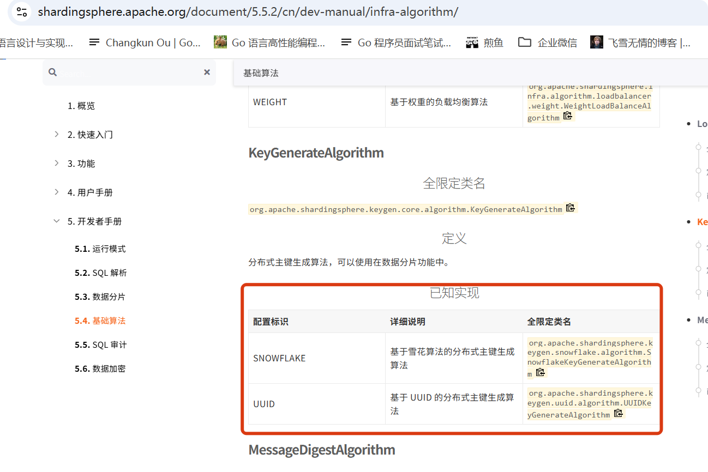

而 5.3.1 版本之前才有这个 cosId-snowflake 实现，那就先这样。

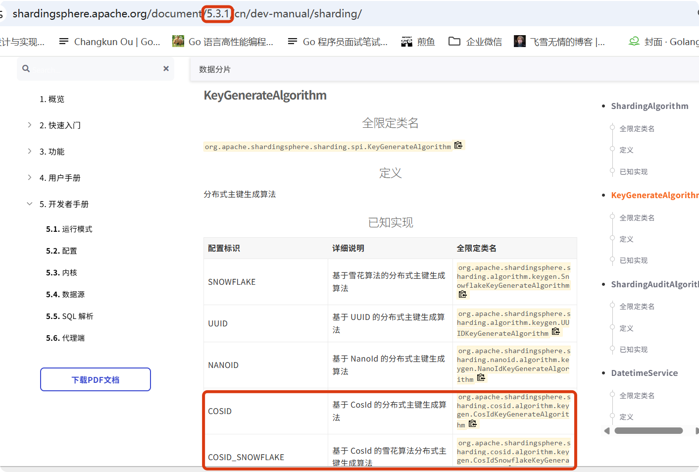

###   
**4.3、 创建优惠券推送任务**

优惠券推送任务不会太多，所以默认不进行分库分表，ShardingSphere 5.3.2 之后版本对于没有配置分库分表逻辑的表，默认会从第一个数据源「**ds\_0**」读取。

需要配置如下：

  
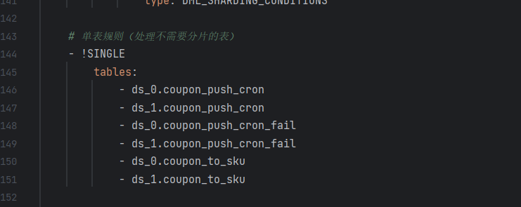

2025-04-02 15:18:47.196 INFO 22088 --- \[nio\-9012\-exec\-2\] n.h.s.a.DBHashModShardingAlgorithm : 进入数据库精准分片 availableTargetNames:\["ds\_0","ds\_1"\], preciseShardingValue:{"columnName":"shop\_number","dataNodeInfo":{"paddingChar":"0","prefix":"ds\_","suffixMinLength":1},"logicTableName":"coupon\_template","value":18764998447377}

2025-04-02 15:18:47.196 INFO 22088 --- \[nio\-9012\-exec\-2\] n.h.s.a.DBHashModShardingAlgorithm : 进入数据库精准分片计算哈希值并取模 shardingKey:18764998447377, hashCode:286326784, modValue:0

2025-04-02 15:18:47.196 INFO 22088 --- \[nio\-9012\-exec\-2\] n.h.s.a.DBHashModShardingAlgorithm : 进入数据库精准分片结果 sortedDatabases:\[ds\_0, ds\_1\], db:ds\_0

2025-04-02 15:18:47.210 INFO 22088 --- \[nio\-9012\-exec\-2\] n.h.s.a.TableHashModShardingAlgorithm : 进入数据表精准分片 availableTargetNames:\["coupon\_template\_0","coupon\_template\_1","coupon\_template\_2","coupon\_template\_3","coupon\_template\_4","coupon\_template\_5","coupon\_template\_6","coupon\_template\_7","coupon\_template\_8","coupon\_template\_9","coupon\_template\_10","coupon\_template\_11","coupon\_template\_12","coupon\_template\_13","coupon\_template\_14","coupon\_template\_15"\], preciseShardingValue:{"columnName":"shop\_number","dataNodeInfo":{"paddingChar":"0","prefix":"coupon\_template\_","suffixMinLength":1},"logicTableName":"coupon\_template","value":18764998447377}

2025-04-02 15:18:47.210 INFO 22088 --- \[nio\-9012\-exec\-2\] n.h.s.a.TableHashModShardingAlgorithm : 进入数据表精准分片计算哈希值并取模 shardingKey:18764998447377, hashCode:286326784, modValue:0

2025-04-02 15:18:47.218 INFO 22088 --- \[nio\-9012\-exec\-2\] n.h.s.a.TableHashModShardingAlgorithm : 进入数据表精准分片计算真实表名 logicTableName:coupon\_template, actualTableName:coupon\_template\_0

2025-04-02 15:18:47.218 INFO 22088 --- \[nio\-9012\-exec\-2\] n.h.s.a.TableHashModShardingAlgorithm : 进入数据表精准分片返回真实表名结果 actualTableName:coupon\_template\_0

2025-04-02 15:18:47.559 INFO 22088 --- \[nio\-9012\-exec\-2\] ShardingSphere-SQL : Logic SQL: SELECT \* FROM coupon\_template WHERE id = ? and shop\_number = ? and coupon\_status = 0

2025-04-02 15:18:47.559 INFO 22088 --- \[nio\-9012\-exec\-2\] ShardingSphere-SQL : Actual SQL: ds\_0 ::: SELECT \* FROM coupon\_template\_0 WHERE id = ? and shop\_number = ? and coupon\_status = 0 ::: \[1907055768296058881, 18764998447377\]

Releasing transactional SqlSession \[org.apache.ibatis.session.defaults.DefaultSqlSession@7ce2608\]

2025-04-02 15:18:47.902 INFO 22088 --- \[nio\-9012\-exec\-2\] n.h.s.impl.CouponPushCronServiceImpl : 创建优惠券推送任务--生成批次id：269360344167313，pushCronDO：CouponPushCronDO(id=null, couponTemplateId=1907055768296058881, batchId=null, pushName=测试分库分表优惠券推送任务, pushRange=0, pushCouponNum=10000, notifyType=0, pushType=false, pushTime=Wed Apr 02 15:18:47 CST 2025, pushStatus=0, pushFailNums=null, pushCompletionTime=null, operatorUid=1, couponPushDel=false, createTime=null, updateTime=null)

Fetched SqlSession \[org.apache.ibatis.session.defaults.DefaultSqlSession@7ce2608\] from current transaction

2025-04-02 15:18:48.387 INFO 22088 --- \[nio\-9012\-exec\-2\] ShardingSphere-SQL : Logic SQL: INSERT INTO coupon\_push\_cron ( coupon\_template\_id,

batch\_id,

push\_name,

push\_range,

push\_coupon\_num,

notify\_type,

push\_type,

push\_time,

push\_status,

operator\_uid,

coupon\_push\_del ) VALUES ( ?,

?,

?,

?,

?,

?,

?,

?,

?,

?,

? )

2025-04-02 15:18:48.387 INFO 22088 --- \[nio\-9012\-exec\-2\] ShardingSphere-SQL : Actual SQL: ds\_1 ::: INSERT INTO coupon\_push\_cron ( coupon\_template\_id,

batch\_id,

push\_name,

push\_range,

push\_coupon\_num,

notify\_type,

push\_type,

push\_time,

push\_status,

operator\_uid,

coupon\_push\_del ) VALUES ( ?,

?,

?,

?,

?,

?,

?,

?,

?,

?,

? ) ::: \[1907055768296058881, 269360344167313, 测试分库分表优惠券推送任务, 0, 10000, 0, false, 2025-04-02 15:18:47.853, 0, 1, false\]

Releasing transactional SqlSession \[org.apache.ibatis.session.defaults.DefaultSqlSession@7ce2608\]

2025-04-02 15:18:48.496 INFO 22088 --- \[nio\-9012\-exec\-2\] n.h.s.impl.CouponPushCronServiceImpl : 创建优惠券推送任务 rows：1, pushCronDO：CouponPushCronDO(id=5, couponTemplateId=1907055768296058881, batchId=269360344167313, pushName=测试分库分表优惠券推送任务, pushRange=0, pushCouponNum=10000, notifyType=0, pushType=false, pushTime=Wed Apr 02 15:18:47 CST 2025, pushStatus=0, pushFailNums=null, pushCompletionTime=null, operatorUid=1, couponPushDel=false, createTime=null, updateTime=null)

2025-04-02 15:18:48.941 INFO 22088 --- \[nio\-9012\-exec\-2\] net.huazai.mq.producer.DefaultProducer : MQ消息发送成功, type:创建优惠券推送任务 RocketMQ 消息, msgId:C0A81F0B564863947C6B086F8ECA0000

### **2.6.1.4 推送服务优惠券库存分库分表实战**

推送服务的「**分库分表**」配置跟后管服务一致，这里就不贴了，自行查看代码即可。

需要注意的是，这里需要处理 「**分库分表**」后的「**分片键**」问题，数据库增加店铺编号字段：

  
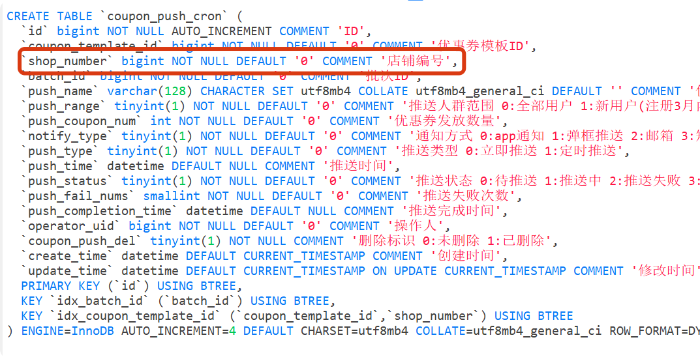

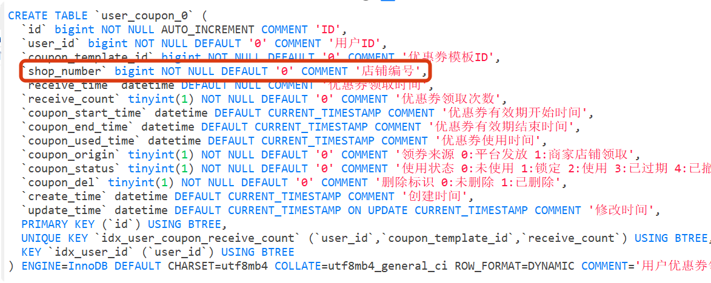

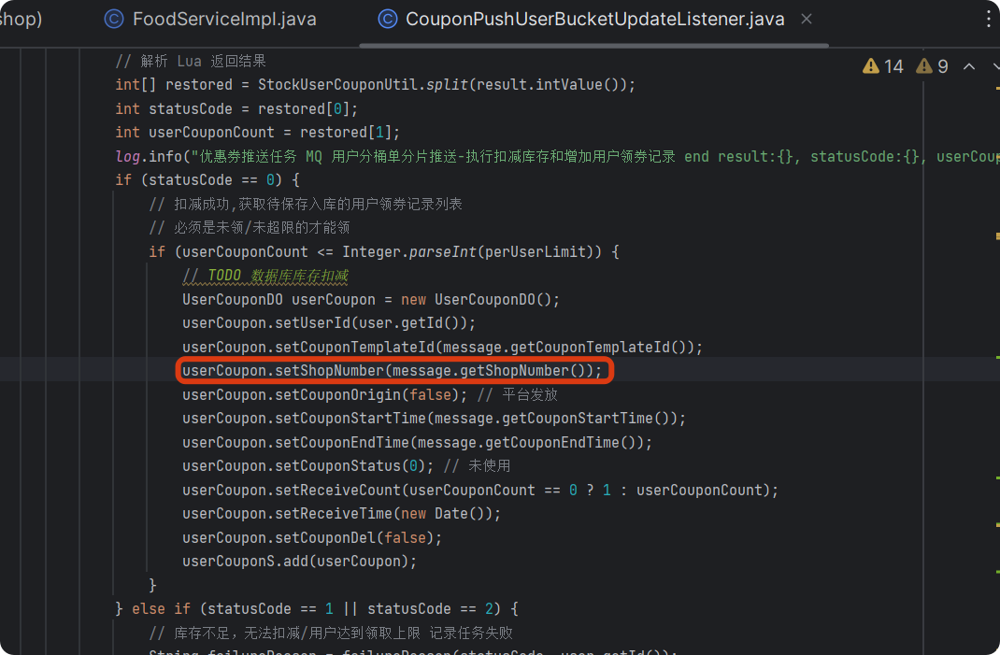

通过测试会根据 userid 取模最终会写入到 user\_coupon\_xx 表，如果失败会写入到任务失败表中。

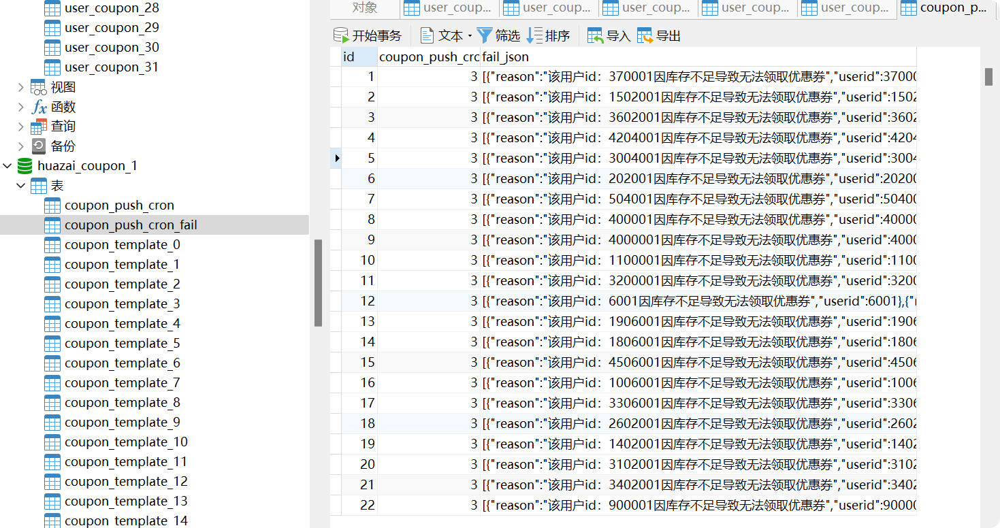

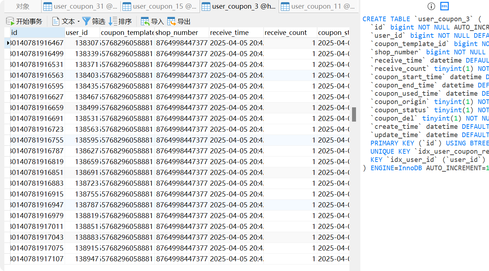

### **2.6.1.5 优惠券服务分库分表实战**

优惠券的「**分库分表**」配置如下：

\# 数据源集合

dataSources:

\# 逻辑数据源名称

ds\_0:

\# 数据源类型

dataSourceClassName: com.zaxxer.hikari.HikariDataSource

\# 数据库驱动

driverClassName: com.mysql.cj.jdbc.Driver

\# 数据库连接

jdbcUrl: jdbc:mysql://127.0.0.1:3306/huazai\_coupon\_0?useUnicode=true&characterEncoding=UTF-8&rewriteBatchedStatements=true&allowMultiQueries=true&serverTimezone=Asia/Shanghai

username: root

password: 123456

connectionTimeout: 30000

maximumPoolSize: 20

minimumIdle: 5

idleTimeout: 600000

maxLifetime: 1800000

ds\_1:

\# 数据源类型

dataSourceClassName: com.zaxxer.hikari.HikariDataSource

\# 数据库驱动

driverClassName: com.mysql.cj.jdbc.Driver

\# 数据库连接

jdbcUrl: jdbc:mysql://127.0.0.1:3306/huazai\_coupon\_1?useUnicode=true&characterEncoding=UTF-8&rewriteBatchedStatements=true&allowMultiQueries=true&serverTimezone=Asia/Shanghai

username: root

password: 123456

connectionTimeout: 30000

maximumPoolSize: 20

minimumIdle: 5

idleTimeout: 600000

maxLifetime: 1800000

\# ShardingSphere 规则配置，包含：数据分片、数据加密、读写分离等

rules:

\- !SHARDING # 关键：使用标准 sharding 块

tables: # 需要分片的数据库表集合

coupon\_template: # 优惠券模板表

\# 真实存在数据库中的物理表

actualDataNodes: ds\_${0..1}.coupon\_template\_${0..15} # 由数据源名 + 表名组成

databaseStrategy: # 分库策略

standard: # 单分片键分库

shardingColumn: shop\_number # 分片键

shardingAlgorithmName: coupon\_template\_database\_mod # 库分片算法名称，对应 rules\[0\].shardingAlgorithms

tableStrategy: # 分表策略

standard: # 单分片键分表

shardingColumn: shop\_number # 分片键

shardingAlgorithmName: coupon\_template\_table\_mod # 表分片算法名称，对应 rules\[0\].shardingAlgorithms

keyGenerateStrategy:

column: id

keyGeneratorName: cosId-snowflake

user\_coupon:

actualDataNodes: ds\_${0..1}.user\_coupon\_${0..31}

databaseStrategy:

standard:

shardingColumn: user\_id

shardingAlgorithmName: user\_coupon\_database\_mod

tableStrategy:

standard:

shardingColumn: user\_id

shardingAlgorithmName: user\_coupon\_table\_mod

keyGenerateStrategy:

column: id

keyGeneratorName: cosId-snowflake

coupon\_to\_sku:

actualDataNodes: ds\_${0..1}.coupon\_to\_sku

shardingAlgorithms: # 分片算法定义集合

coupon\_template\_database\_mod: # 优惠券分库算法定义

type: CLASS\_BASED # 根据自定义库分片算法类进行分片

props: # 分片相关属性

\# 自定义库分片算法Class

algorithmClassName: net.huazai.sharding.algorithm.DBHashModShardingAlgorithm

sharding-count: 2 # 分片总数量

strategy: standard # 分片类型，单字段分片

\# 新增算法类型标识（兼容不同版本）

algorithm-type: HASH\_MOD

coupon\_template\_table\_mod: # 优惠券分表算法定义

type: CLASS\_BASED # 根据自定义库分片算法类进行分片

props: # 分片相关属性

\# 自定义表分片算法Class

algorithmClassName: net.huazai.sharding.algorithm.TableHashModShardingAlgorithm

sharding-count: 16 # 分片总数量

strategy: standard # 分片类型，单字段分片

\# 新增算法类型标识（兼容不同版本）

algorithm-type: HASH\_MOD

user\_coupon\_database\_mod:

type: CLASS\_BASED

props:

algorithmClassName: net.huazai.sharding.algorithm.DBHashModShardingAlgorithm

sharding-count: 2

strategy: standard # 分片类型，单字段分片

\# 新增算法类型标识（兼容不同版本）

algorithm-type: HASH\_MOD

user\_coupon\_table\_mod:

type: CLASS\_BASED

props:

algorithmClassName: net.huazai.sharding.algorithm.TableHashModShardingAlgorithm

sharding-count: 32

strategy: standard # 分片类型，单字段分片

\# 新增算法类型标识（兼容不同版本）

algorithm-type: HASH\_MOD

keyGenerators: # 分布式序列算法配置

cosId-snowflake:

type: SNOWFLAKE # 雪花ID生成算法

props:

epoch: 1477929600000 # 自定义起始时间戳，毫秒值

\# worker-id: ${SHARDING\_WORKER\_ID:0} # 机器ID 会在 SnowFlakeWorkIdConfig 进行设置

worker-id: 333 # 机器ID 会在 SnowFlakeWorkIdConfig 进行设置

as-string: false # 是否返回字符串

auditors:

sharding\_key\_required\_auditor:

type: DML\_SHARDING\_CONDITIONS

props:

\# 配置 ShardingSphere 默认打印 SQL 执行语句

sql-show: true

\# 开启全链路日志（定位分片算法是否触发）

log:

transaction: trace

query: trace

需要注意的是，优惠券服务需要处理 「**分库分表**」后的「**分片键**」问题，数据库表增加店铺编号字段：

  
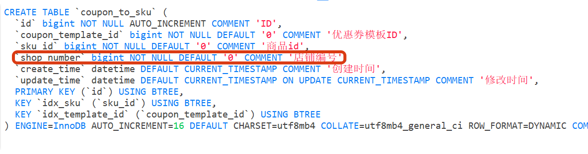

代码部分修改：

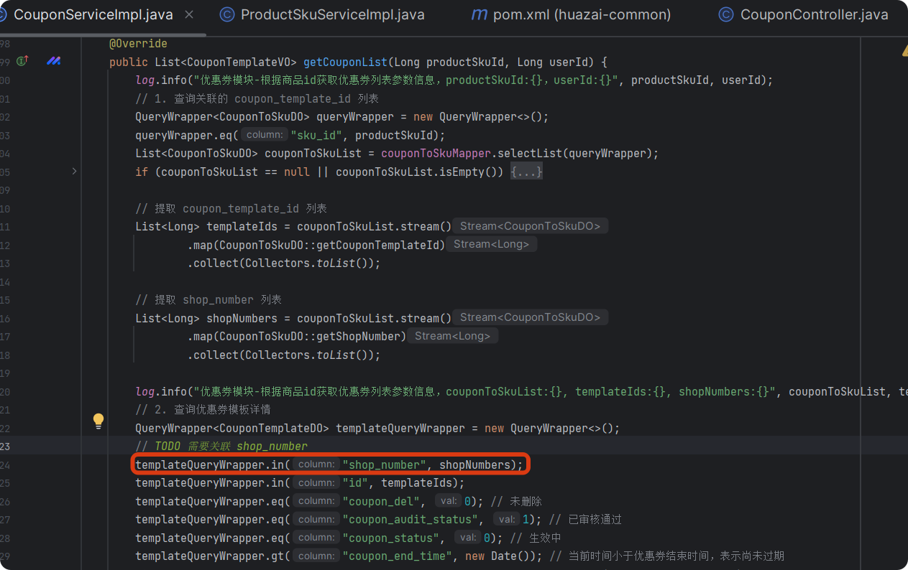

只不过这里还有一些问题没有修复，目前添加 shardingsphere 后，feign 客户端只能获取到单条数据了 不清楚哪里的问题，报错如下：

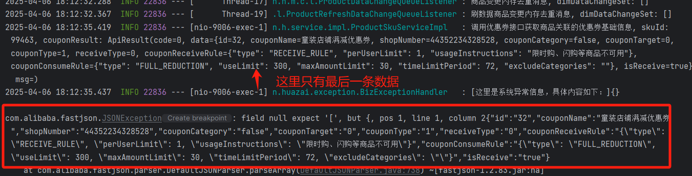

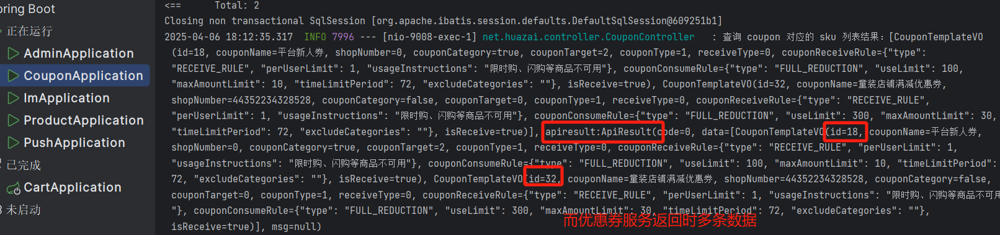

不清楚哪里的问题，等修复后再合并分支到 master，目前只是提交代码到当前分支。

目前已解决，首先需要升级下 fastjson 版本，从目前的 1.2.83 升级到 2.0.57 版本。

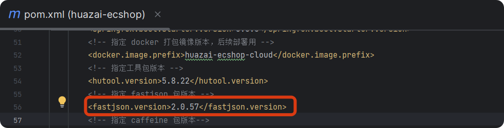

另外服务端控制器需要做下配置，如下：

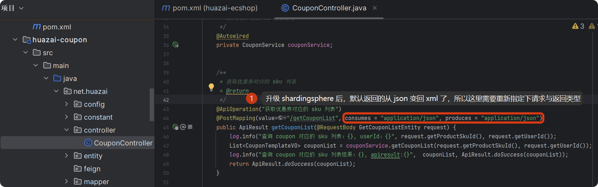

测试效果如下：

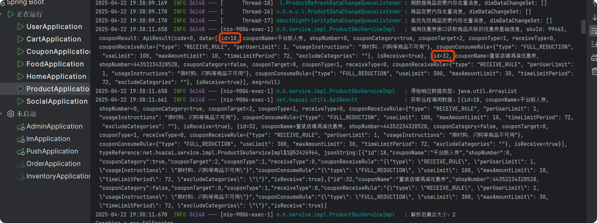

### **2.6.2 其他非分库分表服务兼容实战 5.5.2 版本**

**5.5.2 版本中不需要做兼容处理，**这个版本用户id不做分布式ID配置了，保持原状。感兴趣可以按 **5.2.1 版本进行实操**

### **2.6.2 其他非分库分表服务兼容实战 5.2.1 版本**

下面是基于 shardingsphere-starter 的方式来解决的，这个最新是 2022 年的。

这里拿「**用户服务 huazai-user**」来举例，其他服务接入类似。

###   
**2.6.2.1 引入 shardingsphere-starter 依赖**

在 Common 包中引入 [shardingsphere-jdbc-core-spring-boot-starter](http://shardingsphere-jdbc-core-spring-boot-starter/) 依赖。

<!-- 引入 shardingsphere 最新稳定版依赖 https://mvnrepository.com/artifact/org.apache.shardingsphere/shardingsphere-jdbc-core-spring-boot-starter -->

<dependency>

<groupId>org.apache.shardingsphere</groupId>

<artifactId>shardingsphere-jdbc-core-spring-boot-starter</artifactId>

<version>5.2.1</version>

</dependency>

###   
**2.6.2.2 配置开关处理**

目前所有的服务都接入到了「**Nacos 配置中心**」，所以只需要修改这里的配置即可，下图是展示「**关闭分库分表**」标识。

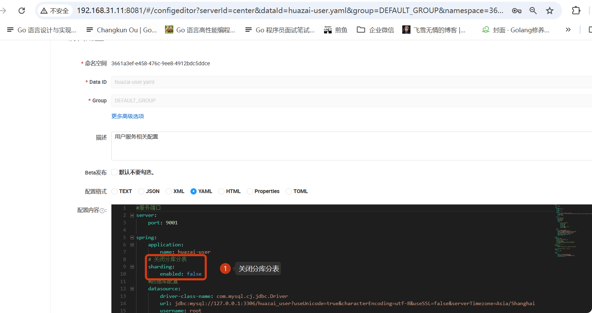

  
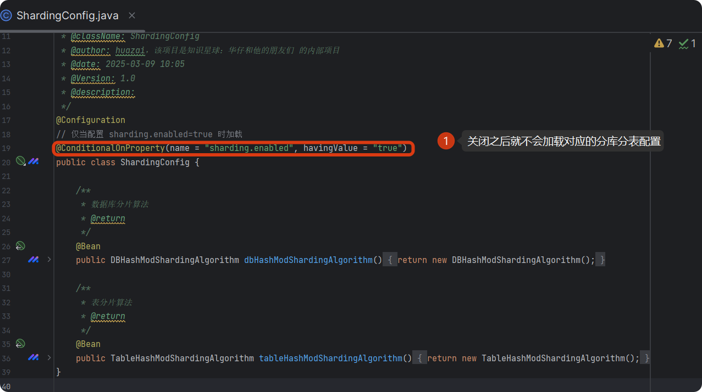

> 5.x.x 版本后，ShardingSphere-JDBC 的配置文件配置方式有了大的变化，从之前和 Spring 耦合变更为完全解耦，大家需要明确，配置文件内容在 git 代码都有，nacos 配置分库分表加载路径在 application.yml 分库分表具体配置在 shardingsphere-config.yaml

### **2.6.2.3 启动类排除 shardingSphere 自动配置**

这一步很重要，记得排除，否则会报 Bean 冲突，我们通过自定义接管了 [shardingsphere](http://shardingsphere/) 的自动配置。

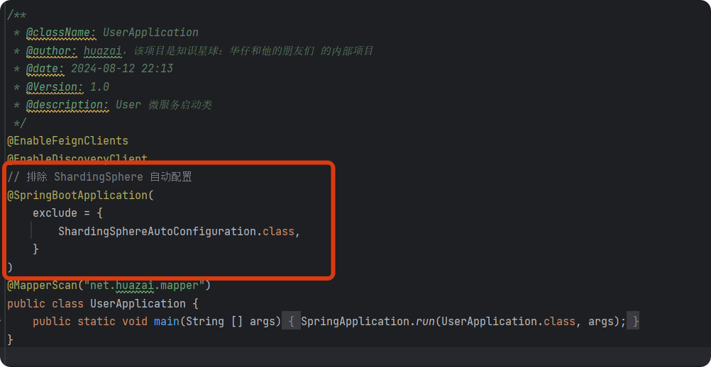

### **2.6.2.4 开发分布式 ID 配置**

由于不需要「**分库分表**」，但是还有「**全局唯一ID**」生成的需求，比如「**用户 ID**」作为「**用户领券记录表**」的分片键处理的，那么就需要单独开发一个「**分布式 ID**」的配置来支撑。

这里我们直接使用 [shardingsphere-jdbc-core-spring-boot-starter](http://shardingsphere-jdbc-core-spring-boot-starter/) 中已经集成好的「**CosIdSnowflake**」算法来实现。

  
在 [ShardingSphere 5.X](http://shardingsphere%205.x/) 版本后进一步丰富了其框架内部的主键生成策略方案。此前仅提供了 [UUID](http://uuid/) 和 [Snowflake](http://snowflake/)两种策略，现在又陆续提供了 [NanoID](http://nanoid/)、[CosId](http://cosid/)、[CosId-Snowflake](http://cosid-snowflake/) 三种策略。

[CosId](http://cosid/) 是一个高性能的分布式 ID 生成器框架，[Shardingsphere](http://shardingsphere%20/) 将其引入到自身的框架内，只简单的使用了 [CosId](http://cosid%20/) 算法。

关于介绍可以参考这篇：[https://cosid.ahoo.me/reference/blog/ShardingSphere-Integration-CosId.html](https://cosid.ahoo.me/reference/blog/ShardingSphere-Integration-CosId.html)

其 github 地址：[https://github.com/Ahoo-Wang/CosId?tab=readme-ov-file](https://github.com/Ahoo-Wang/CosId?tab=readme-ov-file)

说完了 [CosId](http://cosid/)，我们来看下 [CosId-Snowflake](http://cosid-snowflake/)，它是 [CosId](http://cosid%20/) 框架内提供的 [Snowflake](http://snowflake%20/) 算法，它主要是由「**时间戳**」、「**工作机器 ID workId**」、「**序列号 sequence**」三部分组成，同样解决了「**时钟回拨**」等问题，非常高性能。

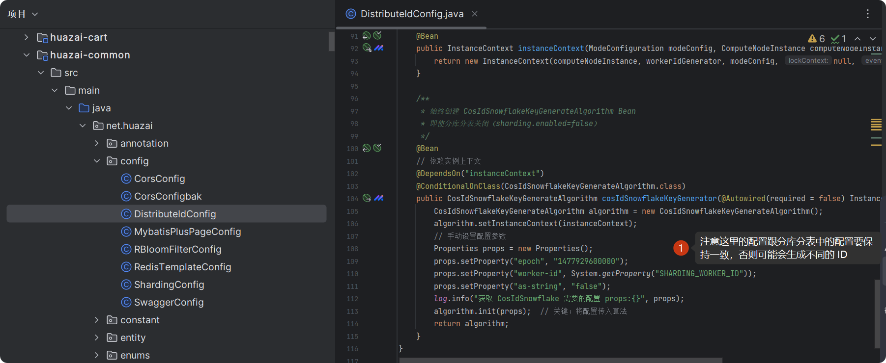

那么这个 [SHARDING\_WORKER\_ID](http://sharding_worker_id%20/) 是哪里来的呢？我们都知道在「**雪花算法**」生成的 ID 主要由「**时间戳**」、「**工作机器 ID workId**」、「**序列号 sequence**」三部分组成。所以需要一个 「**workerId**」来保证生成的 ID 不重复。

这里我们通过「**动态指定**」的方式来分配需要的「**workerId**」，在服务启动时，通过 JVM 参数控制为服务分配不同的 「**workerId**」。

  
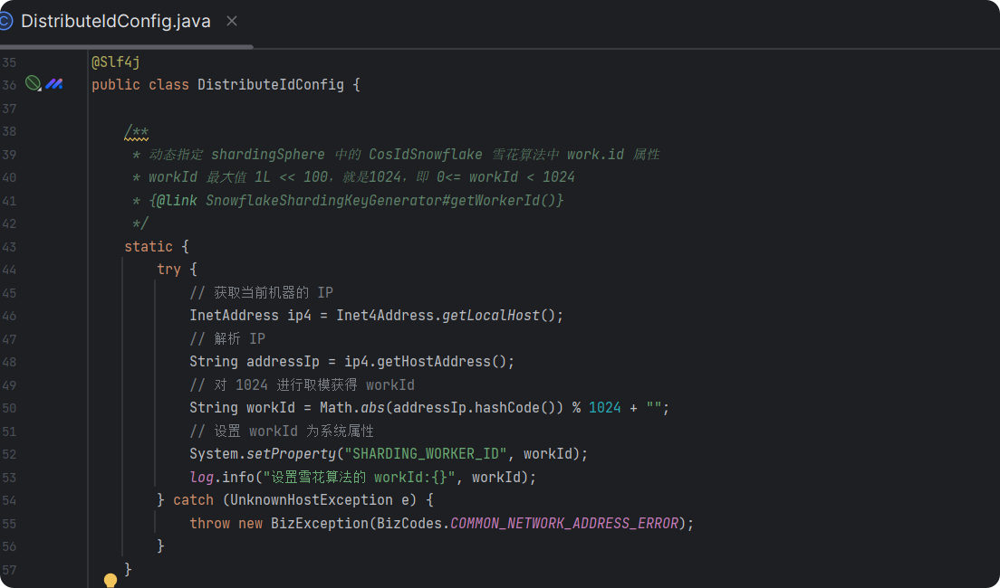

在服务启动时会打印生成的「**workerId**」： 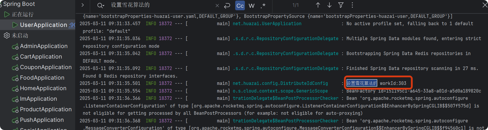

另外在加载配置时会获取对应的「**workerId**」等 props 信息：

  
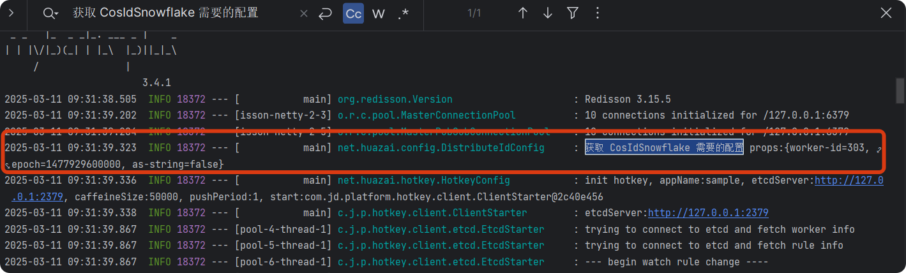

### **2.6.2.5 测试生成全局唯一用户ID**

**这里需要注意的是：SQL 中不要主动拼接主键字段（包括持久化工具自动拼接的）否则一律走默认的 Snowflake 策略！！！**

ShardingSphere中为分片表设置主键生成策略后，执行插入操作时，会自动在SQL中拼接配置的主键字段和生成的分布式ID值。所以，在创建分片表时**主键字段无需再设置自增 AUTO\_INCREMENT（我们这里就不修改表结构了保持原状）**。同时，在插入数据时应**避免为主键字段赋值**，否则会覆盖主键策略生成的ID。

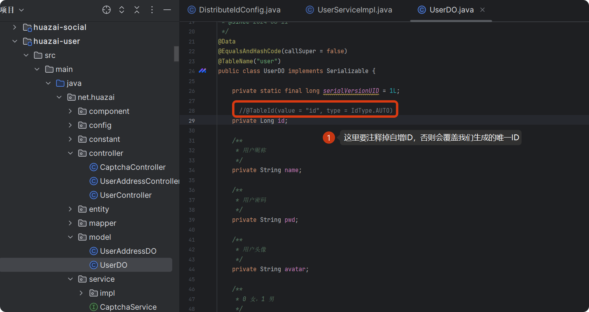

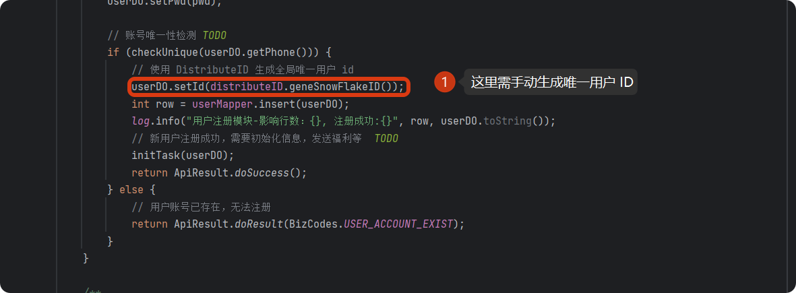

测试效果如下：

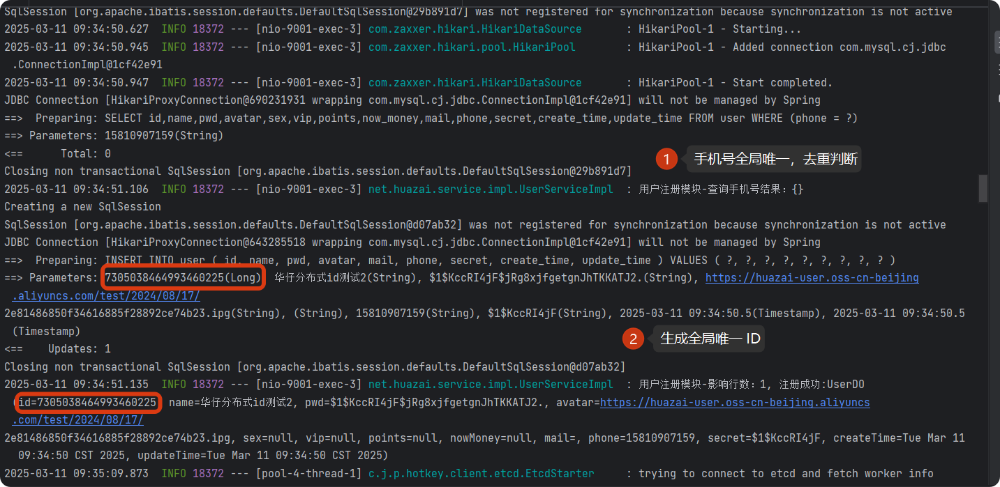

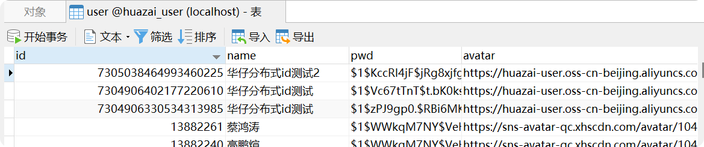

接下来，我们需要处理下用户表的历史数据，将「**自增 id**」替换为 「**snowflakeId**」。