从今天之后的一段时间内，华仔会带着大家一起从零开始搭建并研发一套高并发的电商实战项目，这里会涉及到很多互联网大厂开发过程中所使用的核心技术和架构设计模式，希望大家学完之后可以用到自己的简历中。

接下来我们会重点架构设计和开发一下我们高并发电商实战项目中的「**后管服务优惠券服务**」。

这是第六十二篇，本篇我们继续进行电商实战项目设计与开发，本篇对「**优惠券后管服务**」中优惠券模板创建功能开发的后续流程。

文章汇总位置：[https://wx.zsxq.com/dweb2/index/columns/51122554151214](https://wx.zsxq.com/dweb2/index/columns/51122554151214)

源码授权与获取地址：[https://articles.zsxq.com/id\_1s85grnaae4p.html](https://articles.zsxq.com/id_1s85grnaae4p.html)

本章源码地址：[https://gitcode.net/u011359591/huazai-ecshop/-/tree/ecshop-chapter-6](https://gitcode.net/u011359591/huazai-ecshop/-/tree/ecshop-chapter-61)2

## **01 前言**

终于要设计与研发电商项目代码了，今天我们主要对「**优惠券后管服务**」中优惠券模板创建功能开发进行完善，增加「**优惠券模板详情查看**」、「**创建优惠券模板缓存预热**」、「**RocketMQ 延时处理结束状态**」等功能。

## **02 后管优惠券模板功能完善**

## **2.1 优惠券模板详情查看**

先来看下这个模板详情，很简单：

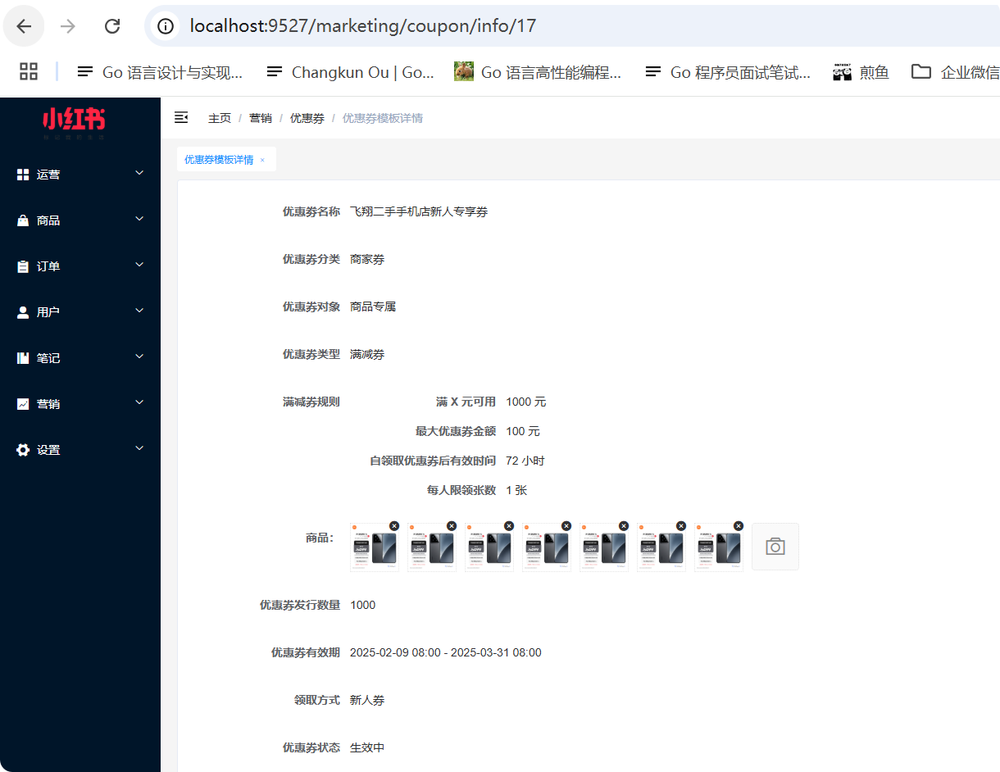

商品信息后续再完善补充。

## **2.2 创建优惠券模板缓存预热**

在上一篇中，我们通过「**责任链设计模式**」已经将创建优惠券模板的大致流程处理完毕，此处还缺少「**缓存预热功能**」。

增加「**缓存预热功能**」之后的整个「**责任链 chain**」流程图如下：

  
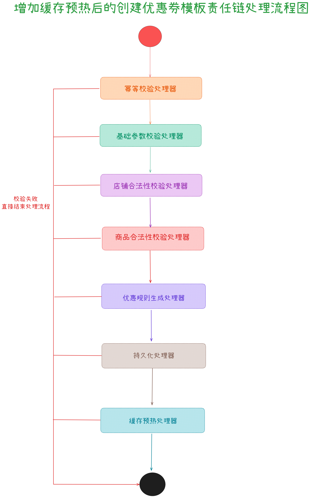

先来看下数据结构选型，有三种类型可选：

1.  Hash 结构：可以存储完整的优惠券模板信息，支持字段级更新，内存效率高。
2.  Zset 结构：按时间排序的模板ID集合，支持范围查询和分页。
3.  String 结构：空值缓存（防缓存穿透），支持低成本解决无效请求。

这里我们采用 「**Hash 数据结构**」来实现优惠券模板「**缓存预热功能**」，这里也会封装成一个「**责任链 chain**」 代码如下：

  
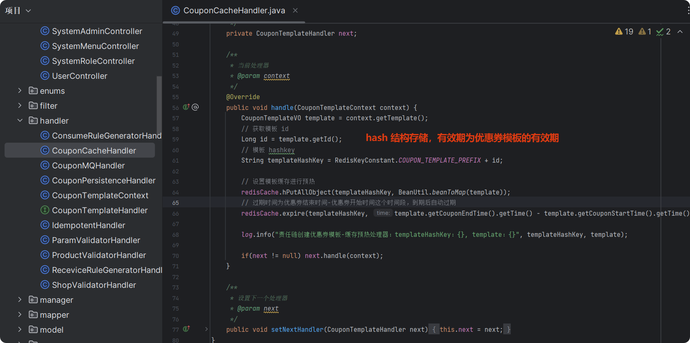

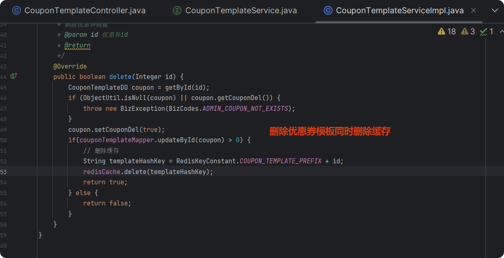

责任链处理器执行效果如下：

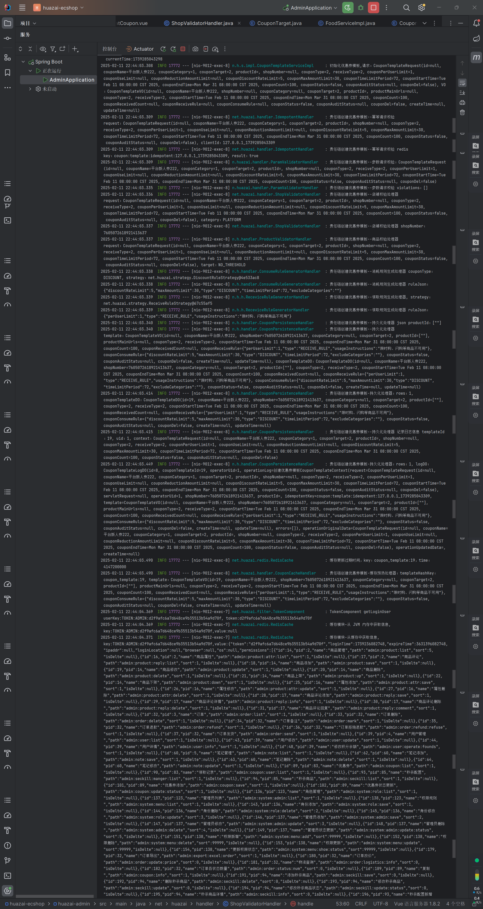

缓存数据如下：

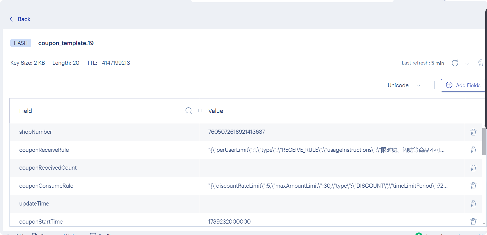

## **2.3 创建优惠券模板发送延时消息**

### **2.3.1 RocketMQ 基础知识**

如果对 RocketMQ 不了解的话，可以来学习我的 RocketMQ 系列专栏，位置如下：

PC 端：

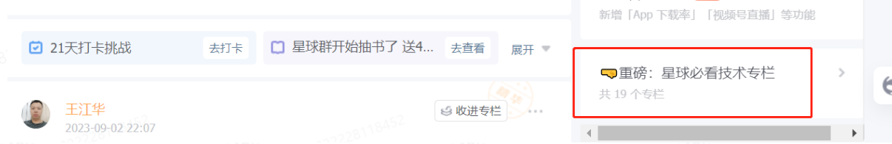

手机端：

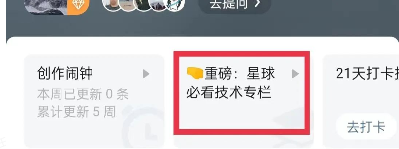

关于基础安装可以直接点击：[【入门实战系列第三篇】RocketMQ 安装入门实战](https://articles.zsxq.com/id_o92x7jv3p0tu.html) 这里就不赘述这些基础知识了。

### **2.3.2 RocketMQ 延时消息客户端**

由于 RocketMQ 4.x 版本是使用 [setDelayTimeLevel()](http://setdelaytimelevel\(\)/) 方法实现延迟级别机制的，而 RocketMQ 5.x 推荐使用**精确时间延迟**（支持任意秒数）。

其差异如下：

1.  **延迟设置方式：**RocketMQ 4.x 仅支持预定义延迟级别（1-18），而 5.x 支持精确到秒的延迟时间（1s - 604800s）。
2.  **最大延迟时间：**RocketMQ 4.x 仅支持 2小时（level 18对应2h），而 5.x 支持 3天（259200秒）。
3.  **API 方法：**RocketMQ 4.x 使用 [setDelayTimeLevel(int level)](http://setdelaytimelevel\(int%20level\)/)，而 5.x 使用 [setDelayTimeSec(long seconds)](http://setdelaytimesec\(long%20seconds\)/)。
4.  **兼容性：**RocketMQ 4.x 中向下兼容但建议使用新API，而 5.x 版本必须使用新API。

首先客户端版本要升级到 5.x 的客户端版本，这里我们使用 5.3.0：

  
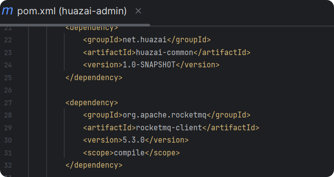

另外需要改造一下之前的生产者客户端代码，如下：

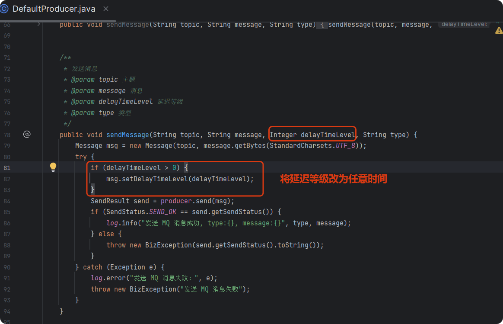

package net.huazai.mq.producer;

import lombok.extern.slf4j.Slf4j;

import net.huazai.constant.RocketMQConstant;

import net.huazai.exception.BizException;

import org.apache.rocketmq.client.exception.MQClientException;

import org.apache.rocketmq.client.producer.SendResult;

import org.apache.rocketmq.client.producer.SendStatus;

import org.apache.rocketmq.client.producer.TransactionMQProducer;

import org.apache.rocketmq.common.message.Message;

import org.apache.rocketmq.spring.autoconfigure.RocketMQProperties;

import org.springframework.beans.factory.annotation.Autowired;

import org.springframework.stereotype.Component;

import java.nio.charset.StandardCharsets;

import java.util.List;

import java.util.stream.Collectors;

/\*\*

\* RocketMQ 生产者

\*/

@Slf4j

@Component

public class DefaultProducer {

/\*\*

\* 事务生产者客户端

\*/

private final TransactionMQProducer producer;

@Autowired

public DefaultProducer(RocketMQProperties rocketMQProperties) {

// 初始化事务生产者客户端，设置对应的生产者组

producer = new TransactionMQProducer(RocketMQConstant.COUPON\_TEMPLATE\_DEFAULT\_PRODUCER\_GROUP);

// 设置 nameserver

producer.setNamesrvAddr(rocketMQProperties.getNameServer());

// 启动生产者服务

start();

}

/\*\*

\* 启动 rocketmq 生产者服务

\* 该对象在使用之前必须要调用一次，只能初始化一次

\*/

public void start() {

try {

this.producer.start();

} catch (MQClientException e) {

log.error("rocketmq producer start error", e);

}

}

/\*\*

\* 关闭 rocketmq 生产者

\*/

public void shutdown() {

this.producer.shutdown();

}

/\*\*

\* 发送单条消息

\* @param topic 主题

\* @param message 消息

\* @param type 类型

\*/

public void sendMessage(String topic, String message, String type) {

sendMessage(topic, message, -1L, type);

}

/\*\*

\* 发送消息

\* @param topic 主题

\* @param message 消息

\* @param delaySeconds 任意时间延迟

\* @param type 类型

\*/

public void sendMessage(String topic, String message, Long delaySeconds, String type) {

Message msg \= new Message(topic, message.getBytes(StandardCharsets.UTF\_8));

try {

// 设置精确延迟（秒级）

if (delaySeconds != null && delaySeconds > 0) {

validateDelay(delaySeconds); // 参数校验

msg.setDelayTimeSec(delaySeconds);

}

SendResult send \= producer.send(msg);

handleSendResult(send, type, message);

} catch (Exception e) {

handleSendError(e, message);

}

}

/\*\*

\* 批量发送消息

\* @param topic 主题

\* @param messages 多个消息

\* @param type 类型

\*/

public void sendMessages(String topic, List<String> messages, String type) {

sendMessages(topic, messages, -1, type);

}

/\*\*

\* 批量发送消息

\* @param topic 主题

\* @param messages 多个消息

\* @param delaySeconds 任意时间延迟

\* @param type 类型

\*/

// 批量发送改造

public void sendMessages(String topic, List<String> messages, Long delaySeconds, String type) {

List<Message> msgList = messages.stream()

.map(content -> {

Message msg \= new Message(topic, content.getBytes(StandardCharsets.UTF\_8));

if (delaySeconds != null && delaySeconds > 0) {

msg.setDelayTimeSec(delaySeconds);

}

return msg;

})

.collect(Collectors.toList());

try {

SendResult send \= producer.send(msgList);

handleSendResult(send, type, null);

} catch (Exception e) {

handleSendError(e, null);

}

}

/\*\*

\* 参数校验，确保任意时间在范围之内

\* @param delaySeconds

\*/

private void validateDelay(Long delaySeconds) {

if (delaySeconds < 1 || delaySeconds > 5184000) {

throw new BizException("延迟时间必须在1秒到5184000秒（60天）之间");

}

}

/\*\*

\* 统一结果处理

\* @param send

\* @param type

\* @param message

\*/

private void handleSendResult(SendResult send, String type, String message) {

if (send.getSendStatus() == SendStatus.SEND\_OK) {

log.info("MQ消息发送成功, type:{}, msgId:{}", type, send.getMsgId());

} else {

log.error("MQ消息发送状态异常, status:{}", send.getSendStatus());

throw new BizException("MQ状态异常: " + send.getSendStatus());

}

}

/\*\*

\* 统一异常处理

\* @param e

\* @param message

\*/

private void handleSendError(Exception e, String message) {

log.error("MQ消息发送失败, message:{}", message, e);

if (e instanceof MQClientException) {

throw new BizException("MQ客户端异常: " + e.getMessage());

}

throw new BizException("MQ服务端异常");

}

/\*\*

\* 获取事务生产者

\* @return

\*/

public TransactionMQProducer getProducer() {

return producer;

}

}

### **2.3.3 RocketMQ 延时消息责任链处理器**

在上一节中，我们通过「**责任链设计模式**」已经将「**缓存预热功能**」纳入到创建优惠券模板流程处理中，此处还缺少「**RocketMQ 延时消息处理优惠券关闭状态功能**」。

简化流程图如下：

  

增加「**RocketMQ 延时消息处理优惠券关闭状态功能**」之后的整个「**责任链 chain**」完成流程图如下：

  
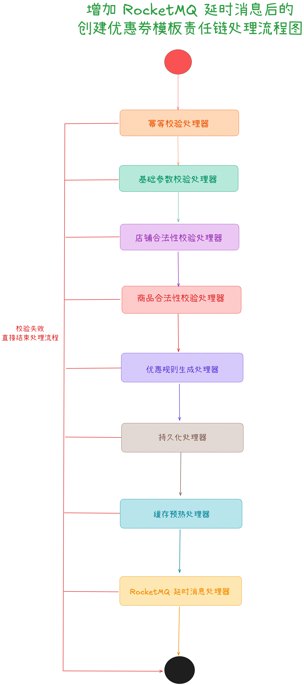

### **2.3.3.1 RocketMQ 延时消息发送**

先创建好对应的延时 Topic，默认程序创建的为非延时 Topic，如下图：

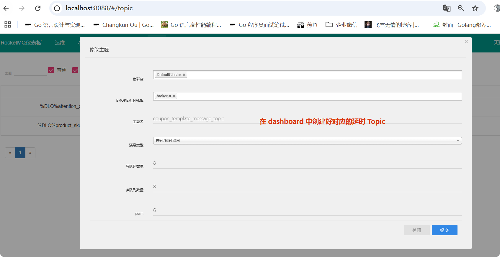

整个发送消息的代码实现过程还是比较简单的，如下：

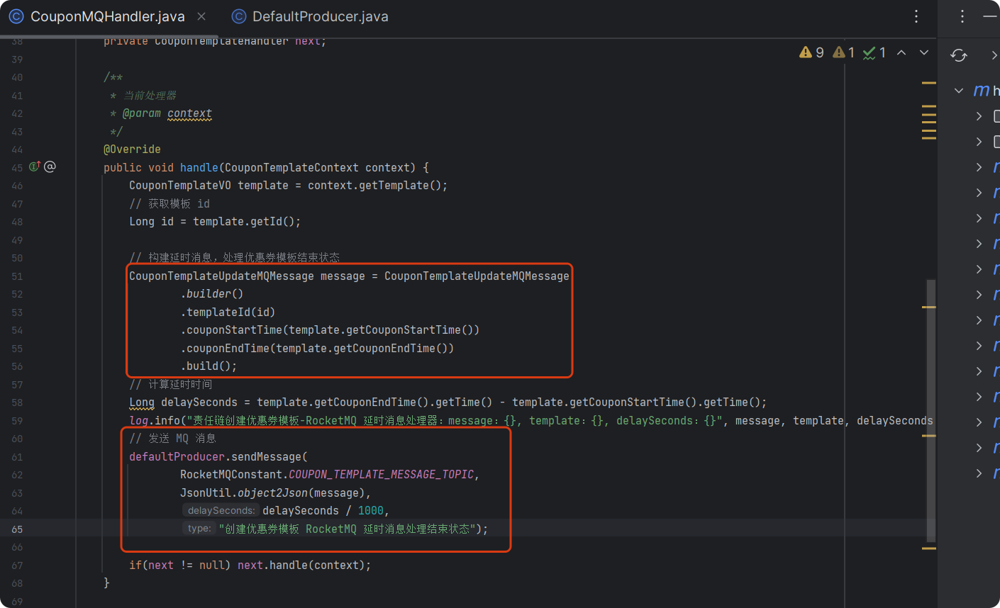

测试发现默认最大延时时间仅支持 3 天，报错如下：

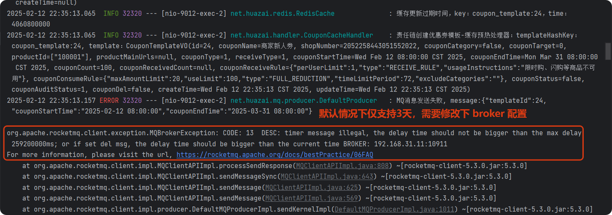

通过命令查询发现也是 3 天：

./mqadmin getBrokerConfig -n 192.168.31.11:9876 -b 192.168.31.11:10911 | grep timer

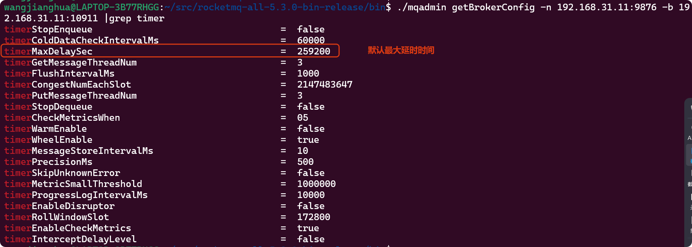

这里我们修改下，让其支持 2个月之内的任意延时时间，修改完成后重启 Broker 服务。

我的 broker 配置文件位置，根据你的情况自行修改：

cd /home/wangjianghua/src/rocketmq-all-5.3.0-bin-release/conf

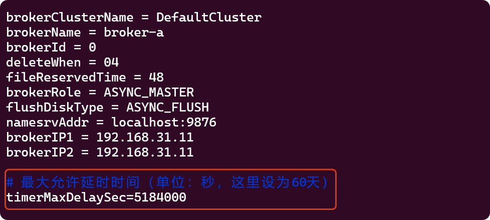

重新测试效果：

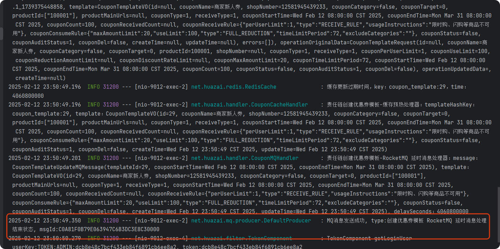

发现已经发送成功了，但是从 RocketMQ dashboard 是查不到的，因为还没有到执行时间，服务端会通过「**时间轮算法**」来推算是否到了执行时间，如果到了才会将「**定时消息**」转换为「**原始消息**」进行执行。

###   
**2.3.3.2 RocketMQ 延时消息消费**

此处，我们做了「**消息队列幂等校验**」，整个校验的过程如下：

  
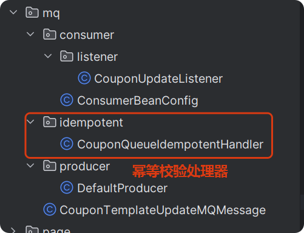

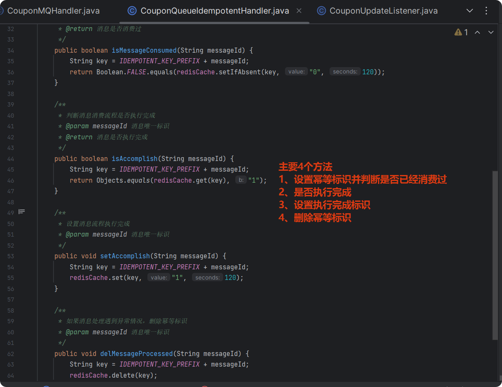

整个消费逻辑如下：

/\*\*

\* 优惠券模板结束状态变更监听器

\*/

@Slf4j

@Component

public class CouponUpdateListener implements MessageListenerConcurrently {

/\*\*

\* 注入幂等处理器

\*/

@Autowired

private CouponQueueIdempotentHandler couponQueueIdempotentHandler;

/\*\*

\* 注入 mapper

\*/

@Autowired

private CouponTemplateMapper couponTemplateMapper;

/\*\*

\* 并发消费美食消息

\* @param msgList

\* @param context

\* @return

\*/

@Override

public ConsumeConcurrentlyStatus consumeMessage(List<MessageExt> msgList, ConsumeConcurrentlyContext context) {

for (MessageExt messageExt : msgList) {

String msgId \= messageExt.getMsgId();

try {

String msg \= new String(messageExt.getBody());

// 解析优惠券结束状态模板消息

CouponTemplateUpdateMQMessage message \= JsonUtil.json2Object(msg, CouponTemplateUpdateMQMessage.class);

if (message == null) {

log.warn("优惠券模板 MQ 延时消息异步更新-消息为空结束，原始消息内容：{}", msg);

return ConsumeConcurrentlyStatus.RECONSUME\_LATER;

}

log.info("优惠券模板 MQ 延时消息异步更新-执行优惠券模板结束状态数据，消息内容：{}", message);

// 1. 幂等性校验

if (couponQueueIdempotentHandler.isMessageConsumed(msgId)) {

// 判断当前的这个消息流程是否执行完成

if (couponQueueIdempotentHandler.isAccomplish(msgId)) {

log.warn("优惠券模板 MQ 延时消息异步更新-检测到重复消息，当前流程还未执行完，消息内容：{}", message);

return ConsumeConcurrentlyStatus.RECONSUME\_LATER;

}

log.error("优惠券模板 MQ 延时消息异步更新 consume error, 消息未完成流程，需要消息队列重试");

return ConsumeConcurrentlyStatus.RECONSUME\_LATER;

}

// 优惠券模板 id

Long templateId \= message.getTemplateId();

// 2. 数据库乐观锁校验

CouponTemplateDO template \= couponTemplateMapper.selectByIdForUpdate(templateId);

if (template == null) {

log.error("优惠券模板不存在 templateId:{}", templateId);

continue;

}

// 3. 到期时间校验

if (!isExpired(template, message)) {

log.warn("优惠券未到期，取消处理 templateId:{}", templateId);

// 清理幂等锁

couponQueueIdempotentHandler.delMessageProcessed(msgId);

continue;

}

// 4. 更新状态（带版本号校验）

int result \= couponTemplateMapper.updateStatusWithVersion(

templateId,

1,

template.getVersion()

);

if (result == 0) {

throw new BizException("版本号变更触发重试");

}

// 设置消费完成表示

couponQueueIdempotentHandler.setAccomplish(msgId);

} catch (Exception e) {

// 本次消费失败，下次重新消费

couponQueueIdempotentHandler.delMessageProcessed(msgId);

log.error("优惠券模板 MQ 延时消息异步更新 consume error, 更新博主美食缓存数据消费失败", e);

return ConsumeConcurrentlyStatus.RECONSUME\_LATER;

}

}

log.info("优惠券模板 MQ 延时消息异步更新-执行优惠券模板结束状态数据消费成功, result: {}", ConsumeConcurrentlyStatus.CONSUME\_SUCCESS);

return ConsumeConcurrentlyStatus.CONSUME\_SUCCESS;

}

/\*\*

\* 精确到期判断（考虑时区）

\* @param template

\* @param message

\* @return

\*/

private boolean isExpired(CouponTemplateDO template, CouponTemplateUpdateMQMessage message) {

ZoneId zone \= ZoneId.of("Asia/Shanghai");

Instant now \= Instant.now();

// 双重校验：数据库时间 + 消息时间

boolean dbExpired \= template.getCouponEndTime().toInstant().isBefore(now);

boolean msgExpired \= message.getCouponEndTime().toInstant().isBefore(now);

return dbExpired && msgExpired;

}

}

接下来我们测试一个 10s 的延时消息，看是否可以正常消费掉。

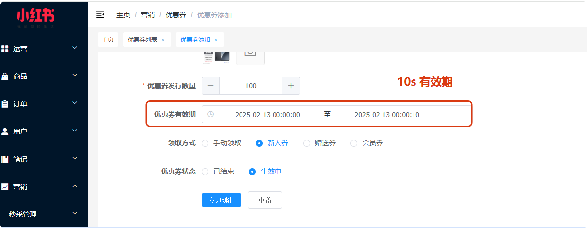

执行结果如下：

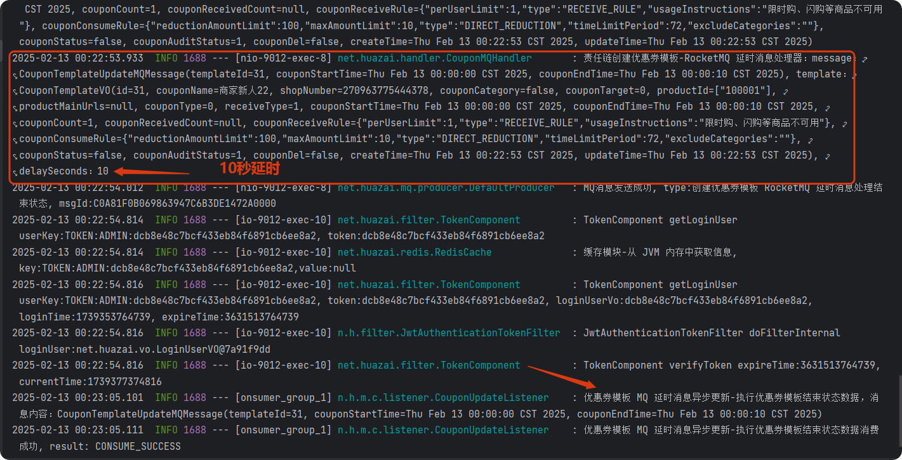

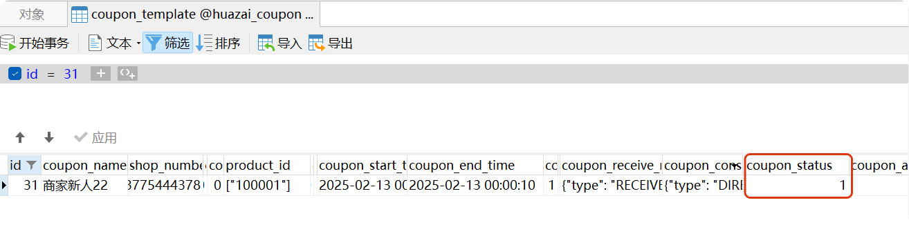

可以看到消息已经消费成功了，如下：

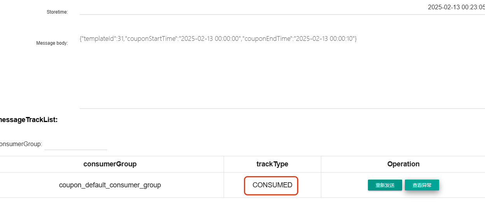

最后，我们来梳理下增加「**RocketMQ 延时消息处理优惠券关闭状态功能**」之后的整个「**责任链 chain**」时序图如下：

  
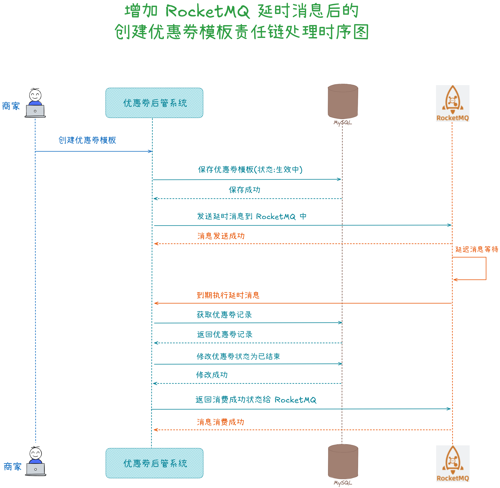