从今天之后的一段时间内，华仔会带着大家一起从零开始搭建并研发一套高并发的电商实战项目，这里会涉及到很多互联网大厂开发过程中所使用的核心技术和架构设计模式，希望大家学完之后可以用到自己的简历中。

接下来我们会重点架构设计和开发一下我们高并发电商实战项目中的「**优惠券推送任务**」相关功能 。

这是第六十五篇，本篇我们继续进行电商实战项目设计与开发，本篇我们实战「**通过线程池 + 任务分片 + 分片消息合并优化千万级用户量优惠券推送任务**」。

文章汇总位置：[https://wx.zsxq.com/dweb2/index/columns/51122554151214](https://wx.zsxq.com/dweb2/index/columns/51122554151214)

源码授权与获取地址：[https://articles.zsxq.com/id\_1s85grnaae4p.html](https://articles.zsxq.com/id_1s85grnaae4p.html)

本章源码地址：[https://gitcode.net/u011359591/huazai-ecshop/-/tree/ecshop-chapter-65](https://gitcode.net/u011359591/huazai-ecshop/-/tree/ecshop-chapter-65)

## **01 前言**

今天我们来实战下「**通过线程池 + 任务分片 + 分片消息合并优化千万级用户量优惠券推送任务**」，今天的内容比较干货，大家耐心学习和实战。

##   
**02 创建优惠券推送任务**

在实现「**千万级用户量优惠券推送任务**」之前，我们先来开发下「**优惠券推送任务**」创建功能，在这个功能中分为「**立即推送**」、「**定时推送**」两种。

1.  立即推送：创建完成后「**直接发送 MQ 消息**」。
2.  定时推送：创建完成后由定时任务监控系统扫描，直到到达任务的执行时间，然后通过「**XXL-Job 进行定时发送 MQ 消息**」。

整个流程时序图如下：

  
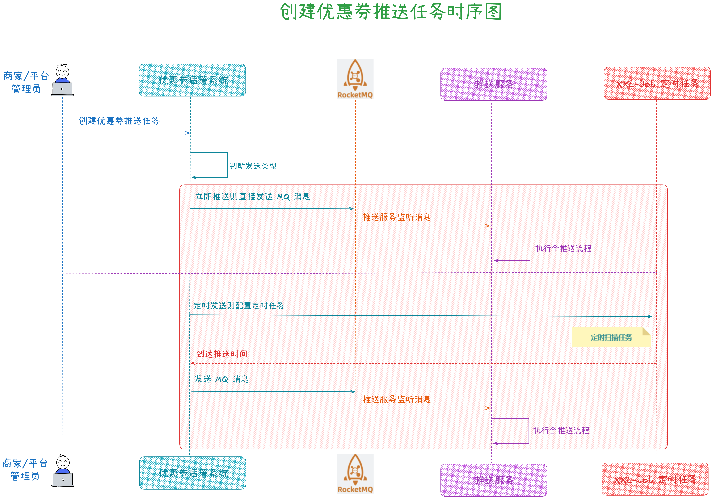

## **2.1 立即推送**

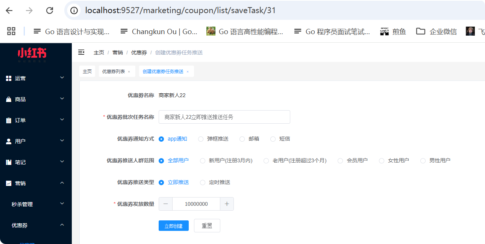

这块代码比较简单：

/\*\*

\* 创建优惠券推送任务

\* @param request

\* @return

\*/

@Override

@Transactional(rollbackFor = Exception.class)

public boolean createTask(CouponTaskRequest request) {

// 校验模板id 是否存在

CouponTemplateDO coupon \= getById(request.getCouponTemplateId());

if (ObjectUtil.isNull(coupon) || coupon.getCouponDel()) {

throw new BizException(BizCodes.ADMIN\_COUPON\_NOT\_EXISTS);

}

if (request.getPushCouponNum() > coupon.getCouponCount()) {

throw new BizException(BizCodes.ADMIN\_COUPON\_TASK\_NUM\_VALID);

}

// 如果是立即发送则 oushTime 为当前时间

if (!request.getPushType()) {

request.setPushTime(new Date());

}

CouponPushCronDO pushCronDO \= new CouponPushCronDO();

BeanUtils.copyProperties(request, pushCronDO);

LoginUserVO loginUserVo \= SecurityUtil.getLoginUserVo();

// 设置操作人

pushCronDO.setOperatorUid(loginUserVo.getUser().getId().longValue());

// 设置批次id

// 这里先使用 uuid 来生成

String uuid \= UUID.randomUUID().toString().replace("-", "");

// 取 UUID 的前 12 个字符（64 位）

String shortUUID \= uuid.substring(0, 12);

BigInteger batchId \= new BigInteger(shortUUID, 16);

log.info("创建优惠券推送任务--生成批次id：{}，pushCronDO：{}", batchId, pushCronDO);

pushCronDO.setBatchId(batchId.longValue());

int rows \= couponPushCronMapper.insert(pushCronDO);

log.info("创建优惠券推送任务 rows：{}, pushCronDO：{}", rows, pushCronDO);

if (rows > 0 && !pushCronDO.getPushType()) {

// 发送 MQ 进行立即推送

publishPushMQ(pushCronDO);

}

return rows > 0;

}

/\*\*

\* 发送 MQ 消息处理推送任务

\* @param pushCronDO

\*/

private void publishPushMQ(CouponPushCronDO pushCronDO) {

// 获取推送任务 id

Long id \= pushCronDO.getId();

// 构建消息，处理优惠券推送任务

CouponPushUpdateMQMessage message \= CouponPushUpdateMQMessage

.builder()

.id(id)

.couponTemplateId(pushCronDO.getCouponTemplateId())

.batchId(pushCronDO.getBatchId())

.pushName(pushCronDO.getPushName())

.pushRange(pushCronDO.getPushRange())

.pushCouponNum(pushCronDO.getPushCouponNum())

.notifyType(pushCronDO.getNotifyType())

.pushType(pushCronDO.getPushType())

.pushTime(pushCronDO.getPushTime())

.pushStatus(pushCronDO.getPushStatus())

.operatorUid(pushCronDO.getOperatorUid())

.build();

// 发送 MQ 消息

defaultProducer.sendMessage(

RocketMQConstant.COUPON\_PUSH\_MESSAGE\_TOPIC,

JsonUtil.object2Json(message),

0L,

"创建优惠券推送任务 RocketMQ 消息");

}

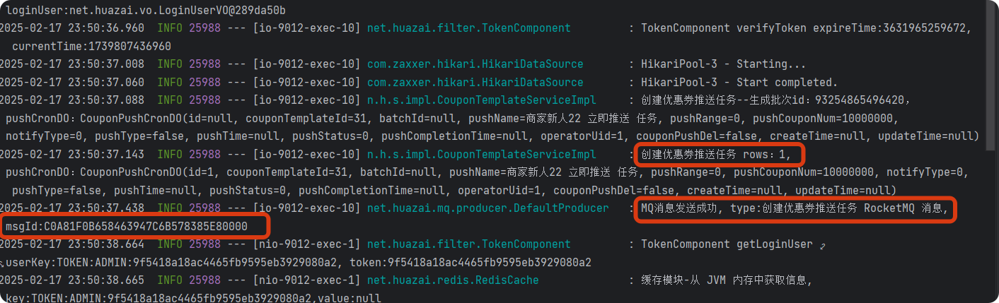

##   
**2.2 定时推送**

这里会单独抽离一个服务，就叫「**推送服务**」，后续专门做推送相关的任务处理。  

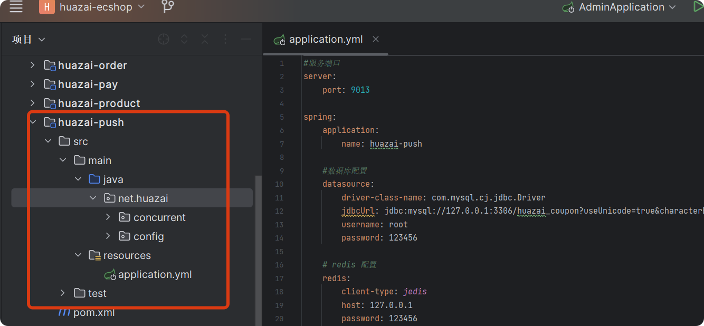

创建模块应该都会了吧，不会的话参考如下：

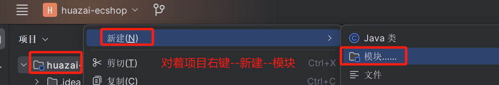

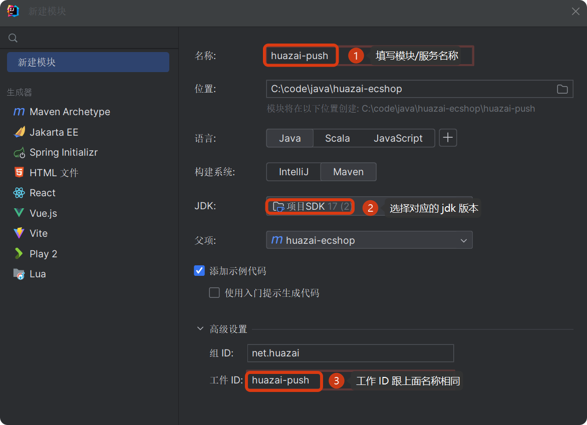

### **2.2.1 项目集成 XXL-Job**

通过上篇 [【电商实战项目第六十四篇】华仔电商实战后管服务安装部署分布式调度管理平台 XXL-Job 3.0 最新版](https://articles.zsxq.com/id_udbfdw6w1lwz.html) ，我们得知 XXL-Job 由「**调度中心**」和「**执行器**」组成，上篇已经完成了部署启动调度中心了，接下来介绍怎么「**配置部署执行器项目**」。

### **2.2.1.1 导入 XXL-Job 依赖**

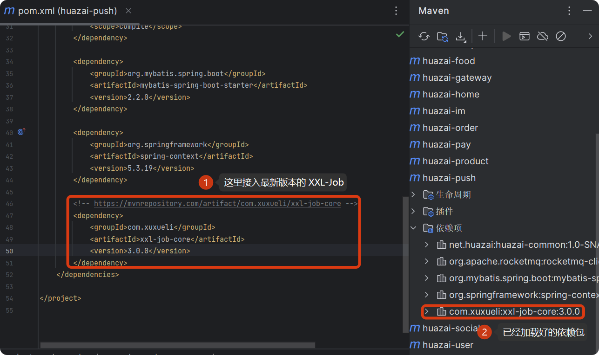

这里需要注意版本号与 XXL-Job 版本需要一致，这里我配置的都是 3.0.0 版本。

### **2.2.1.2 配置 application.yml 文件**

这里为了方便启动和展示，就暂时未纳入到 Nacos 中了，后续等部署时都会将配置文件纳入到 Nacos 中。

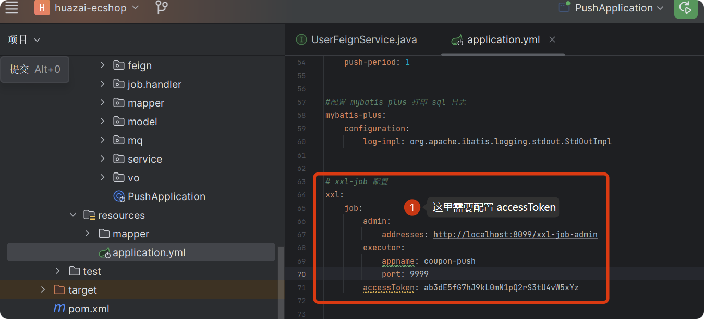

1.  [xxl.job.admin.addresses:](http://about:blank) 用来指定调度中心的地址。
2.  [xxl.job.executor.appname](http://xxl.job.executor.appname/): 用来指定执行器的名称（需要与后续 **2.2.1.4** 配置执行器的名称一致）。
3.  [xxl.job.executor.port](http://xxl.job.executor.port/): 用来指定执行器的端口（执行器实际上是一个内嵌的 Server，默认端口为 9999，配置多个同一服务实例时需要指定不同的执行器端口，否则会端口冲突）。
4.  [xxl.job.accessToken](http://xxl.job.accesstoken/): 用来指定访问口令（也就是上篇搭建 xxl-job 中指定的）。
5.  其他属性只需要照着配置即可。

### **2.2.1.3 编写配置类**

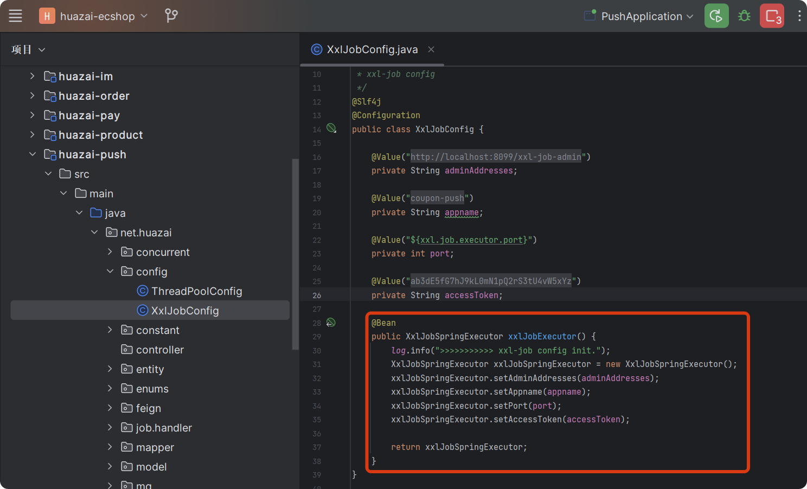

查看启动日志如下：

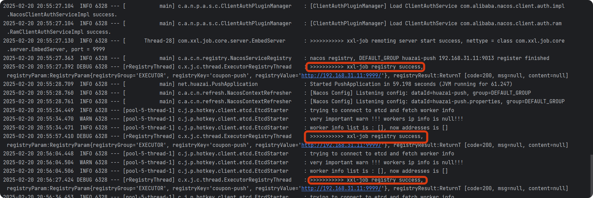

### **2.2.1.4 调度中心修改对应的执行器**

在上篇中，我们随便写了一个名称作为执行器，这里为了统一我们修改为如下：

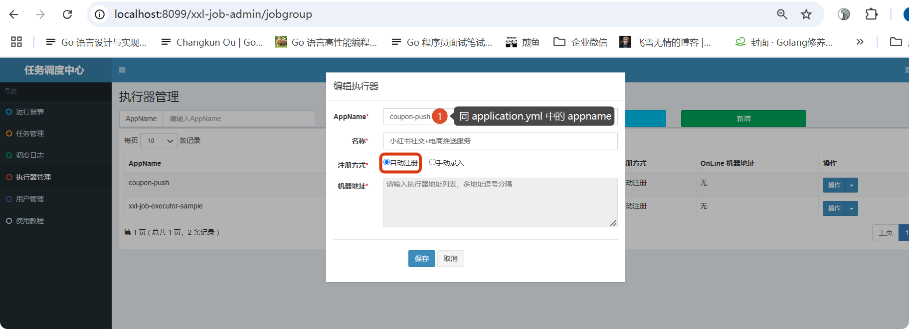

执行器的配置属性：

1.  AppName: 每个执行器集群的唯一标示 AppName，执行器会周期性以 AppName 为对象进行自动注册。可通过该配置自动发现注册成功的执行器，供任务调度时使用。
2.  名称: 执行器的名称（可以使用中文更好地体现该执行器是用来干嘛的）。
3.  注册方式：调度中心获取执行器地址的方式（一般为了方便可以选用自动注册即可）。
4.  自动注册：执行器自动进行执行器注册，调度中心通过底层注册表可以动态发现执行器机器地址。
5.  手动录入：人工手动录入执行器的地址信息，多地址逗号分隔，供调度中心使用。
6.  机器地址："注册方式"为"手动录入"时有效，支持人工维护执行器的地址信息。

### **2.2.1.5 配置自定义任务**

配置自定义任务有许多种模式，如「**Bean 模式（基于方法）**」、「**Bean 模式（基于类）**」、「**GLUE 模式**」等等。这里介绍通过「**Bean 模式（基于方法）**」 是如何自定义任务的（对于其余的模式可以参考官方文档）。

「**Bean 模式（基于方法）**」也就是每个任务对应一个方法，通过添加 [@XxLJob(value="自定义JobHandler名称", init = "JobHandler初始化方法", destroy = "JobHandler销毁方法")](http://xn--xxljob\(value="jobhandler",%20init%20=%20"jobhandler",%20destroy%20=%20"jobhandler"\)%20-pi82lc10igdsl0t2o3j4z8a4z5p4a3977lfvva6a93893at9yfg6oq/) 注解即可完成定义。

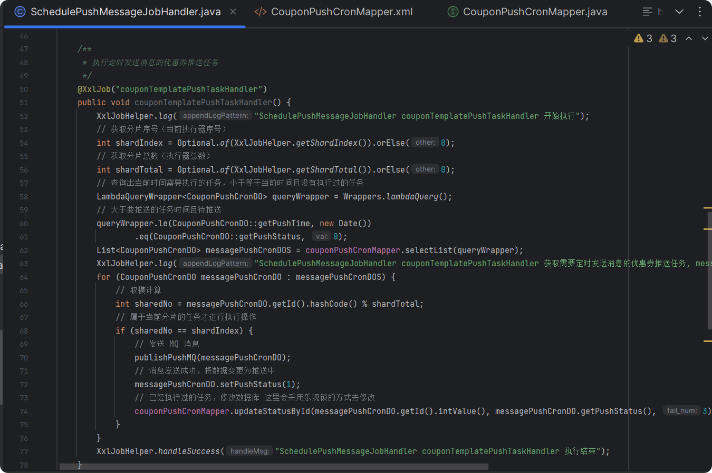

1.  通过注解也可以指定初始化方法和销毁方法，如果不填写可以直接写一个 自定义的 JobHandler 名称 用来后面在调度中心中配置任务时对应任务的 JobHandler 属性值。
2.  可以通过 [XxlJobHelper.log](http://xxljobhelper.log/) 来打印日志，通过调度中心可以查看执行日志的情况。
3.  可以通过 [XxlJobHelper.handleFail](http://xxljobhelper.handlefail/) 或 [XxlJobHelper.handleSuccess](http://xxljobhelper.handlesuccess/) 手动设置任务调度的结果（不设置时默认结果为成功状态，除非任务执行时出现异常）。

###   
**2.2.1.6 如何将任务均分给每台机器**

由于任务执行时间过长，需要搭建集群服务来做到并行任务调度，从而减小 CPU 的开销，那么怎么均分任务呢？

利用 XXL-Job 在集群部署时，配置路由策略中选择「**分片广播**」的方式，可以使一次任务调度会广播触发集群中所有的执行器执行一次任务，并且可以向系统传递分片参数。

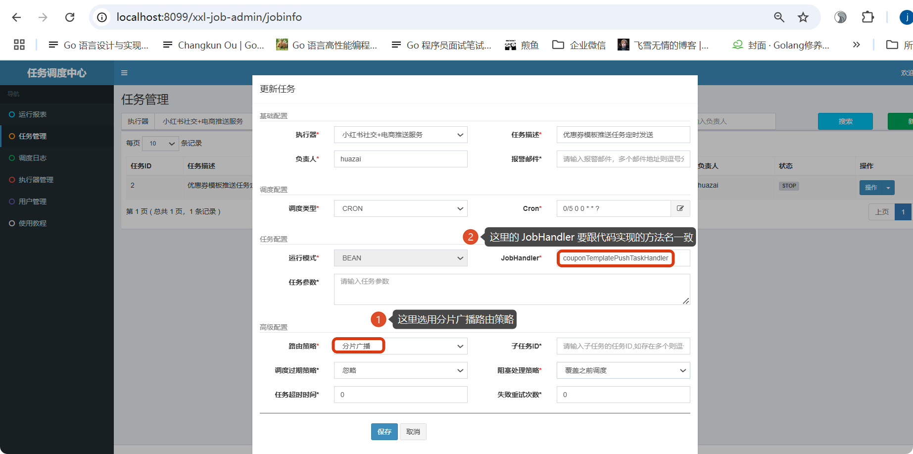

利用这一特性可以根据当前执行器的「**分片序号**」和 「**分片总数**」来获取对应的任务记录。

先来看看 Bean 模式下怎么获取分片序号和分片总数：

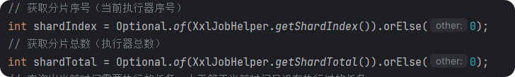

有了这两个属性，当执行器扫描数据库获取记录时，可以根据「**取模**」的方式获取属于当前执行器的任务，如下：

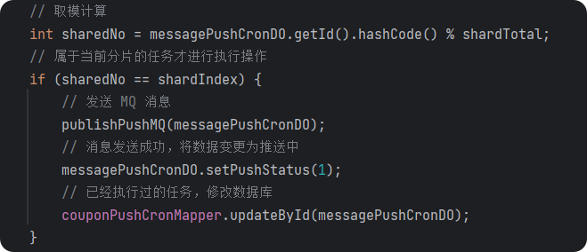

扫描任务表，根据任务 id 对分片总数「**取模**」来实现对所有分片的均分任务，通过判断是否是当前分片序号，如果是则执行相关任务操作，否则忽略。

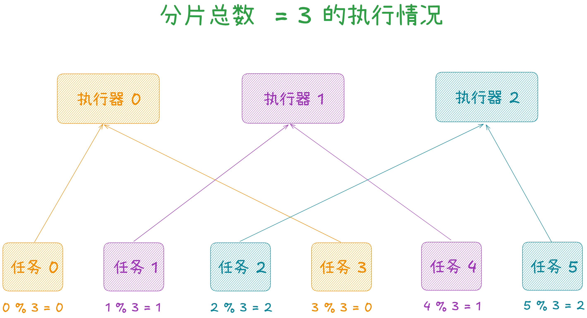

因此通过 XXL-Job 的「**分片广播**」＋「**取模**」的方式即可实现对集群服务均分任务的操作。

### **2.2.1.7 如何保证任务不会被重复消费**

由于推送任务本身处理时间就会比较长，所以更不允许服务重复执行，虽然上面通过「**分片广播**」＋「**取模**」的方式提高了任务不会被重复执行的机率，但是依旧存在如下情况：

如下图，有三台集群机器和六个任务，刚开始分配好了每台机器两个任务，「**执行器 0 正准备执行任务 3**」时，刚好「**执行器 2 宕机了**」，此时「**执行器 1**」刚好执行一次任务，因为分片总数减小，导致「**执行器 1 重新分片到需要执行的任务刚好也是任务 3**」，那么此时就会出现「**执行器 0 和 1 都在执行任务 3**」的情况。

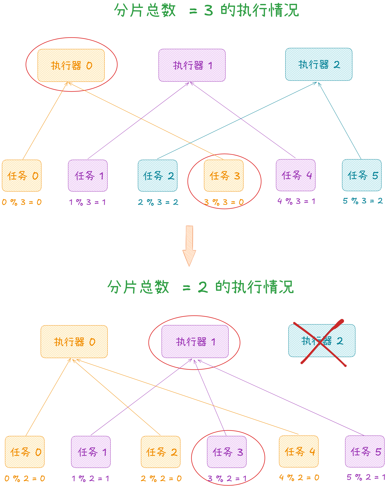

那么这种情况就需要实现幂等性了，幂等性有很多种实现方法，这里我们可以采用「**乐观锁**」的方式实现幂等性，具体 sql 如下：

update coupon\_push\_cron set push\_status \= 1

where (push\_status \= 0 or push\_status \= 2) and push\_fail\_num < 3 and id \= #{id}

这里只需要依靠任务的状态即可实现（待推送 0 ；推送中 1；推送失败 2；推送成功 3），可以看到这里类似于 CAS 的方式「**通过比较和设置的方式只有在状态为待推送或者推送失败时才能设置为处理中**」。这样在并发场景下，即使多个执行器同时处理该任务，也只有一个任务可以设置成功进入处理任务阶段。

为了真正达到幂等性，还需要设置一下 XXL-Job 的「**调度过期策略**」和「**阻塞处理策略**」来保证真正的幂等性。分别设置为「**忽略**」(调度过期后，忽略过期的任务，从当前时间开始重新计算下次触发时间） 和 「**丢弃后续调度**」（调度请求进入单机执行器后，发现执行器存在运行的调度任务，本次请求将会被丢弃并标记为失败）。

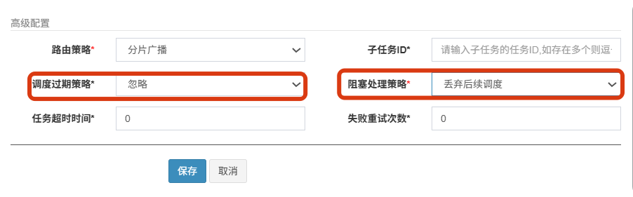

## **03 如何快速生成千万级用户**

我们在真正推送时需要用到，一共有四个值：

1.  app 推送：需要用户 ID。
2.  弹框推送：需要用户 ID。
3.  邮箱：需要用户邮箱。
4.  短信：需要用户手机号，有些公司考虑到用户隐私泄露问题，可能也是记录用户 ID，发送时查询用户接口获取。

接下来我们需要模拟生成千万级用户，来看下用户表都有哪些字段：

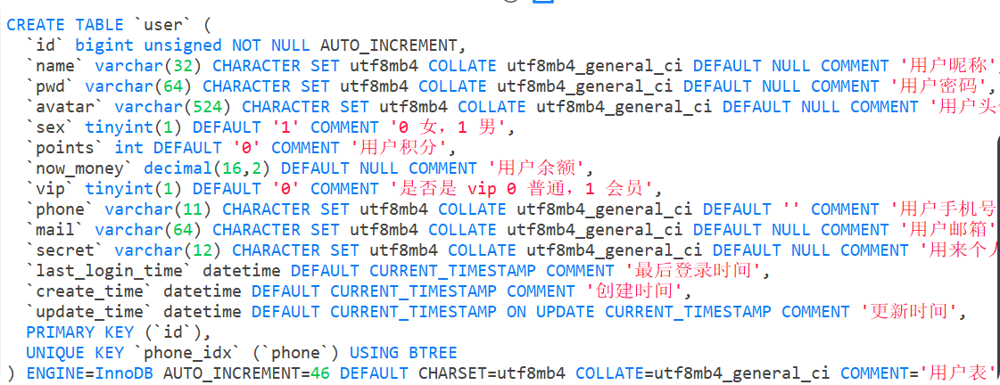

那基于上面的描述，我们需要搞三个字段，用户 ID、邮箱、手机号，其余的默认即可。

## **3.1 Faker 开源库**

那么什么是 Faker，Faker 是一个开源库，提供了生成伪随机数据的功能。该库可以用来生成各种各样的测试数据，例如姓名、地址、电话号码、电子邮件、公司名、日期等。那我们先引入，试试效果怎么样。

### **3.1.1 引入 Faker Maven 依赖**

<!-- Mock 数据相关依赖 -->

<dependency>

<groupId>com.github.javafaker</groupId>

<artifactId>javafaker</artifactId>

<scope>test</scope>

<version>1.0.2</version>

</dependency>

### **3.1.2 Faker 单元测试**

下面通过一个简单的单元测试让大家熟悉下 Faker 怎么使用。

public class Faker1000wTest {

@Test

public void testFaker() {

// 创建一个 Faker 实例

Faker faker \= new Faker(Locale.CHINA);

// 生成中文名

String chineseName \= faker.name().fullName();

System.out.println("中文名: " + chineseName);

// 生成手机号

PhoneNumber phoneNumber \= faker.phoneNumber();

String mobileNumber \= phoneNumber.cellPhone();

System.out.println("手机号: " + mobileNumber);

// 生成电子邮箱

String email \= faker.internet().emailAddress();

System.out.println("电子邮箱: " + email);

}

}

打印日志如下：

  
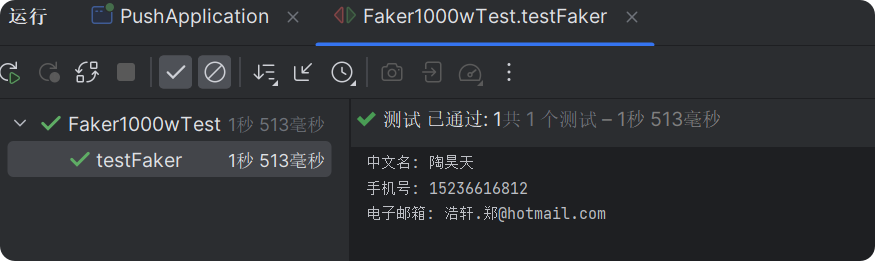

是不是还不错哦，那么接下来我们就用它来快速生成千万级用户数据到数据库中。

## **3.2 基于 Faker 快速生成千万级用户**

这里我们通过「**ThreadPoolExecutor 线程池**」+ 「**HikariCp 线程池**」+ 「**HashMap 缓冲池**」简单实现一个千万级用户生成的测试代码，如下：

public class Faker1000wTest {

private static final int TOTAL\_RECORDS \= 10\_000\_000; // 总记录数

private static final int BATCH\_SIZE \= 1000; // 每批插入的记录数

private static final int THREAD\_COUNT \= Runtime.getRuntime().availableProcessors(); // 线程数量

// 使用双重检测机制保证唯一性

private static final ConcurrentHashMap<String, Boolean> PHONE\_CACHE = new ConcurrentHashMap<>(10\_000\_000);

private static final Faker faker \= new Faker(Locale.CHINA);

// HikariCP 配置

private static HikariDataSource dataSource;

static {

HikariConfig config \= new HikariConfig();

config.setJdbcUrl("jdbc:mysql://127.0.0.1:3306/huazai\_user?useUnicode=true&characterEncoding=utf-8&useSSL=false&serverTimezone=Asia/Shanghai");

config.setUsername("root");

config.setPassword("123456");

config.setMaximumPoolSize(THREAD\_COUNT \* 2); // 根据需要调整

config.addDataSourceProperty("cachePrepStmts", "true");

config.addDataSourceProperty("prepStmtCacheSize", "250");

config.addDataSourceProperty("prepStmtCacheSqlLimit", "2048");

dataSource = new HikariDataSource(config);

}

public static void main(String\[\] args) throws InterruptedException, ExecutionException {

int totalBatches \= TOTAL\_RECORDS / BATCH\_SIZE;

// 创建线程池

ThreadPoolExecutor threadPoolExecutor \= new ThreadPoolExecutor(

THREAD\_COUNT \* 2,

THREAD\_COUNT \* 2,

60L,

TimeUnit.SECONDS,

new LinkedBlockingQueue<>(totalBatches), // 只需 10000 次

new ThreadPoolExecutor.CallerRunsPolicy()

);

// 使用 CountDownLatch 等待所有任务完成

CountDownLatch latch \= new CountDownLatch(totalBatches);

long startTime \= System.currentTimeMillis();

for (int i \= 0; i < totalBatches; i++) {

threadPoolExecutor.execute(() -> {

try {

generateAndInsertBatch();

} catch (SQLException e) {

e.printStackTrace();

} finally {

latch.countDown();

}

});

}

// 等待所有任务完成

latch.await();

threadPoolExecutor.shutdown();

// 关闭连接池

dataSource.close();

long endTime \= System.currentTimeMillis();

System.out.println("总共耗时: " + (endTime - startTime) / 1000 + " 秒");

}

/\*\*

\* 线程安全的手机号生成（双重检测锁优化）

\*/

public static String generateUniquePhone(Faker faker) {

while (true) {

// 生成候选号码

String phone \= faker.phoneNumber().cellPhone();

// 第一重检查（无锁快路径）

if (PHONE\_CACHE.containsKey(phone)) continue;

// 第二重检查（同步锁保护）

synchronized (PHONE\_CACHE) {

if (PHONE\_CACHE.containsKey(phone)) continue;

PHONE\_CACHE.put(phone, true);

return phone;

}

}

}

/\*\*

\* 通过 faker 批量生成用户数据

\* @throws SQLException

\*/

private static void generateAndInsertBatch() throws SQLException {

List<UserDO> batchUsers = new ArrayList<>(BATCH\_SIZE);

try (Connection conn \= dataSource.getConnection()) {

conn.setAutoCommit(false);

String sql \= "INSERT INTO user (name, pwd, avatar, sex, phone, mail, secret) VALUES (?, ?, ?, ?, ?, ?, ?)";

try (PreparedStatement pstmt \= conn.prepareStatement(sql)) {

for (int i \= 0; i < BATCH\_SIZE; i++) {

UserDO user \= new UserDO();

// 用户名

user.setName(faker.name().fullName());

user.setPwd("$1$WWkqM7NY$VeHgNqDRvwnwXb2Ct4/7/.");

user.setAvatar("https://sns-avatar-qc.xhscdn.com/avatar/1040g2jo312o35lk7io6g5n10nodhrb4q8s4pq7o?imageView2/2/w/540/format/webp|imageMogr2/strip2");

user.setSex(CommonUtil.genRandomInt(0, 1) != 0);

String phone \= generateUniquePhone(faker);

user.setPhone(phone);

user.setMail(faker.internet().emailAddress());

user.setSecret("$1$WWkqM7NY");

batchUsers.add(user);

pstmt.setString(1, user.getName());

pstmt.setString(2, user.getPwd());

pstmt.setString(3, user.getAvatar());

pstmt.setString(4, String.valueOf(CommonUtil.genRandomInt(0, 1)));

pstmt.setString(5, user.getPhone());

pstmt.setString(6, user.getMail());

pstmt.setString(7, user.getSecret());

// 添加批处理

pstmt.addBatch();

}

pstmt.executeBatch();

conn.commit();

} catch (SQLException e) {

conn.rollback();

throw e;

}

}

}

}

昨晚半夜跑的数据有点问题，会出现重复手机号报错问题，今天修复了下，测试效果：

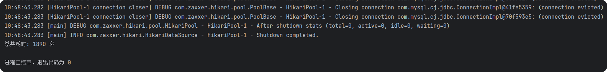

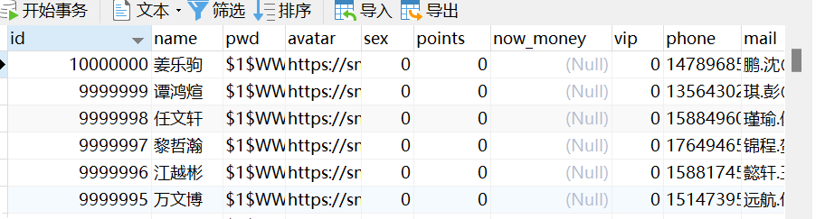

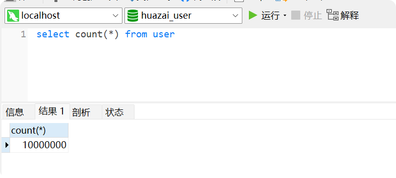

## **04 千万级用户量推送任务优化方案实现**

接下来，我们来实现下「**千万级用户量推送任务**」的优化方案，这里我们只实现最终的方案。

当创建完成「**优惠券推送任务**」后，不论「**定时推送**」还是「**立即推送**」最终都会发一条 RocketMQ 消息出来。接着我们需要消费这条任务，进行「**千万级用户量推送任务**」。

## **4.1 基于线程池+任务分片+分片消息合并优化消费**

在执行消息消费时，具体的推送逻辑如下：

1.  检查优惠券模板的状态是否正常；
2.  验证优惠券模板的库存余量是否充足；
3.  获取不同策略的用户群体信息；
4.  对这些用户群体进行分桶，每个桶 1000 个用户，将构造消息加入桶中；
5.  对桶进行消息分割，按 100 条一个 batch 进行多线程发送消息。

具体代码实现如下：

/\*\*

\* 千万级优惠券推送任务处理消费者

\* 1、消费满足条件的一个个推送任务 即 coupon\_push\_cron 表数据

\* 2、然后不同的策略获取不同的用户群体 目前分 5 种情况： '推送人群范围 0:全部用户 1:新用户(注册3月内)2:老用户(注册超过3个月)3:会员用户4:女性用户 5:男性用户

\* 3、然后对用户进行分桶处理，每个桶 1000 个用户，构造消息将其加入桶种

\* 4、对桶进行分割，按 100 条为一个 batch 进行多线程发送消息

\*/

@Slf4j

@Component

public class CouponPushUpdateListener implements MessageListenerConcurrently {

/\*\*

\* 注入幂等处理器

\*/

@Autowired

private CouponQueueIdempotentHandler couponQueueIdempotentHandler;

/\*\*

\* 注入 MQ 生产者

\*/

@Autowired

private DefaultProducer defaultProducer;

/\*\*

\* 注入 userFeign 远程服务

\*/

@Autowired

private UserFeignService userFeignService;

/\*\*

\* 注入 mapper

\*/

@Autowired

private CouponPushCronMapper couponPushCronMapper;

/\*\*

\* 注入 mapper

\*/

@Autowired

private CouponTemplateMapper couponTemplateMapper;

/\*\*

\* 注入线程池

\*/

@Autowired

@Qualifier("sharedPushMsgThreadPool")

private SharedThreadPool sharedPushMsgThreadPool;

/\*\*

\* 并发消费

\* @param msgList

\* @param context

\* @return

\*/

@Override

public ConsumeConcurrentlyStatus consumeMessage(List<MessageExt> msgList, ConsumeConcurrentlyContext context) {

for (MessageExt messageExt : msgList) {

String msgId \= messageExt.getMsgId();

try {

String msg \= new String(messageExt.getBody());

// 解析优惠券推送任务消息

CouponPushUpdateMQMessage message \= JsonUtil.json2Object(msg, CouponPushUpdateMQMessage.class);

if (message == null) {

log.warn("优惠券推送任务 MQ 全量/特定群体用户推送-消息为空结束，原始消息内容：{}", msg);

return ConsumeConcurrentlyStatus.RECONSUME\_LATER;

}

log.info("优惠券推送任务 MQ 全量/特定群体用户推送，消息内容：{}", message);

// 1、检查优惠券模板的状态是否正常

CouponTemplateDO couponTemplateDO \= couponTemplateMapper.selectById(message.getCouponTemplateId());

if (couponTemplateDO.getCouponStatus() && couponTemplateDO.getCouponAuditStatus() != 1) {

// 修改任务状态为已完成和完成时间

updateCouponPushCron(message.getId());

log.info("优惠券推送任务 MQ 全量/特定群体用户推送-模板已失效，消费成功, result: {}", ConsumeConcurrentlyStatus.CONSUME\_SUCCESS);

return ConsumeConcurrentlyStatus.CONSUME\_SUCCESS;

}

// 2、验证优惠券模板的库存余量是否充足

if (couponTemplateDO.getCouponReceivedCount() <= 0) {

// 修改任务状态为已完成和完成时间

updateCouponPushCron(message.getId());

log.info("优惠券推送任务 MQ 全量/特定群体用户推送-模板库存余量已不足，消费成功, result: {}", ConsumeConcurrentlyStatus.CONSUME\_SUCCESS);

return ConsumeConcurrentlyStatus.CONSUME\_SUCCESS;

}

// 3、验证领取的优惠券是否在活动有效时间

boolean isInTime \= DateUtil.isIn(new Date(), couponTemplateDO.getCouponStartTime(), couponTemplateDO.getCouponEndTime());

if (!isInTime) {

log.error("优惠券推送任务 MQ 全量/特定群体用户推送-优惠券不在活动有效时间内 isInTime:{}", isInTime);

return ConsumeConcurrentlyStatus.CONSUME\_SUCCESS;

}

// 4、幂等性校验

if (couponQueueIdempotentHandler.isMessageConsumed(RedisKeyConstant.COUPON\_PUSH\_TASK\_IDEMPOTENT\_PREFIX, msgId)) {

// 判断当前的这个消息流程是否执行完成

if (couponQueueIdempotentHandler.isAccomplish(RedisKeyConstant.COUPON\_PUSH\_TASK\_IDEMPOTENT\_PREFIX, msgId)) {

log.warn("优惠券推送任务 MQ 全量/特定群体用户推送-检测到重复消息，当前流程还未执行完，消息内容：{}", message);

return ConsumeConcurrentlyStatus.RECONSUME\_LATER;

}

log.error("优惠券推送任务 MQ 全量/特定群体用户推送 consume error, 消息未完成流程，需要消息队列重试");

return ConsumeConcurrentlyStatus.RECONSUME\_LATER;

}

// 5、拿到最大的用户 id

Long maxUserId \= queryUsersByPushRange(message.getPushRange());

// 6、根据算法，将千万级用户推送任务进行分片，比如一个推送任务包含 1000 个用户

Map<Long, Long> userBuckets = new LinkedHashMap<>();

AtomicBoolean flag \= new AtomicBoolean(true);

// 从 userId = 1 开始

long startUserId \= 1L;

while (flag.get()) {

if (startUserId > maxUserId) {

flag.compareAndSet(true, false);

}

userBuckets.put(startUserId, startUserId + BatchSizeConstant.USER\_BUCKET\_SIZE);

startUserId += BatchSizeConstant.USER\_BUCKET\_SIZE;

}

// 7、将可能成千上万的推送任务进行消息 batch 合并, 以 batch 模式发送任务到 mq 里去，减少网络通信的耗时

List<String> pushUserBucketTaskBatch = new ArrayList<>();

for (Map.Entry<Long, Long> userBucket : userBuckets.entrySet()) {

// 构建消息

CouponPushUserBucketMQMessage userBucketMQMessage \= CouponPushUserBucketMQMessage.builder()

.startUserId(userBucket.getKey())

.endUserId(userBucket.getValue())

.id(message.getId())

.couponTemplateId(message.getCouponTemplateId())

.notifyType(message.getNotifyType())

.build();

String pushUserBucketTaskJson \= JsonUtil.object2Json(userBucketMQMessage);

// 加入桶中

pushUserBucketTaskBatch.add(pushUserBucketTaskJson);

}

log.info("优惠券推送任务 MQ 全量/特定群体用户推送-本次推送消息用户桶总数量, {}", pushUserBucketTaskBatch.size());

// 8、把 message 进行分割并多线程推送

UserBucketSplitter userBucketSplitter \= new UserBucketSplitter(pushUserBucketTaskBatch, BatchSizeConstant.MESSAGE\_BATCH\_SIZE);

while(userBucketSplitter.hasNext()){

List<String> sendBatch = userBucketSplitter.next();

log.info("优惠券推送任务 MQ 全量/特定群体用户推送-本次批次消息数量,{}",sendBatch.size());

// 多线程推送

sharedPushMsgThreadPool.execute(() -> {

// 批量发送消息

defaultProducer.sendMessages(

RocketMQConstant.COUPON\_PUSH\_USER\_BUCKET\_MESSAGE\_TOPIC,

sendBatch,

"优惠券推送任务 MQ 全量/特定群体用户推送 用户分桶 RocketMQ 消息");

});

}

// 9、修改任务状态为已完成和完成时间

updateCouponPushCron(message.getId());

// 设置消费完成表示

couponQueueIdempotentHandler.setAccomplish(RedisKeyConstant.COUPON\_PUSH\_TASK\_IDEMPOTENT\_PREFIX, msgId);

} catch (Exception e) {

// 本次消费失败，下次重新消费

couponQueueIdempotentHandler.delMessageProcessed(RedisKeyConstant.COUPON\_PUSH\_TASK\_IDEMPOTENT\_PREFIX, msgId);

log.error("优惠券推送任务 MQ 全量/特定群体用户推送 consume error, 更新博主美食缓存数据消费失败", e);

return ConsumeConcurrentlyStatus.RECONSUME\_LATER;

}

}

log.info("优惠券推送任务 MQ 全量/特定群体用户推送-消费成功, result: {}", ConsumeConcurrentlyStatus.CONSUME\_SUCCESS);

return ConsumeConcurrentlyStatus.CONSUME\_SUCCESS;

}

/\*\*

\* 获取对应的最大用户id

\* @param pushRange

\* @return

\*/

private Long queryUsersByPushRange(int pushRange)

{

/\*\*

\* 先获取全量/特定群体用户数，有两种方式：

\* 1、调用用户服务接口拿到总数 count

\* 2、调用用户服务接口拿到用户的最大 userid（自增）

\* 这里我们采用第二种

\*/

ApiResult userInfo \= null;

if (pushRange == 0) { // 全部用户

userInfo = userFeignService.queryMaxUserId();

} else if (pushRange == 1) { // 新用户(注册3月内)

userInfo = userFeignService.queryMaxNewUserId();

} else if (pushRange == 2) { // 老用户(注册超过3月)

userInfo = userFeignService.queryMaxOldUserId();

} else if (pushRange == 3) { // 会员用户

userInfo = userFeignService.queryMaxVipUserId();

} else if (pushRange == 4) { // 女性用户

userInfo = userFeignService.queryMaxFemaleUserId();

} else if (pushRange == 5) { // 男性用户

userInfo = userFeignService.queryMaxMaleUserId();

}

log.info("优惠券推送任务 MQ 全量/特定群体用户推送-调用用户接口获取最大的用户id信息, userInfo: {}", userInfo);

if (userInfo.getCode() != 0) {

// 异常

log.error("优惠券推送任务 MQ 全量/特定群体用户推送-基础信息失败：{}", userInfo);

throw new BizException(BizCodes.USER\_ACCOUNT\_NOT\_EXIST);

}

// 拿到最大的用户 id

Long maxUserId \= userInfo.getData(new TypeReference<>(){});

return maxUserId;

}

/\*\*

\* 修改任务状态和完成时间

\* @param id

\*/

private void updateCouponPushCron(Long id) {

// 修改任务状态为已完成和完成时间

CouponPushCronDO couponPushCronDO \= new CouponPushCronDO();

couponPushCronDO.setPushStatus(3);

couponPushCronDO.setPushCompletionTime(new Date());

couponPushCronDO.setId(id);

couponPushCronMapper.updateById(couponPushCronDO);

}

}

当消费者因「**网络故障/延迟**」、「**客户端奔溃**」、「**消费处理失败**」都会进行重试，如下：

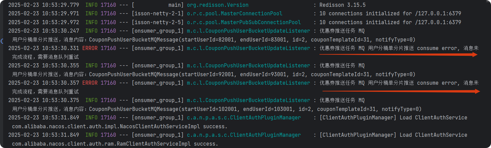

这里面处理逻辑比较多，我们来拆解下重要设计。

### **4.1.1 线程池设计**

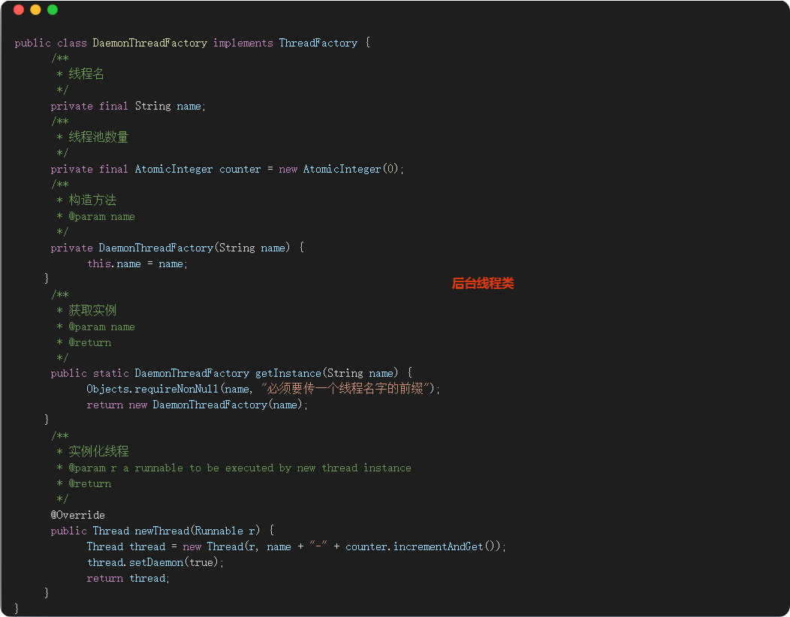

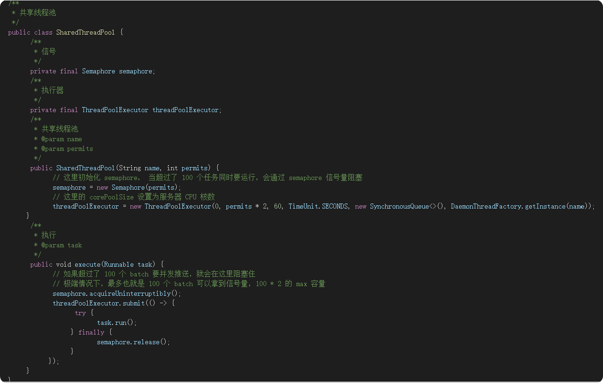

线程池处理逻辑如下：

  
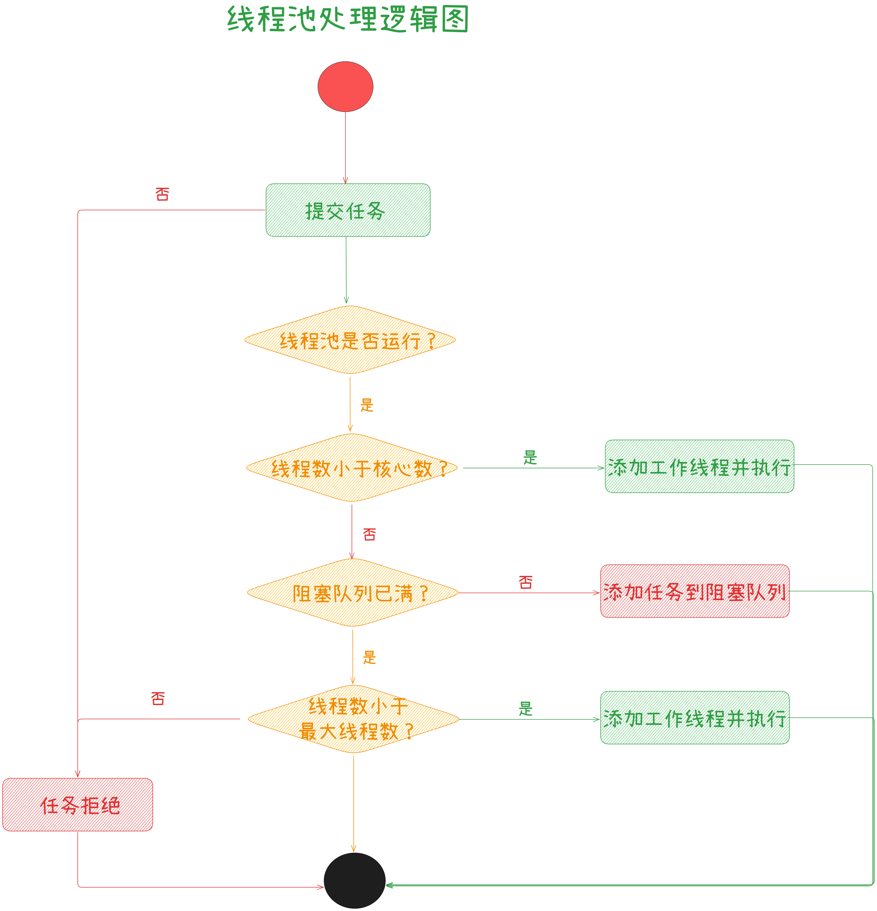

解析下我们线程池中的参数为什么这么设置：

1.  [corePoolSize](http://corepoolsize/)：这里设置为 0，是因为消息推送并不是一直要推送的，发优惠券正常情况下是不会推送，发送消息的线程池，corePoolSize 是 0，空闲把线程都回收掉就可以了。
2.  [maximumPoolSize](http://maximumpoolsize/)：运行任务属于 I/O 密集型，最大线程数设置为我们设定线程数的 2 倍即 60。
3.  [workQueue](http://workqueue/)：理论上说我们不会有阻塞的情况，因为设置的线程数不少，所以如果使用不存储任务的同步队列。
4.  [ThreadFactory](http://threadfactory/)：这里我们自定义了一个后台线程类。
5.  [handler](http://handler/)：这里直接默认。

### **4.1.2 任务分片**

这里将千万级用户推送任务进行「**分片**」，比如一个推送任务包含 1000 个用户，关键设计如下：

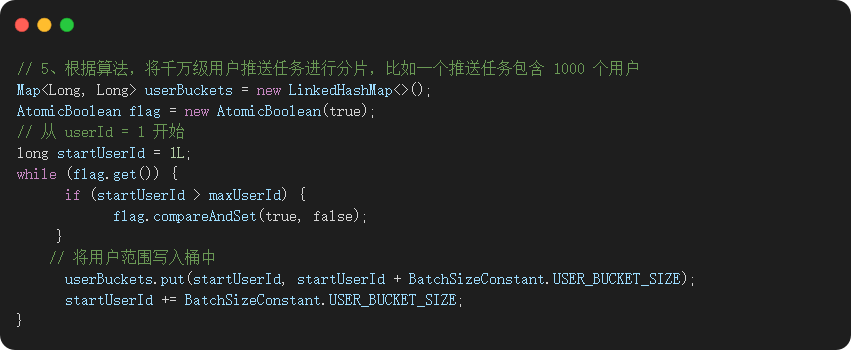

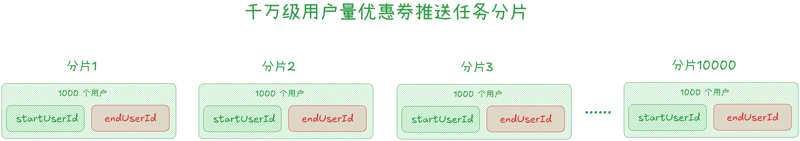

### **4.1.3 分片消息合并**

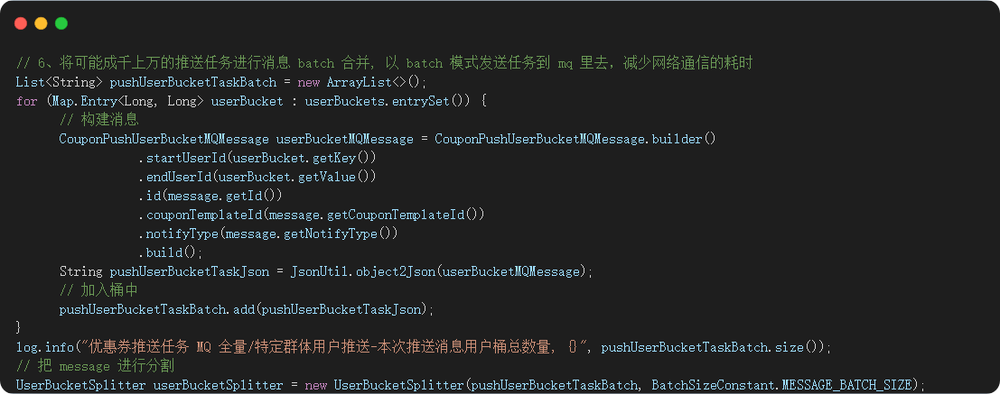

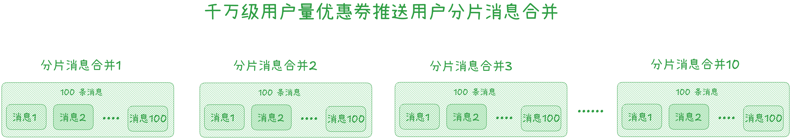

### **3.1.4 多线程推送**

最后将合并后分片消息进行「**多线程推送**」，如下：

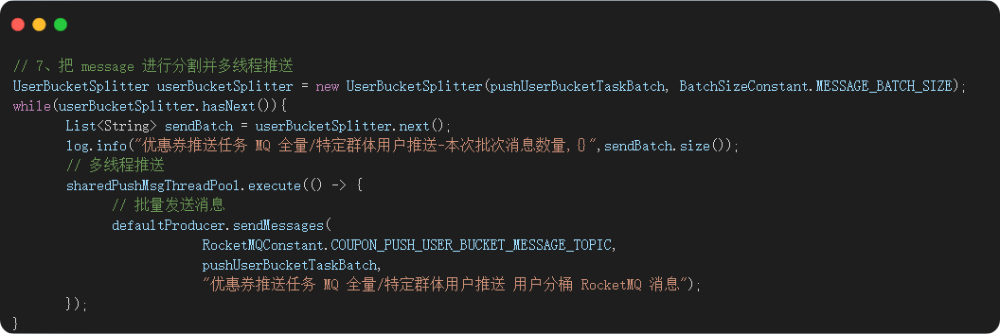

### **4.2 对用户分桶消息进行优惠券推送**

/\*\*

\* 千万级优惠券推送任务用户分桶信息处理消费者

\* 1、这里消费拿到的是一个 batch 分片消息

\* 2、然后根据分片消息中的 startUserId、endUserId 从用户中心获取对应分片的用户信息 list

\* 3、然后基于每个用户进行优惠券推送

\*/

@Slf4j

@Component

public class CouponPushUserBucketUpdateListener implements MessageListenerConcurrently {

/\*\*

\* 注入幂等处理器

\*/

@Autowired

private CouponQueueIdempotentHandler couponQueueIdempotentHandler;

/\*\*

\* 消息推送工厂提供者

\*/

@Autowired

private FactoryProvider factoryProvider;

/\*\*

\* 注入 userFeign 远程服务

\*/

@Autowired

private UserFeignService userFeignService;

/\*\*

\* 注入 mapper

\*/

@Autowired

private CouponTemplateMapper couponTemplateMapper;

/\*\*

\* 注入 mapper

\*/

@Autowired

private CouponPushCronMapper couponPushCronMapper;

/\*\*

\* 并发消费

\* @param msgList

\* @param context

\* @return

\*/

@Override

public ConsumeConcurrentlyStatus consumeMessage(List<MessageExt> msgList, ConsumeConcurrentlyContext context) {

for (MessageExt messageExt : msgList) {

String msgId \= messageExt.getMsgId();

try {

// 1、获取到一个推送任务分片 这里包含 100 个用户

String msg \= new String(messageExt.getBody());

// 解析优惠券推送任务消息

CouponPushUserBucketMQMessage message \= JsonUtil.json2Object(msg, CouponPushUserBucketMQMessage.class);

if (message == null) {

log.warn("优惠券推送任务 MQ 用户分桶单分片推送-消息为空结束，原始消息内容：{}", msg);

return ConsumeConcurrentlyStatus.RECONSUME\_LATER;

}

log.info("优惠券推送任务 MQ 用户分桶单分片推送，消息内容：{}", message);

// 幂等性校验，防止重复消费

if (couponQueueIdempotentHandler.isMessageConsumed(RedisKeyConstant.COUPON\_PUSH\_TASK\_USER\_BUCKET\_IDEMPOTENT\_PREFIX, msgId)) {

// 判断当前的这个消息流程是否执行完成

if (couponQueueIdempotentHandler.isAccomplish(RedisKeyConstant.COUPON\_PUSH\_TASK\_USER\_BUCKET\_IDEMPOTENT\_PREFIX, msgId)) {

log.warn("优惠券推送任务 MQ 用户分桶单分片推送-检测到重复消息，当前流程还未执行完，消息内容：{}", message);

return ConsumeConcurrentlyStatus.RECONSUME\_LATER;

}

log.error("优惠券推送任务 MQ 用户分桶单分片推送 consume error, 消息未完成流程，需要消息队列重试");

return ConsumeConcurrentlyStatus.RECONSUME\_LATER;

}

// 2、查询本次推送任务分片对应的用户群体

Long startUserId \= message.getStartUserId();

Long endUserId \= message.getEndUserId();

ApiResult queryResult \= userFeignService.queryAccountByIdRange(startUserId, endUserId);

log.info("优惠券推送任务 MQ 用户分桶单分片推送-调用用户接口获取用户推送范围信息, queryResult: {}", queryResult);

if (queryResult.getCode() != 0) {

// 异常

log.error("优惠券推送任务 MQ 用户分桶单分片推送-基础信息失败：{}", queryResult);

throw new BizException(BizCodes.USER\_ACCOUNT\_NOT\_EXIST);

}

// 拿到用户推送范围信息

List<UserVO> userList = queryResult.getData(new TypeReference<>(){});

if (CollectionUtils.isEmpty(userList)) {

log.info("优惠券推送任务 MQ 用户分桶单分片推送-根据用户桶内的id范围没有查询到用户, startUserId={}, endUserId{}", startUserId, endUserId);

continue;

}

// 3、获取优惠券模板数据, 这里直接从消息中获取即可

// 验证用户是否符合优惠券领取条件

JSONObject receiveRule \= JSON.parseObject(message.getCouponReceiveRule());

String perUserLimit \= receiveRule.getString("perUserLimit");

// lua 脚本优惠券模板 id 缓存 key

String couponTemplateCacheKey \= String.format(RedisKeyConstant.COUPON\_TEMPLATE\_PREFIX, message.getCouponTemplateId());

log.info("优惠券推送任务 MQ 用户分桶单分片推送-执行 Lua 脚本 couponTemplateCacheKey:{}, perUserLimit:{}", couponTemplateCacheKey, perUserLimit);

// 用户领券记录表

List<UserCouponDO> userCouponS = new ArrayList<>();

// 推送任务失败记录表

CouponPushCronFailDO cronFail \= new CouponPushCronFailDO();

cronFail.setCouponPushCronId(message.getId());

List<FailRecordEntity> failRecords = new ArrayList<>();

// 4、遍历用户列表进行优惠券推送

for (UserVO user : userList) {

// 过滤非当前渠道用户 TODO 这里实现不太优雅 后续有时间再进行优化

if (message.getPushRange() == 1) { // 新用户(注册3月内)

LocalDateTime threeMonthsAgo \= LocalDateTime.now().minusMonths(3);

Date threeMonthsAgoTime \= Date.from(threeMonthsAgo.atZone(ZoneId.systemDefault()).toInstant());

if (user.getCreateTime().getTime() <= threeMonthsAgoTime.getTime()) {

// 不是新用户

log.info("优惠券推送任务 MQ 用户分桶单分片推送-过滤非当前渠道新用户 userId:{}", user.getId());

continue;

}

} else if (message.getPushRange() == 2) { // 老用户(注册超过3月)

LocalDateTime threeMonthsAgo \= LocalDateTime.now().minusMonths(3);

Date threeMonthsAgoTime \= Date.from(threeMonthsAgo.atZone(ZoneId.systemDefault()).toInstant());

if (user.getCreateTime().getTime() > threeMonthsAgoTime.getTime()) {

// 不是老用户

log.info("优惠券推送任务 MQ 用户分桶单分片推送-过滤非当前渠道老用户 userId:{}", user.getId());

continue;

}

} else if (message.getPushRange() == 3) { // 会员用户

if (!user.getVip()) {

// 不是vip用户

log.info("优惠券推送任务 MQ 用户分桶单分片推送-过滤非当前渠道 VIP 用户 userId:{}", user.getId());

continue;

}

} else if (message.getPushRange() == 4) { // 女性用户

if (user.getSex()) {

// 不是女性用户

log.info("优惠券推送任务 MQ 用户分桶单分片推送-过滤非当前渠道女性用户 userId:{}", user.getId());

continue;

}

} else if (message.getPushRange() == 5) { // 男性用户

if (!user.getSex()) {

// 不是男性用户

log.info("优惠券推送任务 MQ 用户分桶单分片推送-过滤非当前渠道男性用户 userId:{}", user.getId());

continue;

}

}

// 6、真正用户推送

pushSend(message, user);

}

// 设置消费完成标识

couponQueueIdempotentHandler.setAccomplish(RedisKeyConstant.COUPON\_PUSH\_TASK\_USER\_BUCKET\_IDEMPOTENT\_PREFIX, msgId);

} catch (Exception e) {

// 本次消费失败，下次重新消费

couponQueueIdempotentHandler.delMessageProcessed(RedisKeyConstant.COUPON\_PUSH\_TASK\_USER\_BUCKET\_IDEMPOTENT\_PREFIX, msgId);

log.error("优惠券推送任务 MQ 用户分桶单分片推送 consume error", e);

return ConsumeConcurrentlyStatus.RECONSUME\_LATER;

}

}

log.info("优惠券推送任务 MQ 用户分桶单分片推送-消费成功, result: {}", ConsumeConcurrentlyStatus.CONSUME\_SUCCESS);

return ConsumeConcurrentlyStatus.CONSUME\_SUCCESS;

}

/\*\*

\* 正式进行用户渠道推送

\* @param message

\* @param user

\*/

private void pushSend(CouponPushUserBucketMQMessage message, UserVO user) {

// 获取消息服务工厂

PushSendServiceFactory pushSendServiceFactory \= factoryProvider

.getPushSendServiceFactory(message.getNotifyType());

// 消息发送服务组件

PushSendService pushSendService \= pushSendServiceFactory.createPushSendService();

// 构造消息

CouponPushUserMessage couponPushUserMessage \= CouponPushUserMessage.builder()

.notifyType(message.getNotifyType())

// TODO 消息后续可以抽离出来 根据优惠对象和领取方式来展示不同的消息 这里就不做了

.message("恭喜获得新客礼，请注意查收哦，全平台可用")

.userId(user.getId())

.phone(user.getPhone())

.mail(user.getMail())

.couponTemplateId(message.getCouponTemplateId())

.build();

PushSendEntity pushSend \= pushSendServiceFactory.createPushSendEntity(couponPushUserMessage);

// 6、进行推送

pushSendService.send(pushSend);

}

}

这部分相对就比较简单一些了，根据上一个消费者推送过来的「**分片 batch 消息**」，这里会从「**用户服务**」中获取范围内的用户信息，然后挨个根据「**工厂策略模式**」进行推送。

具体代码请下载后自行查看，这里就不展开了，比较简单。

  
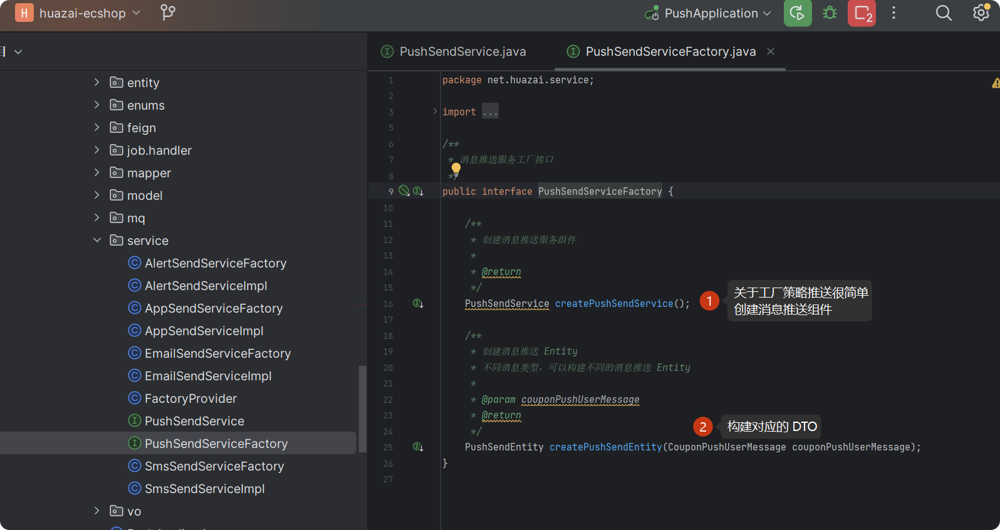

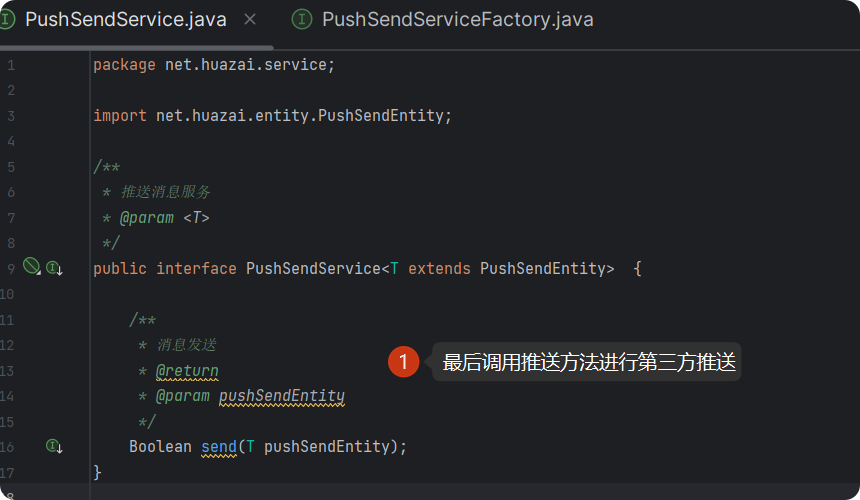