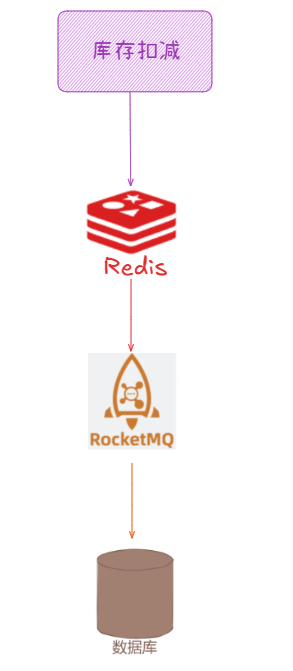
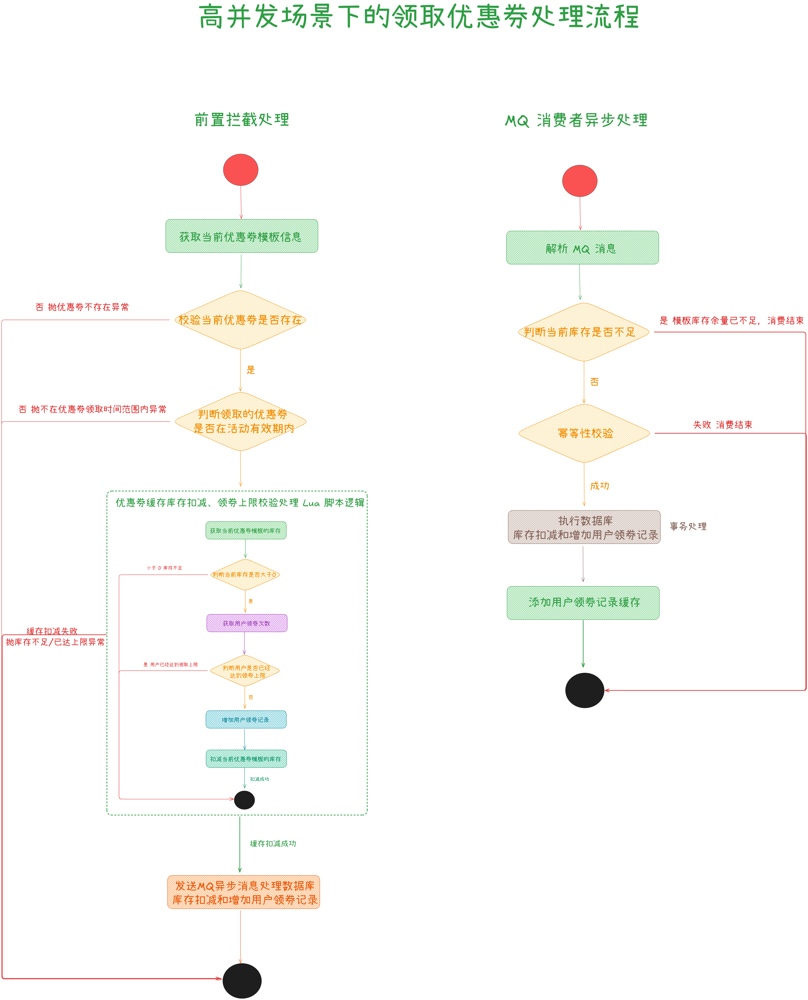
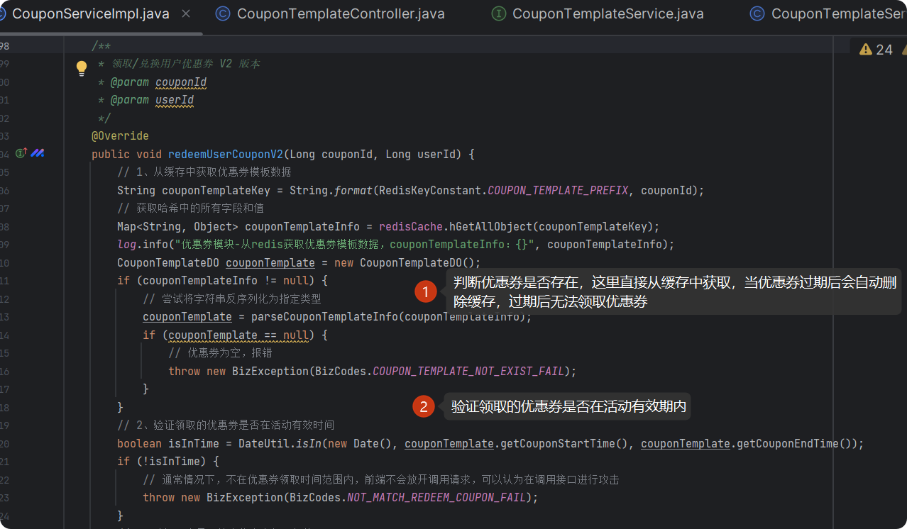
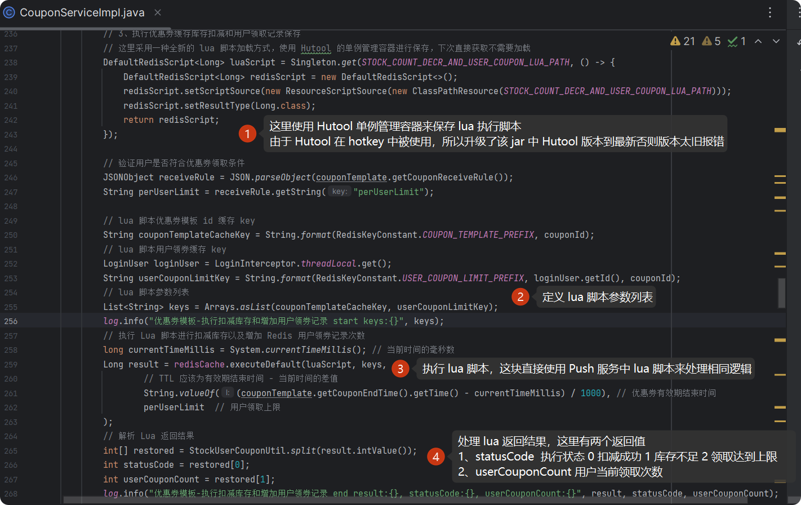
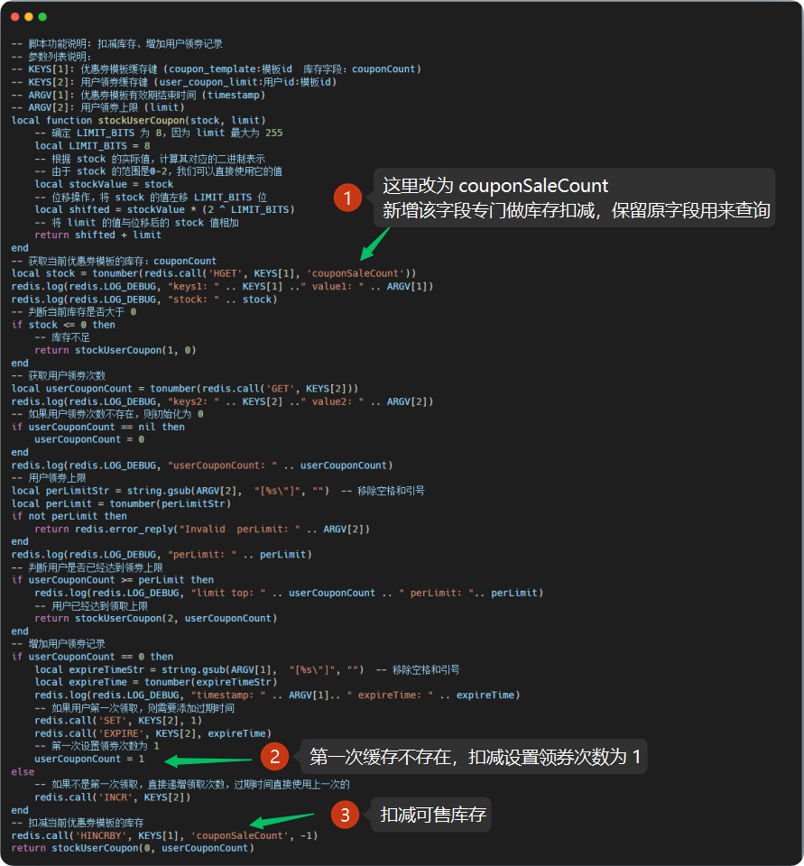
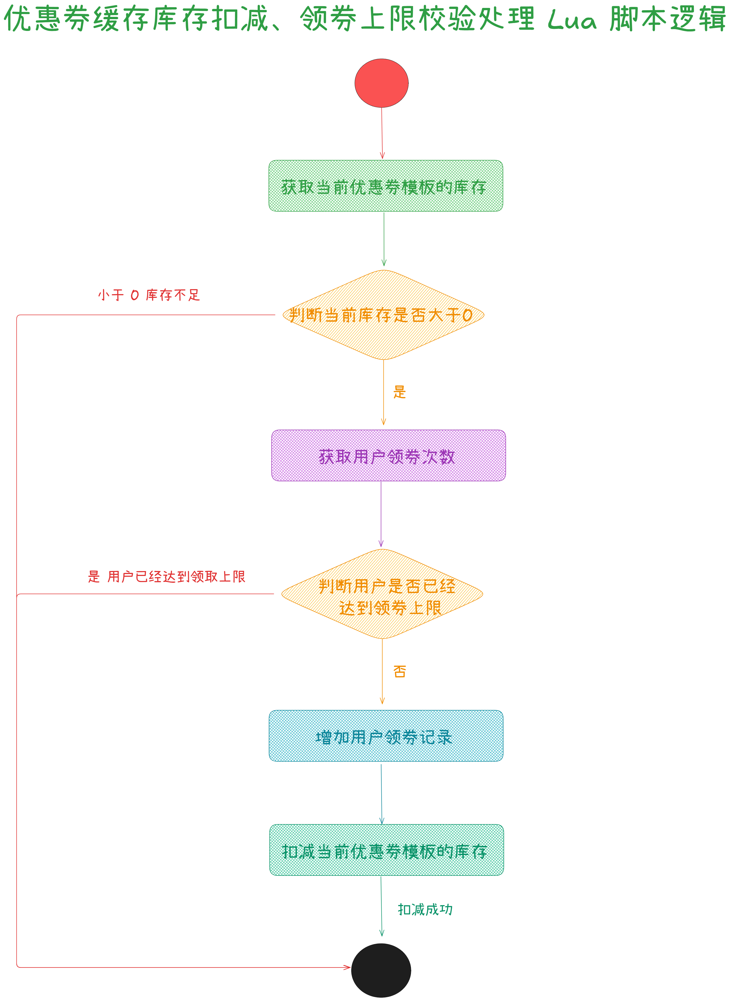
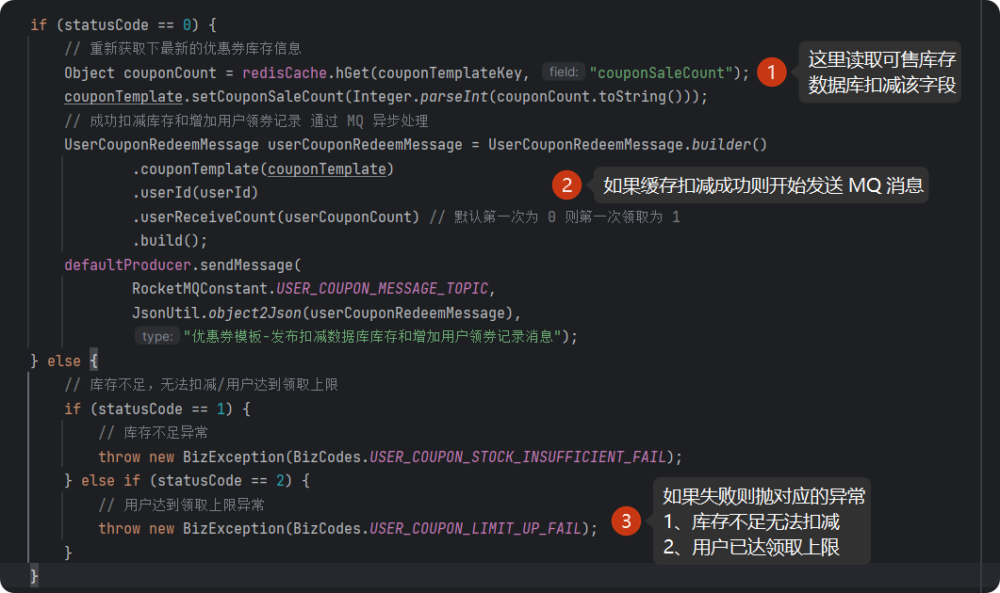
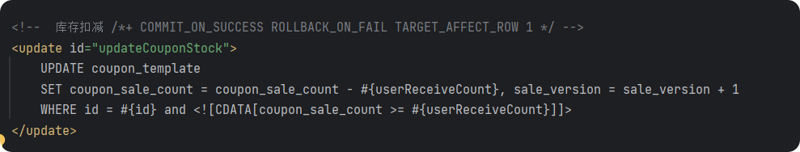
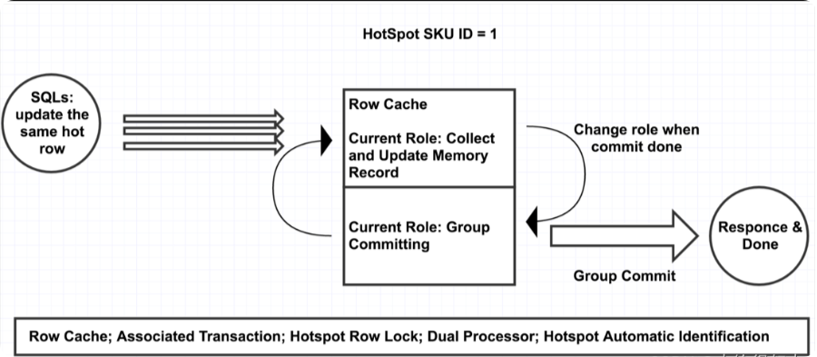
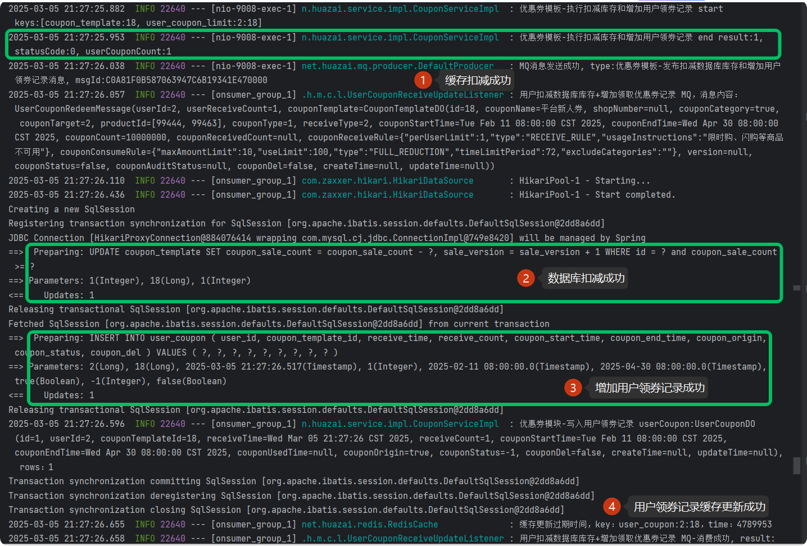

从今天之后的一段时间内，华仔会带着大家一起从零开始搭建并研发一套高并发的电商实战项目，这里会涉及到很多互联网大厂开发过程中所使用的核心技术和架构设计模式，希望大家学完之后可以用到自己的简历中。

接下来我们会重点架构设计和开发一下我们高并发电商实战前端 Web 项目的相关功能 。

这是第六十八篇，本篇我们继续进行电商实战项目设计与开发，本篇我们实战下「**高并发场景下领取优惠券之缓存+ MQ 异步架构设计与功能实现**」。

文章汇总位置：[https://wx.zsxq.com/dweb2/index/columns/51122554151214](https://wx.zsxq.com/dweb2/index/columns/51122554151214)

源码授权与获取地址：[https://articles.zsxq.com/id\_1s85grnaae4p.html](https://articles.zsxq.com/id_1s85grnaae4p.html)

本章源码地址：[https://gitcode.net/u011359591/huazai-ecshop/-/tree/ecshop-chapter-68](https://gitcode.net/u011359591/huazai-ecshop/-/tree/ecshop-chapter-68)

## **01 前言**

在上篇 [【电商实战项目第六十七篇】华仔电商实战商品、购物车、卡券相关服务正式接入前端 Web 项目](https://articles.zsxq.com/id_92ams2taclq9.html) 中，我们已经将前台「**优惠券服务**」相关的业务铺垫的差不多了，但是上篇的功能实现只适合「**普通场景下领取优惠券**」，今天我们来重点实现下「**高并发场景下领取优惠券**」的功能实现。

## **02 高并发场景下的领取优惠券**

## **2.1 业务背景说明**

对于常规的「**优惠券**」来说并没有什么吸引力，但是对于那种「**大额的优惠券**」时候就不太一样了，此时会面临「**海量用户来抢购只有少量库存的优惠券**」，是不是很类似我们常说的「**秒杀场景**」呢。

这里我们将采用「**缓存来扛并发**」、跟「**推送服务**」中「**扣减库存**」一样先进行「**缓存扣减库存**」，只有成功的请求才进行「**数据库扣减库存**」，并将「**优惠券**」添加到用户的领券记录表中。

此场景下我们会遇到以下三大问题：

1.  超高流量问题：对于秒杀场景来说，在秒杀那一刻会瞬间吸引海量用户，导致流量陡增，如果直接访问数据库的话可能导致数据库直接宕机。
2.  优惠券库存超卖问题：高并发场景下多个用户同时抢购同一个库存优惠券可能会导致系统超卖。
3.  用户超领优惠券问题：后台创建优惠券模板时会有每个用户限流几张的限制，该如何避免用户超过这个领取限制呢。

是不是这种场景很像「**秒杀场景**」，在秒杀系统的架构设计中，Redis 与 MQ 的组合堪称一对「**黄金搭档**」。Redis 凭借其卓越的「**高性能读写特性及原子操作能力**」可以直面秒杀活动带来的汹涌并发流量，筑起「**防止超卖**」的坚固防线。而 MQ 通过「**黄金搭档流量削峰**」流量削峰策略，将瞬间爆发的海量数据请求进行缓冲与分流，有效减缓后端数据存储环节的压力，确保整个系统节奏平稳。

当然，采用 Redis + MQ 这套方案并非一劳永逸，其中「**数据一致性**」问题犹如潜藏暗处的礁石，不容小觑。不过别担心，接下来我们就将针对该方案进行重点逐一拆解并给出解决方案，这里会先给整体的处理流程图：

## **2.2 高并发场景下的领取优惠券前置拦截**

### **2.2.1 验证优惠券是否存在和有效**

我们需要对前端传来的数据进行校验：

1.  验证优惠券是否存在。
2.  验证优惠券是否在有效活动期间。

  

### **2.2.2 优惠券缓存库存扣减、领券上限校验处理**

如果第一步验证优惠券模板没有问题的话，接下来开始进行「**扣减库存**」和「**验证用户是否超限领取**」。

之前在「**推送服务**」部分 [【电商实战项目第六十六篇】华仔电商实战千万级用户量优惠券推送任务之库存扣减/用户领券/推送任务失败记录后续功能完善](https://articles.zsxq.com/id_ukhxikrv59xf.html) 已经使用过了，这里我们再来简单说明下:

1.  首先采用全新的方式来保存 lua 脚本，即 「**Hutool 单例管理器**」进行保存，下次直接获取不用重新加载。在咱们项目中，由于 HotKey 使用了 Hutool 直接在项目中引用 Hutool 是无法升级的，所以这里升级了 HotKey 中的 Hutool 版本来解决[Singleton.get](http://singleton.get/) 报错问题。
2.  定义 lua 脚本的参数列表：
3.  优惠券模板缓存 key：coupon\_template:%s，其中 %s 表示优惠券模板 id。
4.  用户领券缓存 key：user\_coupon\_limit:%s:%s，其中第一个 %s 表示用户id，第二个 %s 表示优惠券模板 id。
5.  执行 lua 脚本。
6.  处理 lua 返回结果，这里有两个返回值
7.  statusCode：0、扣减成功 1、库存不足 2、用户领取上限。
8.  userCouponCount：用户当前领取次数。

  

  
为了避免访问「**库存扣减**」和「**验证用户是否领券超限**」多次 Redis 请求，所以这里还是采用 Redis Lua 脚本执行，由于 Lua 脚本是原子操作，所以「**库存扣减**」和「**验证用户是否领券超限**」是不会出现并发问题的。

Lua 脚本如下所示：

这里需要增加数据库字段：

\-- 增加可售库存和乐观锁版本号字段

ALTER TABLE \`huazai\_coupon\`.\`coupon\_template\`

MODIFY COLUMN \`coupon\_count\` int(0) NOT NULL DEFAULT 0 COMMENT '优惠券发行数量（原库存）' AFTER \`coupon\_end\_time\`,

ADD COLUMN \`coupon\_sale\_count\` int(0) NOT NULL COMMENT '优惠券可售库存数量' AFTER \`coupon\_count\`,

MODIFY COLUMN \`coupon\_received\_count\` int(0) NOT NULL DEFAULT 0 COMMENT '优惠券已经领取的库存数量' AFTER \`coupon\_count\`,

ADD COLUMN \`sale\_version\` int(0) NOT NULL COMMENT '可售库存版本号（乐观锁控制）' AFTER \`coupon\_consume\_rule\`;

下面我们来看下 Lua 脚本的执行流程：

  
可以看到这里将返回的两个参数包装为一个 long 类型的数据，并进行拆分。

这两个参数分别如下：

1.  是否成功：有 3 个参数，0 表示成功，1 表示优惠券已被领取完了，2 表示用户已经达到领取上限。
2.  用户领取次数：初始化为 0，每次领取成功后自增加 1。

如果返回 0,x 表示请求成功，这里的 x 就是目前用户已领取优惠券的次数，会把这个 x 保存到数据库表 [user\_coupon](http://user_coupon%20/) 表的领取次数 [receive\_count](http://receive_count/) 字段中。

### **2.2.3 基于 MQ 异步处理优惠券数据库库存扣减、领券记录处理**

至此，我们搞完了「**库存扣减**」和「**验证用户是否领券超限**」的缓存处理，接下来我们来处理「**数据库的库存扣减**」和「**用户领券数据记录**」。

大家都知道，合理的业务场景使用合适的架构往往能发挥最大的效果，对于「**用户领券场景**」来说偶尔多发一张优惠券问题也不大，所以没必要「**将压力给到数据库**」。通过「**MQ 异步削峰解耦**」，不仅可以减少数据库的压力，还能提高系统的吞吐量和性能。

因此，这里我们采用 「**RocketMQ 消息队列**」来重构「**高并发场景下领券**」处理逻辑。

###   
**2.2.3.1 生产者消息发送**

### **2.2.3.1 消费者处理扣减库存和增加用户领券记录**

/\*\*

\* 用户扣减库存及增加领券记录处理消费者

\*/

@Slf4j

@Component

public class UserCouponReceiveUpdateListener implements MessageListenerConcurrently {

/\*\*

\* 注入幂等处理器

\*/

@Autowired

private UserCouponQueueIdempotentHandler couponQueueIdempotentHandler;

/\*\*

\* 注入 service

\*/

@Autowired

private CouponService couponService;

/\*\*

\* 并发消费

\* @param msgList

\* @param context

\* @return

\*/

@Override

public ConsumeConcurrentlyStatus consumeMessage(List<MessageExt> msgList, ConsumeConcurrentlyContext context) {

for (MessageExt messageExt : msgList) {

String msgId \= messageExt.getMsgId();

try {

String msg \= new String(messageExt.getBody());

// 解析优惠券推送任务消息

UserCouponRedeemMessage message \= JsonUtil.json2Object(msg, UserCouponRedeemMessage.class);

if (message == null) {

log.warn("用户扣减数据库库存+增加领取优惠券记录 MQ-消息为空结束，原始消息内容：{}", msg);

return ConsumeConcurrentlyStatus.RECONSUME\_LATER;

}

log.info("用户扣减数据库库存+增加领取优惠券记录 MQ，消息内容：{}", message);

// 1、再次验证优惠券模板的库存余量是否充足 极端情况会出现

if (message.getCouponTemplate().getCouponSaleCount() <= 0) {

log.info("用户扣减数据库库存+增加领取优惠券记录 MQ-模板库存余量已不足，消费成功, result: {}", ConsumeConcurrentlyStatus.CONSUME\_SUCCESS);

return ConsumeConcurrentlyStatus.CONSUME\_SUCCESS;

}

// 2、幂等性校验

if (couponQueueIdempotentHandler.isMessageConsumed(RedisKeyConstant.USER\_COUPON\_LIMIT\_IDEMPOTENT\_PREFIX, msgId)) {

// 判断当前的这个消息流程是否执行完成

if (couponQueueIdempotentHandler.isAccomplish(RedisKeyConstant.USER\_COUPON\_LIMIT\_IDEMPOTENT\_PREFIX, msgId)) {

log.warn("用户扣减数据库库存+增加领取优惠券记录 MQ-检测到重复消息，当前流程还未执行完，消息内容：{}", message);

return ConsumeConcurrentlyStatus.RECONSUME\_LATER;

}

log.error("用户扣减数据库库存+增加领取优惠券记录 MQ consume error, 消息未完成流程，需要消息队列重试");

return ConsumeConcurrentlyStatus.RECONSUME\_LATER;

}

// 3、扣减数据库库存

Boolean result \= couponService.updateCouponStockAndUserReceiveRecord(message);

if (result) {

// 4、添加用户领券缓存

couponService.addUserCoupinCache(message);

} else {

log.error("用户扣减数据库库存+增加领取优惠券记录 MQ 扣减数据库库存和增加用户领券记录失败, result: {}", result);

return ConsumeConcurrentlyStatus.RECONSUME\_LATER;

}

// 设置消费完成标识

couponQueueIdempotentHandler.setAccomplish(RedisKeyConstant.USER\_COUPON\_LIMIT\_IDEMPOTENT\_PREFIX, msgId);

} catch (Exception e) {

// 本次消费失败，下次重新消费

couponQueueIdempotentHandler.delMessageProcessed(RedisKeyConstant.USER\_COUPON\_LIMIT\_IDEMPOTENT\_PREFIX, msgId);

log.error("用户扣减数据库库存+增加领取优惠券记录 MQ consume error", e);

return ConsumeConcurrentlyStatus.RECONSUME\_LATER;

}

}

log.info("用户扣减数据库库存+增加领取优惠券记录 MQ-消费成功, result: {}", ConsumeConcurrentlyStatus.CONSUME\_SUCCESS);

return ConsumeConcurrentlyStatus.CONSUME\_SUCCESS;

}

}

数据库库存扣减 SQL 如下：

### **2.2.3.2 基于 Inventory Hint 技术实现数据库扣减**

大家知晓高并发场景下需精心构建复杂架构应对挑战。然而，很多公司直接利用阿里云的数据库就完成了秒杀的功能，其实这些公司背后有着强大的技术支撑 —— 他们选用的是阿里的 RDS 云数据库。这款数据库绝非等闲之辈，它依托阿里的强大技术底蕴，内置了先进的 [Inventory Hint](http://inventory%20hint/) 技术。凭借该技术对数据库的精准优化，使得这些公司即便在高并发的枪林弹雨中，也能让数据库稳健运行，轻松应对海量数据的读写请求。

下面，着重揭开这项神奇技术的神秘面纱，探寻它究竟是如何赋能数据库、化解高并发难题的。

### **1、Inventory Hint 使用**

[Inventory Hint](http://inventory%20hint/) 的使用比较简单，只需要在对应的语句上加上特殊的 hint 语句就行了，即上图注释中的内容。

官方地址：[https://help.aliyun.com/zh/rds/apsaradb-rds-for-mysql/inventory-hint](https://help.aliyun.com/zh/rds/apsaradb-rds-for-mysql/inventory-hint)

### **2、Inventory Hint 实现原理**

其实高并发下库存的扣减动作最后瓶颈落在了数据库单行的热更新上，[Inventory Hint](http://inventory%20hint/) 技术就是对热更新做了相应的优化。

当用 [Inventory Hint](http://inventory%20hint/) 技术的 hint 语句标记一个SQL后，就相当于告诉MySQL内核这可能是一行热更新记录。于是，MySQL 内核层就会自动识别带此类标记的更新操作，在一定的时间间隔内，将收集到的更新操作按照主键或者唯一键进行分组，这样更新相同行的操作就会被分到同一组中。

为了进一步提升性能，在实现上，使用两个执行单元。当第一个执行单元收集完毕准备提交时，第二个执行单元立即开始收集更新操作；当第二个执行单元收集完毕准备提交时，第一个执行单元已经提交完毕并开始收集新批的更新操作，两个单元不断切换，并行执行。

### **3、Inventory Hint 关键优化点**

1.  减少行级锁的申请等待：同组更新同一记录时依 SQL 提交顺序排队，Leader 率先尝试拿目标行锁，成功即操作，Follower 拿锁前先确认，若 Leader 已得锁，Follower 可直接获取，大幅削减行级锁申请的阻塞时长。
2.  减少B+树的索引遍历操作：MySQL 依 B + 索引管数据，查询常需遍历索引寻目标行，表大层级多则耗时。对热点行更新分组后，首条 SQL 定位数据存 Row Cache 并修改，后续操作直取缓存改，速减索引遍历耗时。
3.  减少事务提交次数：常规多条 update 语句对应多条事务，各需单独提交。分组、排队结合组提交后，一组并发操作完，一次组提交搞定，大大精简提交次数。

### **2.2.3.3 测试效果**

整个测试日志如下：

当可以多次领券时，会在数据库中递增 [receive\_count](http://receive_count%20/) 字段来处理，保证用户领券记录只有一条数据，减少数据冗余。 后续下单、支付核销时会进行递减操作。