大家好，我是**华仔**, 又跟大家见面了。

从今天之后的一段时间内，华仔会带着大家一起从零开始搭建并研发一套高并发的电商实战项目，这里会涉及到很多互联网大厂开发过程中所使用的核心技术和架构设计模式，希望大家学完之后可以用到自己的简历中。

这是第十一篇，本篇我们进行电商实战项目用户微服务模块用户登录功能开发以及JWT、登录拦截器解决方案。

文章汇总位置：[https://wx.zsxq.com/dweb2/index/columns/51122554151214](https://wx.zsxq.com/dweb2/index/columns/51122554151214)

源码授权与获取地址：[https://articles.zsxq.com/id\_1s85grnaae4p.html](https://articles.zsxq.com/id_1s85grnaae4p.html)

本章源码地址：[https://gitcode.net/u011359591/huazai-ecshop/-/tree/ecshop-chapter-11](https://gitcode.net/u011359591/huazai-ecshop/-/tree/ecshop-chapter-11)

## **01 前言**

终于要设计与研发电商项目代码了，今天我们要对用户微服务模块用户登录功能开发以及JWT、登录拦截器解决方案。

这里需要注意下，我们整个项目目前是不提供前端的，这个后续有时间在搞，主要是进行后端接口以及微服务模块架构设计。

## **02 用户登录**

今天我们来从头开发下整个用户登录功能开发，登录功能比较简单，重点是 Token 的处理。

我们分别来开发下。

## **2.1 userController 登录接口**

/\*\*

\* 用户登录

\* @param userLoginEntity

\* @return

\*/

@ApiOperation("用户登录")

@PostMapping("/login")

public ApiResult login(@ApiParam("用户登录请求实体") @RequestBody UserLoginEntity userLoginEntity){

ApiResult result \= userService.login(userLoginEntity);

return result;

}

同注册，从这段代码中可以得出，我们这里「**请求体**」也是通过一个「**实体对象**」来进行传递的，这样的好处就是参数增删不会有影响，只需要修改这个「**实体对象**」就行了。

我们来开发下这个「**实体对象**」。

##   
**2.2 登录实体对象**

package net.huazai.entity;

import io.swagger.annotations.ApiModel;

import io.swagger.annotations.ApiModelProperty;

import lombok.Data;

/\*\*

\* @className: UserLoginEntity

\* @author: huazai，该项目是知识星球：华仔和他的朋友们 的内部项目

\* @date: 2024-08-17 16:21

\* @Version: 1.0

\* @description: 用户登录请求实体

\*/

@ApiModel(value = "用户登录请求实体", description = "用户登录请求实体")

@Data

public class UserLoginEntity {

@ApiModelProperty(value = "邮箱", example = "1030181803@qq.com")

private String mail;

@ApiModelProperty(value = "手机号", example = "15810907859")

private String phone;

@ApiModelProperty(value = "密码", example = "123456")

private String password;

}

「**实体对象**」比较简单，接着我们来开发登录的核心部分。

##   
**2.3 登录服务核心逻辑**

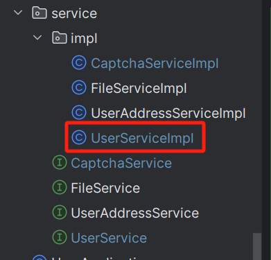

/\*\*

\* 1、查找手机号是否已经存在，存在表示已注册，否则未注册

\* 2、匹配密码是否正确，正确则登录成功，否则提示账号/密码错误

\* 3、登录成功 token 解决方案 TODO

\* @param userLoginEntity

\* @return

\*/

@Override

public ApiResult login(UserLoginEntity userLoginEntity) {

/\*\*

\* 1、查找手机号是否存在

\*/

List<UserDO> userList = userMapper.selectList(new QueryWrapper<UserDO>().eq("phone", userLoginEntity.getPhone()));

if (userList != null && userList.size() == 1) {

// 表示该手机号已经注册了

UserDO userDO \= userList.get(0);

String pwd \= Md5Crypt.md5Crypt(userLoginEntity.getPassword().getBytes(), userDO.getSecret());

// 如果请求的密码加密后跟数据库的匹配

if (pwd.equals(userDO.getPwd())) {

// 登录成功，生成 Token

return null;

} else {

return ApiResult.doResult(BizCodes.USER\_ACCOUNT\_PWD\_ERROR);

}

} else {

// 未注册

return ApiResult.doResult(BizCodes.USER\_ACCOUNT\_UNREGISTER);

}

}

[debug](http://debug%20/) 启动后，测试如下：

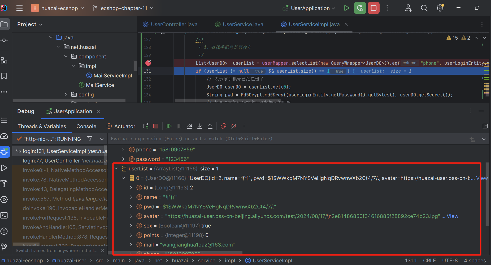

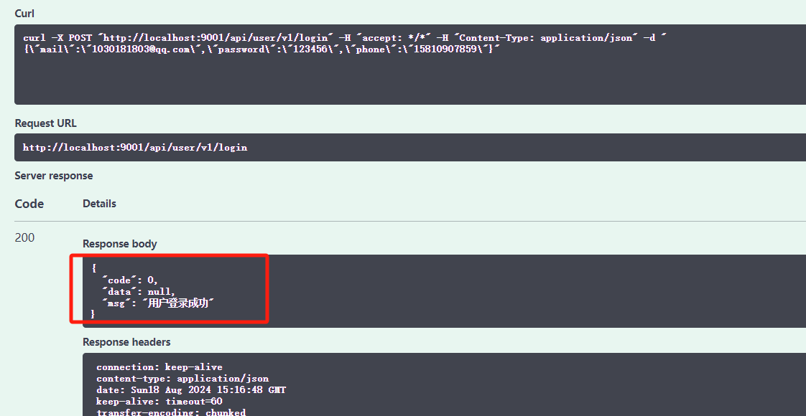

## **03 JWT 介绍**

官方解释：[JSON Web Token （JWT）](http://json%20web%20token%20\(jwt\)/) 是一种开放标准 （RFC 7519），它定义了一种紧凑且独立的方式，用于在各方之间以 JSON 对象的形式安全地传输信息。此信息可以验证和信任，因为它是经过数字签名的。JWT 可以使用密钥（使用 HMAC算法）或使用 RSA 或 ECDSA 的公钥/私钥对进行签名。

其实就是通过一定规范来生成 token，然后可以通过解密算法逆向解密 token，这样就可以获取用户信息。

## **3.1 JWT 使用场景**

1.  身份验证（[Authentication](http://authentication/)）：JWT 可以被用作用户登录的身份验证凭证。当用户成功登录后，服务端可以生成一个包含用户信息的 JWT，并将其返回给客户端。以后，客户端在每次请求时都会携带这个 JWT，服务端通过验证 JWT 的签名来确认用户的身份。
2.  授权（[Authorization](http://authorization/)）：在用户登录后，服务端可以生成包含用户角色、权限等信息的 JWT，并在用户每次请求时进行验证。通过解析 JWT 中的声明信息，服务端可以判断用户是否有权限执行特定的操作或访问特定的资源。
3.  信息交换（[Information Exchange](http://information%20exchange/)）：由于 JWT 的声明信息可以被加密，因此可以安全地在用户和服务器之间传递信息。这在分布式系统中非常有用，因为可以确保信息在各个环节中的安全传递。
4.  单点登录（[Single Sign-On](http://single%20sign-on/)）：JWT 可以被用于支持单点登录，使得用户在多个应用之间只需要登录一次即可使用多个应用，从而提高用户体验。

##   
**3.2 JWT 优缺点**

### **3.2.1 JWT 优点**

1.  无状态：JWT 的验证是基于密钥的，因此它不需要在服务端存储用户信息。这使得 JWT 可以作为一种无状态的身份认证机制。
2.  跨语言支持：JWT 的标准化和简单性质使得它可以在多种语言和平台之间使用。
3.  安全性高：由于 JWT 的载荷可以进行加密处理，因此 JWT 能够保证数据的安全传输。同时，JWT 的签名机制也能够保证数据的完整性和真实性。
4.  生成的 token 可以包含基本信息，比如 id、用户昵称、头像等信息，避免再次查库。

### **3.2.2 JWT 缺点**

1.  token 是经过 [base64](http://base64%20/) 编码，所以可以解码，因此 token 加密前的对象不应该包含敏感信息，如用户权限，密码等，防止泄漏。
2.  如果没有服务端存储，则不能做登录失效处理，除非服务端修改秘钥。

## **3.3 JWT 组成部分**

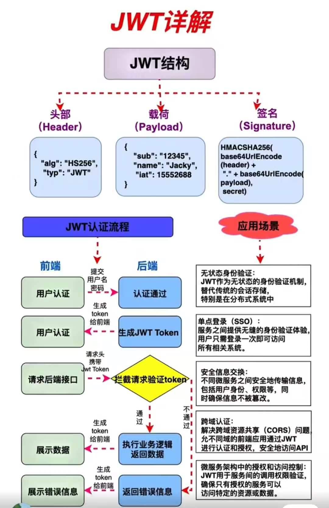

结构如下：

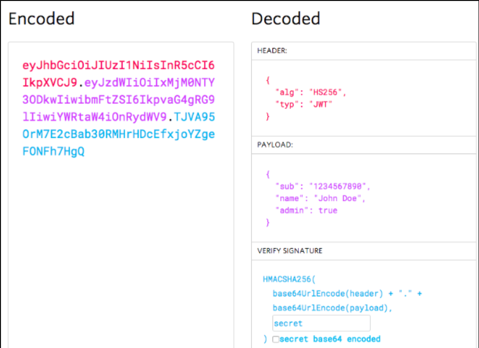

可以看到 JWT 是由 [Header+Payload+Signature](http://header+payload+signature/) 三部分组成的。

###   
**3.3.1 Header**

JWT 的头部主要是描述签名算法，通常由两部分组成，分别是「**令牌类型（typ）**」和「**加密算法（alg）**」。一般情况下，头部会采用 [Base64](http://base64%20/) 编码。

{

"alg": "HS256",

"typ": "JWT"

}

### **3.3.2 Payload**

JWT 的负载也称为声明信息，它主要描述是加密对象的信息，包含了一些有关实体（通常是用户）的信息以及其他元数据。通常包括以下几种声明：

1.  [Registered Claims](http://registered%20claims/)：这些声明是预定义的，包括 iss（发行者）、sub（主题）、aud（受众）、exp（过期时间）、nbf（生效时间）、iat（发布时间）和 jti（JWT ID）等。
2.  [Public Claims](http://public%20claims/)：这些声明可以自定义，但需要注意避免与注册声明的名称冲突。
3.  [Private Claims](http://private%20claims/)：这些声明是保留给特定的应用程序使用的，不会与其他应用程序冲突。

> 注意：Payload中一定不要存放敏感或重要信息，如密码等

{

"sub": "666666",

"name": "warriors",

"admin": true

}

### **3.3.3 Signature**  

  
JWT 的签名是由头部、载荷和密钥共同生成的。它用于验证 JWT 的真实性和完整性。一般情况下，签名也会采用 Base64 编码，防止别人拿到 token 进行 base 解密后篡改 token。

例如，如果要使用 [HMAC SHA256](http://hmac%20sha256/) 算法，将按以下方式创建签名:

HMACSHA256(

base64UrlEncode(header) + "." +

base64UrlEncode(payload),

secret)

## **3.4 登录 JWT 开发**

### **3.4.1 添加 JWT 依赖**

在最外层聚合工程添加版本依赖，并在 common 项目中添加相关依赖。

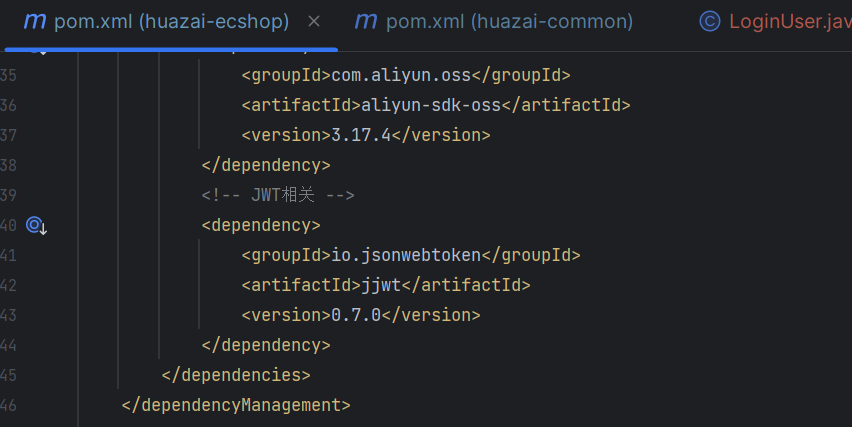

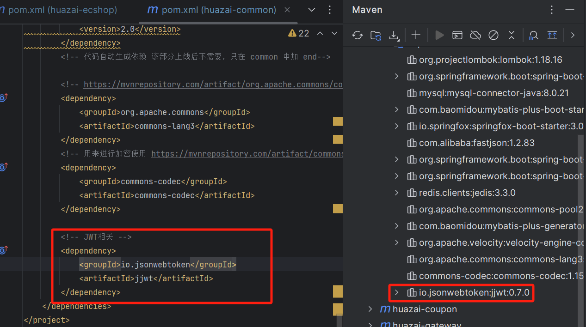

### **3.4.2 完善登录, 生成 JWT 令牌**

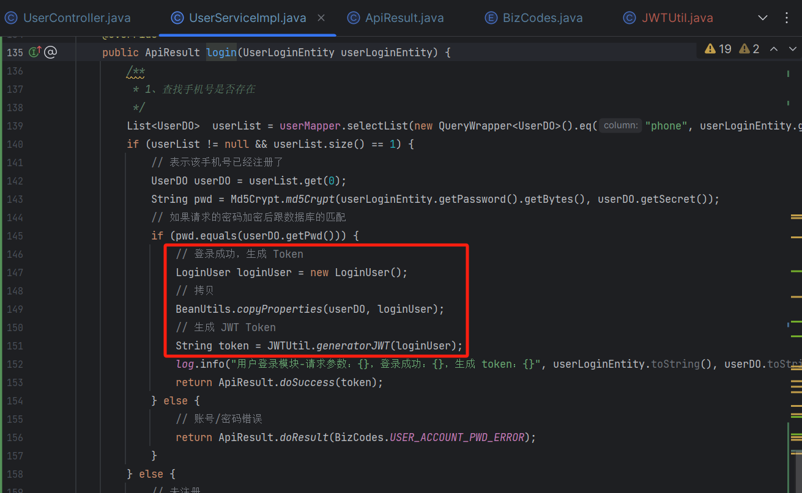

### **3.4.3 添加公共实体**

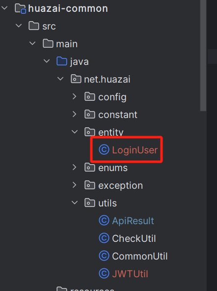

package net.huazai.entity;

import com.fasterxml.jackson.annotation.JsonProperty;

import lombok.Data;

/\*\*

\* @className: entity

\* @author: huazai，该项目是知识星球：华仔和他的朋友们 的内部项目

\* @date: 2024-08-19 9:35

\* @Version: 1.0

\* @description:

\*/

@Data

public class LoginUser {

/\*\*

\* 主键

\*/

private long id;

/\*\*

\* 用户名称

\*/

private String name;

/\*\*

\* 用户头像

\*/

@JsonProperty("head\_avatar")

private String headAvatar;

/\*\*

\* 手机号

\*/

private String phone;

/\*\*

\* 邮箱

\*/

private String mail;

}

### **3.4.4 封装 JWT 方法**

主要是生成 JWT 以及验证 JWT 是否可以正常解密。

package net.huazai.utils;

import io.jsonwebtoken.Claims;

import io.jsonwebtoken.Jwts;

import io.jsonwebtoken.SignatureAlgorithm;

import lombok.extern.slf4j.Slf4j;

import net.huazai.entity.LoginUser;

import java.util.Date;

/\*\*

\* @className: JWTUtil

\* @author: huazai，该项目是知识星球：华仔和他的朋友们 的内部项目

\* @date: 2024-08-19 8:40

\* @Version: 1.0

\* @description:

\*/

@Slf4j

public class JWTUtil {

/\*\*

\* token 过期时间，正常过期时间 7 天

\*/

private static final long EXPIRE \= 1000L \* 60 \* 60 \* 24 \* 7;

/\*\*

\* 加密的密钥

\*/

private static final String SECRET \= "huazai-ecshop-1234";

/\*\*

\* token 前缀

\*/

private static final String TOKEN\_PREFIX \= "ecshop";

/\*\*

\* SUBJECT

\*/

private static final String SUBJECT \= "huazai";

/\*\*

\* 根据用户信息，生成 JWT 令牌

\* @return

\*/

public static String generatorJWT(LoginUser loginUser) {

if (loginUser == null) {

throw new NullPointerException("登录对象为空");

}

// 生成 JWT

String token \= Jwts.builder().setSubject(SUBJECT)

// payload

.claim("id", loginUser.getId())

.claim("name", loginUser.getName())

.claim("head\_avatar", loginUser.getHeadAvatar())

.claim("mail", loginUser.getMail())

.setIssuedAt(new Date())

// 当前时间 + 过期时间

.setExpiration(new Date(System.currentTimeMillis() + EXPIRE))

// 加密算法

.signWith(SignatureAlgorithm.HS256, SECRET)

.compact();

// 加前缀区分业务

token = TOKEN\_PREFIX + token;

log.info("公共服务-生成 token：{}", token);

return token;

}

/\*\*

\* 校验 token 是否正确

\* @param token

\* @return

\*/

public static Claims checkJWT(String token) {

try {

final Claims claims \= Jwts.parser()

.setSigningKey(SECRET)

.parseClaimsJws(token.replace(TOKEN\_PREFIX, ""))

.getBody();

return claims;

} catch (Exception e) {

log.error("公共服务-解密 token 失败：{}", e);

return null;

}

}

}

### **3.4.5 启动测试**

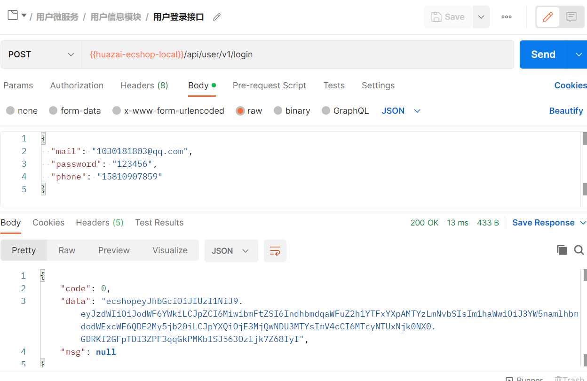

base64 网站：[https://base64.us/](https://base64.us/)。

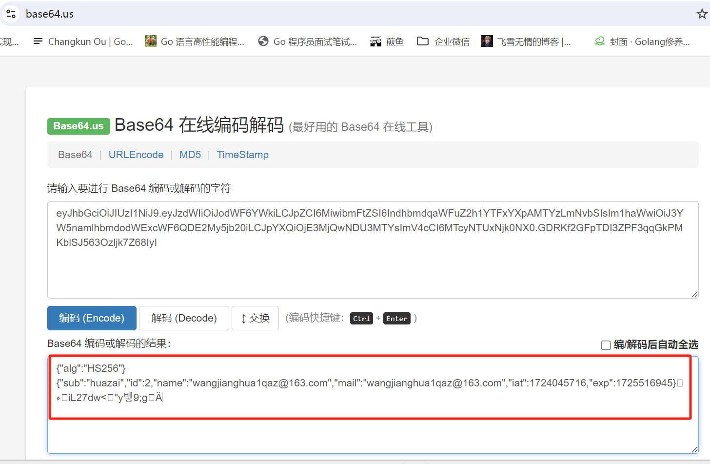

看到可以解密出来，所以这里不要存敏感信息。

## **3.5 JWT 过期自动刷新方案**

在「**前后端分离应用场景**」下，越来越多的项目都在使用「**JWT token**」作为接口的登录安全机制，但是经常会出现这样的情况，就是「**JWT token**」过期后，用户无法直接感知，假如在用户操作过程中页面期间，突然提示登录，就会体验很不友好，所以就有了「**JWT token 过期自动刷新**」的需求。

  
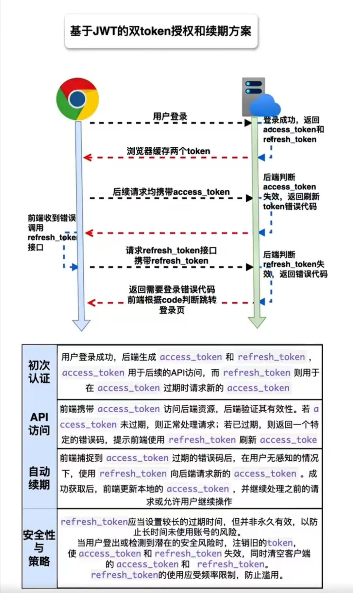

如图所示，目前大多数的解决方案如下：

就是在用户登录成功的时候，一次性返回给客户端两个 Token，分别为：[AccessToken](http://accesstoken/) 和 [RefreshToken](http://refreshtoken/)。

1.  [AccessToken](http://accesstoken/) 有效期较短，比如 7 天，用来正常请求。
2.  [RefreshToken](http://refreshtoken%20/) 有效期可以设置长一些，例如 20 天，30天等，可以作为刷新 [AccessToken](http://accesstoken/) 的凭证。

​

**刷新方案：**当 [AccessToken](http://accesstoken/) 即将过期的时候，比如提前 1 天，客户端通过 [RefreshToken](http://refreshtoken%20/) 请求指定的 API 获取新的 [AccessToken](http://accesstoken%20/) 并更新本地存储中的 [AccessToken](http://accesstoken/)。

这里通过一张图来说明下：

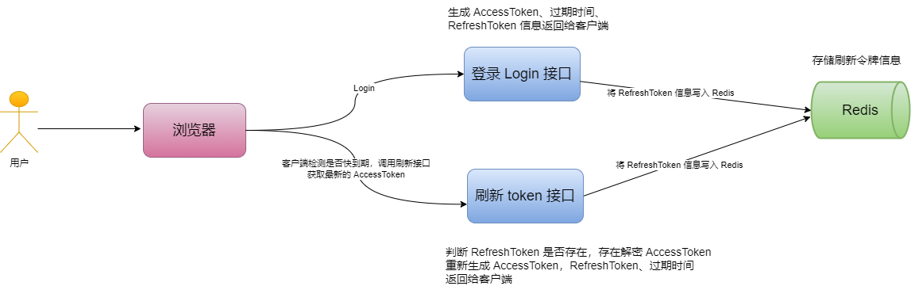

### **3.5.1 刷新接口**

​

/\*\*

\* 用户刷新 token

\* @param refresh\_token

\* @param access\_token

\* @return

\*/

@ApiOperation("用户刷新token")

@PostMapping("/refresh")

public ApiResult refreshToken(@ApiParam(value = "刷新 token") @RequestParam(value = "refresh\_token") String refresh\_token,

@ApiParam(value = "访问 token") @RequestParam(value = "access\_token") String access\_token) {

Map<String, Object> params = new HashMap<>();

params.put("refresh\_token", refresh\_token);

params.put("access\_token", access\_token);

ApiResult result \= userService.refreshToken(params);

return result;

}

### **3.5.2 生成 token 服务**

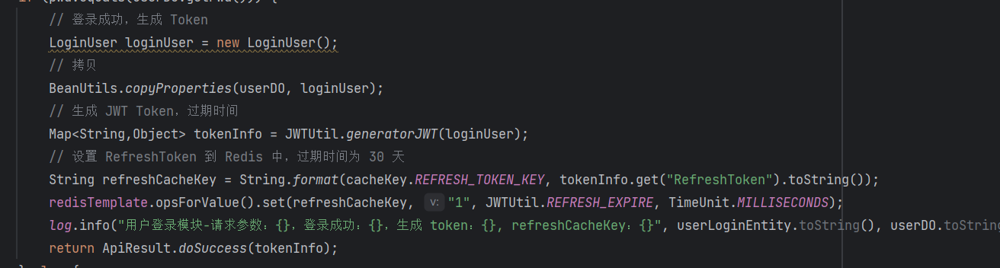

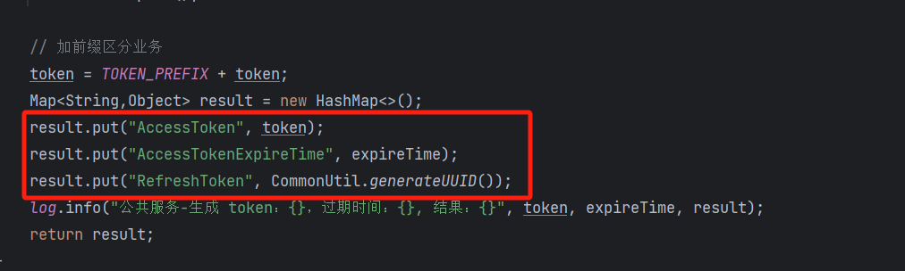

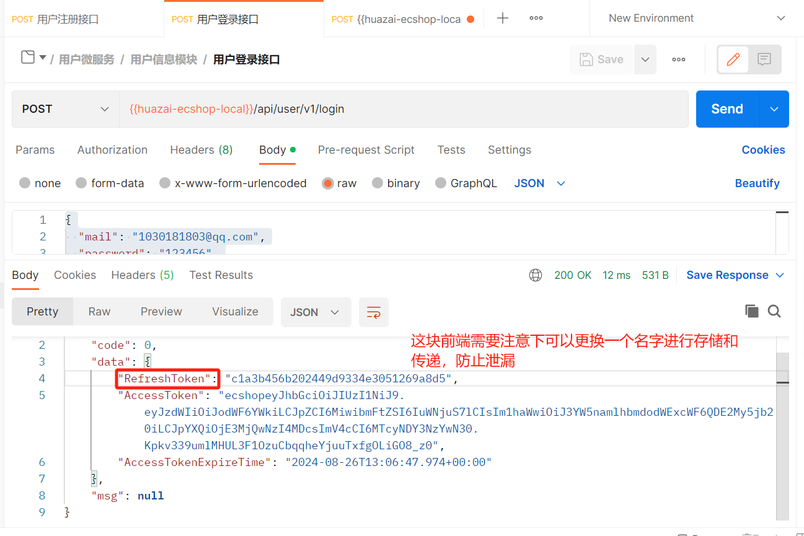

### **3.5.3 刷新 token 服务**

/\*\*

\* 用户刷新 token

\* @param params

\* @return

\*/

@Override

public ApiResult refreshToken(Map<String, Object> params) {

// 1、先查找 redis 是否存在 refreshToken

String refreshCacheKey \= String.format(cacheKey.REFRESH\_TOKEN\_KEY, params.get("refresh\_token").toString());

String refreshCacheVal \= redisTemplate.opsForValue().get(refreshCacheKey);

log.info("用户刷新模块-参数：{}, 缓存验证码key：{}，缓存验证码val：{}", params, refreshCacheKey, refreshCacheVal);

/\*\*

\* 如果不为空，则判断是否匹配

\*/

if (StringUtils.isNotBlank(refreshCacheVal)) {

// 2、如果存在，解密 accessToken

Claims claims \= JWTUtil.checkJWT(params.get("access\_token").toString());

if (claims == null) {

// 无法解密提示未登录

return ApiResult.doResult(BizCodes.USER\_ACCOUNT\_UNLOGIN);

}

// 3、如果可以解密 accessToken， 则重新生成 accessToken 等信息返回

long userId \= Long.valueOf(claims.get("id").toString());

List<UserDO> userList = userMapper.selectList(new QueryWrapper<UserDO>().eq("id", userId));

if (userList != null && userList.size() == 1) {

UserDO userDO \= userList.get(0);

// 登录成功，生成 Token

LoginUser loginUser \= new LoginUser();

// 拷贝

BeanUtils.copyProperties(userDO, loginUser);

// 生成 JWT Token，过期时间

Map<String,Object> tokenInfo = JWTUtil.generatorJWT(loginUser);

// 4、设置 RefreshToken 到 Redis 中，过期时间为 30 天

String refreshNewCacheKey \= String.format(cacheKey.REFRESH\_TOKEN\_KEY, tokenInfo.get("RefreshToken").toString());

redisTemplate.opsForValue().set(refreshNewCacheKey, "1", JWTUtil.REFRESH\_EXPIRE, TimeUnit.MILLISECONDS);

log.info("用户刷新模块-请求参数：{}，登录成功：{}，生成 token：{}, refreshCacheKey：{}", params, userDO.toString(), tokenInfo, refreshCacheKey);

// TODO 可以删除旧的 refreshToken

return ApiResult.doSuccess(tokenInfo);

} else {

// 无法解密提示未登录

return ApiResult.doResult(BizCodes.USER\_ACCOUNT\_UNLOGIN);

}

} else {

// refreshToken 不存在

return ApiResult.doResult(BizCodes.USER\_REFRESH\_TOKEN\_EMPTY);

}

}

启动服务，假如客户端检测 [accessToken](http://accesstoken%20/) 快到期了，然后调用刷新 [refreshToken](http://refreshtoken%20/) 接口，执行结果如下：

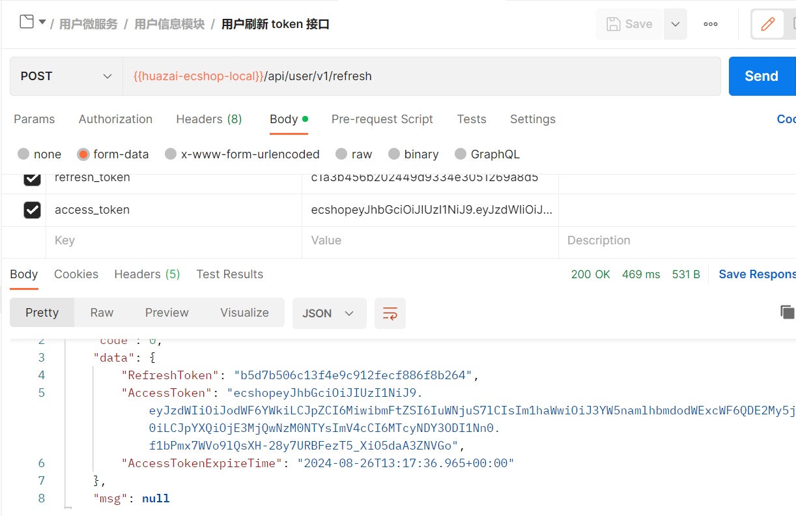

至此刷新 Token 就到此，最后留个作业给大家，假如此时「**JWT token**」泄漏之后，如何防止被恶意使用。感兴趣的可以尝试做一下。