大家好，我是**华仔**, 又跟大家见面了。

从今天之后的一段时间内，华仔会带着大家一起从零开始搭建并研发一套高并发的电商实战项目，这里会涉及到很多互联网大厂开发过程中所使用的核心技术和架构设计模式，希望大家学完之后可以用到自己的简历中。

这是第十七篇，本篇我们进行电商实战项目美食微服务模块高并发场景下美食缓存架构演进设计与开发，今天的内容非常重要。

文章汇总位置：[https://wx.zsxq.com/dweb2/index/columns/51122554151214](https://wx.zsxq.com/dweb2/index/columns/51122554151214)

源码授权与获取地址：[https://articles.zsxq.com/id\_1s85grnaae4p.html](https://articles.zsxq.com/id_1s85grnaae4p.html)

本章源码地址：[https://gitcode.net/u011359591/huazai-ecshop/-/tree/ecshop-chapter-17](https://gitcode.net/u011359591/huazai-ecshop/-/tree/ecshop-chapter-17)

## **01 前言**

终于要设计与研发电商项目代码了，今天我们要对美食微服务模块高并发场景下美食缓存架构演进设计与开发。

这里需要注意下，我们整个项目目前是不提供前端的，这个后续有时间在搞，主要是进行后端接口以及微服务模块架构设计。

## **02 美食缓存架构演进**

对于美食服务来说，它作为我们整个社区美食电商项目的一个载体，是非常重要的。对于我们这套类似小红书电商的高并发场景下，对于美食信息的查询是非常海量的，尤其是美食详情页的浏览量是非常巨大的。

因此我们要提前设计好美食相关的缓存架构来支撑高并发场景，下面我会通过「**场景驱动**」的方式来设计与开发下整个「**美食体系**」的「**缓存演进**」过程。

##   
**2.1 新增/修改美食数据缓存设计**

由于缓存工具类在用户缓存模块已经开发过了，这里直接公用就行。

先来看下新增/修改美食数据的时候，我们的缓存如何设计。

这里依旧会添加一个分布式锁，防止重复灌入数据，写完数据库+ Redis 后释放锁。

当成功写入数据库后写 Redis 缓存，过期时间为 2 天 + 随机数，代码如下：

/\*\*

\* 新增/修改美食信息

\* @param foodSaveOrUpdateEntity

\* @return

\*/

@Transactional(rollbackFor = Exception.class)

@Override

public ApiResult saveOrUpdate(FoodSaveOrUpdateEntity foodSaveOrUpdateEntity) {

// 获取用户登录信息 这里还是通过 ThreadLocal 进行获取

// TODO 后续使用 Redis 分布式缓存替代

LoginUser loginUser \= LoginInterceptor.threadLocal.get();

// 这里增加分布式锁，同一个用户同时间只能操作一次，避免重复请求

String foodUpdateLockKey \= RedisKeyConstant.FOOD\_UPDATE\_LOCK\_PREFIX + loginUser.getId();

Boolean lock \= null;

if (foodSaveOrUpdateEntity.getId() != null && foodSaveOrUpdateEntity.getId() > 0) {

lock = redisLock.lock(foodUpdateLockKey);

}

if (lock != null && !lock) {

log.info("美食服务模块-新增/修改美食信息获取锁失败，user:{}", loginUser.getId());

throw new BizException(BizCodes.FOOD\_UPDATE\_LOCK\_FAIL);

}

try {

// 构建美食信息

FoodDO foodDO \= buildFoodDO(foodSaveOrUpdateEntity, loginUser);

// 保存美食信息

if (foodDO.getId() == null) {

// 新增

int rows \= foodMapper.insert(foodDO);

log.info("美食模块-新增美食信息：rows={}，data={}", rows, foodDO);

} else {

// 修改

foodMapper.update(foodDO, new QueryWrapper<FoodDO>().eq("id", foodDO.getId()));

log.info("美食模块-修改美食信息：data={}", foodDO);

}

// 更新美食缓存

updateFoodCache(foodDO);

// 发布美食数据更新事件消息

publishFoodUpdatedEvent(foodDO);

return null;

} finally {

if (lock != null) {

// 释放锁

redisLock.unlock(foodUpdateLockKey);

}

}

}

/\*\*

\* 更新美食缓存

\* @param foodDO

\*/

private void updateFoodCache(FoodDO foodDO) {

// 修改美食信息缓存数据，过期时间为 2 天 + 随机几小时

String foodKey \= RedisKeyConstant.FOOD\_INFO\_PREFIX + foodDO.getId();

redisCache.setCache(foodKey, foodDO, RedisCache.generateCacheExpire());

}

public class RedisKeyConstant {

/\*\*

\* 美食信息

\*/

public static final String FOOD\_INFO\_PREFIX \= "food\_info:";

/\*\*

\* 美食信息修改锁前缀

\*/

public static final String FOOD\_UPDATE\_LOCK\_PREFIX \= "food\_update\_lock:";

}

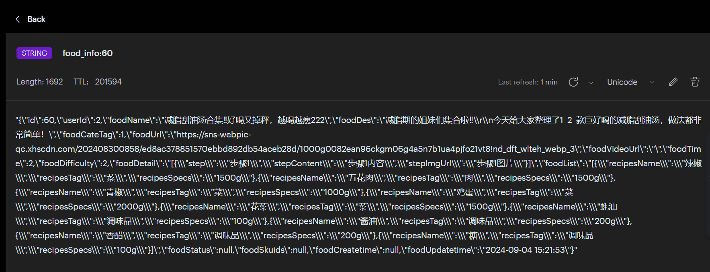

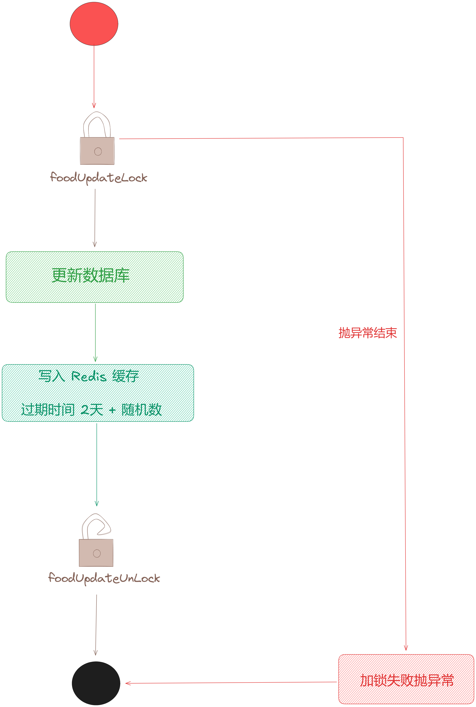

## **2.2 美食列表数据缓存设计演进**

在 [【电商实战项目第十四篇】华仔电商实战项目用户微服务模块高并发场景下用户缓存架构演进设计与开发](https://articles.zsxq.com/id_h24gcw75o028.html) 这篇中，我们分析了「**用户数据**」是一个典型的读多写少场景，所以直接构建「**缓存**」即可。

但是对于这里「**某个作者发布的美食列表**」数据来说，直接这么分页构建「**缓存**」是非常没有必要的，你可以试想一下，不可能每个用户都会对某个作者发布过的美食列表数据进行一页一页查询的，所以我们只需在「**真正有用户浏览**」的时候再去构建「**缓存**」是不是更符合实际需求，也更少的占用「**缓存**」空间呢。

  
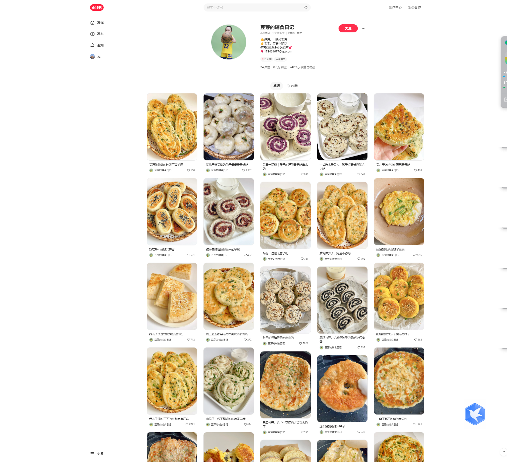

这里我们拿小红书美食博主的笔记列表来举例，从它这个功能来看是不支持随机页数跳转的，它是瀑布流的模式。

### **2.2.1 惰性构建我的美食分页缓存设计**

首先这里并不是每一页都去构建缓存，而是有用户浏览/查询到了某一页才会去「**构建**」缓存，这样就可以解决「**真正有用户浏览**」时可以从「**缓存**」中读取提高性能，另外也可以「**精准地**」控制分页缓存的过期，当没有用户浏览时会在 「**2天后**」的某个时间点会过期，而对于「**热数据**」会进行「**精准**」延期。

先来统计一下我的美食列表总数，这里不用查库的方式，通过维护一个自增 key 来实现。  

  
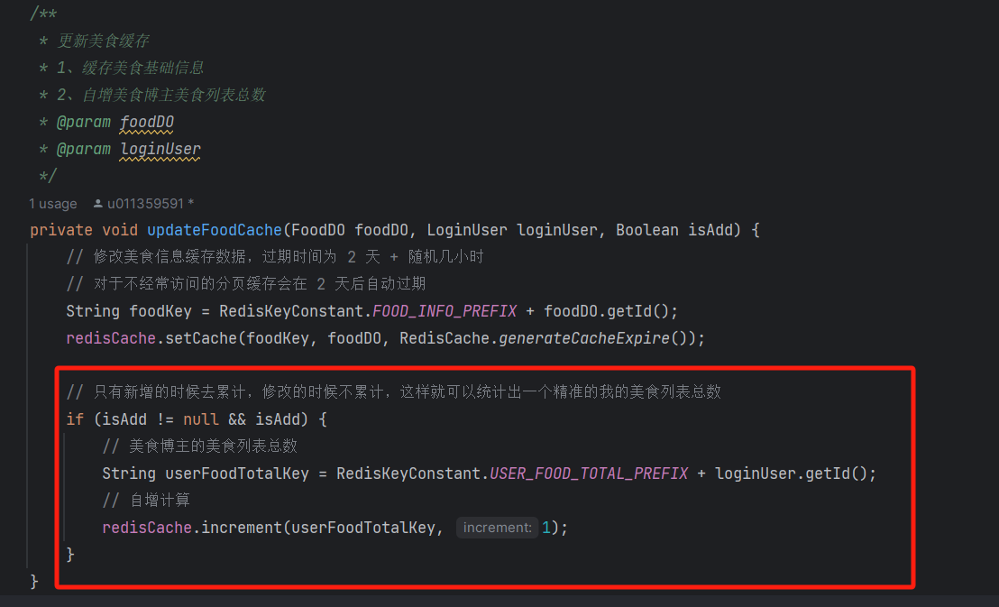

接着来看下初版的「**构建**」构建分页缓存的代码实现。

/\*\*

\* 分页查询我的美食列表

\* @param foodQueryEntity

\* @return

\*/

@Override

public Map<String, Object> getFoodList(FoodQueryEntity foodQueryEntity) {

// 获取用户信息

// TODO 后续使用 Redis 分布式缓存替代

LoginUser loginUser \= LoginInterceptor.threadLocal.get();

log.info("美食模块-从数据库获取美食列表参数信息，page:{}，size:{}，uid:{}", foodQueryEntity.getPage(), foodQueryEntity.getPageSize(), loginUser.getId());

// 先从缓存分页读取

Map<String, Object> pageCache = getFoodListFromCache(foodQueryEntity, loginUser);

if (pageCache != null) {

return pageCache;

}

// 缓存没命中的话 从数据库查询

return getFoodListFromDB(foodQueryEntity, loginUser);

}

/\*\*

\* 从缓存中分页获取我的美食列表

\* @param foodQueryEntity

\* @param loginUser

\* @return

\*/

private Map<String, Object> getFoodListFromCache(FoodQueryEntity foodQueryEntity, LoginUser loginUser) {

// 先从缓存分页读取

String userFoodPageKey \= RedisKeyConstant.USER\_FOOD\_PAGE\_PREFIX + loginUser.getId() + ":" + foodQueryEntity.getPage();

String foodsCache \= redisCache.get(userFoodPageKey);

// 判断缓存是否为空

if (foodsCache != null && !"".equals(foodsCache)) {

// 计算我的美食列表总数（这里会精准统计新增美食的总数，相当于直接查数据库列表）

String userFoodTotalKey \= RedisKeyConstant.USER\_FOOD\_TOTAL\_PREFIX + loginUser.getId();

int size \= redisCache.getInt(userFoodTotalKey);

// 解析缓存结果列表

List<FoodVO> foodVOList = JSON.parseObject(foodsCache, List.class);

Long expire \= redisCache.getExpire(userFoodPageKey, TimeUnit.SECONDS);

// 如果过期时间已经在 1 小时内了就自动延期

if (expire < RedisCache.ONE\_HOURS\_SECONDS) {

// 缓存精准自动延期 2天 + 随机几个小时

redisCache.expire(userFoodPageKey, RedisCache.generateCacheExpire());

}

// 处理分页返回数据

Map<String,Object> pageMap = new HashMap<>(5);

// 总条数

pageMap.put("total", size);

int totalPages \= (int) Math.ceil((double) size / foodQueryEntity.getPageSize());// 计算总页数

// 总分页数

pageMap.put("pages", totalPages);

// 当前页

pageMap.put("curr\_page", foodQueryEntity.getPage());

// 每页条数

pageMap.put("curr\_page\_size", foodQueryEntity.getPageSize());

// 列表信息

pageMap.put("list", foodVOList);

return pageMap;

}

return null;

}

/\*\*

\* 从数据库中分页查询我的美食列表

\* @param foodQueryEntity

\* @param loginUser

\* @return

\*/

private Map<String, Object> getFoodListFromDB(FoodQueryEntity foodQueryEntity, LoginUser loginUser) {

// 这里增加分布式锁，同一个用户同时间只能操作一次，避免重复请求

String foodUpdateLockKey \= RedisKeyConstant.FOOD\_UPDATE\_LOCK\_PREFIX + loginUser.getId();

boolean lock \= false;

try {

// 尝试加锁，超时时间为 200 ms，超时后自动释放锁

lock = redisLock.tryLock(foodUpdateLockKey, RedisCache.USER\_UPDATE\_LOCK\_TIMEOUT);

} catch (InterruptedException e) {

// 加锁异常后，再次尝试从缓存中获取，如果缓存存在直接返回

Map<String, Object> pageCache = getFoodListFromCache(foodQueryEntity, loginUser);

if (pageCache != null) {

return pageCache;

}

log.error("美食模块-尝试加锁异常，异常信息：{}，异常栈信息：{}", e.getMessage(), e);

throw new BizException(BizCodes.FOOD\_INFO\_LOCK\_FAIL);

}

// 加锁失败

if (!lock) {

// 加锁异常后，再次尝试从缓存中获取，如果缓存存在直接返回

Map<String, Object> pageCache = getFoodListFromCache(foodQueryEntity, loginUser);

if (pageCache != null) {

return pageCache;

}

log.info("美食模块-美食分页缓存为空，从数据库获取美食分页数据获取锁失败，user:{}", loginUser.getId());

throw new BizException(BizCodes.FOOD\_INFO\_LOCK\_FAIL);

}

try {

// 极端情况下: 查数据库前再次尝试从缓存中获取，如果缓存存在直接返回

Map<String, Object> pageCache = getFoodListFromCache(foodQueryEntity, loginUser);

if (pageCache != null) {

return pageCache;

}

// 分页信息

Page<FoodDO> pageInfo = new Page<>(foodQueryEntity.getPage(), foodQueryEntity.getPageSize());

IPage<FoodDO> foodDOPage = null;

// 查询我的未删除美食列表

foodDOPage = foodMapper.selectPage(pageInfo, new QueryWrapper<FoodDO>().eq("user\_id", loginUser.getId()).eq("food\_status", FoodStatus.DEFAULT\_STATUS));

List<FoodDO> foodDOList = foodDOPage.getRecords();

log.info("美食模块-从数据库获取我的美食列表，page:{}，total:{}，size：{}", foodDOPage.getPages(), foodDOPage.getTotal(), foodDOPage.getSize());

// 对象流式转换处理美食列表结果信息

List<FoodVO> foodVOList = foodDOList.stream().map(obj -> {

FoodVO foodVO \= new FoodVO();

if (obj.getFoodCateTag() != null) {

// 设置美食分类

foodVO.setFoodCateTag(FoodCateTag.getByTag(obj.getFoodCateTag()).getTagValue());

}

if (obj.getFoodDifficulty() != null) {

// 设置美食制作难度

foodVO.setFoodDifficulty(FoodDifficulty.getByDifficulty(obj.getFoodDifficulty()).getDifficultyValue());

}

if (obj.getFoodTime() != null) {

// 设置美食制作时长

foodVO.setFoodTime(FoodTime.getByTime(obj.getFoodTime()).getTimeValue());

}

if (StringUtils.isNotBlank(obj.getFoodDetail())) {

// 设置美食详情

List<FoodStepDetailEntity> stepDetails = JsonUtil.StringtoList(obj.getFoodDetail(), FoodStepDetailEntity.class);

foodVO.setFoodDetail(stepDetails);

}

if (StringUtils.isNotBlank(obj.getFoodList())) {

// 设置美食清单

List<FoodListEntity> foodList = JsonUtil.StringtoList(obj.getFoodList(), FoodListEntity.class);

foodVO.setFoodList(foodList);

}

// TODO 商品信息关联

if (StringUtils.isNotBlank(obj.getFoodSkuids())) {

List<Long> skuIds = JsonUtil.jsonToLongList(obj.getFoodSkuids());

// 设置美食关联商品id

foodVO.setSkuIds(skuIds);

}

BeanUtils.copyProperties(obj, foodVO);

return foodVO;

}).collect(Collectors.toList());

// 写入分页缓存数据

String userFoodPageKey \= RedisKeyConstant.USER\_FOOD\_PAGE\_PREFIX + loginUser.getId() + ":" + foodQueryEntity.getPage();

redisCache.set(userFoodPageKey, JsonUtil.object2Json(foodVOList), RedisCache.generateCacheExpire());

Map<String, Object> pageMap = new HashMap<>(5);

// 总条数

pageMap.put("total", foodDOPage.getTotal());

// 总分页数

pageMap.put("pages", foodDOPage.getPages());

// 当前页

pageMap.put("curr\_page", foodQueryEntity.getPage());

// 每页条数

pageMap.put("curr\_page\_size", foodQueryEntity.getPageSize());

// 列表信息

pageMap.put("list", foodVOList);

return pageMap;

} finally {

// 释放锁

redisLock.unlock(foodUpdateLockKey);

}

}

###   
**2.2.2 热点博主美食数据缓存自动延期方案**

之前在「**用户信息**」缓存模块，就带大家剖析过，任何系统都可以通过「**二八定律**」来处理，对于大部分用户信息来说都是「**冷数据**」，很少有人访问的，所以到时间过期即可，只有少部分用户的数据是「**热数据**」，到时候访问会自动续期的，我们只保留这种「**热数据**」在缓存即可，既可以减少缓存空间，又可以在读取的时候达到高并发的效果。

因此这里我们做了一个机制：「**缓存自动延期机制**」，我们来看下获取博主美食信息方法。

  
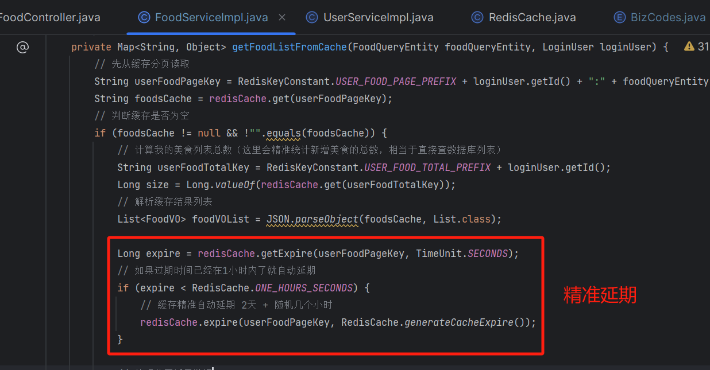

整个流程图如下：

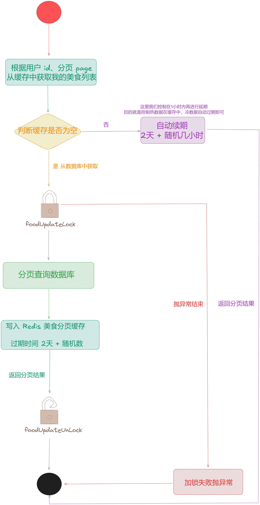

### **2.2.3 基于 RocketMQ 异步更新美食分页缓存策略**

针对上面「**初版**」的缓存构建代码实现，这里其实是有一些问题的，当我们不停的「**发布美食信息**」写入到数据后，就很少在更新其内容数据了，按照上面的分页查询缓存实现就是：

> 当用户真正浏览到第几页时就把第几页的美食进行写入到缓存然后设置随机的过期时间。经常访问的美食页缓存就会自动延期常驻到缓存中，而不经常访问的美食页缓存就会自动过期淘汰掉。

是否会有这样的场景，假如当我们把「**美食列表分页缓存构建好之后**」, 又发布了一些美食信息，此时就会导致之前辛苦构建的分页缓存全部失效掉，美食信息数据一旦变化，那么分页查询的数据就会发生变化，我们只能对所有的美食信息列表进行重建，「**这是非常耗时的工作**」。

> 因为之前每构建一页缓存就需要从数据库中查出对应的那页缓存数据，然后再重新刷写到缓存中。

**那么该如何解决这个问题呢？**

针对这种耗时的操作，我们这里打算通过「**异步**」的方式来进行更新，我们采用 「**RocketMQ**」来实现异步更新。

###   
**2.2.3.1 引入 RocketMQ 组件**

这里引入一个大家用的比较多的版本，新版本坑太多，出现问题不好解决，以后再升级。

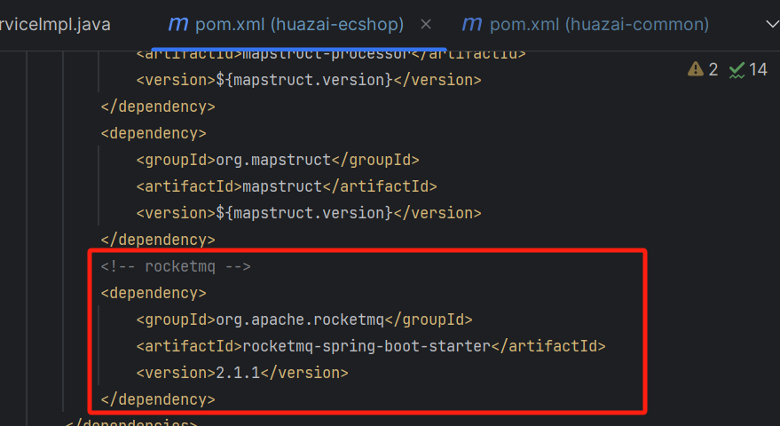

由于后续整个实战项目都会用到 RocketMQ，所以我们直接在 Common 工程下进行引入。

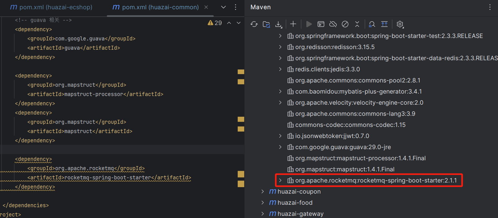

[huazai-food](http://huazai-food/) 工程引入 RocketMQ 客户端版本：

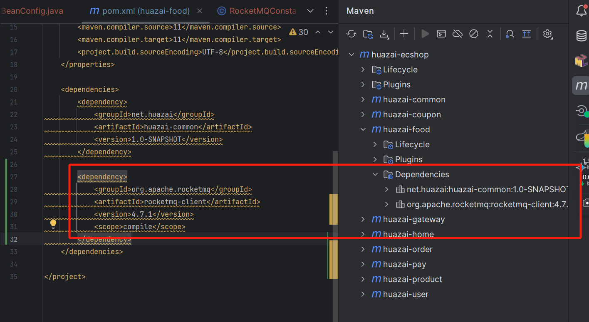

在 [application.yml](http://application.yml/) 配置文件中添加 rocketmq 配置：

这里需要注意的是：**单独配置，不要放在 spring 下面，否则报错**

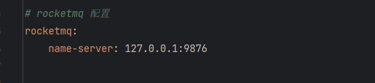

### **2.2.3.2 RocketMQ 组件工具类开发**

在 common 工程中添加公共配置：

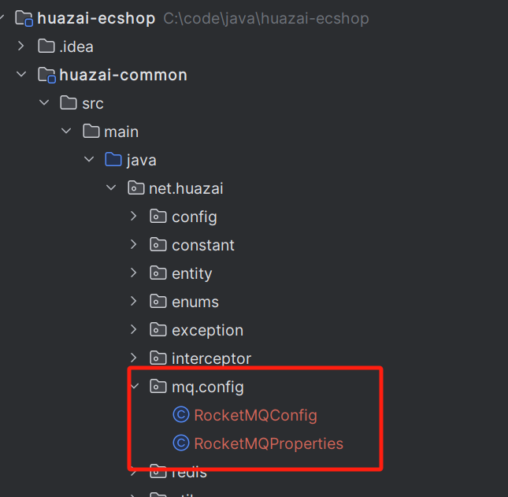

package net.huazai.mq.config;

import org.springframework.boot.context.properties.EnableConfigurationProperties;

import org.springframework.context.annotation.Configuration;

/\*\*

\* RocketMQ 配置

\*/

@Configuration

@EnableConfigurationProperties(RocketMQProperties.class)

public class RocketMQConfig {

}

package net.huazai.mq.config;

import org.springframework.boot.context.properties.ConfigurationProperties;

/\*\*

\* RocketMQ nameserver

\*/

@ConfigurationProperties(prefix = "rocketmq")

public class RocketMQProperties {

private String nameServer;

/\*\*

\* 获取 nameserver

\* @return

\*/

public String getNameServer() {

return nameServer;

}

/\*\*

\* 设置 nameserver

\* @param nameServer

\*/

public void setNameServer(String nameServer) {

this.nameServer = nameServer;

}

}

### **2.2.3.3 美食服务添加生产者和消费者**

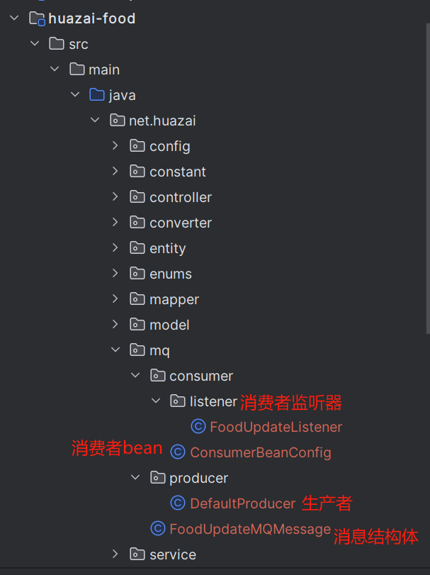

这里来一个通用的生产者，后续只需要更换一下「**生产者组**」即可。

package net.huazai.mq.producer;

import lombok.extern.slf4j.Slf4j;

import net.huazai.constant.RocketMQConstant;

import net.huazai.exception.BizException;

import org.apache.rocketmq.client.exception.MQClientException;

import org.apache.rocketmq.client.producer.SendResult;

import org.apache.rocketmq.client.producer.SendStatus;

import org.apache.rocketmq.client.producer.TransactionMQProducer;

import org.apache.rocketmq.common.message.Message;

import org.apache.rocketmq.spring.autoconfigure.RocketMQProperties;

import org.springframework.beans.factory.annotation.Autowired;

import org.springframework.stereotype.Component;

import java.nio.charset.StandardCharsets;

import java.util.ArrayList;

import java.util.List;

/\*\*

\* RocketMQ 生产者

\*/

@Slf4j

@Component

public class DefaultProducer {

/\*\*

\* 事务生产者客户端

\*/

private final TransactionMQProducer producer;

@Autowired

public DefaultProducer(RocketMQProperties rocketMQProperties) {

// 初始化事务生产者客户端，设置对应的生产者组

producer = new TransactionMQProducer(RocketMQConstant.FOOD\_DEFAULT\_PRODUCER\_GROUP);

// 设置 nameserver

producer.setNamesrvAddr(rocketMQProperties.getNameServer());

// 启动生产者服务

start();

}

/\*\*

\* 启动 rocketmq 生产者服务

\* 该对象在使用之前必须要调用一次，只能初始化一次

\*/

public void start() {

try {

this.producer.start();

} catch (MQClientException e) {

log.error("rocketmq producer start error", e);

}

}

/\*\*

\* 关闭 rocketmq 生产者

\*/

public void shutdown() {

this.producer.shutdown();

}

/\*\*

\* 发送单条消息

\* @param topic 主题

\* @param message 消息

\* @param type 类型

\*/

public void sendMessage(String topic, String message, String type) {

sendMessage(topic, message, -1, type);

}

/\*\*

\* 发送消息

\* @param topic 主题

\* @param message 消息

\* @param delayTimeLevel 延迟等级

\* @param type 类型

\*/

public void sendMessage(String topic, String message, Integer delayTimeLevel, String type) {

Message msg \= new Message(topic, message.getBytes(StandardCharsets.UTF\_8));

try {

if (delayTimeLevel > 0) {

msg.setDelayTimeLevel(delayTimeLevel);

}

SendResult send \= producer.send(msg);

if (SendStatus.SEND\_OK == send.getSendStatus()) {

log.info("发送 MQ 消息成功, type:{}, message:{}", type, message);

} else {

throw new BizException(send.getSendStatus().toString());

}

} catch (Exception e) {

log.error("发送 MQ 消息失败：", e);

throw new BizException("发送 MQ 消息失败");

}

}

/\*\*

\* 批量发送消息

\* @param topic 主题

\* @param messages 多个消息

\* @param type 类型

\*/

public void sendMessages(String topic, List<String> messages, String type) {

sendMessages(topic, messages, -1, type);

}

/\*\*

\* 批量发送消息

\* @param topic 主题

\* @param messages 多个消息

\* @param delayTimeLevel 延迟等级

\* @param type 类型

\*/

public void sendMessages(String topic, List<String> messages, Integer delayTimeLevel, String type) {

List<Message> list = new ArrayList<>();

for (String message : messages) {

Message msg \= new Message(topic, message.getBytes(StandardCharsets.UTF\_8));

if (delayTimeLevel > 0) {

msg.setDelayTimeLevel(delayTimeLevel);

}

list.add(msg);

}

try {

SendResult send \= producer.send(list);

if (SendStatus.SEND\_OK == send.getSendStatus()) {

log.info("发送 MQ 消息成功, type:{}", type);

} else {

throw new BizException(send.getSendStatus().toString());

}

} catch (Exception e) {

log.error("发送 MQ 消息失败：", e);

throw new BizException("发送 MQ 消息失败");

}

}

/\*\*

\* 获取事务生产者

\* @return

\*/

public TransactionMQProducer getProducer() {

return producer;

}

}

消息结构体很简单，就两个字段:「**美食id**」和「**美食博主uid**」。

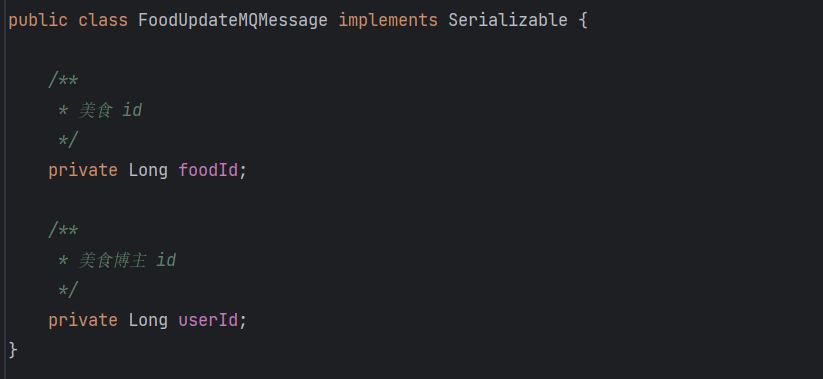

消费者这里我们通过「**Bean 配置启动消费者**」以及「**消费监听器**」来并发消费消息构建我的美食列表分页缓存。

  
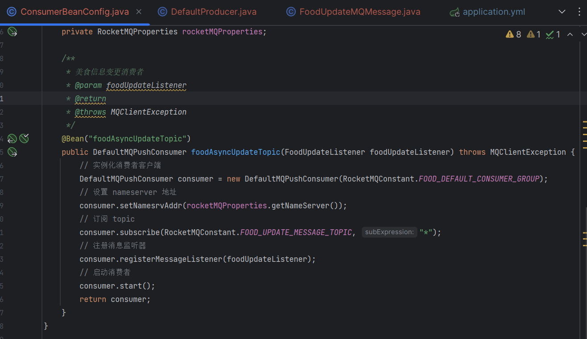

package net.huazai.mq.consumer.listener;

import com.baomidou.mybatisplus.core.conditions.query.QueryWrapper;

import com.baomidou.mybatisplus.core.metadata.IPage;

import com.baomidou.mybatisplus.extension.plugins.pagination.Page;

import lombok.extern.slf4j.Slf4j;

import net.huazai.constant.RedisKeyConstant;

import net.huazai.entity.FoodListEntity;

import net.huazai.entity.FoodStepDetailEntity;

import net.huazai.enums.FoodCateTag;

import net.huazai.enums.FoodDifficulty;

import net.huazai.enums.FoodStatus;

import net.huazai.enums.FoodTime;

import net.huazai.mapper.FoodMapper;

import net.huazai.model.FoodDO;

import net.huazai.mq.FoodUpdateMQMessage;

import net.huazai.redis.RedisCache;

import net.huazai.redis.RedisLock;

import net.huazai.utils.JsonUtil;

import net.huazai.vo.FoodVO;

import org.apache.commons.lang3.StringUtils;

import org.apache.rocketmq.client.consumer.listener.ConsumeConcurrentlyContext;

import org.apache.rocketmq.client.consumer.listener.ConsumeConcurrentlyStatus;

import org.apache.rocketmq.client.consumer.listener.MessageListenerConcurrently;

import org.apache.rocketmq.common.message.MessageExt;

import org.springframework.beans.BeanUtils;

import org.springframework.beans.factory.annotation.Autowired;

import org.springframework.stereotype.Component;

import java.util.List;

import java.util.stream.Collectors;

/\*\*

\* 美食信息变更监听器

\*/

@Slf4j

@Component

public class FoodUpdateListener implements MessageListenerConcurrently {

/\*\*

\* 每页 20 条

\*/

private static final int PAGE\_SIZE \= 20;

/\*\*

\* 注入 redis

\*/

@Autowired

private RedisCache redisCache;

/\*\*

\* 注入 redis 分布式锁

\*/

@Autowired

private RedisLock redisLock;

/\*\*

\* 注入美食 mapper

\*/

@Autowired

private FoodMapper foodMapper;

/\*\*

\* 并发消费美食消息

\* @param msgList

\* @param context

\* @return

\*/

@Override

public ConsumeConcurrentlyStatus consumeMessage(List<MessageExt> msgList, ConsumeConcurrentlyContext context) {

try {

for (MessageExt messageExt : msgList) {

String msg \= new String(messageExt.getBody());

// 解析美食信息

FoodUpdateMQMessage message \= JsonUtil.json2Object(msg, FoodUpdateMQMessage.class);

log.info("美食 MQ 异步更新-执行美食博主美食分页缓存数据异步更新，消息内容：{}", message);

// 美食博主 id

Long userId \= message.getUserId();

// 这里增加分布式锁，同一个用户同时间只能操作一次，避免重复请求

String foodUpdateLockKey \= RedisKeyConstant.FOOD\_UPDATE\_LOCK\_PREFIX + userId;

// 这里通过阻塞的方式进行加锁，跟新增/更新美食操作互斥，并发操作时进行阻塞

redisLock.blockedLock(foodUpdateLockKey);

try {

// 此时我们需要对美食博主的美食列表进行分页缓存重新构建

// 1、计算我的美食列表总数

String userFoodTotalKey \= RedisKeyConstant.USER\_FOOD\_TOTAL\_PREFIX + userId;

int size \= redisCache.getInt(userFoodTotalKey);

log.info("美食 MQ 异步更新-key:{}, value:{}", userFoodTotalKey, size);

// 计算总分页数

int pageNums \= (int) Math.ceil((double) size / PAGE\_SIZE) + 1;

// 2、循环构建美食分页缓存

for(int page \= 1; page <= pageNums; page++) {

// 美食分页缓存 key

String userFoodPageKey \= RedisKeyConstant.USER\_FOOD\_PAGE\_PREFIX

\+ userId + ":" + page;

// 先从缓存中获取一下

String foodsCache \= redisCache.get(userFoodPageKey);

// 如果分页缓存为空，跳过

if(foodsCache == null || "".equals(foodsCache)) {

continue;

}

// 只有缓存中存在这一页的数据才会去数据库读取最新的美食信息去更新

// 分页信息

Page<FoodDO> pageInfo = new Page<>(page, pageNums);

IPage<FoodDO> foodDOPage = null;

// 查询我的未删除美食列表

foodDOPage = foodMapper.selectPage(pageInfo, new QueryWrapper<FoodDO>().eq("user\_id", userId).eq("food\_status", FoodStatus.DEFAULT\_STATUS));

List<FoodDO> foodDOList = foodDOPage.getRecords();

log.info("美食 MQ 异步更新-从数据库获取我的美食列表，page:{}，total:{}，size：{}", foodDOPage.getPages(), foodDOPage.getTotal(), foodDOPage.getSize());

// 对象流式转换处理美食列表结果信息

List<FoodVO> foodVOList = foodDOList.stream().map(obj -> {

FoodVO foodVO \= new FoodVO();

if (obj.getFoodCateTag() != null) {

// 设置美食分类

foodVO.setFoodCateTag(FoodCateTag.getByTag(obj.getFoodCateTag()).getTagValue());

}

if (obj.getFoodDifficulty() != null) {

// 设置美食制作难度

foodVO.setFoodDifficulty(FoodDifficulty.getByDifficulty(obj.getFoodDifficulty()).getDifficultyValue());

}

if (obj.getFoodTime() != null) {

// 设置美食制作时长

foodVO.setFoodTime(FoodTime.getByTime(obj.getFoodTime()).getTimeValue());

}

if (StringUtils.isNotBlank(obj.getFoodDetail())) {

// 设置美食详情

List<FoodStepDetailEntity> stepDetails = JsonUtil.StringtoList(obj.getFoodDetail(), FoodStepDetailEntity.class);

foodVO.setFoodDetail(stepDetails);

}

if (StringUtils.isNotBlank(obj.getFoodList())) {

// 设置美食清单

List<FoodListEntity> foodList = JsonUtil.StringtoList(obj.getFoodList(), FoodListEntity.class);

foodVO.setFoodList(foodList);

}

// TODO 商品信息关联

if (StringUtils.isNotBlank(obj.getFoodSkuids())) {

List<Long> skuIds = JsonUtil.jsonToLongList(obj.getFoodSkuids());

// 设置美食关联商品id

foodVO.setSkuIds(skuIds);

}

BeanUtils.copyProperties(obj, foodVO);

return foodVO;

}).collect(Collectors.toList());

// 写入分页缓存数据

redisCache.set(userFoodPageKey, JsonUtil.object2Json(foodVOList), RedisCache.generateCacheExpire());

}

} finally {

redisLock.unlock(foodUpdateLockKey);

}

}

} catch (Exception e) {

// 本次消费失败，下次重新消费

log.error("美食 MQ 异步更新 consume error, 更新博主美食缓存数据消费失败", e);

return ConsumeConcurrentlyStatus.RECONSUME\_LATER;

}

log.info("美食 MQ 异步更新-博主美食缓存数据消费成功, result: {}", ConsumeConcurrentlyStatus.CONSUME\_SUCCESS);

return ConsumeConcurrentlyStatus.CONSUME\_SUCCESS;

}

}

来看下这一版我们解决了哪些问题：

1.  异步更新我的美食分页列表缓存，这里需要注意的是：「**我们只更新存在分页缓存的那一页数据**」，为空的直接跳过。这么设计主要是为了节约缓存空间，惰性构建缓存。
2.  「**基于分布式锁**」来解决缓存与数据库双写一致性的问题。

我们重点来剖析下第二个问题。

### **2.2.3.4 基于分布式锁下缓存与数据库双写一致性分析**

如果在这个消费者代码中不加「**分布式锁**」会出现什么问题，我们来通过「**场景驱动**」的方式分析下高并发极端场景「**缓存 + 数据库双写不一致**」的问题。

###   
**2.2.3.4.1 高并发极端场景下读写不一致剖析**

在高并发极端场景下，同一时刻，一个 [线程 A](http://xn--%20a-980k56u/) 在「**修改美食信息**」，而另外一个 [线程 B](http://xn--%20b-980k56u/) 在「**读取我的美食分页信息**」，这样的场景是可能存在的，所以我们来剖析下：

1.  假设 [线程 B](http://xn--%20b-980k56u/) 优于 [线程 A](http://xn--%20a-980k56u/) 先拿到锁进行「**读取我的美食分页信息**」的操作，根据前面的代码会先从「**缓存**」中读取我的美食分页信息，假设此时「**美食分页缓存数据**」刚好过期/或者根本不存在，就会从「**数据库**」中进行读取。此时 [线程 A](http://xn--%20a-980k56u/) 还没进行处理，所以可能此时「**数据库**」的我的美食分页信息还是旧数据。
2.  但是 [线程 B](http://xn--%20b-980k56u/) 读取的旧数据还没来得及「**写入美食分页缓存**」，刚好此时凑巧 [线程 A](http://xn--%20a-980k56u/) 进行了「**修改美食信息**」的操作，根据上面的代码会先写「**数据库**」, 此时「**数据库**」已经变成最新数据了，接着「**更新美食信息缓存**」和 「**发布美食变更事件**」，然后消费者「**监听**」到有消息，但是此时「**缓存**」中并没有第一页美食信息，所以直接跳过。虽然我们做了变更其实什么都没有做，最后返回「**修改美食信息**」成功，释放锁。
3.  这时最大的问题就是 [线程 B](http://xn--%20b-980k56u/) 现在从「**数据库**」读取了旧数据然后「**写入美食分页缓存**」，这样就会出现刚刚「**写入美食分页缓存**」并不包含「**最新发布的美食信息**」，最终导致「**数据库**」和 「**缓存**」数据不一致了。

###   
**2.2.3.4.2 高并发下缓存+数据库双写一致性解决方案**

这里我们通过加「**同一把分布式锁**」来进行互斥让其操作时进行竞争。

如下图：在发布/更新美食信息是加一个 [food\_update\_lock: uid](http://food_update_lock:%20uid%20)「**分布式锁**」。

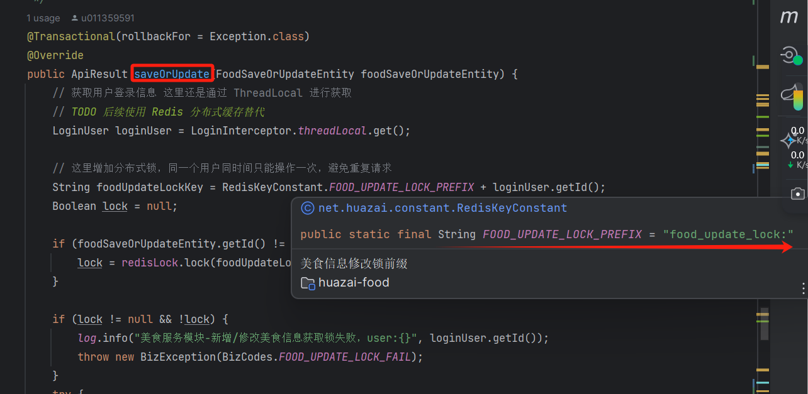

  
从数据库读数据时带上一个「**过期时间**」的加锁：

  
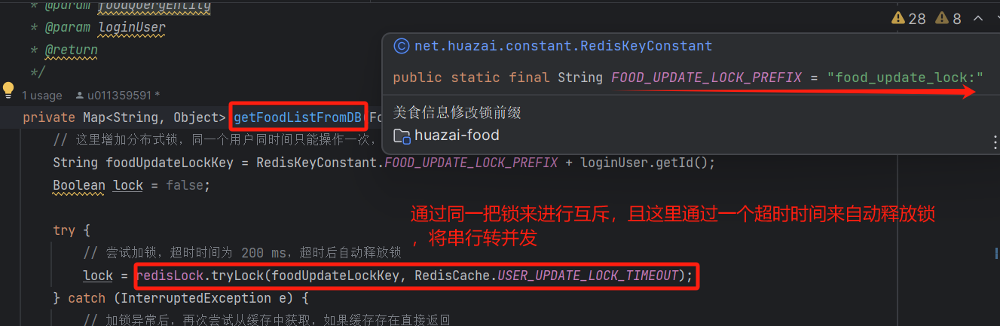

在消费者监听中通过「**阻塞加锁**」这样的方式来保证高并发下缓存+数据库双写一致性解决方案。

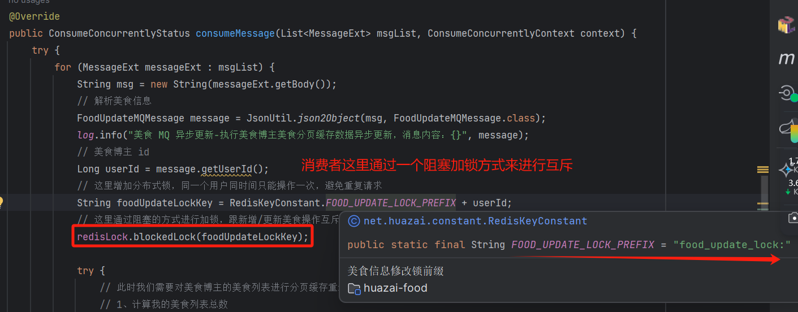

我们再来分析下，通过以上方式如何解决高并发场景下缓存+数据库双写一致性的。

其实就是看哪个操作先拿到「**这把分布式锁**」，还是上面的两个线程：

1.  假设 [线程 B](http://xn--%20b-980k56u/) 先拿到分布式锁进行了「**读取我的美食分页信息**」的操作， [线程 A](http://xn--%20a-980k56u/) 「**修改美食信息**」操作被阻塞住了，加锁失败，前端会进行重试，此时 [线程 B](http://xn--%20b-980k56u/) 从「**缓存**」中并没有对应的数据，就会从「**数据库**」进行读取美食分页数据并设置「**美食分页缓存**」，此时 「**缓存**」和 「**数据库**」可能都是旧数据，因为 [线程 A](http://xn--%20a-980k56u/) 还没有进行 「**发布/修改美食信息**」的操作，最终 [线程 B](http://xn--%20b-980k56u/) 返回旧数据并释放锁。
2.  那么当 [线程 A](http://xn--%20a-980k56u/) 拿到分布式锁进行了「**修改美食信息**」的操作，此时 [线程 A](http://xn--%20a-980k56u/) 将用户信息进行了「**数据库**」和 「**美食基础信息缓存**」以及「**发布美食变更事件**」然后释放锁，在「**消费者端**」同样也会加「**同一把分布式锁**」来进行缓存构建，首先「**数据库**」是新发布/更新的数据，「**缓存**」中是旧的美食分页信息，那么很快「**消费者端**」会把最新的数据更新到「**缓存**」中并释放锁，最终「**数据库**」和 「**缓存**」数据一致了。

  
通过上面的剖析是不是就解决了「**数据库**」和 「**缓存**」双写不一致的问题，至此「**我的美食分页缓存**」的整个设计就到此结束了。

##   
**2.3 美食详情数据缓存设计**

最后我们再来看下「**美食详情**」的缓存设计，其实这部分跟「**用户信息缓存**」基本类似。

这里就不展开分析，具体可以参考[【电商实战项目第十四篇】华仔电商实战项目用户微服务模块高并发场景下用户缓存架构演进设计与开发](https://articles.zsxq.com/id_h24gcw75o028.html)

主要解决了「**缓存惊群、穿透问题**」、「**基于分布式锁解决缓存+数据库一致性问题**」这两个重要问题，以及「**极端情况下进行double check**」来保证尽可能地从缓存中读取数据。

/\*\*

\* 获取美食信息

\* @param foodId

\* @return

\*/

@Override

public FoodVO getFoodInfo(Long foodId) {

log.info("美食模块-从数据库获取美食信息，foodId:{}", foodId);

FoodDO foodDO \= new FoodDO();

// 先从缓存中获取美食信息

foodDO = getFoodInfoFromCache(foodId);

// 缓存为空

if (foodDO == null) {

// 从数据库中获取美食信息

foodDO = getFoodInfoFromDB(foodId);

// 如果为空，则返回空

if (foodDO == null) {

return null;

}

}

// 这里我们返回 foodVO 的信息, 需要通过拷贝 foodDO 到 foodVO 中

FoodVO foodVO \= new FoodVO();

if (foodVO.getFoodCateTag() != null) {

// 设置美食分类

foodVO.setFoodCateTag(FoodCateTag.getByTag(foodDO.getFoodCateTag()).getTagValue());

}

if (foodVO.getFoodDifficulty() != null) {

// 设置美食制作难度

foodVO.setFoodDifficulty(FoodDifficulty.getByDifficulty(foodDO.getFoodDifficulty()).getDifficultyValue());

}

if (foodVO.getFoodTime() != null) {

// 设置美食制作时长

foodVO.setFoodTime(FoodTime.getByTime(foodDO.getFoodTime()).getTimeValue());

}

if (StringUtils.isNotBlank(foodDO.getFoodDetail())) {

// 设置美食详情

List<FoodStepDetailEntity> stepDetails = JsonUtil.StringtoList(foodDO.getFoodDetail(), FoodStepDetailEntity.class);

foodVO.setFoodDetail(stepDetails);

}

if (StringUtils.isNotBlank(foodDO.getFoodList())) {

// 设置美食清单

List<FoodListEntity> foodList = JsonUtil.StringtoList(foodDO.getFoodList(), FoodListEntity.class);

foodVO.setFoodList(foodList);

}

if (StringUtils.isNotBlank(foodDO.getFoodSkuids())) {

// TODO 商品信息关联

List<Long> skuIds = JsonUtil.jsonToLongList(foodDO.getFoodSkuids());

// 设置美食关联商品id

foodVO.setSkuIds(skuIds);

}

BeanUtils.copyProperties(foodDO, foodVO);

return foodVO;

}

/\*\*

\* 从缓存中读取美食详情信息

\* @param foodId

\* @return

\*/

private FoodDO getFoodInfoFromCache(Long foodId) {

String foodKey \= RedisKeyConstant.FOOD\_INFO\_PREFIX + foodId;

// 从缓存中获取数据

String foodValue \= redisCache.get(foodKey);

log.info("美食模块-从缓存获取美食信息，foodKey:{}，foodValue:{}", foodKey, foodValue);

if (org.springframework.util.StringUtils.hasLength(foodValue)) {

// 当读到空数据时返回空，防止缓存穿透，直接返回null

if (Objects.equals(redisCache.EMPTY\_CACHE, foodValue)) {

return null;

}

// 否则读取到缓存后，转换成对象之后返回

FoodDO foodDO \= JsonUtil.json2Object(foodValue, FoodDO.class);

// 设置延期

Long expire \= redisCache.getExpire(foodKey, TimeUnit.SECONDS);

// 如果过期时间已经在 1 小时内了就自动延期

if (expire < RedisCache.ONE\_HOURS\_SECONDS) {

// 缓存精准自动延期 2天 + 随机几个小时

redisCache.expire(foodKey, RedisCache.generateCacheExpire());

}

return foodDO;

}

return null;

}

/\*\*

\* 从数据库中读取美食详情信息

\* @param foodId

\* @return

\*/

private FoodDO getFoodInfoFromDB(Long foodId) {

LoginUser loginUser \= LoginInterceptor.threadLocal.get();

// 这里增加分布式锁进行互斥，同时间只能一个用户成功，避免重复请求

String foodUpdateLockKey \= RedisKeyConstant.FOOD\_UPDATE\_LOCK\_PREFIX + loginUser.getId();

boolean lock \= false;

try {

// 尝试加锁，超时时间为 200 ms，超时后自动释放锁

lock = redisLock.tryLock(foodUpdateLockKey, RedisCache.USER\_UPDATE\_LOCK\_TIMEOUT);

} catch (InterruptedException e) {

// 加锁异常后，再次尝试从缓存中获取，如果缓存存在直接返回

FoodDO foodDO \= getFoodInfoFromCache(foodId);

if (foodDO != null) {

return foodDO;

}

log.error("美食模块-从数据库获取美食详情尝试加锁异常，异常信息：{}，异常栈信息：{}", e.getMessage(), e);

throw new BizException(BizCodes.FOOD\_INFO\_LOCK\_FAIL);

}

// 加锁失败

if (!lock) {

// 加锁异常后，再次尝试从缓存中获取，如果缓存存在直接返回

FoodDO foodDO \= getFoodInfoFromCache(foodId);

if (foodDO != null) {

return foodDO;

}

log.info("美食模块-美食详情缓存为空，从数据库获取美食详情数据获取锁失败，foodId:{}，user:{}", foodId, loginUser.getId());

throw new BizException(BizCodes.FOOD\_INFO\_LOCK\_FAIL);

}

try {

// 极端情况下: 查数据库前再次尝试从缓存中获取，如果缓存存在直接返回

FoodDO foodDO \= getFoodInfoFromCache(foodId);

if (foodDO != null) {

return foodDO;

}

log.info("美食模块-美食缓存详情为空，从数据库获取美食信息，foodId:{}，user:{}", foodId, loginUser.getId());

// 从数据库中获取美食详情

FoodDO dto \= foodMapper.selectOne(new QueryWrapper<FoodDO>().eq("id", foodId));

// 美食详情缓存 key

String foodKey \= RedisKeyConstant.FOOD\_INFO\_PREFIX + foodId;

// 如果从数据库中读取为空数据

if (Objects.isNull(dto)) {

// 设置一个空数据到缓存，过期时间为穿透的过期时间，30~100秒

redisCache.setCache(foodKey, redisCache.EMPTY\_CACHE, RedisCache.generateCachePenetrationExpire());

return null;

}

// 写入缓存，缓存过期时间 2天 + 随机几小时

redisCache.setCache(foodKey, dto, RedisCache.generateCacheExpire());

return dto;

} finally {

// 释放锁

redisLock.unlock(foodUpdateLockKey);

}

}