大家好，我是**华仔**, 又跟大家见面了。

从今天之后的一段时间内，华仔会带着大家一起从零开始搭建并研发一套高并发的电商实战项目，这里会涉及到很多互联网大厂开发过程中所使用的核心技术和架构设计模式，希望大家学完之后可以用到自己的简历中。

这是第十三篇，本篇我们进行电商实战项目用户微服务模块用户收货地址模块开发，今天的内容比较简单，就是增删改查。

文章汇总位置：[https://wx.zsxq.com/dweb2/index/columns/51122554151214](https://wx.zsxq.com/dweb2/index/columns/51122554151214)

源码授权与获取地址：[https://articles.zsxq.com/id\_1s85grnaae4p.html](https://articles.zsxq.com/id_1s85grnaae4p.html)

本章源码地址：[https://gitcode.net/u011359591/huazai-ecshop/-/tree/ecshop-chapter-13](https://gitcode.net/u011359591/huazai-ecshop/-/tree/ecshop-chapter-13)

## **01 前言**

终于要设计与研发电商项目代码了，今天我们要对用户微服务模块用户收货地址模块开发。

这里需要注意下，我们整个项目目前是不提供前端的，这个后续有时间在搞，主要是进行后端接口以及微服务模块架构设计。

## **02 用户收货地址模块**

这里主要是对用户收货地址进行管理，主要有添加，修改，删除，查询收货地址，还是拿淘宝为例。

## **2.1 查询用户收货地址**

如图例：

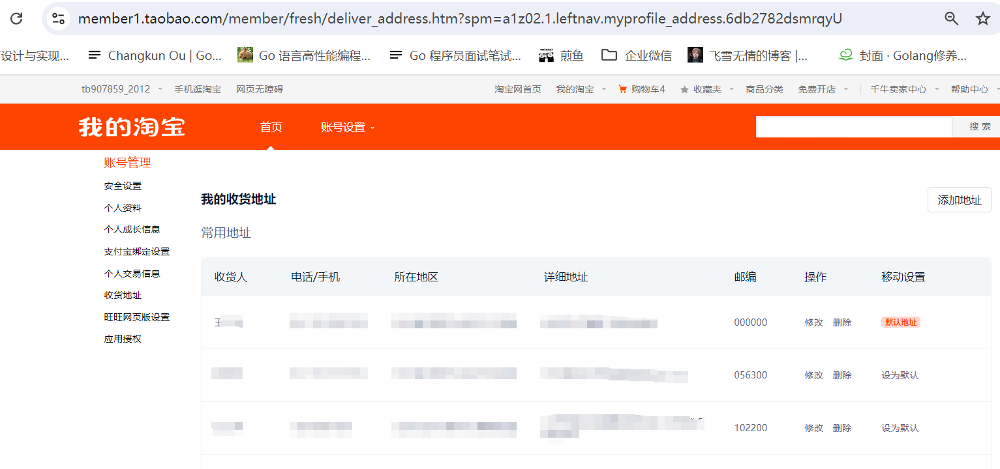

### **2.1.1 查询收货地址控制器接口**

一个是根据据id查找指定收货地址，一个是查找当前用户的所有收货地址。

/\*\*

\* 根据id查找收货地址

\* @param addressId

\* @return

\*/

@ApiOperation("根据id查找收货地址")

@GetMapping("detail/{address\_id}")

public Object findDetail(@ApiParam(value = "收货地址id", required = true)

@PathVariable("address\_id") Long addressId) {

UserAddressVO userAddressVo \= userAddressService.detail(addressId);

return userAddressVo \=\= null ? ApiResult.doResult(BizCodes.USER\_ADDRESS\_NOT\_EXITS) : ApiResult.doSuccess(userAddressVo);

}

/\*\*

\* 查询用户全部收货地址

\* @return

\*/

@ApiOperation("查询用户全部收货地址")

@GetMapping("list")

public ApiResult findAllAddress() {

List<UserAddressVO> list = userAddressService.findAllAddress();

return ApiResult.doSuccess(list);

}

### **2.1.2 查找收货地址服务**

/\*\*

\* 根据id查找收货地址

\* @param addressId

\* @return

\*/

@Override

public UserAddressVO detail(Long addressId) {

UserAddressDO userAddressDO \= userAddressMapper.selectOne(new QueryWrapper<UserAddressDO>().eq("id", addressId));

// 如果为空，则返回空

if (userAddressDO == null) {

return null;

}

UserAddressVO userAddressVO \= new UserAddressVO();

BeanUtils.copyProperties(userAddressDO, userAddressVO);

return userAddressVO;

}

/\*\*

\* 查询用户全部收货地址

\* @return

\*/

@Override

public List<UserAddressVO> findAllAddress() {

LoginUser loginUser \= LoginInterceptor.threadLocal.get();

// 查找当前用户的所有的收货地址

List<UserAddressDO> list = userAddressMapper.selectList(new QueryWrapper<UserAddressDO>().eq("user\_id", loginUser.getId()));

// 对象流式转换

List<UserAddressVO> addressVOList = list.stream().map(obj->{

UserAddressVO userAddressVO \= new UserAddressVO();

BeanUtils.copyProperties(obj, userAddressVO);

return userAddressVO;

}).collect(Collectors.toList());

return addressVOList;

}

启动后测试效果:

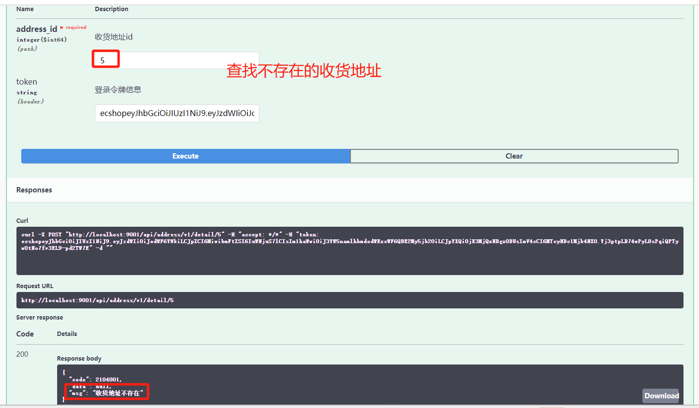

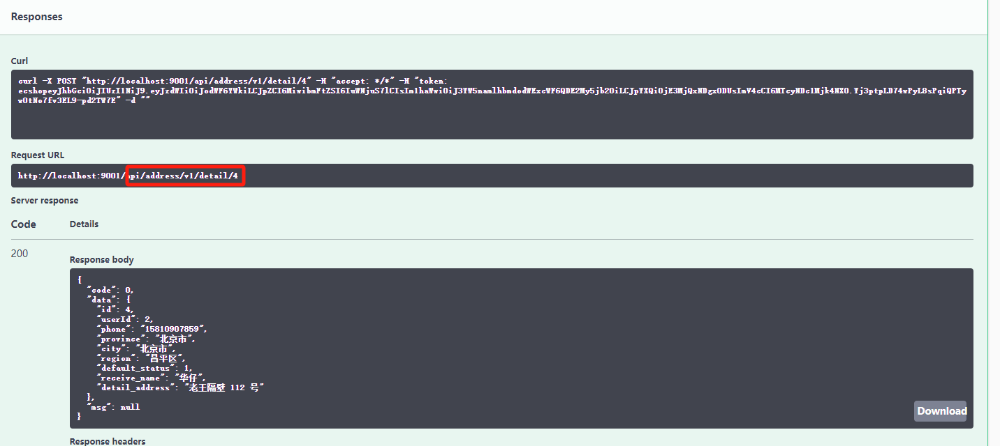

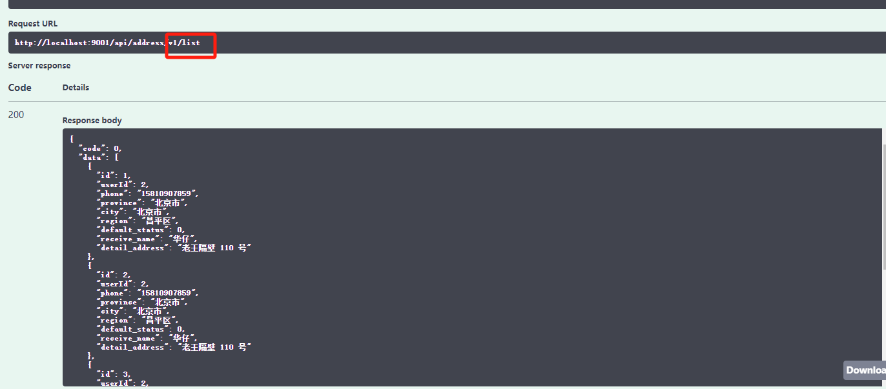

## **2.2 添加用户收货地址**

如图例：

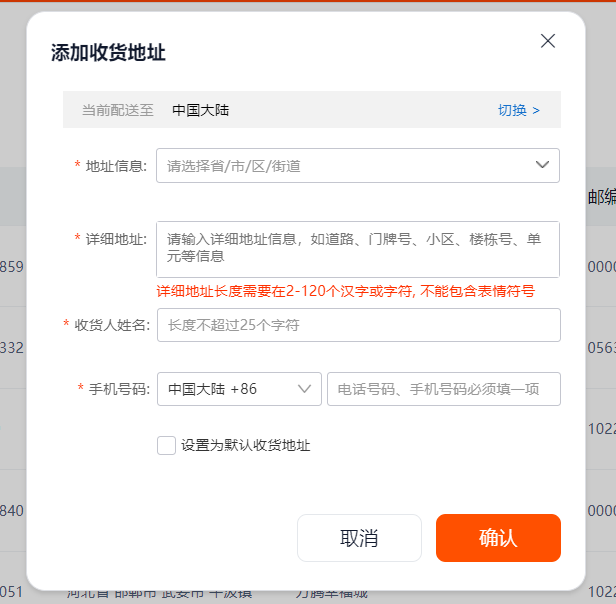

### **2.2.1 添加收货地址控制器接口**

@ApiOperation("新增收货地址")

@PostMapping("add")

public ApiResult add(@ApiParam("收货地址对象") @RequestBody AddressAddEntity addressAddEntity) {

userAddressService.add(addressAddEntity);

return ApiResult.doSuccess();

}

### **2.2.2 添加收货地址请求实体**

package net.huazai.entity;

import com.fasterxml.jackson.annotation.JsonProperty;

import io.swagger.annotations.ApiModel;

import io.swagger.annotations.ApiModelProperty;

import lombok.Data;

import lombok.extern.slf4j.Slf4j;

/\*\*

\* @className: AddressAddEntity

\* @author: huazai，该项目是知识星球：华仔和他的朋友们 的内部项目

\* @date: 2024-08-20 22:00

\* @Version: 1.0

\* @description:

\*/

@Data

@ApiModel(value = "新增收货地址对象", description = "新增收货地址对象")

@Slf4j

public class AddressAddEntity {

/\*\*

\* 是否默认收货地址：0否 1是

\*/

@ApiModelProperty(value = "是否默认收货地址：0否 1是", example = "0")

@JsonProperty("default\_status")

private Integer defaultStatus;

/\*\*

\* 收发货人姓名

\*/

@ApiModelProperty(value = "收发货人姓名", example = "华仔")

@JsonProperty("receive\_name")

private String receiveName;

/\*\*

\* 收货人电话

\*/

@ApiModelProperty(value = "收货人电话", example = "15810907859")

private String phone;

/\*\*

\* 省/直辖市

\*/

@ApiModelProperty(value = "省/直辖市", example = "北京市")

private String province;

/\*\*

\* 市

\*/

@ApiModelProperty(value = "市", example = "北京市")

private String city;

/\*\*

\* 区

\*/

@ApiModelProperty(value = "区", example = "昌平区")

private String region;

/\*\*

\* 详细地址

\*/

@ApiModelProperty(value = "详细地址", example = "老王隔壁 110 号")

@JsonProperty("detail\_address")

private String detailAddress;

}

### **2.2.3 添加收货地址服务**

/\*\*

\* 添加收货地址

\* @param addressAddEntity

\*/

@Override

public void add(AddressAddEntity addressAddEntity) {

// 获取用户登录信息 这里还是通过 ThreadLocal 进行获取

LoginUser loginUser \= LoginInterceptor.threadLocal.get();

UserAddressDO userAddressDO \= new UserAddressDO();

// 用户id

userAddressDO.setUserId(loginUser.getId());

userAddressDO.setCreateTime(new Date());

userAddressDO.setUpdateTime(new Date());

// 拷贝请求到 DO 对象中

BeanUtils.copyProperties(addressAddEntity, userAddressDO);

// 判断是否是默认的收货地址

if (userAddressDO.getDefaultStatus() == 1) {

// 这里需要查询是否有默认收货地址

UserAddressDO defaultUserAddressDO \= userAddressMapper.selectOne(new QueryWrapper<UserAddressDO>()

.eq("user\_id", loginUser.getId())

.eq("default\_status", AddressStatus.DEFAULT\_STATUS.getStatus()));

if (defaultUserAddressDO != null) {

// 设置为非默认

defaultUserAddressDO.setDefaultStatus(AddressStatus.NORMAL\_STATUS.getStatus());

// 修改原先默认收货地址为非默认

userAddressMapper.update(defaultUserAddressDO,

new QueryWrapper<UserAddressDO>().eq("id", defaultUserAddressDO.getId()));

}

}

// 新增收货地址

int rows \= userAddressMapper.insert(userAddressDO);

log.info("用户收货地址模块-新增收货地址：rows={}，data={}", rows, userAddressDO);

}

启动后测试效果：

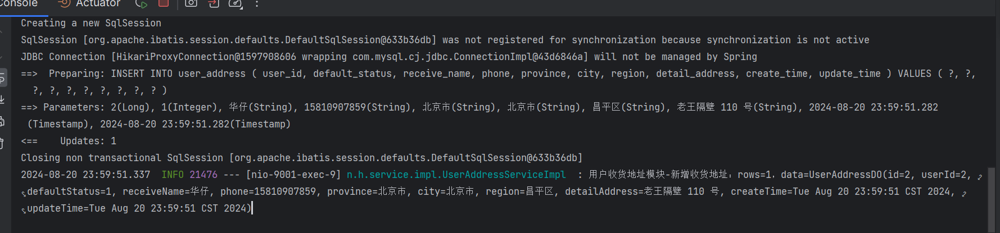

id = 1 非默认收货地址，id = 2 默认收货地址。

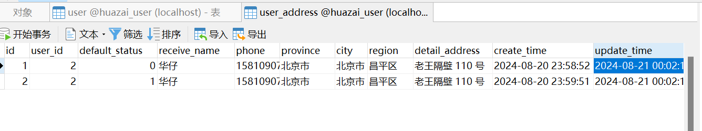

再来一条默认收货地址，id = 2 改为非默认收货地址，id= 3 为默认收货地址。

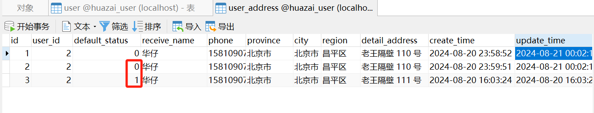

## **2.3 修改指定收货地址**

如图例：

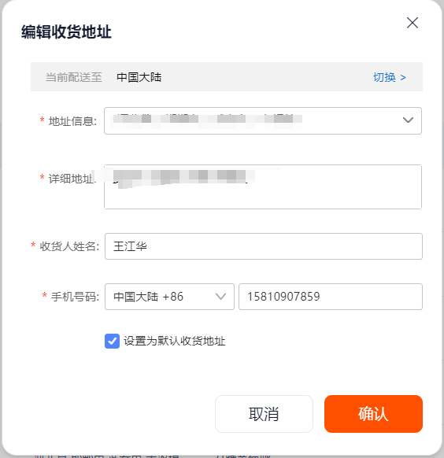

### **2.3.1 修改收货地址控制器接口**

/\*\*

\* 修改指定收货地址

\* @param addressEditEntity

\* @return

\*/

@ApiOperation("修改指定收货地址")

@PostMapping("edit")

public ApiResult edit(@ApiParam("收货地址对象") @RequestBody AddressEditEntity addressEditEntity) {

userAddressService.edit(addressEditEntity);

return ApiResult.doSuccess();

}

### **2.3.2 修改收货地址请求实体**

这里的实体对象跟添加类似，只不过多了一个 id。

package net.huazai.entity;

import com.fasterxml.jackson.annotation.JsonProperty;

import io.swagger.annotations.ApiModel;

import io.swagger.annotations.ApiModelProperty;

import lombok.Data;

import lombok.extern.slf4j.Slf4j;

/\*\*

\* @className: AddressAddEntity

\* @author: huazai，该项目是知识星球：华仔和他的朋友们 的内部项目

\* @date: 2024-08-20 22:00

\* @Version: 1.0

\* @description:

\*/

@Data

@ApiModel(value = "修改收货地址对象", description = "修改收货地址对象")

@Slf4j

public class AddressEditEntity {

/\*\*

\* 收货地址id

\*/

@ApiModelProperty(value = "地址id", example = "1")

private Long id;

/\*\*

\* 是否默认收货地址：0否 1是

\*/

@ApiModelProperty(value = "是否默认收货地址：0否 1是", example = "0")

@JsonProperty("default\_status")

private Integer defaultStatus;

/\*\*

\* 收发货人姓名

\*/

@ApiModelProperty(value = "收发货人姓名", example = "华仔")

@JsonProperty("receive\_name")

private String receiveName;

/\*\*

\* 收货人电话

\*/

@ApiModelProperty(value = "收货人电话", example = "15810907859")

private String phone;

/\*\*

\* 省/直辖市

\*/

@ApiModelProperty(value = "省/直辖市", example = "北京市")

private String province;

/\*\*

\* 市

\*/

@ApiModelProperty(value = "市", example = "北京市")

private String city;

/\*\*

\* 区

\*/

@ApiModelProperty(value = "区", example = "昌平区")

private String region;

/\*\*

\* 详细地址

\*/

@ApiModelProperty(value = "详细地址", example = "老王隔壁 110 号")

@JsonProperty("detail\_address")

private String detailAddress;

}

### **2.3.2 修改收货地址服务**

/\*\*

\* 修改指定收货地址

\* @param addressEditEntity

\*/

@Override

public void edit(AddressEditEntity addressEditEntity) {

// 获取用户登录信息 这里还是通过 ThreadLocal 进行获取

LoginUser loginUser \= LoginInterceptor.threadLocal.get();

UserAddressDO userAddressDO \= new UserAddressDO();

// 用户id

userAddressDO.setUserId(loginUser.getId());

// 重新设置修改时间

userAddressDO.setUpdateTime(new Date());

// 拷贝请求到 DO 对象中

BeanUtils.copyProperties(addressEditEntity, userAddressDO);

// 判断是否是默认的收货地址

if (userAddressDO.getDefaultStatus() == 1) {

// 这里需要查询是否有默认收货地址

UserAddressDO defaultUserAddressDO \= userAddressMapper.selectOne(new QueryWrapper<UserAddressDO>()

.eq("user\_id", loginUser.getId())

.eq("default\_status", AddressStatus.DEFAULT\_STATUS.getStatus()));

if (defaultUserAddressDO != null) {

// 设置为非默认

defaultUserAddressDO.setDefaultStatus(AddressStatus.NORMAL\_STATUS.getStatus());

// 修改原先默认收货地址为非默认

userAddressMapper.update(defaultUserAddressDO,

new QueryWrapper<UserAddressDO>().eq("id", defaultUserAddressDO.getId()));

log.info("用户收货地址模块-修改收货地址：default={}", defaultUserAddressDO);

}

}

// 新增收货地址

int rows \= userAddressMapper.update(userAddressDO, new QueryWrapper<UserAddressDO>().eq("id", userAddressDO.getId()));

log.info("用户收货地址模块-修改收货地址：rows={}，data={}", rows, userAddressDO);

}

启动后测试效果：

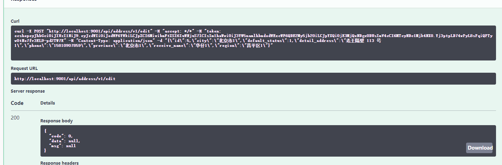

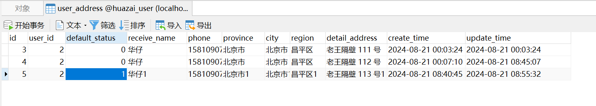

## **2.4 删除指定收货地址**

如图例：

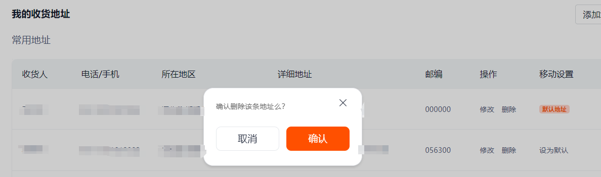

### **2.4.1 删除收货地址控制器接口**

/\*\*

\* 删除指定收货地址

\* @param addressId

\* @return

\*/

@ApiOperation("删除指定收货地址")

@DeleteMapping("del/{address\_id}")

public ApiResult del(@ApiParam(value = "收货地址id", required = true)

@PathVariable("address\_id") Long addressId) {

int del \= userAddressService.del(addressId);

return del \=\= 1 ? ApiResult.doSuccess() : ApiResult.doResult(BizCodes.USER\_ADDRESS\_DEL\_FAIL);

}

### **2.4.2 删除收货地址服务**

/\*\*

\* 删除指定收货地址

\* @param addressId

\* @return

\*/

@Override

public int del(Long addressId) {

int rows \= userAddressMapper.delete(new QueryWrapper<UserAddressDO>().eq("id", addressId));

return rows;

}

启动后测试效果：

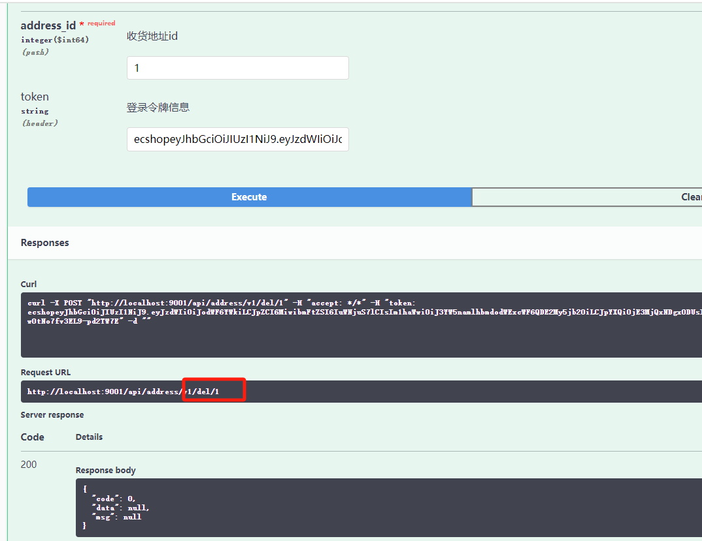

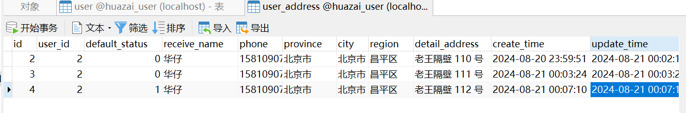