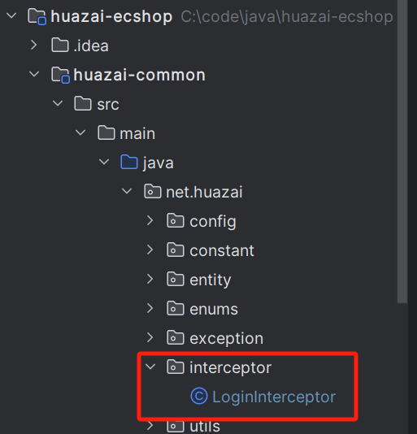
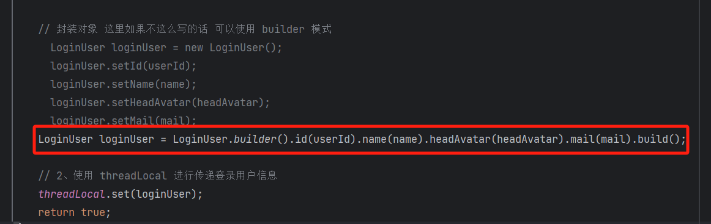
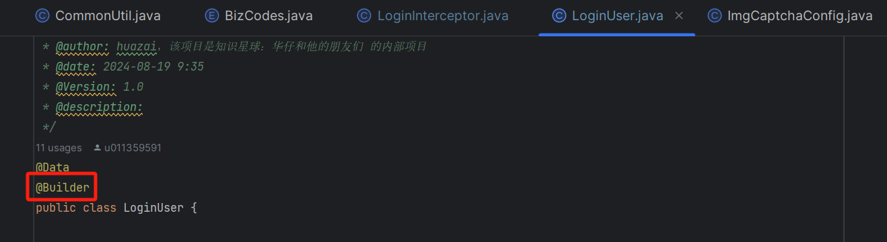
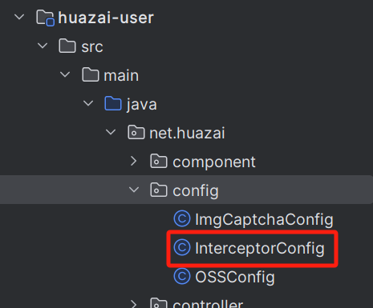
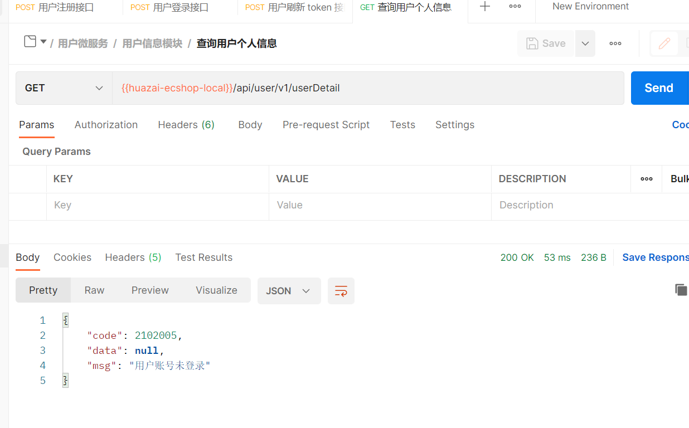
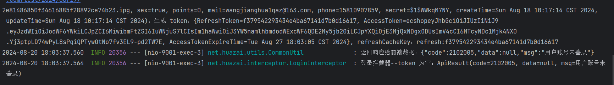
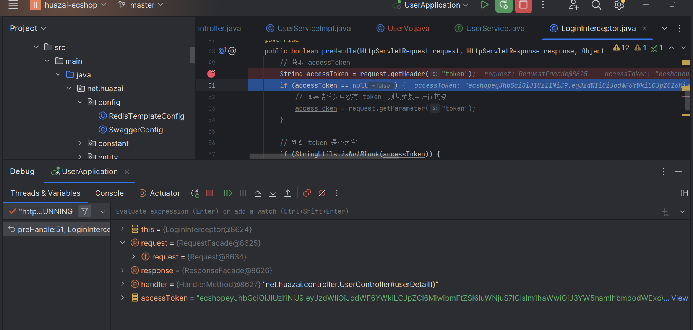
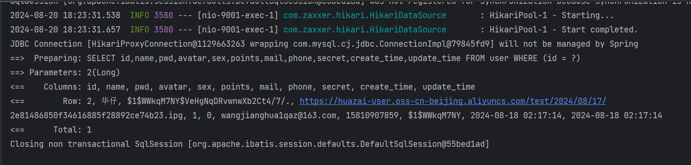
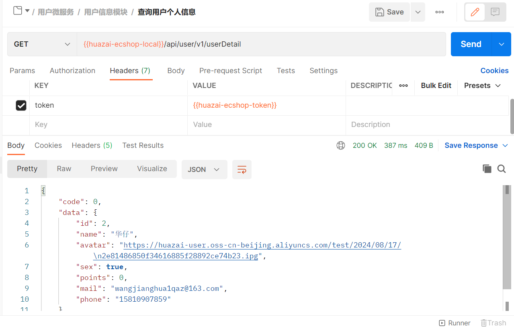
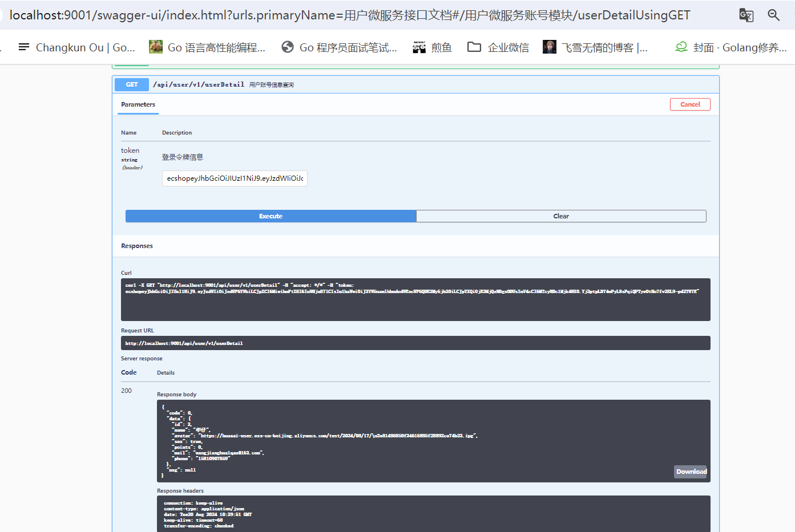

大家好，我是**华仔**, 又跟大家见面了。

从今天之后的一段时间内，华仔会带着大家一起从零开始搭建并研发一套高并发的电商实战项目，这里会涉及到很多互联网大厂开发过程中所使用的核心技术和架构设计模式，希望大家学完之后可以用到自己的简历中。

这是第十一篇，本篇我们进行电商实战项目用户微服务模块用户登录拦截器解决方案。

文章汇总位置：[https://wx.zsxq.com/dweb2/index/columns/51122554151214](https://wx.zsxq.com/dweb2/index/columns/51122554151214)

源码授权与获取地址：[https://articles.zsxq.com/id\_1s85grnaae4p.html](https://articles.zsxq.com/id_1s85grnaae4p.html)

本章源码地址：[https://gitcode.net/u011359591/huazai-ecshop/-/tree/ecshop-chapter-1](https://gitcode.net/u011359591/huazai-ecshop/-/tree/ecshop-chapter-11)2

## **01 前言**

终于要设计与研发电商项目代码了，今天我们要对用户微服务模块用户登录拦截器解决方案。

这里需要注意下，我们整个项目目前是不提供前端的，这个后续有时间在搞，主要是进行后端接口以及微服务模块架构设计。

## **02 用户登录拦截器**

我们先来开发登录拦截器。

## **2.1 登录拦截器**

因为拦截器是每个微服务都要用的，所以我们要在 Common 项目中添加拦截器：

package net.huazai.interceptor;

import io.jsonwebtoken.Claims;

import lombok.extern.slf4j.Slf4j;

import net.huazai.entity.LoginUser;

import net.huazai.enums.BizCodes;

import net.huazai.utils.ApiResult;

import net.huazai.utils.CommonUtil;

import net.huazai.utils.JWTUtil;

import org.apache.commons.lang3.StringUtils;

import org.springframework.web.servlet.HandlerInterceptor;

import org.springframework.web.servlet.ModelAndView;

import javax.servlet.http.HttpServletRequest;

import javax.servlet.http.HttpServletResponse;

/\*\*

\* @className: LoginInterceptor

\* @author: huazai，该项目是知识星球：华仔和他的朋友们 的内部项目

\* @date: 2024-08-19 22:32

\* @Version: 1.0

\* @description: 用户登录拦截器 快捷键 Ctrl + I 实现接口

\*/

@Slf4j

public class LoginInterceptor implements HandlerInterceptor {

/\*\*

\* 这里我们使用 ThreadLocal 传递用户 token 信息

\* 全称 thread local variable（线程局部变量）功用非常简单，使用场合主要解决多线程中数据因并发产生不一致问题。

\* ThreadLocal 为每一个线程都提供了变量的副本，使得每个线程在某时间访问到的并不是同一个对象，

\* 这样就隔离了多个线程对数据的数据共享，这样的结果是耗费了内存，但大大减少了线程同步所带来性能消耗，

\* 也减少了线程并发控制的复杂度。

\* 总结：同个线程共享数据，它可以用来每个线程内需要独立保存信息，方便同个线程的其他方法获取该信息的场景。

\*/

public static ThreadLocal<LoginUser> threadLocal = new ThreadLocal<>();

/\*\*

\* 登录拦截器

\* 1、解密JWT

\* 2、传递登录用户信息，这里我们使用 threadLocal 进行传递

\* @param request

\* @param response

\* @param handler

\* @return

\* @throws Exception

\*/

@Override

public boolean preHandle(HttpServletRequest request, HttpServletResponse response, Object handler) throws Exception {

// 获取 accessToken

String accessToken \= request.getHeader("token");

if (accessToken == null) {

// 如果请求头中没有 token，则从参数中进行获取

accessToken = request.getParameter("token");

}

// 判断 token 是否为空

if (StringUtils.isNotBlank(accessToken)) {

// 1、解密 token

Claims claims \= JWTUtil.checkJWT(accessToken);

if (claims == null) {

// 解密失败，登录过期，提示账号未登录

CommonUtil.sendResponse(response, ApiResult.doResult(BizCodes.USER\_ACCOUNT\_UNLOGIN));

log.info("登录拦截器--解密 token 失败：{}", ApiResult.doResult(BizCodes.USER\_ACCOUNT\_UNLOGIN));

return false;

}

// 解密成功，获取用户相关信息

long userId \= Long.valueOf(claims.get("id").toString());

String headAvatar \= (String) claims.get("head\_avatar");

String name \= (String) claims.get("name");

String mail \= (String) claims.get("mail");

// 封装对象

LoginUser loginUser \= new LoginUser();

loginUser.setId(userId);

loginUser.setName(name);

loginUser.setHeadAvatar(headAvatar);

loginUser.setMail(mail);

// 2、使用 threadLocal 进行传递登录用户信息

threadLocal.set(loginUser);

return true;

}

// token 为空，提示账号未登录

CommonUtil.sendResponse(response, ApiResult.doResult(BizCodes.USER\_ACCOUNT\_UNLOGIN));

log.info("登录拦截器--token 为空：{}", ApiResult.doResult(BizCodes.USER\_ACCOUNT\_UNLOGIN));

return false;

}

@Override

public void postHandle(HttpServletRequest request, HttpServletResponse response, Object handler, ModelAndView modelAndView) throws Exception {

HandlerInterceptor.super.postHandle(request, response, handler, modelAndView);

}

@Override

public void afterCompletion(HttpServletRequest request, HttpServletResponse response, Object handler, Exception ex) throws Exception {

HandlerInterceptor.super.afterCompletion(request, response, handler, ex);

}

}

这里我们重点重写 [HandlerInterceptor](http://handlerinterceptor%20/) 类的 [preHandle](http://prehandle%20/) 方法，步骤如下：

1.  获取 [accessToken](http://accesstoken/)，先从请求头中获取，没有再从请求参数中获取。
2.  如果 [accessToken](http://accesstoken/) 还为空，则提示账号未登录。
3.  否则解密 token，失败提示账号未登录。
4.  解密 token 成功，获取用户相关信息，封装 [loginUser](http://loginuser%20/) 对象。
5.  最后使用 [threadLocal](http://threadlocal%20/) 进行传递登录用户信息。

另外此处封装对象可以使用 Builder 建造者模式通过链式来构造。

拦截器的重点就是解密 JWT，然后传递登录用户信息，这里我们使用 [threadLocal](http://threadlocal/) 进行传递登录用户信息。

## **2.2 ThreadLocal 介绍**

关于 [threadLocal](http://threadlocal%20/) 可以看下三哥的这篇：[https://mp.weixin.qq.com/s/bavNRf9IgvcSSbdp1RcFrQ](https://mp.weixin.qq.com/s/bavNRf9IgvcSSbdp1RcFrQ)

简单总结就是：[ThreadLocal](http://threadlocal%20/) 用来每个线程内需要独立保存信息，方便同个线程的其他方法获取该信息的场景。即同个线程共享数据。

## **2.3 登录拦截配置**

最后我们来配置下拦截路径，这块每个服务配置自己单独的拦截配置，如下：

package net.huazai.config;

import lombok.extern.slf4j.Slf4j;

import net.huazai.interceptor.LoginInterceptor;

import org.springframework.context.annotation.Configuration;

import org.springframework.web.servlet.config.annotation.InterceptorRegistry;

import org.springframework.web.servlet.config.annotation.WebMvcConfigurer;

/\*\*

\* @className: InterceptorConfig

\* @author: huazai，该项目是知识星球：华仔和他的朋友们 的内部项目

\* @date: 2024-08-20 0:17

\* @Version: 1.0

\* @description:

\*/

@Configuration

@Slf4j

public class InterceptorConfig implements WebMvcConfigurer {

public LoginInterceptor loginInterceptor() {

return new LoginInterceptor();

}

@Override

public void addInterceptors(InterceptorRegistry registry) {

// 添加拦截器

registry.addInterceptor(loginInterceptor())

// 需要拦截的路径

.addPathPatterns("/api/user/\*/\*\*", "/api/address/\*/\*\*")

// 不需要拦截的路径

.excludePathPatterns("/api/user/\*/getImgCaptcha", "/api/user/\*/sendCode",

"/api/user/\*/register","/api/user/\*/login","/api/user/\*/upload");

}

}

启动测试效果如下：

## **2.4 个人信息查询**

最后我们来开发下个人信息查询接口，使用 [ThreadLocal](http://threadlocal%20/) 获取用户登录信息。

这块比较简单。

### **2.4.1 控制器接口**

@ApiOperation("用户账号信息查询")

@GetMapping("/userDetail")

public Object userDetail() {

UserVo userInfo \= userService.getUserDetail();

return ApiResult.doSuccess(userInfo);

}

### **2.4.2 查询个人信息**

/\*\*

\* 查询个人信息

\* @return

\*/

@Override

public UserVo getUserDetail() {

// 这里我们如何获取登录用户信息呢，前面我们通过 ThreadLocal 进行了用户信息的传递

LoginUser loginUser \= LoginInterceptor.threadLocal.get();

UserDO userDO \= userMapper.selectOne(new QueryWrapper<UserDO>().eq("id", loginUser.getId()));

// 这里我们返回 userVo 的信息, 需要通过拷贝 userDO 到 userVo 中

UserVo userVo \= new UserVo();

BeanUtils.copyProperties(userDO, userVo);

return userVo;

}

对应的 VO，这里可以直接从 DO 中拷贝进行删减。

package net.huazai.vo;

import lombok.Data;

/\*\*

\* @className: UserVo

\* @author: huazai，该项目是知识星球：华仔和他的朋友们 的内部项目

\* @date: 2024-08-20 17:24

\* @Version: 1.0

\* @description: 用来展示给前端的对象信息，这里不能直接暴漏 DO

\*/

@Data

public class UserVo {

private Long id;

/\*\*

\* 用户昵称

\*/

private String name;

/\*\*

\* 用户头像

\*/

private String avatar;

/\*\*

\* 0 女，1 男

\*/

private Boolean sex;

/\*\*

\* 用户积分

\*/

private Integer points;

/\*\*

\* 用户邮箱

\*/

private String mail;

/\*\*

\* 用户手机号

\*/

private String phone;

}

最后 [debug](http://debug%20/) 启动测试效果如下：

然后放行，看到去查询数据库了。

返回结果如下：

也可以通过 swagger UI 进行测试，效果如下：

