大家好，我是**华仔**, 又跟大家见面了。

从今天之后的一段时间内，华仔会带着大家一起从零开始搭建并研发一套高并发的电商实战项目，这里会涉及到很多互联网大厂开发过程中所使用的核心技术和架构设计模式，希望大家学完之后可以用到自己的简历中。

这是第十五篇，本篇我们将进行电商实战项目首页 feed 流设计与开发。

文章汇总位置：[https://wx.zsxq.com/dweb2/index/columns/51122554151214](https://wx.zsxq.com/dweb2/index/columns/51122554151214)

源码授权与获取地址：[https://articles.zsxq.com/id\_1s85grnaae4p.html](https://articles.zsxq.com/id_1s85grnaae4p.html)

本章源码地址：[https://gitcode.net/u011359591/huazai-ecshop/-/tree/ecshop-chapter-15](https://gitcode.net/u011359591/huazai-ecshop/-/tree/ecshop-chapter-15)

## **01 前言**

终于要设计与研发电商项目代码了，今天我们要对首页 feed 流架构设计与开发。

这里需要注意下，我们整个项目目前是不提供前端的，这个后续有时间在搞，主要是进行后端接口以及微服务模块架构设计。

## **02 首页 feed 流架构设计**

## **2.1 首页 feed 流架构设计方向**

在我们这套美食社区电商中，关于首页 feed 流的架构设计通常需要考虑以下方面：

1.  内容来源和类型： 首页 feed 流可能包括美食推荐、热门文章、热门视频、用户动态、广告推广等多种类型的内容。要考虑如何从不同来源的内容中筛选和排序，以确保首页 feed 流的多样性和吸引力。
2.  个性化推荐： 基于用户的兴趣和行为，设计个性化的内容推荐策略。可以考虑使用协同过滤、内容基于推荐、深度学习等技术，以提高用户对首页 feed 内容的兴趣度和点击率。
3.  实时性： 首页 feed 流中的内容需要具有一定的实时性，特别是热门话题和用户动态等内容，要及时更新和展示用户感兴趣的内容。
4.  流量控制： 对于不同类型的内容，可以考虑使用一些推荐策略和算法来控制流量，避免某一种类型的内容过于集中，保持首页 feed 流内容的平衡和多样性。
5.  广告投放： 如果首页 feed 流中包含广告内容，需要有一个合理的广告投放策略，确保广告内容的展示效果和用户体验的平衡。
6.  缓存和分发： 在高并发场景下，考虑采用缓存和分发技术，以提高首页 feed 流内容的加载速度和稳定性。

## **2.2 首页 feed 流推荐系统**

如何把用户留下，如何把这些数据存下来给到用户，根据用户画像（包括年龄、地域等标签）推荐给用户相关内容；涉及到大数据分析，如：分析哪个地域的人喜欢互联网，通过大数据分析得出结论，可以给这个地域的人推荐互联网的相关内容。

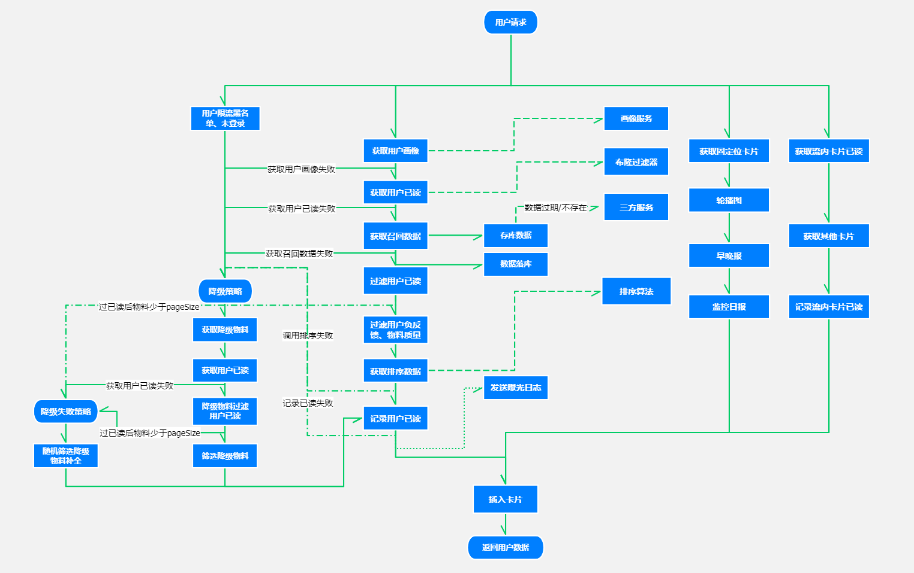

图片来自网络

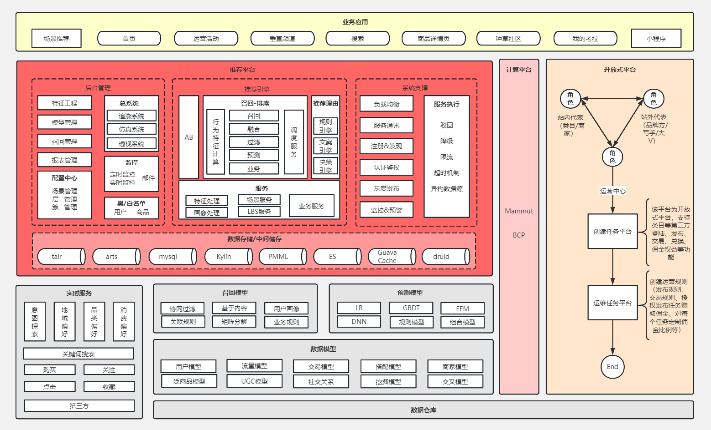

图片来自网络

目前我们首页只是简单的模拟下数据中台的「**推荐系统**」的实现，并使用缓存来实现这套 feed 流，后续等整个项目完结后，会抽时间搞一套数据中台，再来完善我们的 feed 流。

我们整套社区美食电商类似小红书，所以后续除了拥有电商的功能以外，还加入了社交相关的功能。

比如：「**关注服务架构设计**」、「**计数服务架构设计**」、「**评论系统架构设计**」等等。

接下来我们来看看如何开发第一版 feed 流。

## **03 首页 feed 流功能开发**

我们的 feed 流类似小红书美食这个分类，如下：

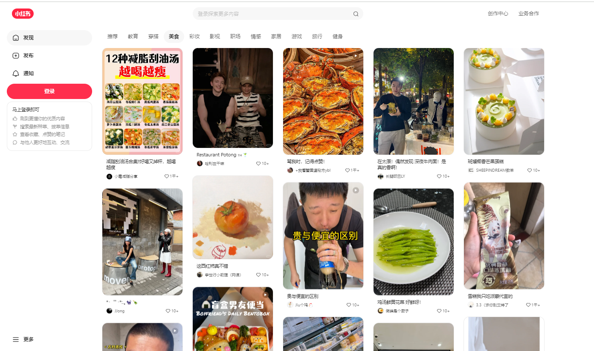

由于「**推荐系统**」实现起来比较复杂，我们第一版是通过模拟的方式来实现的，后续等搞「**推荐系统**」的时候再进行完善和改版。

##   
**3.1 添加首页 feed 工程**

同之前一样，这里我们新增一个首页 feed 工程，如下：

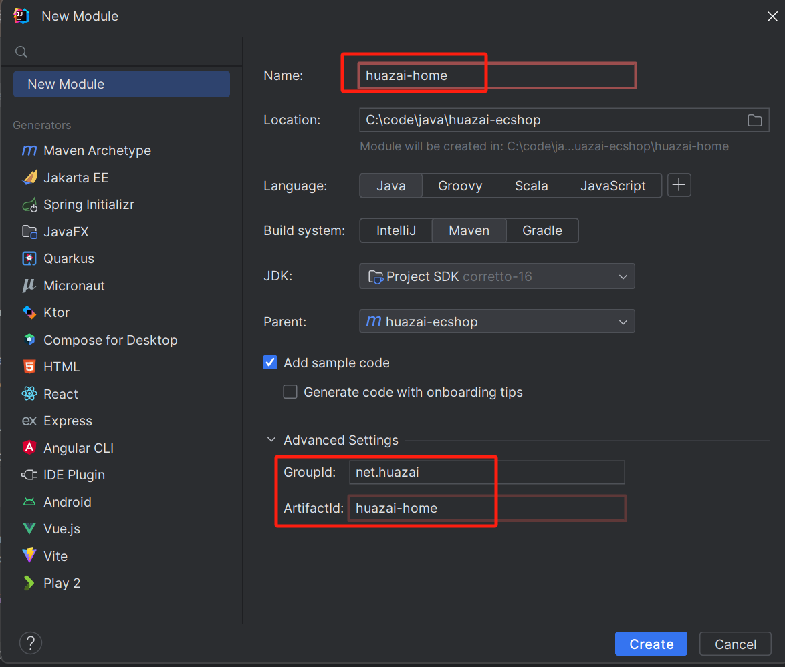

创建完就会聚合工程中自动添加 [huazai-home](http://huazai-home/) 的一个 module。

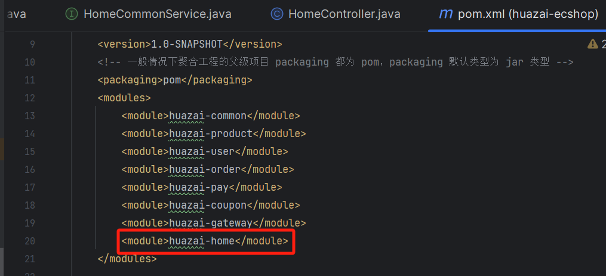

### **3.1.1 文件配置**

配置文件配置 [application.yml](http://application.yml/)，这里直接拷贝 [huazai-user](http://huazai-user/) 的，然后修改下启动端口，删除一些用不到的配置。

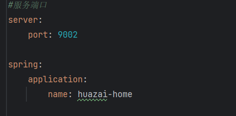

### **3.1.2 添加启动类注解**

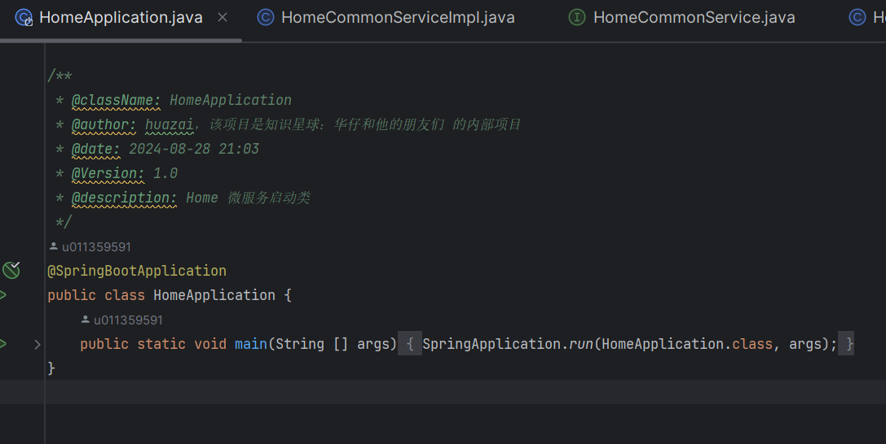

等这些基础步骤搞完后，就可以开发我们首页 feed 流功能了。

## **3.2 首页 feed 控制器**

package net.huazai.controller;

import io.swagger.annotations.Api;

import io.swagger.annotations.ApiOperation;

import io.swagger.annotations.ApiParam;

import lombok.extern.slf4j.Slf4j;

import net.huazai.constant.HomeConstant;

import net.huazai.entity.HomeFeedRequestEntity;

import net.huazai.entity.LoginUser;

import net.huazai.entity.RecipesRequestEntity;

import net.huazai.enums.BizCodes;

import net.huazai.interceptor.LoginInterceptor;

import net.huazai.service.HomeFeedService;

import net.huazai.utils.ApiResult;

import net.huazai.vo.RecipesListResultVO;

import org.springframework.beans.factory.annotation.Autowired;

import org.springframework.web.bind.annotation.\*;

import java.util.Objects;

/\*\*

\* 

\* 首页前端控制器

\* 

\*

\* @author huazai

\* @since 2024-08-28

\*/

@Api(tags = "首页 Feed 流微服务账号模块")

@Slf4j

@RestController

@RequestMapping("/api/home/v1/")

public class HomeController {

/\*\*

\* 注入首页 feed 服务

\*/

@Autowired

private HomeFeedService homeFeedService;

/\*\*

\* 首页 feed 流内容

\* @return

\*/

@ApiOperation("首页 feed 流信息")

@PostMapping("/feed")

public ApiResult feed(@ApiParam("feed 信息请求实体") @RequestBody HomeFeedRequestEntity homeFeedRequestEntity) {

log.info("首页 feed 流开始，homeFeedRequest：{}", homeFeedRequestEntity);

// 检测参数信息

if (Objects.isNull(homeFeedRequestEntity) || Objects.isNull(homeFeedRequestEntity.getPage())) {

return ApiResult.doResult(BizCodes.COMMON\_PARAM\_ERROR);

}

// 获取用户信息

// TODO 后续使用 Redis 分布式缓存替代

// LoginUser loginUser = LoginInterceptor.threadLocal.get();

// 封装请求参数

RecipesRequestEntity recipesRequestEntity \= new RecipesRequestEntity();

// recipesRequestEntity.setUserId(loginUser.getId());

recipesRequestEntity.setUserId(homeFeedRequestEntity.getUserId());

recipesRequestEntity.setPullRefresh(homeFeedRequestEntity.getPullRefresh());

recipesRequestEntity.setFeedVersion(homeFeedRequestEntity.getFeedVersion());

recipesRequestEntity.setPage(homeFeedRequestEntity.getPage());

recipesRequestEntity.setPageSize(HomeConstant.DEFAULT\_PAGE\_SIZE);

log.info("首页 feed 流开始获取，homeFeedRequest：{}，recipesRequestEntity：{}", homeFeedRequestEntity, recipesRequestEntity);

// 获取 feed 流信息

try {

RecipesListResultVO list \= homeFeedService.getHomeFeedRecipesList(recipesRequestEntity);

return ApiResult.doSuccess(list);

} catch (Exception e) {

log.error("首页 feed 流获取出现异常，homeFeedRequest：{}, error：{}", homeFeedRequestEntity, e);

}

// 服务异常

return ApiResult.doResult(BizCodes.COMMON\_SERVER\_ERROR);

}

/\*\*

\* 生成首页 feed 流内容

\* 这里先手动生成，等后续食谱微服务搞完就从哪里进行添加生成

\* @return

\*/

@ApiOperation("生成首页 feed 流信息")

@GetMapping("/gen\_feed")

public ApiResult generatorFeed()

{

return ApiResult.doSuccess(homeFeedService.generatorFeed());

}

}

从控制器可以看出，目前两个功能：

1.  获取首页 feed 流食谱信息。
2.  生成本地食谱缓存信息列表。

接下来我们分别来看下，先来看第二个，相对比较简单。

## **3.3 生成本地食谱缓存列表**

这里我们来设计下缓存的 key，由于食谱信息是一个列表，所以我们使用 [redis#hash](http://redis/#hash) 功能来实现。

另外首页如果「**某个用户**」命中推荐的话，会从「**推荐系统**」中读取（虽然这里我们是模拟），这里需要缓存一下用户命中的食谱 id 列表，所以我们使用 [redis#list](http://redis/#list) 功能来实现。

### **3.3.1 redis key 常量定义**

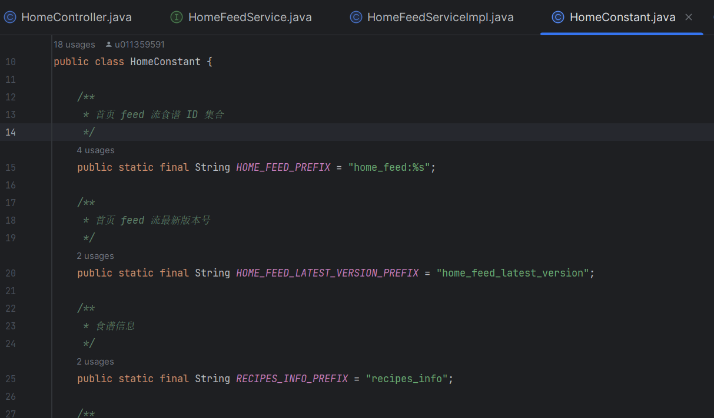

### **3.3.2 生成本地食谱缓存服务**

这里的 service，我们分为两部分：

1.  首页 feed 流功能部分：[HomeCommonServiceImpl](http://homecommonserviceimpl/)。
2.  模拟各类中台服务功能部分：[HomeCommonServiceImpl](http://homecommonserviceimpl/)。

@Service

@Slf4j

public class HomeFeedServiceImpl implements HomeFeedService {

/\*\*

\* 生成 feed 流食谱缓存信息

\* @return

\*/

@Override

public List<RecipesInfoEntity> generatorFeed() {

List<RecipesInfoEntity> list = homeCommonService.getFeedRecipes();

log.info("生成 feed 流信息：{}", list);

// 写入数据到缓存中

// 1、首页 feed 流中存储的食谱 ID 集合

String feedVersion \= String.valueOf(System.currentTimeMillis());

List<Long> recipesIdList = list.stream().map(RecipesInfoEntity::getId).collect(Collectors.toList());

redisCache.rPushAll(String.format(HomeConstant.HOME\_FEED\_PREFIX, feedVersion), recipesIdList.stream().map(Object::toString).toArray(String\[\]::new));

// 首页 feed 流最新版本号

redisCache.set(HomeConstant.HOME\_FEED\_LATEST\_VERSION\_PREFIX, feedVersion, 0);

// 2、首页食谱信息缓存

for (RecipesInfoEntity recipesInfoEntity : list) {

// 食谱缓存

redisCache.putIfAbsent(HomeConstant.RECIPES\_INFO\_PREFIX, String.valueOf(recipesInfoEntity.getId()), JSON.toJSONString(recipesInfoEntity));

}

return list;

}

}

@Service

@Slf4j

public class HomeCommonServiceImpl implements HomeCommonService {

@Override

public List<RecipesInfoEntity> getFeedRecipes() {

return feedRecipes;

}

}

/\*\*

\* @className: RecipesInfoEntity

\* @author: huazai，该项目是知识星球：华仔和他的朋友们 的内部项目

\* @date: 2024-08-28 22:23

\* @Version: 1.0

\* @description: 食谱信息实体

\*/

@Data

@AllArgsConstructor

@NoArgsConstructor

public class RecipesInfoEntity {

/\*\*

\* 食谱 ID

\*\*/

private Long id;

/\*\*

\* 食谱名称

\*\*/

private String recipesName;

/\*\*

\* 食谱图片

\*\*/

private String recipesUrl;

/\*\*

\* 食谱作者

\*\*/

private String recipesUserName;

/\*\*

\* 食谱作者头像

\*\*/

private String recipesUserAvatar;

/\*\*

\* 食谱描述

\*/

private String recipesDescription;

}

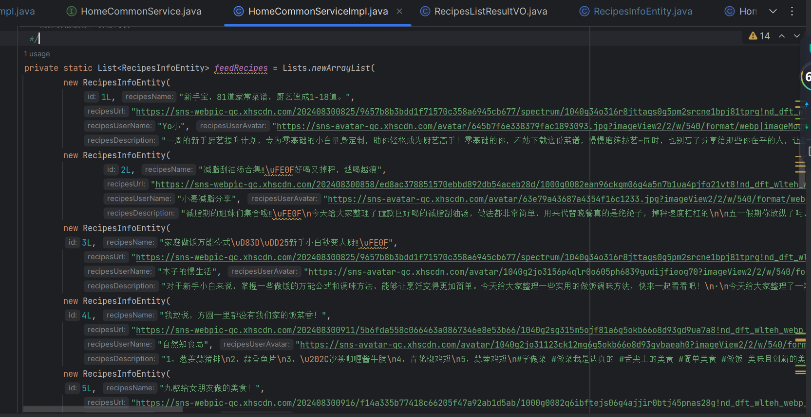

我们来看下直接结果，如下：

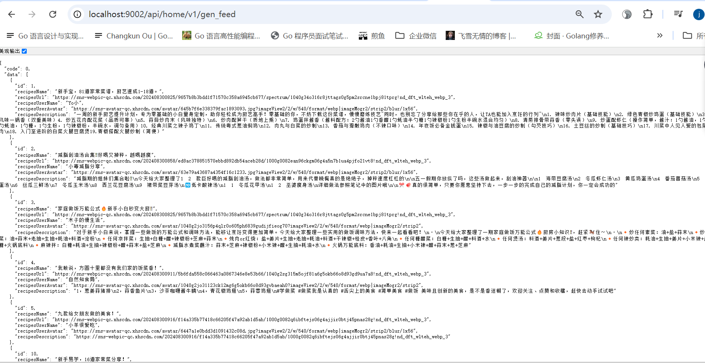

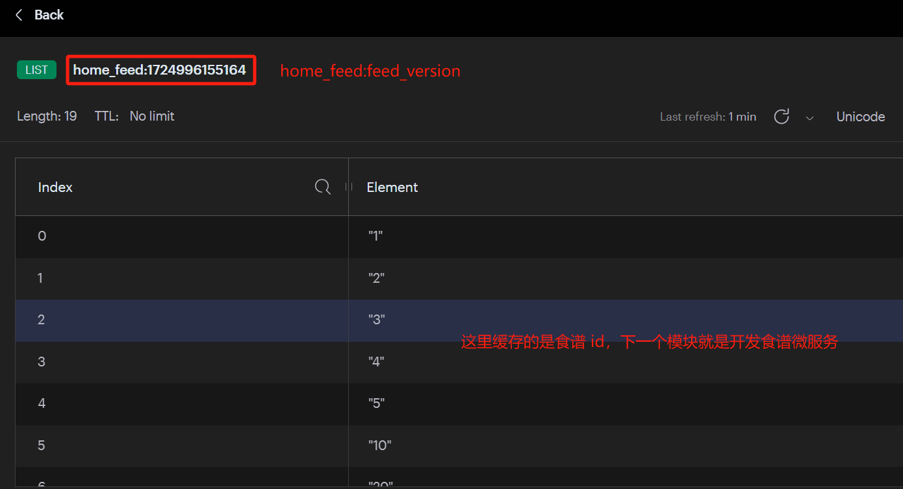

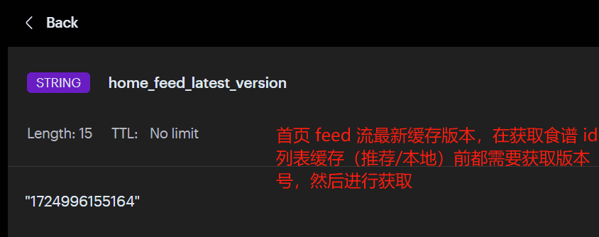

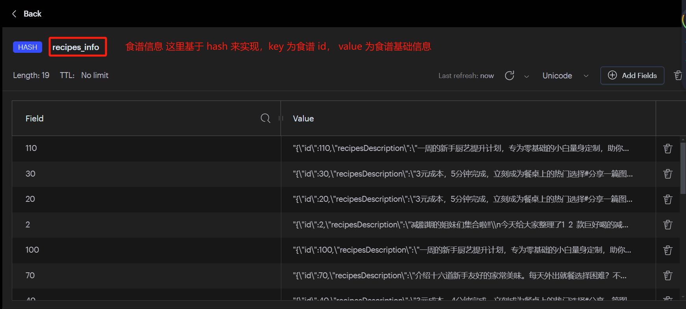

了解完整个缓存实现后，我们来看看第一版的首页 feed 流功能如何实现。

## **3.4 获取首页 feed 流食谱信息服务**

这里的 service，我们分为两部分：

1.  首页 feed 流功能部分：[HomeCommonServiceImpl](http://homecommonserviceimpl/)。
2.  模拟各类中台服务功能部分：[HomeCommonServiceImpl](http://homecommonserviceimpl/)。

@Service

@Slf4j

public class HomeFeedServiceImpl implements HomeFeedService {

@Autowired

private HomeCommonService homeCommonService;

@Autowired

private RedisCache redisCache;

/\*\*

\* 首页 feed 流核心处理逻辑

\* 1、根据用户 id 判断是否命中推荐

\* 2、命中推荐则走推荐内容，否则走本地缓存内容

\* @param recipesRequestEntity

\* @return

\*/

@Override

public RecipesListResultVO getHomeFeedRecipesList(RecipesRequestEntity recipesRequestEntity) {

RecipesListResultVO recipesListResultVO;

// 判断用户 id 是否命中推荐

Boolean isRecommendMatch \= homeCommonService.isMatchRecommend(recipesRequestEntity.getUserId());

if (isRecommendMatch) {

// 如果命中则获取推荐

recipesListResultVO = getRecommendRecipesList(recipesRequestEntity);

} else {

// 如果没命中或者数据中台接口挂了则获取本地缓存

recipesListResultVO = getCacheRecipesList(recipesRequestEntity);

}

log.info("首页 feed 流获取，userId：{}，是否命中推荐：{}，feed 流内容：{}", recipesRequestEntity.getUserId(), isRecommendMatch, recipesListResultVO);

if (Objects.nonNull(recipesListResultVO) && !CollectionUtils.isEmpty(recipesListResultVO.getRecipesListResultVOList())) {

return recipesListResultVO;

}

return null;

}

/\*\*

\* 从推荐系统进行获取

\* @param recipesRequestEntity

\* @return

\*/

private RecipesListResultVO getRecommendRecipesList(RecipesRequestEntity recipesRequestEntity) {

// 获取推荐的食谱 id 列表

RecommendFeedEntity recommendFeedEntity \= homeCommonService.getRecommendRecipes(recipesRequestEntity);

log.info("首页 feed 流模块-获取推荐食谱 id 列表信息：{}", recommendFeedEntity);

if (Objects.isNull(recommendFeedEntity)) {

return null;

}

// 获取食谱缓存信息

List<RecipesInfoEntity> list = getRecipesListFromCache(recommendFeedEntity.getRecipesIdList());

// 赋值并返回

RecipesListResultVO recipesListResultVO \= new RecipesListResultVO();

recipesListResultVO.setCurrPage(recipesRequestEntity.getPage());

recipesListResultVO.setHasNextPage(recommendFeedEntity.getHasNextPage());

recipesListResultVO.setRecipesListResultVOList(list);

return recipesListResultVO;

}

/\*\*

\* 从本地缓存进行获取

\* @param recipesRequestEntity

\* @return

\*/

private RecipesListResultVO getCacheRecipesList(RecipesRequestEntity recipesRequestEntity) {

List<String> recipesIdList;

String feedVersion \= recipesRequestEntity.getFeedVersion();

Integer page \= recipesRequestEntity.getPage();

Boolean pullRefresh \= recipesRequestEntity.getPullRefresh();

// 判断是否已经缓存过首页 feed 流

Boolean isHomeFeedCached \= isHomeFeedCached(feedVersion);

if (!isHomeFeedCached) {

// 没有缓存则获取最新的版本号

feedVersion = getHomeFeedLatestVersion();

}

// 如果有下拉刷新，获取随机范围页码

if (pullRefresh) {

page = RandomUtils.nextInt(HomeConstant.PULL\_REFRESH\_PAGE\_START, HomeConstant.PULL\_REFRESH\_PAGE\_END);

} else {

// 否则从 0 开始

page = HomeConstant.PAGE\_START;

}

// 从 Redis 分页获取 feed 流缓存

recipesIdList = getHomeFeedFromCacheByVersionAndPage(feedVersion, page);

// 判断是否存在下一页

boolean hasNextPage \= false;

if (!CollectionUtils.isEmpty(recipesIdList)) {

Long total \= getHomeFeedSizeFromCacheByVersion(feedVersion);

// 缓存不为空

if (Objects.nonNull(total) && total.intValue() > 0) {

// 计算是否有下一页缓存数据

hasNextPage = PageUtil.hasNextPage(total.intValue(), page, recipesRequestEntity.getPageSize());

}

}

// 获取食谱缓存信息

List<RecipesInfoEntity> list = getRecipesListFromCache(recipesIdList);

// 赋值并返回

RecipesListResultVO recipesListResultVO \= new RecipesListResultVO();

recipesListResultVO.setCurrPage(page);

recipesListResultVO.setFeedVersion(feedVersion);

recipesListResultVO.setHasNextPage(hasNextPage);

recipesListResultVO.setRecipesListResultVOList(list);

return recipesListResultVO;

}

/\*\*

\* 从缓存中批量获取 feed 流数据

\* @param recipesIdList

\* @return

\*/

private List<RecipesInfoEntity> getRecipesListFromCache(List<String> recipesIdList) {

List<RecipesInfoEntity> list = new ArrayList<>();

// 判断参数是否为空

if (CollectionUtils.isEmpty(recipesIdList)) {

return list;

}

// 从缓存中批量获取 feed 流数据

List<String> cacheJsonList = redisCache.multiGet(HomeConstant.RECIPES\_INFO\_PREFIX, recipesIdList);

// 判断缓存是否为空

if (CollectionUtils.isEmpty(cacheJsonList)) {

return list;

}

for (String json : cacheJsonList) {

// 为空继续

if (StringUtils.isBlank(json)) {

continue;

}

// 将缓存数据赋值到对象中

RecipesInfoEntity recipesInfoEntity \= JSON.parseObject(json, RecipesInfoEntity.class);

list.add(recipesInfoEntity);

}

return list;

}

/\*\*

\* 从 Redis 分页获取 feed 流缓存

\* @param feedVersion

\* @param page

\* @return

\*/

private List<String> getHomeFeedFromCacheByVersionAndPage(String feedVersion, Integer page) {

// 如果版本号为空返回空 list

if (StringUtils.isBlank(feedVersion)) {

return Lists.newArrayList();

}

// 处理最小页码

if (page < HomeConstant.PAGE\_START) {

page = HomeConstant.PAGE\_START;

}

// feed 流缓存 key

String key \= String.format(HomeConstant.HOME\_FEED\_PREFIX, feedVersion);

// 计算开始位置和结束位置

int start \= PageUtil.startPagePosition(page, HomeConstant.DEFAULT\_PAGE\_SIZE);

int end \= PageUtil.endPageRedisPosition(page, HomeConstant.DEFAULT\_PAGE\_SIZE);

// 从 Redis List 中获取 feed 流缓存数据

List<String> recipesIdList = redisCache.lRange(key, start, end);

if (CollectionUtils.isEmpty(recipesIdList)) {

return Lists.newArrayList();

}

return recipesIdList;

}

/\*\*

\* 从 Redis 获取 feed 流缓存大小

\* @param feedVersion

\* @return

\*/

private Long getHomeFeedSizeFromCacheByVersion(String feedVersion) {

if (StringUtils.isBlank(feedVersion)) {

// 为空返回 0

return 0L;

}

// feed 流缓存 key

String key \= String.format(HomeConstant.HOME\_FEED\_PREFIX, feedVersion);

return redisCache.lsize(key);

}

/\*\*

\* 检测是否已经缓存过首页 feed 流

\* @param feedVersion

\* @return

\*/

private Boolean isHomeFeedCached(String feedVersion) {

if (StringUtils.isNotBlank(feedVersion)) {

return false;

}

// 检测是否已经缓存过

return redisCache.hasKey(String.format(HomeConstant.HOME\_FEED\_PREFIX, feedVersion));

}

/\*\*

\* 获取首页 feed 流最新版本号

\* @return

\*/

private String getHomeFeedLatestVersion() {

return redisCache.get(HomeConstant.HOME\_FEED\_LATEST\_VERSION\_PREFIX);

}

}

/\*\*

\* 

\* 首页 Feed 公共服务实现类

\* 

\*

\* @author huazai

\* @since 2024-08-28

\*/

@Service

@Slf4j

public class HomeCommonServiceImpl implements HomeCommonService {

/\*\*

\* TODO 模拟数据中台：用户是否命中推荐内容

\*/

private static Map<Long, Boolean> userMatchRecommend = new HashMap<Long, Boolean>(){{

put(2L, true);

put(3L, false);

}};

/\*\*

\* TODO 模拟数据中台：用户是否命中推荐内容

\*/

private static Map<Long, RecommendFeedEntity> userRecommendRecipes = new HashMap<Long, RecommendFeedEntity>(){{

put(2L, new RecommendFeedEntity(

Lists.newArrayList("1", "2", "3", "4", "5", "10", "20"),

false));

}};

/\*\*

\* TODO 模拟大数据中台接口，判断用户 id 是否命中推荐

\* 1、根据用户画像：点赞、收藏、分享、地域等行为推荐食谱 Feed

\* 2、第一版不做大数据业务，后续不断完善

\* @param userId

\* @return

\*/

@Override

public Boolean isMatchRecommend(Long userId) {

Boolean match \= userMatchRecommend.get(userId);

if (Objects.isNull(match)) {

return false;

}

return match;

}

/\*\*

\* TODO 模拟大数据中台接口，推荐食谱 id Map

\* 1、根据用户画像：点赞、收藏、分享、地域等行为推荐食谱 Feed

\* 2、第一版不做大数据业务，后续不断完善

\* @param recipesRequestEntity

\* @return

\*/

@Override

public RecommendFeedEntity getRecommendRecipes(RecipesRequestEntity recipesRequestEntity) {

return userRecommendRecipes.get(recipesRequestEntity.getUserId());

}

}

启动后执行结果如下：

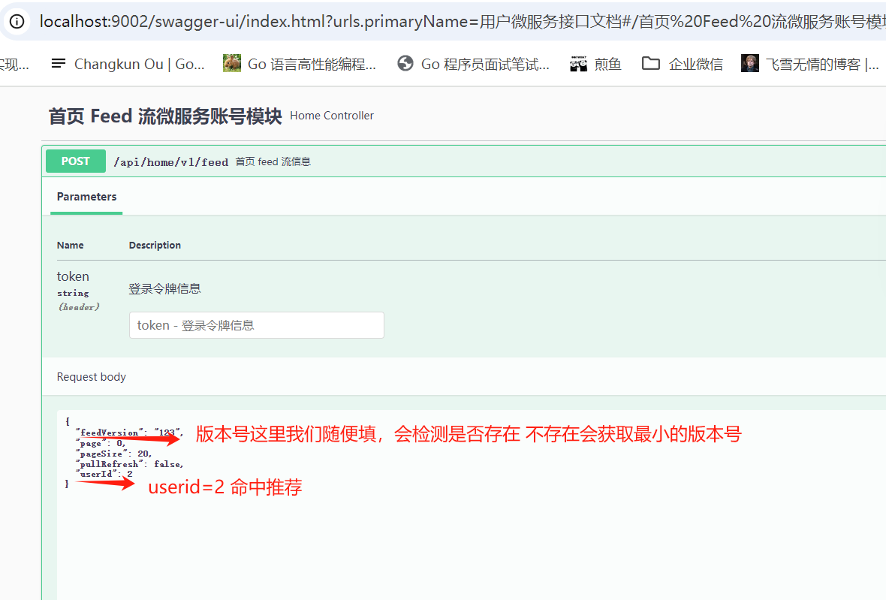

返回结果如下：

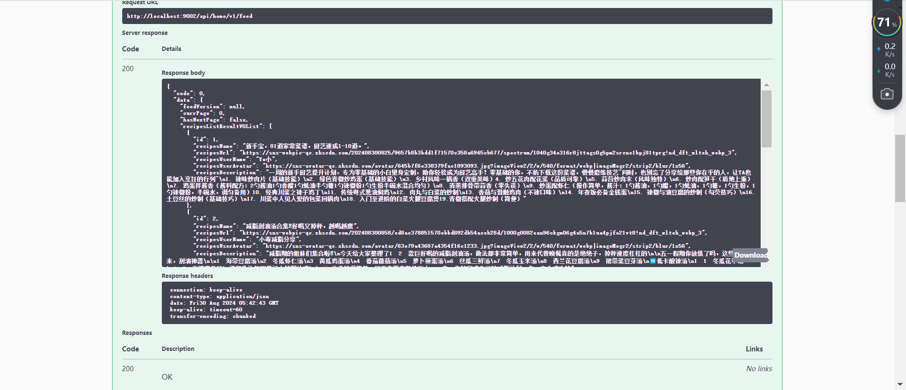

代码比较多，这里我通过一张流程图来梳理下整个实现过程：

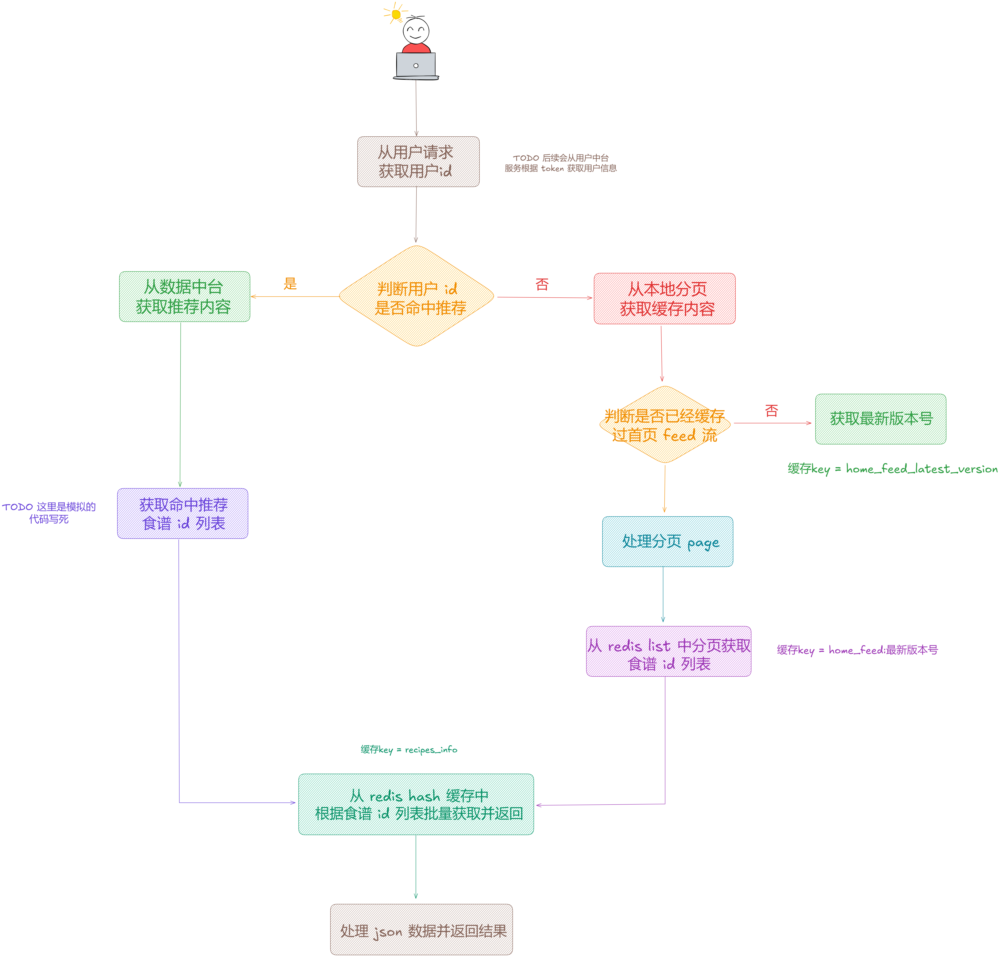

至此，第一版的首页 feed 流架构设计与开发就到此了。