大家好，我是**华仔**, 又跟大家见面了。

从今天之后的一段时间内，华仔会带着大家一起从零开始搭建并研发一套高并发的电商实战项目，这里会涉及到很多互联网大厂开发过程中所使用的核心技术和架构设计模式，希望大家学完之后可以用到自己的简历中。

这是第十六篇，本篇我们将进行电商实战项目美食服务基础功能开发。

文章汇总位置：[https://wx.zsxq.com/dweb2/index/columns/51122554151214](https://wx.zsxq.com/dweb2/index/columns/51122554151214)

源码授权与获取地址：[https://articles.zsxq.com/id\_1s85grnaae4p.html](https://articles.zsxq.com/id_1s85grnaae4p.html)

本章源码地址：[https://gitcode.net/u011359591/huazai-ecshop/-/tree/ecshop-chapter-1](https://gitcode.net/u011359591/huazai-ecshop/-/tree/ecshop-chapter-15)6

## **01 前言**

终于要设计与研发电商项目代码了，今天我们要对美食服务进行基础功能的开发。

这里需要注意下，我们整个项目目前是不提供前端的，这个后续有时间在搞，主要是进行后端接口以及微服务模块架构设计。

## **02 美食服务**

这是我们一个非常重要的服务，它承载了我们整套电商项目的上下文，在这里可以对美食食谱信息进行「**发布/修改/查询/删除**」等基础功能，另外在这个服务，我们大量的使用「**Redis 来构建缓存服务**」，让你更好对 Redis 缓存实战的熟悉和了解。

那么本篇就来对美食食谱的基础功能进行开发，后面几篇会进行「**构建 Redis 缓存服务**」以及 「**Redis 分布式锁来解决缓存 + 数据库双写一致性解决方案**」。

大体功能如下，不过我们这里的详情页会进行「**商品种草**」，然后「**加购**」、「**下单**」、「**支付**」等：

话不多说，开始今天的正题。

## **2.1 添加美食服务工程**

同之前一样，这里我们新增一个美食服务工程，如下：

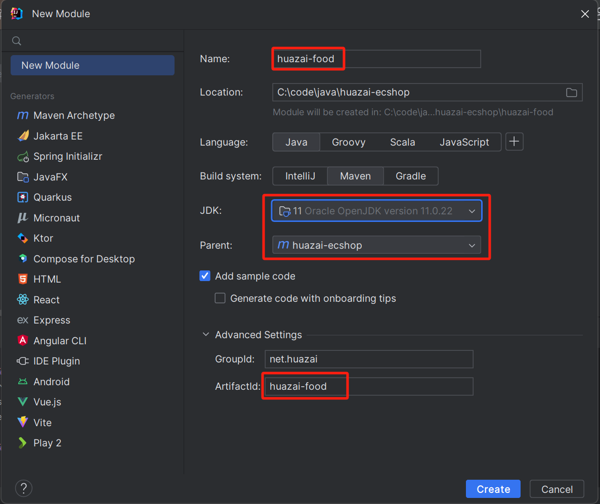

创建完就会聚合工程中自动添加 [huazai-food](http://huazai-food/) 的一个 module。

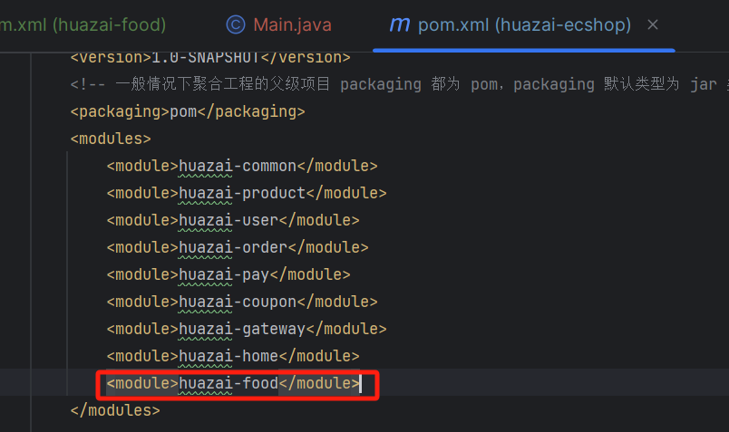

### **2.1.1 文件配置**

配置文件配置 [application.yml](http://application.yml/)，这里直接拷贝 [huazai-user](http://huazai-user/) 的，然后修改下启动端口 [9003](http://0.0.35.43/)、应用名称、数据库配置等。

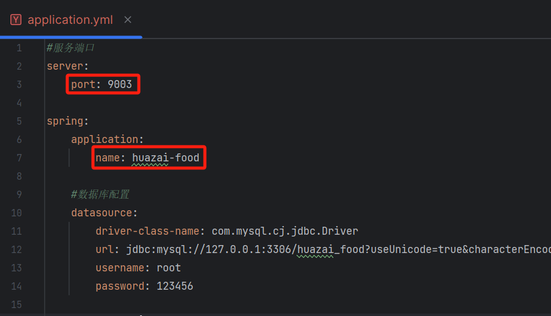

### **2.1.2 添加启动类注解**

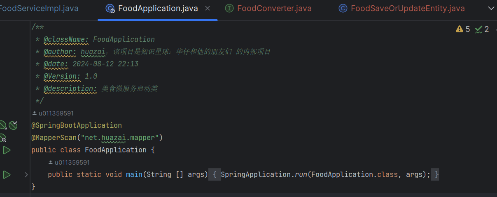

等这些基础步骤搞完后，就可以开发我们首页 feed 流功能了。

## **2.2 美食服务控制器**

package net.huazai.controller;

import io.swagger.annotations.Api;

import io.swagger.annotations.ApiOperation;

import io.swagger.annotations.ApiParam;

import lombok.extern.slf4j.Slf4j;

import net.huazai.entity.FoodInfoEntity;

import net.huazai.entity.FoodQueryEntity;

import net.huazai.entity.FoodSaveOrUpdateEntity;

import net.huazai.enums.BizCodes;

import net.huazai.service.FoodService;

import net.huazai.utils.ApiResult;

import net.huazai.vo.FoodVO;

import org.springframework.beans.factory.annotation.Autowired;

import org.springframework.web.bind.annotation.\*;

import java.util.Map;

/\*\*

\* 

\* 前端控制器

\* 

\*

\* @author huazai

\* @since 2024-08-31

\*/

@Api(tags = "美食微服务账号模块")

@Slf4j

@RestController

@RequestMapping("/api/food/v1/")

public class FoodController {

/\*\*

\* 注入美食服务

\*/

@Autowired

private FoodService foodService;

/\*\*

\* 根据 id 查询美食信息

\* @return

\*/

@ApiOperation("查询美食信息")

@GetMapping("/info/{food\_id}")

public Object getFoodInfo(@ApiParam(value = "美食 id", required = true)

@PathVariable("food\_id") Long foodId) {

log.info("查询食谱信息信息，food\_id:{}", foodId);

FoodVO foodVO \= foodService.getFoodInfo(foodId);

return foodVO \=\= null ? ApiResult.doResult(BizCodes.FOOD\_INFO\_NOT\_EXISTS) : ApiResult.doSuccess(foodVO);

}

/\*\*

\* 查询我的美食列表

\* @param foodQueryEntity

\* @return

\*/

@ApiOperation("分页查询我的美食列表")

@PostMapping("/list")

public ApiResult getFoodList(@RequestBody FoodQueryEntity foodQueryEntity) {

log.info("查询我的美食列表：{}", foodQueryEntity);

Map<String, Object> pageList = foodService.getFoodList(foodQueryEntity);

return ApiResult.doSuccess(pageList);

}

/\*\*

\* 添加/修改美食信息

\* @param foodSaveOrUpdateEntity

\* @return

\*/

@ApiOperation("添加/修改美食信息")

@PostMapping("saveOrUpdate")

public ApiResult saveOrUpdate(@ApiParam("添加/修改美食信息") @RequestBody FoodSaveOrUpdateEntity foodSaveOrUpdateEntity) {

log.info("新增/修改美食信息:{}", foodSaveOrUpdateEntity);

foodService.saveOrUpdate(foodSaveOrUpdateEntity);

return ApiResult.doSuccess();

}

}

这里三个方法：

1.  查询单个美食基础信息。
2.  查询我的美食列表。
3.  新增/修改美食信息。

本篇是美食服务的基础功能，下篇会对其进行演化，构建一套「**支撑高并发的缓存架构体系**」。

## **2.3 美食服务**

package net.huazai.service.impl;

import com.baomidou.mybatisplus.core.conditions.query.QueryWrapper;

import com.baomidou.mybatisplus.core.metadata.IPage;

import com.baomidou.mybatisplus.extension.plugins.pagination.Page;

import lombok.extern.slf4j.Slf4j;

import net.huazai.converter.FoodConverter;

import net.huazai.entity.\*;

import net.huazai.enums.\*;

import net.huazai.interceptor.LoginInterceptor;

import net.huazai.model.FoodDO;

import net.huazai.mapper.FoodMapper;

import net.huazai.service.FoodService;

import net.huazai.utils.ApiResult;

import net.huazai.utils.JsonUtil;

import net.huazai.vo.FoodVO;

import org.springframework.beans.BeanUtils;

import org.springframework.beans.factory.annotation.Autowired;

import org.springframework.stereotype.Service;

import org.springframework.transaction.annotation.Transactional;

import java.util.\*;

import java.util.stream.Collectors;

/\*\*

\* 

\* 美食服务实现类

\* 

\*

\* @author huazai

\* @since 2024-08-31

\*/

@Service

@Slf4j

public class FoodServiceImpl implements FoodService {

/\*\*

\* 注入美食 mapper

\*/

@Autowired

private FoodMapper foodMapper;

/\*\*

\* 注入美食转换器

\*/

@Autowired

private FoodConverter foodConverter;

/\*\*

\* 获取美食信息

\* @param foodId

\* @return

\*/

@Override

public FoodVO getFoodInfo(Long foodId) {

log.info("美食模块-从数据库获取美食信息，foodId:{}", foodId);

// 从数据库中获取美食信息

FoodDO foodDO \= foodMapper.selectOne(new QueryWrapper<FoodDO>().eq("id", foodId));

// 如果为空，则返回空

if (foodDO == null) {

return null;

}

// 这里我们返回 foodVO 的信息, 需要通过拷贝 foodDO 到 foodVO 中

FoodVO foodVO \= new FoodVO();

// 设置美食分类

foodVO.setFoodCateTag(FoodCateTag.getByTag(foodDO.getFoodCateTag()).getTagValue());

// 设置美食制作难度

foodVO.setFoodDifficulty(FoodDifficulty.getByDifficulty(foodDO.getFoodDifficulty()).getDifficultyValue());

// 设置美食制作时长

foodVO.setFoodTime(FoodTime.getByTime(foodDO.getFoodTime()).getTimeValue());

// 设置美食详情

List<FoodStepDetailEntity> stepDetails = JsonUtil.StringtoList(foodDO.getFoodDetail(),FoodStepDetailEntity.class);

foodVO.setFoodDetail(stepDetails);

// 设置美食清单

List<FoodListEntity> foodList = JsonUtil.StringtoList(foodDO.getFoodList(),FoodListEntity.class);

foodVO.setFoodList(foodList);

// TODO 商品信息关联

List<Long> skuIds = JsonUtil.jsonToLongList(foodDO.getFoodSkuids());

// 设置美食关联商品id

foodVO.setSkuIds(skuIds);

BeanUtils.copyProperties(foodDO, foodVO);

return foodVO;

}

@Override

public Map<String, Object> getFoodList(FoodQueryEntity foodQueryEntity) {

// 获取用户信息

// TODO 后续使用 Redis 分布式缓存替代

LoginUser loginUser \= LoginInterceptor.threadLocal.get();

log.info("美食模块-从数据库获取美食列表参数信息，page:{}，size:{}，uid:{}", foodQueryEntity.getPage(), foodQueryEntity.getPageSize(), loginUser.getId());

// 分页信息

Page<FoodDO> pageInfo = new Page<>(foodQueryEntity.getPage(), foodQueryEntity.getPageSize());

IPage<FoodDO> foodDOPage = null;

// 查询我的未删除美食列表

foodDOPage = foodMapper.selectPage(pageInfo,new QueryWrapper<FoodDO>().eq("user\_id", loginUser.getId()).eq("food\_status", FoodStatus.DEFAULT\_STATUS));

List<FoodDO> foodDOList = foodDOPage.getRecords();

log.info("美食模块-从数据库获取美食列表，foodDOPage:{}，foodDOPage2:{}", foodDOPage.getPages(), foodDOPage.getTotal());

// 对象流式转换处理美食列表结果信息

List<FoodVO> foodVOList = foodDOList.stream().map(obj->{

FoodVO foodVO \= new FoodVO();

// 设置美食分类

foodVO.setFoodCateTag(FoodCateTag.getByTag(obj.getFoodCateTag()).getTagValue());

// 设置美食制作难度

foodVO.setFoodDifficulty(FoodDifficulty.getByDifficulty(obj.getFoodDifficulty()).getDifficultyValue());

// 设置美食制作时长

foodVO.setFoodTime(FoodTime.getByTime(obj.getFoodTime()).getTimeValue());

// 设置美食详情

List<FoodStepDetailEntity> stepDetails = JsonUtil.StringtoList(obj.getFoodDetail(),FoodStepDetailEntity.class);

foodVO.setFoodDetail(stepDetails);

// 设置美食清单

List<FoodListEntity> foodList = JsonUtil.StringtoList(obj.getFoodList(),FoodListEntity.class);

foodVO.setFoodList(foodList);

// TODO 商品信息关联

List<Long> skuIds = JsonUtil.jsonToLongList(obj.getFoodSkuids());

// 设置美食关联商品id

foodVO.setSkuIds(skuIds);

BeanUtils.copyProperties(obj, foodVO);

return foodVO;

}).collect(Collectors.toList());

Map<String,Object> pageMap = new HashMap<>(3);

// 总条数

pageMap.put("total", foodDOPage.getTotal());

// 总分页数

pageMap.put("pages", foodDOPage.getPages());

// 列表信息

pageMap.put("list", foodVOList);

return pageMap;

}

/\*\*

\* 新增/修改美食信息

\* @param foodSaveOrUpdateEntity

\* @return

\*/

@Transactional(rollbackFor = Exception.class)

@Override

public ApiResult saveOrUpdate(FoodSaveOrUpdateEntity foodSaveOrUpdateEntity) {

// 获取用户登录信息 这里还是通过 ThreadLocal 进行获取

// TODO 后续使用 Redis 分布式缓存替代

LoginUser loginUser \= LoginInterceptor.threadLocal.get();

// 构建美食信息

FoodDO foodDO \= buildFoodDO(foodSaveOrUpdateEntity);

foodDO.setUserId(loginUser.getId());

// 保存美食信息

if (foodDO.getId() == null) {

// 新增

int rows \= foodMapper.insert(foodDO);

log.info("美食模块-新增美食信息：rows={}，data={}", rows, foodDO);

} else {

// 修改

foodMapper.update(foodDO, new QueryWrapper<FoodDO>().eq("id", foodDO.getId()));

log.info("美食模块-修改美食信息：data={}", foodDO);

}

return null;

}

/\*\*

\* 构建美食请求信息

\* @param foodSaveOrUpdateEntity

\* @return

\*/

private FoodDO buildFoodDO(FoodSaveOrUpdateEntity foodSaveOrUpdateEntity) {

FoodDO foodDO \= foodConverter.convertFoodDO(foodSaveOrUpdateEntity);

// 设置美食食材清单列表

foodDO.setFoodList(JsonUtil.object2Json(foodSaveOrUpdateEntity.getFoodList()));

// 设置美食详情

foodDO.setFoodDetail(JsonUtil.object2Json(foodSaveOrUpdateEntity.getFoodDetail()));

// 新增数据

if (foodDO.getId() == null) {

// 菜谱状态为空，则设置为未删除

if (Objects.isNull(foodDO.getFoodStatus())) {

foodDO.setFoodStatus(DeleteStatus.NO\_DEL.getStatus());

}

foodDO.setFoodCreatetime(new Date());

}

foodDO.setFoodUpdatetime(new Date());

return foodDO;

}

}

这里麻烦的是对 json 数据的处理，需要自己封装方法进行处理。

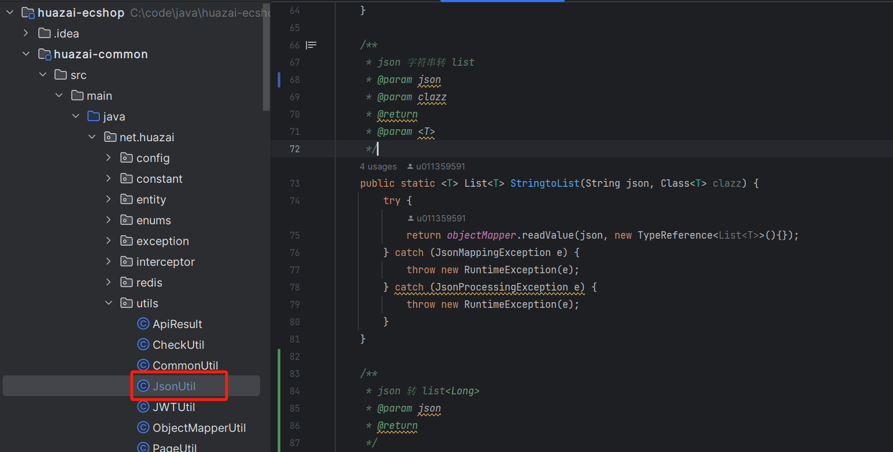

具体的实体、枚举类相关的就不列了，自己下载代码自行查看学习。

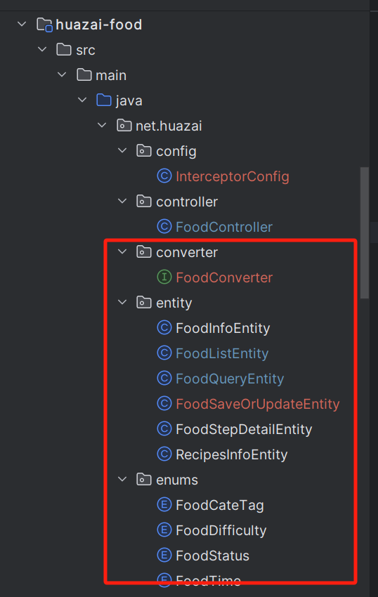

这里需要注意的是分页我们需要定义一个配置，否则查出来的结果不对。 我们直接加入到 [common](http://common%20/) 工程中。

package net.huazai.config;

import com.baomidou.mybatisplus.extension.plugins.MybatisPlusInterceptor;

import com.baomidou.mybatisplus.extension.plugins.inner.PaginationInnerInterceptor;

import org.springframework.context.annotation.Bean;

import org.springframework.context.annotation.Configuration;

/\*\*

\* @className: MybatisPlusPageConfig

\* @author: huazai，该项目是知识星球：华仔和他的朋友们 的内部项目

\* @date: 2024-08-15 9:20

\* @Version: 1.0

\* @description: 分页插件配置

\*/

@Configuration

public class MybatisPlusPageConfig {

/\*\*

\* 新版的分页插件配置

\* @return

\*/

@Bean

public MybatisPlusInterceptor mybatisPlusInterceptor() {

MybatisPlusInterceptor mybatisPlusInterceptor \= new MybatisPlusInterceptor();

mybatisPlusInterceptor.addInnerInterceptor(new PaginationInnerInterceptor());

return mybatisPlusInterceptor;

}

}

启动执行效果如下：

### **2.3.1 美食基础信息查询**

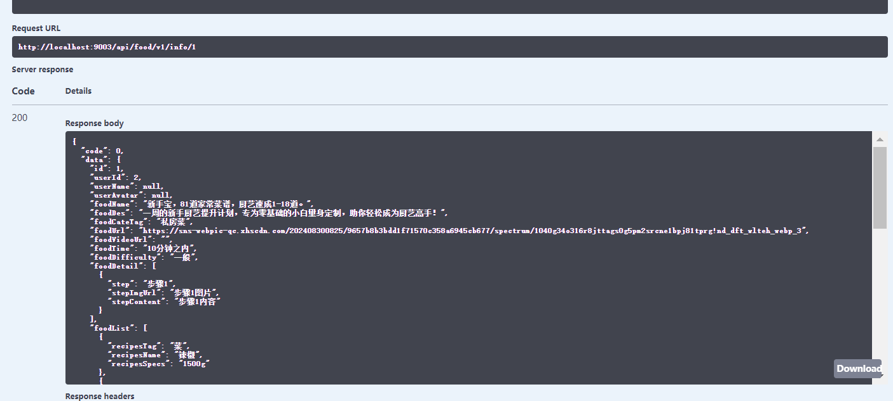

### **2.3.2 我的美食列表信息查询**

这里需要传 token，解析用户信息。

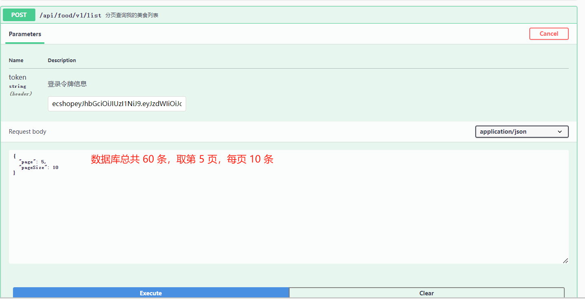

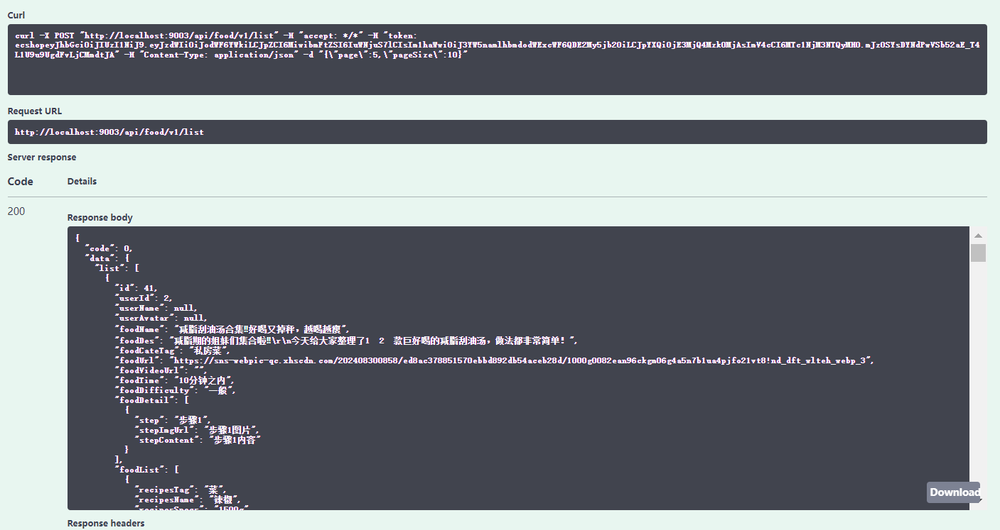

### **2.3.3 新增/修改美食信息**

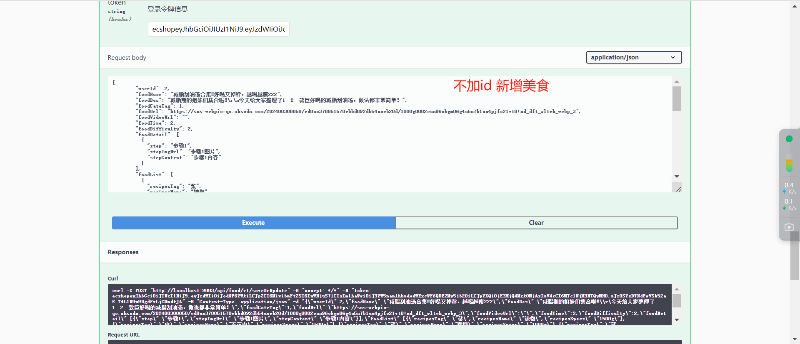

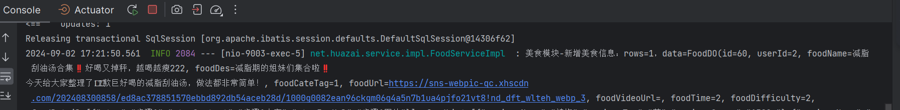

数据库新增一条：

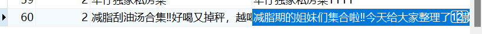

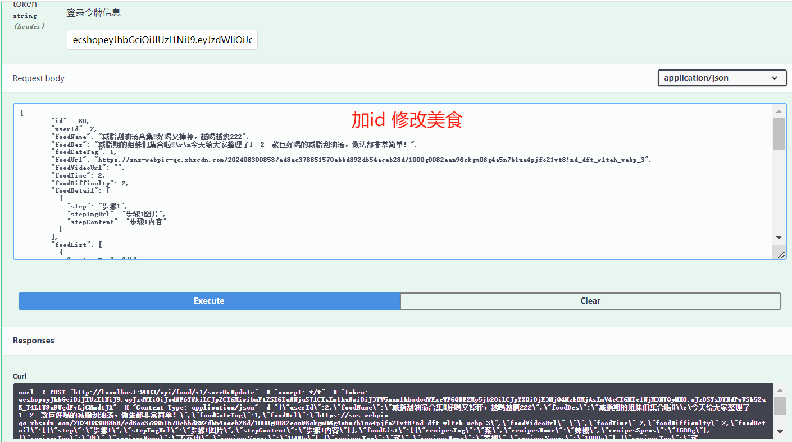

可以看到数据库 id = 60 这条修改时间变化了。

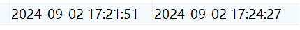

最后这里贴一下 json 串，方便大家测试使用。

{

"id" : 60,

"userId": 2,

"foodName": "减脂刮油汤合集‼️好喝又掉秤，越喝越瘦222",

"foodDes": "减脂期的姐妹们集合啦‼️\\r\\n今天给大家整理了1⃣2⃣款巨好喝的减脂刮油汤，做法都非常简单！",

"foodCateTag": 1,

"foodUrl": "https://sns-webpic-qc.xhscdn.com/202408300858/ed8ac378851570ebbd892db54aceb28d/1000g0082ean96ckgm06g4a5n7b1ua4pjfo21vt8!nd\_dft\_wlteh\_webp\_3",

"foodVideoUrl": "",

"foodTime": 2,

"foodDifficulty": 2,

"foodDetail": \[

{

"step": "步骤1",

"stepImgUrl": "步骤1图片",

"stepContent": "步骤1内容"

}

\],

"foodList": \[

{

"recipesTag": "菜",

"recipesName": "辣椒",

"recipesSpecs": "1500g"

},

{

"recipesTag": "肉",

"recipesName": "五花肉",

"recipesSpecs": "1500g"

},

{

"recipesTag": "菜",

"recipesName": "青椒",

"recipesSpecs": "1000g"

},

{

"recipesTag": "菜",

"recipesName": "鸡蛋",

"recipesSpecs": "2000g"

},

{

"recipesTag": "菜",

"recipesName": "花菜",

"recipesSpecs": "1500g"

},

{

"recipesTag": "调味品",

"recipesName": "蚝油",

"recipesSpecs": "100g"

},

{

"recipesTag": "调味品",

"recipesName": "酱油",

"recipesSpecs": "200g"

},

{

"recipesTag": "调味品",

"recipesName": "香醋",

"recipesSpecs": "200g"

},

{

"recipesTag": "调味品",

"recipesName": "糖",

"recipesSpecs": "100g"

}

\],

"skuIds": \[

1,

2,

3

\]

}

## **2.4 关于工程目录构建**

这块可以直接查看：[【电商实战项目第三篇】华仔电商实战项目前期准备与数据库划分](https://articles.zsxq.com/id_ltn1w9is3w4j.html) 中的 4.2 节内容。

## **03 美食服务数据库**

目前暂时只有一个美食表，后期会增加商品关联表等其他。

CREATE TABLE \`food\` (

\`id\` bigint NOT NULL AUTO\_INCREMENT,

\`user\_id\` bigint NOT NULL COMMENT '用户id',

\`food\_name\` varchar(32) CHARACTER SET utf8mb4 COLLATE utf8mb4\_general\_ci NOT NULL DEFAULT '' COMMENT '美食名称',

\`food\_des\` varchar(255) CHARACTER SET utf8mb4 COLLATE utf8mb4\_general\_ci NOT NULL DEFAULT '' COMMENT '美食描述',

\`food\_cate\_tag\` tinyint(1) NOT NULL DEFAULT '1' COMMENT '美食分类 1、私房菜 2、家常菜 3、硬菜 4、小吃 5、开胃菜 6、甜点 7、减脂餐 8、素菜 9、养生菜',

\`food\_url\` varchar(255) COLLATE utf8mb4\_general\_ci NOT NULL DEFAULT '' COMMENT '美食主图链接',

\`food\_video\_url\` varchar(255) COLLATE utf8mb4\_general\_ci NOT NULL DEFAULT '' COMMENT '美食视频链接',

\`food\_time\` tinyint(1) NOT NULL DEFAULT '0' COMMENT '美食制作时长 1、10分钟以内 2、10-30分钟 3、30-60分钟 4、1小时以上',

\`food\_difficulty\` tinyint(1) NOT NULL DEFAULT '0' COMMENT '美食制作难度 1、简单 2、一般 3、较难 4、极难',

\`food\_detail\` json NOT NULL COMMENT '美食制作详情 \[{"step":"步骤", "content":"步骤内容", "img":"步骤图片"}\]',

\`food\_list\` json NOT NULL COMMENT '美食清单',

\`food\_status\` tinyint(1) NOT NULL DEFAULT '0' COMMENT '美食状态 0、有效 1、删除',

\`food\_skuIds\` json DEFAULT NULL COMMENT '美食关联的商品ids',

\`food\_createtime\` datetime DEFAULT CURRENT\_TIMESTAMP COMMENT '创建时间',

\`food\_updatetime\` datetime DEFAULT CURRENT\_TIMESTAMP ON UPDATE CURRENT\_TIMESTAMP COMMENT '更新时间',

PRIMARY KEY (\`id\`),

KEY \`uid\` (\`user\_id\`) USING BTREE

) ENGINE\=InnoDB AUTO\_INCREMENT\=1 DEFAULT CHARSET\=utf8mb4 COLLATE=utf8mb4\_general\_ci COMMENT\='美食基础信息表';