大家好，我是**华仔**, 又跟大家见面了。

从今天之后的一段时间内，华仔会带着大家一起从零开始搭建并研发一套高并发的电商实战项目，这里会涉及到很多互联网大厂开发过程中所使用的核心技术和架构设计模式，希望大家学完之后可以用到自己的简历中。

这是第十四篇，本篇我们进行电商实战项目用户微服务模块用户缓存架构演进设计，今天的内容非常重要。

文章汇总位置：[https://wx.zsxq.com/dweb2/index/columns/51122554151214](https://wx.zsxq.com/dweb2/index/columns/51122554151214)

源码授权与获取地址：[https://articles.zsxq.com/id\_1s85grnaae4p.html](https://articles.zsxq.com/id_1s85grnaae4p.html)

本章源码地址：[https://gitcode.net/u011359591/huazai-ecshop/-/tree/ecshop-chapter-14](https://gitcode.net/u011359591/huazai-ecshop/-/tree/ecshop-chapter-14)

## **01 前言**

终于要设计与研发电商项目代码了，今天我们要对用户微服务模块用户缓存架构演进设计与开发。

这里需要注意下，我们整个项目目前是不提供前端的，这个后续有时间在搞，主要是进行后端接口以及微服务模块架构设计。

## **02 用户缓存架构演进设计与开发**

对于高并发系统来说，针对「**用户体系**」相关的数据是访问最频繁的，而且用户体系的相关数据在我们整个美食社区电商系统是一个「**经典的读多写少**」场景，所以非常适合缓存的场景。

下面我会通过「**场景驱动**」的方式来设计与开发下整个「**用户体系**」的「**缓存演进**」过程。

##   
**2.1 用户数据读多写少场景分析**

首先用户相关的数据，在整个美食社区电商系统场景下几乎每个微服务都会被用到，从「**登录**」、「**首页 Feed 流**」、「**美食详情页**」、「**美食分享**」、「**美食下单**」、「**美食支付**」、「**查询美食订单**」、「**个人中心**」等等。

相对于「**高并发读场景**」来说，写场景相对少一些，基本就是「**注册**」场景。相对于其他读场景，「**注册**」基本上一次性搞定。

所以此时非常适合做「**缓存**」，既然要做缓存，我们就需要先准备好一些基础工具类的开发。

###   
**2.1.1 引入 Redisson 分布式锁依赖**

在顶层聚合工程中添加对应依赖和版本号，如下：

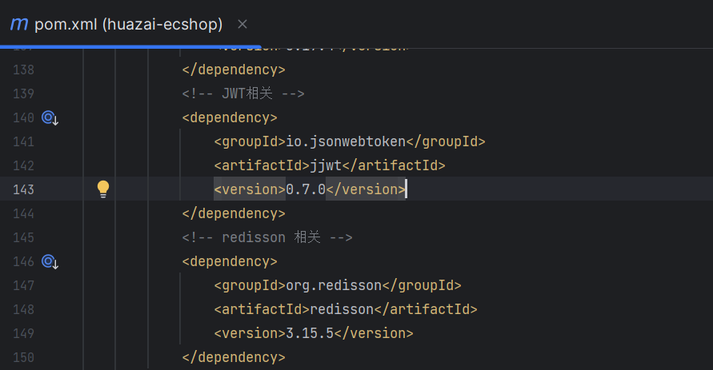

在 Common 工程中添加对应依赖，并刷新如下：

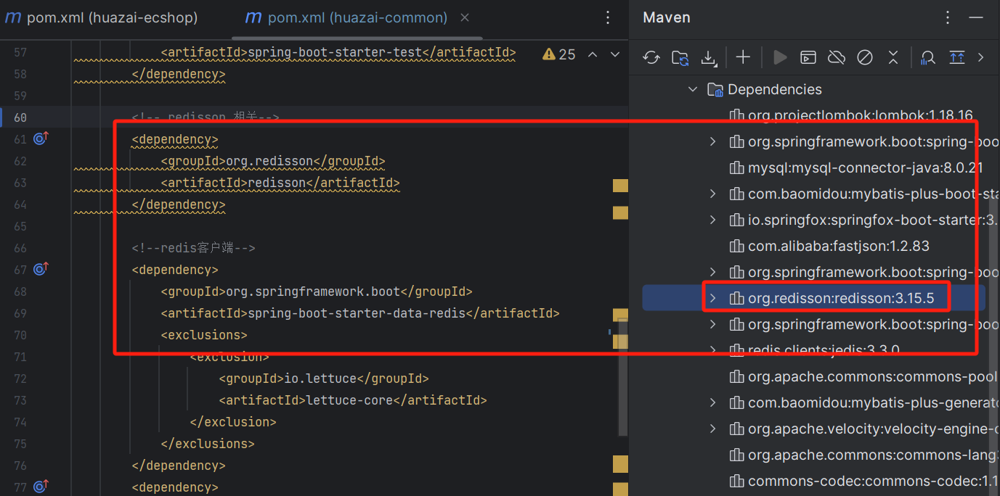

### **2.1.2 封装 Redis 缓存工具类**

package net.huazai.redis;

import lombok.extern.slf4j.Slf4j;

import net.huazai.utils.JsonUtil;

import org.springframework.data.redis.core.RedisTemplate;

import org.springframework.data.redis.core.ValueOperations;

import org.springframework.data.redis.core.script.RedisScript;

import org.springframework.stereotype.Component;

import java.util.Date;

import java.util.List;

import java.util.Map;

import java.util.Set;

import java.util.concurrent.TimeUnit;

/\*\*

\* @className: redisCache

\* @author: huazai，该项目是知识星球：华仔和他的朋友们 的内部项目

\* @date: 2024-08-24 22:38

\* @Version: 1.0

\* @description: redis 缓存封装类，方便后续使用

\*/

@Slf4j

@Component

public class RedisCache {

private RedisTemplate redisTemplate;

public RedisCache(RedisTemplate redisTemplate) {

this.redisTemplate = redisTemplate;

}

/\*\*

\* 写入缓存

\* @param key

\* @param value

\* @param seconds 设置过期时间

\*/

public void set(String key, String value, int seconds) {

ValueOperations<String,String> op = redisTemplate.opsForValue();

if (seconds > 0) {

// 设置缓存时间

op.set(key, value, seconds, TimeUnit.SECONDS);

} else {

op.set(key, value);

}

}

/\*\*

\* 写入缓存 value 为 Object 类型

\* TODO 后续会增加热 Key 检测

\* @param key

\* @param value

\* @param seconds

\*/

public void setCache(String key, Object value, int seconds) {

// 先将 Object 转成 Json 字符串再进行存储

this.set(key, JsonUtil.object2Json(value), seconds);

}

/\*\*

\* 读取缓存

\* @param key

\* @return

\*/

public String get(String key) {

ValueOperations<String,String> op = redisTemplate.opsForValue();

return op.get(key);

}

/\*\*

\* 读取缓存

\* TODO 后续会增加热 Key 读取，如果存在优先从内存中读取，否则再读取 Redis 缓存

\* @param key

\* @return

\*/

public Object getCache(String key) {

String value \= this.get(key);

log.info("缓存模块-从缓存中获取信息,key:{},value:{}", key, value);

return value;

}

/\*\*

\* 删除缓存

\* @param key

\* @return

\*/

public boolean delete(String key){

return redisTemplate.delete(key);

}

/\*\*

\* 写入缓存并设置过期时间

\* @param key

\* @param value

\* @param time

\*/

public void setex(String key, String value, long time) {

redisTemplate.opsForValue().set(key, value, time, TimeUnit.SECONDS);

}

/\*\*

\* 批量获取缓存

\* @param keyList

\* @return

\*/

public List mget(List<String> keyList) {

return redisTemplate.opsForValue().multiGet(keyList);

}

/\*\*

\* 删除 Set 集合中 key 下的多个值

\* @param key

\* @param values

\*/

public void srem(String key, String\[\] values) {

redisTemplate.opsForSet().remove(key, values);

}

/\*\*

\* 添加 Set 集合中 key 下的多个值

\* @param key

\* @param values

\*/

public void sadd(String key, String\[\] values) {

redisTemplate.opsForSet().add(key, values);

}

/\*\*

\* 获取 Set 集合成员

\* @param key

\* @return

\*/

public Set smembers(String key) {

return redisTemplate.opsForSet().members(key);

}

/\*\*

\* Set 集合成员是否存在

\* @param key

\* @param member

\* @return

\*/

public Boolean sismember(String key, String member) {

return redisTemplate.opsForSet().isMember(key, member);

}

/\*\*

\* ZSet 集合有序区间值

\* @param key

\* @param min

\* @param max

\* @param offset

\* @param count

\* @return

\*/

public Set zrangeByScore(String key, double min, double max, long offset, long count) {

return redisTemplate.opsForZSet().rangeByScore(key, min, max, offset, count);

}

/\*\*

\* ZSet 集合有序存储

\* @param key

\* @param member

\* @param score

\* @return java.lang.Boolean

\*/

public Boolean zadd(String key, String member, double score) {

return redisTemplate.opsForZSet().add(key, member, score);

}

/\*\*

\* ZSet 集合有序删除

\*

\* @param key

\* @param values

\* @return java.lang.Long

\*/

public Long zremove(String key, String... values) {

return redisTemplate.opsForZSet().remove(key, values);

}

/\*\*

\* ZSet 集合有序数量

\* @param key

\* @return java.lang.Long

\*/

public Long zcard(String key) {

return redisTemplate.opsForZSet().zCard(key);

}

/\*\*

\* 判断 hash key 是否存在

\* @param key

\* @return

\*/

public boolean hExists(String key) {

return hGetAll(key).isEmpty();

}

/\*\*

\* 判断 hash field 是否存在

\* @return

\*/

public boolean hFieldExists(String key, String field) {

return redisTemplate.opsForHash().hasKey(key, field);

}

/\*\*

\* 获取 hash 变量中的键值对

\* 对应 redis hgetall 命令

\* @param key

\* @return

\*/

public Map<String, String> hGetAll(String key) {

return redisTemplate.opsForHash().entries(key);

}

/\*\*

\* 获取 hash 变量中的

\* @return

\*/

public Object hGet(String key, String field) {

return redisTemplate.opsForHash().get(key, field);

}

/\*\*

\* hash 变量中 field 对应的 value 自增

\* @param key

\* @param field

\* @param increment

\* @return

\*/

public Long hIncr(String key, String field, Integer increment) {

return redisTemplate.opsForHash().increment(key, field, increment);

}

/\*\*

\* hash 变量 field 对应的 value 自增

\* @param key

\* @param field

\* @return

\*/

public Long hIncr(String key, String field) {

return hIncr(key, field, 1);

}

/\*\*

\* 获取 hash 变量中的 field 数量

\* 对应 redis hlen 命令

\* @param key

\* @return

\*/

public Long hLen(String key) {

return redisTemplate.opsForHash().size(key);

}

/\*\*

\* 添加 hash 的 value

\* @param key

\* @param field

\* @param value

\*/

public void hPut(String key, String field, Object value) {

redisTemplate.opsForHash().put(key, field, value);

}

/\*\*

\* 以 map 集合的形式添加 hash 键值对

\* @param key

\* @param map

\*/

public void hPutAll(String key, Map<String, String> map) {

redisTemplate.opsForHash().putAll(key, map);

}

/\*\*

\* 删除某个 field

\* @param key

\* @param field

\*/

public long hDel(String key, String field) {

return redisTemplate.opsForHash().delete(key, field);

}

/\*\*

\* 设置 key 过期时间

\* @param key

\* @param time

\* @param unit

\*/

public void expire(String key, long time, TimeUnit unit) {

redisTemplate.expire(key, time, unit);

}

/\*\*

\* 以 list 集合的形式添加数据

\* @param key

\* @return

\*/

public Boolean hasKey(String key) {

return redisTemplate.hasKey(key);

}

/\*\*

\* 以 list 集合的形式添加数据

\* @param key

\* @param values

\* @return

\*/

public Long lPushAll(String key, String... values) {

return redisTemplate.opsForList().leftPushAll(key, values);

}

/\*\*

\* 以 list 集合的形式添加数据

\* @param key

\* @param values

\* @return

\*/

public Long lPushAll(String key, List<String> values) {

return redisTemplate.opsForList().leftPushAll(key, values);

}

/\*\*

\* 以 list 集合的形式添加数据

\* @param key

\* @param values

\* @return

\*/

public Long rPushAll(String key, String... values) {

return redisTemplate.opsForList().rightPushAll(key, values);

}

/\*\*

\* 以 list 集合的形式添加数据

\* @param key

\* @param values

\* @return

\*/

public Long rPushAll(String key, List<String> values) {

return redisTemplate.opsForList().rightPushAll(key, values);

}

/\*\*

\* 返回 list 集合下表区间的元素

\* @param key

\* @param start

\* @param end

\* @return

\*/

public List<String> lRange(String key, long start, long end) {

return redisTemplate.opsForList().range(key, start, end);

}

/\*\*

\* 返回 list 集合的大小

\* @param key

\* @return

\*/

public Long lsize(String key) {

return redisTemplate.opsForList().size(key);

}

/\*\*

\* 设置缓存过期时间

\* @param key

\* @return

\*/

public void expire(String key, long time) {

this.expire(key, time, TimeUnit.SECONDS);

}

/\*\*

\* 执行 lua 脚本

\* @param script

\* @param keys

\* @param args

\* @param <T>

\* @return

\*/

public <T> T execute(RedisScript<T> script, List<String> keys, String... args) {

return (T) redisTemplate.execute(script, keys, args);

}

/\*\*

\* 写入缓存并设置过期时间

\* @param key

\* @param value

\* @param time

\* @param timeUnit

\* @return void

\*/

public void setex(String key, String value, long time, TimeUnit timeUnit) {

redisTemplate.opsForValue().set(key, value, time, timeUnit);

}

/\*\*

\* 递增

\* @param key

\* @param increment

\* @return

\*/

public Long increment(String key, long increment) {

return redisTemplate.opsForValue().increment(key, increment);

}

/\*\*

\* 递减

\* @param key

\* @param decrement

\* @return

\*/

public Long decrement(String key, long decrement) {

return redisTemplate.opsForValue().decrement(key, decrement);

}

/\*\*

\* 获取缓存失效时间

\* @param key

\* @param timeUnit

\* @return

\*/

public Long getExpire(String key, TimeUnit timeUnit) {

return redisTemplate.getExpire(key, timeUnit);

}

/\*\*

\* 指定缓存失效时间

\* @param key

\* @param date

\* @return

\*/

public Boolean expireAt(String key, Date date) {

return redisTemplate.expireAt(key, date);

}

/\*\*

\* 获取 hash 多 field 值

\* @param key

\* @param list

\* @return

\*/

public List<String> multiGet(String key, List<String> list) {

return redisTemplate.opsForHash().multiGet(key, list);

}

/\*\*

\* 新增 hash 值

\* @param key

\* @param field

\* @param value

\* @return

\*/

public Boolean putIfAbsent(String key, String field, String value) {

return redisTemplate.opsForHash().putIfAbsent(key, field, value);

}

}

### **2.1.3 封装 Redis 分布式锁工具类**

package net.huazai.redis;

import org.redisson.api.RLock;

import org.redisson.api.RedissonClient;

import java.util.concurrent.TimeUnit;

/\*\*

\* @className: RedisLock

\* @author: huazai，该项目是知识星球：华仔和他的朋友们 的内部项目

\* @date: 2024-08-25 0:09

\* @Version: 1.0

\* @description: 基于 Redisson 分布式锁

\*/

public class RedisLock {

RedissonClient redissonClient;

public RedisLock(RedissonClient redissonClient) {

this.redissonClient = redissonClient;

}

/\*\*

\* redisson 互斥锁，等待 seconds 秒后自动失效

\* @param key

\* @param seconds

\* @return

\*/

public boolean lock(String key, int seconds) {

// 先获取分布式锁

RLock rLock \= redissonClient.getLock(key);

// 如果已经加锁了返回 false

if (rLock.isLocked()) {

return false;

}

// 加锁，如果在指定时间内没释放锁，它会自动在底层把锁释放掉

rLock.lock(seconds, TimeUnit.SECONDS);

// 加锁成功返回 true

return true;

}

/\*\*

\* redisson 互斥锁，自动续期

\* @param key

\* @return

\*/

public boolean lock(String key) {

// 先获取分布式锁

RLock rLock \= redissonClient.getLock(key);

// 如果已经加锁了返回 false

if (rLock.isLocked()) {

return false;

}

// 加锁

rLock.lock();

// 加锁成功返回 true

return true;

}

/\*\*

\* 尝试加锁

\* @param key

\* @param timeout

\* @return

\* @throws InterruptedException

\*/

public boolean tryLock(String key, long timeout) throws InterruptedException {

// 先获取分布式锁

RLock rLock \= redissonClient.getLock(key);

// 尝试加锁

return rLock.tryLock(timeout, TimeUnit.MILLISECONDS);

}

/\*\*

\* 手动释放锁

\* @param key

\*/

public void unlock(String key) {

// 先获取分布式锁

RLock rLock \= redissonClient.getLock(key);

// 如果已锁定，则释放锁

if (rLock.isLocked()) {

rLock.unlock();

}

}

}

### **2.1.4 封装 Redis 配置工具类**

这里新增 [RedissonClient](http://redissonclient/)、[RedisCache](http://rediscache/)、[RedisLock](http://redislock%20/) 相关配置，方便后续使用。

package net.huazai.config;

import com.fasterxml.jackson.annotation.JsonAutoDetect;

import com.fasterxml.jackson.annotation.PropertyAccessor;

import com.fasterxml.jackson.databind.ObjectMapper;

import lombok.Data;

import net.huazai.redis.RedisCache;

import net.huazai.redis.RedisLock;

import org.redisson.Redisson;

import org.redisson.api.RedissonClient;

import org.redisson.client.codec.StringCodec;

import org.redisson.config.Config;

import org.springframework.beans.factory.annotation.Value;

import org.springframework.context.annotation.Bean;

import org.springframework.context.annotation.Configuration;

import org.springframework.data.redis.connection.RedisConnectionFactory;

import org.springframework.data.redis.core.RedisTemplate;

import org.springframework.data.redis.serializer.Jackson2JsonRedisSerializer;

import org.springframework.data.redis.serializer.StringRedisSerializer;

/\*\*

\* @className: RedisTemplateConfig

\* @author: huazai，该项目是知识星球：华仔和他的朋友们 的内部项目

\* @date: 2024-08-15 9:20

\* @Version: 1.0

\* @description: redis 模板配置

\*/

@Configuration

@Data

public class RedisTemplateConfig {

@Value("${spring.redis.host}")

private String redisHost;

@Value("${spring.redis.port}")

private String redisPort;

@Value("${spring.redis.password}")

private String redisPwd;

@Value("${spring.redis.timeout}")

private int redisTimeout;

/\*\*

\* 实例化 redisTemplate

\* @param redisConnectionFactory

\* @return

\*/

@Bean

public RedisTemplate<Object, Object> redisTemplate(RedisConnectionFactory redisConnectionFactory) {

// 实例化 RedisTemplate

RedisTemplate<Object, Object> redisTemplate = new RedisTemplate<>();

// 设置连接

redisTemplate.setConnectionFactory(redisConnectionFactory);

// 配置 Redis 序列化规则

Jackson2JsonRedisSerializer jackson2JsonRedisSerializer \= new Jackson2JsonRedisSerializer(Object.class);

ObjectMapper objectMapper \= new ObjectMapper();

objectMapper.setVisibility(PropertyAccessor.ALL, JsonAutoDetect.Visibility.ANY);

jackson2JsonRedisSerializer.setObjectMapper(objectMapper);

// 设置 key-value 序列化规则

redisTemplate.setKeySerializer(new StringRedisSerializer());

redisTemplate.setValueSerializer(jackson2JsonRedisSerializer);

// 设置 hash-value 序列化规则

redisTemplate.setHashKeySerializer(new StringRedisSerializer());

redisTemplate.setHashValueSerializer(jackson2JsonRedisSerializer);

return redisTemplate;

}

/\*\*

\* 实例化 redissonClient

\* @return

\*/

@Bean

public RedissonClient redissonClient(){

Config config \= new Config();

config.useSingleServer()

.setAddress("redis://" + redisHost + ":" + redisPort)

.setPassword(redisPwd)

// 设置连接池最小空闲大小

.setConnectionMinimumIdleSize(10)

// 设置连接池大小

.setConnectionPoolSize(100)

// 设置空闲链接超时时间

.setIdleConnectionTimeout(600000)

.setSubscriptionConnectionMinimumIdleSize(10)

.setSubscriptionConnectionPoolSize(100)

// 设置超时时间

.setTimeout(redisTimeout);

config.setCodec(new StringCodec());

// 设置线程数

config.setThreads(5);

// 设置 netty 线程数

config.setNettyThreads(5);

// 实例化 redisson 客户端

RedissonClient client \= Redisson.create(config);

return client;

}

/\*\*

\* 实例化分布式锁

\* @param redissonClient

\* @return

\*/

@Bean

public RedisLock redisLock(RedissonClient redissonClient) {

return new RedisLock(redissonClient);

}

}

### **2.1.5 以修改用户信息为例**

/\*\*

\* userController

\* 用户信息修改

\* @param userRequestEntity

\* @return

\*/

@ApiOperation("用户信息修改")

@PostMapping("/save")

public ApiResult save(@ApiParam("用户信息请求实体") @RequestBody UserRequestEntity userRequestEntity) {

userService.save(userRequestEntity);

return ApiResult.doSuccess();

}

/\*\*

\* 修改用户信息

\* @param userRequestEntity

\* @return

\*/

@Override

public ApiResult save(UserRequestEntity userRequestEntity) {

// 获取用户信息

LoginUser loginUser \= LoginInterceptor.threadLocal.get();

// 这里增加分布式锁，同一个用户同时间只能操作一次，避免重复请求

String userUpdateLockKey \= RedisKeyConstant.USER\_UPDATE\_LOCK\_PREFIX + loginUser.getId();

boolean lock \= redisLock.lock(userUpdateLockKey);

if (!lock) {

log.info("修改用户信息获取锁失败，user:{}", loginUser.toString());

throw new BizException(BizCodes.USER\_UPDATE\_LOCK\_FAIL);

}

try {

// 更新用户数据

UserDO userDO \= new UserDO();

BeanUtils.copyProperties(userRequestEntity, userDO);

// 重新设置修改时间

userDO.setUpdateTime(new Date());

userDO.setId(loginUser.getId());

// 新增收货地址

int rows \= userMapper.update(userDO, new QueryWrapper<UserDO>().eq("id", loginUser.getId()));

log.info("用户模块-修改用户信息：rows={}，data={}", rows, userDO);

// 写入缓存

if (rows == 1) {

// 缓存过期时间

redisCache.setCache(RedisKeyConstant.USER\_INFO\_PREFIX + loginUser.getId(), userRequestEntity, RedisCache.generateCacheExpire());

}

} finally {

// 释放锁

redisLock.unlock(userUpdateLockKey);

}

return null;

}

可以看到这里上来先添加一个分布式锁，防止重复灌入数据，写完数据库+ Redis 后释放锁。

当成功写入数据库后写 Redis 缓存，过期时间为 2 天 + 随机数。

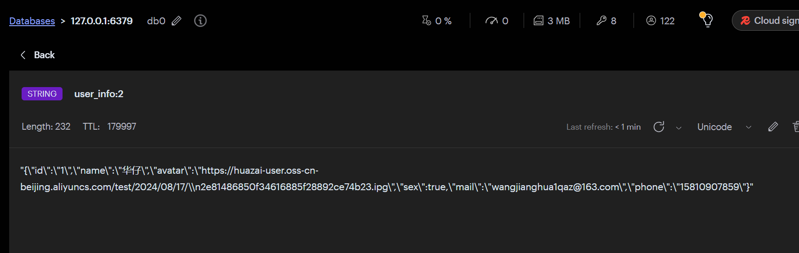

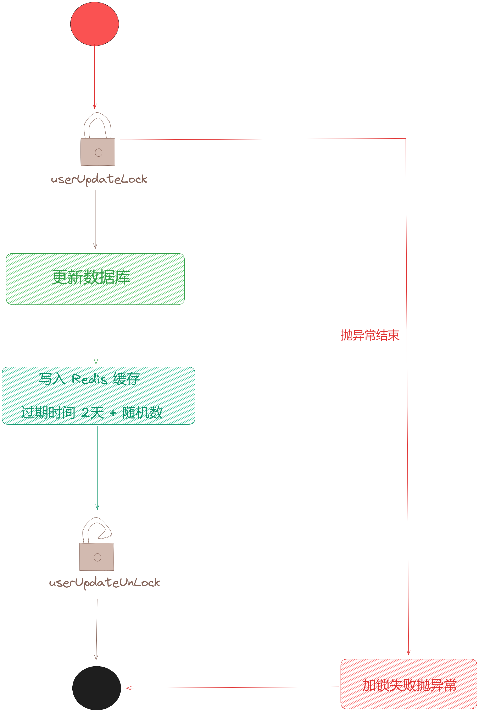

## **2.2 热点用户数据缓存自动延期方案**

在上一节中，我们分析了用户这种读多写少的场景，对于用户数据在写入的时候做一下缓存，在其他场景下读取用户数据就可以直接从缓存中进行读取了。

任何系统都可以通过「**二八定律**」来处理，对于大部分用户信息来说都是「**冷数据**」，很少有人访问的，所以到时间过期即可，只有少部分用户的数据是「**热数据**」，到时候访问会自动续期的，我们只保留这种「**热数据**」在缓存即可，既可以减少缓存空间，又可以在读取的时候达到高并发的效果。

因此这里我们做了一个机制：「**缓存自动延期机制**」，我们来看下获取用户信息方法。

  
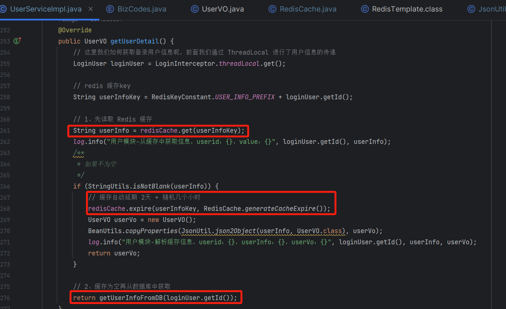

/\*\*

\* 从数据库中查询成功后继续写入缓存，这里也会加一个分布式锁

\* @param userId

\* @return

\*/

public UserVO getUserInfoFromDB(Long userId) {

// 这里增加分布式锁，同时间只能一个用户成功，避免重复请求

String userUpdateLockKey \= RedisKeyConstant.USER\_INFO\_PREFIX + userId;

boolean lock \= redisLock.lock(userUpdateLockKey);

if (!lock) {

log.info("用户缓存为空，从数据库获取用户信息获取锁失败，user:{}", userId);

throw new BizException(BizCodes.USER\_INFO\_LOCK\_FAIL);

}

try {

String userInfoKey \= RedisKeyConstant.USER\_INFO\_PREFIX + userId;

// 从数据库中获取用户信息

UserDO userDO \= userMapper.selectOne(new QueryWrapper<UserDO>().eq("id", userId));

// 这里我们返回 userVo 的信息, 需要通过拷贝 userDO 到 userVo 中

UserVO userVo \= new UserVO();

BeanUtils.copyProperties(userDO, userVo);

// 写入缓存，缓存过期时间 2天 + 随机几小时

redisCache.setCache(userInfoKey, userVo, RedisCache.generateCacheExpire());

return userVo;

} finally {

// 释放锁

redisLock.unlock(userUpdateLockKey);

}

}

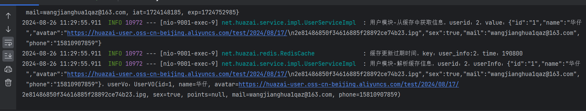

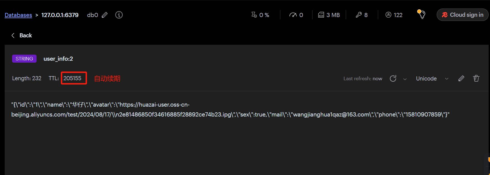

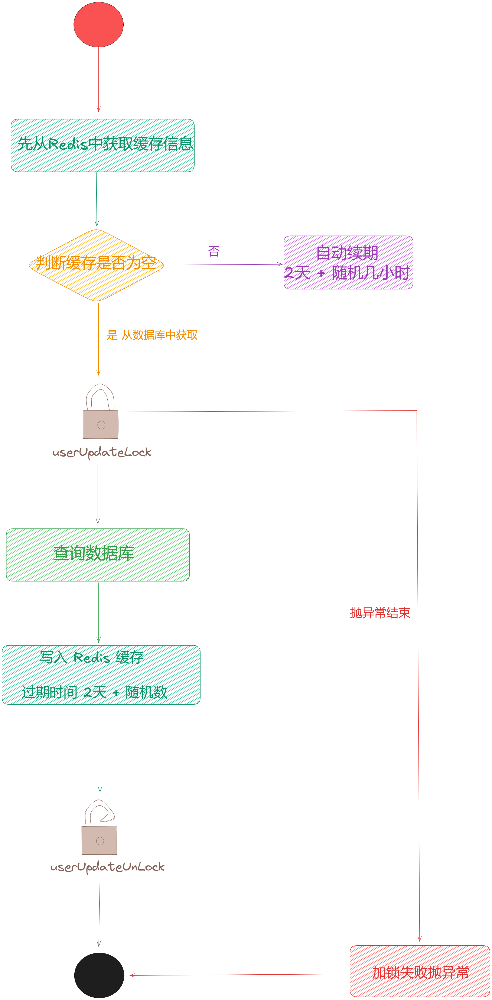

## **2.3 缓存惊群与穿透问题解决方案**

通过前面2节内容，我们设计了用户数据「**写入**」和 「**查询**」的缓存设计方案，如下：

1.  写入用户信息的时候是「**数据库+缓存双写**」方案，缓存默认过期时间为 2 天多的随机时间。
2.  读取用户信息的时候是「**先从缓存中读取**」，如果存在自动延期，如果不存在则「**从数据库中读取**」，再写入缓存中，缓存默认过期时间为 2 天多的随机时间。

### **2.3.1 什么是缓存惊群现象**

那么你有没有想过为什么要设计这样一个 2 天 + 随机几个小时的时间呢？只设置 2 天过期时间行不行？

其实这是缓存设计的一种策略，主要目的是为了防止「**缓存惊群**」现象的出现。

那么什么是「**缓存惊群**」呢？

> ‌缓存惊群现象‌又叫缓存雪崩，是指在大并发情况下，当一个缓存数据失效时，会导致同时有多个并发线程去向后端数据库发起请求以获取同一个数据。这种现象会导致在一段时间内同时生成大量的缓存请求，然后在另一段时间内又有大量的缓存失效，从而使得后端数据库的压力突然增大。这种现象可以称为“缓存过期产生的惊群现象”。
> 
> 为了防止这种惊群现象，可以利用“锁机制”来控制对数据库的访问，从而减少不必要的请求和资源浪费‌。

大致意思就是：如果都统一设置的是 2天的过期时间，等时间一过大量缓存信息统一过期，如果此时有大量用户浏览美食详情页，瞬时大量请求会打到数据库层，就会给数据库造成非常大的压力，可能瞬间被干宕机了。

> 通常情况下 8c16g 的 mysql 数据库，单台主库 2000 次/s 并发写是可以扛住的，从库 8c16g 可以达到 5000 多qps。

  
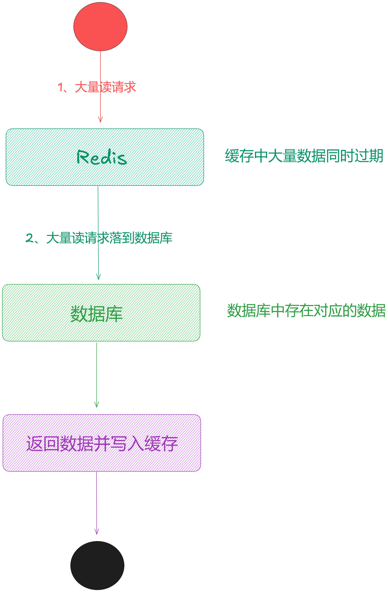

如果设置缓存的过期时间是「**随机**」的，这样就可以保证缓存不会在某一个时间点统一过期，从而避免发生「**缓存惊群**」现象。

  
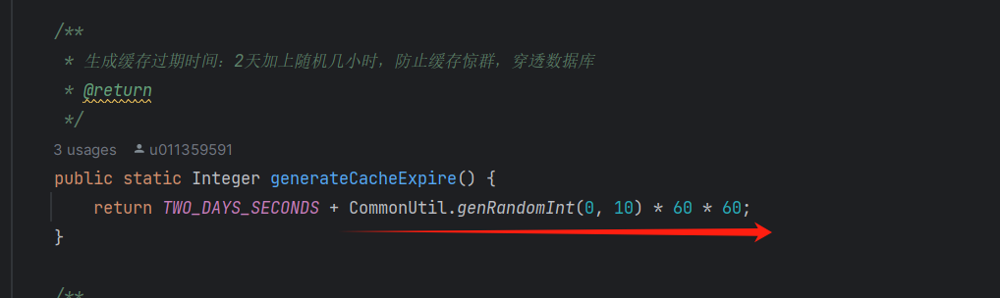  

另外还可以对缓存进行「**提前预热**」，常见的缓存预热方式有两种：

1.  使用定时任务，比如 xxl-job，来定时触发缓存预热的逻辑，将数据库中的热点数据查询出来并存入缓存中。
2.  使用消息队列，比如 Kafka，来异步地进行缓存预热，将数据库中的热点数据的主键或者 ID 发送到消息队列中，然后由缓存服务消费消息队列中的数据，根据主键或者 ID 查询数据库并更新缓存。

###   
**2.3.2 缓存穿透**

缓存穿透说简单点就是大量请求的 key 是不合理的，**根本不存在于缓存中，也不存在于数据库中** 。就导致这些请求直接落到了数据库上，根本没有经过缓存这一层，对数据库造成了巨大的压力，可能直接就被这么多请求干宕机了。

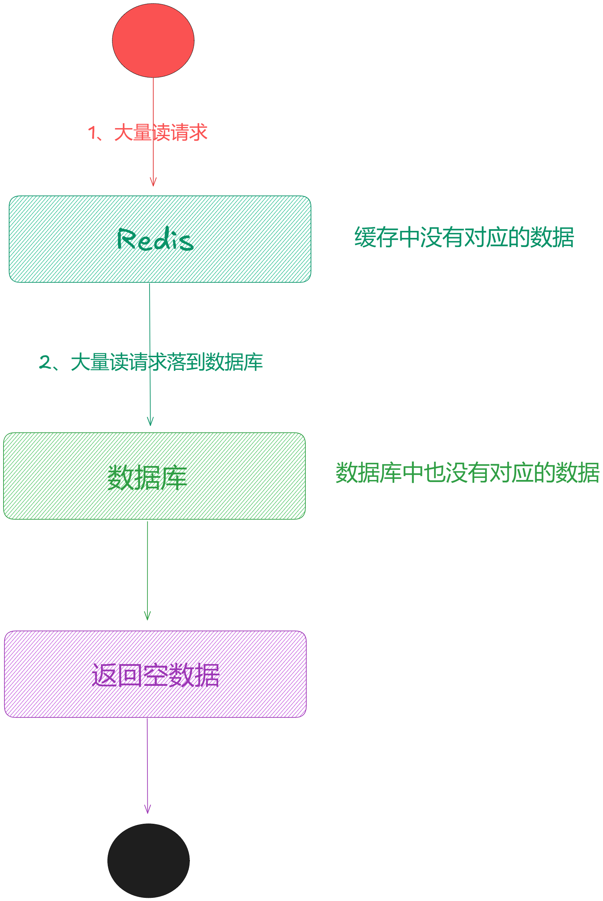

> 举个例子：某个黑客故意制造一些非法的 key 发起大量请求，导致大量请求落到数据库，结果数据库上也没有查到对应的数据。也就是说这些请求最终都落到了数据库上，对数据库造成了巨大的压力。

关于「**缓存穿透**」也好解决，「**设置空数据到缓存并返回空**」或者「**通过布隆过滤器**」解决，我们这里选择第一种。

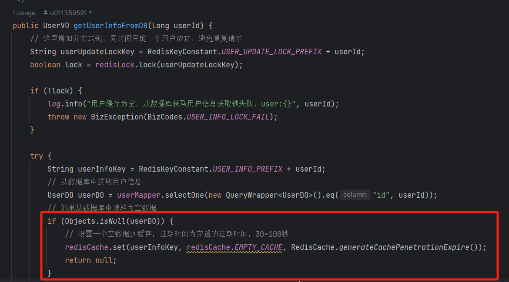

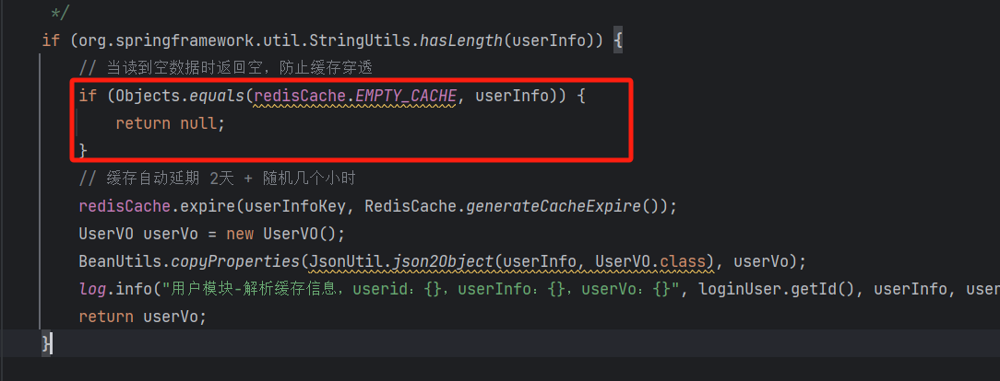  

关于「**布隆过滤器**」的处理方式，这里简单讲一下：

> 布隆过滤器是一个非常神奇的数据结构，通过它我们可以非常方便地判断一个给定数据是否存在于海量数据中。我们可以把它看作由二进制向量（或者说位数组）和一系列随机映射函数（哈希函数）两部分组成的数据结构。相比于我们平时常用的 List、Map、Set 等数据结构，它占用空间更少并且效率更高，但是缺点是其返回的结果是概率性的，而不是非常准确的。理论情况下添加到集合中的元素越多，误报的可能性就越大。并且，存放在布隆过滤器的数据不容易删除。

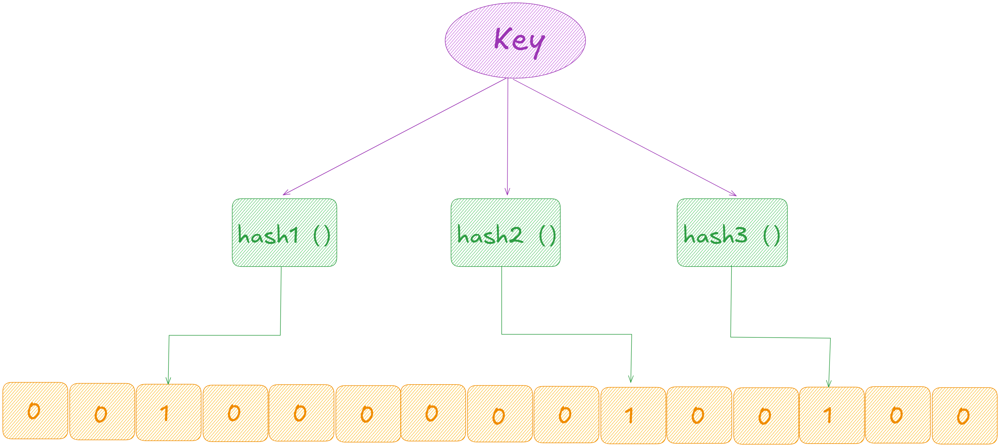

Bloom Filter 的简单原理示意图

[Bloom Filter](http://bloom%20filter/) 会使用一个较大的 bit 数组来保存所有的数据，数组中的每个元素都只占用 1 bit ，并且每个元素只能是 0 或者 1（代表 false 或者 true），这也是 [Bloom Filter](http://bloom%20filter/) 节省内存的核心所在。

这样来算的话，申请一个 [100w](http://100w/) 个元素的位数组只占用 [1000000Bit / 8 = 125000 Byte = 125000/1024 KB ≈ 122KB](http://1000000bit%20/%208%20=%20125000%20Byte%20=%20125000/1024%20KB%20%E2%89%88%20122KB) 的空间。

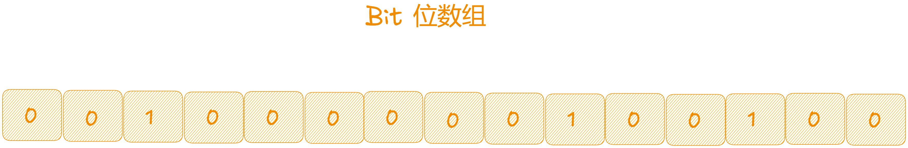

具体是这样做的：

1.  把所有可能存在的请求的值都存放在布隆过滤器中。
2.  当用户请求过来，先判断用户发来的请求的值是否存在于布隆过滤器中。
3.  不存在的话，直接返回请求参数错误信息给客户端，
4.  存在的话才会走下面的流程。

加入布隆过滤器之后的缓存处理流程图如下：

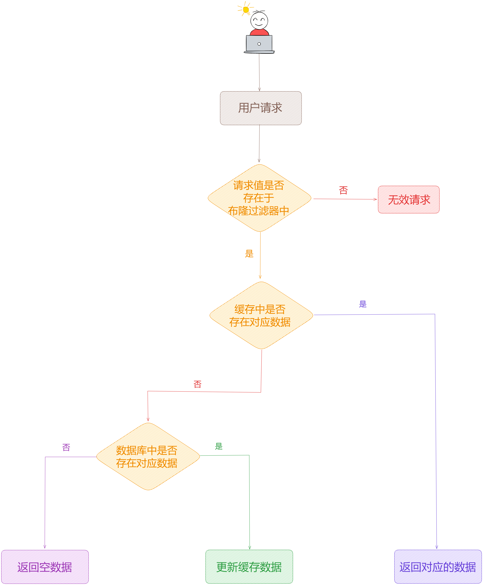

## **2.4 基于分布式锁下缓存与数据库双写一致性解决方案**

这里我们先来深度剖析下高并发极端场景下「**缓存 + 数据库双写不一致**」的问题。

###   
**2.4.1 高并发极端场景下读写不一致剖析**

在高并发极端场景下，同一时刻，一个 [线程 A](http://xn--%20a-980k56u/) 在「**修改用户信息**」，而另外一个 [线程 B](http://xn--%20b-980k56u/) 在「**读取用户信息**」，这样的场景是可能存在的，所以我们来剖析下：

1.  假设 [线程 B](http://xn--%20b-980k56u/) 优于 [线程 A](http://xn--%20a-980k56u/) 先进行「**读取用户信息**」的操作，根据上面的代码会先从「**缓存**」中读取用户信息，假设此时「**缓存 数据**」刚好过期了，确实没有读取到就会从「**数据库**」中进行读取。此时 [线程 A](http://xn--%20a-980k56u/) 还没进行处理，所以可能此时「**数据库**」的用户信息还是旧数据。
2.  但是 [线程 B](http://xn--%20b-980k56u/) 读取的旧数据还没来得及「**写入缓存**」，刚好此时凑巧 [线程 A](http://xn--%20a-980k56u/) 进行了「**修改用户信息**」的操作，根据上面的代码会先写「**数据库**」, 此时「**数据库**」已经变成最新数据了。同时 [线程 A](http://xn--%20a-980k56u/) 把最新的数据「**写入缓存**」中，此时「**缓存**」和 「**数据库**」都变成最新的数据了，最后返回「**修改用户信息**」成功。
3.  这时最大的问题就是 [线程 B](http://xn--%20b-980k56u/) 现在只是从「**数据库**」读取了旧数据还没来得及「**写入缓存**」，明明 [线程 A](http://xn--%20a-980k56u/) 已经将最新的数据写入「**数据库**」和 「**缓存**」了，但是 [线程 B](http://xn--%20b-980k56u/) 此时又把旧数据「**写入缓存**」了，相当于做了一个覆盖的操作，最终导致「**数据库**」和 「**缓存**」数据不一致了。

以上就是典型的在高并发极端场景下「**数据库**」和 「**缓存**」双写不一致的问题，那么针对这个问题，如何才能更好解决呢？

###   
**2.4.2 缓存+数据库双写一致性解决方案**

这里我给大家的一个简单可行的答案：就是要保证「**读操作**」和 「**写操作**」是「**串行化**」，此时就需要加一个「**分布式锁**」。

根据上面一版的代码来说，「**读操作**」和 「**写操作**」用了两把锁，虽然可以解决「**重复操作**」和 「**幂等性**」的问题，但是无法解决「**数据库**」和 「**缓存**」双写不一致的问题。

  
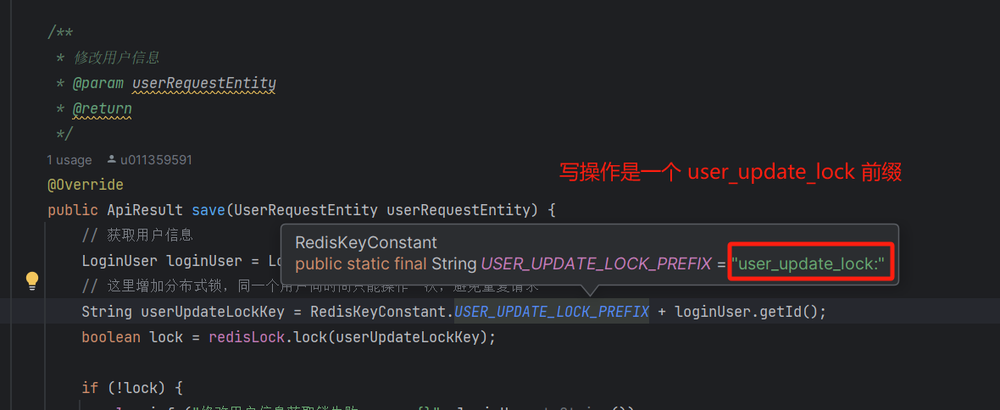

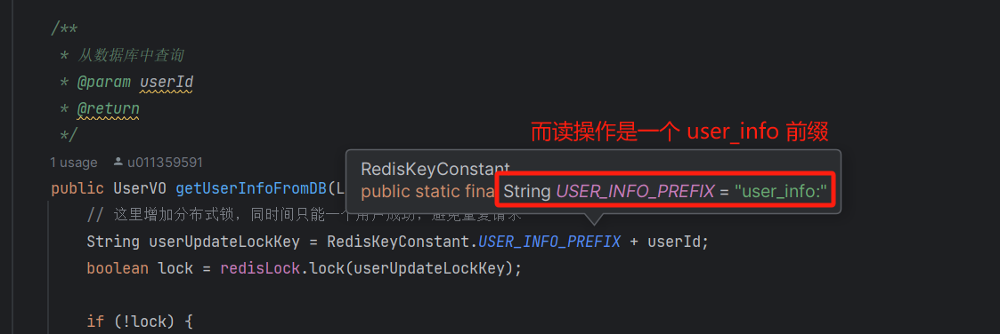

此时我们需要换一下锁，将「**两把锁**」改成「**同一把锁**」，使「**读操作**」和 「**写操作**」进行互斥。

对于用户数据来说，大概只有 1% 的情况下是「**写操作**」，剩下的 99% 的情况下「**读操作**」。即「**用户注册**」和「**用户信息更新**」操作是极少的，大部分情况下都是对「**用户数据**」进行查询，比如我们社区美食的商品详情页或者 首页 Feed 流页面需要查询用户信息，比如姓名、头像等。

接下来我们看下如何修改上一般代码，如下：

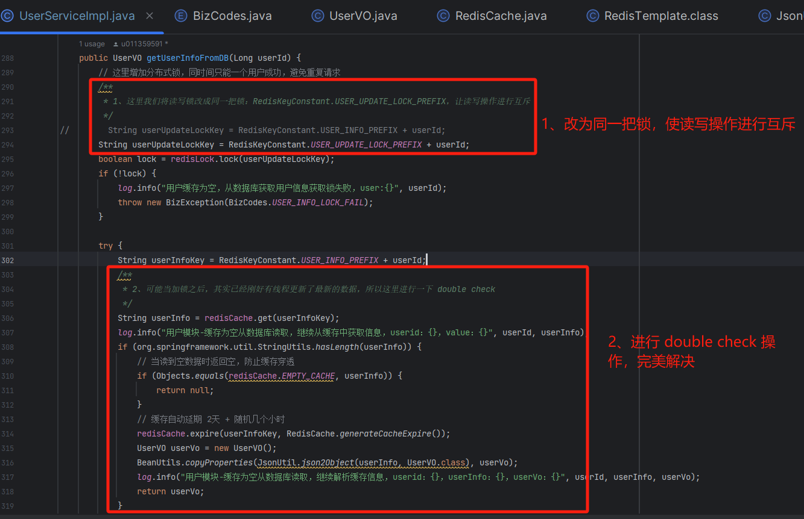

通过修改上面两处可以完美解决「**数据库**」和 「**缓存**」双写不一致的问题，还是上面的在高并发极端场景下，同一时刻，一个 [线程 A](http://xn--%20a-980k56u/) 在「**修改用户信息**」，而另外一个 [线程 B](http://xn--%20b-980k56u/) 在「**读取用户信息**」，这样的场景是可能存在的，所以我们还是按照 **2.4.2 小节** 那样「**通过两种情况**」来进行场景剖析下。

### **2.4.2.1 场景一**

1.  假设 [线程 A](http://xn--%20a-980k56u/) 先拿到分布式锁进行了「**修改用户信息**」的操作， [线程 B](http://xn--%20b-980k56u/) 被阻塞住了，此时 [线程 A](http://xn--%20a-980k56u/) 将用户信息进行了「**数据库**」和 「**缓存**」一起写入，「**数据库**」和 「**缓存**」都变成了最新的数据，然后 [线程 A](http://xn--%20a-980k56u/) 释放锁。
2.  那么当 [线程 B](http://xn--%20b-980k56u/) 拿到分布式锁进行了「**读取用户信息**」的操作时候，又进行了 [double check](http://double%20check/) 的操作，此时从 「**缓存**」中读取到了数据，就会进行自动延期，并返回数据。

### **2.4.2.2 场景二**

1.  假设 [线程 B](http://xn--%20b-980k56u/) 先拿到分布式锁进行了「**读取用户信息**」的操作， [线程 A](http://xn--%20a-980k56u/) 被阻塞住了，这里我们进行了 [double check](http://double%20check/) 的操作，此时「**缓存**」中并没有对应的数据，就会从「**数据库**」进行读取用户数据，如果取不到就写入一个空串到缓存中防止穿透，否则就会写「**缓存**」，此时 「**缓存**」和 「**数据库**」可能都是旧数据，因为 [线程 A](http://xn--%20a-980k56u/) 还没有进行 「**修改用户信息**」的操作，最终 [线程 B](http://xn--%20b-980k56u/) 返回旧数据并释放锁。
2.  那么当 [线程 A](http://xn--%20a-980k56u/) 拿到分布式锁进行了「**修改用户信息**」的操作，此时 [线程 A](http://xn--%20a-980k56u/) 将用户信息进行了「**数据库**」和 「**缓存**」一起写入，「**数据库**」和 「**缓存**」都变成了最新的数据，最终「**数据库**」和 「**缓存**」数据一致了。

通过上面的剖析是不是就解决了「**数据库**」和 「**缓存**」双写不一致的问题。

### **2.4.3 高并发场景下分布式锁优化**

虽然通过上面的代码修改可以解决「**数据库**」和 「**缓存**」双写不一致的问题，但是可能会出现另外一个「**更加极端**」的 场景，我们来看下：

前提：可能某个用户的信息平时很少有人访问，「**缓存**」中数据早就过期了，突然之间该用户火了，一瞬间涌入了大量的请求来查询该用户的信息，即高并发的「**读操作**」都穿透了「**缓存**」到了「**读数据库**」+ 「**更新缓存**」[getUserInfoFromDB](http://getuserinfofromdb/) 方法中 ，通过代码得知，我们在该方法的入口处加了「**分布式锁**」，此时就会有大量的线程在「**排队等待**」获取「**分布式锁**」，此时就会导致非常严重的「**锁竞争**」问题，就会导致线程排队串行化。

那么我们就需要对此处进行优化，如何进行优化呢？

其实也简单，就是我们只要保证有「**一个线程**」能够拿到「**分布式锁**」，进行「**读数据库**」+ 「**更新缓存**」的操作即可，其他线程就不要等待锁了，此时「**数据库**」和「**缓存**」都是最新的数据了，只需要从「**缓存**」中高并发读即可，即：「**串行**」转 「**并发**」。

我们来看看如何优化，先对加锁进行超时处理：

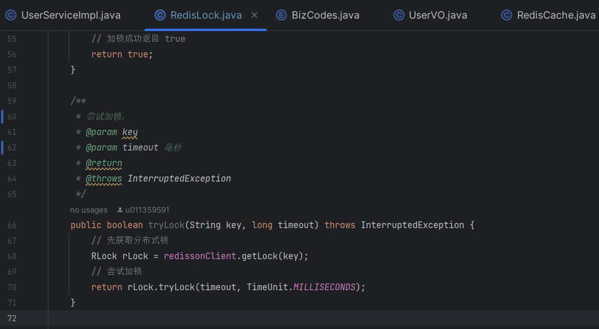

接着来看 [getUserInfoFromDB](http://getuserinfofromdb/) 方法优化：

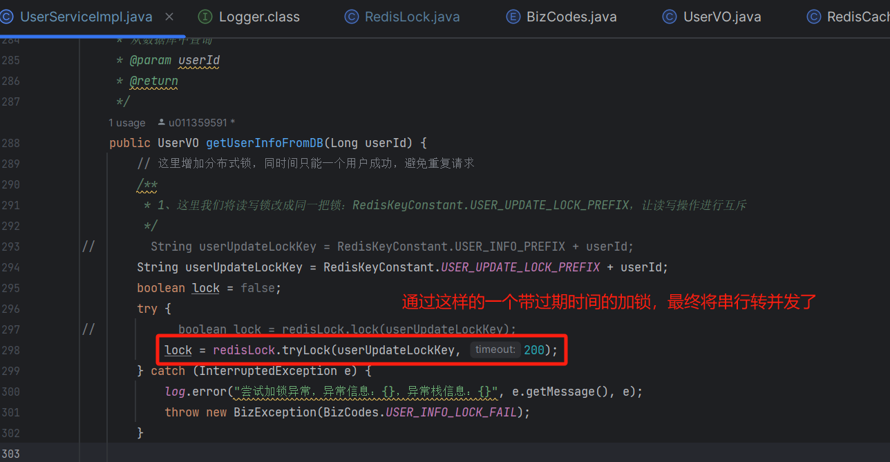

## **2.5 用户缓存体系代码重构**

最后我们来对上面这几个版本的代码进行一下重构，将冗余的代码进行优化，使其更加优雅。

/\*\*

\* 查询个人信息

\* @return

\*/

@Override

public UserVO getUserDetail() {

// 这里我们如何获取登录用户信息呢，前面我们通过 ThreadLocal 进行了用户信息的传递

LoginUser loginUser \= LoginInterceptor.threadLocal.get();

// 1、先读取 Redis 缓存

UserVO user \= getUserInfoFromCache(loginUser.getId());

if (user != null) {

return user;

}

// 2、缓存为空再从数据库中获取

return getUserInfoFromDB(loginUser.getId());

}

/\*\*

\* 从缓存中读取对应数据

\* @param userId

\* @return

\*/

private UserVO getUserInfoFromCache(Long userId) {

// redis 缓存key

String userInfoKey \= RedisKeyConstant.USER\_INFO\_PREFIX + userId;

String userInfo \= redisCache.get(userInfoKey);

log.info("用户模块-从缓存中获取信息，userid：{}，value：{}", userId, userInfo);

/\*\*

\* 如果不为空

\*/

if (org.springframework.util.StringUtils.hasLength(userInfo)) {

// 当读到空数据时返回空，防止缓存穿透

if (Objects.equals(redisCache.EMPTY\_CACHE, userInfo)) {

return null;

}

// 缓存自动延期 2天 + 随机几个小时

redisCache.expire(userInfoKey, RedisCache.generateCacheExpire());

UserVO userVo \= new UserVO();

BeanUtils.copyProperties(JsonUtil.json2Object(userInfo, UserVO.class), userVo);

log.info("用户模块-解析缓存信息，userid：{}，userInfo：{}，userVo：{}", userId, userInfo, userVo);

return userVo;

}

return null;

}

/\*\*

\* 从数据库中查询

\* @param userId

\* @return

\*/

public UserVO getUserInfoFromDB(Long userId) {

// 这里增加分布式锁，同时间只能一个用户成功，避免重复请求

/\*\*

\* 1、这里我们将读写锁改成同一把锁：RedisKeyConstant.USER\_UPDATE\_LOCK\_PREFIX，让读写操作进行互斥

\*/

String userUpdateLockKey \= RedisKeyConstant.USER\_UPDATE\_LOCK\_PREFIX + userId;

boolean lock \= false;

try {

lock = redisLock.tryLock(userUpdateLockKey, RedisCache.USER\_UPDATE\_LOCK\_TIMEOUT);

} catch (InterruptedException e) {

// 锁异常后再次从缓存中查询

UserVO user \= getUserInfoFromCache(userId);

if (user != null) {

return user;

}

log.error("尝试加锁异常，异常信息：{}，异常栈信息：{}", e.getMessage(), e);

throw new BizException(BizCodes.USER\_INFO\_LOCK\_FAIL);

}

if (!lock) {

// 锁超时失败后再次从缓存中查询

UserVO user \= getUserInfoFromCache(userId);

if (user != null) {

return user;

}

log.info("用户缓存为空，从数据库获取用户信息获取锁失败，user:{}", userId);

throw new BizException(BizCodes.USER\_INFO\_LOCK\_FAIL);

}

try {

String userInfoKey \= RedisKeyConstant.USER\_INFO\_PREFIX + userId;

/\*\*

\* 2、可能当加锁之后，其实已经刚好有线程更新了最新的数据，所以这里进行一下 double check

\*/

// 锁失败后再次从缓存中查询

UserVO user \= getUserInfoFromCache(userId);

if (user != null) {

return user;

}

log.info("用户缓存为空，从数据库获取用户信息，user:{}", userId);

// 从数据库中获取用户信息

UserDO userDO \= userMapper.selectOne(new QueryWrapper<UserDO>().eq("id", userId));

// 如果从数据库中读取为空数据

if (Objects.isNull(userDO)) {

// 设置一个空数据到缓存，过期时间为穿透的过期时间，30~100秒

redisCache.set(userInfoKey, redisCache.EMPTY\_CACHE, RedisCache.generateCachePenetrationExpire());

return null;

}

// 这里我们返回 userVo 的信息, 需要通过拷贝 userDO 到 userVo 中

UserVO userVo \= new UserVO();

BeanUtils.copyProperties(userDO, userVo);

// 写入缓存，缓存过期时间 2天 + 随机几小时

redisCache.setCache(userInfoKey, userVo, RedisCache.generateCacheExpire());

return userVo;

} finally {

// 释放锁

redisLock.unlock(userUpdateLockKey);

}

}

/\*\*

\* 修改用户信息

\* @param userRequestEntity

\* @return

\*/

@Override

public ApiResult save(UserRequestEntity userRequestEntity) {

// 获取用户信息

LoginUser loginUser \= LoginInterceptor.threadLocal.get();

// 这里增加分布式锁，同一个用户同时间只能操作一次，避免重复请求

String userUpdateLockKey \= RedisKeyConstant.USER\_UPDATE\_LOCK\_PREFIX + loginUser.getId();

boolean lock \= redisLock.lock(userUpdateLockKey);

if (!lock) {

log.info("修改用户信息获取锁失败，user:{}", loginUser.toString());

throw new BizException(BizCodes.USER\_UPDATE\_LOCK\_FAIL);

}

try {

// 更新用户数据

UserDO userDO \= new UserDO();

BeanUtils.copyProperties(userRequestEntity, userDO);

// 重新设置修改时间

userDO.setUpdateTime(new Date());

userDO.setId(loginUser.getId());

// 新增收货地址

int rows \= userMapper.update(userDO, new QueryWrapper<UserDO>().eq("id", loginUser.getId()));

log.info("用户模块-修改用户信息：rows={}，data={}", rows, userDO);

// 写入缓存

if (rows == 1) {

// 缓存过期时间

redisCache.setCache(RedisKeyConstant.USER\_INFO\_PREFIX + loginUser.getId(), userRequestEntity,

RedisCache.generateCacheExpire());

}

} finally {

// 释放锁

redisLock.unlock(userUpdateLockKey);

}

return null;

}