从今天之后的一段时间内，华仔会带着大家一起从零开始搭建并研发一套高并发的电商实战项目，这里会涉及到很多互联网大厂开发过程中所使用的核心技术和架构设计模式，希望大家学完之后可以用到自己的简历中。

接下来我们会重点架构设计和开发一下我们高并发电商实战项目中的「**商品中心服务**」。

这是第四十一篇，本篇我们继续进行电商实战项目设计与开发，本篇将进行「**商品中心服务**」 Elasticsearch 写入10W商品数据基础功能接口开发。

文章汇总位置：[https://wx.zsxq.com/dweb2/index/columns/51122554151214](https://wx.zsxq.com/dweb2/index/columns/51122554151214)

源码授权与获取地址：[https://articles.zsxq.com/id\_1s85grnaae4p.html](https://articles.zsxq.com/id_1s85grnaae4p.html)

本章源码地址：[https://gitcode.net/u011359591/huazai-ecshop/-/tree/ecshop-chapter-41](https://gitcode.net/u011359591/huazai-ecshop/-/tree/ecshop-chapter-41)

## **01 前言**

终于要设计与研发电商项目代码了，今天我们主要对「**商品中心服务**」 Elasticsearch 写入10W商品数据基础功能接口开发。

这里需要注意下，我们整个项目目前是不提供前端的，这个后续有时间在搞，主要是进行后端接口以及微服务模块架构设计。

## **02 商品中心服务 ES 基础写入功能**

本篇主要来开发一下 ES 基础写入功能接口，实现基础的写入、查询功能。

## **2.1 ES 客户端 RestHignLevelClient**

这里我们主要使用 ES 的 [RestHighLevelClient](http://resthighlevelclient%20/) 客户端，它作为 ElasticSearch 备受推荐的客户端组件，其封装系统操作 ES 的方法，包括「**索引结构管理**」、「**数据增删改查管理**」、「**常用查询方法**」，并且可以「**索结合原生 ES 查询原生语法**」，功能十分强大。

  
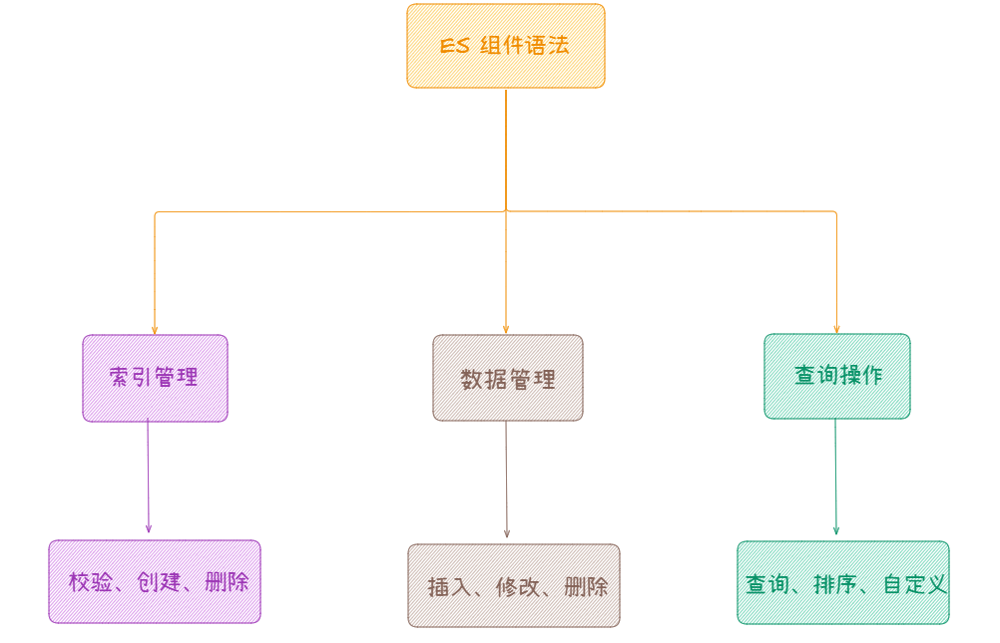

在使用 [RestHighLevelClient](http://resthighlevelclient/) 的语法时，通常涉及上面几个方面，在掌握基础用法之上可以根据业务特点进行一些自定义封装，这样可以更优雅的解决业务需求。

## **2.2 项目引入 ES 依赖**

SpringBoot 连接 ElasticSearch，主流的方式有以下四种方式:

1.  通过 [Elastic Transport Client](http://elastic%20transport%20client/) 客户端连接 es 服务器，底层基于 TCP 协议通过 transport 模块和远程 ES 服务端通信，不过，从「**V7.0**」开始官方不建议使用，「**V8.0**」开始正式移除。
2.  通过 [Elastic Java Low Level Rest Client](http://elastic%20java%20low%20level%20rest%20client/) 客户端连接 es 服务器，底层基于 HTTP 协议通过 restful API 来和远程 ES 服务端通信，只提供了最简单最基本的 API。
3.  通过 [Elastic Java High Level Rest Client](http://elastic%20java%20high%20level%20rest%20client/) 客户端连接 es 服务器，底层基于 [Elastic Java Low Level Rest Client](http://elastic%20java%20low%20level%20rest%20client/) 客户端做了一层封装，提供了更高级得 API 且和 [Elastic Transport Client](http://elastic%20transport%20client/) 接口及参数保持一致，「**官方推荐的 es 客户端**」。
4.  通过 [JestClient](http://jestclient/) 客户端连接 es 服务器，这是开源社区基于 HTTP 协议开发的一款 es 客户端，官方宣称接口及代码设计比 ES 官方提供的 Rest 客户端更简洁、更合理，更好用，具有一定的 ES 服务端版本兼容性，但是更新速度不是很快，目前 ES 版本已经出到 V7.9，但是JestClient只支持 V1.0~V6.X 版 本的 ES。

还有一个需要大家注意的地方，那就是版本号的兼容！

在开发过程中，大家尤其需要关注一下客户端和服务端的版本号，要尽可能保持一致，比如服务端 es 的版本号是7.9.3，那么连接 es 的客户端版本号，最好也是 7.9.3，即使因项目的原因不能保持一致，客户端的版本号必须在7.9.0 ～7.9.3，不要超过服务器的版本号，这样客户端才能保持正常工作，否则会出现很多意想不到的问题，假如客户端是 8.5.x 的版本号，此时的程序会各种报错，甚至没办法用！

为什么要这样做呢？主要原因就是 es 的服务端，高版本不兼容低版本；某些 API 请求参数结构有着很大的区别，所以客户端和服务端版本号尽量保持一致。

这里我们直接使用 [Elastic Java High Level Rest Client](http://elastic%20java%20high%20level%20rest%20client/) 客户端。

官方 API：[https://www.elastic.co/guide/en/elasticsearch/client/java-rest/current/java-rest-high.html](https://www.elastic.co/guide/en/elasticsearch/client/java-rest/current/java-rest-high.html)

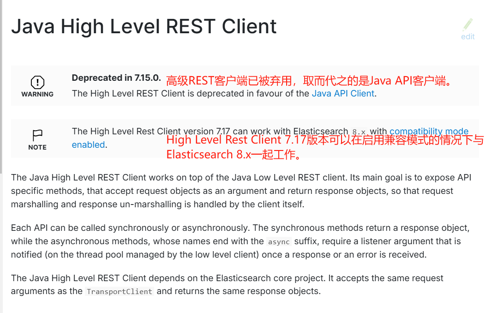

可以看到高级 API 在 7.17 版本之后被废弃了，但是可以启动兼容模式下与 8.x 版本一起工作。

兼容模式：[https://www.elastic.co/guide/en/elasticsearch/client/java-rest/current/java-rest-high-compatibility.html](https://www.elastic.co/guide/en/elasticsearch/client/java-rest/current/java-rest-high-compatibility.html)

这里我们已经将 es 版本从 8.5.2 降到 7.9.3 版本了。

<!--引入es-high-level-client相关依赖 start-->

<dependency>

<groupId>org.elasticsearch</groupId>

<artifactId>elasticsearch</artifactId>

<version>7.9.3</version>

</dependency>

<dependency>

<groupId>org.elasticsearch.client</groupId>

<artifactId>elasticsearch-rest-client</artifactId>

<version>7.9.3</version>

</dependency>

<dependency>

<groupId>org.elasticsearch.client</groupId>

<artifactId>elasticsearch-rest-high-level-client</artifactId>

<version>7.9.3</version>

</dependency>

<!--引入es-high-level-client相关依赖 end-->

</dependencies>

这里，高级 API 我们使用的 7.9.3 版本，依赖加载如下：

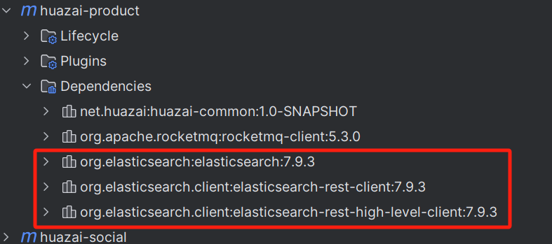

但是启动时会报错，如下：

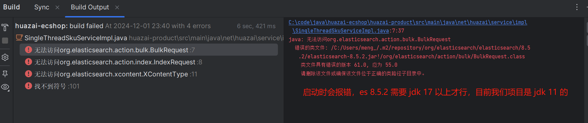

解决办法，切换到 jdk 17，重新启动，虽然 es 版本已经降到 7.9.3，这里就不动了，以后都基于 jdk 17 了。

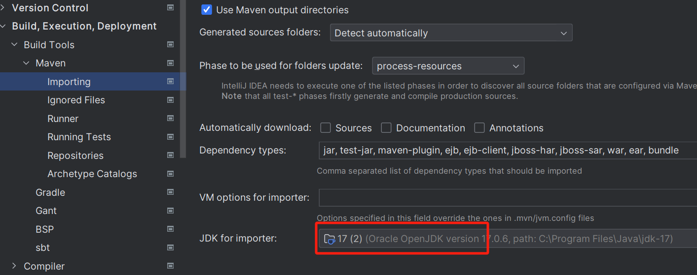

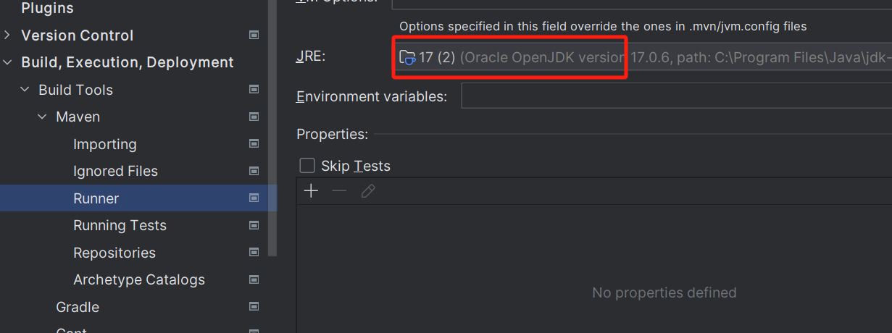

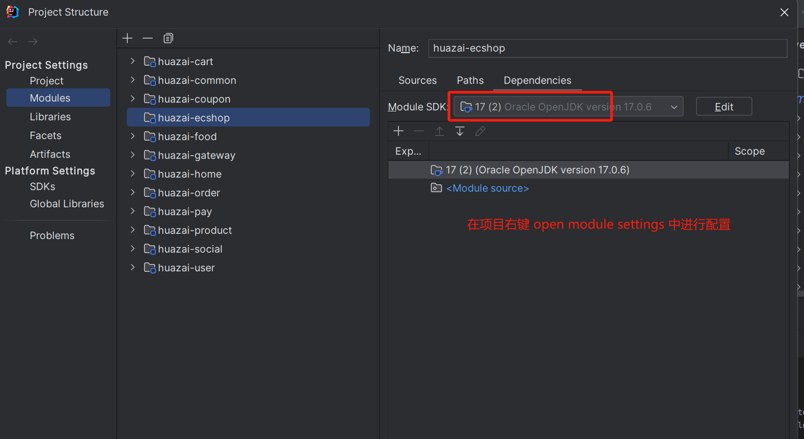

修改 pom.xml 编译相关配置，从 11 改成 17，后续项目都用 jdk 17 来编译。

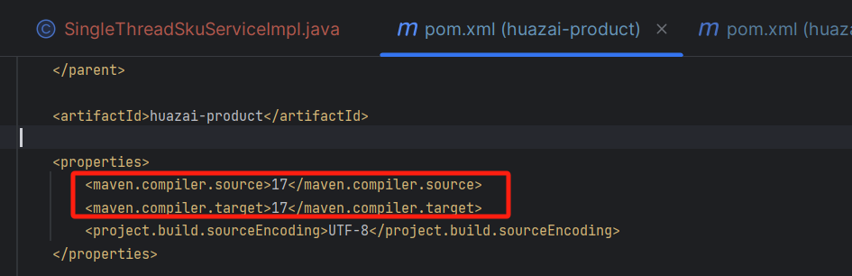

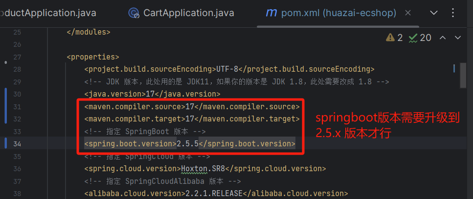

## **2.3 基础功能开发**

### **2.3.1 配置 es 连接地址**

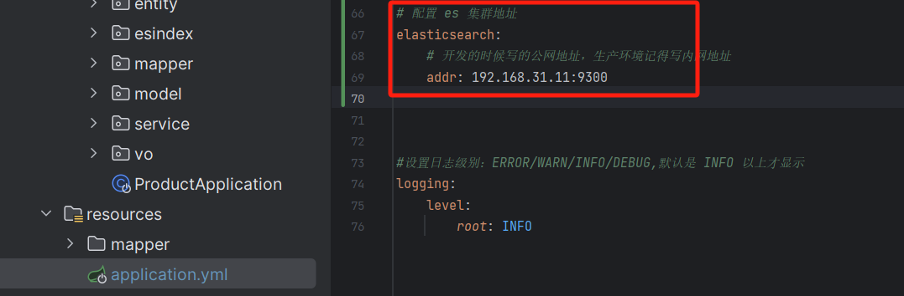

### **2.3.2 初始化高级客户端**

@Configuration

public class ElasticSearchConfig {

/\*\*

\* elasticsearch 生产集群地址，本地的话就一个地址

\*/

@Value("${elasticsearch.addr}")

private String addr;

/\*\*

\* 初始化 RestHighLevelClient 客户端

\* @return

\*/

@Bean(destroyMethod = "close")

public RestHighLevelClient restHighLevelClient() {

// 切割集群地址

String\[\] segments = addr.split(",");

// 初始化 es 节点 http 对象

HttpHost\[\] esNodes = new HttpHost\[segments.length\];

// 循环集群地址

for (int i \= 0; i < segments.length; i++) {

// 初始化 es 节点 http 对象

String\[\] hostAndPort = segments\[i\].split(":");

esNodes\[i\] = new HttpHost(hostAndPort\[0\], Integer.parseInt(hostAndPort\[1\]), "http");

}

// 初始化高级客户端对象

return new RestHighLevelClient(RestClient.builder(esNodes));

}

}

### **2.3.3 10w 条商品数据说明**

这里我准备了 10w 条商品 mock 数据，如下：

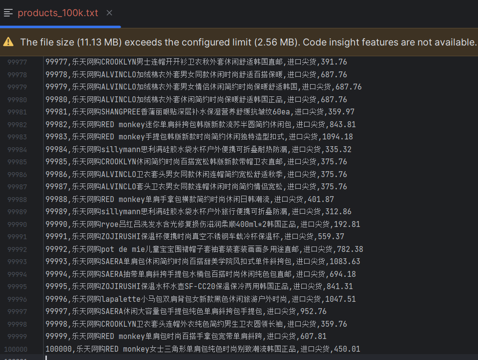

关于批量 bulk 官方文档：[https://www.elastic.co/guide/en/elasticsearch/client/java-rest/7.17/java-rest-high-document-bulk.html](https://www.elastic.co/guide/en/elasticsearch/client/java-rest/7.17/java-rest-high-document-bulk.html)。

### **2.3.3 单线程批量写入 10w 条商品数据**

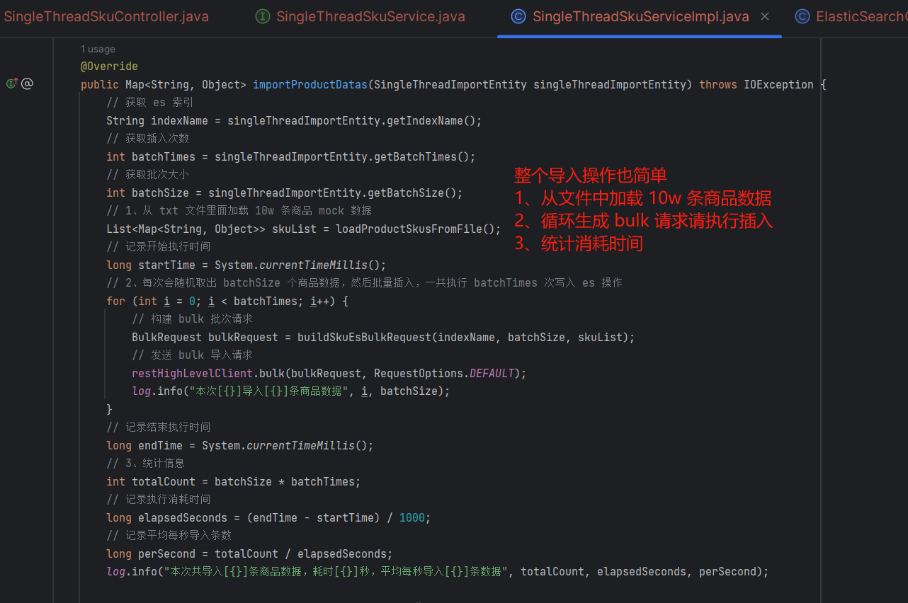

具体细节，请下载代码后查看，这里就不贴了。

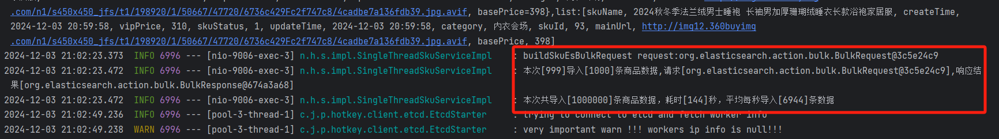

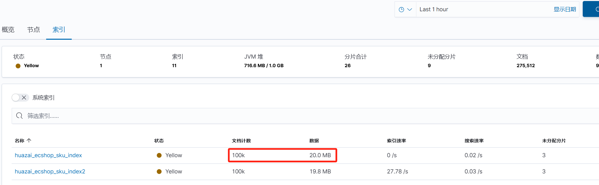

上面测试有问题，次数填错了应该是 100 而不是 1000（100w了），不过随机读取商品数据的话，感觉会有丢失，下面是 10W 的新测试。

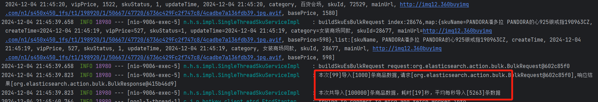

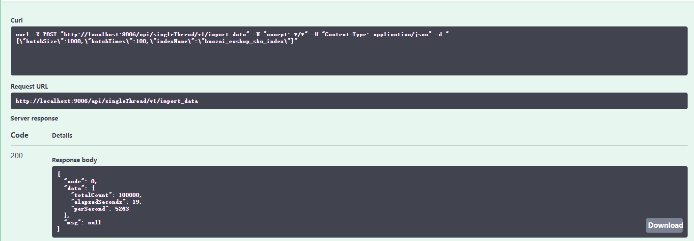

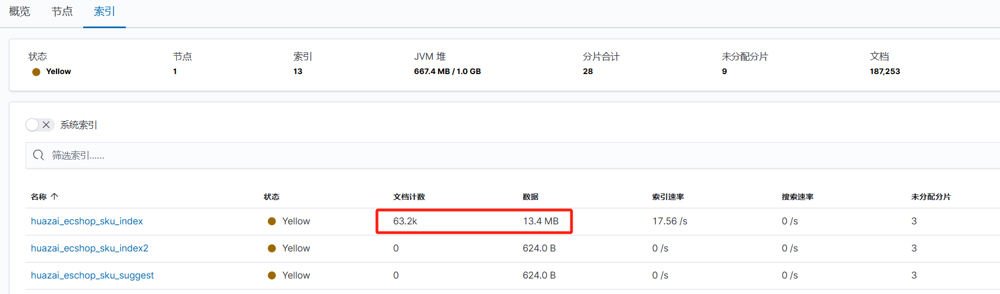

随机全文搜索一个关键词：

POST huazai\_ecshop\_sku\_index/\_search

{

"query" :{

"match": { "skuName" : "男装"}

}

}

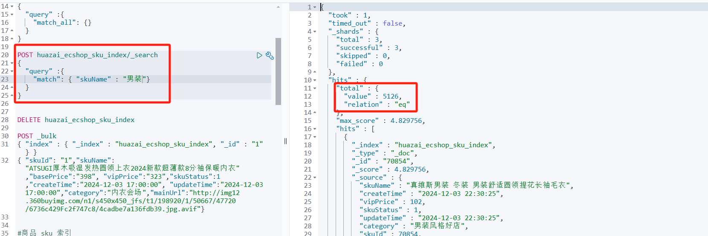

### **2.3.4 多线程批量写入 10w 条商品数据**

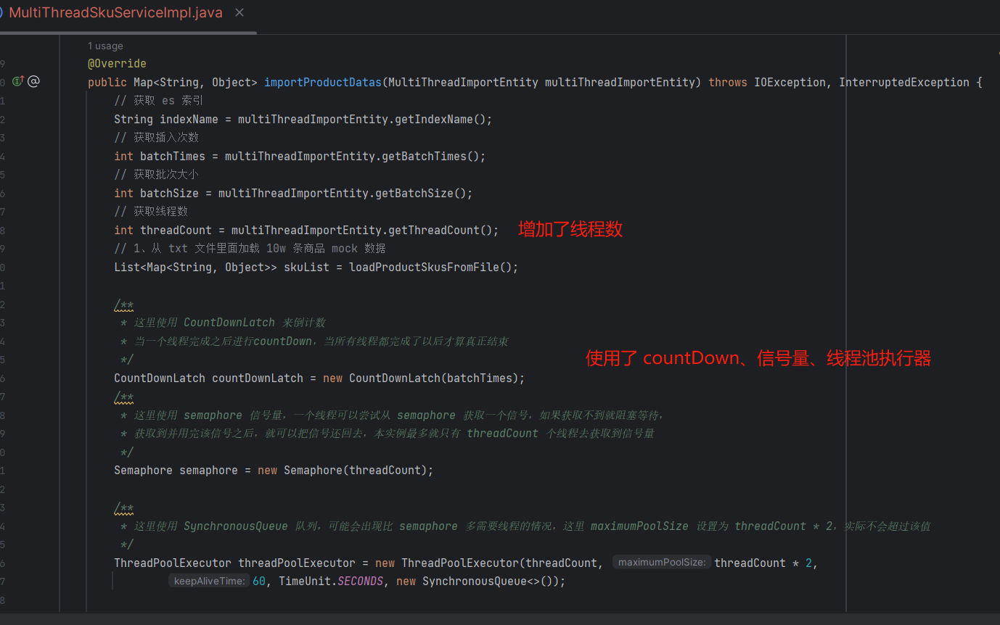

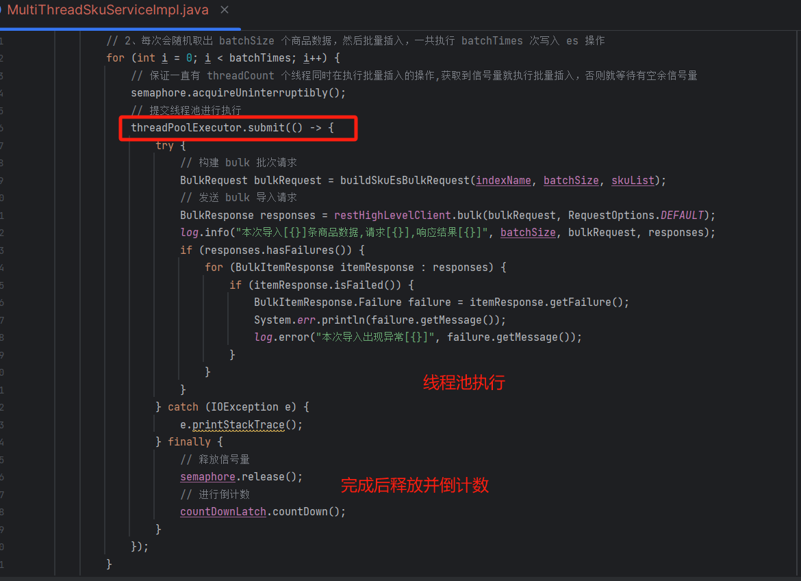

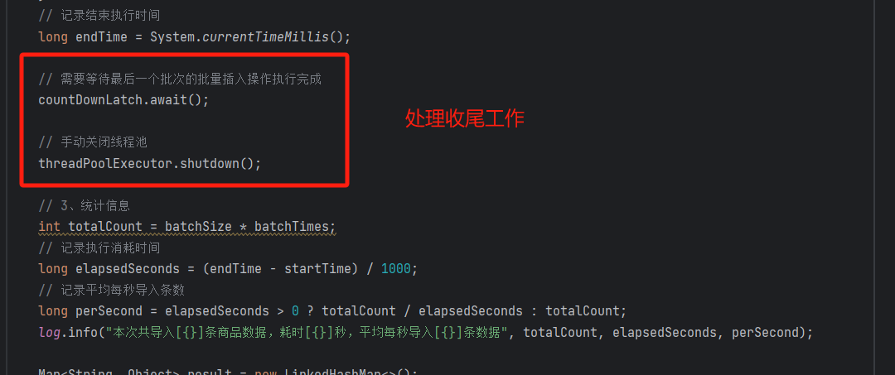

看到这里我们使用了「**并发编程**」的相关技术，主要有：[CountDownLatch](http://countdownlatch/)、[Semaphore](http://semaphore/)、[ThreadPoolExecutor](http://threadpoolexecutor/)、[SynchronousQueue](http://synchronousqueue/)。

整个处理流程图如下：

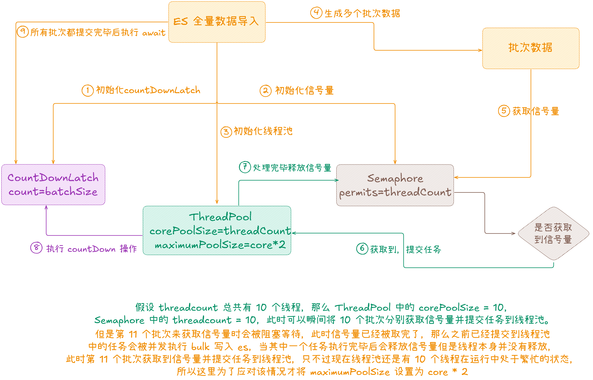

下面我们来分别介绍下使用的几个多线程并发技术。

### **2.3.4.1 CountDownLatch 介绍**

[CountDownLatch](http://countdownlatch%20/) 是 [java.util.concurrent](http://java.util.concurrent/) 包的一部分，用于同步一个或多个线程以等待特定条件的满足。它在创建时初始化一个给定的计数，表示必须发生的事件数量，才能使线程继续执行。这个计数通过调用 [countDown()](http://countdown\(\)%20/) 方法来递减，等待该条件的线程调用 [await()](http://await\(\)/) 方法来阻塞，直到计数达到零。

### **CountDownLatch 关键组件**

1.  计数：[CountDownLatch](http://countdownlatch%20/) 的核心概念是计数。它从创建锁存器时指定的初始值开始，只能递减，不能重置。
2.  [await()](http://await\(\)%20/) ：线程使用此方法等待计数达到零。如果当前计数大于零，这些线程将被置于等待状态。
3.  [countDown()](http://countdown\(\)%20/) ：调用此方法以递减计数。当计数达到零时，所有等待的线程将被释放。
4.  线程安全：[CountDownLatch](http://countdownlatch/) 是线程安全的，它使用内部的 [AQS（AbstractQueuedSynchronizer）](http://aqs\(abstractqueuedsynchronizer\)/)来管理状态，确保计数的可见性和原子性。

### **CountDownLatch 工作原理**

[CountDownLatch](http://countdownlatch/) 本质上是一种简化的信号量（[Semaphore](http://semaphore/)）。它的核心思想是设定一个计数器，当计数器值为 0 时，其他被阻塞的线程才会开始运行，线程的释放建立在调用 [countDown](http://countdown%20/) 方法去减少计数器次数的基础上。

[CountDownLatch](http://countdownlatch%20/) 的典型功能包括：

1.  使多个线程等待一系列事件发生。
2.  让一个线程等待完成多个步协作操作的线程。
3.  在某个条件达到之前阻塞线程。

它包含了两个核心方法：

1.  [countDown()](http://countdown\(\)/): 当前线程执行完任务后，调用该方法时，计数器 -1；当计数器为 1，调用该方法可以使计数器变为 0。
2.  [await()](http://await\(\)/): 当前线程调用后，会阻塞，进入等待状态，直到计数器为 0。

通过这两种操作，我们就可以构建出各种灵活的并发控制逻辑，整个流程图如下：

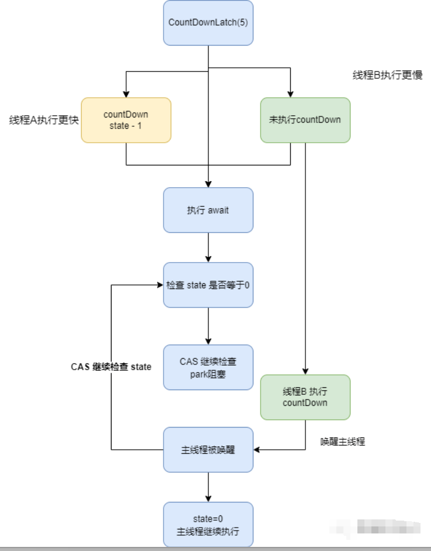

### **2.3.4.2 Semaphore 介绍**

[Semaphore](http://semaphore/)，即信号量，是操作系统中的一个经典概念。在 Java 并发包（ [java.util.concurrent](http://java.util.concurrent/)，简称JUC）中，[Semaphore](http://semaphore/) 类实现了这一概念，用于控制同时访问特定资源的线程数量。与 [synchronized](http://synchronized/) 关键字和[ReentrantLock](http://reentrantlock/) 类不同，[Semaphore](http://semaphore/) 可以实现更为复杂的线程同步需求，允许一定数量的线程同时访问共享资源。

### **Semaphore 工作原理**

[Semaphore](http://semaphore%20/) 内部维护了一组许可证（permits）。每个线程在访问共享资源之前，必须先获取一个许可证。如果许可证不足，则线程将被阻塞，直到有许可证可用。当线程释放资源时，它会归还一个许可证，从而允许其他等待的线程获取资源。

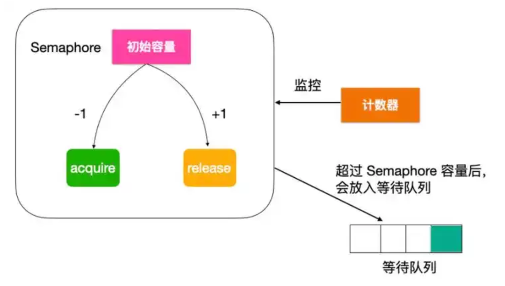

通过控制许可证的数量，[Semaphore](http://semaphore/) 可以实现对共享资源访问的精细控制。例如，如果有一个需要限制并发访问次数的资源池，就可以使用 [Semaphore](http://semaphore/) 来实现。

### **Semaphore 特性**

1.  公平性：[Semaphore](http://semaphore/) 可以配置为公平的或非公平的。公平的 [Semaphore](http://semaphore/) 将按照线程请求许可证的顺序来分配它们，而非公平的 [Semaphore](http://semaphore/) 则不保证这种顺序。
2.  可重用性：与 [CountDownLatch](http://countdownlatch/) 等一次性使用的同步工具不同，[Semaphore](http://semaphore/) 可以多次使用。一旦线程释放了许可证，其他线程就可以再次获取它。
3.  资源池控制：通过调整许可证的数量，[Semaphore](http://semaphore/) 可以灵活地控制对资源池的并发访问。这对于保护有限资源或实现流量控制非常有用。

### **Semaphore 适应场景**

1.  保护有限资源：当需要限制对某个资源池的并发访问次数时，可以使用Semaphore。例如，数据库连接池或线程池。
2.  流量控制：在需要限制对某个服务的并发请求数时，可以使用Semaphore作为限流器。这可以防止系统过载并保持稳定的性能。
3.  实现复杂的同步模式：与其他同步工具结合使用，Semaphore可以实现更复杂的线程同步模式，如读写锁等。

### **2.3.4.3 ThreadPoolExecutor 介绍**

[ThreadPoolExecutor‌](http://xn--threadpoolexecutor-wj9j/) 是 Java 中一个非常重要的线程池实现类，位于 [java.util.concurrent](http://java.util.concurrent/) 包中。它是[ExecutorService](http://executorservice/) 接口的一个实现，用于管理和调度线程以高效地执行一组可并行或异步处理的任务‌。其主要功能是管理一组工作线程，这些线程可以执行提交给线程池的任务。它通过减少线程创建和销毁的开销，提高了资源利用率和系统性能。线程池可以配置为固定大小、可缓存或单线程等不同类型，以适应不同的应用场景‌。

它适用于需要大量异步任务处理的应用场景，能够显著提高性能并降低资源消耗。通过复用线程，避免了频繁创建和销毁线程的开销，提高了系统的响应速度和资源利用率‌。

### **ThreadPoolExecutor 工作原理**

1.  线程集合：核心线程和工作线程。
2.  阻塞队列：用于待执行任务排队。
3.  拒绝策略处理器：阻塞队列满后，对任务处理进行。

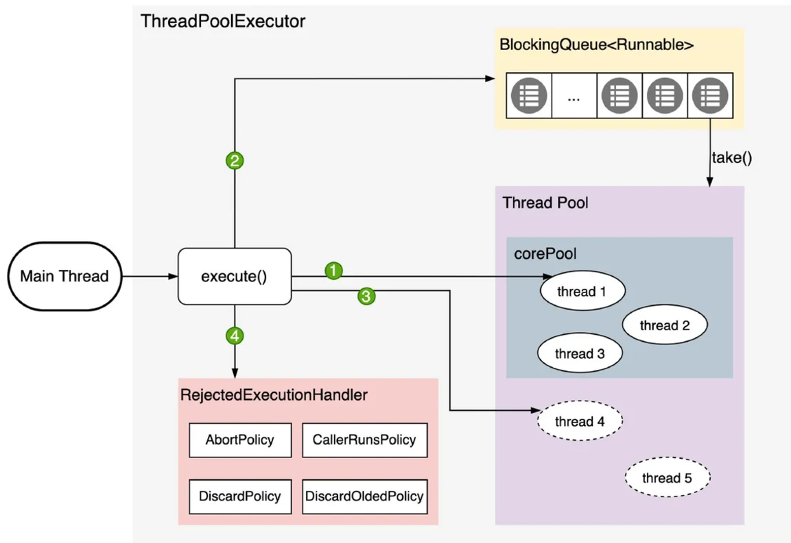

当一个新任务提交至线程池之后，线程池的处理流程如下：

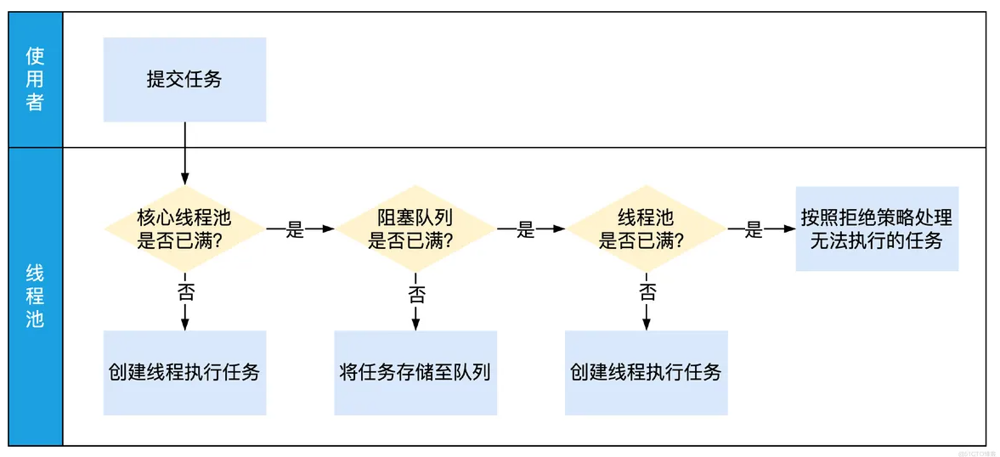

1.  首先判断当前运行的线程数量是否小于 [corePoolSize](http://corepoolsize/)。如果是，则创建一个工作线程来执行任务；如果都在执行任务，则进入步骤 2。
2.  判断 [BlockingQueue](http://blockingqueue%20/) 是否已经满了，如果没满，则将任务放入 [BlockingQueue](http://blockingqueue/)；如果满了，则进入步骤 3。
3.  判断当前运行的总线程数量是否小于 [maximumPoolSize](http://maximumpoolsize/)，如果是则创建一个新的工作线程来执行任务。
4.  否则交给 [RejectedExecutionHandler](http://rejectedexecutionhandler/) 来处理任务。

### **2.3.4.4 SynchronousQueue 介绍**

[SynchronousQueue](http://synchronousqueue%20/) 是一个不存储元素的阻塞队列，每个插入的操作必须等待另一个线程进行相应的删除操作，反之亦然，因此这里的Synchronous指的是读线程和写线程需要同步，一个读线程匹配一个写线程。

你不能在该队列中使用peek方法，因为peek是只读取不移除，不符合该队列特性，该队列不存储任何元素，数据必须从某个写线程交给某个读线程，而不是在队列中等待倍消费，非常适合「**传递性场景**」。

[SynchronousQueue](http://synchronousqueue/) 的吞吐量高于 [LinkedBlockingQueue](http://linkedblockingqueue/) 和 [ArrayBlockingQueue](http://arrayblockingqueue/)。该类还支持可供选择的公平性策略，默认采用非公平策略，当队列可用时，阻塞的线程都可以争夺访问队列的资格。

1.  如果采用公平模式，[SynchronousQueue](http://synchronousqueue/) 会采用公平锁，并配合一个FIFO队列来阻塞多余的生产者和消费者，从而体系整体的公平策略。
2.  如果是非公平模式（[SynchronousQueue](http://synchronousqueue/) 默认），[SynchronousQueue](http://synchronousqueue/) 采用非公平锁，同时配合一个LIFO队列来管理多余的生产者和消费者，而后一种模式，如果生产者和消费者的处理速度有差距，则很容易出现饥渴的情况，即可能有某些生产者或者是消费者的数据永远都得不到处理。

### **2.3.4.5 多线程测试效果**

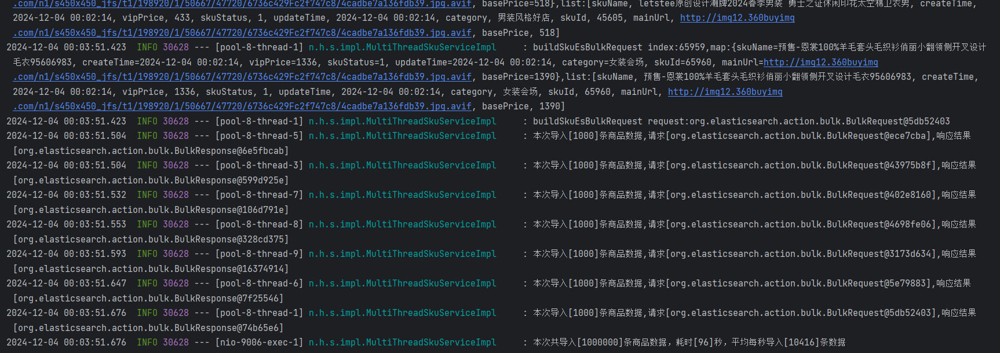

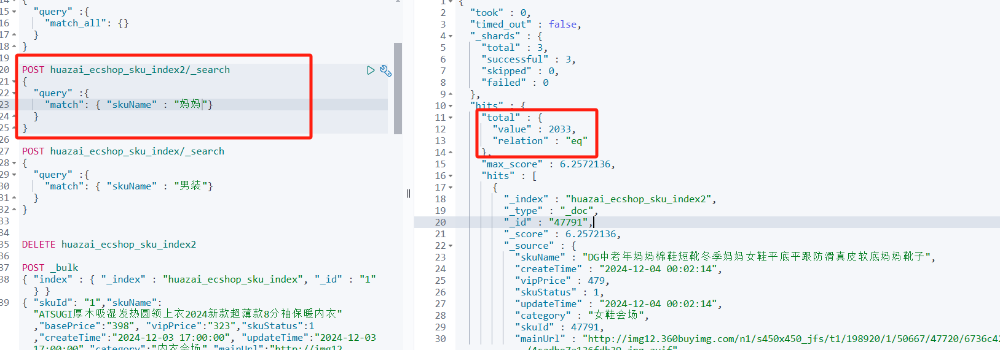

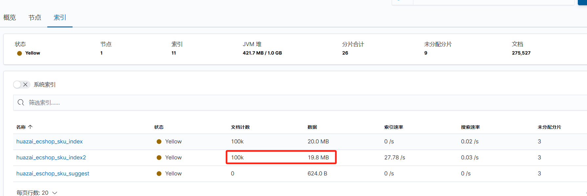

上面测试也有问题，次数填错了应该是 100 而不是 1000（100w了），不过随机读取商品数据的话，感觉会有丢失，下面是 10W 的新测试。

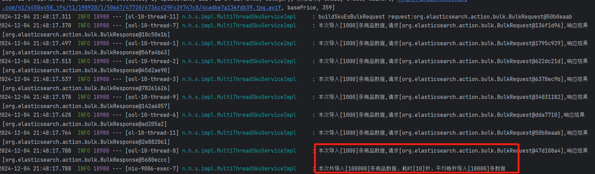

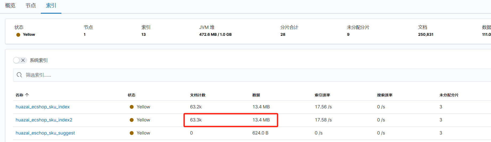

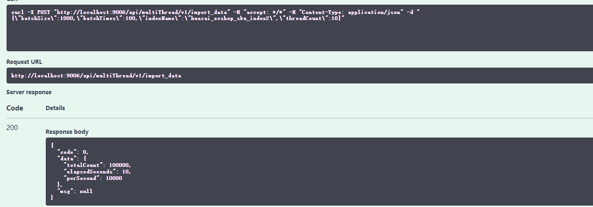

本篇就先这样，下面我们会改进了 bulk 请求的封装方法，保证数据不丢失，目前代码是随机选取的，测试是会丢失的。