从今天之后的一段时间内，华仔会带着大家一起从零开始搭建并研发一套高并发的电商实战项目，这里会涉及到很多互联网大厂开发过程中所使用的核心技术和架构设计模式，希望大家学完之后可以用到自己的简历中。

接下来我们会重点进行 SpringCloudAlibaba 微服务全家桶的整合并接入到我们实战项目中，等这些完事后再进行「**商品中心服务详情页架构设计**」。

这是第四十七篇，本篇我们继续进行电商实战项目设计与开发，本篇将进行「**微服务全家桶之 Nacos 整合**」。

文章汇总位置：[https://wx.zsxq.com/dweb2/index/columns/51122554151214](https://wx.zsxq.com/dweb2/index/columns/51122554151214)

源码授权与获取地址：[https://articles.zsxq.com/id\_1s85grnaae4p.html](https://articles.zsxq.com/id_1s85grnaae4p.html)

本章源码地址：[https://gitcode.net/u011359591/huazai-ecshop/-/tree/ecshop-chapter-47](https://gitcode.net/u011359591/huazai-ecshop/-/tree/ecshop-chapter-47)

## **01 前言**

终于要设计与研发电商项目代码了，今天我们主要对实战项目进行「**微服务全家桶之 Nacos 整合**」。

这里需要注意下，我们整个项目目前是不提供前端的，这个后续有时间在搞，主要是进行后端接口以及微服务模块架构设计。

## **02 为什么选择 Nacos**

Nacos 是一款非常优秀的「**注册中心**」和 「**配置中心**」框架，在市场的使用占有率也是日益增长，它不仅仅帮助我们管理服务，还能帮助我们管理项目中的配置文件。

Nacos 提供了一个简洁易用的 UI 来帮助我们管理所有服务和应用的配置，其核心功能如下：

1.  服务管理：Nacos 可以为我们提供很好的服务治理，服务实例状态响应时效快，Nacos 可以根据 Namespace 命名空间、Group 分组来区分不同的项目、不同的环境，使用上更加灵活。而且 Nacos 还提供了对服务实时的健康检查，阻止向不健康的主机或服务实例发送请求。
2.  配置管理：Nacos 可以让微服务配置中心化，采用外部化和动态化的方式管理所有环境配置和应用配置。动态配置消除了配置变更时重新部署应用和服务的需要，让配置管理变得更加高效和敏捷。配置中心化管理让实现无状态服务变得更简单，让服务按需弹性扩展变得更容易。

## **03 Nacos 介绍**

在早期 Spring Cloud 开始流行的时候，Eureka 使用得比较广泛，后来这个项目在 2018 年 7 月份的时候，官方宣布不再维护 Eureka 2.0 了，再来后阿里推出全新 Spring Cloud Alibaba 系列，其中 Nacos 就是一员。

学习一门新的技术，其实官方文档是最好的途径，也是最权威的途径。很多小伙伴都不喜欢依赖官方文档，比如不知道 Nacos 什么，就直接去搜索一下，搜索出来的结果五花八门，然后随便点击看一看就关闭了。

为了方便大家学习，这里我把 Nacos 相关的链接地址放出来。

1.  官方地址：[https://nacos.io/](https://nacos.io/)
2.  3.x 文档地址：[https://nacos.io/docs/v3.0/overview/?spm=5238cd80.4c97b31e.0.0.1cb3e755iuSVXj](https://nacos.io/docs/v3.0/overview/?spm=5238cd80.4c97b31e.0.0.1cb3e755iuSVXj)
3.  GitHub 地址：[https://github.com/alibaba/nacos](https://github.com/alibaba/nacos)
4.  OpenAPI 文档：[https://nacos.io/zh-cn/docs/open-api.html](https://nacos.io/zh-cn/docs/open-api.html)

进入 Nacos 官方，映入眼帘的是很醒目的一句话：一个更易于构建云原生应用的「**动态服务发现**」、「**配置管理**」和「**服务管理平台**」。

  
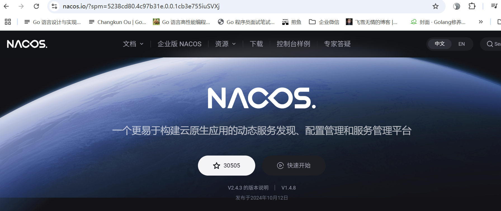

1.  动态服务发现：新增一个微服务实例，Nacos 它能够感知到，也就是服务治理，这也是作为注册中心最基本的功能。
2.  配置管理：Nacos 它不仅仅是一款注册中心，它还提供了配置管理一大特点，不仅是对服务进行管理，而且还可以管理你项目中对应的配置文件，让你整个微服务项目配置中心化，统一全部放在 Nacos 配置管理中；除此之外，它还是动态化的。
3.  那什么是动态化？举个例子，在 Spring Boot 项目中，会包含 properties、yml 配置文件，在项目启动中，如果想要修改对应的配置文件，是需要重启应用，更改后的配置文件才能生效。而 Nacos 的配置管理，它可以让你在更改配置文件后，无需重启应用，即可生效。
4.  服务管理平台：Nacos 它提供了一套 Web 管理后台，在这个后台中，我们可以监控整个服务运行状态以及对配置管理进行操作。

通过 Nacos 官方中的介绍，我们已经初步掌握 Nacos 所具备的功能。在官方链接中，我们找到 Nacos 文档中的架构图：

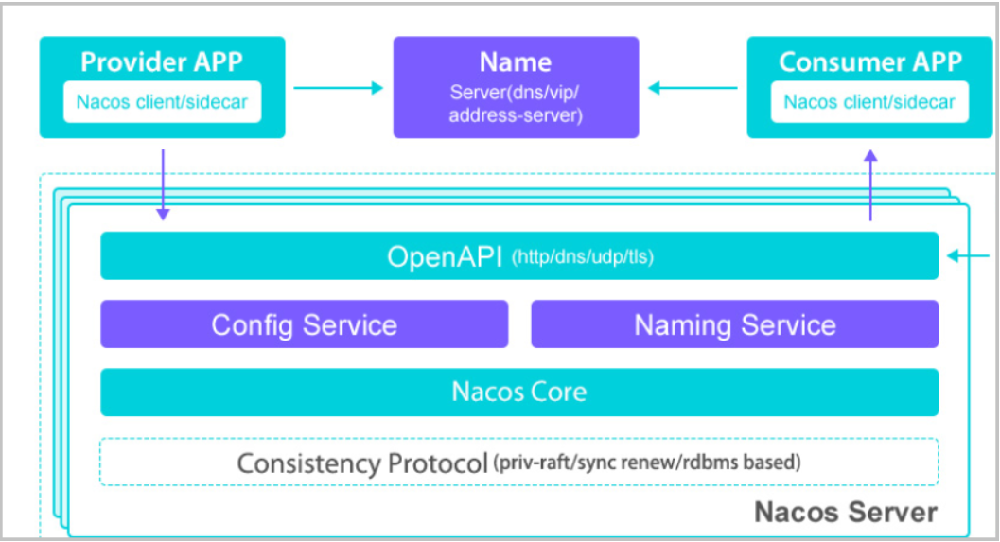

1.  从最上层开始看，首先就是 Provider（提供者）、Consumer（消费者），都需要借助于 Name（服务名称、服务地址），这是最外层。
2.  Provider、Consumer 都是需要依赖 Nacos Server。
3.  接着往下看，Nacos Server 最上层，有一层 OpenAPI，对外提供服务。那对外提供什么服务呢？
4.  Naming Service ：注册服务，我们微服务实例的注册、注销、服务管理都是在这一块进行实现的。
5.  Config Service：配置服务，它提供了在微服务架构中，统一配置中心的功能。 Nacos 配置中心为服务配置提供了编辑、存储、分发、变更管理、历史版本管理等功能，并且支持在实例运行中，更改配置。

除此之外，Naming Service、Config Service 也是依赖于 Nacos Core 核心来完成的，并且在 Nacos Core 核心中还包含了Consistency Protocol（一致性协议），这一块就涉及到分布式一致性协议的内容，包括 CAP 理论、Raft 协议，这些也都是我们在使用微服务架构中需要考虑的问题。

至于 Nacos Console，这一整块相当于服务管理平台，也是依赖于 Nacos 提供的 OpenAPI 来进行扩展的额外功能。

Nacos 架构图我们看完了，要记住重点：

1.  Config Server 对应配置管理中心。
2.  Naming Service 对应注册中心。

看最近刚发布了 3.0 版本：[Nacos 3.0 Alpha 发布，在安全、泛用、云原生更进一步](https://mp.weixin.qq.com/s/nXHYvH4r7CHIFqlsywZvsA) 本篇我们只进行实战安装和接入，这里我们实战的话就采用 3.x 版本进行安装了，只不过刚发布还不稳定，生产环境的话还是建议用 2.x。

关于 Nacos 的架构设计、设计原理细节以及源码部分我们会放到 Nacos 专栏进行深度剖析，预计年后更新。

## **04 Nacos 单机搭建**

本次搭建使用 Nacos 最新发布的 3.0.0 版本，系统用的是 Ubuntu 22.04.5，安装好 JDK 1.8 版本或以上，安装 Maven 3.2+ 版本，建议 2 核 CPU/4G 内存及其以上。

##   
**4.1 Nacos 最新版官方下载地址**

官方下载地址：[https://github.com/alibaba/nacos/releases/download/3.0.0-alpha/nacos-server-3.0.0-ALPHA.tar.gz](https://github.com/alibaba/nacos/releases/download/3.0.0-alpha/nacos-server-3.0.0-ALPHA.tar.gz)

## **4.2 下载安装**

进入到下载目录后，通过 wget 进行下载：

wget https://github.com/alibaba/nacos/releases/download/3.0.0-alpha/nacos-server-3.0.0-ALPHA.tar.gz

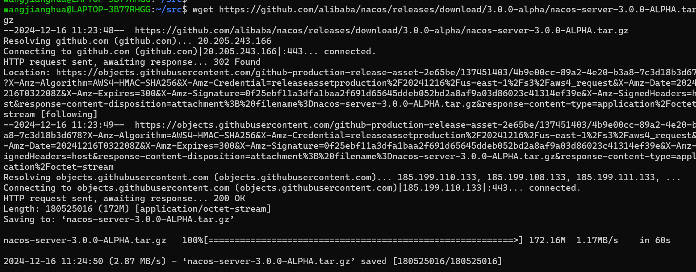

解压 Nacos：

tar xf nacos-server-3.0.0-ALPHA.tar.gz

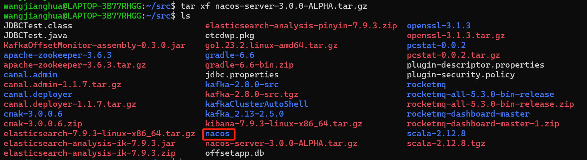

##   
**4.3 修改配置及初始化数据库**

然后进入解压后到 Nacos 目录，修改其配置文件，位置：[${nacos.home}/conf/application.properties](http://${nacos.home}/conf/application.properties)

  
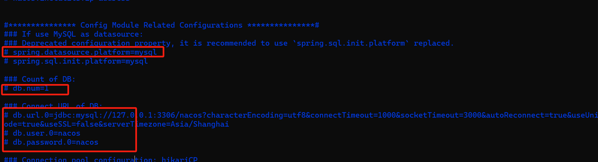

打开其注释，修改数据库连接、账号、密码，修改后如下：

  
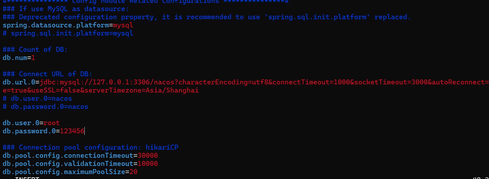

接着初始化 nacos mysql 数据库，数据库初始化文件：[mysql-schema.sql](http://mysql-schema.sql/)。

source /home/wangjianghua/src/nacos/conf/mysql-schema.sql

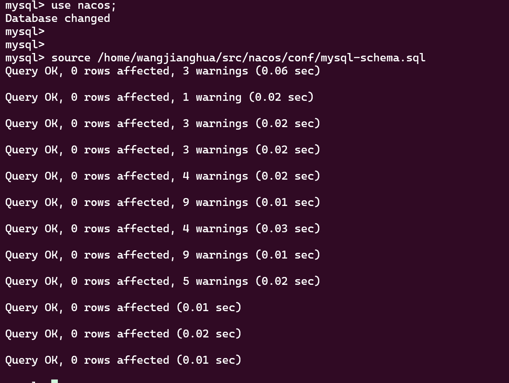

  
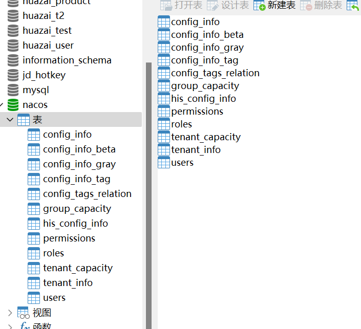

##   
**4.4 启动 Nacos**

执行单机启动命令：

bin/startup.sh -m standalone

这里的 standalone 就是表示单机的意思，执行完如下：

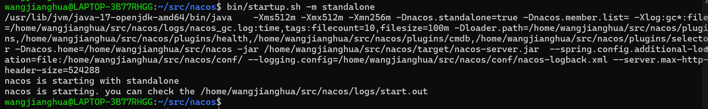

### **4.4.1 启动失败解决**

通过 ps 没查到启动端口：

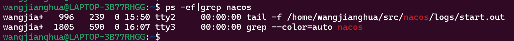  

接着查看启动日志出现如下错误：

  
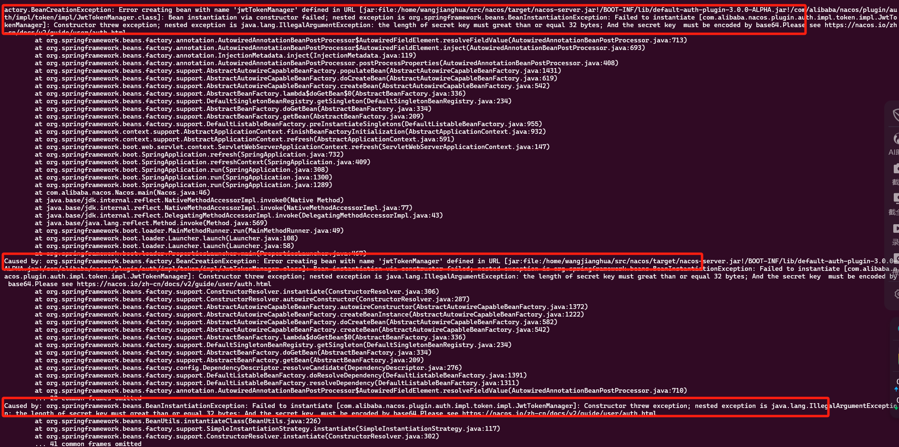

根据官方文档规定，需要填充一个默认值：[https://nacos.io/docs/v1/auth/?spm=5238cd80.2e270ac1.0.0.122c49cb5ZxwtB](https://nacos.io/docs/v1/auth/?spm=5238cd80.2e270ac1.0.0.122c49cb5ZxwtB)

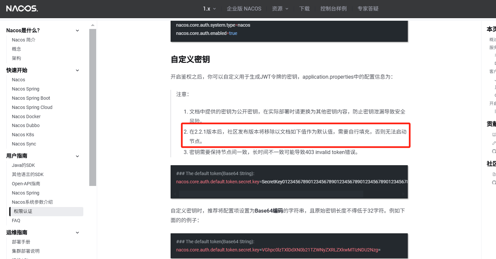

从配置文件查看确实为空：使用快捷键找到 [nacos.core.auth.plugin.nacos.token.secret.key](http://nacos.core.auth.plugin.nacos.token.secret.key/) 配置的位置：

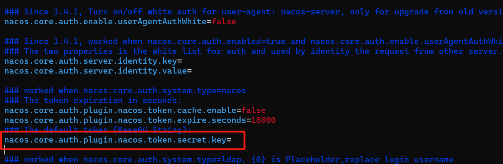

确实如官方文档介绍所示「**配置是空值**」，我复制官方文档的值，粘贴即可，如下：

\### The default token(Base64 String):

nacos.core.auth.default.token.secret.key=SecretKey012345678901234567890123456789012345678901234567890123456789

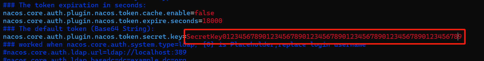

再次重新启动 Nacos 出现如下图所示，就表示启动成功了。

  
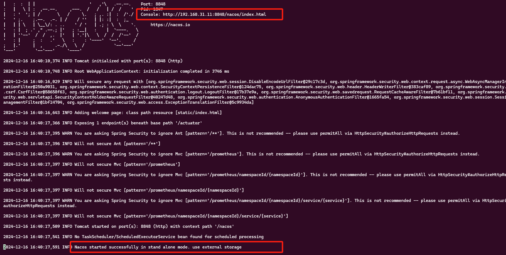  

  
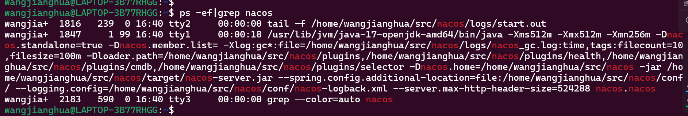  

##   
**4.5 访问 Nacos UI**

启动成功之后，Nacos 默认端口是 8848，浏览器中输入 [http://localhost:8848/nacos/](http://localhost:8848/nacos/) 即可进入登录页面，账号密码默认是 nacos/nacos。

  
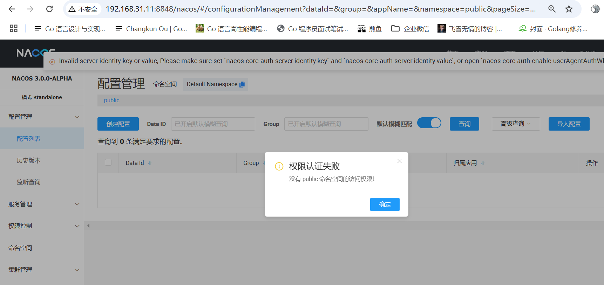

进来会报错，我们来看下如何解决，从官网看需要开启身份识别。

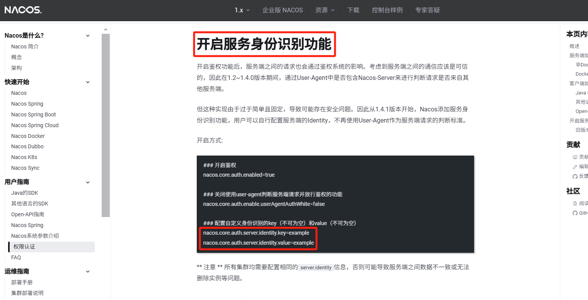

可以看到配置为空，

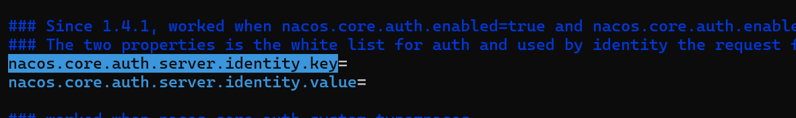

这里我修改为 public

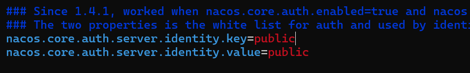

重新启动下 nacos，再次刷新 nacos UI 就不报错了。那么成功启动之后，又该如何正确关闭 Nacos 呢？

同样还是来到解压后的 Nacos 目录下，执行：[bin/shutdown.sh](http://bin/shutdown.sh)。

就这样，单机环境的搭建就完成了，还是很简单的！

> 在这里提醒一点，Nacos 建议在内部隔离网络环境中部署，强烈建议不要部署在公共网络环境中。Nacos 属于微服务内部所使用的组件，是没有必要暴露在公网当中。

##   
**05 Nacos 集群搭建**

在生产环境当中，我们搭建的 Nacos 肯定是需要保证高可用的，单台一般不建议在生产环境中使用，所以掌握 Nacos 集群搭建也是很有必要的。

先给大家看看 Nacos 集群架构搭建完成之后的架构，如下图所示：

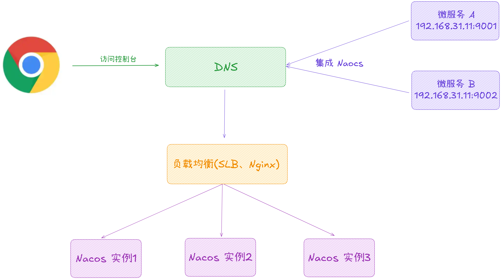

这种架构，官方称之为 「**域名**」+「**SLB 模式**」 ，其优点可读性好，而且换 IP 方便。不管是访问 Nacos 后台、还是微服务集成 Nacos，所使用的地址都是域名，因为域名变动性最小，哪怕域名背后的 IP 地址变更了，对于客户端来说是无感知的。

域名是直接解析到负载均衡上，再由负载均衡选择具体 Nacos 实例来进行访问，这种架构也是 Nacos 官方「**推荐集群模式**」。

## **5.1 准备工作**

在搭建之前，我们得先准备一个可用的 MySQL 数据库，因为在 Nacos 集群模式下，数据的持久化是需要公用的，每一台 Nacos 实例都需要连接同一个 MySQL 数据库。

有了 MySQL 数据库之后，我们需要在 MySQL 创建一个对应 Nacos 所使用的数据库，并且创建好对应的表结构以及数据。

这部分我们前面单机部署时已经做了可以忽略，就是告诉你需要有 MySQL 。

## **5.2 搭建集群**

本次集群搭建，我们也按照 3 台 Nacos 的规模来搭建，3 台最好放在 3 台不同的服务器上。我这里就先放在了同一台服务器上搭建的，把 [nacos-server-3.0.0-ALPHA.tar.gz](https://github.com/alibaba/nacos/releases/download/3.0.0-alpha/nacos-server-3.0.0-ALPHA.tar.gz) 解压后的文件，复制了 3 份出来，为了做区分，文件名加上了「**端口号**」，如下图：

  
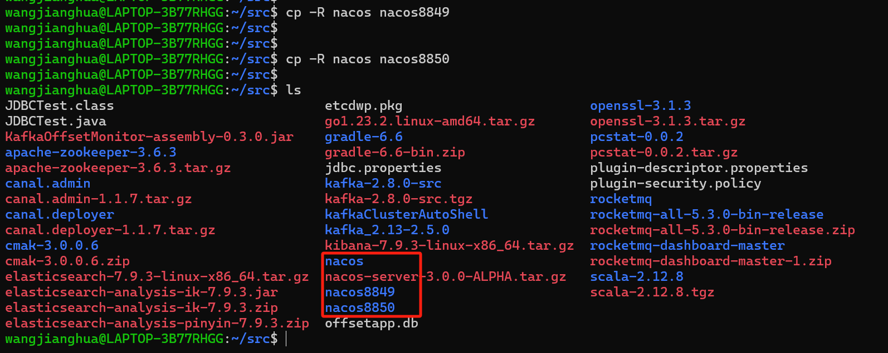

###   
**5.2.1 配置数据库**

这步在单机部署就已经做了，忽略。

### **5.2.2 修改集群端口**

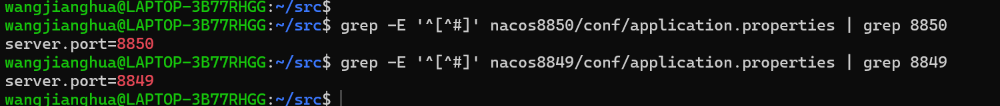

### **5.2.3 配置集群信息**

这一步就是告诉 Nacos，其他节点都部署在哪台服务器上，如何告诉呢？

在 conf/ 文件夹下，有一个 [cluster.conf.example](http://cluster.conf.example/) 文件。

1.  首先我们把文件名改成 [cluster.conf](http://cluster.conf/)，
2.  然后编辑这个文件，把 Nacos 每台对应的 IP 以及 Nacos 端口号配置进去。

  
我这里就只有一台机器，所以 IP 就都是 192.168.31.11，只是把端口号改了。

  
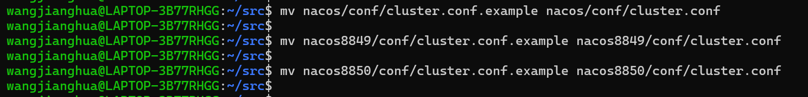

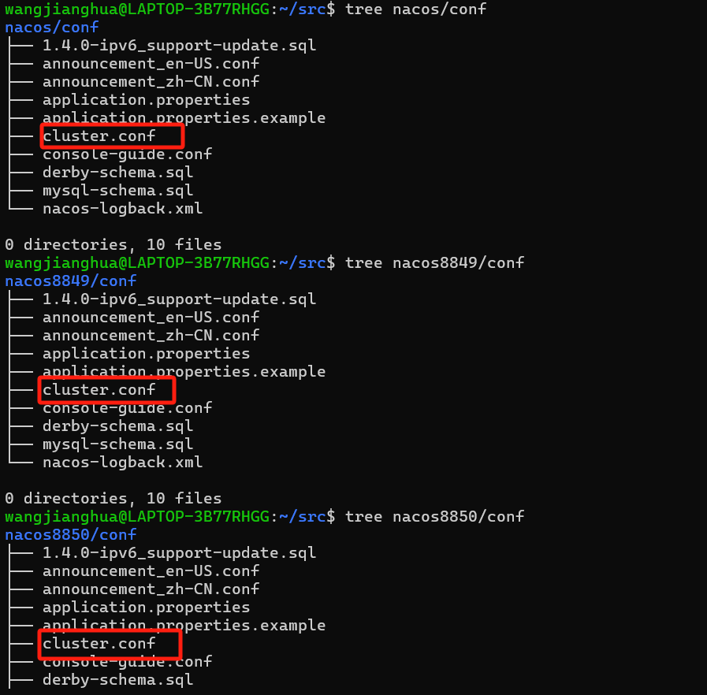

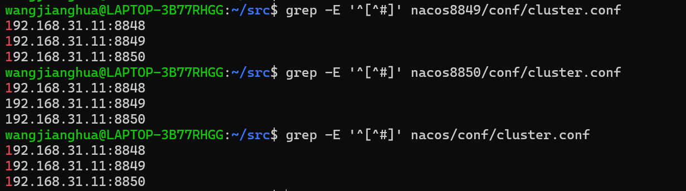

### **5.2.4 修改集群内存大小**

修改 [bin/start.sh](http://bin/start.sh) 文件，启动文件默认就是「**集群模式**」，但是「**集群模式**」下分配的系统内存占用特别大，如果你机器内存很足，那可以忽视。

但是我一台机器 hold 不住，所以得改配置文件，小伙伴可以根据电脑本身选择是否修改。

  
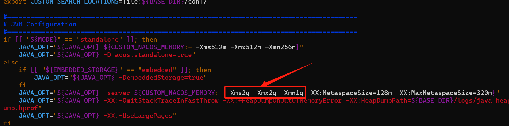

这里我们改成：[\-Xms64m -Xmx64m -Xmn32m](http://-xms64m%20-xmx64m%20-xmn32m/)，系统内存省着点，够用就行。

JAVA\_OPT="${JAVA\_OPT} -server -Xms64m -Xmx64m -Xmn32m -XX:MetaspaceSize=128m -XX:MaxMetaspaceSize=320m"

> 注意：这三步骤，在每一台 Nacos 实例，都需要进行配置。

### **5.2.5 启动集群服务**

把 3 台 Nacos 节点都启动，如下所示，这次启动的命令就有点不同，不需要带 [\-m standalone](http://-m%20standalone/) 参数了，默认就是「**集群模式**」启动。

bin/startup.sh

然后在 Nacos 管理后台，节点列表中就能看到我们集群的状态了，如下图：

  
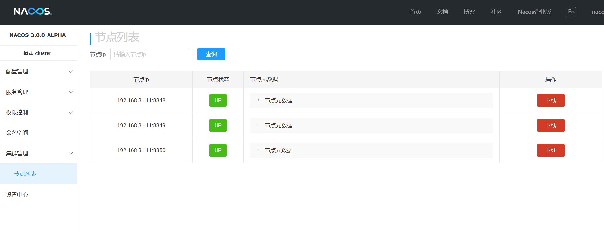

到这里，我们 Nacos 集群环境搭建就成功了，那么接下来就是将 Nacos 接入到我们的电商项目中了。

##   
**06 实战项目接入 Nacos**

这里主要是两种：配置中心和注册中心接入。

## **6.1 配置中心**

配置中心也是 Nacos 一大亮点，我经常在面试的时候，问面试者：你们公司为什么要选用 Nacos 呀？

绝大多数回答中，都会包含说：

> Nacos 对比其他注册中心多了一个配置中心，可以把微服务项目配置文件统一管理，并且能够做到无需重启项目，也能感知配置文件的修改。

好，那我们就来看看 Nacos 配置服务具体该怎么使用它。

这里我拿「**商品中心**」举例，其他的服务都类似，搞定一个，其他复制一个个搞就行了。

### **6.1.1 在控制台创建配置文件**

先打开 Nacos 控制后台，配置管理 → 配置列表，点击 + 号，创建一个新的配置文件。

  
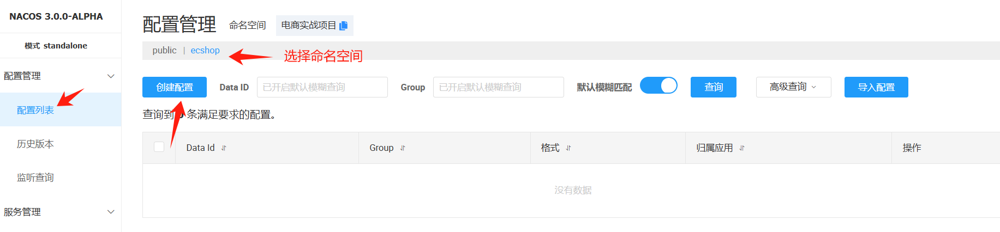

这里的 Data ID 可以理解为配置文件名字，具有唯一性；groups相当于分组，可以分不同的环境、不同的业务；配置格式我这里选择的是 YAML，最后按照所选格式，把配置内容放进去就行了。

关于 Data ID 组成，在 Nacos Spring Cloud 中，Data ID 的完整格式如下：

> ${prefix}-${spring.profiles.active}.${file-extension}，其中 prefix 默认为 spring.application.name 的值
> 
> ​
> 
> spring.profiles.active 即为当前环境对应的 profile。当 spring.profiles.active 为空时，对应的连接符 - 也将不存在，Data ID 的拼接格式变成 ${prefix}.${file-extension}
> 
> ​
> 
> file-exetension 为配置内容的数据格式，可以通过配置项 spring.cloud.nacos.config.file-extension 来配置。目前只支持 properties 和 yaml 类型。

填写内容如下：

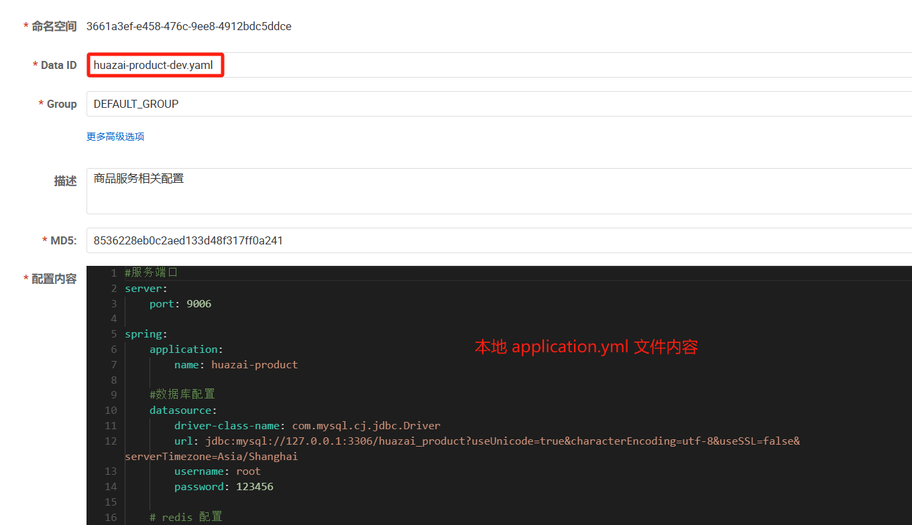

Nacos 后台操作完成之后，可以看见刚刚创建的配置文件记录。

  
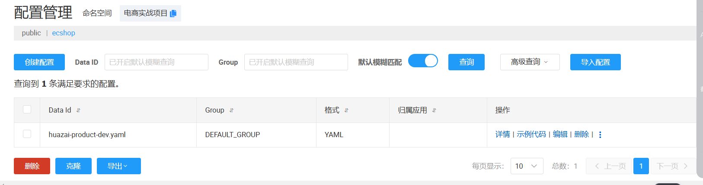

### **6.1.2 common 包引入 Nacos 服务依赖**

关于版本号匹配可以参考这里：[https://sca.aliyun.com/docs/2021/overview/version-explain/?spm=7145af80.1ef41eac.0.0.46ff2d5bLMpGt8](https://sca.aliyun.com/docs/2021/overview/version-explain/?spm=7145af80.1ef41eac.0.0.46ff2d5bLMpGt8)

为了兼容我将调整 springboot、springcloud、springcloudalibaba 的版本如下：

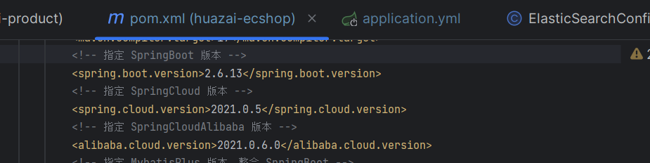

在我们还需要把 Spring Boot 项目集成 Nacos 配置中心服务，在 common 包下的 [pom.xml](http://pom.xml/) 文件中，引入 Naocs 配置中心对应的 Maven 依赖。

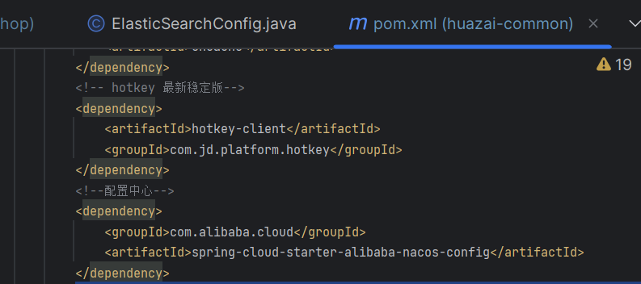

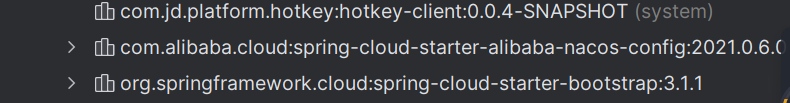

启动项目报错：

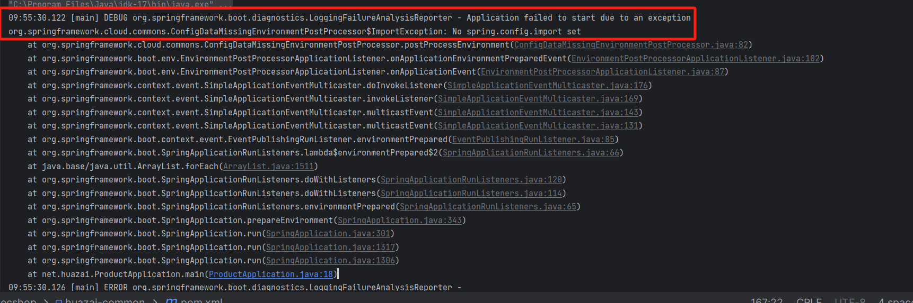

解决方案：

<dependency>

<groupId>org.springframework.cloud</groupId>

<artifactId>spring-cloud-starter-bootstrap</artifactId>

<version>3.1.1</version>

</dependency>

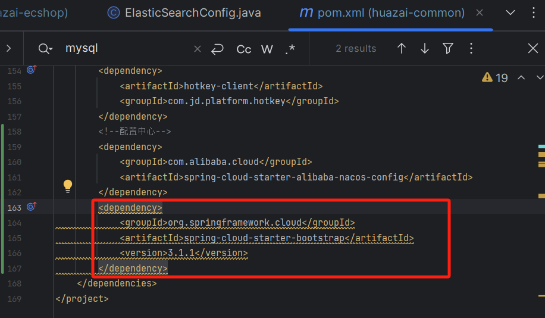

重新启动后如果报如下错误的话：

  
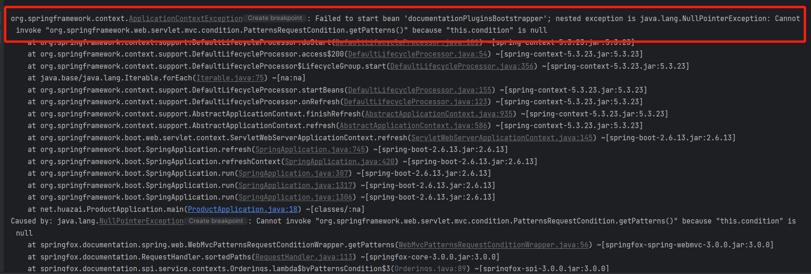

主要是当 springboot 升级到 2.6.0 之后，swagger 版本和 springboot 出现了不兼容情况。可以参考：[https://blog.csdn.net/weixin\_45131680/article/details/131580270](https://blog.csdn.net/weixin_45131680/article/details/131580270)

这里我采用第一种解决方法：

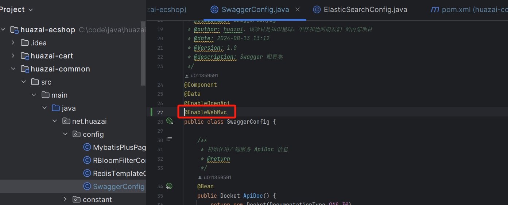

### **6.1.3 添加 Nacos 配置**

先来看下配置文件优先级讲解:

1.  这里不能使用原先的 [application.yml](http://application.yml/)，需要使用 [bootstrap.yml](http://bootstrap.yml/) 作为配置文件。
2.  配置读取优先级 [bootstrap.yml](http://bootstrap.yml/) > [application.yml](http://application.yml/)。

新增 [bootstrap.yml](http://bootstrap.yml/) 配置文件，添加 Nacos 相关配置，注意格式以及注释掉原先 [application.yml](http://application.yml/) 配置内容。

spring:

application:

name: huazai-product

cloud:

nacos:

\# 配置中心

config:

\# Nacos 配置中心地址

server-addr: 192.168.31.11:8848

\# 命名空间id

namespace: 3661a3ef-e458-476c-9ee8-4912bdc5ddce

\# 配置文件拓展格式

file-extension: yaml

\# 测试发现这块没作用，后续再看

profiles:

active: dev

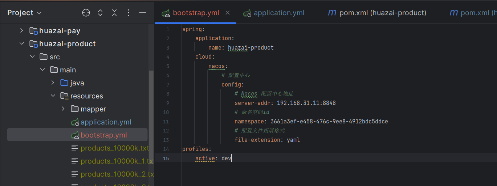

### **6.1.4 启动服务验证**

启动后可以看到加载了 nacos config。

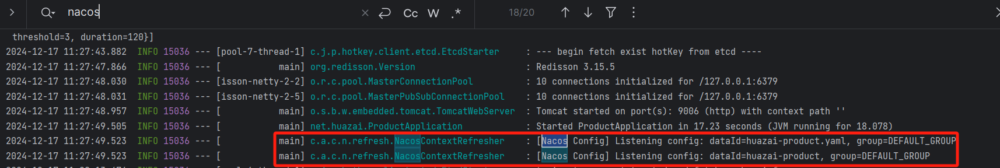

验证方法，读取 redis 商品分类数据。

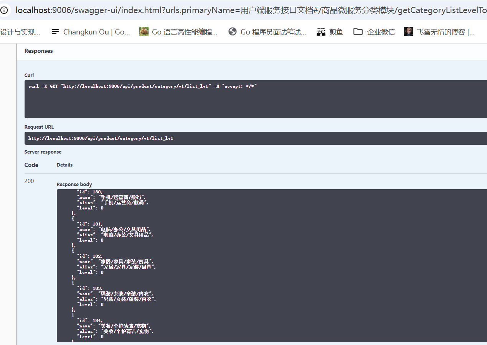

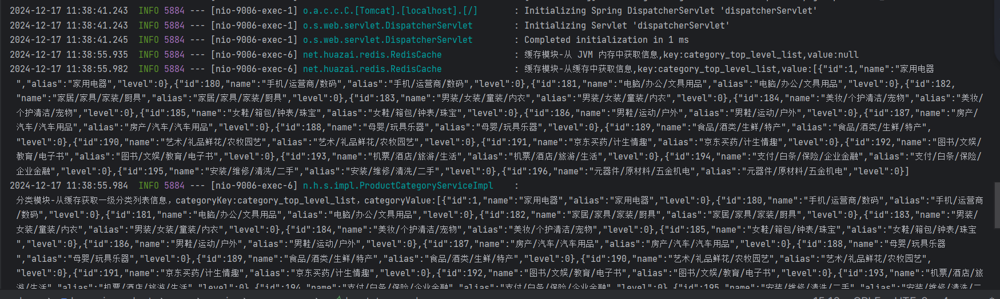

至此，「**商品中心服务 Nacos 配置文件整合**」就完成了，其他的服务类似，这里就不展示了，目前 6 个服务都接入到了 Nacos，如下：

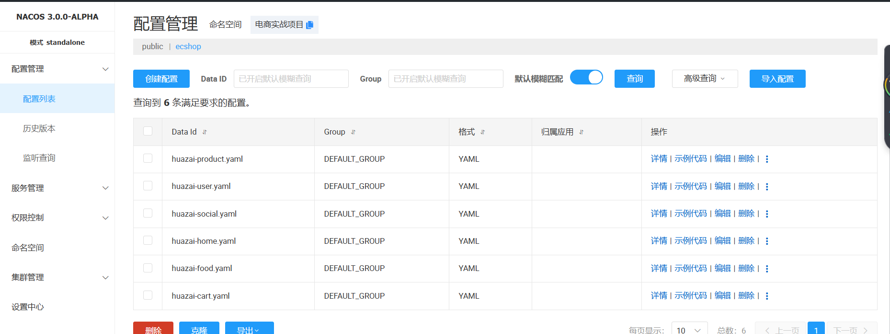

## **6.2 注册中心**

接下来我们来将「**商品中心服务**」和 「**购物车服务**」注册到「**Nacos 注册中心**」。这个就好比卖房子，房东要先去中介那儿登记一下房屋信息，买家找到中介寻找对应的房源，然后通过房东登记的信息，去看对应的房子。

微服务与微服务调用，也是这么个道理，首先「**商品中心服务**」告诉「**Nacos 注册中心**」：我的 IP 地址是 127.0.0.1:9006，这个时候「**购物车服务**」就去问「**Nacos 注册中心**」要「**商品中心服务**」登记的 IP + Port 信息，这样「**购物车服务**」就能直接找到「**商品中心服务**」了。

### **6.2.1 服务接入注册中心**

那服务注册具体是怎么实现的呢？

其实也比较简单，大概三个步骤，我们分别来看下。

### **6.2.1.1 新增注册中心依赖**

这里依旧在 common 包中添加依赖。

<!--注册中心-->

<dependency><groupId>com.alibaba.cloud</groupId>

<artifactId>spring-cloud-starter-alibaba-nacos-discovery</artifactId>

</dependency>

<!--Feign远程调用-->

<dependency>

<groupId>org.springframework.cloud</groupId>

<artifactId>spring-cloud-starter-openfeign</artifactId>

</dependency>

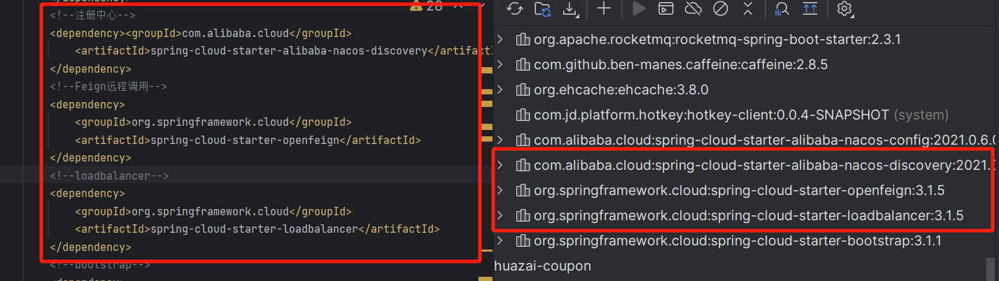

### **6.2.1.2 配置注册中心服务地址**

前面搞配置中心的时候就已经加了配置文件，这里直接在里面追加即可。

spring:

application:

name: huazai-cart

cloud:

nacos:

\# 配置中心

config:

\# Nacos 配置中心地址

server-addr: 192.168.31.11:8848

\# 命名空间id

namespace: 3661a3ef-e458-476c-9ee8-4912bdc5ddce

\# 配置文件拓展格式

file-extension: yaml

\# 注册中心

discovery:

\# Nacos 注册中心地址

server-addr: 192.168.31.11:8848

\# 命名空间id

namespace: 3661a3ef-e458-476c-9ee8-4912bdc5ddce

profiles:

active: dev

分别在「**商品中心服务**」和 「**购物车服务**」都添加一下，注意这里的「**命名空间**」。

  
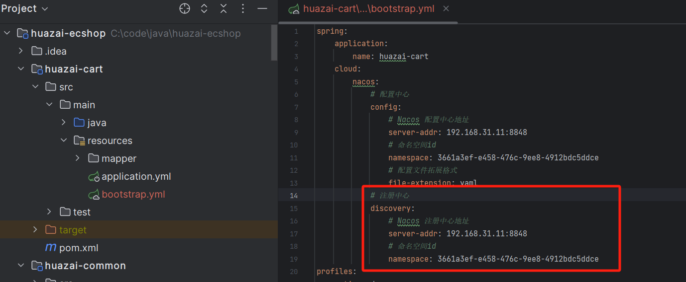

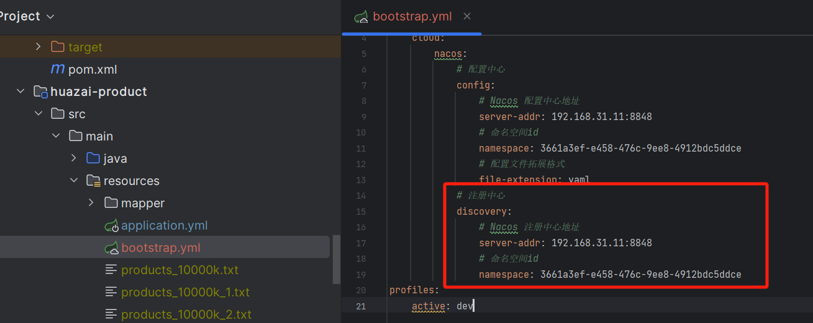

这里的 Nacos 注册中心的实现，其实是很简单的方式，配置也仅仅配置了一个 [nacos.discovery.server-addr](http://nacos.discovery.server-addr/) 而已，更多详细配置可以点击查看这个地址：[https://github.com/alibaba/spring-cloud-alibaba/wiki/Nacos-discovery](https://github.com/alibaba/spring-cloud-alibaba/wiki/Nacos-discovery)。

完成上面两个步骤，直接启动项目即可。

  
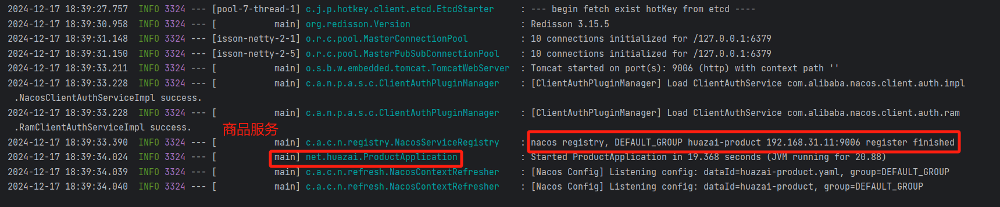

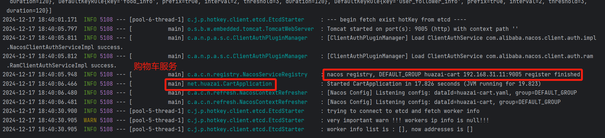

这个时候我们来查看 Nacos 的控制台，就多了这两个服务。

  
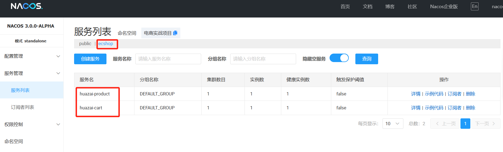

点击详情查看，两个服务 IP 和 Port 都登记好了。

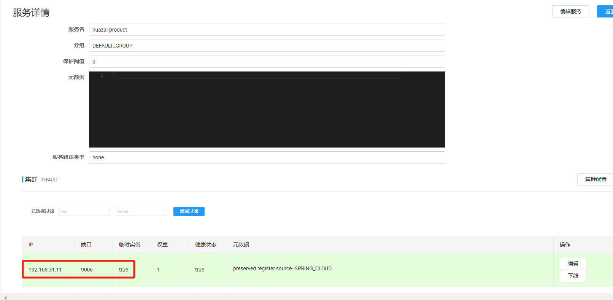

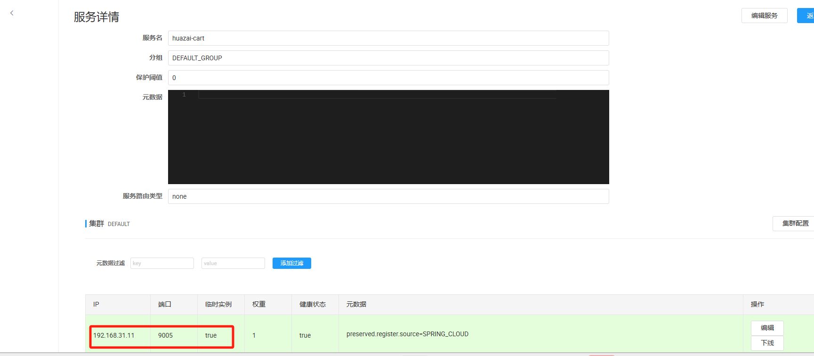

两个服务都注册到 Nacos 中了，那么接下来就可以使用Feign的方式，进行微服务调用了。

###   
**6.2.1.3 Feign 服务调用**

首先需要在两个服务的启动类中添加：

// 允许远端调用

@EnableFeignClients

// 允许服务注册与发现

@EnableDiscoveryClient

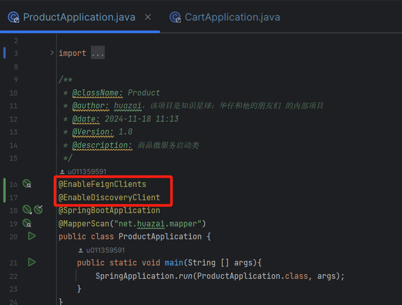

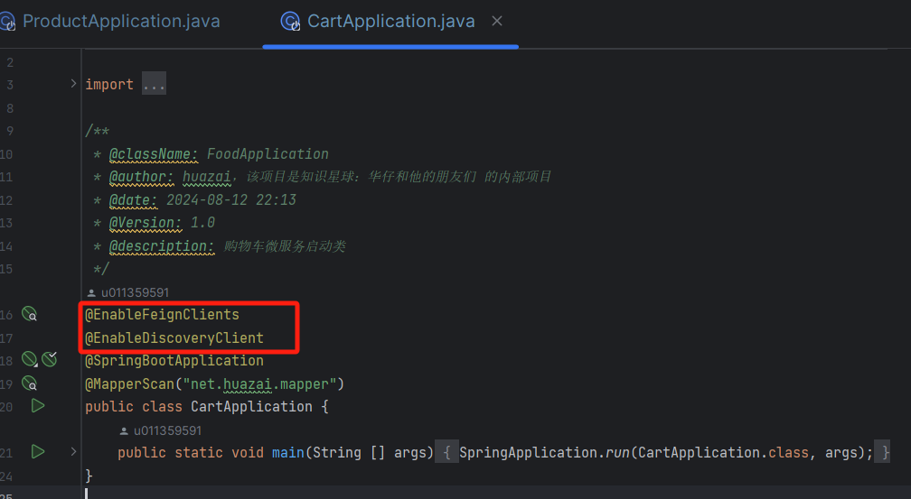

开发 Feign 接口：

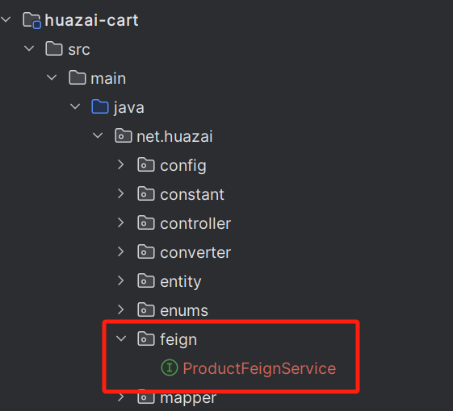

package net.huazai.feign;

import net.huazai.utils.ApiResult;

import org.springframework.cloud.openfeign.FeignClient;

import org.springframework.web.bind.annotation.PostMapping;

import org.springframework.web.bind.annotation.RequestBody;

/\*\*

\* 商品远程服务

\*/

@FeignClient(name = "huazai-product")

public interface ProductFeignService {

/\*\*

\* 获取商品 sku 可售状态

\* @param productSkuId

\* @return

\*/

@PostMapping("/api/product/sku/v1/get\_sku\_saleable\_status")

Boolean getSkuSaleableStatus(@RequestBody Long productSkuId);

/\*\*

\* 获取商品 sku 基础信息

\* @param productSkuId

\* @return

\*/

@PostMapping("/api/product/sku/v1/get\_sku\_Info")

ApiResult getSkuInfo(@RequestBody Long productSkuId);

}

添加购物车时调用检测商品是否可售以及获取商品基础信息。

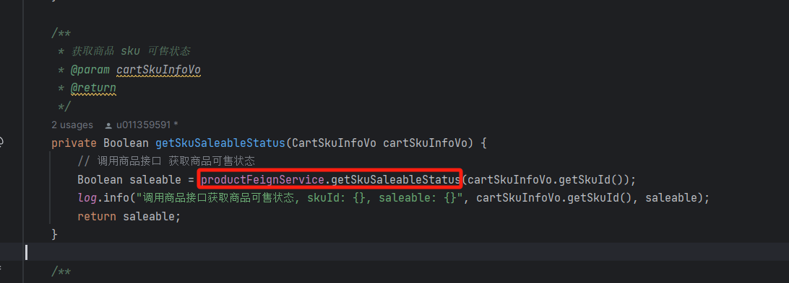

测试效果：

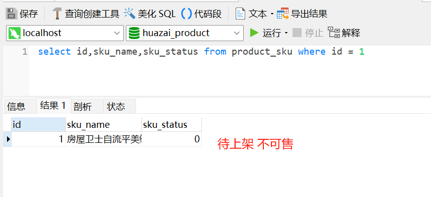

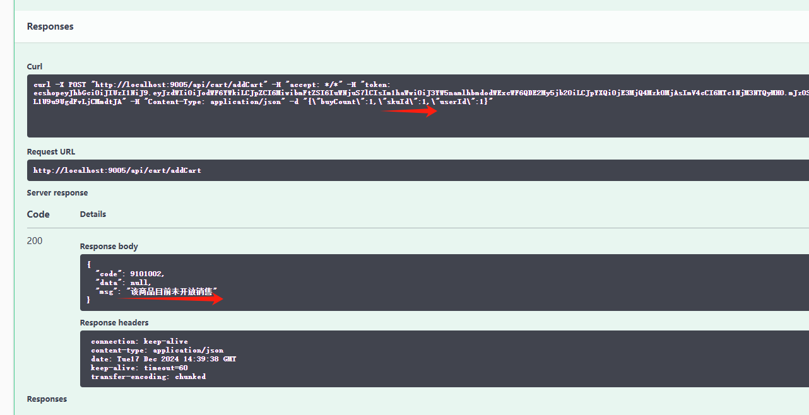

当商品上架状态修改为 1 ，已上架，再次测试。

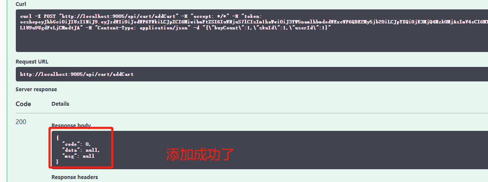

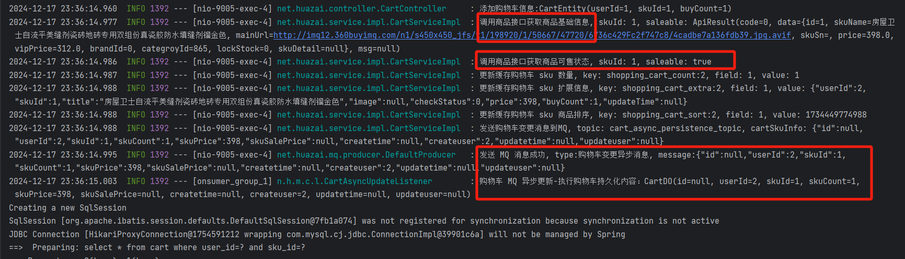

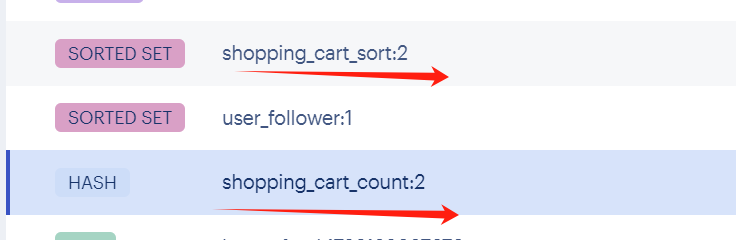

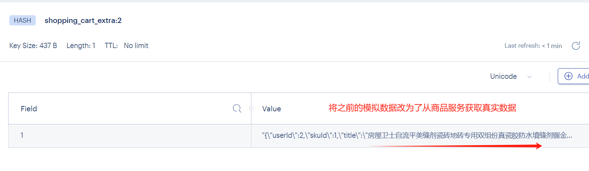

至此，「**注册中心**」也接入完成，后续等优惠券服务开发完成后，会对购物车进行优惠券处理。