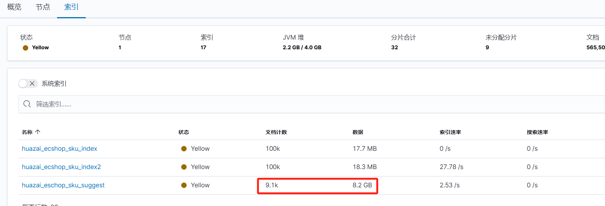
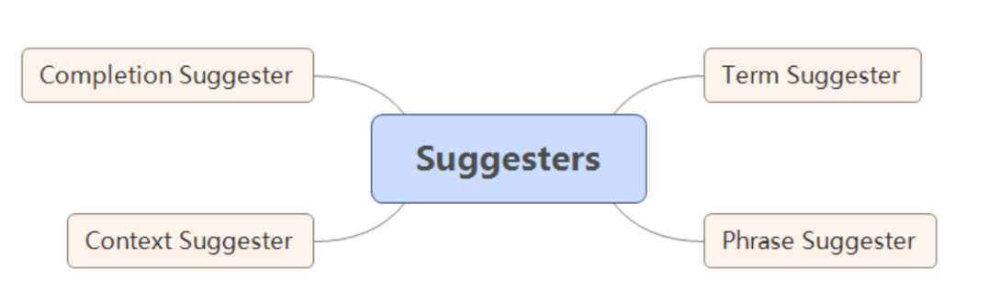
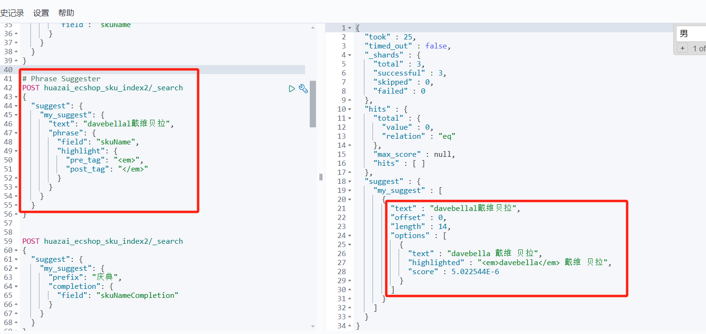
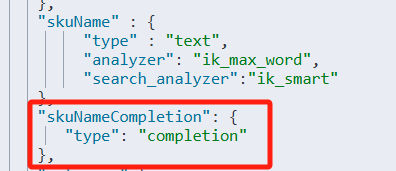
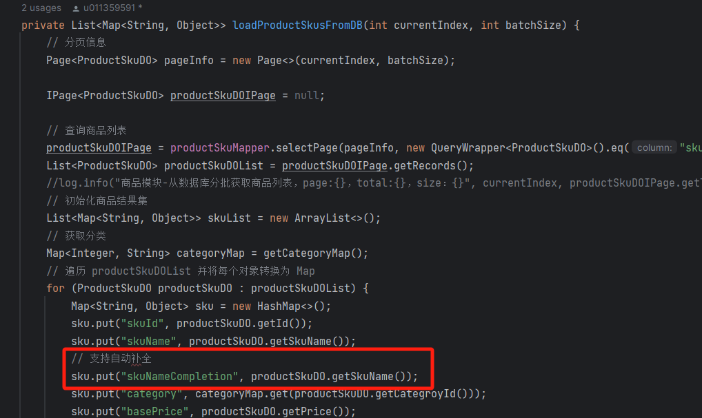
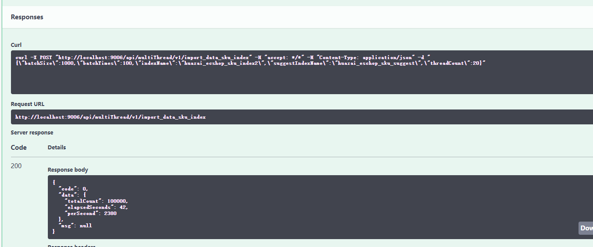
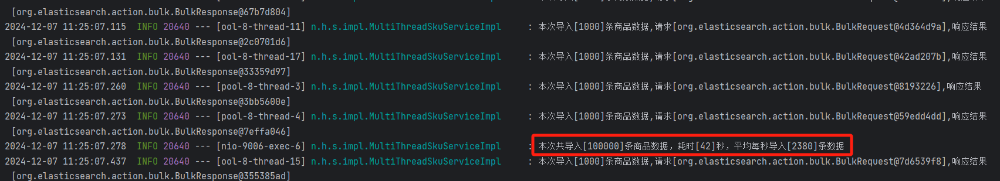
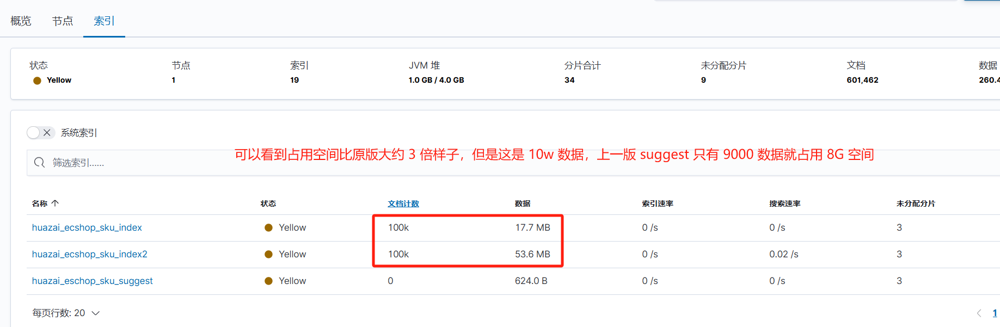
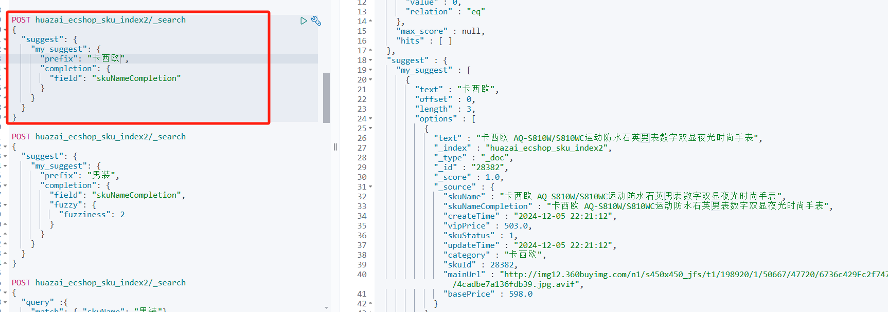
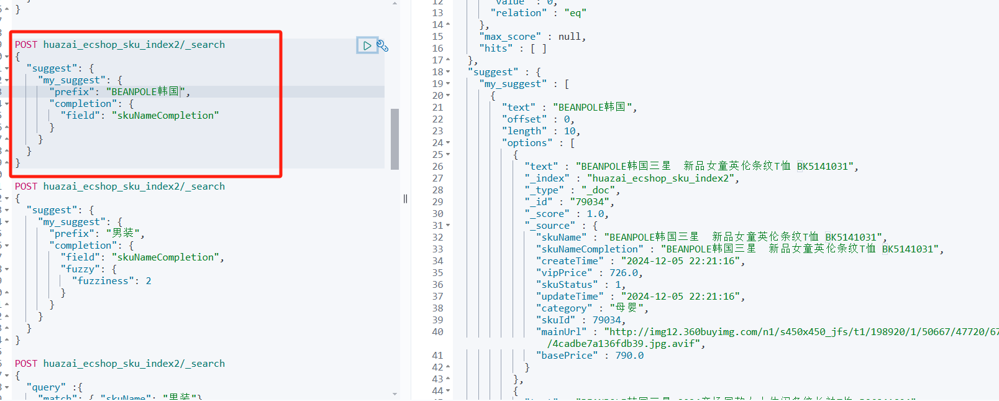

从今天之后的一段时间内，华仔会带着大家一起从零开始搭建并研发一套高并发的电商实战项目，这里会涉及到很多互联网大厂开发过程中所使用的核心技术和架构设计模式，希望大家学完之后可以用到自己的简历中。

接下来我们会重点架构设计和开发一下我们高并发电商实战项目中的「**商品中心服务**」。

这是第四十三篇，本篇我们继续进行电商实战项目设计与开发，本篇将进行「**商品中心服务**」 Elasticsearch 10W商品 suggest 索引优化。

文章汇总位置：[https://wx.zsxq.com/dweb2/index/columns/51122554151214](https://wx.zsxq.com/dweb2/index/columns/51122554151214)

源码授权与获取地址：[https://articles.zsxq.com/id\_1s85grnaae4p.html](https://articles.zsxq.com/id_1s85grnaae4p.html)

本章源码地址：[https://gitcode.net/u011359591/huazai-ecshop/-/tree/ecshop-chapter-43](https://gitcode.net/u011359591/huazai-ecshop/-/tree/ecshop-chapter-43)

## **01 前言**

终于要设计与研发电商项目代码了，今天我们主要对「**商品中心服务**」 Elasticsearch 10W商品 suggest 索引优化。

这里需要注意下，我们整个项目目前是不提供前端的，这个后续有时间在搞，主要是进行后端接口以及微服务模块架构设计。

## **02 商品中心服务 ES Suggest 索引优化**

在 [【电商实战项目第四十二篇】华仔电商实战项目商品中心服务 Elasticsearch 10W商品数据接口优化与双索引写入](https://articles.zsxq.com/id_ws9nsh460mbt.html) 篇中，我们对 suggest 索引进行了单独设计，如下：

PUT /huazai\_eschop\_sku\_suggest

{

"settings":{

"number\_of\_shards":3,

"number\_of\_replicas":1,

"analysis":{

"analyzer":{

"ik\_and\_pinyin\_analyzer":{

"type":"custom",

"tokenizer":"ik\_smart",

"filter":"my\_pinyin"

}

},

"filter":{

"my\_pinyin":{

"type":"pinyin",

"keep\_first\_letter":true,

"keep\_full\_pinyin":true,

"keep\_original":true,

"remove\_duplicated\_term":true

}

}

}

},

"mappings":{

"properties":{

"word1":{

"type":"completion",

"analyzer":"ik\_and\_pinyin\_analyzer"

},

"word2":{

"type":"text"

}

}

}

}

这里我们自定义了一个 ik\_and\_pinyin\_analyzer，它同时使用了 ik 分词器和 pinyin 分词器，这样用户输入汉字或者拼音的时候就都能做「**自动补全**」了。

但是在测试的时候发现这个占用空间太大了，总共 9100 条商品名称数据就占了 8.2 G多空间，如下：

  

对于企业业务来说，这个「**成本**」还是很高的，对于现在「**降本增效**」的大环境下，我们还是需要在 「**成本**」和 「**实现效果**」上进行 tradeoff 的。

## **2.1 suggest 索引分类**

官方地址：[https://www.elastic.co/guide/en/elasticsearch/reference/7.13/search-suggesters.html](https://www.elastic.co/guide/en/elasticsearch/reference/7.13/search-suggesters.html)

通过阅读发现，根据使用场景的不同，ES 总共提供了以下 4 种 Suggester：

  

1.  [Term Suggester](https://www.elastic.co/guide/en/elasticsearch/reference/7.13/search-suggesters.html#term-suggester)：基于单词的纠错补全。
2.  [Phrase Suggester](https://www.elastic.co/guide/en/elasticsearch/reference/7.13/search-suggesters.html#phrase-suggester)：基于短语的纠错补全。
3.  [Completion Suggester](https://www.elastic.co/guide/en/elasticsearch/reference/7.13/search-suggesters.html#completion-suggester)：自动补全单词，输入词语的前半部分，自动补全单词。
4.  [Context Suggester](https://www.elastic.co/guide/en/elasticsearch/reference/7.13/search-suggesters.html#context-suggester)：基于上下文的补全提示，可以实现上下文感知推荐。

下面我们分别来看下。

### **2.1.1 Term Suggester API**

[Term Suggester](http://term%20suggester/) 提供了基于「**单词的纠错、补全**」功能，其工作原理是基于「**编辑距离**」（edit distance）来运作的，其核心思想是一个词需要改变多少个字符就可以和另一个词一致。所以如果一个词转化为原词所需要改动的字符数越少，它越有可能是最佳匹配。

> 例如，huazei 和 huazai，为了把 huazei 转变为 huazai 需要改变一个字符 e 为 a，所以其编辑距离为 1。

[Term Suggester](http://term%20suggester/) 工作的时候，会先将输入的文本切分为一个个「**token**」，然后根据每个「**token**」提供建议，所以其不会考虑输入文本间各个「**token**」的关系。

[Term Suggester API](http://term%20suggester%20api/) 提供了很多的参数，比较常用的有以下几个：

1.  text：指定了需要产生建议的文本，一般是用户的输入内容，例子中是："kernel architture"。
2.  field：指定从文档的哪个字段中获取建议，上例中，我们从书名（name）字段中获取建议。
3.  suggest\_mode：设置建议的模式。其值有以下几个选项：
4.  missing：如果索引中存在就不进行建议，默认的选项。上例中使用的是此选项，所以可以看到返回的结果中 "kernel" 这个词是没有建议的。
5.  popular：推荐出现频率更高的词。
6.  always：不管是否存在，都进行建议。
7.  analyzer：指定分词器来对输入文本进行分词，默认与 field 指定的字段设置的分词器一致。
8.  size：为每个单词提供的最大建议数量。
9.  sort：建议结果排序的方式，有以下两个选项：
10.  score：先按相似性得分排序，然后按文档频率排序，最后按词项本身（字母顺序的等）排序。
11.  frequency：先按文档频率排序，然后按相似性得分排序，最后按词项本身排序。

示例如下：

\# Term Suggester，"davebellal" 是错误的拼写，正确的是 "davebella"

POST huazai\_ecshop\_sku\_index2/\_search

{

"query": {

"match": {

"skuName": "davebellal戴维贝拉"

}

},

"suggest": {

"my\_suggest": {

"text": "davebellal戴维贝拉",

"term": {

"suggest\_mode": "missing",

"field": "skuName"

}

}

}

}

结果如下：

{

"took" : 4,

"timed\_out" : false,

"\_shards" : {

"total" : 3,

"successful" : 3,

"skipped" : 0,

"failed" : 0

},

"hits" : {

"total" : {

"value" : 168,

"relation" : "eq"

},

"max\_score" : 15.905625,

"hits" : \[

{

"\_index" : "huazai\_ecshop\_sku\_index2",

"\_type" : "\_doc",

"\_id" : "53357",

"\_score" : 15.905625,

"\_source" : {

"skuName" : "davebella戴维贝拉男童宝宝秋季连帽拉链开衫外套 WT",

"skuNameCompletion" : "davebella戴维贝拉男童宝宝秋季连帽拉链开衫外套 WT",

"createTime" : "2024-12-05 22:21:14",

"vipPrice" : 245.0,

"skuStatus" : 1,

"updateTime" : "2024-12-05 22:21:14",

"category" : "童装",

"skuId" : 53357,

"mainUrl" : "http://img12.360buyimg.com/n1/s450x450\_jfs/t1/198920/1/50667/47720/6736c429Fc2f747c8/4cadbe7a136fdb39.jpg.avif",

"basePrice" : 308.0

}

},

{

"\_index" : "huazai\_ecshop\_sku\_index2",

"\_type" : "\_doc",

"\_id" : "28194",

"\_score" : 15.518387,

"\_source" : {

"skuName" : "davebella戴维贝拉女童冬装新款加厚棉衣 宝宝保暖棉服CC",

"skuNameCompletion" : "davebella戴维贝拉女童冬装新款加厚棉衣 宝宝保暖棉服CC",

"createTime" : "2024-12-05 22:21:12",

"vipPrice" : 513.0,

"skuStatus" : 1,

"updateTime" : "2024-12-05 22:21:12",

"category" : "童装",

"skuId" : 28194,

"mainUrl" : "http://img12.360buyimg.com/n1/s450x450\_jfs/t1/198920/1/50667/47720/6736c429Fc2f747c8/4cadbe7a136fdb39.jpg.avif",

"basePrice" : 598.0

}

},

.....

\]

},

"suggest" : {

"my\_suggest" : \[

{

"text" : "davebellal",

"offset" : 0,

"length" : 10,

"options" : \[

{

"text" : "davebella",

"score" : 0.8888889,

"freq" : 153

}

\]

},

{

"text" : "戴维",

"offset" : 10,

"length" : 2,

"options" : \[ \]

},

{

"text" : "贝拉",

"offset" : 12,

"length" : 2,

"options" : \[ \]

}

\]

}

}

从返回结果中可以看出，对于每个词语的建议结果，放在了「**options**」数组中。如果一个词语有多个建议，那么将按照 sort 参数指定的方式进行排序。

示例中由于「**戴维**」和「**贝拉**」这两个词是有存在的，并且 [suggest\_mode](http://suggest_mode%20/) 为 [missing](http://missing/)，所以不进行建议，其 option 是空的。

### **2.1.2 Phrase Suggester API**

[Term Suggester](http://term%20suggester/) 产生的建议是基于每个「**token**」的，如果想要针对整个「**短语**」或者「**一句话**」做建议，[Term Suggester](http://term%20suggester/) 就有点无能为力了。

那有什么更直接的办法解决这个问题呢？

其实可以使用 [Phrase Suggester API](http://phrase%20suggester%20api/) 获取与用户输入文本相似的内容。它在 [Term Suggester](http://term%20suggester/) 的基础上增加了一些额外的逻辑，因为是「**短语**」形式的建议，所以会考量多个 term 间的关系，比如「**相邻**」的「**程度**」、「**词频**」等。

示例如下：

如上示例，左侧的 [phrase](http://phrase/) 指定使用 [Phrase Suggester API](http://phrase%20suggester%20api/)。从返回结果可以看出，「**options**」返回了一个短语列表，并且因为「**戴维**」和「**贝拉**」在一个文档里出现过，其可信度相对于其他来说更高，所以得分更高。

因为我们使用了 [highlight](http://highlight/) 选项，所以返回结果中被替换的词语会高亮显示。[Phrase Suggester](http://phrase%20suggester/) 可用的参数也是比较多的，下面介绍几个用得比较多的参数选项：

1.  max\_error：指定最多可以拼写错误的词语的个数。
2.  confidence：其作用是用来控制返回结果条数的。如果用户输入的数据（短语）得分为 N，那么返回结果的得分需要大于 N \* confidence。confidence 默认值为 1.0。
3.  highlight：高亮被修改后的词语。

### **2.1.3 Completion Suggester API**

[Completion Suggester](http://completion%20suggester/) 提供了「**自动补全**」的功能，应用场景是用户每输入一个字符就需要返回匹配的结果给用户。

当然在「**用户输入速度快**」、「**并发量大**」的时候，对服务的「**吞吐量**」来说是个不小的挑战，因此 [Completion Suggester](http://completion%20suggester/) 不能像上面两种 [Suggester API](http://suggester%20api/) 那样简单通过「**倒排索引**」来实现，必须通过某些更高效的数据结构和算法才能满足需求。

它在实现的时候会将 「**analyze**」后的数据进行编码，构建为 「**FST**」并且和索引存放在一起。[FST（finite-state transducer）](http://fst\(finite-state%20transducer\)/)是一种高效的前缀查询索引。由于 「**FST**」 天生为「**前缀查询**」而生，所以其非常适合实现「**自动补全**」的功能。

ES 底层会将整个 「**FST**」 加载到内存中，所以在使用 「**FST**」 进行前缀查询的时候效率是非常高效的。在使用 [Completion Suggester](http://completion%20suggester/) 前需要定义 [Mapping](http://mapping/)，对应的字段需要使用 ["type": "completion"](http://%22type%22:%20%22completion%22)。

我们最终选择该 api 来实现我们商品 suggest 搜索功能，会在下面小节展示。

### **2.1.4 Context Suggester API**

[Context Suggester](http://context%20suggester/) 是 [Completion Suggester](http://completion%20suggester%20/) 的扩展，可以实现「**上下文感知推荐**」。

比如当我们在编程类型的书籍中查询 "linu" 的时候，可以返回 linux 编程相关的书籍，但在人物自传类型的书籍中，将会返回 linus 的自传。 要实现这个功能，可以在文档中加入分类信息，帮助我们做精准推荐。

ES 支持两种类型的上下文：

1.  Category：任意字符串的分类。
2.  Geo：地理位置信息。

下面我们看看如何基于任意字符串的分类来做上下文推荐。同样，在使用 [Context Suggester](http://context%20suggester/) 前，首先要创建 Mapping，然后在数据中加入相关的 Context 信息。

具体示例可以参考官方的：[https://www.elastic.co/guide/en/elasticsearch/reference/7.13/search-suggesters.html#context-suggester](https://www.elastic.co/guide/en/elasticsearch/reference/7.13/search-suggesters.html#context-suggester)

## **2.2 suggest 索引优化**

今天我们来重新设计和优化下这个索引，通过上面的分析，最终我们选择 [Completion Suggester](https://www.elastic.co/guide/en/elasticsearch/reference/7.13/search-suggesters.html#completion-suggester)。

来看下该 suggester api 的 mapping，很简单，只需要在原有基础上，新增一个字段来实现 suggest 即可。

#商品 sku 索引

PUT /huazai\_ecshop\_sku\_index2

{

"settings":{

"number\_of\_shards" : 3,

"number\_of\_replicas":1

},

"mappings":{

"properties":{

"skuId": {

"type" :"integer"

},

"skuName" : {

"type" : "text",

"analyzer": "ik\_max\_word",

"search\_analyzer":"ik\_smart"

},

"skuNameCompletion": {

"type": "completion"

},

"category":{

"type" :"keyword"

},

"brand":{

"type" :"keyword"

},

"price":{

"type":"integer"

},

"vipPrice":{

"type":"integer"

},

"mainUrl" :{

"type":"keyword",

"index": false

},

"skuStatus" : {

"type":"integer"

},

"createTime":{

"type": "date",

"format": "yyyy-MM-dd HH:mm:ss"

},

"updateTime":{

"type": "date",

"format": "yyyy-MM-dd HH:mm:ss"

}

}

}

}

只需要在上一版代码中，添加如下字段即可。

重新跑一下 10w 商品数据，测试效果：

可以看到该索引比上一版的索引占用空间大一些，但是在「**可控范围内**」，对于「**成本**」和 「**实现效果**」来说都还是比较不错的「**解决方案**」。

  

搜索 suggest 如下：

好了，这次suggest 整个优化过程就到此结束了，下篇我会对 suggest 进行接口开发。