从今天之后的一段时间内，华仔会带着大家一起从零开始搭建并研发一套高并发的电商实战项目，这里会涉及到很多互联网大厂开发过程中所使用的核心技术和架构设计模式，希望大家学完之后可以用到自己的简历中。

接下来我们会重点进行 SpringCloudAlibaba 微服务全家桶的整合并接入到我们实战项目中，等这些完事后再进行「**商品中心服务详情页架构设计**」。

这是第四十九篇，本篇我们继续进行电商实战项目设计与开发，本篇将进行「**微服务全家桶之 SkyWalking 整合**」。

文章汇总位置：[https://wx.zsxq.com/dweb2/index/columns/51122554151214](https://wx.zsxq.com/dweb2/index/columns/51122554151214)

源码授权与获取地址：[https://articles.zsxq.com/id\_1s85grnaae4p.html](https://articles.zsxq.com/id_1s85grnaae4p.html)

本章源码地址：[https://gitcode.net/u011359591/huazai-ecshop/-/tree/ecshop-chapter-49](https://gitcode.net/u011359591/huazai-ecshop/-/tree/ecshop-chapter-49)

## **01 前言**

终于要设计与研发电商项目代码了，今天我们主要对实战项目进行「**微服务全家桶之 Sentinel 整合**」。

这里需要注意下，我们整个项目目前是不提供前端的，这个后续有时间在搞，主要是进行后端接口以及微服务模块架构设计。

## **02 为什么选择 SkyWalking**

随着互联网时代的发展，很多企业为了快速响应业务的变化，开始使用微服务架构。微服务架构的系统常常被切分为多个独立的子系统并以「**集群**」的方式部署在数十甚至成百上千的机器上。

虽然微服务架构带来更大的灵活性、更高的开发效率等等一系列好处，但是同样也面临着很多问题。为掌握系统的运行状态，确保系统正常对外提供服务，需要一些手段去监控系统，以了解系统行为，分析系统的性能，或在系统出现故障时，能发现问题、记录问题并发出告警，从而帮助运维人员发现问题、定位问题。也可以根据监控数据发现系统瓶颈，提前感知故障，预判系统负载能力等。

这里简单以一个电商网站的「**单体架构**」与「**微服务架构**」进行对比，说明「**微服务架构**」中需要解决的一些问题。

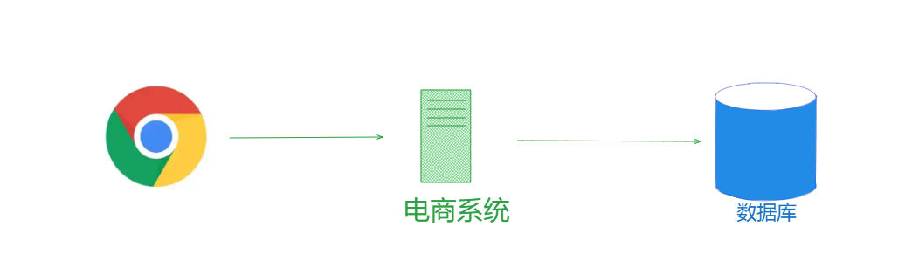

图中展示了「**单体架构**」下的电商平台，用户使用浏览器发起请求访问电商系统，电商系统会直接从后端的数据库存储中查询相应的用户数据、订单数据、商品信息，以及库存数据等进行展示。当系统出现性能下降、异常信息的问题时，运维人员可以直接去电商系统中查看相应的日志或是系统监控，就基本可以定位到问题。

下图展示了现实中「**微服务架构**」下的电商系统，整个电商系统被拆分成了很多子服务，每个子服务都是以集群的方式对外提供服务。当用户通过浏览器/手机 App 浏览商城的时候，请求会首先到达接入层 API 集群中的一个实例，该实例会通过 RPC 请求「**库存服务**」、「**商品服务**」、「**订单服务**」、「**用户服务**」，查询底层的存储，获取相应的数据，最终形成完整的响应结果返回给用户。

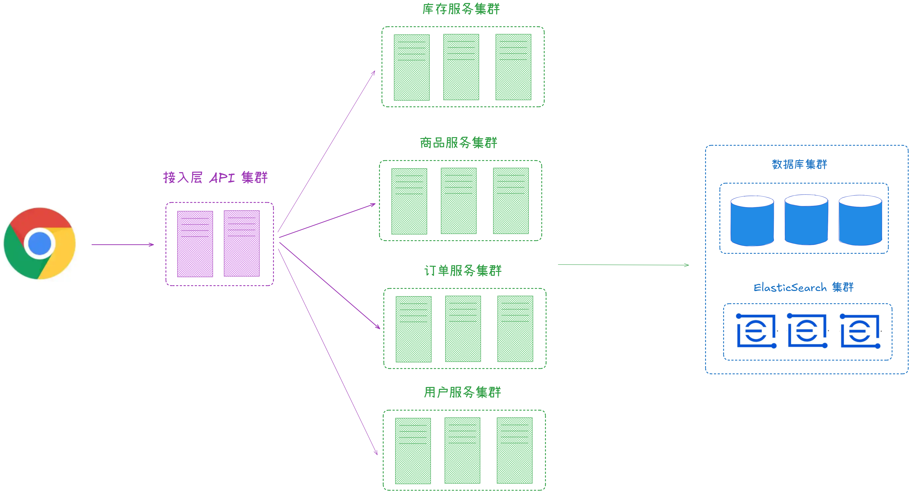

当集群无法支撑现在的访问量时，整个电商系统对外表现的性能就会下降，而用户请求涉及的服务和服务实例比较多，要查找到这个问题就需要浏览多个服务和机器的日志，步骤非常繁琐，所以说微服务架构下的问题定位变得比较困难。

在定位到这个问题之后，我们可能考虑要给商品服务集群进行扩容，计算扩容多少台机器、新增部署多少个实例，都是需要相应的数据做支撑的，而不是凭开发和运维人员的直觉。

为了解决微服务架构系统面临的上述挑战，APM 监控系统应运而生。

## **2.1 Logging && Metrics && Tracing**

微服务系统的监控主要包含以下三个方面：

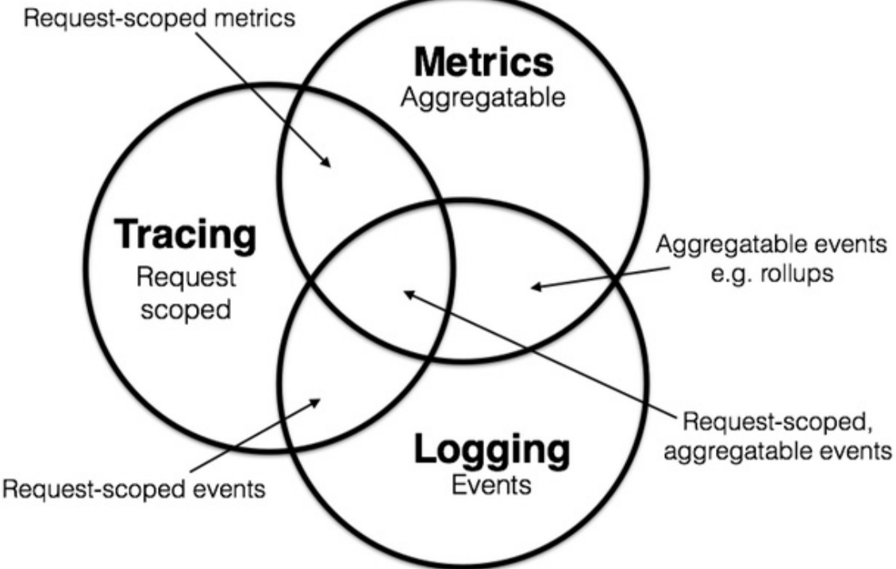

1.  Logging 就是记录系统行为的离散事件，例如，服务在处理某个请求时打印的错误日志，我们可以将这些日志信息记录到 ElasticSearch 或是其他存储中，然后通过 Kibana 或是其他工具来分析这些日志了解服务的行为和状态。大多数情况下，日志记录的数据很分散，并且相互独立，比如错误日志、请求处理过程中关键步骤的日志等等。
2.  Metrics 是系统在一段时间内某一方面的某个度量，例如，电商系统在一分钟内的请求次数。我们常见的监控系统中记录的数据都属于这个范畴，例如 Promethus、Open-Falcon 等，这些监控系统最终给运维人员展示的是一张张二维的折线图。Metrics 是可以聚合的，例如，为电商系统中每个 HTTP 接口添加一个计数器，计算每个接口的 QPS，之后我们就可以通过简单的加和计算得到系统的总负载情况。
3.  Tracing 即我们常说的分布式链路追踪。在微服务架构系统中一个请求会经过很多服务处理，调用链路会非常长，要确定中间哪个服务出现异常是非常麻烦的一件事。通过分布式链路追踪，运维人员就可以构建一个请求的视图，这个视图上展示了一个请求从进入系统开始到返回响应的整个流程。这样，就可以从中了解到所有服务的异常情况、网络调用，以及系统的性能瓶颈等。

另外，还能够迅速应对需求变化也是微服务架构的特点之一，这就会导致各个服务之间的调用关系发生频繁的变化，人工维护这种关系成本很高，通过分布式链路追踪即可掌握系统中各个服务的调用关系。

## **2.2 常见的 APM 系统**

APM 系统（Application Performance Management，即应用性能管理）是对企业的应用系统进行实时监控，实现对应用性能管理和故障定位的系统化解决方案。APM 作为系统运维管理和网络管理的一个重要方向，能够对关键服务进行监控、追踪以及告警，帮助开发和运维人员轻松地在复杂的应用系统中找到故障点，提高服务的稳定性，保证用户得到良好的服务，降低 IT 运维的成本。

当下成熟的互联网公司都已经建立了全方位监控系统，力求及时发现故障，并为优化系统提供性能数据支持。

国内比较常见的 APM 如下：

1.  CAT： 由国内美团点评开源的，基于 Java 语言开发，目前提供 Java、C/C++、Node.js、Python、Go 等语言的客户端，监控数据会全量统计。国内很多公司在用，例如美团点评、携程、拼多多等。CAT 需要开发人员手动在应用程序中埋点，对代码侵入性比较强。
2.  Zipkin： 由 Twitter 公司开发并开源，Java 语言实现。侵入性相对于 CAT 要低一点，需要对web.xml 等相关配置文件进行修改，但依然对系统有一定的侵入性。Zipkin 可以轻松与 Spring Cloud 进行集成，也是 Spring Cloud 推荐的 APM 系统。
3.  Pinpoint： 韩国团队开源的 APM 产品，运用了字节码增强技术，只需要在启动时添加启动参数即可实现 APM 功能，对代码无侵入。目前支持 Java 和 PHP 语言，底层采用 HBase 来存储数据，探针收集的数据粒度非常细，但性能损耗较大，因其出现的时间较长，完成度也很高，文档也较为丰富，应用的公司较多。
4.  SkyWalking： 国人开源的产品，2019 年 4 月 17 日 SkyWalking 从 Apache 基金会的孵化器毕业成为顶级项目。目前 SkyWalking 支持 Java、.Net、Node.js 等探针，数据存储支持MySQL、ElasticSearch等。 SkyWalking 与 Pinpoint 相同，Java 探针采用字节码增强技术实现，对业务代码无侵入。探针采集数据粒度相较于 Pinpoint 来说略粗，但性能表现优秀。目前，SkyWalking 增长势头强劲，社区活跃，中文文档齐全，没有语言障碍，支持多语言探针，这些都是 SkyWalking 的优势所在，还有就是 SkyWalking 支持很多框架，包括很多国产框架，例如，Dubbo、gRPC、SOFARPC 等等，也有很多开发者正在不断向社区提供更多插件以支持更多组件无缝接入 SkyWalking。

##   
**2.3 SkyWalking 架构**

之所以选择 SkyWalking，它是一个基于 OpenTracing 规范的、开源的 APM 系统，它是专门为微服务架构以及云原生架构而设计的。

1.  SkyWalking 是一个开源监控平台，用于从服务和云原生基础设施收集、分析、聚合和可视化数据。
2.  SkyWalking 提供了一种简单的方法来维护分布式系统的清晰视图，甚至可以跨云查看。它是一种现代APM，专门为云原生、基于容器的分布式系统设计。
3.  SkyWalking 从三个维度对应用进行监视：service（服务）, service instance（实例）, endpoint（端点）。服务和实例就不多说了，端点是服务中的某个路径或者说URI。
4.  SkyWalking 允许用户了解服务和端点之间的拓扑关系，查看每个服务/服务实例/端点的度量，并设置警报规则。

从 SkyWalking 6.0 开始，SkyWalking 将自身定义为一个观测性分析平台（Observability Analysis Platform，OAP）。

SkyWalking 核心功能：

1.  服务、服务实例、端点指标分析。
2.  服务拓扑图分析
3.  服务、服务实例和端点（Endpoint）SLA 分析
4.  慢查询检测
5.  告警

SkyWalking 特点：

1.  多语言自动探针，支持 Java、.NET Code 等多种语言。
2.  为多种开源项目提供了插件，为 Tomcat、 HttpClient、Spring、RabbitMQ、MySQL 等常见基础设施和组件提供了自动探针。
3.  微内核 + 插件的架构，存储、集群管理、使用插件集合都可以进行自由选择。
4.  支持告警。
5.  优秀的可视化效果。

SkyWalking 的架构图如下所示：

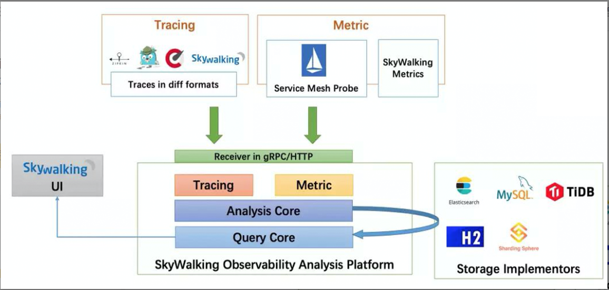

SkyWalking 分为三个核心部分：

1.  Agent（探针）：Agent 运行在各个服务实例中，负责采集服务实例的 Trace 、Metrics 等数据，然后通过 gRPC 方式上报给 SkyWalking 后端。
2.  OAP：SkyWalking 的后端服务，其主要责任有两个。
3.  一个是负责接收 Agent 上报上来的 Trace、Metrics 等数据，交给 Analysis Core （涉及 SkyWalking OAP 中的多个模块）进行流式分析，最终将分析得到的结果写入持久化存储中。SkyWalking 可以使用 ElasticSearch、H2、MySQL 等作为其持久化存储，一般线上使用 ElasticSearch 集群作为其后端存储。
4.  另一个是负责响应 SkyWalking UI 界面发送来的查询请求，将前面持久化的数据查询出来，组成正确的响应结果返回给 UI 界面进行展示。
5.  UI 界面：SkyWalking 前后端进行分离，该 UI 界面负责将用户的查询操作封装为 GraphQL 请求提交给 OAP 后端触发后续的查询操作，待拿到查询结果之后会在前端负责展示。

##   
**03 SkyWalking 部署**

在部署 SkyWalking 部署之前，需要先介绍下其依赖环境，在架构篇中我们提到，SkyWalking 可以使用多种存储组件进行数据持久化，其中 ElasticSeach 是其中主流选择。

##   
**3.1 依赖环境 ElasticSearch**

关于 ElasticSeach 与 Kibana 的安装可以参考这篇：[【电商实战项目第三十九篇】华仔电商实战项目商品中心服务手把手安装 ElasticSearch 7.9.3 版本及分词器](https://articles.zsxq.com/id_wp5i9us9k7d4.html)

## **3.2 依赖环境 Nacos**

关于 Nacos 的安装可以参考这篇：[【电商实战项目第四十七篇】华仔电商实战项目接入微服务全家桶之注册中心与配置中心 Nacos 3.0 及 feign 依赖](https://articles.zsxq.com/id_72j8opdvxzge.html)

## **3.3 SkyWalking 部署**

本次搭建使用 SkyWalking 最新发布的 10.1.0 版本，系统用的是 Ubuntu 22.04.5，安装好 JDK 11 版本或以上，建议 2 核 CPU/4G 内存及其以上。

官网下载地址：[https://downloads.apache.org/skywalking/10.1.0/](https://downloads.apache.org/skywalking/10.1.0/)

也可以从这里下载：[https://skywalking.apache.org/downloads/](https://skywalking.apache.org/downloads/)

### **3.3.1 下载 SkyWalking**

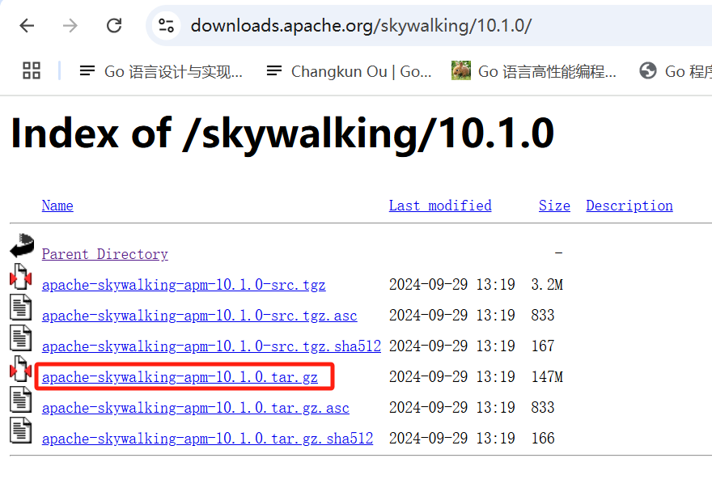

wget https://downloads.apache.org/skywalking/10.1.0/apache-skywalking-apm-10.1.0.tar.gz

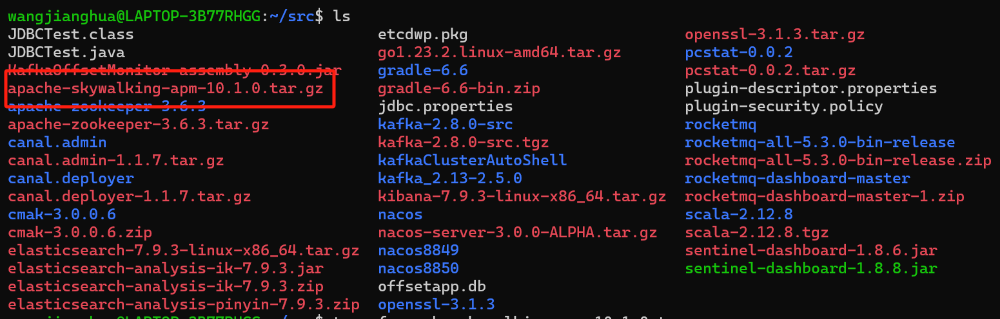

### **3.3.2 解压 SkyWalking**

tar xf apache-skywalking-apm-10.1.0.tar.gz

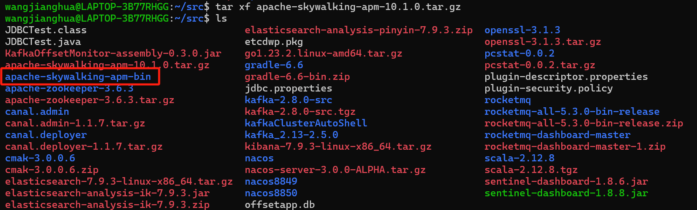

### **3.3.3 修改配置文件**

进入解压的根目录，找到 [config/apllication.yaml](http://config/apllication.yaml) 配置文件，这个配置文件隶属于服务层，主要用于配置 SkyWalking 的「**配置模块**」，「**存储组件**」，「**数据收集插件**」。

首先需要修改下集群配置，这里使用 Nacos 来存储元数据。

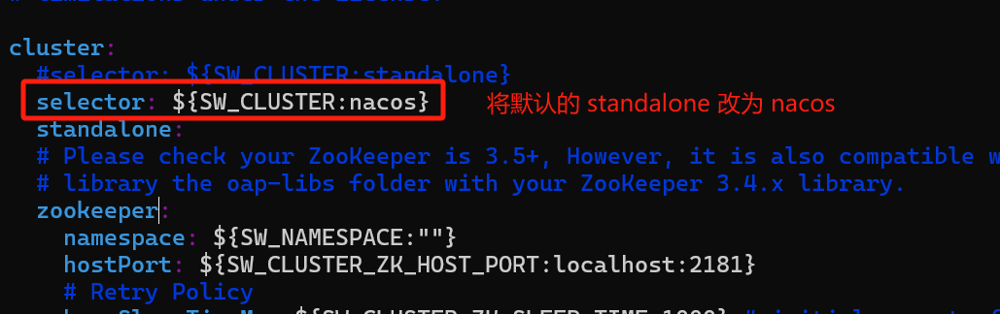

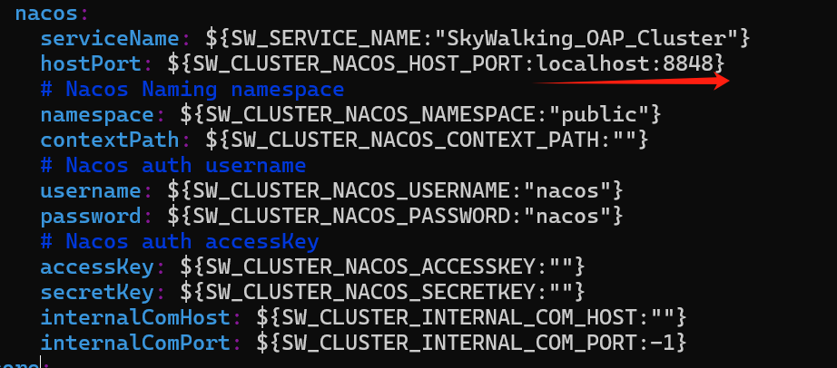

这里我们修改 ES 存储组件，有密码的添加密码（也可以不配置，直接使用内存数据库H2）：

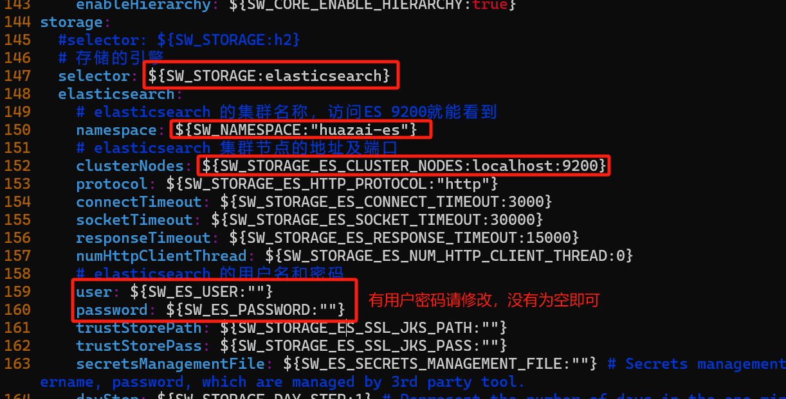

storage:

#selector: ${SW\_STORAGE:h2}

\# 存储的引擎

selector: ${SW\_STORAGE:elasticsearch}

elasticsearch:

\# elasticsearch 的集群名称，访问ES 9200就能看到

namespace: ${SW\_NAMESPACE:"huazai-es"}

\# elasticsearch 集群节点的地址及端口

clusterNodes: ${SW\_STORAGE\_ES\_CLUSTER\_NODES:localhost:9200}

protocol: ${SW\_STORAGE\_ES\_HTTP\_PROTOCOL:"http"}

connectTimeout: ${SW\_STORAGE\_ES\_CONNECT\_TIMEOUT:3000}

socketTimeout: ${SW\_STORAGE\_ES\_SOCKET\_TIMEOUT:30000}

responseTimeout: ${SW\_STORAGE\_ES\_RESPONSE\_TIMEOUT:15000}

numHttpClientThread: ${SW\_STORAGE\_ES\_NUM\_HTTP\_CLIENT\_THREAD:0}

\# elasticsearch 的用户名和密码

user: ${SW\_ES\_USER:""}

password: ${SW\_ES\_PASSWORD:""}

### **3.3.4 修改 SkyWalking web 启动端口**

这里需要修改下 web 启动端口，因为 [skywalking-webapp](http://skywalking-webapp%20/) 默认监听在 8080 端口（前面部署 Sentinel 已经占用），很容易出现端口占用冲突的情况，可以通过修改 [webapp/webapp.yml](http://webapp/webapp.yml) 配置文件使用其它端口。

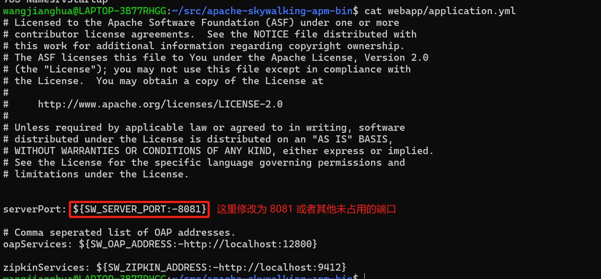

### **3.3.5 启动 SkyWalking**

\# 进入 bin 目录，sh startup.sh启动。

sh bin/startup.sh

等待一会就看到启动完成了。

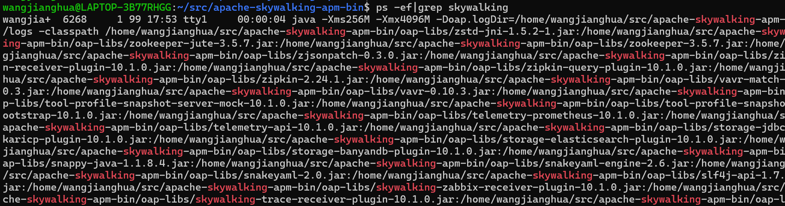

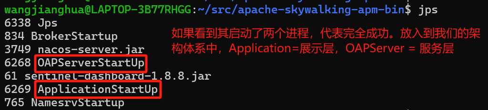

如果启动失败可以在 [logs/skywalking-oap-server.log](http://logs/skywalking-oap-server.log)（服务端） 以及 [logs/skywalking-webapp.log](http://logs/skywalking-webapp.log) （Web UI）两个日志文件中查看到 SkyWalking OAP 以及 UI 项目的相关日志，这里不再展开。

启动完成后可以看到在 Nacos 的服务列表中有 SkyWalking 的信息。

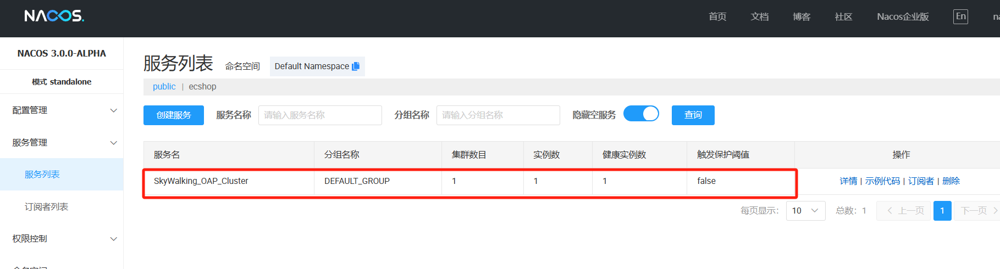

### **3.3.6 访问 SkyWalking WebUI**

启动之后访问 localhost:8081，稍等一会，看到下方所示的界面表示成功了一半。

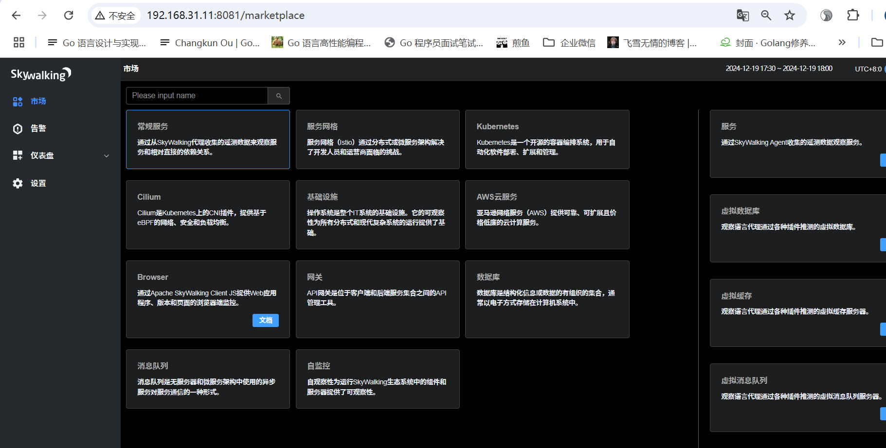

> 注意：9.6.0版本之后，只有存在相关服务时，右侧的菜单才会展示。默认进来全是空的，下面我们来进行实现项目接入。

## **3.4 SkyWalking 接入实战项目**

接下来我们将利用 SkyWalking 的 Agent 对应用进行监控，这里直接启动「**商品服务**」项目。SkyWalking 在 Java中使用的是「**字节方式植入**」，是完全无代码侵入的。

###   
**3.4.1 选择 VM-Option**

打开 IDEA 启动项目的配置项，选择 VM-Options，位置如下：

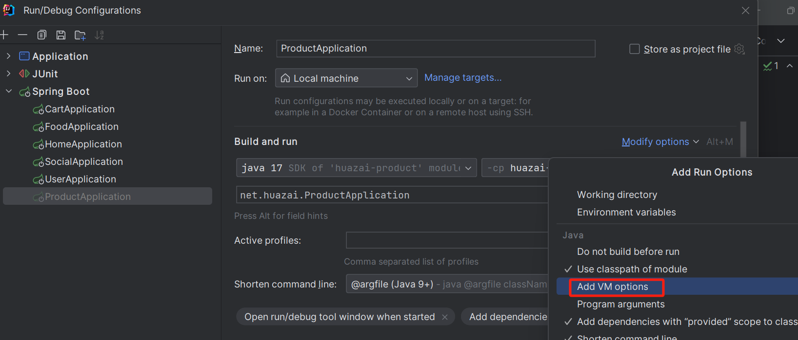

### **3.4.2 添加 VM-Option 配置**

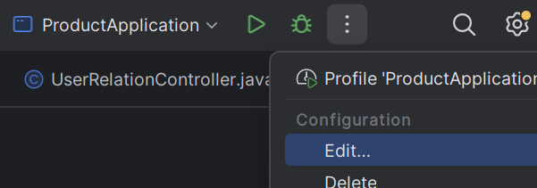

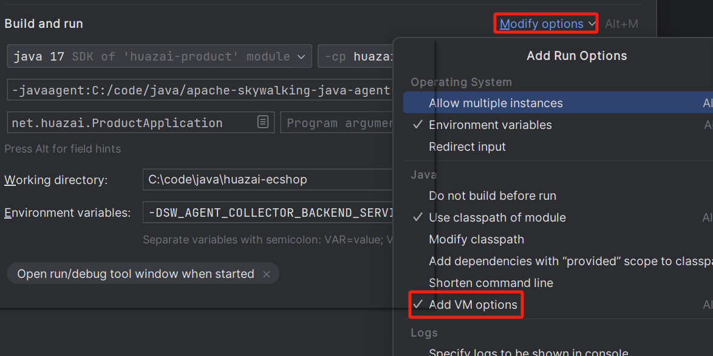

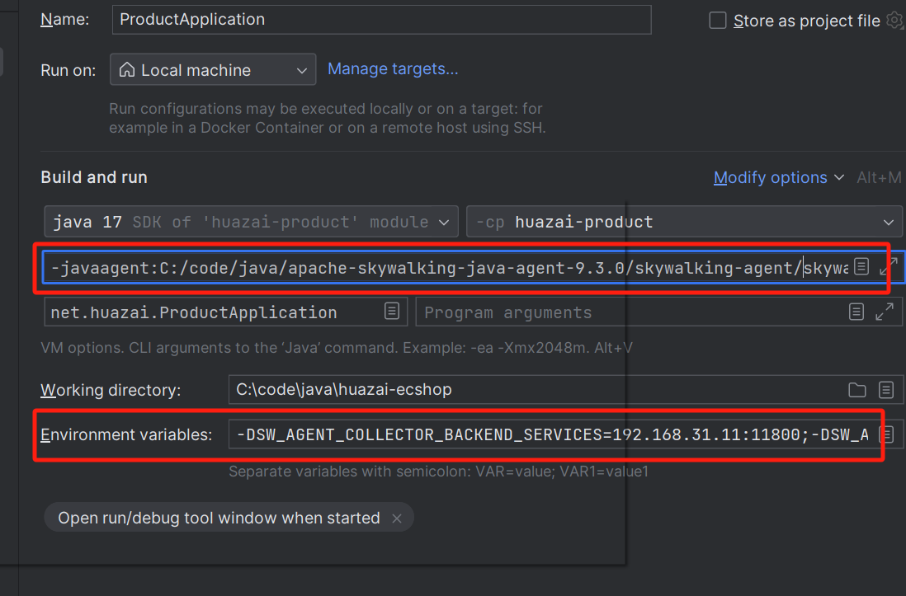

这里的 [skywalking-agent.jar](http://skywalking-agent.jar/) 包可以从下面的地址下载。

\# skywalking agent jar包路径

\-javaagent:C:/code/java/apache-skywalking-java-agent-9.3.0/skywalking-agent/skywalking-agent.jar

\# 环境变量

\-DSW\_AGENT\_COLLECTOR\_BACKEND\_SERVICES=192.168.31.11:11800;-DSW\_AGENT\_NAME=xdx-skywalking

1.  配置路径：由于我们使用项目启动时进行加载，所以需要配置在启动时自己的 jar 包路径。
2.  配置服务名称：服务层启动时，首先会去探针层的配置文件中读取服务名称，如果配置文件为空，则读取系统变量。
3.  配置服务层地址：探针层获取数据后，需要上传到服务层进行数据加工。因此我们需要配置服务层IP和端口。

这里简单的来了解下 [SkyWalking Agent](http://skywalking%20agent/) 技术，它使用了 Java Agent 技术，可以在无需手工埋点的情况下，通过 JVM 接口在运行时将监控代码段插入已有 Java 应用中，实现对 Java 应用的监控。

[SkyWalking Agent](http://skywalking%20agent/) 会将服务运行过程中获得的监控数据通过 gRPC 发送给后端的 OAP 集群进行分析和存储。

SkyWalking 目前提供的 Agent 插件在 [https://downloads.apache.org/skywalking/java-agent/9.3.0/](https://downloads.apache.org/skywalking/java-agent/9.3.0/) 目录下载。

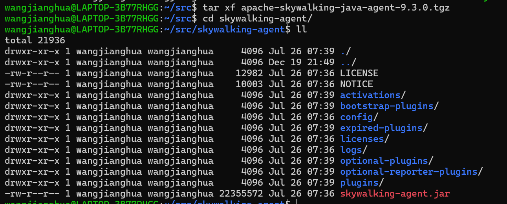

wangjianghua@LAPTOP-3B77RHGG:~/src/skywalking-agent$ tree

├── LICENSE

├── NOTICE

├── activations

│ ├── apm-toolkit-kafka-activation-9.3.0.jar

│ ├── apm-toolkit-log4j-1.x-activation-9.3.0.jar

│ ├── .....

│ └── apm-toolkit-webflux-activation-9.3.0.jar

├── bootstrap-plugins

│ ├── apm-jdk-forkjoinpool-plugin-9.3.0.jar

│ ├── apm-jdk-http-plugin-9.3.0.jar

│ ├── apm-jdk-threading-plugin-9.3.0.jar

│ └── apm-jdk-threadpool-plugin-9.3.0.jar

├── config

│ └── agent.config

├── expired-plugins

│ └── apm-impala-jdbc-2.6.x-plugin-9.3.0.jar

├── licenses

│ └── LICENSE-asm.txt

├── logs

├── optional-plugins

│ ├── apm-customize-enhance-plugin-9.3.0.jar

│ ├── apm-ehcache-2.x-plugin-9.3.0.jar

│ ├── .....

│ └── trace-sampler-cpu-policy-plugin-9.3.0.jar

├── optional-reporter-plugins

│ ├── kafka-reporter-plugin-9.3.0.jar

│ ├── lz4-java-1.6.0.jar

│ ├── snappy-java-1.1.7.3.jar

│ └── zstd-jni-1.4.3-1.jar

├── plugins

│ ├── apm-activemq-5.x-plugin-9.3.0.jar

│ ├── apm-activemq-artemis-jakarta-client-2.x-plugin-9.3.0.jar

│ ├── .....

│ └── websphere-liberty-23.x-plugin-9.3.0.jar

└── skywalking-agent.jar

其中：

1.  [agent.config](http://agent.config/) 文件是 SkyWalking Agent 的唯一配置文件。
2.  [plugins](http://plugins/) 目录存储了当前 Agent 生效的插件。
3.  [optional-plugins](http://optional-plugins/) 目录存储了一些可选的插件（这些插件可能会影响整个系统的性能或是有版权问题），如果需要使用这些插件，需将相应 jar 包移动到 plugins 目录下。
4.  [skywalking-agent.jar](http://skywalking-agent.jar/) 是 Agent 的核心 jar 包，由它负责读取 agent.config 配置文件，加载上述插件 jar 包，运行时收集到 的 Trace 和 Metrics 数据也是由它发送到 OAP 集群的。

### **3.4.3 重新启动项目**

配置完成后启动项目，会看到下面的日志，就说明 java-agent.jar 读取到了

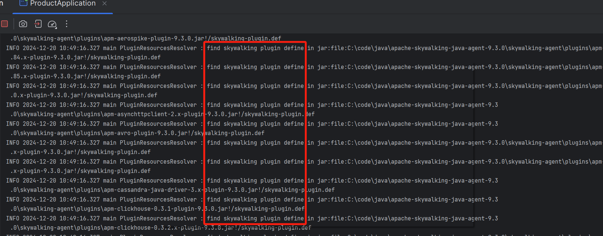

启动「**商品服务**」完成后随便请求一下接口，刷新页面，可以看到当前应用的数据已经上传到服务层。

链路追踪：

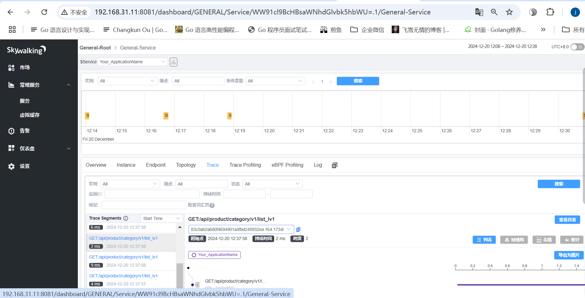

虚拟内存：

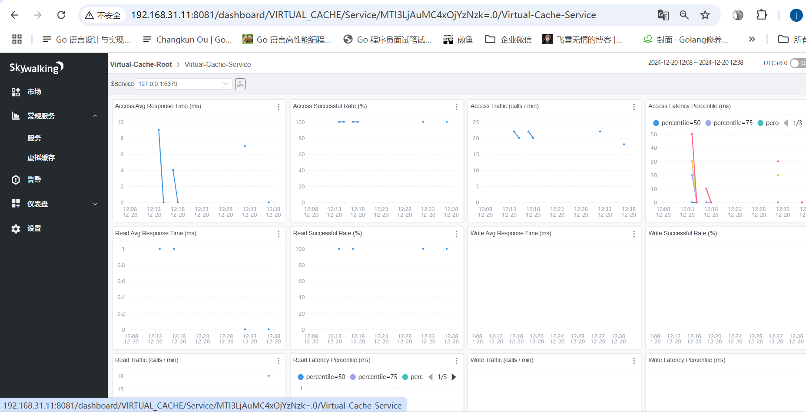