从今天之后的一段时间内，华仔会带着大家一起从零开始搭建并研发一套高并发的电商实战项目，这里会涉及到很多互联网大厂开发过程中所使用的核心技术和架构设计模式，希望大家学完之后可以用到自己的简历中。

接下来我们会重点架构设计和开发一下我们高并发电商实战项目中的「**商品中心服务**」。

这是第四十二篇，本篇我们继续进行电商实战项目设计与开发，本篇将进行「**商品中心服务**」 Elasticsearch 10W商品数据接口优化与双索引写入实战。

文章汇总位置：[https://wx.zsxq.com/dweb2/index/columns/51122554151214](https://wx.zsxq.com/dweb2/index/columns/51122554151214)

源码授权与获取地址：[https://articles.zsxq.com/id\_1s85grnaae4p.html](https://articles.zsxq.com/id_1s85grnaae4p.html)

本章源码地址：[https://gitcode.net/u011359591/huazai-ecshop/-/tree/ecshop-chapter-42](https://gitcode.net/u011359591/huazai-ecshop/-/tree/ecshop-chapter-42)

## **01 前言**

终于要设计与研发电商项目代码了，今天我们主要对「**商品中心服务**」 Elasticsearch 10W商品数据接口优化与双索引写入实战。

这里需要注意下，我们整个项目目前是不提供前端的，这个后续有时间在搞，主要是进行后端接口以及微服务模块架构设计。

## **02 商品中心服务 ES 接口写入优化**

在 【电商实战项目第四十一篇】华仔电商实战项目商品中心服务 Elasticsearch 商品数据写入基础功能接口开发 上篇中，我们已经针对 elasticsearch 7.9.3 版本中基于 [RestHighLevelClient](http://resthighlevelclient/) 高级客户端实现了 10 W条商品数据基础功能的写入。

但是在测试的过程中，发现会有丢失数据的现象。其原因就是在生成 bulk 请求时是通过「**随机索引**」实现的，代码如下：

  
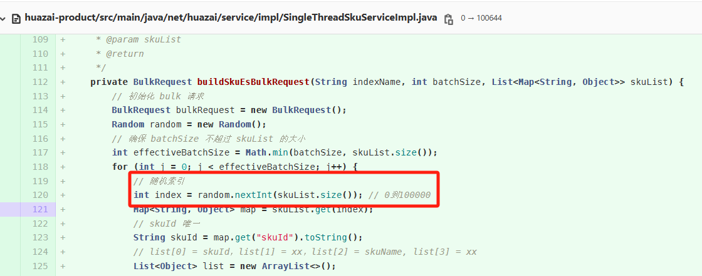

今天我们将对这部分代码进行优化和修复，目前采用的是「**正常索引**」，比如：第一批为【0-1000】，第二批为【1001-2000】这种实现。

  
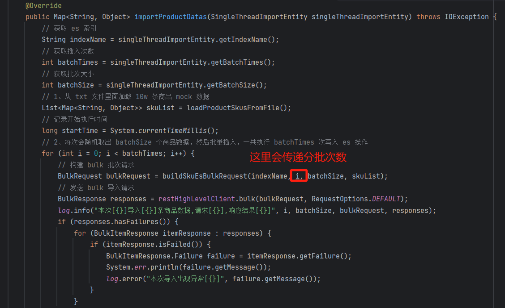

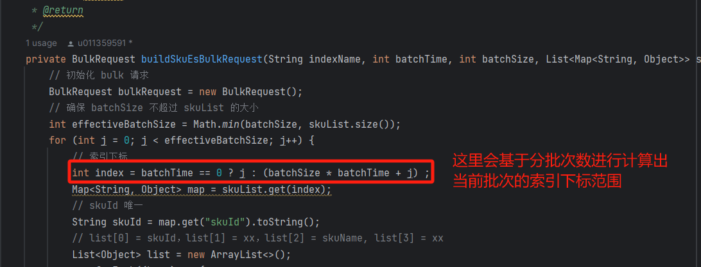

## **2.1 单线程批量写入 10w 条商品数据**

基于新版代码进行测试效果如下：

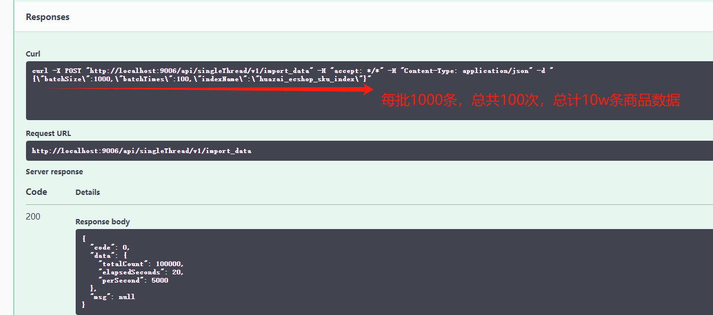

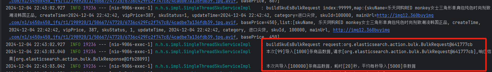

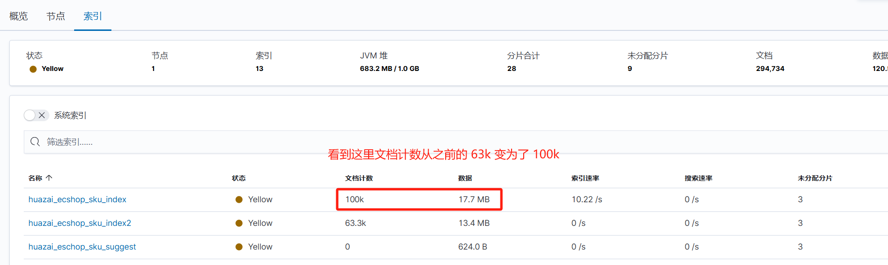

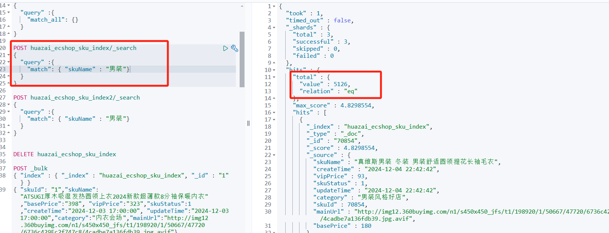

## **2.2 多线程批量写入 10w 条商品数据**

代码改动如下：

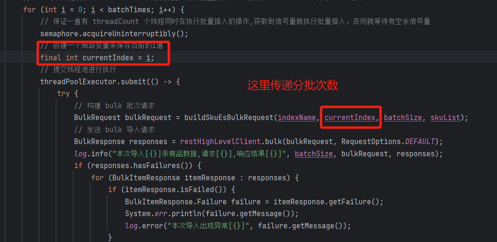

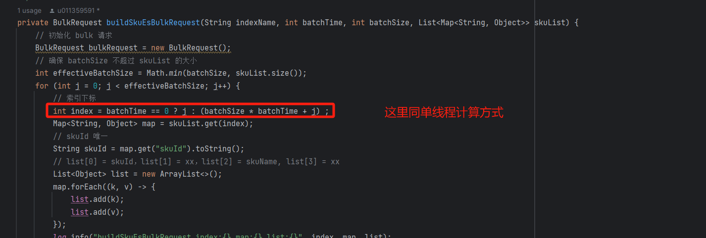

基于新版代码进行测试效果如下：

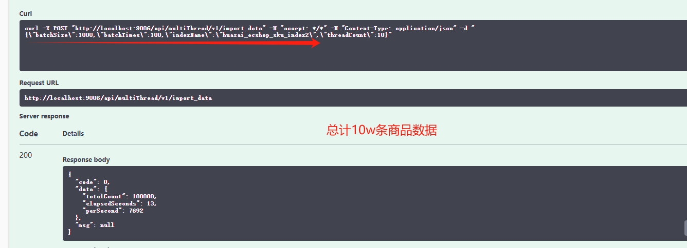

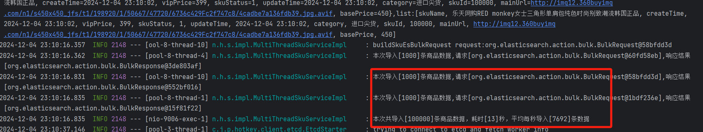

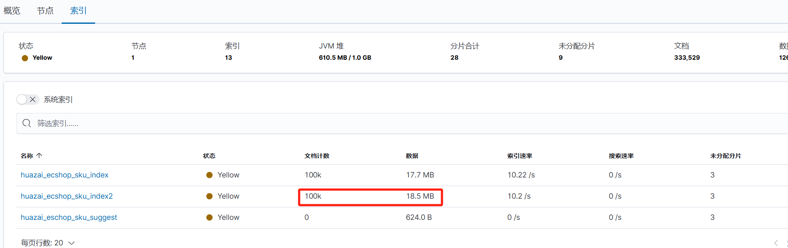

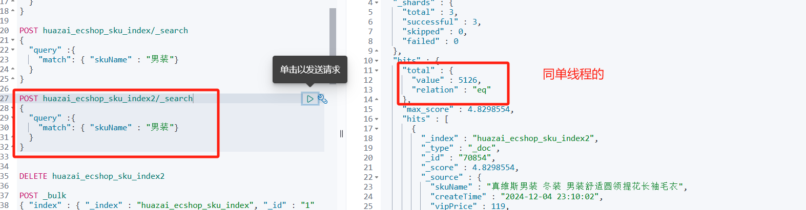

## **02 商品中心服务 ES 双索引写入实战**

上一个版本是从文本中读取的，我们这里会将文本内容写入到数据库中，关于写入操作，我放到 test 测试模块了，自行查看，商品分类基于文本的内容做了新增。

10w 条商品数据如下：

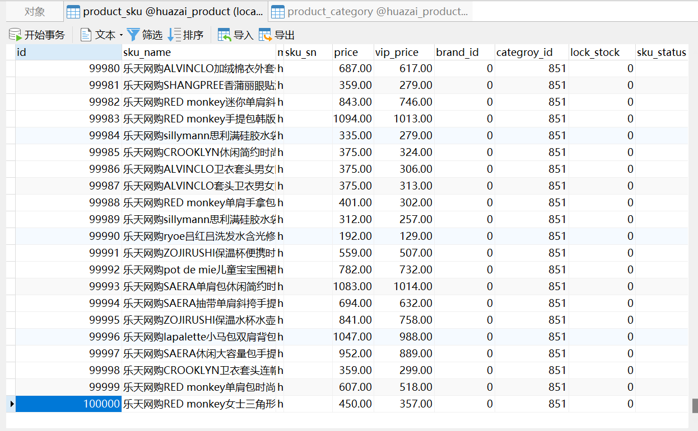

## **2.1 es sku 索引写入实战**

这里跟上一版本的不同是：

1.  上一版本是直接从文本中读取 10w 条商品数据，然后分批执行 bulk 请求写入 es。
2.  这一版本是分批从数据库中读取 1000 条商品数据，然后执行 bulk 请求写入 es。

/\*\*

\* 多线程批量从数据库导入商品 SkU 到 es sku 索引中

\* 官方地址：https://www.elastic.co/guide/en/elasticsearch/client/java-rest/7.17/java-rest-high-document-bulk.html

\* @param multiThreadImportEntity

\* @return

\* @throws IOException

\* @throws InterruptedException

\*/

@Override

public Map<String, Object> importProductDatasSkuIndex(MultiThreadImportDoubleIndexEntity multiThreadImportEntity) throws IOException, InterruptedException {

// 获取 es sku 索引

String indexName \= multiThreadImportEntity.getIndexName();

// 获取插入次数

int batchTimes \= multiThreadImportEntity.getBatchTimes();

// 获取批次大小

int batchSize \= multiThreadImportEntity.getBatchSize();

// 获取线程数

int threadCount \= multiThreadImportEntity.getThreadCount();

/\*\*

\* 这里使用 CountDownLatch 来倒计数

\* 当一个线程完成之后进行countDown，当所有线程都完成了以后才算真正结束

\*/

CountDownLatch countDownLatch \= new CountDownLatch(batchTimes);

/\*\*

\* 这里使用 semaphore 信号量，一个线程可以尝试从 semaphore 获取一个信号，如果获取不到就阻塞等待，

\* 获取到并用完该信号之后，就可以把信号还回去，本实例最多就只有 threadCount 个线程去获取到信号量

\*/

Semaphore semaphore \= new Semaphore(threadCount);

/\*\*

\* 这里使用 SynchronousQueue 队列，可能会出现比 semaphore 多需要线程的情况，这里 maximumPoolSize 设置为 threadCount \* 2，实际不会超过该值

\*/

ThreadPoolExecutor threadPoolExecutor \= new ThreadPoolExecutor(threadCount, threadCount \* 2,

60, TimeUnit.SECONDS, new SynchronousQueue<>());

// 记录开始执行时间

long startTime \= System.currentTimeMillis();

// 1、每次会随机取出 batchSize 个商品数据，然后批量插入，一共执行 batchTimes 次写入 es 操作

for (int i \= 0; i <= batchTimes; i++) {

// 保证一直有 threadCount 个线程同时在执行批量插入的操作,获取到信号量就执行批量插入，否则就等待有空余信号量

semaphore.acquireUninterruptibly();

// 创建一个局部变量来保存当前的i值

final int currentIndex \= i;

// 提交线程池进行执行

threadPoolExecutor.submit(() -> {

try {

// 2、分批从数据库中获取商品 mock 数据,每批 1000 条

List<Map<String, Object>> skuList = loadProductSkusFromDB(currentIndex, batchSize);

// 构建 sku bulk 批次请求

BulkRequest bulkRequest \= buildSkuEsBulkRequest(indexName, currentIndex, batchSize, skuList);

// 发送 sku bulk 导入请求

BulkResponse responses \= restHighLevelClient.bulk(bulkRequest, RequestOptions.DEFAULT);

log.info("本次导入\[{}\]条商品数据,请求\[{}\],响应结果\[{}\]", batchSize, bulkRequest, responses);

if (responses.hasFailures()) {

for (BulkItemResponse itemResponse : responses) {

if (itemResponse.isFailed()) {

BulkItemResponse.Failure failure \= itemResponse.getFailure();

System.err.println(failure.getMessage());

log.error("本次导入出现异常\[{}\]", failure.getMessage());

}

}

}

} catch (IOException e) {

e.printStackTrace();

} finally {

// 释放信号量

semaphore.release();

// 进行倒计数

countDownLatch.countDown();

}

});

}

// 记录结束执行时间

long endTime \= System.currentTimeMillis();

// 需要等待最后一个批次的批量插入操作执行完成

countDownLatch.await();

// 手动关闭线程池

threadPoolExecutor.shutdown();

// 3、统计信息

int totalCount \= batchSize \* batchTimes;

// 记录执行消耗时间

long elapsedSeconds \= (endTime - startTime) / 1000;

// 记录平均每秒导入条数

long perSecond \= elapsedSeconds > 0 ? totalCount / elapsedSeconds : totalCount;

log.info("本次共导入\[{}\]条商品数据，耗时\[{}\]秒，平均每秒导入\[{}\]条数据", totalCount, elapsedSeconds, perSecond);

Map<String, Object> result = new LinkedHashMap<>();

result.put("totalCount", totalCount);

result.put("elapsedSeconds", elapsedSeconds);

result.put("perSecond", perSecond);

return result;

}

流程图跟上一版类似：

只不过，我们本次测试使用的是 20 个线程。

测试效果如下：

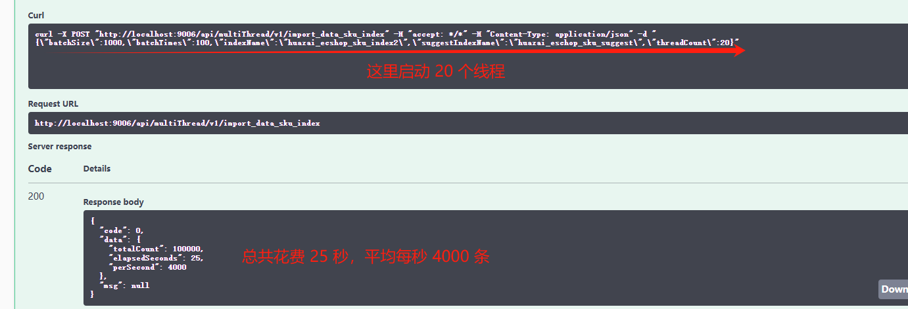

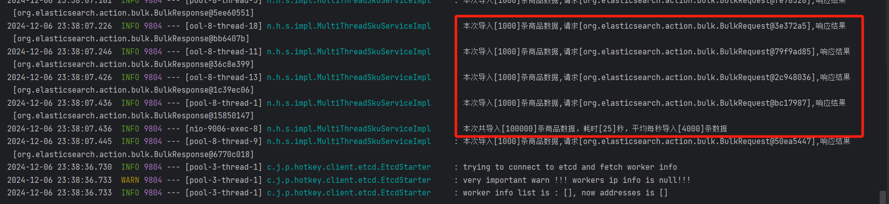

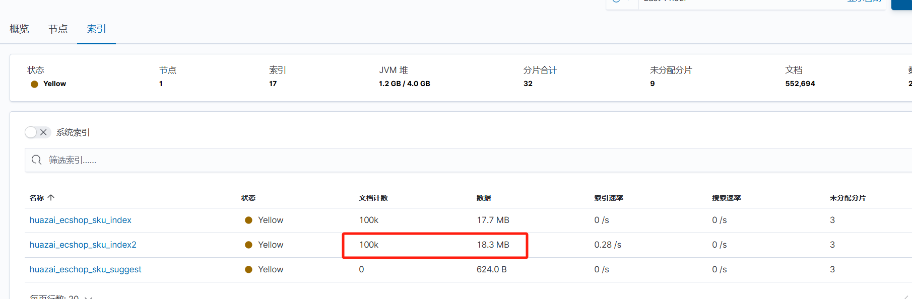

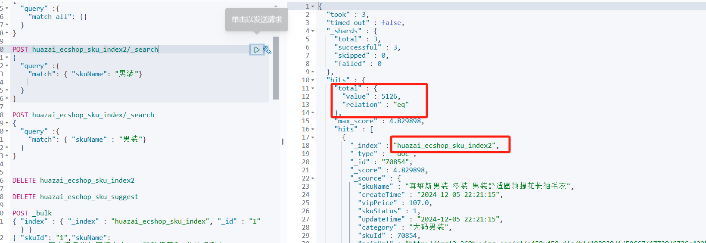

## **2.2 es suggest 索引写入实战**

由于我们对 suggest 索引使用了自定义的一个分词，这个索引会占用很大的磁盘空间，刚测试写入 9100 条数据占用 8 G 空间，后面会改进下，去掉拼音分词器，再看看占用空间。

代码如下，逻辑跟 sku 索引一致：

/\*\*

\* 多线程批量从数据库导入商品 SkU 到 es suggest 索引中

\* 官方地址：https://www.elastic.co/guide/en/elasticsearch/client/java-rest/7.17/java-rest-high-document-bulk.html

\* @param multiThreadImportEntity

\* @return

\* @throws IOException

\* @throws InterruptedException

\*/

@Override

public Map<String, Object> importProductDatasSuggestIndex(MultiThreadImportDoubleIndexEntity multiThreadImportEntity) throws IOException, InterruptedException {

// 获取 es suggest 索引

String suggestIndexName \= multiThreadImportEntity.getSuggestIndexName();

// 获取插入次数

int batchTimes \= multiThreadImportEntity.getBatchTimes();

// 获取批次大小

int batchSize \= multiThreadImportEntity.getBatchSize();

// 获取线程数

int threadCount \= multiThreadImportEntity.getThreadCount();

/\*\*

\* 这里使用 CountDownLatch 来倒计数

\* 当一个线程完成之后进行countDown，当所有线程都完成了以后才算真正结束

\*/

CountDownLatch countDownLatch \= new CountDownLatch(batchTimes);

/\*\*

\* 这里使用 semaphore 信号量，一个线程可以尝试从 semaphore 获取一个信号，如果获取不到就阻塞等待，

\* 获取到并用完该信号之后，就可以把信号还回去，本实例最多就只有 threadCount 个线程去获取到信号量

\*/

Semaphore semaphore \= new Semaphore(threadCount);

/\*\*

\* 这里使用 SynchronousQueue 队列，可能会出现比 semaphore 多需要线程的情况，这里 maximumPoolSize 设置为 threadCount \* 2，实际不会超过该值

\*/

ThreadPoolExecutor threadPoolExecutor \= new ThreadPoolExecutor(threadCount, threadCount \* 2,

60, TimeUnit.SECONDS, new SynchronousQueue<>());

// 记录开始执行时间

long startTime \= System.currentTimeMillis();

// 1、每次会随机取出 batchSize 个商品数据，然后批量插入，一共执行 batchTimes 次写入 es 操作

for (int i \= 0; i <= batchTimes; i++) {

// 保证一直有 threadCount 个线程同时在执行批量插入的操作,获取到信号量就执行批量插入，否则就等待有空余信号量

semaphore.acquireUninterruptibly();

// 创建一个局部变量来保存当前的i值

final int currentIndex \= i;

// 提交线程池进行执行

threadPoolExecutor.submit(() -> {

try {

// 2、分批从数据库中获取商品 mock 数据,每批 1000 条

List<Map<String, Object>> skuList = loadProductSkusFromDB(currentIndex, batchSize);

// 构建 suggest bulk 批次请求

BulkRequest suggestBulkRequest \= buildSuggestIndexBulkRequest(suggestIndexName, currentIndex, batchSize, skuList);

// 发送 suggest bulk 导入请求

BulkResponse suggestResponses \= restHighLevelClient.bulk(suggestBulkRequest, RequestOptions.DEFAULT);

log.info("本次导入\[{}\]条商品 suggest 数据,请求\[{}\],响应结果\[{}\]", batchSize, suggestBulkRequest, suggestResponses);

if (suggestResponses.hasFailures()) {

for (BulkItemResponse itemResponse : suggestResponses) {

if (itemResponse.isFailed()) {

BulkItemResponse.Failure failure \= itemResponse.getFailure();

System.err.println(failure.getMessage());

log.error("本次导入 suggest 数据出现异常\[{}\]", failure.getMessage());

}

}

}

} catch (IOException e) {

e.printStackTrace();

} finally {

// 释放信号量

semaphore.release();

// 进行倒计数

countDownLatch.countDown();

}

});

}

// 记录结束执行时间

long endTime \= System.currentTimeMillis();

// 需要等待最后一个批次的批量插入操作执行完成

countDownLatch.await();

// 手动关闭线程池

threadPoolExecutor.shutdown();

// 3、统计信息

int totalCount \= batchSize \* batchTimes;

// 记录执行消耗时间

long elapsedSeconds \= (endTime - startTime) / 1000;

// 记录平均每秒导入条数

long perSecond \= elapsedSeconds > 0 ? totalCount / elapsedSeconds : totalCount;

log.info("本次共导入\[{}\]条商品数据，耗时\[{}\]秒，平均每秒导入\[{}\]条数据", totalCount, elapsedSeconds, perSecond);

Map<String, Object> result = new LinkedHashMap<>();

result.put("totalCount", totalCount);

result.put("elapsedSeconds", elapsedSeconds);

result.put("perSecond", perSecond);

return result;

}

但是这个索引在测试时候会超时错误，可能是由于 es 在进行大量的运算、拆分，处于高负荷的情况，导致 bulk 请求超时。

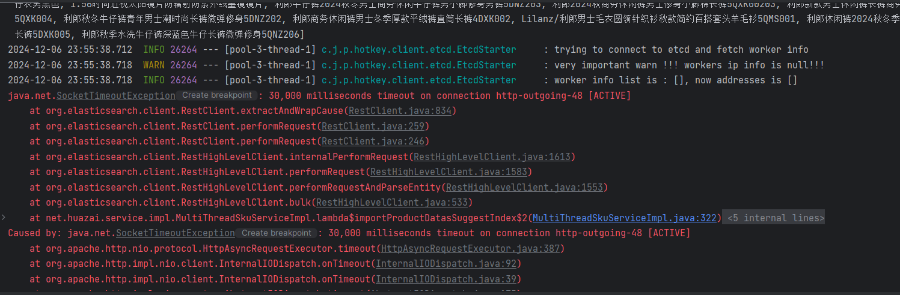

测试效果：

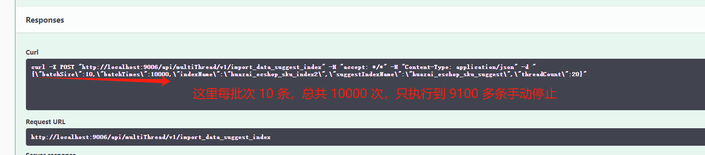

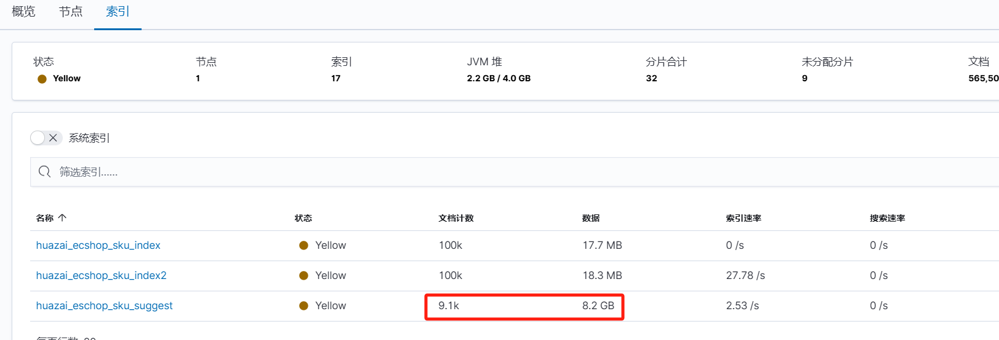

可以看到占用空间很大，后面调整不支持拼音的话看看情况如何，本次实战就到此。

简单搜索如下：

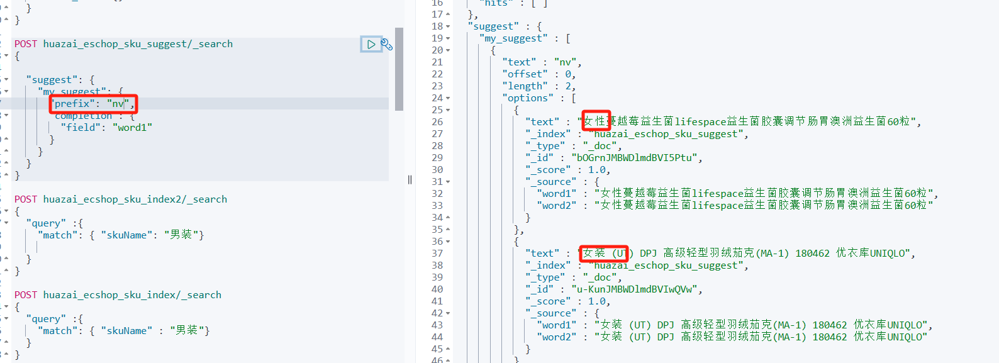

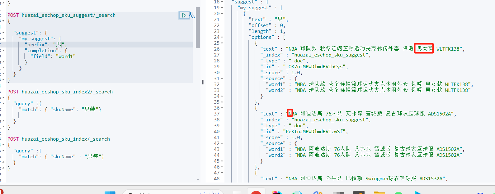