从今天之后的一段时间内，华仔会带着大家一起从零开始搭建并研发一套高并发的电商实战项目，这里会涉及到很多互联网大厂开发过程中所使用的核心技术和架构设计模式，希望大家学完之后可以用到自己的简历中。

接下来我们会重点架构设计和开发一下我们高并发电商实战项目中的「**商品中心服务**」。

这是第四十四篇，本篇我们继续进行电商实战项目设计与开发，本篇将进行「**商品中心服务**」基于 Canal + RocketMQ 实现商品数据增量同步 ES。

文章汇总位置：[https://wx.zsxq.com/dweb2/index/columns/51122554151214](https://wx.zsxq.com/dweb2/index/columns/51122554151214)

源码授权与获取地址：[https://articles.zsxq.com/id\_1s85grnaae4p.html](https://articles.zsxq.com/id_1s85grnaae4p.html)

本章源码地址：[https://gitcode.net/u011359591/huazai-ecshop/-/tree/ecshop-chapter-45](https://gitcode.net/u011359591/huazai-ecshop/-/tree/ecshop-chapter-45)

## **01 前言**

终于要设计与研发电商项目代码了，今天我们主要对「**商品中心服务**」 Elasticsearch基于 Canal + RocketMQ 实现商品数据增量同步 ES。

这里需要注意下，我们整个项目目前是不提供前端的，这个后续有时间在搞，主要是进行后端接口以及微服务模块架构设计。

## **02 基于 Canal + RocketMQ 增量同步 ES 架构设计**

前面几篇，我们手把手带搭建实现了基于「**ElasticSearch**」的「**搜索服务搭建**」 、「**商品索引构建**」、「**商品数据全量同步 ES**」 、「**核心搜索接口**」 核心搜索接口实现。

还剩下 「**商品增量同步 ES**」的解决方案，本篇就来重点实现这个功能，这里我们采用 「**Canal**」 + 「**RocketMQ**」的方式来实现增量同步 ES。

先来看下什么是 「**Canal**」。

## **2.1 Canal 介绍**

Canal 是阿里开源的一款基于 MySql 数据库 binlog 的增量订阅和消费组件，通过它可以订阅数据库的 binlog 日志，然后进行一些数据消费，如数据镜像、数据异构、数据索引、缓存更新等。相对于消息队列，通过这种机制可以实现数据的有序化和一致性。

Canal 主要用途是对 MySql 数据库增量日志进行解析，提供增量数据的订阅和消费，简单说就是可以对 MySql 的增量数据进行实时同步，支持同步到 MySql、ElasticSearch、HBase 等数据存储中去。

官方源码地址：[https://github.com/alibaba/canal](https://github.com/alibaba/canal)。

### **2.1.1 Canal 工作原理**

Canal 是一个伪装成 slave 订阅 MySql 的 binlog 实现数据同步的中间件，如下图所示：

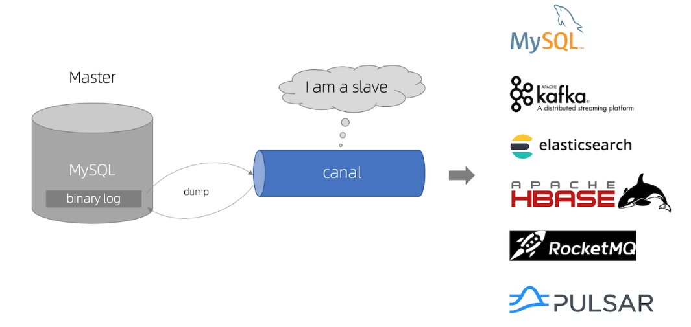

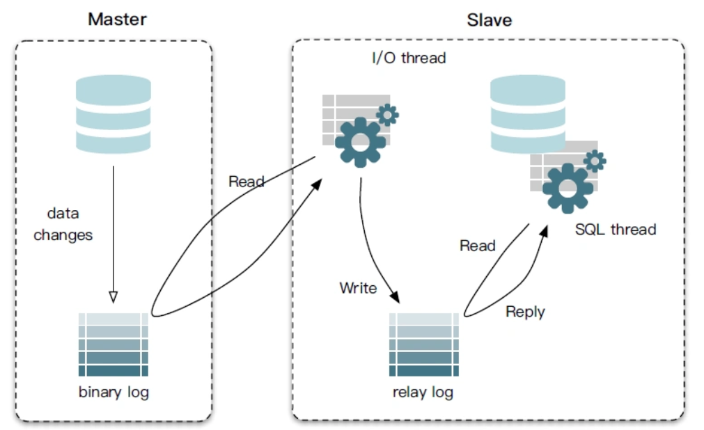

综上得知：

1.  Canal 模拟 MySql Slave 的交互协议，伪装自己为 MySql Slave ，向 MySql Master 发送dump 协议。
2.  MySql Master 收到 dump 请求，开始推送 binary log 给 Slave (即 Canal )。
3.  Canal 解析 binary log 对象（原始为 byte 流）。
4.  Canal 对外提供增量数据订阅和消费，提供 Kafka、RocketMQ、RabbitMq、Es、Tcp 等组件来消费。

### **2.1.2 Canal 使用场景**

1.  同步缓存 Redis/全文搜索 ES：Canal 一个常见应用场景是同步缓存/全文搜索，当数据库变更后通过 binlog 进行缓存/ES 的增量更新。当缓存/ES 更新出现问题时，应该回退 binlog 到过去某个位置进行重新同步，并提供全量刷新缓存/ES 的方法。
2.  下发任务：另一种常见应用场景是下发任务，当数据变更时需要通知其他依赖系统。其原理是任务系统监听数据库变更，然后将变更的数据写入 MQ（比如 Kafka） 进行任务下发，比如商品数据变更后需要通知商品详情页、列表页、搜索页等相关系统。这种方式可以保证数据下发的精确性，通过 MQ 发送消息通知变更缓存是无法做到这一点的，而且业务系统中不会散落着各种下发 MQ 的代码，从而实现了下发归集。
3.  数据异构：在大型网站架构中，DB 都会采用分库分表来解决容量和性能问题，但分库分表之后带来的新问题。比如不同维度的查询或者聚合查询，此时就会非常棘手。一般我们会通过数据异构机制来解决此问题。所谓的数据异构，那就是将需要 join 查询的多表按照某一个维度又聚合在一个DB 中，让你去查询。Canal 就是实现数据异构的手段之一。

###   
**2.1.3 Canal 架构设计**

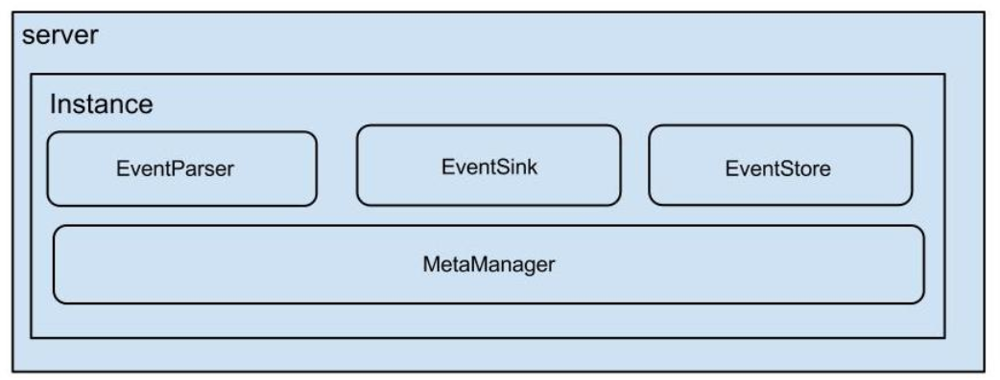

说明：

1.  server 代表一个 canal 运行实例，对应于一个 jvm。
2.  instance 对应于一个数据队列 (1个server对应1…n个instance)。

instance 模块：

1.  eventParser (数据源接入，模拟 db 的 slave 协议和 master 进行交互，协议解析)。
2.  eventSink(Parser 和 Store 链接器，进行数据过滤，加工，分发的工作)。
3.  eventStore (数据存储)。
4.  metaManager (增量订阅&消费信息管理器)。

###   
**2.1.4 Canal 配置信息**

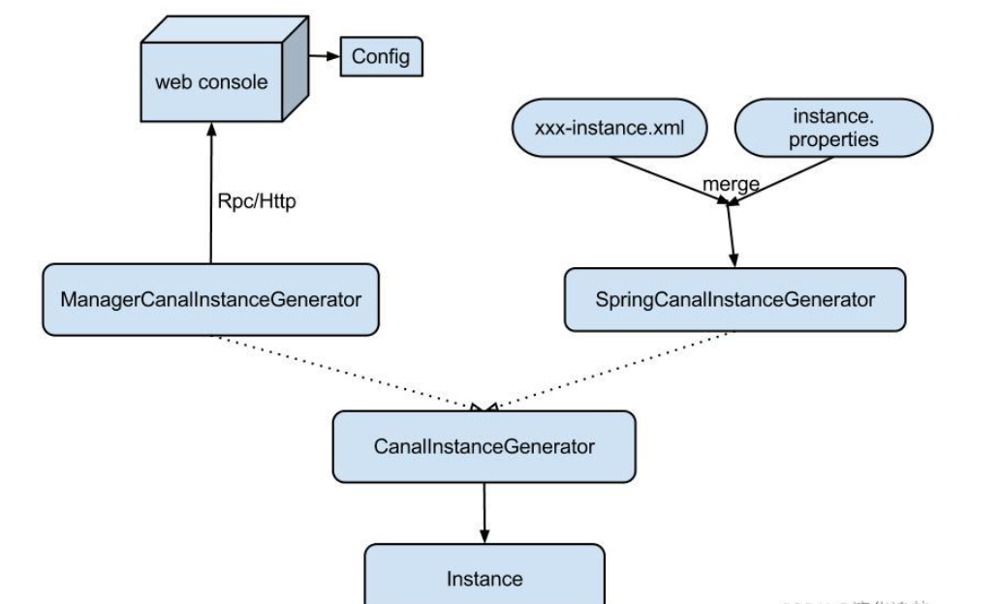

### **2.1.4.1 Canal 配置方式**

Canal 配置方式有两种：

1.  ManagerCanalInstanceGenerator：基于 Manager 管理的配置方式，目前 Alibaba 内部配置使用这种方式。大家可以实现 CanalConfigClient，连接各自的管理系统，即可完成接入。
2.  SpringCanalInstanceGenerator：基于本地 spring xml 的配置方式，目前开源版本已经自带该功能所有代码，建议使用。

Spring 配置的原理是将整个配置抽象为两部分：

1.  xxxx-instance.xml（Canal 组件的配置定义，可以在多个 Instance 配置中共享）；
2.  xxxx.properties（每个 Instance 通道都有各自一份定义，因为每个 MySql 的 ip，帐号，密码等信息不会相同）。
3.  通过 Spring 的 PropertyPlaceholderConfigurer 机制将其融合，生成一份 Instance 实例对象，每个Instance 对应的组件都是相互独立的，互不影响。

properties 配置文件分为两部分：

1.  canal.properties（系统根配置文件），下面详细说明；
2.  instance.properties（Instance 级别的配置文件，每个 Instance 一份）。

### **2.1.4.2 Canal.properties**

Canal 配置主要分为两部分定义：

1.  instance 列表定义，（列出当前 Server 上有多少个 Instance，每个 Instance 的加载方式是Spring/Manager 等) 以下选一些重要的参数说明一下：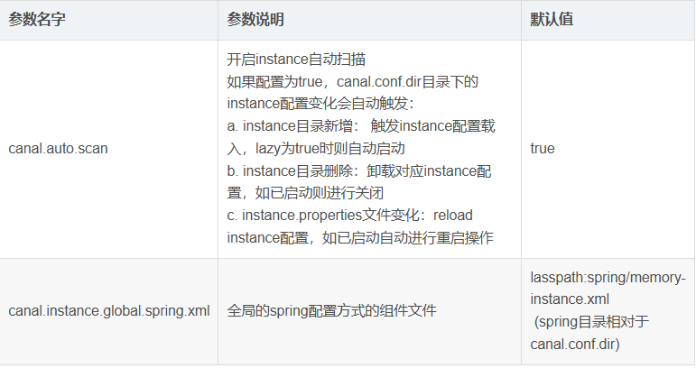
2.  common 参数定义，比如可以将 instance.properties 的公用参数，抽取放置到这里，这样每个Instance 启动的时候就可以共享。【instance.properties 配置定义优先级高于 canal.properties】以下选一些重要的参数说明一下：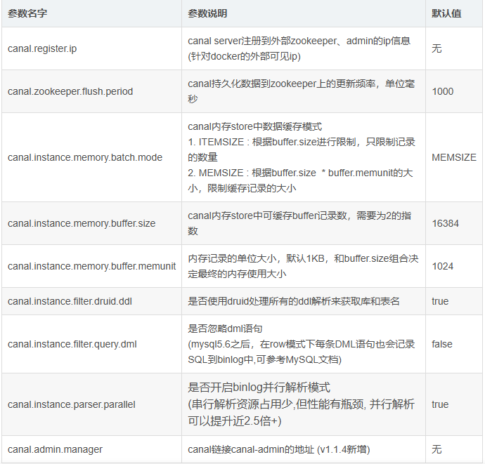

### **2.1.4.3 instance.properties**

在 canal.properties 定义了 canal.destinations 后，需要在 canal.conf.dir 对应的目录下建立同名的文件。如果 canal.properties 未定义 instance 列表，但开启了 canal.auto.scan 时：

1.  Server 第一次启动时，会自动扫描 conf 目录下，将文件名做为 instance name，启动对应的instance；
2.  Server 运行过程中，会根据 canal.auto.scan.interval 定义的频率，进行扫描：
3.  发现目录有新增，启动新的 Instance。
4.  发现目录有删除，关闭老的 Instance。
5.  发现对应目录的 instance.properties 有变化，重启 Instance。

instance.properties 参数列表（部分）：

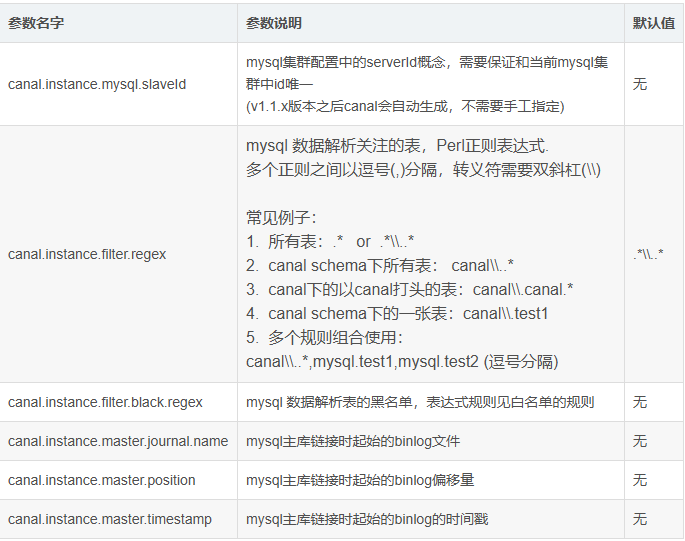

几点说明：

1.  MySql 链接时的起始位置
2.  canal.instance.master.journal.name + canal.instance.master.position：精确指定一个 binlog位点，进行启动。
3.  canal.instance.master.timestamp：指定一个时间戳，Canal 会自动遍历 mysql binlog，找到对应时间戳的 binlog 位点后，进行启动。
4.  不指定任何信息：默认从当前数据库的位点，进行启动。（show master status）。
5.  MySql 解析关注表定义
6.  标准的Perl正则，注意转义时需要双斜杠：\\\\。
7.  MySql 链接的编码
8.  目前 Canal 版本仅支持一个数据库只有一种编码，如果一个库存在多个编码，需要通过filter.regex 配置，将其拆分为多个 canal instance，为每个 Instance 指定不同的编码。

###   
**2.1.4.4 instance.xml 配置**

目前默认支持的 instance.xml 有以下几种：

1.  spring/memory-instance.xml
2.  spring/default-instance.xml
3.  spring/group-instance.xml

在介绍 instance 配置之前，先了解一下 Canal 如何维护一份增量订阅&消费的关系信息：

1.  解析位点（Parse 模块会记录，上一次解析 binlog 到了什么位置，对应组件为：CanalLogPositionManager）。
2.  消费位点（Canal Server 在接收了客户端的 ack 后，就会记录客户端提交的最后位点，对应的组件为：CanalMetaManager）。

对应的两个位点组件，目前都有几种实现：

1.  Memory（memory-instance.xml 中使用）。
2.  Zookeeper。
3.  Mixed。
4.  Period（default-instance.xml 中使用，集合了 Zookeeper+Memory 模式，先写内存，定时刷新数据到 Zookeeper 上）。

memory-instance.xml 介绍：

1.  所有的组件（parser、sink、store）都选择了内存版模式，记录位点的都选择了 Memory 模式，重启后又会回到初始位点进行解析。
2.  特点：速度最快，依赖最少（不需要 Zookeeper）。
3.  场景：一般应用在 quickstart，或者是出现问题后，进行数据分析的场景，不应该将其应用于生产环境。

default-instance.xml 介绍：

1.  Store 选择了内存模式，其余的 parser/sink 依赖的位点管理选择了持久化模式，目前持久化的方式主要是写入 Zookeeper，保证数据集群共享。
2.  特点：支持 HA。
3.  场景：生产环境，集群化部署。

group-instance.xml 介绍：

1.  主要针对需要进行多库合并时，可以将多个物理 Instance 合并为一个逻辑 Instance，提供客户端访问。
2.  场景：分库业务。比如产品数据拆分了4个库，每个库会有一个 Instance，如果不用 Group，业务上要消费数据时，需要启动4个客户端，分别链接4个 Instance 实例。使用 Group后，可以在 Canal Server 上合并为一个逻辑 Instance，只需要启动1个客户端，链接这个逻辑 Instance即可。

##   
**2.2 Canal + RocketMQ 同步架构**

binlog 同步保障数据一致性的架构：

  
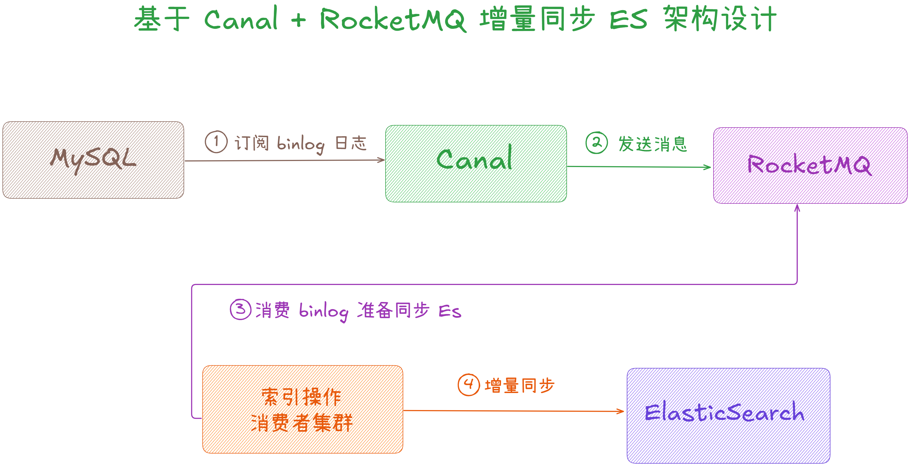

## **03 基于 Canal + RocketMQ 增量同步 ES 环境配置**

## **3.1 MySQL 配置**

对于自建 MySQL，需要先开启 Binlog 写入功能，配置 [binlog-format](http://binlog-format/) 为 [ROW](http://row%20/) 模式，my.cnf 中配置如下:

\[mysqld\]

log-bin=mysql-bin \# 开启 binlog

binlog-format=ROW \# 选择 ROW 模式

server\_id=1 \# 配置MySQL server\_id，不要和 canal 的 slaveId 重复

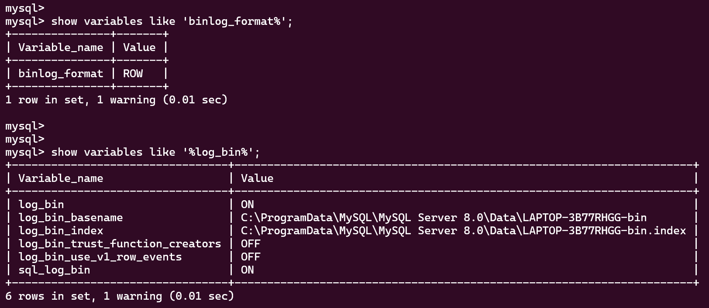

> 注意：针对阿里云 RDS for MySQL，默认已打开 binlog，并且账号默认具有 binlog dump 权限，不需要任何权限或者 binlog 设置，可以直接跳过这一步。

授权 Canal 连接 MySQL 账号具有作为 Mysql Slave 的权限，如果已有账户可直接使用 grant 命令授权。

#创建用户名和密码都为 canal

CREATE USER canal IDENTIFIED BY 'canal';

GRANT SELECT,INSERT,UPDATE,DELETE,ALTER,DROP, REPLICATION SLAVE, REPLICATION CLIENT ON \*.\* TO 'canal'@'%';

FLUSH PRIVILEGES;

  
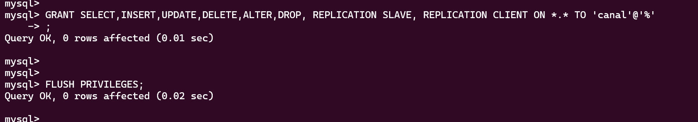

## **3.2 Canal 安装与配置**

### **3.2.1 Canal.admin 安装**

Canal 提供 web ui 进行 Server管理、Instance 管理。下载 [canal.admin](http://canal.admin/)，访问 release 页面，选择需要的包下载，这里以 1.1.7 版本为例。

官方 release 下载地址：[https://github.com/alibaba/canal/releases](https://github.com/alibaba/canal/releases)

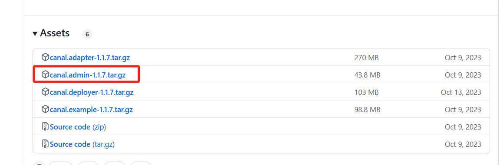

wget https://github.com/alibaba/canal/releases/download/canal-1.1.7/canal.admin-1.1.7.tar.gz

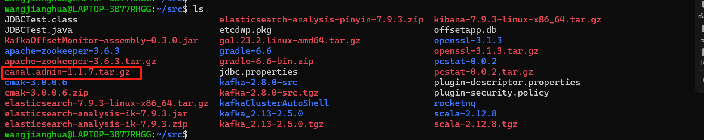

解压 canal.admin 完成可以看到如下结构：

tar xf canal.admin-1.1.7.tar.gz

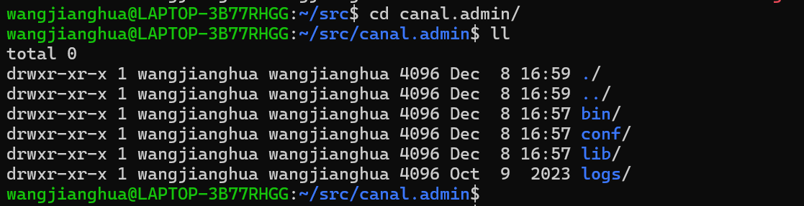

> 我们先配置 canal.admin 之后，通过 web ui 来配置 canal server，这样使用界面操作非常的方便。

### **3.2.2 Canal.admin 配置**

配置修改 [conf/application.yml](http://conf/application.yml)，默认配置即可：

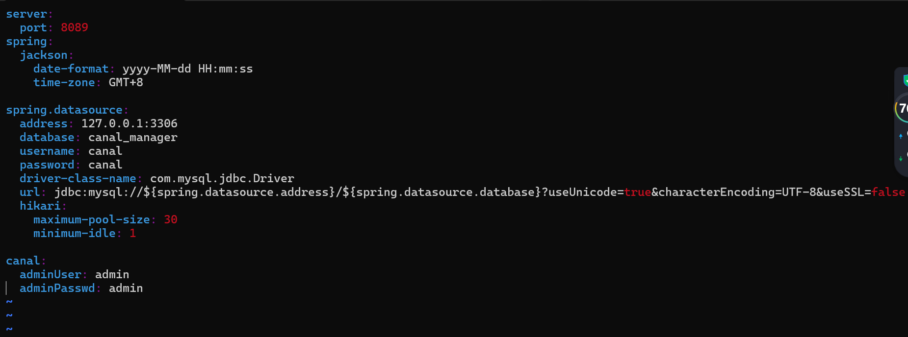

初始化元数据库：

mysql -h127.0.0.1 -uroot -p

\# 导入初始化SQL

\> source /home/wangjianghua/src/canal.admin/conf/canal\_manager.sql

  
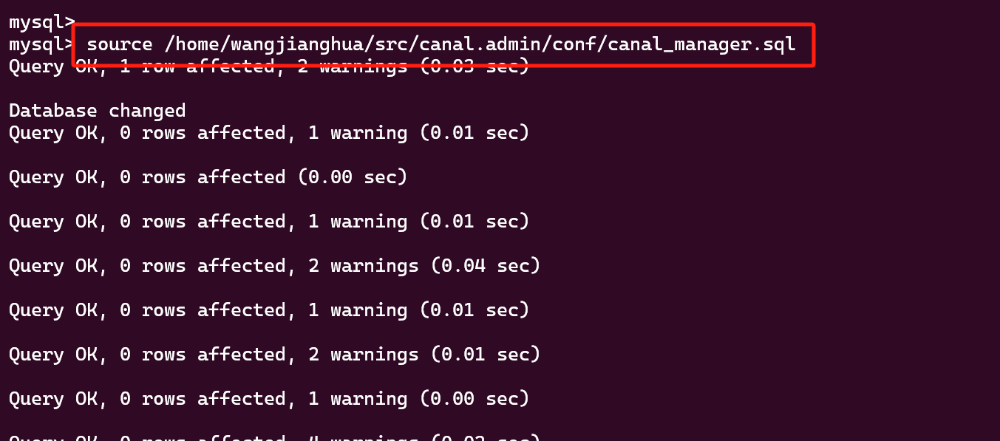

  
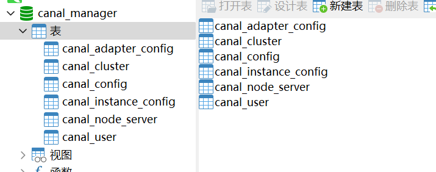

1.  初始化 SQL 脚本里会默认创建 canal\_manager 的数据库，建议使用 root 等有超级权限的账号进行初始化。
2.  canal\_manager.sql 默认会在 conf 目录下，也可以通过链接下载 canal\_manager.sql。

### **3.2.3 启动 Canal.admin**

sh bin/startup.sh

启动成功，使用浏览器输入 [http://ip:8089](http://ip:8089/) 会跳转到登录界面，如下：

  
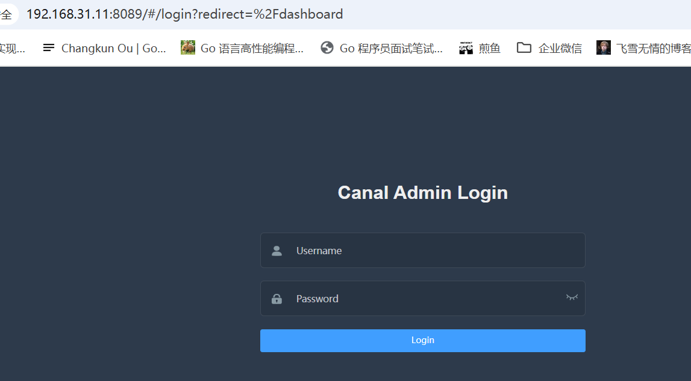

使用用户名：admin 密码为：123456 进行登录，登录成功，会自动跳转到如下界面。此时 [canal.admin](http://canal.admin/) 就搭建成功了。

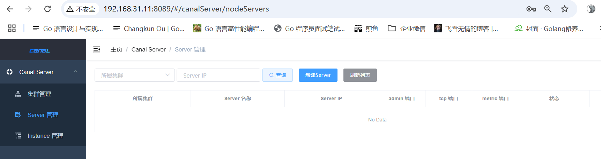

### **3.2.4 Canal.deployer 部署与启动**

下载 canal.deployer，访问 release 页面，选择需要的包下载，这里也是以 1.1.7 版本为例：

wget https://github.com/alibaba/canal/releases/download/canal-1.1.7/canal.deployer-1.1.7.tar.gz

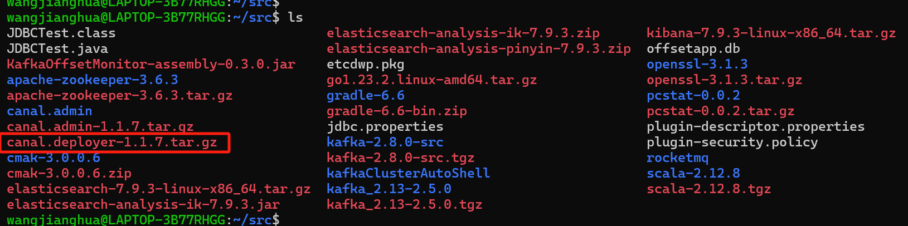

解压完成可以看到如下结构：

tar xf canal.deployer-1.1.7.tar.gz

  
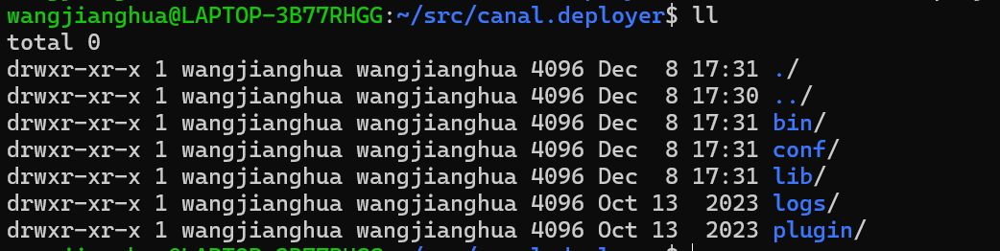

进入 conf 目录，可以看到如下的配置文件：

  
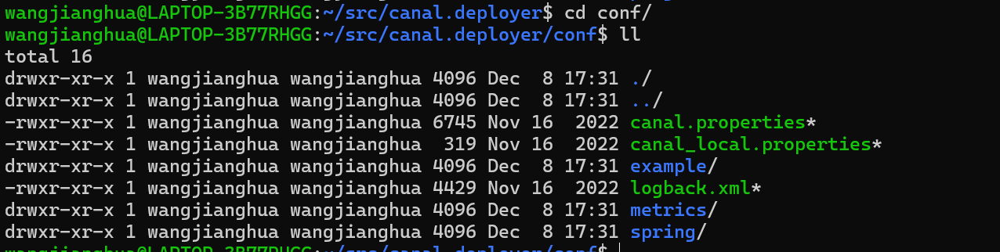

这里 [canal.properties](http://canal.properties/) 我们只修改 [canal.ip](http://canal.ip/)，其他不做任何修改，使用 [canal\_local.properties](http://canal_local.properties/) 的配置覆盖 [canal.properties](http://canal.properties/)。

**注意：这里有坑，刚开始这里的都是默认的配置，Canal 自己生成的 Server IP 根本无法启动（不清楚哪里原因或者是 bug），所以这里我修改了** [canal.properties](http://canal.properties/) 中的 [canal.ip](http://canal.ip/) 和 [canal\_local.properties](http://canal_local.properties/) 中的 [canal.register.ip](http://canal.register.ip/)，**这里的 IP 请修改成自己本地能访问通的 IP**。

这是 [canal.properties](http://canal.properties/) 配置文件：

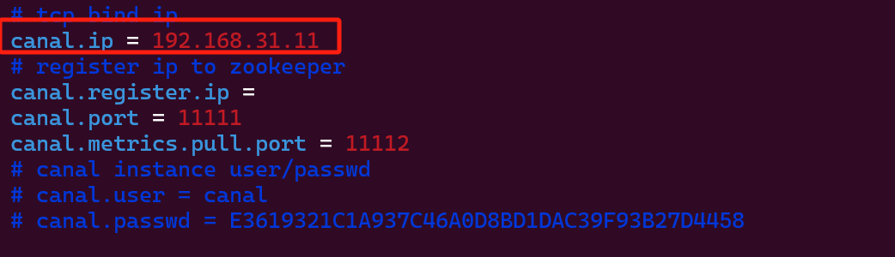

这是 [canal\_local.properties](http://canal_local.properties/) 配置文件：

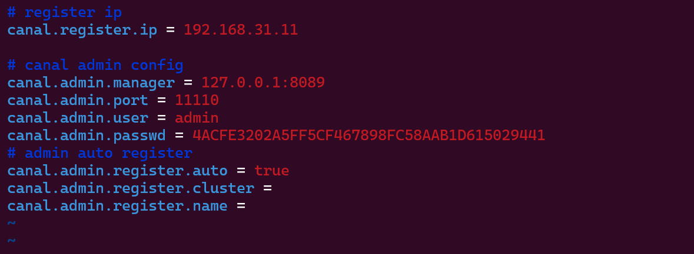

使用如下命令启动 canal server。

sh bin/startup.sh local

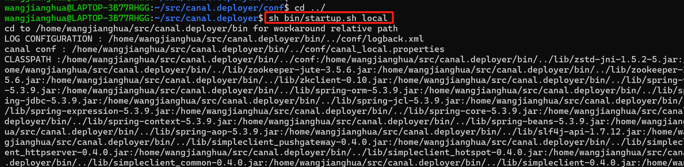

查看日志启动情况：

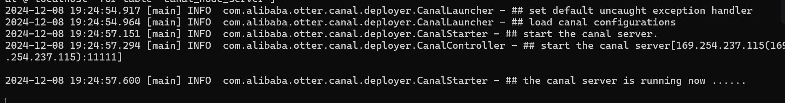

启动成功。同时我们在 canal.admin web ui 中刷新 server 管理，可以到 canal server 已经启动成功。

  
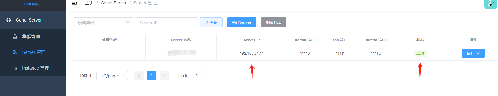

至此 canal.server 就已经搭建成功了。

###   
**3.2.5 新增 Instance**

新建Instance，路径： 选择 Instance 管理->新建 Instance，填写 Instance 名称：huazai\_product.

大概的步骤:

1.  选择所属主机集群
2.  选择载入模板
3.  修改默认信息

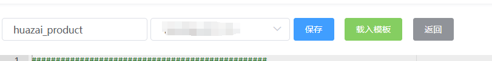

#################################################

\## mysql serverId , v1.0.26\+ will autoGen

\# canal.instance.mysql.slaveId=0

\# enable gtid use true/false

canal.instance.gtidon=false

\# position info 需要改成自己的数据库信息

canal.instance.master.address=127.0.0.1:3306

canal.instance.master.journal.name=

canal.instance.master.position=

canal.instance.master.timestamp=

canal.instance.master.gtid=

\# rds oss binlog

canal.instance.rds.accesskey=

canal.instance.rds.secretkey=

canal.instance.rds.instanceId=

\# table meta tsdb info

canal.instance.tsdb.enable=true

#canal.instance.tsdb.url=jdbc:mysql://127.0.0.1:3306/canal\_tsdb

#canal.instance.tsdb.dbUsername=canal

#canal.instance.tsdb.dbPassword=canal

#canal.instance.standby.address =

#canal.instance.standby.journal.name =

#canal.instance.standby.position =

#canal.instance.standby.timestamp =

#canal.instance.standby.gtid=

\# username/password 需要改成自己的数据库信息

canal.instance.dbUsername=root

canal.instance.dbPassword=123456

canal.instance.connectionCharset = UTF\-8

\# enable druid Decrypt database password

canal.instance.enableDruid=false

#canal.instance.pwdPublicKey=MFwwDQYJKoZIhvcNAQEBBQADSwAwSAJBALK4BUxdDltRRE5/zXpVEVPUgunvscYFtEip3pmLlhrWpacX7y7GCMo2/JM6LeHmiiNdH1FWgGCpUfircSwlWKUCAwEAAQ==

canal.instance.defaultDatabaseName=huazai\_product

canal.instance.connectionCharset=UTF\-8

\# table regex

canal.instance.filter.regex=.\*\\\\..\*

\# table black regex

canal.instance.filter.black.regex=

\# table field filter(format: schema1.tableName1:field1/field2,schema2.tableName2:field1/field2)

#canal.instance.filter.field=test1.t\_product:id/subject/keywords,test2.t\_company:id/name/contact/ch

\# table field black filter(format: schema1.tableName1:field1/field2,schema2.tableName2:field1/field2)

#canal.instance.filter.black.field=test1.t\_product:subject/product\_image,test2.t\_company:id/name/contact/ch

\# mq config MQ 配置日志数据会发送到 product\_sku\_to\_es 这个 topic 上

canal.mq.topic=product\_sku\_to\_es

\# dynamic topic route by schema or table regex

#canal.mq.dynamicTopic=mytest1.user,mytest2\\\\..\*,.\*\\\\..\*

#单分区处理消息

canal.mq.partition=0

\# hash partition config

#canal.mq.partitionsNum=3

#canal.mq.partitionHash=test.table:id^name,.\*\\\\..\*

#################################################

配置好之后，需要点击保存。此时在 Instances 管理中就可以看到此时的实例信息，说明 Instance 也已经启动成功了。

  
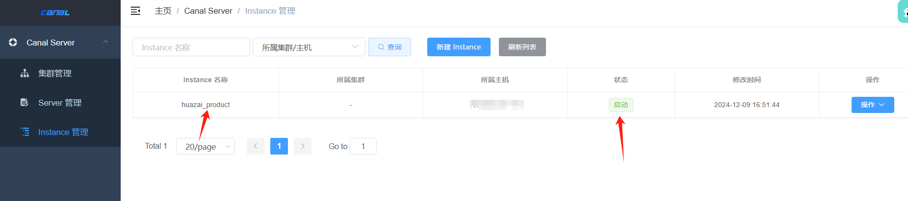

### **3.2.6 修改 Canal Server 配置文件，使用 MQ 处理 binlog**

自 Canal 1.1.1 版本之后，默认支持将 Canal Server接收到的 binlog 数据直接投递到 MQ，目前默认支持的 MQ 系统有:

1.  kafka: [https://github.com/apache/kafka](https://github.com/apache/kafka)
2.  RocketMQ : [https://github.com/apache/rocketmq](https://github.com/apache/rocketmq)

这里我们以 RocketMQ 为例，还是使用 web ui 界面操作。点击 server 管理 -> 点击配置：

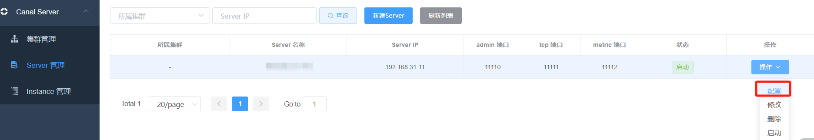

修改配置文件，修改好之后保存会自动重启。

\# ...

\# 可选项: tcp(默认), kafka, RocketMQ

canal.serverMode=RocketMQ

\# ...

\# rocketmq 集群配置:

canal.mq.servers=127.0.0.1:9876

canal.mq.retries=0

**注意：这里也有坑，修改后它会自动重启会报错，还原后也会报错，就是无法重新启动了，除非用命令重启才行：**

ps -ef|grep canal.deployer

kill -9 端口号

\# 删除 pid 和 lock 文件

rm -rf bin/canal.pid rm -rf conf/huazai\_product/\*

\# 命令重启

sh bin/startup.sh local

**解决方案：**

**目前我测试的一个结果是：提前改好配置文件，然后重启 Canal.admin 和 Canal.deployer，先这样，后面我再重新测试一下。**

\# ...

\# 可选项: tcp(默认), kafka, RocketMQ

canal.serverMode=RocketMQ

\# ...

\# rocketmq 集群配置:

canal.mq.servers=127.0.0.1:9876

canal.mq.retries=0

然后就成功了，如下：

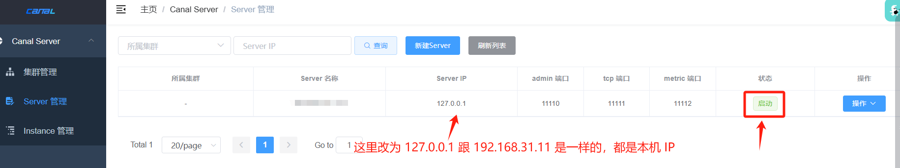

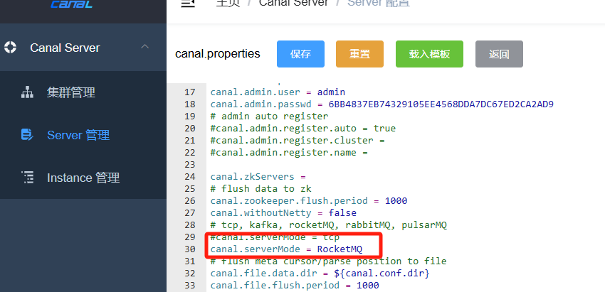

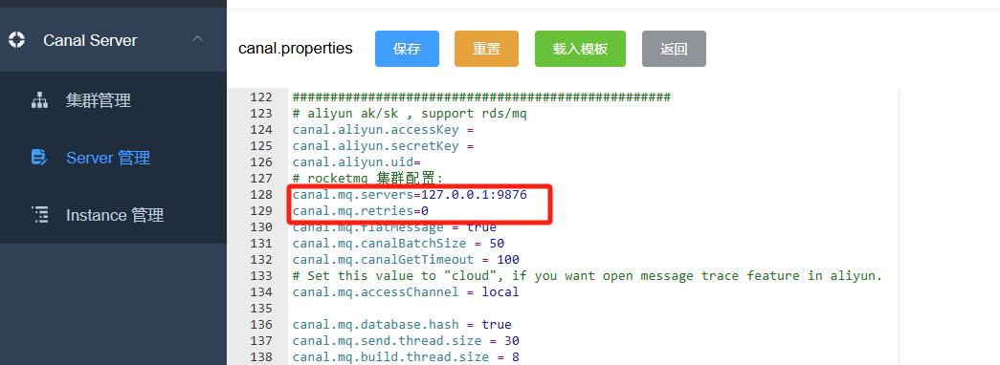

刷新 RocketMQ dashboard 后可以看到了我们填写的 Topic ：

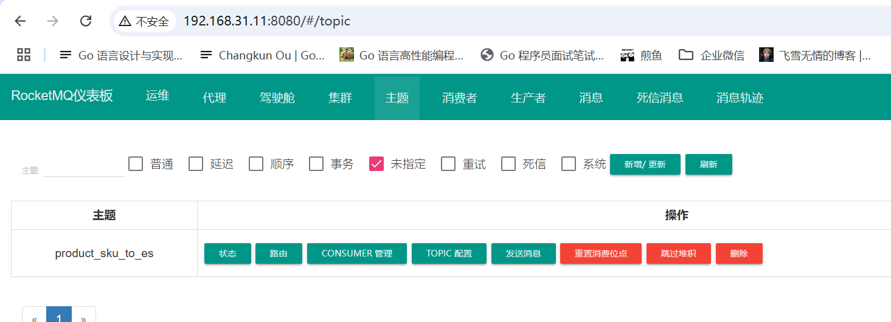

测试一下数据，插入一条商品数据到数据库：

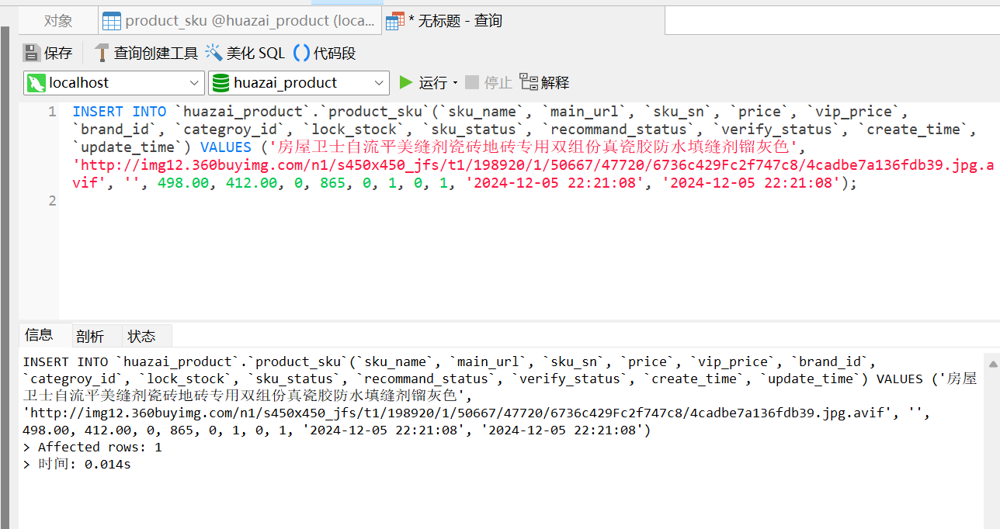

查看 RocketMQ Topic 监听到的数据：

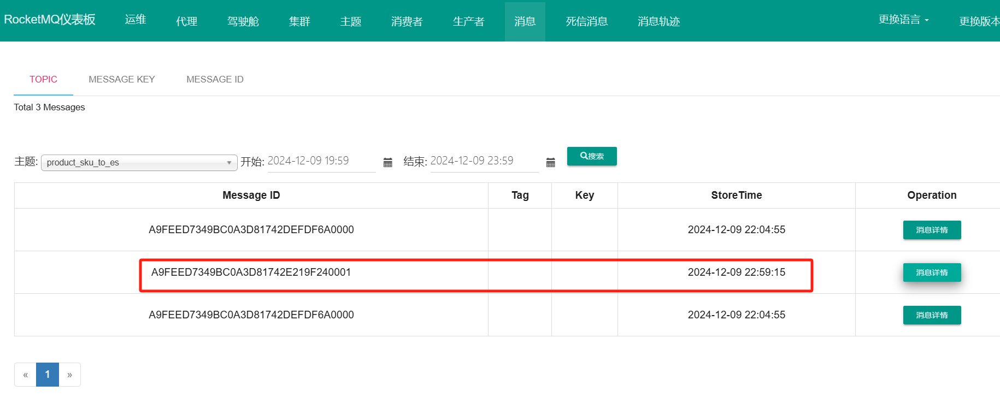

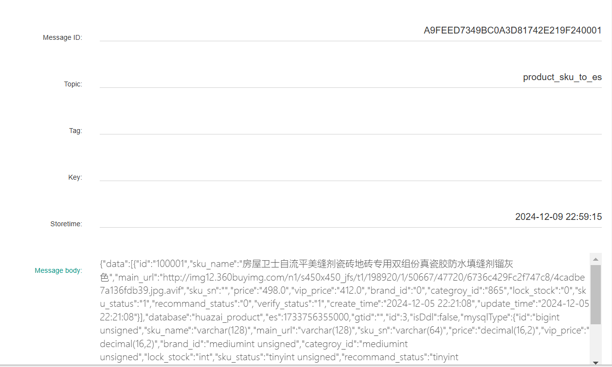

至此，我们服务方面就搭建好了，接下来就是接入到项目中。

## **04 商品服务增量同步 ES**

上面小节，已经将 MySQL 中的增量数据通过 Canal 组件同步到 RocketMQ 中，接下来，就是需要写一个 RocketMQ 消费者来同步数据到 ES 就行了。

代码也比较简单，就是重新调用一下前面做的**全量同步 ES** 的相关方法即可。

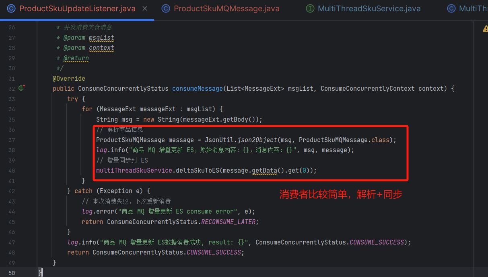

这里为了简化就没有重新写方法处理了，直接组装并调用 ES bulk 生成请求并写入 ES 了。

/\*\*

\* 增量同步到 ES

\* @param skuInfo

\* @return

\*/

@Override

public void deltaSkuToES(ProductSkuMQMessage.ProductSkuInfo skuInfo) throws IOException{

// 初始化商品结果集

List<Map<String, Object>> skuList = new ArrayList<>();

// 获取分类

Map<Integer, String> categoryMap = getCategoryMap();

Map<String, Object> sku = new HashMap<>();

sku.put("skuId", skuInfo.getId());

sku.put("skuName", skuInfo.getSku\_name());

// 支持自动补全

sku.put("skuNameCompletion", skuInfo.getSku\_name());

sku.put("category", categoryMap.get(skuInfo.getCategroy\_id()));

sku.put("basePrice", skuInfo.getPrice());

sku.put("vipPrice", skuInfo.getVip\_price());

// 图片这里就固定一个就行了，对于搜索来说用处不大

sku.put("mainUrl", skuInfo.getMain\_url());

sku.put("skuStatus", skuInfo.getSku\_status());

// 创建一个 SimpleDateFormat 对象并指定转换格式

SimpleDateFormat sdf \= new SimpleDateFormat("yyyy-MM-dd HH:mm:ss");

// 使用 SimpleDateFormat 对象的 format() 方法将 Date 对象转换为指定格式的字符串

String createTime \= sdf.format(skuInfo.getCreate\_time());

String updateTime \= sdf.format(skuInfo.getUpdate\_time());

sku.put("createTime", createTime);

sku.put("updateTime", updateTime);

skuList.add(sku);

log.info("商品 MQ 增量更新 ES, sku 请求\[{}\]", skuList);

// 构建 bulk 批次请求

BulkRequest bulkRequest \= buildSkuEsBulkRequest("huazai\_ecshop\_sku\_index2", 0, 1, skuList);

// 发送 bulk 导入请求

BulkResponse responses \= restHighLevelClient.bulk(bulkRequest, RequestOptions.DEFAULT);

log.info("商品 MQ 增量更新 ES 导入\[{}\]条商品数据,请求\[{}\],响应结果\[{}\]", 1, bulkRequest, responses);

if (responses.hasFailures()) {

for (BulkItemResponse itemResponse : responses) {

if (itemResponse.isFailed()) {

BulkItemResponse.Failure failure \= itemResponse.getFailure();

System.err.println(failure.getMessage());

log.error("商品 MQ 增量更新 ES 导入出现异常\[{}\]", failure.getMessage());

}

}

}

}

测试效果如下：

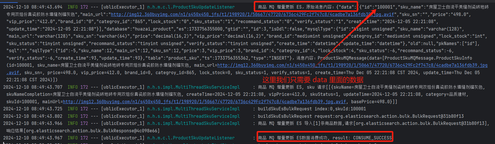

查看 ES 结果：

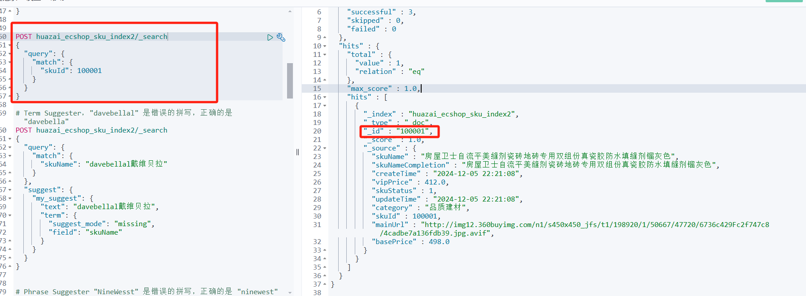

至此，基于 Canal + RocketMQ 实现商品数据增量同步 ES 的整个流程就已经跑通了，后续只需要启动服务自动监听即可。