从今天之后的一段时间内，华仔会带着大家一起从零开始搭建并研发一套高并发的电商实战项目，这里会涉及到很多互联网大厂开发过程中所使用的核心技术和架构设计模式，希望大家学完之后可以用到自己的简历中。

接下来我们会重点进行 SpringCloudAlibaba 微服务全家桶的整合并接入到我们实战项目中，等这些完事后再进行「**商品中心服务详情页架构设计**」。

这是第四十八篇，本篇我们继续进行电商实战项目设计与开发，本篇将进行「**微服务全家桶之 Sentinel 整合**」。

文章汇总位置：[https://wx.zsxq.com/dweb2/index/columns/51122554151214](https://wx.zsxq.com/dweb2/index/columns/51122554151214)

源码授权与获取地址：[https://articles.zsxq.com/id\_1s85grnaae4p.html](https://articles.zsxq.com/id_1s85grnaae4p.html)

本章源码地址：[https://gitcode.net/u011359591/huazai-ecshop/-/tree/ecshop-chapter-48](https://gitcode.net/u011359591/huazai-ecshop/-/tree/ecshop-chapter-48)

## **01 前言**

终于要设计与研发电商项目代码了，今天我们主要对实战项目进行「**微服务全家桶之 Sentinel 整合**」。

这里需要注意下，我们整个项目目前是不提供前端的，这个后续有时间在搞，主要是进行后端接口以及微服务模块架构设计。

## **02 为什么选择 Sentinel**

随着互联网的快速发展，越来越多的 C 端产品已经达到了百万甚至千万用户，随之带来了巨大的流量。这也导致了服务的压力越来越大，QPS（每秒查询率）也越来越高。因此，我们需要将单体项目拆分为分布式架构和微服务体系，以提高 QPS。

但是，不管如何拆分服务，服务能承载的请求数总有一个上限，一旦超过这个上限，服务器就会受到攻击式的压榨，导致服务直接挂掉，甚至无法启动，因为流量过大而无法承受。

关于服务治理应用场景也非常广泛，比如你是否遇到过以下问题：

1.  你在调用第三方接口或其他业务接口时需要控制速度，例如第三方接口限制 QPS 为 1000，需要你在请求接口时进行限流。
2.  当 QPS 达到限流阈值或错误比例阈值时，需要进行熔断降级来保护服务的可用性。
3.  搞大促活动时，服务被瞬间大流量打垮，自动重启后又被打垮，导致服务不可用，此时你该怎么办呢？
4.  另外在面试过程中，你是否经常被问到限流的各种算法、熔断降级的底层原理是如何实现的呢？

  
综上，**服务治理**成为了**保护系统服务最有效的方法之一**，也是我们电商实战项目必须要解决的问题。

##   
**2.1 服务治理是什么**

这里举例说明下：

1.  假如你的系统当前只部署了 3 台机器，每台机器配置为 4C8G，当一千万的并发流量瞬间涌进来时，你的服务是否还能够正常运行呢？显然不能。如果不进行服务治理，系统会出现大量超时的情况，甚至会将服务器的 CPU 、内存和带宽等指标瞬间压榨，导致系统崩溃。所以，「**限流**」是非常重要的治理手段，可以避免系统负载过高而导致的问题。
2.  如果此时你的系统出现了大量错误日志，而且此时还有海量的用户在不停地请求，那么只会导致更多的错误，实际上这些请求都是「**无效请求**」，只会加重系统的负载，最终导致系统崩溃。为了避免这种情况发生，我们可以使用「**熔断**」治理手段，将故障节点从系统中断开，保证整个系统的稳定性和可用性。
3.  最后在进行熔断后，通常需要进行「**服务降级**」。根据业务需求的不同，我们可以选择降级到其他方案或直接返回错误提示。通过这种方式，可以减轻系统负担，保证服务的可用性。

综上所述，服务治理可以有效地提高系统的稳定性和可靠性，从而保障用户的体验。通过对网络流量的监控、控制和管理，可以避免系统负载过高而导致的问题，保证系统在高峰期时的稳定性和可靠性。

此时可能大家会有疑问：设置「**限流**」、「**熔断**」、「**降级**」策略明明是对用户的一种不友好体现，而这里却说是为了保障用户体验以及服务稳定性？

这么说吧，「**限流**」、「**熔断**」、「**降级**」策略是为了保障用户体验和服务稳定性而存在的。这里也举例说明下。

1.  假设我们的系统能够扛住 1w QPS 的并发，此时突然来了 10w QPS 的并发请求，那么系统肯定会崩溃。如果不及时设置「**限流**」、「**熔断**」、「**降级**」策略，那么这些请求将会被无限制地打到系统中，导致系统崩溃，用户无法正常使用。这对于用户体验和服务稳定性都是非常不友好的。
2.  如果我们设置了「**限流**」、「**熔断**」、「**降级**」策略，那么即使来了 10w QPS 的并发，我们也能够对流量进行控制和限制，防止系统因为流量过大而崩溃或无响应的情况发生。这样我们就可以保证每秒有 1w 用户可以正常使用我们的服务，而不会因为流量过大而导致服务崩溃。

## **2.2 什么是 Sentinel**

如果没有选择一个成熟的服务治理框架，此时你该如何做？

通常，我们会采取如下实现方法：

1.  对于新手来说可能会选择便捷的方式：在项目中单独编写「**限流**」、「**熔断**」、「**降级**」代码，并将其复制粘贴到需要这些功能的接口中。当新项目需要实现这些功能时，也会采用同样的方法。然而，这种方法的缺点是维护困难、混乱且容易出现错误，因为每个项目都需要单独修改和维护。
2.  具有一定工作经验的开发者可能意识到了复制粘贴方法的弊端，于是将「**限流**」、「**熔断**」、「**降级**」代码抽离到一个公共的 jar 包中。业务系统只需引入 jar 包并配置相应的规则即可。

尽管第二种方法相对优越，但这种方法仍存在以下缺陷：

1.  将每当业务系统需要为其他接口添加限流功能时，仍需单独维护并修改配置文件、重新部署，缺乏可视化管理。
2.  如果能有一套管理系统，通过可视化界面管理每个接入的项目，并在页面上配置「**限流**」、「**熔断**」、「**降级**」规则，配置后对业务系统完全无感知，即接入的项目完全不用重启即可生效，那将大大提高工作效率，有了可视化页面也会更加清晰，对代码的污染很小，更利于维护。

基于这些考虑，这里才选择**一套成熟的服务治理框架：Sentinel**，它可以帮助我们更高效地实现多维度的「**限流**」、「**熔断**」、「**降级**」功能，同时提供可视化管理，进一步提升项目管理的便捷性。Sentinel 不仅提供了更多维度和更细粒度的流量治理能力，还带有管理平台。这使得服务治理方案实现平台化，便于统一管理和监控。

因此，选择 Sentinel 将带来更高效且易于管理的服务治理体验。Sentinel 以流量为切入点，从流量控制、熔断降级、系统负载保护等多个维度保护服务的稳定性。所以，Sentinel的核心功能包括：「**流量控制**」、「**熔断降级**」、**、**「**系统负载保护**」。

## **2.3 Sentinel 核心功能**

其核心功能总结如下：

1.  **流量控制**：在高并发、大流量场景下，进入系统的流量如果不加控制的话，系统就很有可能会被流量压垮。所以，在流量正式进入系统之前，需要对流量进行控制，以便使流量均匀、可控的方式进入系统。Sentinel作为一个非常出色的容错组件，能够将不可控的流量经过处理转化成均匀、可控的流量。Sentinel 通过设置限流阈值，可以控制流入系统的请求流量，保护系统的稳定性和可靠性。Sentinel 支持多种「**限流**」模式，例如 「**QPS**」、「**并发线程数**」、「**响应时间**」等，也支持基于「**白名单**」、「**黑名单**」等维度的流量控制。
2.  **服务熔断**：当后端服务持续出现异常时，Sentinel 可以通过「**熔断**」机制，将请求拒绝或快速失败，避免将异常扩散到整个系统，保障系统的健康运行。例如，在后端服务出现故障时，可以通过「**熔断**」、「**降级**」，快速停止对该服务的请求，并返回相应的错误提示信息，避免对整个系统造成影响。「**熔断**」的策略可以基于「**异常比例**」、「**异常数**」等指标进行配置，同时还支持「**自动恢复**」和「**手动恢复**」机制。Sentinel主要通过 限制并发线程数和响应时间 对资源的访问进行降级。
3.  限制并发线程数进行降级：Sentinel可以通过限制服务节点的并发线程数量，来减少对其他服务节点的影响。例如，当某个服务节点出现故障，例如响应时间变长，或者直接宕机。此时，对服务的直接影响就是会造成请求线程数的不断堆积。如果这些堆积的线程数达到一定的数量后，对当前服务节点的后续请求就会被拒绝，等到堆积的线程完成任务后再开始继续接收新的请求。
4.  通过响应时间进行降级：Sentinel除了可以通过限制并发线程数进行降级外，也能够通过响应时间进行降级。如果依赖的服务出现响应时间过长的情况，则所有对该服务的请求都会被拒绝，直到过了指定的时间窗口之后才能再次访问该服务。
5.  **服务降级**：当后端服务出现异常或超时时，Sentinel 可以通过「**降级**」机制，自动将请求切换到「**降级**」方法上，「**降级**」方法可以直接返回错误码，也可以写其他逻辑，以此来保证系统的可用性和稳定性。「**降级**」的策略可以基于「**异常比例**」、「**异常数**」等指标进行配置，同时还支持「**自动恢复**」和「**手动恢复**」机制。

  
除了这些核心功能，Sentinel 还支持实时监控服务的流量和性能指标，包括「**请求量**」、「**响应时间**」、「**错误率**」等，并提供可视化的监控面板，方便运维人员及时发现和处理问题。同时，Sentinel 还支持「**规则配置**」，可以根据需要，对流量进行自定义控制，实现个性化的服务治理策略。

## **03 Sentinel 部署与实践**

本次搭建使用 Sentinel 最新发布的 1.8.8 版本，系统用的是 Ubuntu 22.04.5，安装好 JDK 1.8 版本或以上，安装 Maven 3.2+ 版本，建议 2 核 CPU/4G 内存及其以上。

##   
**3.1 部署控制台**

可以从 Sentinel 的官方 GitHub 仓库中下载，我们采用的是 1.8.8 版本，也是目前最新的稳定版本。

1.  官方网站：[https://sentinelguard.io/zh-cn/index.html](https://sentinelguard.io/zh-cn/index.html)
2.  GitHub：[https://github.com/alibaba/Sentinel](https://github.com/alibaba/Sentinel)
3.  Sentinel 1.8.8 版本下载地址：[https://github.com/alibaba/Sentinel/releases](https://github.com/alibaba/Sentinel/releases)

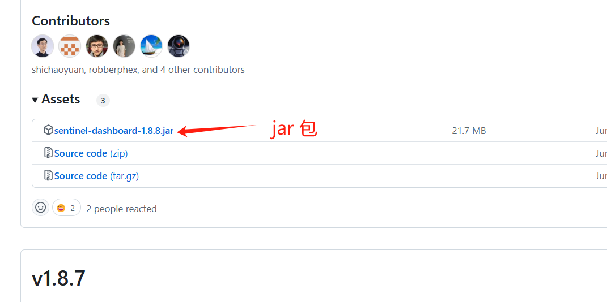

另外也可以从最新版本的源码自行构建 Sentinel 控制台：

1.  下载 控制台 工程。
2.  使用以下命令将代码打包成一个 [fat jar: mvn clean package](http://fat%20jar:%20mvn%20clean%20package)。

### **3.1.1 下载控制台 Jar 包**

wget https://github.com/alibaba/Sentinel/releases/download/1.8.8/sentinel-dashboard-1.8.8.jar

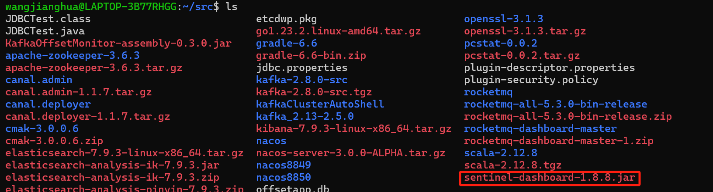

### **3.1.2 启动控制台**

> 注意：启动 Sentinel 控制台需要 JDK 版本为 1.8 及以上版本。

使用如下命令启动控制台：

java -jar sentinel-dashboard-1.8.8.jar -Dserver.port=8080 -Dcsp.sentinel.dashboard.server=localhost:8080 -Dproject.name=sentinel-dashboard &

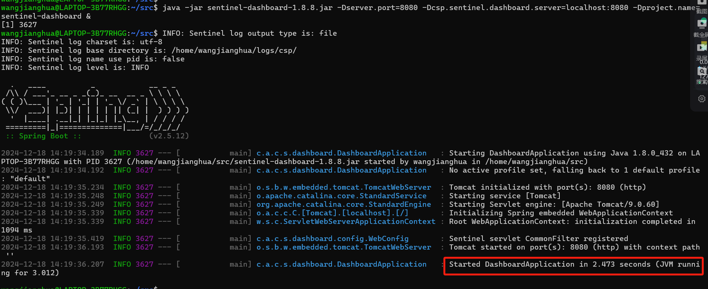

从 Sentinel 1.6.0 起，Sentinel 控制台引入基本的「**登录功能**」，默认用户名和密码都是 sentinel。可以参考 [鉴权模块文档](https://sentinelguard.io/zh-cn/docs/dashboard.html#%E9%89%B4%E6%9D%83) 配置用户名和密码。

注：若您的应用为 Spring Boot 或 Spring Cloud 应用，您可以通过 Spring 配置文件来指定配置，详情请参考 [Spring Cloud Alibaba Sentinel 文档](https://github.com/spring-cloud-incubator/spring-cloud-alibaba/wiki/Sentinel)。

接下来，你可以在浏览器中输入 [http://localhost:8080](http://localhost:8080/) 访问 Sentinel Dashboard 的控制台界面。如果你看到了控制台页面，恭喜你成功启动了！

  
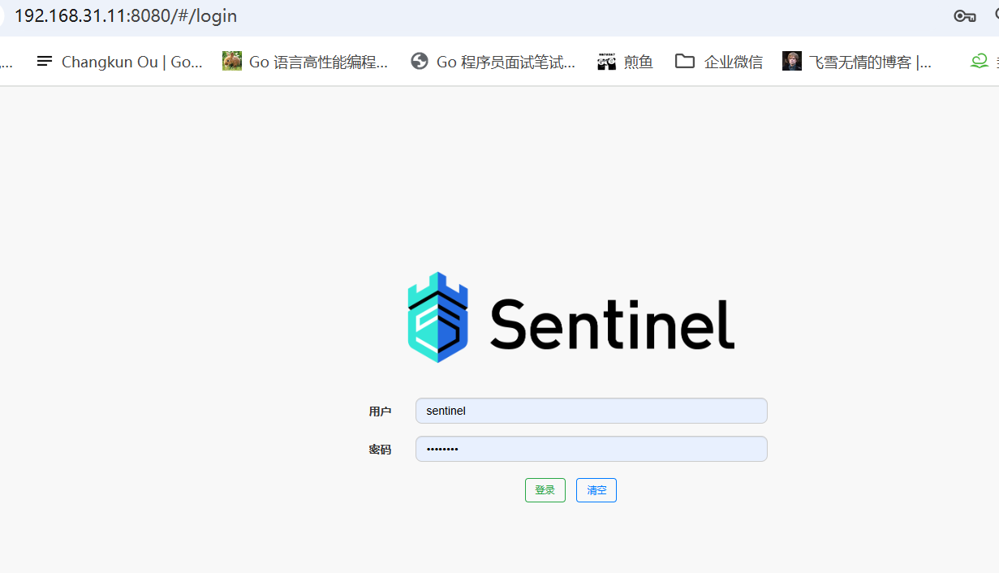

**进去后一片空白只有一个首页，因为 Sentinel 是懒加载模式，此时还没有任何客户端接入，所以接下来就是客户端接入，需要访问微服务后才会在控制台出现。**

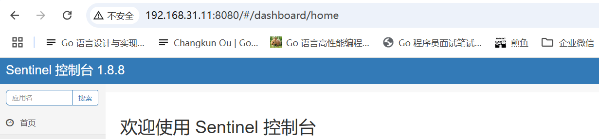

##   
**3.2 客户端接入控制台**

控制台启动后，客户端需要按照以下步骤接入到控制台。

### **3.2.1 引入 Jar 包**

客户端需要引入 Transport 模块来与 Sentinel 控制台进行通信。还需要引入 Spring Cloud Alibaba Sentinel 依赖 。这里在 common 包 pom.xml 引入 JAR 包:

<dependency>

<groupId>com.alibaba.csp</groupId>

<artifactId>sentinel-transport-simple-http</artifactId>

<version>1.8.8</version>

</dependency>

<!-- 引入 Spring Cloud Alibaba Sentinel 依赖 https://mvnrepository.com/artifact/com.alibaba.cloud/spring-cloud-starter-alibaba-sentinel-->

<dependency>

<groupId>com.alibaba.cloud</groupId>

<artifactId>spring-cloud-starter-alibaba-sentinel</artifactId>

</dependency>

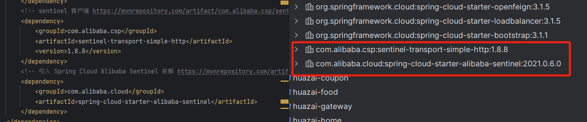

### **3.2.2 配置启动参数**

启动时加入 JVM 参数 [\-Dcsp.sentinel.dashboard.server=consoleIp:port](http://-Dcsp.sentinel.dashboard.server=consoleIp:port) 指定控制台地址和端口。若启动多个应用，则需要通过 [\-Dcsp.sentinel.api.port=xxxx](http://%20-dcsp.sentinel.api.port=xxxx/) 指定客户端监控 API 的端口（默认是 8719）。

除了修改 JVM 参数，也可以通过配置文件取得同样的效果。更详细的信息可以参考 [启动配置项](https://sentinelguard.io/zh-cn/docs/startup-configuration.html)。

这里在配置文件中启动。

sentinel:

transport:

#配置Sentinel dashboard地址

dashboard: 192.168.31.11:8080

#默认 8719 端口，如果被占用则自动从 8719 开始依次+1扫描，直至找到被占用的端口

port: 8719

eager: true

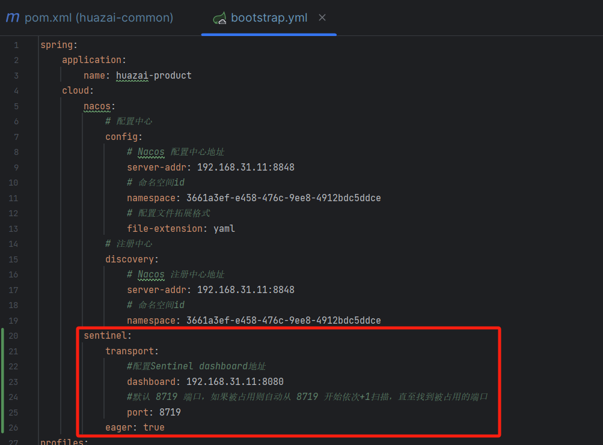

### **3.2.3 触发客户端初始化**

确保客户端有访问量，Sentinel 会在客户端首次调用的时候进行初始化，开始向控制台发送心跳包。

> 注意：您还需要根据您的应用类型和接入方式引入对应的适配依赖，否则即使有访问量也不能被 Sentinel 统计。

启动服务后，会自动注册。

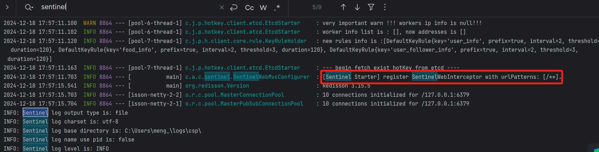

###   
**3.2.4 查看机器列表及健康状况**

当您在机器列表中看到您的机器，就代表着您已经成功接入控制台；如果没有看到您的机器，请检查配置，并通过 [${user.home}/logs/csp/sentinel-record.log.xxx](http://${user.home}/logs/csp/sentinel-record.log.xxx) 日志来排查原因，详细的部分请参考 [日志文档](https://sentinelguard.io/zh-cn/docs/logs.html)。

  
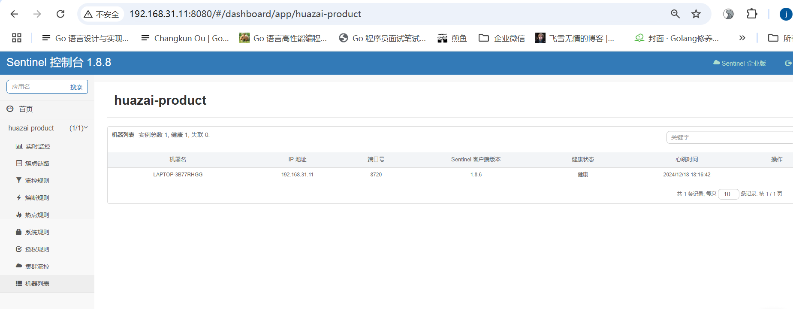

这里我将启动目前已经开发完的微服务，接入如下：

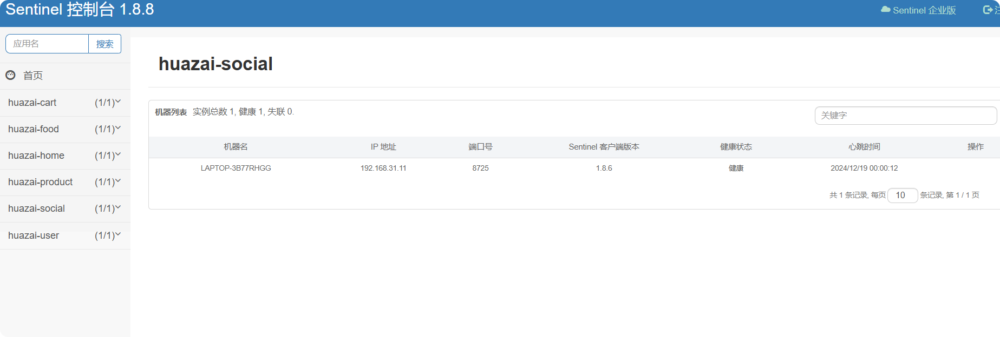

##   
**3.3 控制台功能介绍**

Sentinel Dashboard 是 Sentinel 提供的一款可视化监控和管理平台。通过这个平台，我们可以实时监控、配置和管理 Sentinel 的各种功能。

在本篇中，我们将深入探讨 Sentinel Dashboard 的主要功能、应用场景以及如何充分利用这些功能。

Sentinel Dashboard 的概览如下图所示：

  
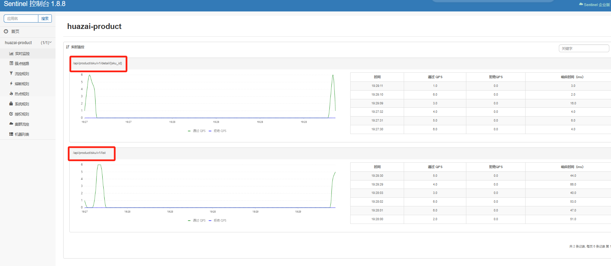

从上图中可以发现 Dashboard 支持很多功能，比如实时监控、粗点链路、流控规则、熔断规则、热点规则等等，

那这些功能分别是什么意思呢？又用于什么场景呢？接下来我们挨个看一下。

### **1、实时监控**

Sentinel Dashboard 具备实时监控的功能，可以查看应用的各项指标，例如 QPS、响应时间、通过请求、拒绝请求等。

其实就是一个实时监控一些指标的折线图和表格，没啥可讲的。

实时监控界面如下图所示：

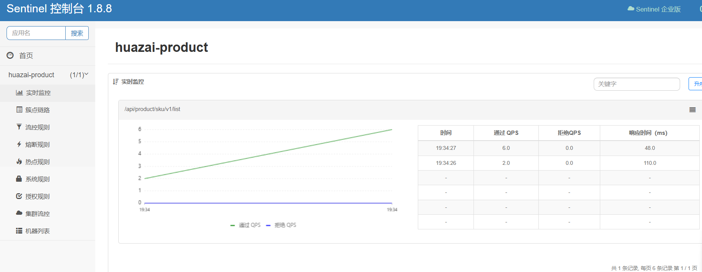

其应用场景：

1.  在高并发场景下，实时监控可以帮助我们了解系统的性能状况，以便及时采取措施防止系统过载。
2.  在系统出现问题时，可以通过实时监控迅速定位问题，缩短故障处理时间。

当然，实际公司中会有专门的运维团队来负责监控相关工作，而不是简单地利用 Sentinel 的 Dashboard，但我们可以从 Dashboard 当中获取拒绝了多少个 QPS 指标，这个在排查问题的时候还是有点用处的。

### **2、簇点链路**

Sentinel Dashboard 支持查看簇点链路，以展示当前应用的资源以及每个资源的实时指标（包括但不限于 QPS、并发数、RT 等）和不同的操作。

簇点链路界面如下图所示：

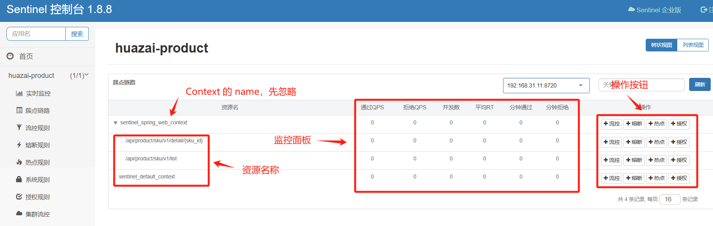

其应用场景：

1.  查看系统中所有资源的实时指标，以便更好地了解系统的运行状况。
2.  对于某个资源需要进行限流、降级、系统保护等操作时，可以在簇点链路界面直接进行操作。

### **3、流控规则**

通过 Sentinel Dashboard，我们可以轻松配置流量控制规则，此菜单功能很强大，因为流控的规则有很多，比如按照 QPS 维度，按照并发线程数维度。不光流控维度多，流控的模式和效果也很丰富，比如触发流控规则后可以快速失败，也可以排队等待甚至还支持 Warm Up 冷启动，也就是预热。

流控规则界面如下图所示：

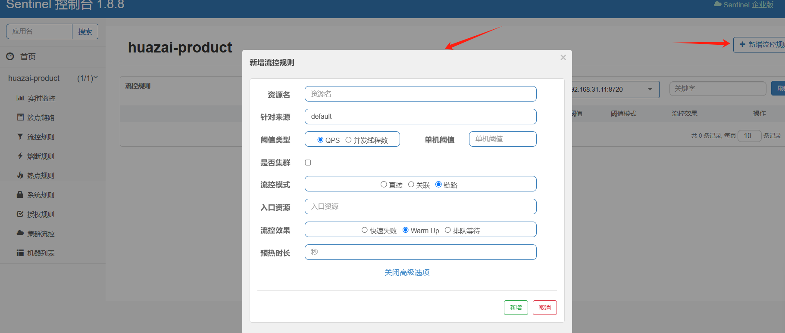

其应用场景：

1.  在秒杀活动等高并发场景下，我们可以设置限流规则，保证系统稳定运行。
2.  在请求第三方接口时，如遇到第三方接口有 QPS 限制，我们可以设置合理的 QPS 阈值，以此来保证调用成功率，当然还可以采取排队等待策略让超出部分不直接拒绝，而是排队慢慢请求。

### **4、熔断规则**

Sentinel Dashboard 支持配置熔断降级规则（比如按照每秒慢调用的比例、每秒异常比例、每秒异常个数），以保护应用在出现异常时，不会对整个系统造成影响。

熔断降级界面如下图所示：

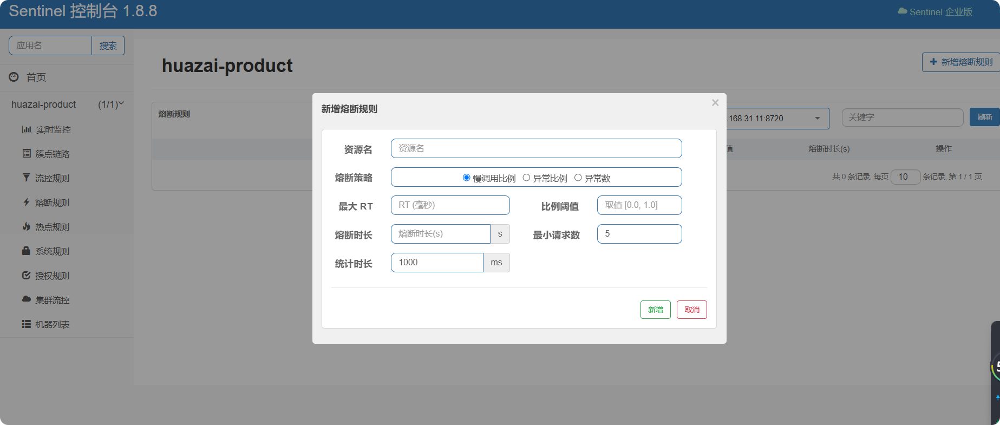

其应用场景：

1.  在微服务架构中，当一个服务出现问题时，可以通过配置熔断降级规则，防止故障扩散，保护整个系统的稳定性。
2.  在调用第三方 API 时，可以配置熔断降级规则，避免因为第三方 API 的不稳定导致自身系统的不稳定。

### **5、热点规则**

Sentinel Dashboard 支持配置热点规则，以限制参数的热点值，可以针对不同参数值做不同的流控规则，细粒度到参数上，对某些中台业务很有用处，从而避免参数异常导致的系统压力。

热点规则界面如下图所示：

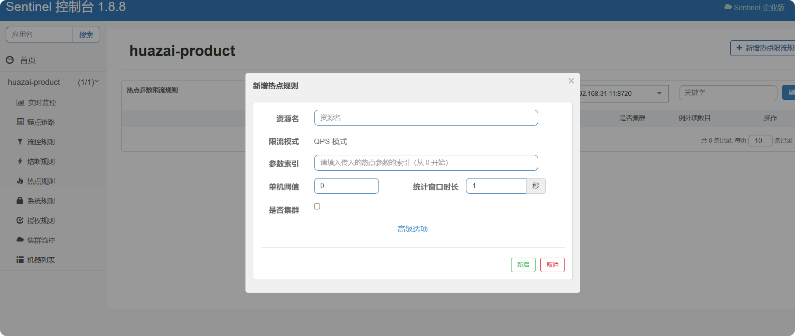

其应用场景：

1.  对于存在高并发访问特定参数值的场景，配置热点规则，降低该参数值对系统的压力。
2.  在系统中，某些参数值可能导致特定功能异常，配置热点规则，限制该参数值的访问量。

上述两种场景都是针对某个参数细粒度限流用的，有了此功能，我们就可以针对不同业务方做不同的限流规则了，比如我们是中台，对各个业务方提供服务，我们可以在业务参数（比如叫 origin 或者 app）来对不同参数值做不同的流控规则（比如我限制 app = 1 的 QPS 为 10，限制 app = 2 的 QPS 为 20 等）。

### **6、系统规则**

Sentinel Dashboard 支持配置系统规则，核心功能是自动检测当前系统的各项指标，比如 CPU 使用率、入口 QPS 数等指标，超过负载值则抛异常，以便在系统出现异常情况时，对资源进行限制或降级。

系统规则界面如下图所示：

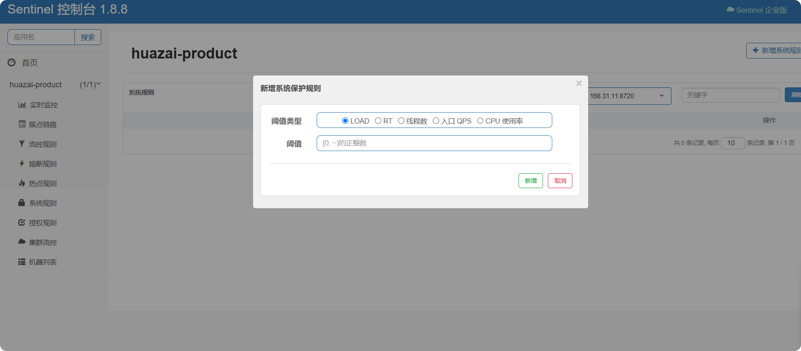

其应用场景：

1.  在系统资源不足时，通过配置系统规则，实现资源的合理分配，保证系统的稳定运行。
2.  对于系统中易出现异常的资源（可能 RT 较长、线程数不允许过多、入口 QPS 也允许的较少），配置系统规则，防止资源异常导致的系统崩溃。

### **7、授权规则**

Sentinel Dashboard 支持配置系统规则，目前主要针对黑名单和白名单两种策略对资源进行限制。

授权规则界面如下图所示：

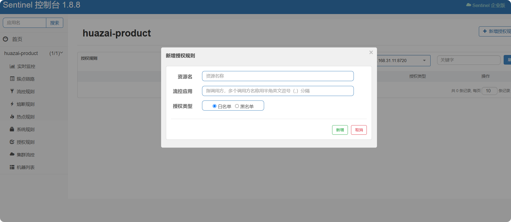

其应用场景：

1.  比如，发现接口被某个 IP 或者某个 userId 刷了，那就可以将此 IP 或者此 userId 加入黑名单，这样他就无法继续访问了。
2.  比如，我们的系统仅仅允许公司高管登录，那么可以将高管的 userId 放入白名单，这样其他用户就无法访问系统。

### **8、集群流控**

Sentinel Dashboard 支持集群流控规则。集群流控规则主要用于在分布式系统中实现整体流控而不是单机流控，比如一个服务部署了 10 台机器，我们想对某接口整体限流 100 QPS，也就是 10 台机器一共限流 100 QPS，这情况就需要集群限流了。集群限流的目的是防止服务提供方在整体上超过其处理能力。

集群规则界面如下图所示：

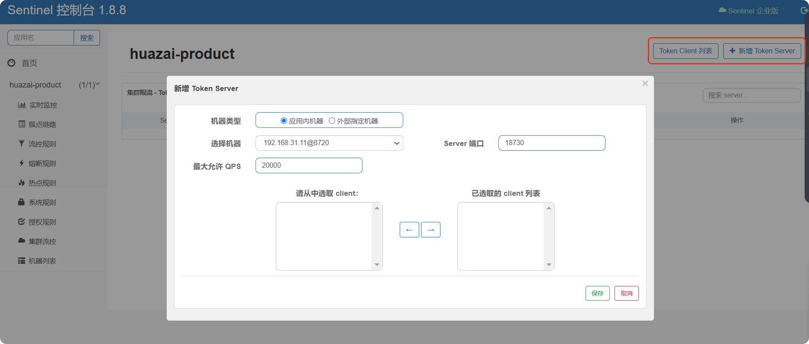

其应用场景：

1.  保护服务提供方：当服务消费方的请求量超过服务提供方的处理能力时，对整体流量进行限制。
2.  资源控制：在分布式系统中，通过集群流控规则可以确保整体资源不会被过度使用。

### **9、机器列表**

Sentinel Dashboard 支持查看应用中所有机器的列表，可以查看每个机器的 IP 地址、端口号、Sentinel 客户端版本、当前服务时候健康以及最后一次心跳的时间，以便于管理和监控。

机器列表界面如下图所示：

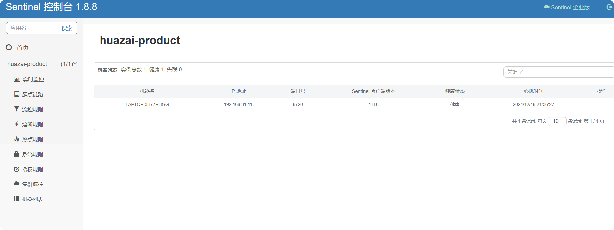

其应用场景：

1.  查看应用中所有机器的在线状态和相关信息，以便于管理。
2.  了解应用的分布式情况，以便进行优化。

## **3.4 微服务整合 Sentinel 自定义流控、降级、授权异常处理**

异常种类：

1.  FlowException //限流异常
2.  DegradeException //降级异常
3.  ParamFlowException //参数限流异常
4.  SystemBlockException //系统负载异常
5.  AuthorityException //授权异常

实现 BlockExceptionHandler 并且重写 handle 方法：

package net.huazai.exception;

import com.alibaba.csp.sentinel.adapter.spring.webmvc.callback.BlockExceptionHandler;

import com.alibaba.csp.sentinel.slots.block.BlockException;

import com.alibaba.csp.sentinel.slots.block.authority.AuthorityException;

import com.alibaba.csp.sentinel.slots.block.degrade.DegradeException;

import com.alibaba.csp.sentinel.slots.block.flow.FlowException;

import net.huazai.enums.BizCodes;

import net.huazai.utils.ApiResult;

import net.huazai.utils.CommonUtil;

import org.springframework.stereotype.Component;

import javax.servlet.http.HttpServletRequest;

import javax.servlet.http.HttpServletResponse;

/\*\*

\* @className: SentinelBlockHandler

\* @author: huazai，该项目是知识星球：华仔和他的朋友们 的内部项目

\* @date: 2025-06-12 7:58

\* @Version: 1.0

\* @description:

\*/

@Component

public class SentinelBlockHandler implements BlockExceptionHandler {

/\*\*

\* 处理流控、降级、授权等异常

\* @param httpServletRequest

\* @param httpServletResponse

\* @param e

\* @throws Exception

\*/

@Override

public void handle(HttpServletRequest httpServletRequest, HttpServletResponse httpServletResponse, BlockException e) throws Exception {

ApiResult apiResult \= null;

/\*\*

\* 流控、降级、授权异常处理

\* 1. 流控异常：FlowException

\* 2. 降级异常：DegradeException

\* 3. 授权异常：AuthorityException

\*/

if(e instanceof FlowException){

apiResult = ApiResult.doResult(BizCodes.SENTINEL\_CONTROL\_FLOW);

}else if(e instanceof DegradeException){

apiResult = ApiResult.doResult(BizCodes.SENTINEL\_CONTROL\_DEGRADE);

} else if(e instanceof AuthorityException){

apiResult = ApiResult.doResult(BizCodes.SENTINEL\_CONTROL\_AUTH);

}

httpServletResponse.setStatus(200);

CommonUtil.sendJsonMessage(httpServletResponse, apiResult);

}

}

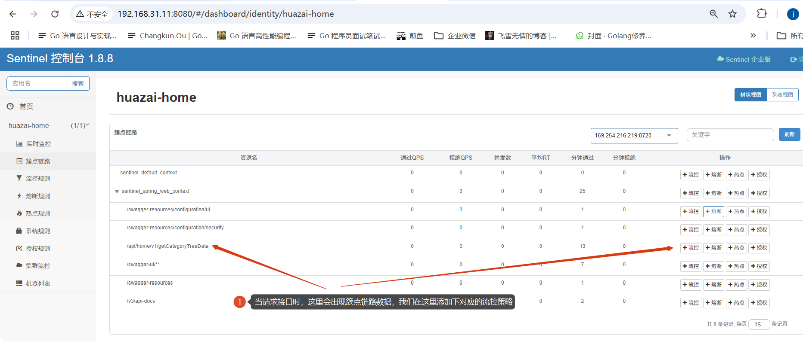

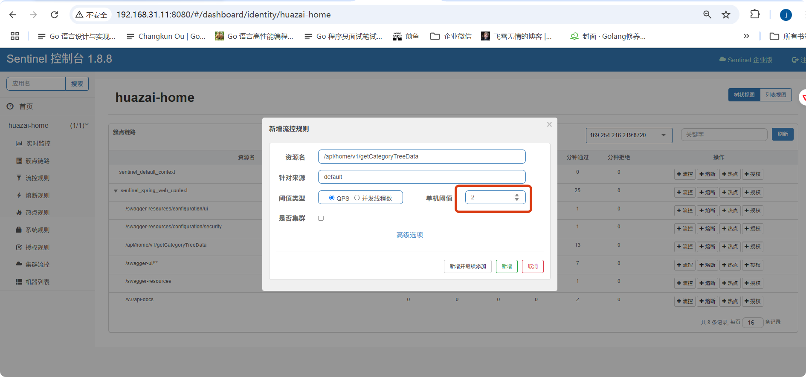

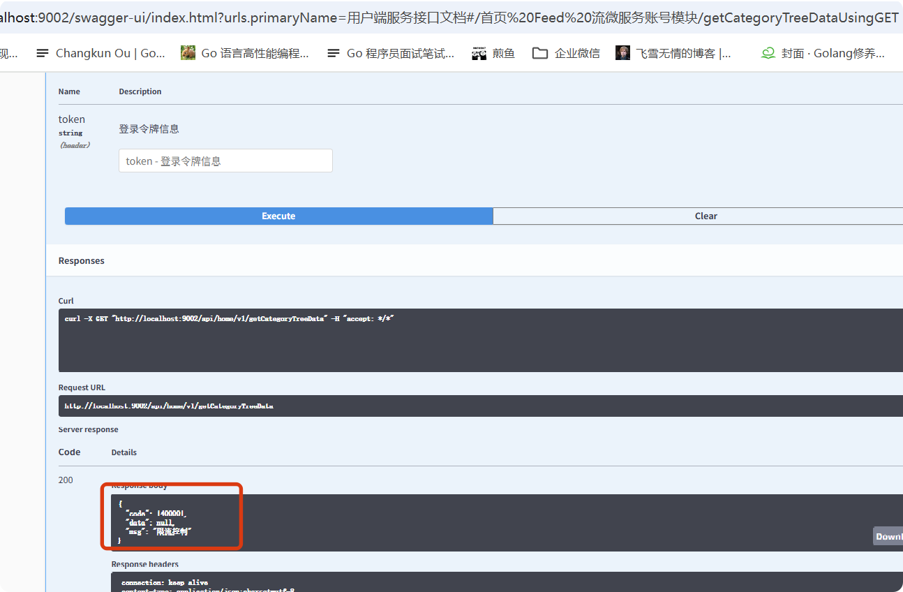

## **3.5 Sentinel 流控规则持久化到 Nacos 配置中心**

文档：[https://github.com/alibaba/Sentinel/wiki/%E5%9C%A8%E7%94%9F%E4%BA%A7%E7%8E%AF%E5%A2%83%E4%B8%AD%E4%BD%BF%E7%94%A8-Sentinel](https://github.com/alibaba/Sentinel/wiki/%E5%9C%A8%E7%94%9F%E4%BA%A7%E7%8E%AF%E5%A2%83%E4%B8%AD%E4%BD%BF%E7%94%A8-Sentinel)

### **1、生产环境使用 Push 模式数据源**

生产环境下更常用 push 模式的数据源:

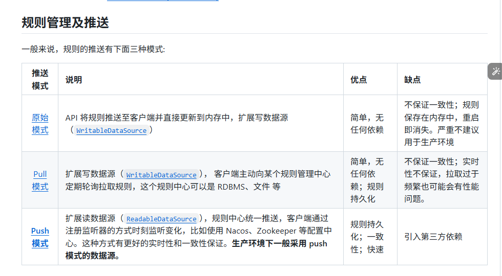

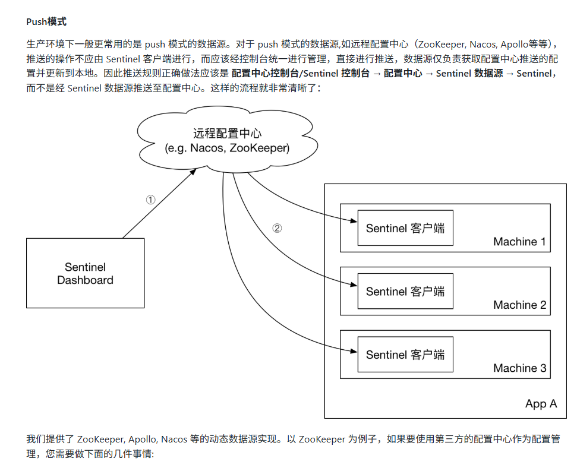

流控规则持久化到 Nacos 配置中心配置 common 和 gateway 都添加，之前遗漏的部分，这里补上：

<dependency>

<groupId>com.alibaba.csp</groupId>

<artifactId>sentinel-datasource-nacos</artifactId>

</dependency>

### **2、配置持久化数据源**

#流控面板ip

sentinel:

transport:

dashboard: 192.168.31.11:8080

port: 8719

#流控规则持久化到nacos配置中心 （直接复制这块）

datasource:

ds1:

nacos:

server-addr: 192.168.31.11:8848

data-id: ${spring.application.name}.json

group-id: DEFAULT\_GROUP

data-type: json

rule-type: flow

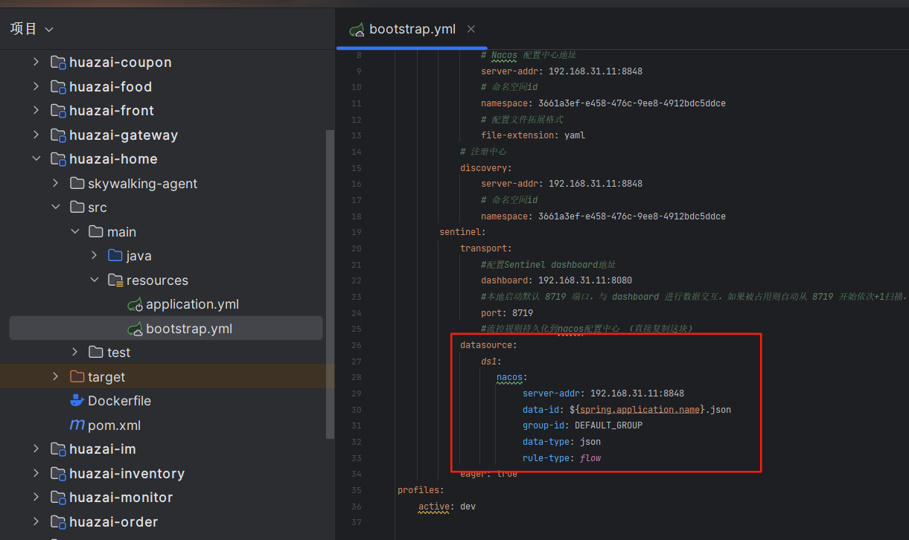

### **3、Nacos 配置流控规则**

\[

{

"resource":"/api/home/v1/feed",

"controlBehavior":0,

"count":200,

"grade":1,

"limitApp":"default",

"strategy":0

},

{

"resource":"/api/home/v1/getCategoryTreeData",

"controlBehavior":0,

"count":20,

"grade":1,

"limitApp":"default",

"strategy":0

}

\]

说明：

1.  resource：资源名。
2.  limitApp：流控针对的调用来源，若为 default 则不区分调用来源。
3.  grade：限流类型（QPS 或并发线程数）,0代表根据并发数量来限流，1代表根据QPS来进行流量控制。
4.  count：限流阈值。
5.  strategy：调用关系限流策略。
6.  controlBehavior：流量控制效果（直接拒绝、Warm Up、匀速排队）。
7.  clusterMode：是否为集群模式，存在问题。

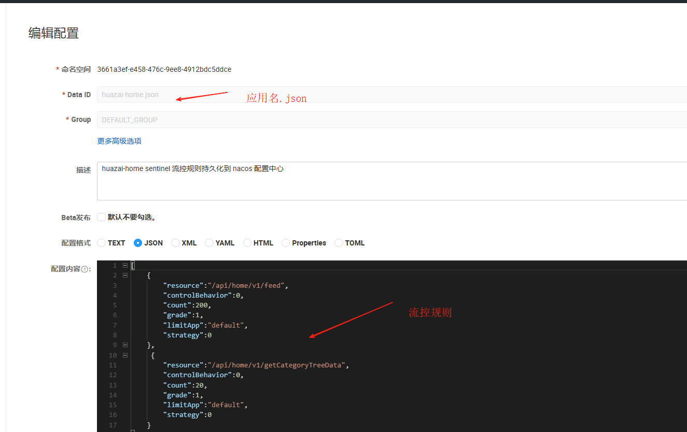

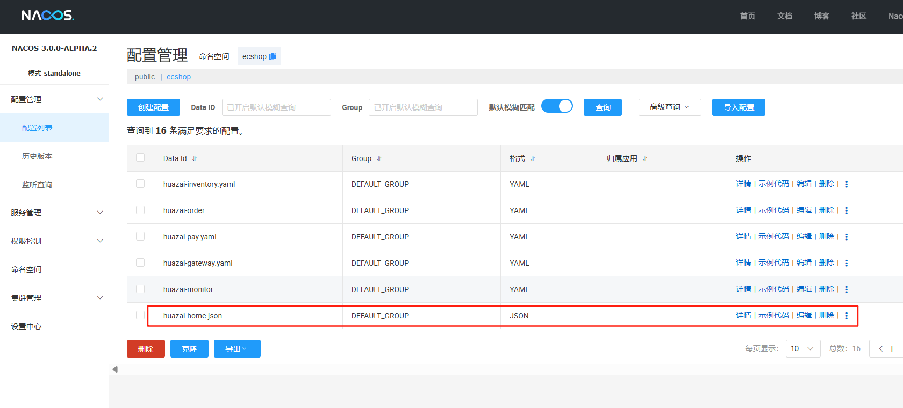

重启服务后会自动拉取最新的流控规则，我们请求接口再来看下 sentinel 控制台：

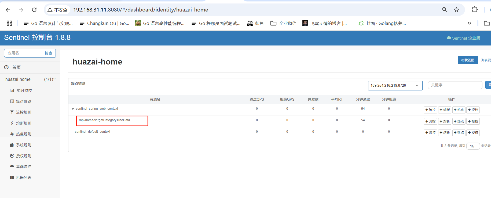

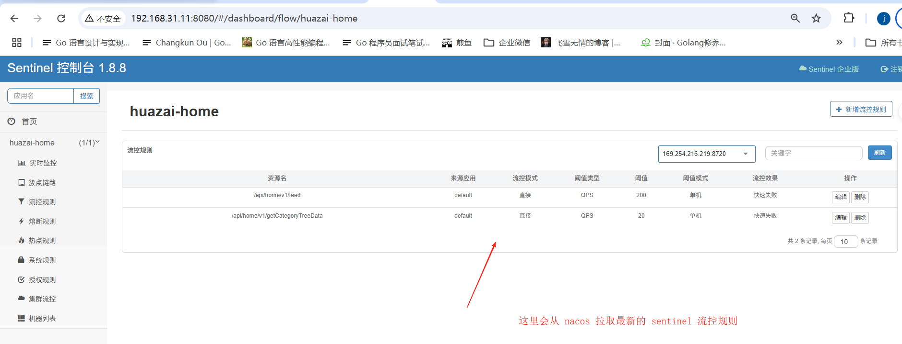

集群流控配置：[https://github.com/alibaba/Sentinel/wiki/%E9%9B%86%E7%BE%A4%E6%B5%81%E6%8E%A7#%E9%85%8D%E7%BD%AE%E6%96%B9%E5%BC%8F](https://github.com/alibaba/Sentinel/wiki/%E9%9B%86%E7%BE%A4%E6%B5%81%E6%8E%A7#%E9%85%8D%E7%BD%AE%E6%96%B9%E5%BC%8F)

其他服务的流控规则，自行添加修改即可，这里就不展开了。

> 注意：如果在 sentinel 控制台修改了配置，不会反向同步到 nacos 里，如果要修改策略，只能在 nacos 里面修改

## **3.6 Sentinel 流控规则总结**

Sentinel 提供了多种流控方式，如根据「**QPS**」进行流控、根据「**线程数**」进行流控等，而且这些流控方式还有丰富的效果选项，比如「**直接拒绝**」、「**排队等待**」、「**预热**」等。

###   
**3.6.1 流控方式**

我们已经提及到，流控方式分为两种：「**QPS**」 和「**线程数**」，QPS 限制的是请求次数，而线程数限制的是请求人数。

### **3.6.1.1 按 QPS 流控**

QPS（Queries Per Second，每秒查询率）流控是指限制系统单位时间内的请求速率。在 Sentinel 中，你可以设置允许系统处理的最大请求数量（QPS），超过这个阈值的请求将受到流控的限制。

举个例子：你给某接口配置了按 QPS 限流，且 QPS 的值为 5，那么就代表 1s 内最大能有 5 个请求进入到你的接口，其余请求（超出 5 个以外的请求）将被控制，此处说的控制就是开头说的流控效果，可以配置为「**直接拒绝**」，也可以配置为「**排队等待**」，还可以配置为「**预热**」。

上面的例子就是按照 「**QPS**」 来进行流控的。

### **3.6.1.2 按线程数流控**

按线程数流控我相信大家应该能猜到含义，其实就是「**线程数**」字面意思，比如我们设置 feed 接口所允许的最大线程数是 3，那么超出 3 个线程在「**同时运行**」后，将被拒绝。

由于 Sentinel Dashboard 是懒加载的，因此，我们需要手动请求这个接口才能使其在 Sentinel Dashboard 上正常加载出来，如下图所示：

  
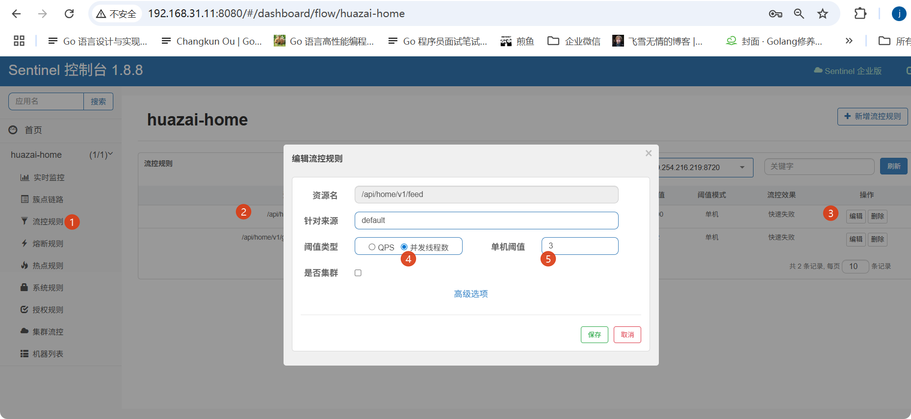

上述配置，我们针对 feed 这个接口建立了一个并发线程数为 3 的流控配置，但是我们可以发现截图中并没有地方配置流控效果（「**快速失败**」、「**WarmUp**」、「**排队等待**」），那这是为何呢？

这是因为「**并发线程数**」类型的流控规则主要是用来限制并发请求数量，而不是针对请求处理策略的具体配置。你可以创建不同类型的流控规则来实现不同的流控策略。

例如，你可以创建一个 QPS 类型的规则，用于限制每秒请求数量，同时可以创建一个线程数类型的规则，用于限制并发线程数。这些规则的组合将会影响最终的流控策略。

虽然 Dashboard 没地方配置按照并发线程数类型的流控效果，那么此类型就没有流控效果吗？答案是否定的，其实此类型创建完默认是「**直接拒绝**」（「**快速失败**」）效果的，如下图所示：

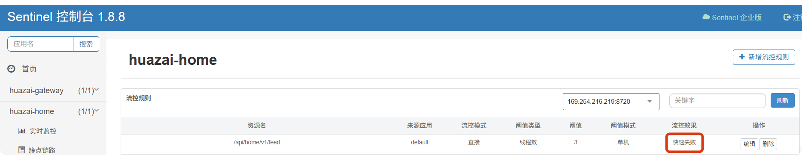

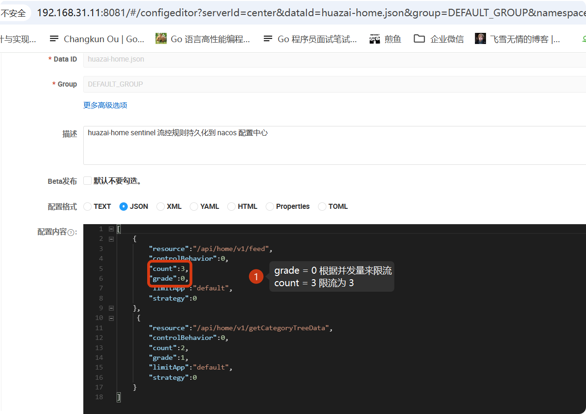

这意味着这个接口只能同时存在 3 个线程在执行，超过 3 次后的请求将被立即拒绝。

本地服务需要启动 gateway 和 home，如果修改 Nacos、Sentinel 配置需要重启这两个服务才能生效。

  
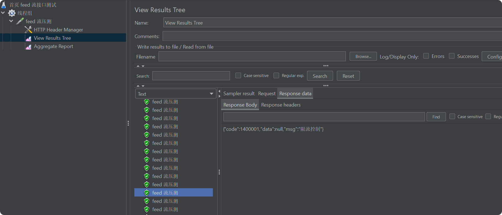

### **3.6.2 流控效果**

1.  快速失败：也称为直接拒绝，当超出我们配置的流控阈值后，多余的请求将直接抛出 Sentinel 内部异常，不会走到我们主业务逻辑当中。
2.  排队等待：排队等待不像快速失败那么“粗鲁”，排队等待不会将多余的请求拒绝掉，而是会排队等待一会，超出等待时长后还没得到处理的话，则才会采取快速失败策略。
3.  Warm Up：也称为预热，举个例子，我们系统能接收 10 QPS，假设设置的预热时长为 3s，那么服务刚启动时第一秒可能仅能处理 10 / 3 = 3 个请求，第二秒可能能够处理 6 个请求，第三秒可能能够处理 9 个请求，逐步恢复正常 10 QPS的水平，能够接收的请求数会随着预热时长逐步上涨。

### **3.6.2.1 快速失败**

这种方式我们前面在演示 QPS 和线程数的时候已经反复提及和实战过，很简单，就是在超出配置的阈值后直接抛出限流控制，不做任何逻辑，也称之为直接拒绝。

### **3.6.2.2 排队等待**

在 Sentinel 中，可以通过设置排队等待来控制在超出配置的 QPS 阈值后，而不是直接拒绝请求，而是让请求进入排队等待，从而实现更加平滑的流量控制。这样可以避免瞬间大量请求导致服务不可用，也可以尽最大可能避免请求丢失。

  
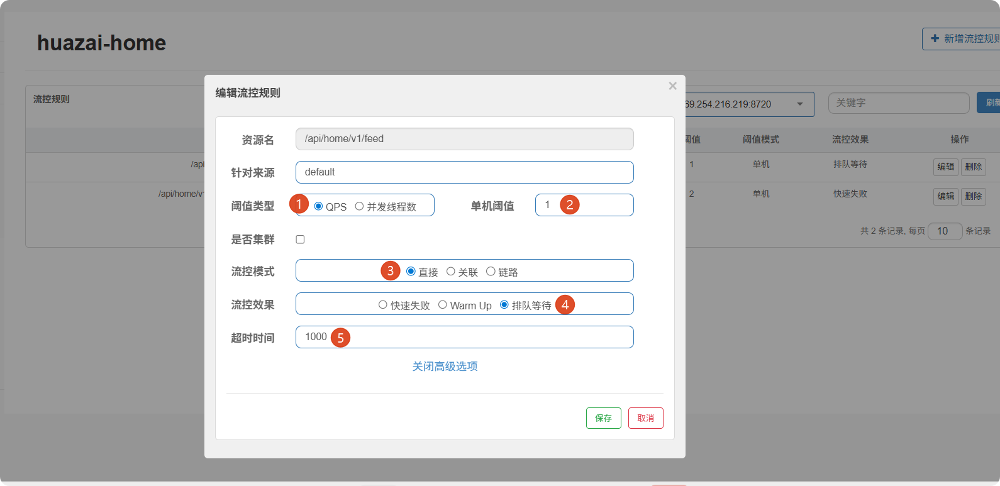

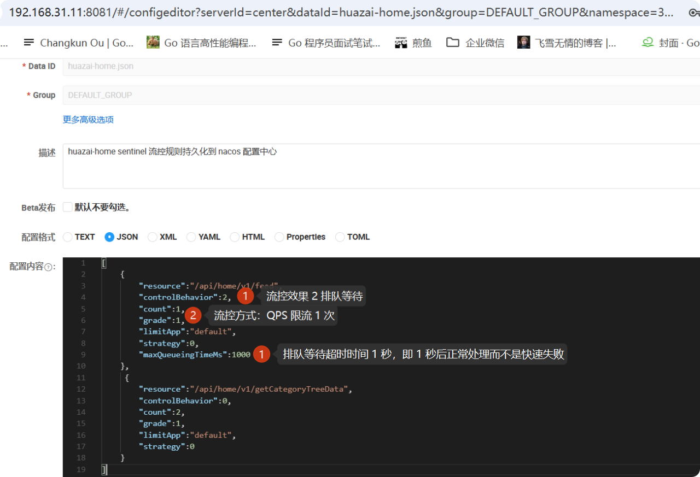

\[

{

"resource":"/api/home/v1/feed",

"controlBehavior":2,

"count":1,

"grade":1,

"limitApp":"default",

"strategy":0,

"maxQueueingTimeMs":1000

},

{

"resource":"/api/home/v1/getCategoryTreeData",

"controlBehavior":0,

"count":2,

"grade":1,

"limitApp":"default",

"strategy":0

}

\]

上述配置的含义是：针对 feed 接口资源进行 QPS 最大为 1 的限制，如果超出了此限制，则进入排队等待模式，等待的时间为 1000 毫秒，也就是 1 秒钟，如果 1 秒内还没处理完，则抛出异常，相当于直接拒绝。一言以蔽之就是，如果超出了配置的阈值，则会等待 1 秒钟，而不是直接拒绝，尽可能地保障最小丢失用户的请求。

修改完后，此时重启 gateway 和 home 服务。最后，我们看下排队等待的实际效果，我的 JMeter 配置如下：

  
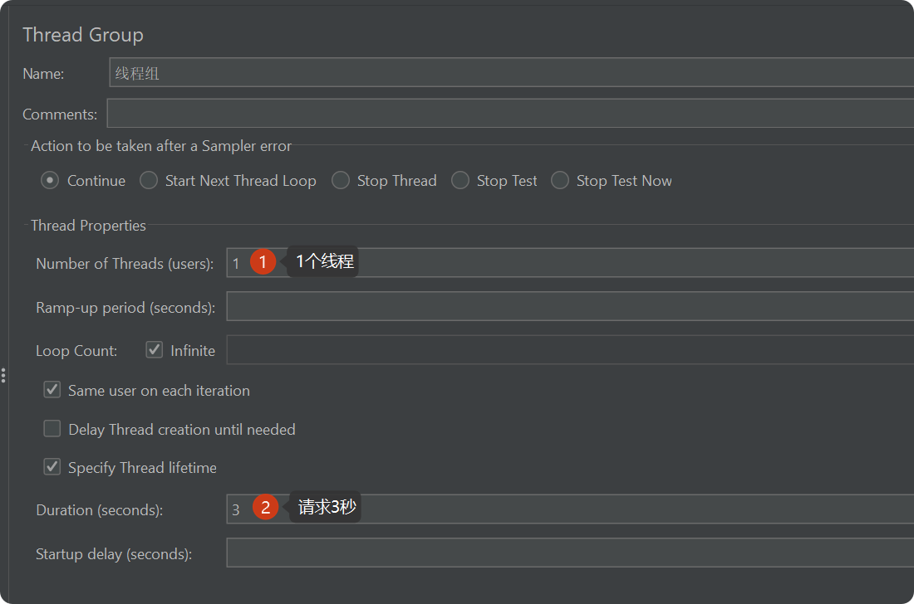

关于 jmeter 使用：[【电商实战项目第九十七篇】华仔电商实战项目接口常见压力测试工具对比、Jmeter 5.x 工具介绍、单接口性能压测示例](https://articles.zsxq.com/id_en19w2444mob.html)

也就是模拟 1 个线程去请求 3 秒钟，我们的预期是：第一次请求会很快，几毫秒内就能返回，第二个请求发现 QPS 是 1 ，也就是 1 秒内只能有 1 个请求进入（底层源码是滑动窗口），所以会进入排队等待效果，因此，第二个请求会在 1 秒后进入，而不是直接拒绝掉。如下图所示：

  
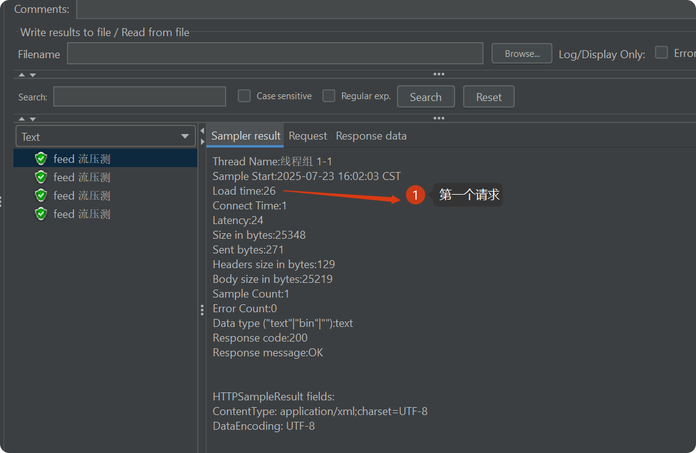

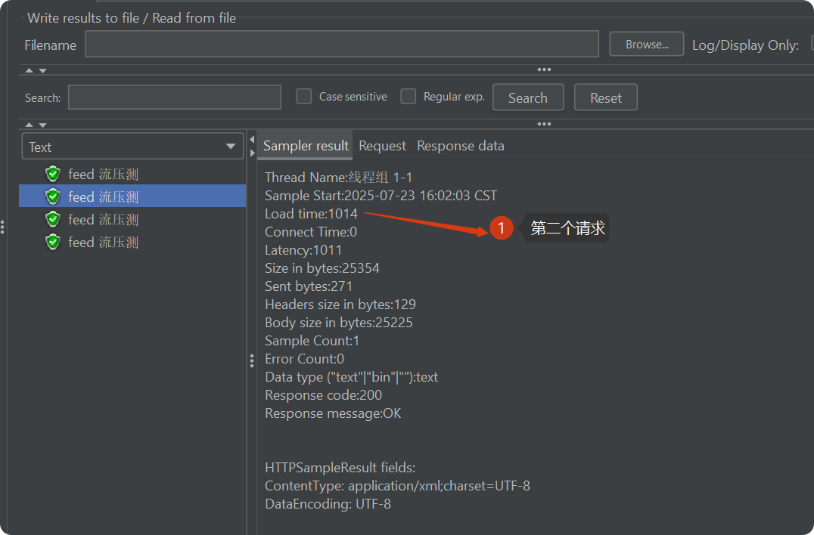

从上图可知，第一个请求只花费了 26 毫秒，而第二个请求却花费了 1014 毫秒，由此可见，第二个请求并没有丢失，而是在 1s 后正常被处理。

###   
**3.6.2.3 Warm Up**

Warm Up 的目的是让资源在启动时慢慢适应高流量的情况，而不是立即接受配置的最大并发请求量。这样可以避免系统因突然的高并发而无法应对，导致出现性能问题或服务崩溃。

举个例子来说明 Warm Up 的作用：假设你有一个 Web 服务器，它可以同时处理最多 100 个并发请求。在系统启动时，你可以将资源的初始 QPS 阈值设置得较低，例如 10，然后在一个较短的时间段内（例如 10 秒）逐渐增加 QPS 阈值，直到达到配置的最大值 100。这样，在服务器启动的初始阶段，只有较少的请求可以通过，并且服务器有足够的时间来逐渐升温，适应高并发的情况。一旦预热完成，服务器就可以稳定地处理更多的并发请求，而不会因为突然的高并发而导致性能问题或崩溃。

相信大家通过上面的例子能清晰地明白 Warm Up 的作用和效果，其具体用法也可以通过 Dashboard 进行配置，和前面两种效果的代码和配置大同小异，因此这里就不带着大家从 0 到 1 进行实战了，感兴趣的小伙伴可以自己动手去实战下。

最后，我猜大家可能会有一些疑问：

1.  流控模式有直接、关联、链路，本篇都是默认选择的直接，那么关联和链路是啥意思呢？
2.  快速失败、排队等待、Warn Up 的应用场景分别是什么呢？

###   
**3.6.3 流控模式**

前面深入剖析了流量控制的核心知识，为大家揭开了其中一部分神秘面纱。然而流控的世界仍有许多隐藏的宝藏等待我们挖掘，接下来继续探索并讲解之前未涉及的流量控制功能。

我将带你更深入地了解另外两种流控模式：「**关联**」、「**链路**」。

###   
**3.6.3.1 关联**

关联流控模式中，可以将两个资源进行关联，当某个资源的流量超限时，可以触发其他资源的流控规则。

为了助于大家理解，这里拿下单场景举例：比如考虑我们小红书电商平台，用户下单购物，这涉及到下单入口资源和下单资源，如果下单入口资源达到流控阈值，那么我们应该同时禁止下单，这就是通过下单入口资源来关联到了下单资源。

注意这里有个误区：如果采取关联模式，那么设置的 QPS 阈值是被关联者的，而不是关联者本身。如下图所示：

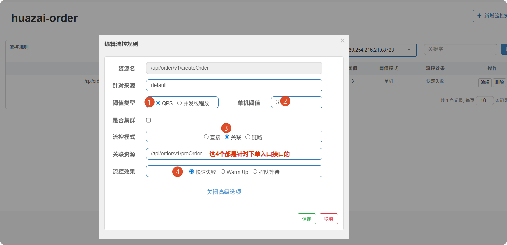

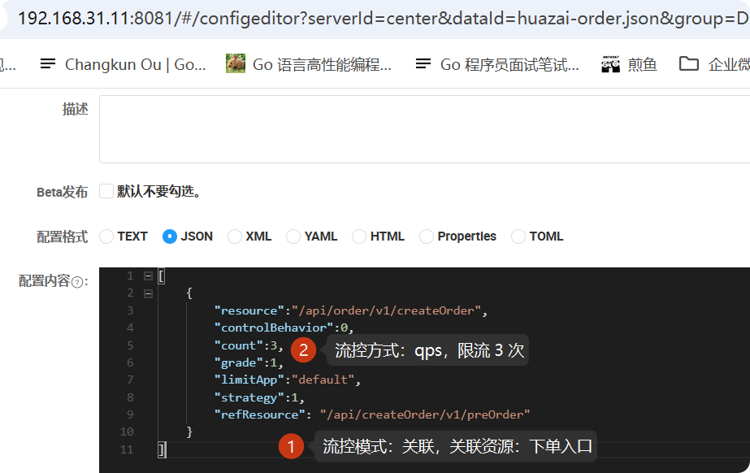

上述配置是针对 preOrder 资源设置的 QPS 阈值为 3，而不是针对 createOrder 资源，也就是说 createOrder 被流控的时机就是当 preOrder 的 QPS 阈值达到 3，这里的 3 并不是 createOrder 所访问的次数，而是 preOrder 这个接口被访问的次数，preOrder 同时也可能被其他接口所访问。

我们对 createOrder 配置了关联模式，关联的资源为 preOrder，且配置的阈值为 3，也就是说如果 preOrder 接口的 QPS 达到 3 后，则 createOrder 资源也将一同被流控。

我们先正常启动项目进行访问下 createOrder 接口，会发现接口返回是正常的，如下：

  
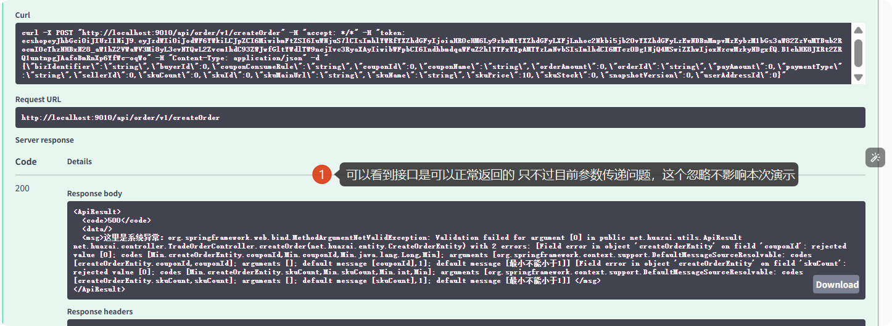

接着，我们启动 JMeter 开启并发测试 preOrder 接口，也就是让 preOrder 资源的 QPS 超出 3，我这里开启的是每秒 5 个线程，如下图所示：

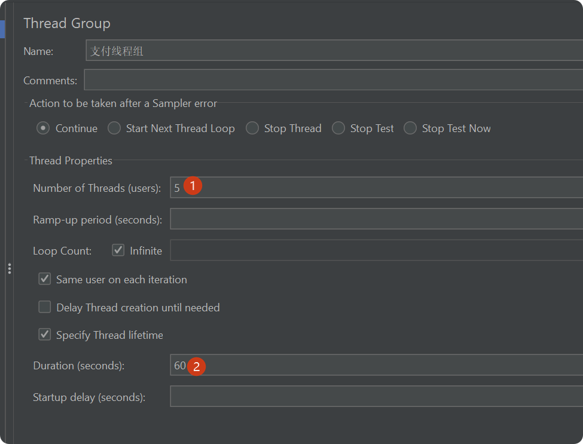

当 JMeter 跑起来后，我们再调用 createOrder 接口，会发现已经被流控了，如下图所示：

  
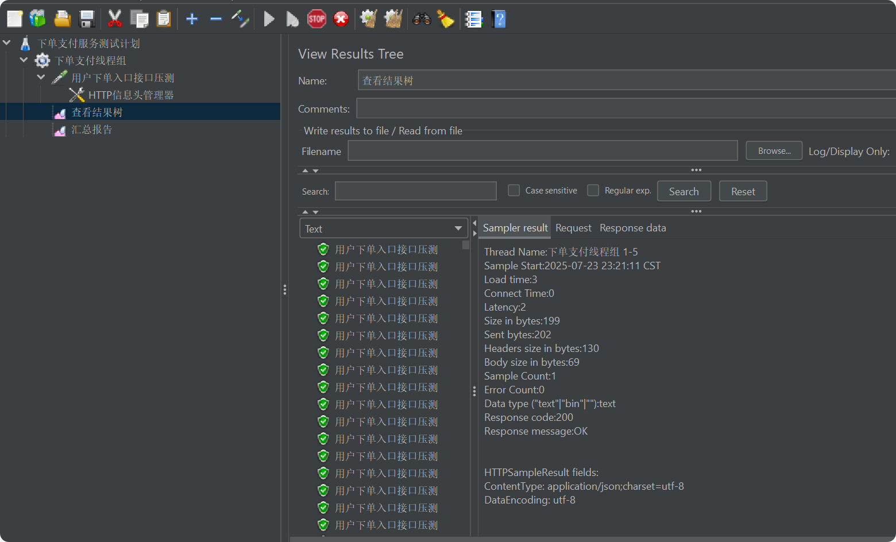

  
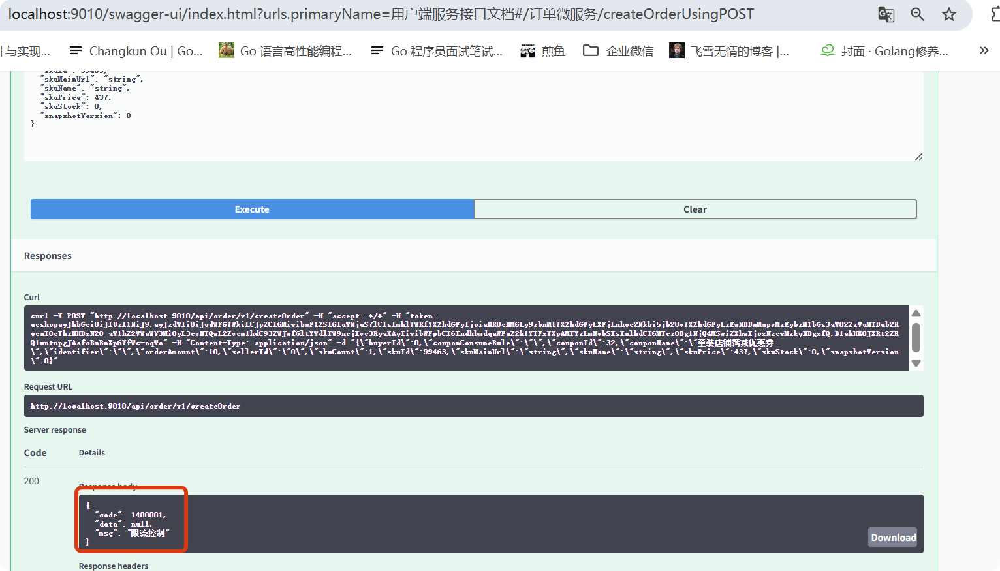

所以，关联模式所设置的 QPS 并不是为自己设置的，而是为被关联资源设置的，当被关联资源超出阈值后，自己被流控，希望大家好好理解下这个模式。

### **3.6.3.2 链路**

在链路模式中，我们可以将资源与它们的「**调用关系**」关联起来，从而形成一个资源调用链。当链路上的某个资源的流量超过了预设的阈值，可以触发链路中其他相关资源的流控规则，进而保护整个链路。这种方式有效地限制了单个资源的影响，确保关键路径上的稳定性。

为了助于理解，接下来我带大家针对链路模式进行编码实战。

首先，我们需新增两个依赖，如下所示：

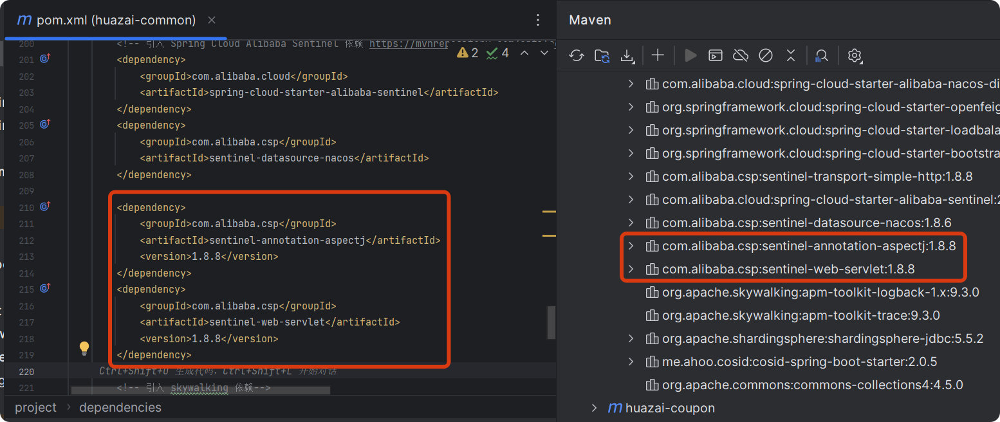

接着，我们新增一个资源：

  
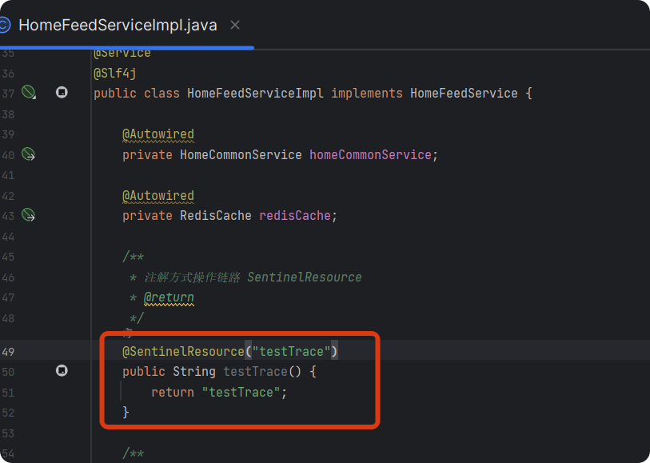

看到这里，大家会产生疑问，现在这个看起来好像一个注解就搞定了，这就是资源定义的第二种方式：「**注解方式**」。

但是此方式需要 [sentinel-annotation-aspectj](http://sentinel-annotation-aspectj/) 依赖，因此，这就是我们为什么要新增这个依赖的原因，但是加了依赖后 [@SentinelResource("testTrace")](http://sentinelresource\("testtrace"\)/) 此注解还是不起作用的，我们还需要新增如下配置：

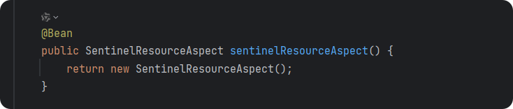

上面这个配置类其实就是 AOP，相关源码我们会在后面源码剖析章节讲解，资源定义完成后我们新增两个接口去调用这个资源：

  
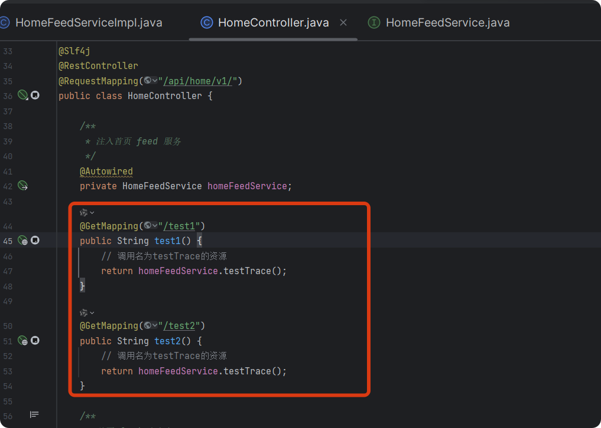

这时候我们还需要写一个配置类，此配置类不加的话链路模式也不会生效，这个在 github 当中找到的答案，issues 地址贴在了注释当中，如下所示：

  
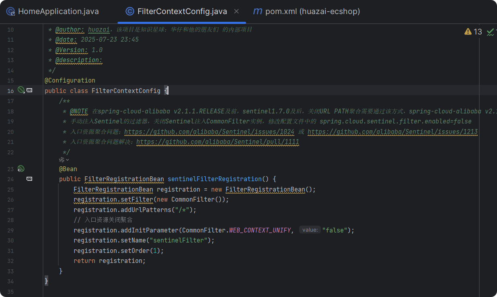

至此，我们的代码已开发完成，接着就可以启动项目访问接口看下效果啦，如下图所示：

  
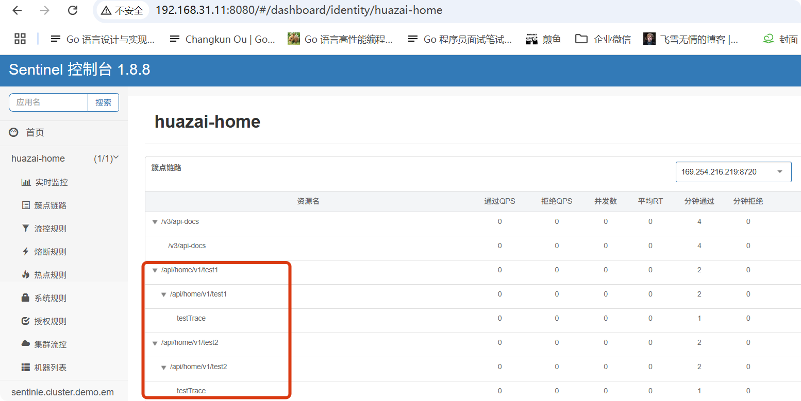

细心的老铁已经发现了一个问题：我们只定义了 testTrace 这一个资源，但是在簇点链路里为什么出现了额外的两个资源（/trace/test2 和 /trace/test1）呢？恰巧这两个资源是我们两个接口的访问路径，这是怎么回事呢？其实这得益于如下依赖：

  
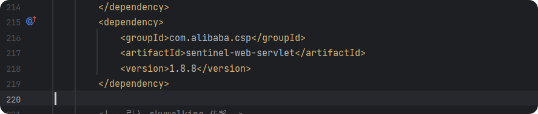

这个模块会为我们自动创建接口资源，资源名为接口访问地址。因此，我们就可以为 testTrace 资源创建链路模式的流控规则了，如下图所示：

  
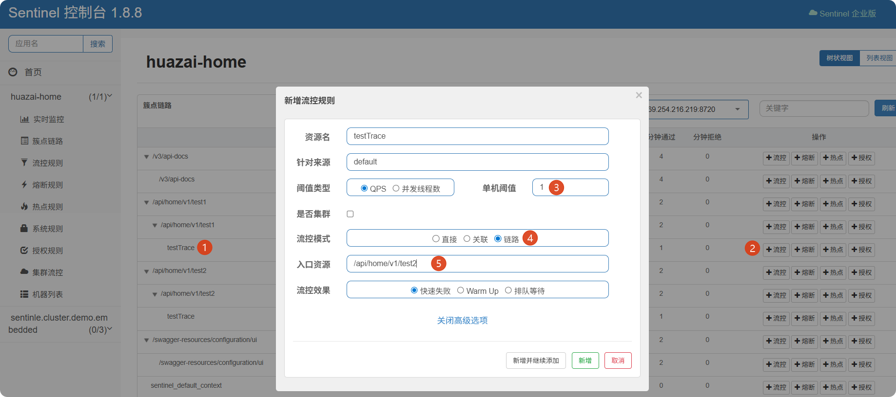

上图中我们为 testTrace 资源创建了一个链路模式的流控规则，规则为 QPS 限制到 1 ，且链路入口资源为

/api/home/v1/test2，意味着 /api/home/v1/test1 可以随便访问 testTrace 资源，不受任何限制，而 /api/home/v1/test2 资源则限制 QPS 为 1，当超出限制后则被流控，如下图所示：

  
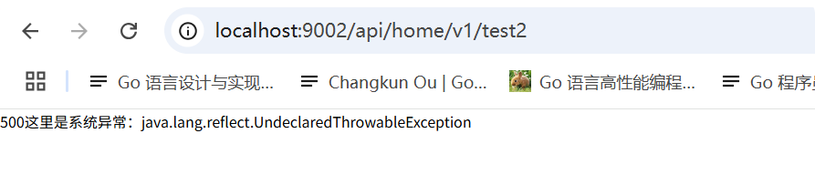

此时当请求大于1 就报 500了，查看控制台发现报错了：

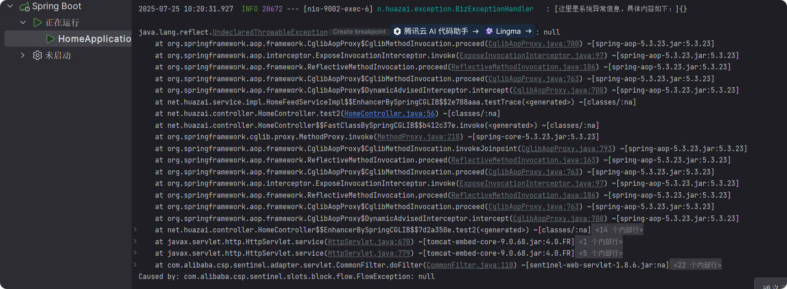

我们交给通义灵码来看下具体的问题：

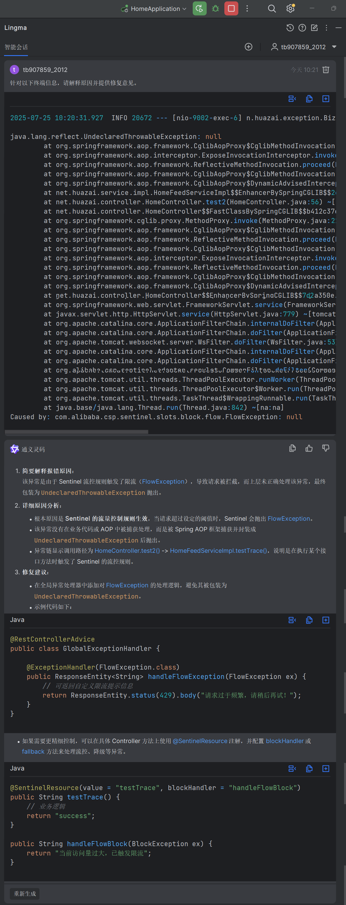

1.  简要解释报错原因： 该异常由 Sentinel 触发的限流规则导致，FlowException 表示请求被限流，而 UndeclaredThrowableException 是 Spring AOP 代理在调用过程中未能声明此检查型异常所引发的包装异常。
2.  详细原因分析：
3.  Sentinel 限流触发： com.alibaba.csp.sentinel.slots.block.flow.FlowException 表明当前请求触发了 Sentinel 配置的流控规则（如 QPS 超限）。
4.  AOP 代理未声明异常： 在使用 Spring AOP（如通过 @SentinelResource 注解）时，若目标方法未显式声明抛出 FlowException，而代理层直接抛出，则会被包装为 UndeclaredThrowableException。
5.  调用链路： 请求经过 HomeController.test2() → Sentinel 切面拦截 → 触发限流规则 → 抛出 FlowException → 被 Spring AOP 包装成 UndeclaredThrowableException。

我们按照他的思路来修改下：

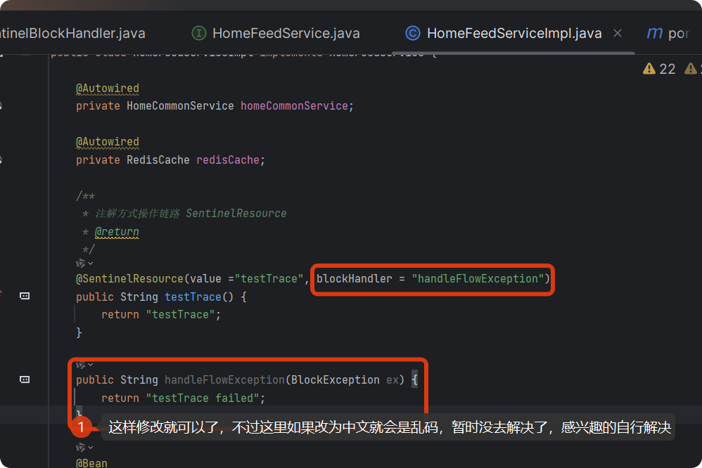

## 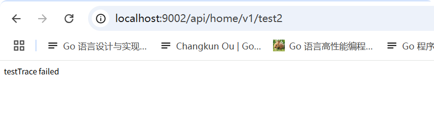  
**3.7 Sentinel 熔断规则实战**

关于熔断降级，相信大家已经不再陌生，在保障系统的可靠性和稳定性方面起着不可忽视的作用。

接下来我们将再次深入研究并实际操作这一重要知识点，以便更好地掌握它的应用。通过重温这些概念，我们能够进一步巩固我们对熔断降级机制的理解，并且通过实际案例来加深我们的应用能力。让我们一同回顾并加强这些关键概念，为更有效的流量治理打下坚实的基础。

### **3.7.1 熔断降级**

关于熔断降级的知识，我将通过一个案例来阐述。

###   
**1、 熔断**

假设电商平台库存服务用来处理商品库存查询。由于库存服务可能由于网络问题、数据库故障等原因而变得不稳定，为了避免它对整个系统的影响，我们可以实施熔断机制。

在这种情况下，我们可以设定一个阈值，例如，如果在一段时间内（比如 5 秒内）有超过 50% 的请求失败，那么熔断器会触发，停止对库存服务的调用一段时间。这将使得该服务不会继续受到更多的请求，防止因大量请求失败而进一步影响系统。

### **2、 降级**

在同一个电商平台中，假设平台有一个热门的商品推荐功能，它会根据用户的浏览记录推荐相关商品。然而，在双十一这种特殊活动期间，平台可能会遭受巨大的流量冲击，导致服务响应时间变慢。

为了避免影响核心功能，我们可以在高峰期间对商品推荐功能进行降级。这意味着在高负载情况下，系统只会提供基本的商品推荐，而不会使用复杂的推荐算法。这样虽然会降低用户体验，但可以确保平台的核心功能仍然可用。

通过熔断和降级机制，电商平台可以在不稳定或高负载情况下保持稳定性，避免系统崩溃或性能下降。这是分布式系统中流量治理的重要实践之一。

熔断降级可以单独使用，往往也都是一起使用，回想刚才的电商案例，假设我们的库存查询服务出现了问题，导致熔断器被触发。这时候我们可以考虑结合降级策略，以更好地处理这种状况。比如：一旦熔断器被触发，我们可以在降级时采取不同的措施，以确保系统依然能够提供基本的功能或者良好的用户体验。

在库存查询的情况下，我们可以选择：

1.  降级到可靠介质： 我们可以将查询库存的请求切换到查询备份数据库或其他可靠介质，以确保基本库存信息的可用性。这样虽然可能会降低性能，但仍然可以为用户提供基本的服务。
2.  降级到限流方法： 我们可以实施限流，即控制并发请求的数量，以避免过多的请求加重故障状况。例如，我们可以实现一个方法，每秒只允许处理一定数量的库存查询请求，从而保护系统免受过载的影响。

搞懂熔断降级的含义后，我们进行代码实战。在实战前，我们需要先讲解下熔断降级在 Sentinel Dashboard 中的体现，如下图所示：

可以发现熔断规则支持三种策略：慢调用比例、异常比例、异常数。但是不管哪种策略都会“包含”如下几个选项：

1.  资源名 ：这个就不多解释了。
2.  熔断策略 ：慢调用比例、异常比例、异常数三种，下面我们会逐个讲解 。
3.  最大 RT ：RT 就是 Response Time，即响应时间。当熔断策略配置为**慢调用比例**时会出现此选项，其他两种策略不会显示此选项，也就是当请求时间超出多少 RT 后会启用策略。
4.  比例阈值 ：当策略配置**慢调用比例**时，该值为**慢调用**占所有请求的比例上限；当策略配置**异常比例**时，该值为**请求异常**所占比例的上限，取值范围：0.0 ~ 1.0，小数其实就是百分比，比如配置 0.1，则为 10%，最大为 1.0，也就是 100%。
5.  异常数 ：仅当策略选择**异常数**时才会出现异常数选项，含义就是请求的异常数量。但值得注意的是：Sentinel 中异常降级的统计是仅针对**业务异常**，而 Sentinel 本身的异常（BlockException）是不生效的，比如触发流控报异常了，则是不会统计到异常数当中的。
6.  熔断时长 ：当达到熔断阈值后，会进入熔断状态，超出配置的熔断时长后会恢复到 **HALF-OPEN** 状态：也就是说当超出熔断时长后不会立即恢复，而是看新进入的请求是否正常，如果还是不正常，则继续熔断，反之恢复。
7.  最小请求数 ：请求数目大于该值时才会根据配置的熔断策略进行降级。比如：我们配置该值为 10 ，但是请求一共才 3 个，那么即使比例阈值设置的 100% ，熔断策略也不会生效的，因为没达到最小请求数。
8.  统计时长 ：很好理解，不多解释。

如果你觉得上面的解释太过繁琐，那么不用担心，在这里能读懂、能有个印象即可，下面我们将通过实战来熟悉这些选项，通过实战来加深印象。

我们首先来看第一个熔断策略慢调用比例。

### **3.7.2 慢调用比例**

慢调用比例顾名思义，就是一个用于度量系统中慢速或延迟调用所占比例的指标。通常以百分比形式表示，即在一定时间窗口内，慢速调用的数量与总调用数量的比例。

例如，如果在过去的 1 分钟内，系统总共处理了 1000 个调用，其中有 100 个调用的响应时间超过了设定的阈值（比如 500 毫秒），那么慢调用比例就是 10%，也就是在比例阈值那里写上 0.1，当达到阈值后，会触发熔断，熔断时长也可以自定义设置。

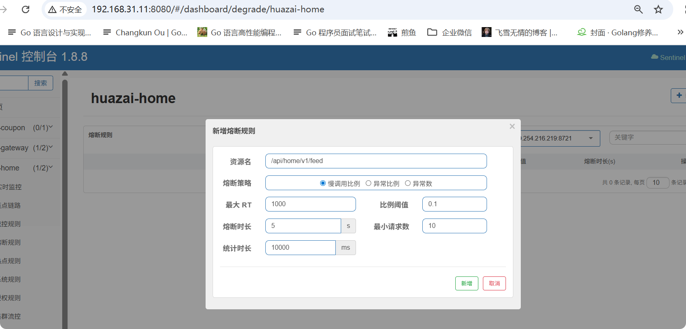

上述配置要达到的效果是：**10 秒（10000 ms）内达到 10 个请求以上，当响应时长超过 1 秒的请求数量大于 1（10 \* 0.1）个的时候进行熔断，熔断 5 秒后变成 Half Open 状态，即 5 秒后的第一个请求如果没有问题则恢复正常，否则继续熔断****。**

下面我们就针对这份配置进行编码实战，看看到底是什么效果。

首先，我们修改一个接口：

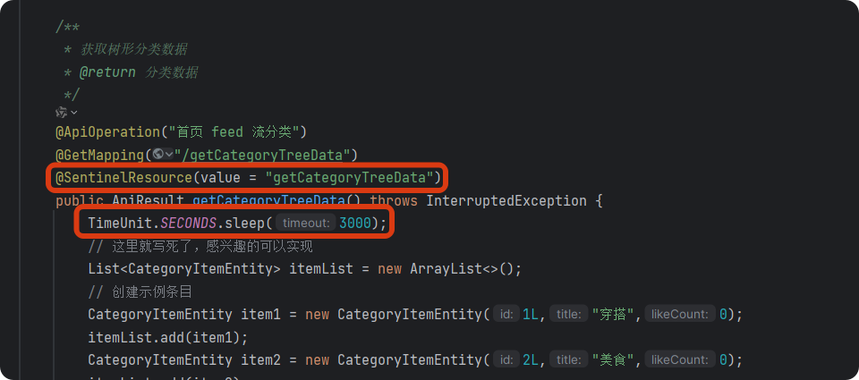

上述代码很简单，就是提供一个 RT 为 3s 的接口，那么如果想要实现慢调用比例的效果，我们需要在 10s 内最少请求 10 次，且只要有一个请求 RT 超出 1s，就进行熔断 5s 。被熔断后就不会进入主方法了，直接返回了默认异常页，如下：

  
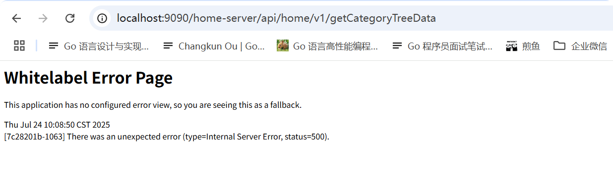

  
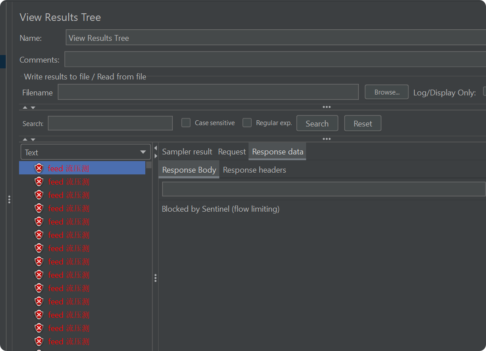

有关慢调用相关知识我们就介绍到这里，接下来我们看另外两种熔断策略：异常比例和异常数。

###   
**3.7.3 异常比例&异常数**

其实对**慢调用比例**知识进行学习后，在学**异常比例**和**异常数**这两种策略的时候会很轻松，因为概念大同小异，只不过一个是根据 RT 来判断，另一个是根据业务异常来判断。

> 注意，这里说的是业务异常，也就是说 Sentinel 的流控异常 BlockedException 这种的是不会被记为异常数的。

### **3.7.3.1 异常比例**

话不多说，我们针对异常比例和异常数进行实战，首先针对异常比例创建个接口：

  
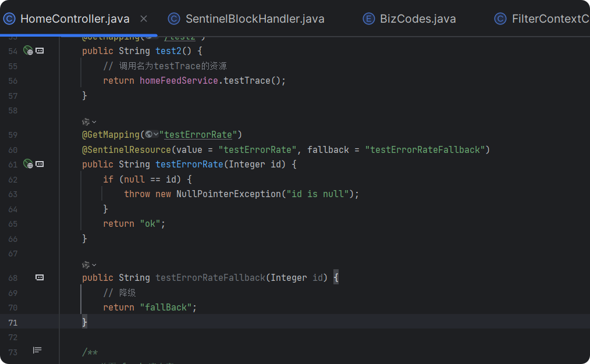

上述代码很简单，新增一个资源名为 testErrorRate 的接口，此接口降级方法为 testErrorRateFallback。下面我们为此资源新建一个异常比例的熔断策略，如下图所示：

  
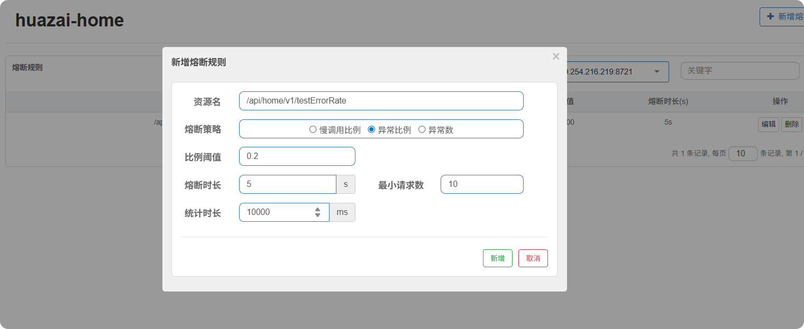

上述配置要达到的效果是：**10 秒（10000ms）内达到 10 个请求以上，当请求异常比例超过 20%（10 \* 0.2 即 2个）的时候进行熔断，熔断 5 秒后变成 Half Open 状态，即 5 秒后的第一个请求如果没有问题则恢复正常，否则继续熔断****。**

我们代码也很清晰易懂，只要不传参数 id 就会抛出空指针异常，有了这个条件，我们的测试方法也很简单了，我们可以在 10s 内请求接口 10 次，8 次传递 id，2 次不传 id，也就是 10 个请求，有 2 个是异常的。这时候就会打开熔断器了，当熔断器打开时，我们再进行正常请求（传递 id）也会进入 fallback 方法当中。

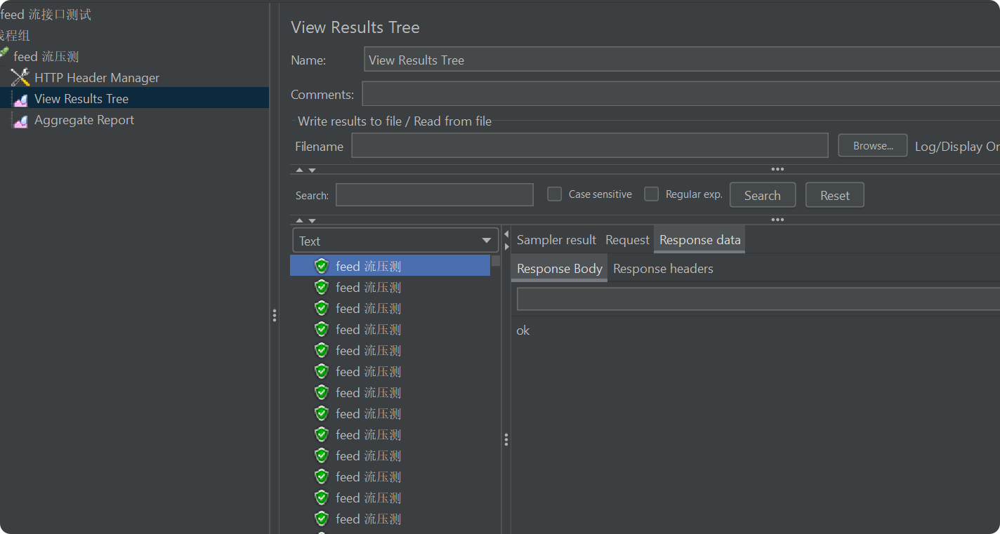

2次不传递参数：

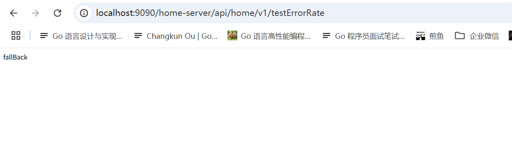

过一会再次传递参数，返回正常：

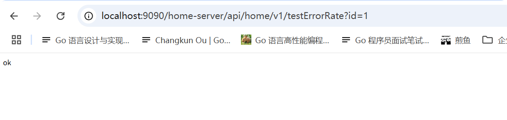

接着，我们看下最后一个熔断策略：**异常数**

### **3.7.3.2 异常数**

异常数就太简单了，我相信大家无师自通，就是在单位时间内超出错误数则触发熔断，和异常比例唯一不同的就是异常比例是计算百分比，而异常数是直接计算错误数量，简单粗暴。

我们直接沿用异常比例策略的代码，然后将其熔断策略改为如下：

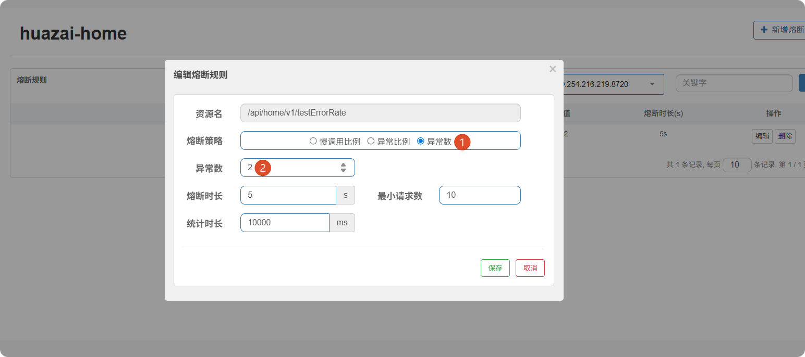

上述配置实现的效果也很明确：**10 秒（10000ms）内达到 10 个请求以上，当请求异常数超过 2个的时候进行熔断，熔断 5 秒后变成 Half Open 状态，即 5 秒后的第一个请求如果没有问题则恢复正常，否则继续熔断****。**

和异常比例唯一的区别在于异常数策略是直接写的数量，异常比例策略是通过最小请求数\*异常比例来计算出的数量。

测试方法和测试效果图同异常比例，此处不再展开。

### **3.7.4 总结**

最后，我们对每种策略做个简短的总结并提供一个实际场景。

**策略总结：**

1.  慢调用比例：衡量在一定时间内，响应时间超过阈值的调用占总调用数量的比例。例如，在一分钟内，有 10% 的请求响应时间超过 1 秒。
2.  异常比例：衡量在一定时间内，发生异常的调用占总调用数量的比例。例如，在一小时内，有 5% 的请求发生了异常。
3.  异常数：计算在一定时间内发生的异常调用的绝对数量。例如，过去一天中，发生了 100 次调用异常。

**实际业务场景：**

比如我们电商项目，其中有一个接口用于处理支付请求。对于这个场景：

1.  慢调用比例：在过去 10 分钟内，有 20% 的支付请求的响应时间超过了 3 秒，超过预设的阈值。
2.  异常比例：在过去一小时内，有 2% 的支付请求发生了异常，可能是由于网络问题或支付平台故障引起的。
3.  异常数：昨天共有 30 次支付请求发生了异常，可能是由于无效的订单号或者连接超时导致的。

### **3.8 Sentinel 热点规则实战**

接下来，我们将重点讲解及实战 Sentinel 的另一个高级特性：热点规则，也叫参数限流。

参数化限流能够有效地针对不同请求进行限制，是一个非常强大的新功能。

下面将先介绍 Sentinel 参数化限流的概念然后讲解其使用方法以及实际应用场景，这样一步步地掌握此知识点，我们先来看下参数限流是什么意思吧～

### **3.8.1 什么是参数限流**

在传统的流量控制中，我们常常通过资源维度来限制某个接口或方法的调用频率。然而实际情况中，我们可能需要更细粒度地控制不同参数条件下的访问速率，这就是参数化限流的概念。

参数限流允许我们根据请求中的参数值，针对不同参数条件设置不同的流量控制规则，这种方式非常适合处理特定条件下的请求，使得我们能够更加精细地管理流量。

让我们用一个通俗的例子来理解参数化限流：比如我们社交电商项目，某个接口允许用户查询美食的制作方法，但在热门美食详情时，你希望每个用户每 5 分钟只能查询 100 次，以避免过多的查询请求。这时你想象一下，如果我将接口的 QPS 限制为 500 可以满足要求吗？

答案是不可以！因为需求是每个用户 5 分钟只能查询 100 次，而不是每秒共计能查询 500 次，因此参数化限流就能派上用场了。

你可以设置一个规则，允许每个用户在 5 分钟内只能访问查询接口 100 次，在这里，参数就是用户的标识，你可以根据用户 ID 来限制他们的查询频率，相当于限流维度就是参数维度了，之前我们都是以资源维度，而不能精细到这个资源（接口）的某个参数。

我想你一定联想到了很多场景，比如：你是一个中台服务或者是 SAAS 服务，那么你就可以根据不同的业务方、不同的商家来做不同的限流规则，比如规模大的业务方/商家，我允许你调用我的 QPS 是 10000，而规模小的业务方和商家，则 QPS 只能是 500。

如下图所示：

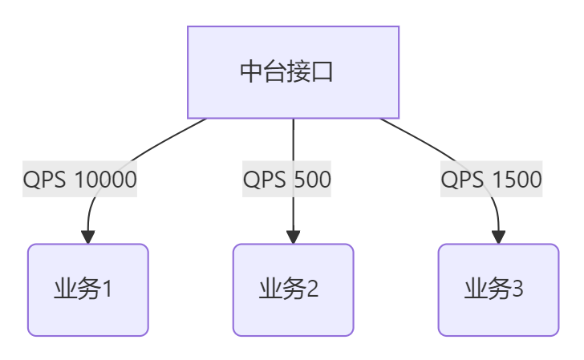

现在，大家应该感受到了此功能的强大和实用，那就让我们一起实战下吧～

###   
**3.8.2 参数限流实战**

我们针对上述两种场景进行实战，首先来看每个人 3 秒钟内只能查询一次美食信息（注意，这里是针对每个人，而不是接口资源）。

我们首先修改一个接口：

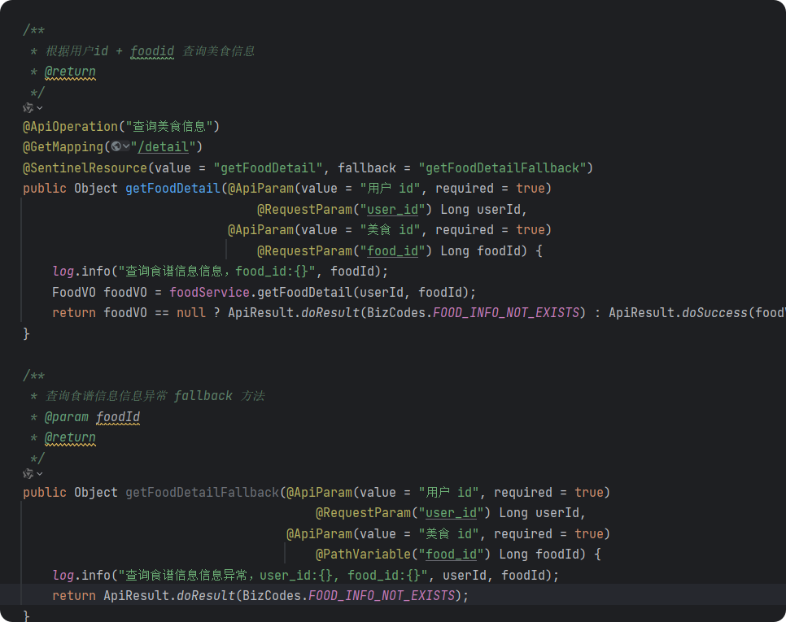

然后我们针对上述接口配置规则，如下：

  
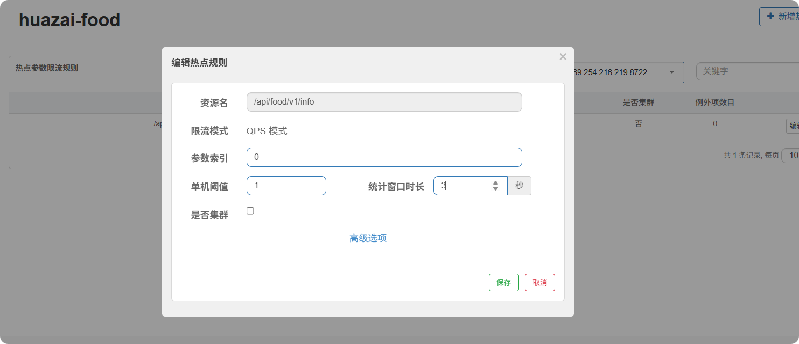

上述配置很简单，就是针对 info 资源进行限制，限制规则为每个人每隔 3 秒钟只能单机查询一次。这里有的同学可能产生疑问：我看接口参数是 userId, foodId，我们想要限制的是每个用户在 3 秒内只能查一次，那么我们的规则配置是如何找到 userId 而不是 foodId 这个参数呢？

这个问题很简单，就是靠上图中的**参数索引**字段，参数索引指的是第几个参数的意思，从 0 开始，因此 0 就代表第一个参数，1 就代表第二个参数，以此类推。我们这里写的是 0 ，因此对应第一个参数 foodId。

有了代码和规则配置，我们就可以进行测试了，首先，我们传递 userId 值为 1，然后在 10 秒内访问三次接口，得到的结果如下：

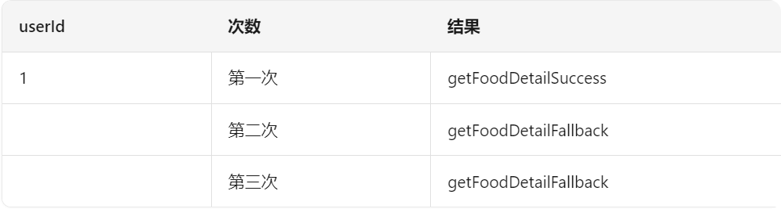

由上可知，只有第一次返回了成功，第二次、第三次均为失败，这也就是我们的规则限制生效了，每个用户 3 秒内只能访问一次。现在 userId 值为 1 的用户已经被限制了，我们紧接着用 userId 值为 2 的用户继续访问，看看能否成功呢？如下所示：

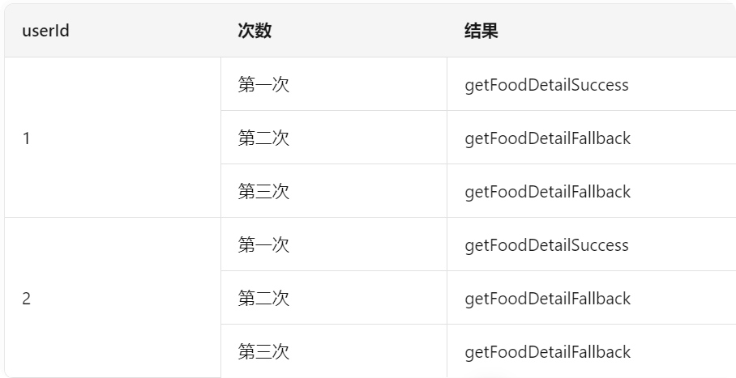

显然，我们 userId \= 1 被限制的时候并不影响 userId \= 2 的请求，这也就做到了根据参数级别来做规则配置，实现了每个用户在单位时间内只能访问 N 次需求。

那我们能否实现不同 userId 访问次数的限制不同？比如，后台工作人员可以每秒查询 10 次，老板可以每秒查询 100 次，而用户则只能每 3 秒查询一次。

答案是可以的，我们在文章开头也提及过，我们可以针对不同业务方（或 userId） 配置不同的限流规则。对应的 Sentinel Dashboard 如下：

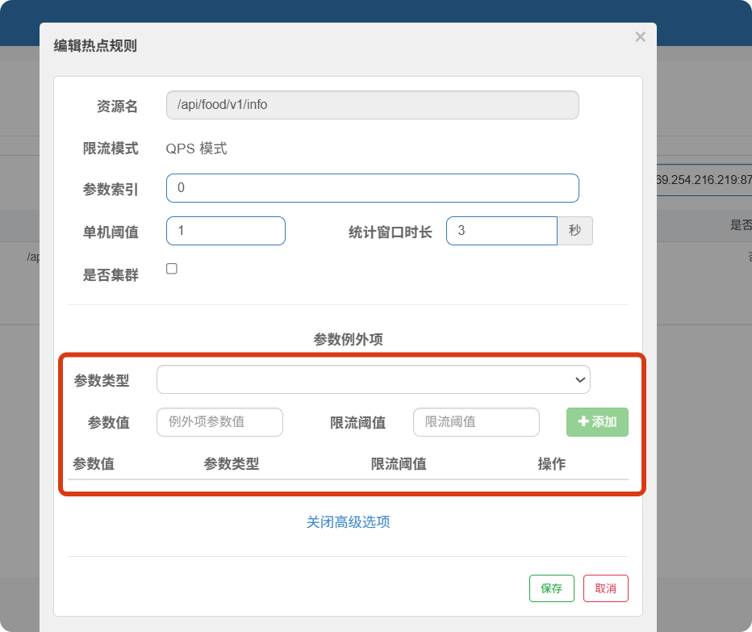

我们首先对上述高级选项的参数进行解释。

1.  参数类型：包含 Java 的几种常用类型，也就是你参数的数据类型（与参数索引相对应，比如你参数索引写的是 0 ，那么这里就需要选择第 1 个参数的数据类型），如下图所示：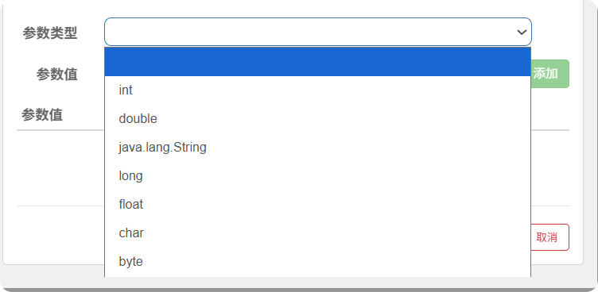
2.  参数值：和参数类型一样与参数索引相对应，比如你参数索引写的是 0 ，那么这里就需要选择第 1 个参数的值，有了参数值，我们就可以针对此值做限流了，也就是下面的限流阈值。
3.  限流阈值：针对某值做限流，比如针对 userId 值为 1 的请求做 QPS 限流阈值为 3，针对 userId 值为 2 的请求做 QPS 限流阈值为 1 等。

有了这些知识，我们再来分析下我们的需求：后台工作人员可以每秒查询 10 次，老板可以每秒查询 100 次，而用户则只能每 3 秒查询一次。

首先，普通用户每 3 秒只查询一次的需求我们已经完成，如下：

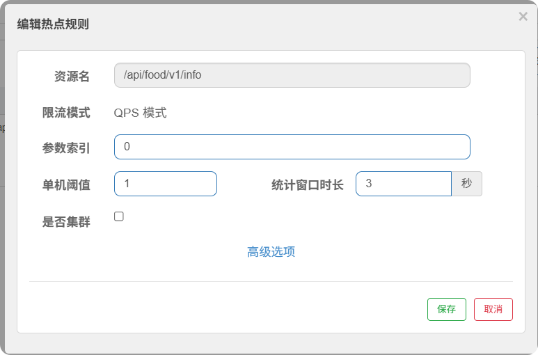

其次，我们需要新建工作人员每秒能查询 10 次的规则，假设工作人员的 userId 值为 100 和 200，那么，我们可以进行如下配置（编辑上述配置）：

  
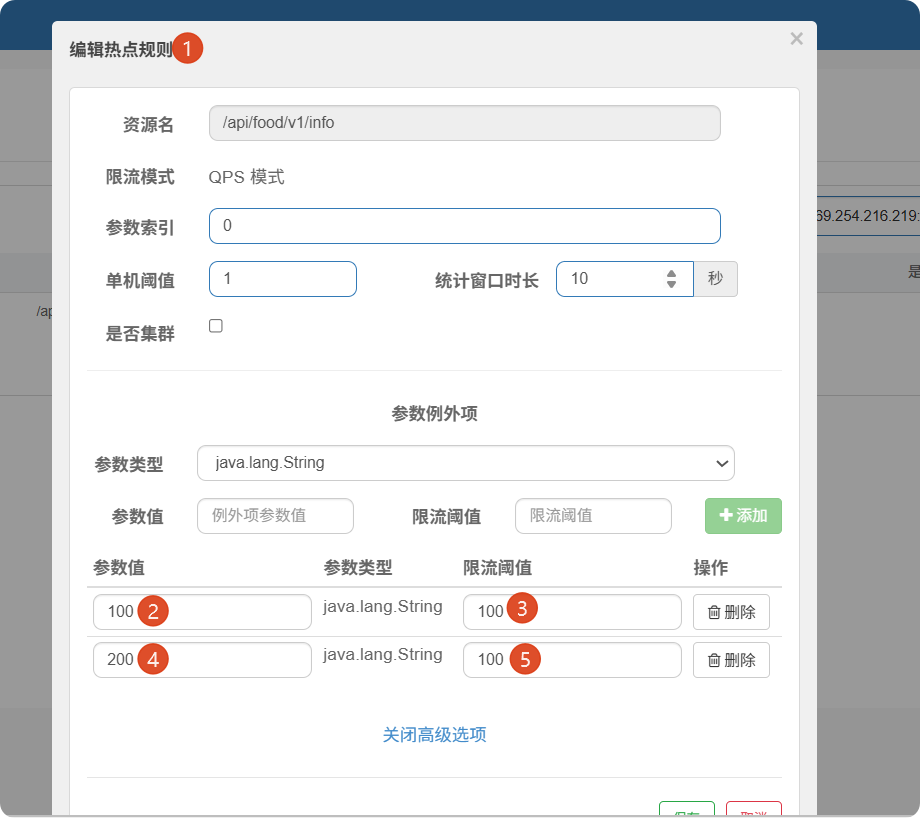

接着，我们需要新建老板每秒能查询 100 次的规则，我们可以编辑上述创建的规则，而不用新建，假设老板的 userId 为 9999，如下图所示：

  
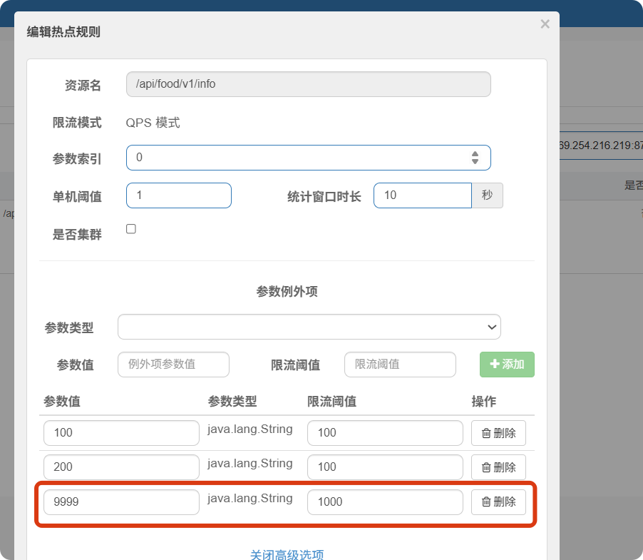

为什么员工需求是每秒能查 10 次，老板每秒能查 100 次，但是我设置的限流阈值为员工 100，老板 1000 呢？这是因为我们在最上面设置的统计窗口时长为 10 秒，因此员工的阈值为 10 \* 10 = 100，老板的阈值为 100 \* 10 = 1000。

通过上述配置，就可以完成此需求，最后得出的测试结果如下：

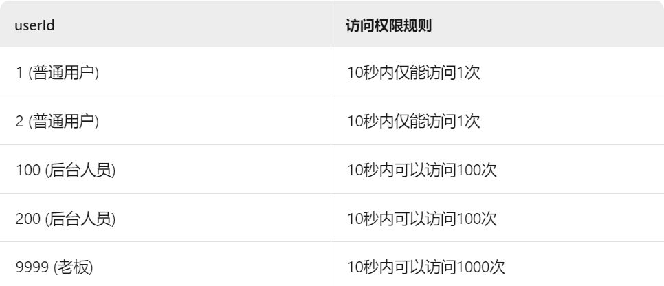

## **3.9 Sentinel 授权规则实战**

上一节我们深入探讨了 Sentinel 中的参数化限流，它是一种基于请求参数进行流量控制的强大功能。通过对请求参数的灵活管理，我们可以更加精细地调整流量控制策略以应对不同条件下的请求压力，这为系统的稳定性和可用性提供了强有力的支持。

但有时我们还需要对访问系统的用户进行授权管理，只允许特定用户或 IP 地址进行访问，这时就需要使用 Sentinel 的授权规则（黑白名单）功能。

接下来将介绍在什么情况下需要采取 Sentinel 的授权规则，并演示如何实现授权规则的功能。我们先看下什么时候需要授权规则，也就是授权规则的应用场景有哪些。

### **3.9.1 什么情况下使用 Sentinel 授权规则**

首先，什么是 Sentinel 的授权规则？授权规则主要基于两个核心概念：**黑名单**和**白名单**。如下图所示：

  
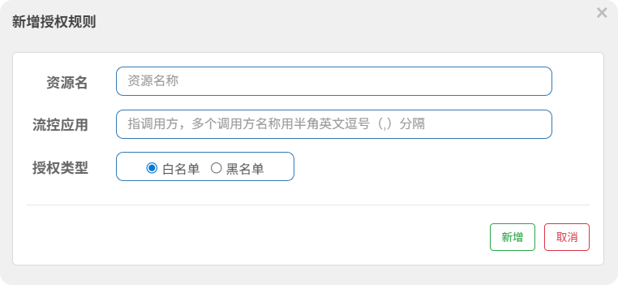

1.  黑名单： 一种限制性授权规则，用于限制某些用户、操作或资源的访问权限。当用户、操作或资源被列入黑名单后，它们将被拒绝访问，无法执行受限制的操作。黑名单在防范恶意行为、限制不良内容上传等场景中扮演着重要角色。
2.  白名单： 一种授予性授权规则，允许特定用户、操作或资源访问受限制的功能。被列入白名单的实体将享有额外的权限，通常用于提供更高级别的功能或服务。白名单在提供特殊服务、增强用户体验等方面发挥作用。

那授权规则适用于什么场景呢？

1.  用户身份认证： 当用户登录系统时，系统会验证其身份，确保用户是合法用户。例如，只有登录的管理员才能发布新的电影信息。
2.  角色和权限分配： 系统会为不同角色的用户分配不同的权限。例如，管理员可以管理电影信息，编辑可以编辑但不能发布，访客只能浏览。
3.  操作访问控制： 某些操作可能只能被特定角色的用户执行。例如，只有管理员可以删除电影信息。
4.  数据保护： 系统需要保护敏感数据，确保只有授权的用户可以访问。例如，用户只能访问自己的个人信息。
5.  安全访问： 限制只有特定用户或特定 IP 地址可以访问系统，防止恶意用户或恶意 IP 地址对系统进行攻击或滥用资源。

当然，应用场景不局限于上面几个例子，只要涉及到黑白名单的场景，我们都可以用 Sentinel 来完成。在掌握了授权规则的应用场景后，我们接下来就进入实战环节，看下如何利用 Sentinel 的授权规则来实现黑白名单的控制。

> 用户权限一般都是由数据表来完成，如果公司没有权限设计，但又不想让某些人访问某些接口或只想让某些人访问某些接口，那么 Sentinel 还是很合适的，用法也简单。

### **3.9.2 如何实现 Sentinel 授权规则**

有了上述场景，我们就可以在项目里开发代码来实现 Sentinel 授权功能了，我们分为如下几步。

官方地址：[https://github.com/alibaba/Sentinel/wiki/%E9%BB%91%E7%99%BD%E5%90%8D%E5%8D%95%E6%8E%A7%E5%88%B6](https://github.com/alibaba/Sentinel/wiki/%E9%BB%91%E7%99%BD%E5%90%8D%E5%8D%95%E6%8E%A7%E5%88%B6)

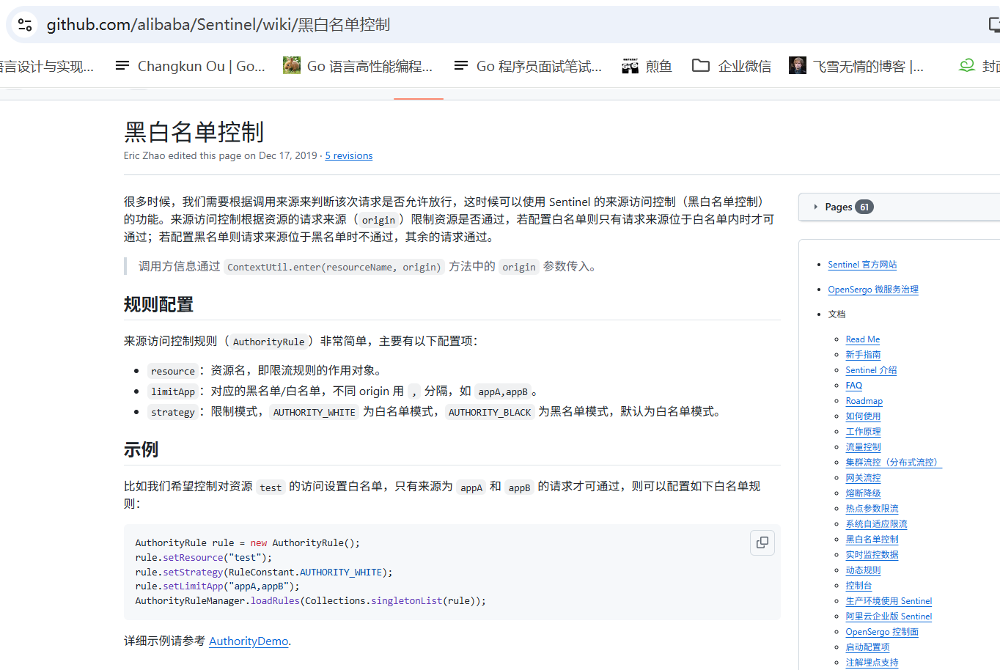

整个流程如下：

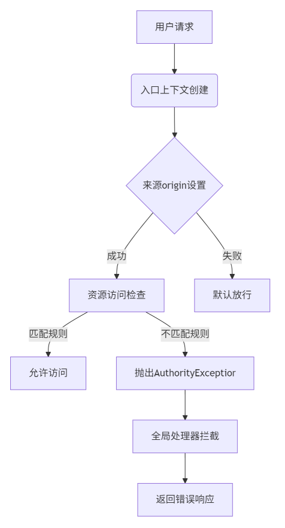

我们按照官方给出示例的方式改造，首先需要定义授权规则，Sentinel 授权规则配置类是 AuthorityRule，我们自定义一个类，初始化 Sentinel 授权规则配置，代码如下所示：

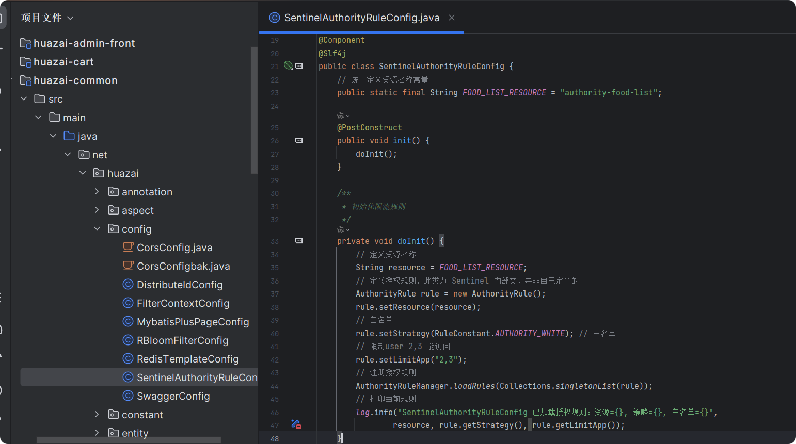

现在规则配置已经完成，接下来就可以采取编程式来调用 [ContextUtil#enter](http://contextutil/#enter%20) 和 [SphU#entry](http://sphu/#entry) 方法进行授权规则的验证，代码如下：

  
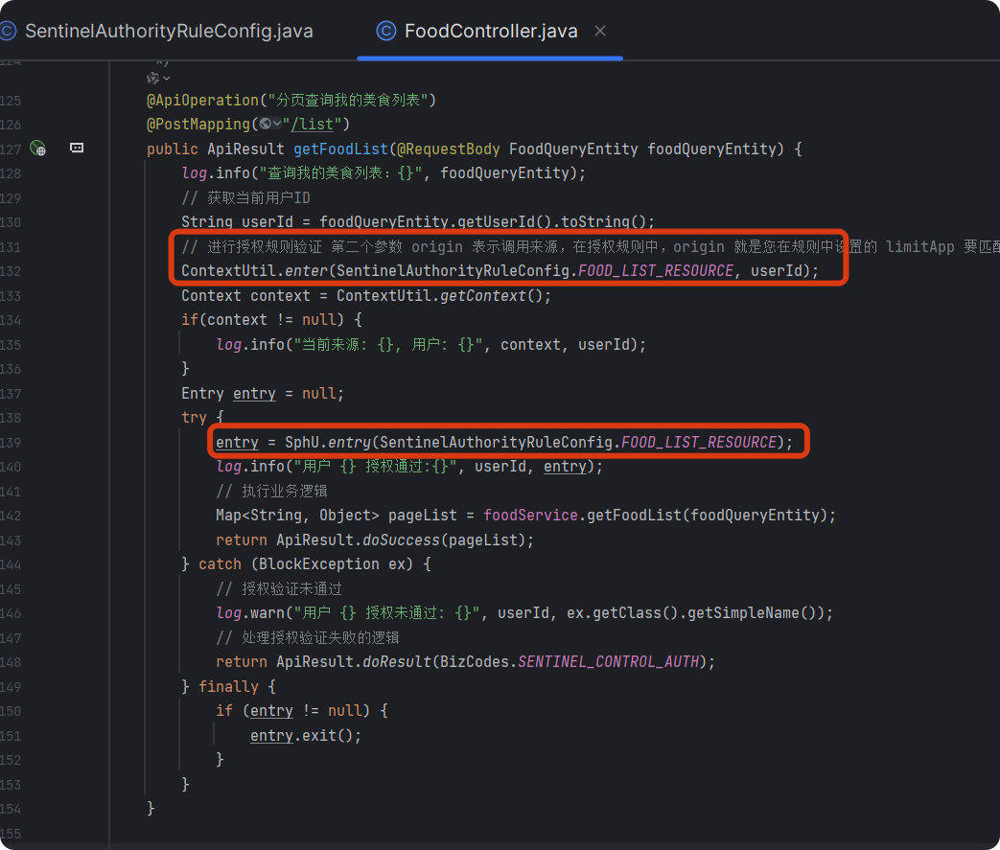

上述代码核心片段只有两行：[ContextUtil.enter(RESOURCE\_NAME, userId)](http://contextutil.enter\(resource_name,%20userid\)/) 和 [SphU.entry(RESOURCE\_NAME)](http://sphu.entry\(resource_name\)/)，其中 SphU.entry 就是定一个资源，我们规则配置：只有 user 为 2,3 能访问此资源，相当于我们告诉 Sentinel 说：只有这两个用户可以访问 authority-food-list 这个资源，那么用户 id（ 2和 3） 从哪传递给 Sentinel 呢？这就借助了 [ContextUtil.enter(RESOURCE\_NAME, userId)](http://contextutil.enter\(resource_name,%20userid\)/) 这行代码来完成，我们将资源名称和 userId 传递给 ContextUtil.enter 方法。

我们启动服务进行测试，分别传递 1、2 、3，如果 2和 3 返回正常数据，1 返回认证失败则符合预期，但是目前测试效果不如预期，如下图所示：

  
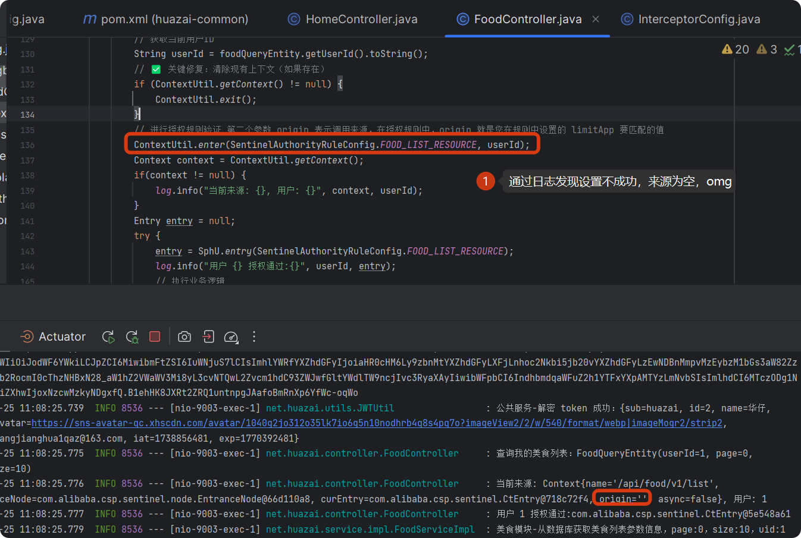

TODO 待解决

###   
**3.9.3 授权规则总结**

通过实现 Sentinel 系统授权功能，我们能够全面保障系统的安全性。系统授权涵盖了用户身份认证、权限分配、操作访问控制和数据保护等多个方面，为我们提供了强大的工具来应对不同的安全需求。通过合理设置和测试系统授权，我们能够建立安全可靠的分布式系统，保护用户数据和敏感操作不受未授权访问。

在实际应用中，系统授权功能可以适用于各种场景。通过将 Sentinel 系统授权与其他安全框架（如 Spring Security）结合，我们可以为系统构建完善的安全体系，确保系统稳定运行并提供优质的用户体验。

> 需要注意的是：黑白名单的设置并不针对 userId ，而是针对所有参数，比如按照 IP 限制也一样，还有就是并不一定要通过 Request Body 获取参数，我们通过 header 获取也是可以的，只要我们能够正常获取到参数且传递给 ContextUtil.enter(); 即可。

## **3.10 Sentinel 系统规则实战**

在构建健壮的分布式系统时，还需要考虑整体的系统健康和资源分配，这就是 Sentinel 的系统规则发挥作用的地方。

下面将深入探讨 Sentinel 系统规则的概念、各种规则配置，以及在实际应用中的应用场景和代码实现。

###   
**3.10.1 什么是系统规则**

系统规则是 Sentinel 框架中的一种流量控制方式，用于针对整个系统的资源和性能进行保护。它包含多个规则配置，可以设置针对系统整体资源的访问控制策略。策略有很多种，如下 Dashboard 图所示：

  
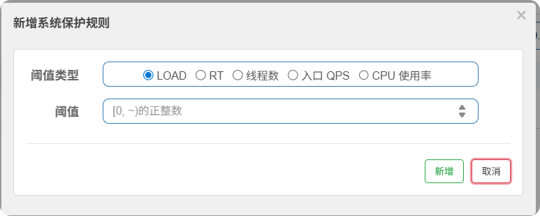

为了助于大家理解上图含义，下面我们针对上图中的类型逐个举例说明。

1.  Load（负载）规则
2.  含义： Load 规则用于限制系统的负载，它是系统资源的负载均衡指标。负载值反映了当前系统资源的使用情况。当系统 load1 超过阈值，且系统当前的并发线程数超过系统容量时才会触发系统保护。系统容量由系统的 maxQps \* minRt 计算得出。设定参考值一般是 CPU cores \* 2.5。
3.  应用场景： 假设你有一个大型电商平台，在热门购物季节，用户涌入使得系统资源紧张。你可以使用 Load 规则，设置负载的阈值，当系统负载过高时，限制新的请求进入系统，以避免资源崩溃或变慢。
4.  RT（平均响应时间）规则
5.  含义： RT 规则用于控制系统的平均响应时间，即请求从发出到响应的平均耗时。高响应时间可能表示系统负载或性能问题。当单台机器上所有入口流量的平均 RT 达到阈值即触发系统保护，单位是毫秒。
6.  应用场景： 在一个即时消息应用中，确保用户收到消息的及时性非常重要。你可以设置 RT 规则，限制消息发送接口的平均响应时间，保障用户体验。
7.  线程数规则
8.  含义： 线程数规则用于限制系统的并发线程数，避免过多的线程导致资源竞争和性能下降。当单台机器上所有入口流量的并发线程数达到阈值即触发系统保护。
9.  应用场景： 在一个高并发的在线游戏中，每个用户都可能占用一个独立线程。你可以使用线程数规则，限制并发线程数，避免过多的线程占用资源，从而保障系统的稳定性。
10.  入口 QPS（每秒查询数）规则
11.  含义： 入口 QPS 规则用于限制每个接口的访问频率，防止短时间内大量请求涌入。当单台机器上所有入口流量的 QPS 达到阈值即触发系统保护。
12.  应用场景： 在一个热门的抢购活动中，用户可能频繁刷新页面以获取商品信息。你可以使用入口 QPS 规则，限制商品详情接口的访问频率，避免服务器压力过大。
13.  CPU 使用率规则
14.  含义： CPU 使用率规则用于限制系统的 CPU 使用率，防止因为高 CPU 负载而影响其他任务。当单台机器上所有入口流量的 CPU使用率达到阈值即触发系统保护。
15.  应用场景： 在一个图像渲染应用中，每个任务需要大量计算资源。你可以设置 CPU 使用率规则，限制渲染任务的 CPU 使用率，保证其他任务的正常运行。

这时候可能产生疑问：按照线程数限流、按照 QPS 限流、按照 RT 做熔断降级在之前不是都讲解过了吗？为什么这里又重复一次？

因为之前讲解的是应用级别，或者说是资源级别，而这里讲解的是操作系统级别，或者说是服务器级别，一台服务器可以部署很多应用（资源），虽然我们为每个资源设置了流控规则，但是服务器也可能被压爆，如果因为一个服务导致服务器垮了，那么会对其他服务产生影响，所以，服务器本身也需要可靠性，也需要做一些流控规则配置，比如入口 QPS 规则讲的是当前服务器上所有接口的入口流量，而不是某个服务的某个接口，其他规则也同理。

我相信大家已经对上面系统规则几种类型的含义有所掌握，接下来我们就利用官网的 Demo 来讲解下。

### **3.10.2 系统规则实战**

我们先来看下官方网站实现好的 Demo 来讲解，文档地址：[https://github.com/alibaba/Sentinel/wiki/%E7%B3%BB%E7%BB%9F%E8%87%AA%E9%80%82%E5%BA%94%E9%99%90%E6%B5%81](https://github.com/alibaba/Sentinel/wiki/%E7%B3%BB%E7%BB%9F%E8%87%AA%E9%80%82%E5%BA%94%E9%99%90%E6%B5%81)

代码地址：[https://github.com/alibaba/Sentinel/blob/master/sentinel-demo/sentinel-demo-basic/src/main/java/com/alibaba/csp/sentinel/demo/system/SystemGuardDemo.java](https://github.com/alibaba/Sentinel/blob/master/sentinel-demo/sentinel-demo-basic/src/main/java/com/alibaba/csp/sentinel/demo/system/SystemGuardDemo.java)

/\*

\* Copyright 1999-2018 Alibaba Group Holding Ltd.

\*

\* Licensed under the Apache License, Version 2.0 (the "License");

\* you may not use this file except in compliance with the License.

\* You may obtain a copy of the License at

\*

\* http://www.apache.org/licenses/LICENSE-2.0

\*

\* Unless required by applicable law or agreed to in writing, software

\* distributed under the License is distributed on an "AS IS" BASIS,

\* WITHOUT WARRANTIES OR CONDITIONS OF ANY KIND, either express or implied.

\* See the License for the specific language governing permissions and

\* limitations under the License.

\*/

package com.alibaba.csp.sentinel.demo.system;

import java.util.ArrayList;

import java.util.Collections;

import java.util.List;

import java.util.concurrent.TimeUnit;

import java.util.concurrent.atomic.AtomicInteger;

import com.alibaba.csp.sentinel.util.TimeUtil;

import com.alibaba.csp.sentinel.Entry;

import com.alibaba.csp.sentinel.EntryType;

import com.alibaba.csp.sentinel.SphU;

import com.alibaba.csp.sentinel.slots.block.BlockException;

import com.alibaba.csp.sentinel.slots.system.SystemRule;

import com.alibaba.csp.sentinel.slots.system.SystemRuleManager;

/\*\*

\* @author jialiang.linjl

\*/

public class SystemGuardDemo {

private static AtomicInteger pass \= new AtomicInteger();

private static AtomicInteger block \= new AtomicInteger();

private static AtomicInteger total \= new AtomicInteger();

private static volatile boolean stop \= false;

private static final int threadCount \= 100;

private static int seconds \= 60 + 40;

public static void main(String\[\] args) throws Exception {

tick();

initSystemRule();

for (int i \= 0; i < threadCount; i++) {

Thread entryThread \= new Thread(new Runnable() {

@Override

public void run() {

while (true) {

Entry entry \= null;

try {

entry = SphU.entry("methodA", EntryType.IN);

pass.incrementAndGet();

try {

TimeUnit.MILLISECONDS.sleep(20);

} catch (InterruptedException e) {

// ignore

}

} catch (BlockException e1) {

block.incrementAndGet();

try {

TimeUnit.MILLISECONDS.sleep(20);

} catch (InterruptedException e) {

// ignore

}

} catch (Exception e2) {

// biz exception

} finally {

total.incrementAndGet();

if (entry != null) {

entry.exit();

}

}

}

}

});

entryThread.setName("working-thread");

entryThread.start();

}

}

private static void initSystemRule() {

SystemRule rule \= new SystemRule();

// max load is 3

rule.setHighestSystemLoad(3.0);

// max cpu usage is 60%

rule.setHighestCpuUsage(0.6);

// max avg rt of all request is 10 ms

rule.setAvgRt(10);

// max total qps is 20

rule.setQps(20);

// max parallel working thread is 10

rule.setMaxThread(10);

SystemRuleManager.loadRules(Collections.singletonList(rule));

}

private static void tick() {

Thread timer \= new Thread(new TimerTask());

timer.setName("sentinel-timer-task");

timer.start();

}

static class TimerTask implements Runnable {

@Override

public void run() {

System.out.println("begin to statistic!!!");

long oldTotal \= 0;

long oldPass \= 0;

long oldBlock \= 0;

while (!stop) {

try {

TimeUnit.SECONDS.sleep(1);

} catch (InterruptedException e) {

}

long globalTotal \= total.get();

long oneSecondTotal \= globalTotal - oldTotal;

oldTotal = globalTotal;

long globalPass \= pass.get();

long oneSecondPass \= globalPass - oldPass;

oldPass = globalPass;

long globalBlock \= block.get();

long oneSecondBlock \= globalBlock - oldBlock;

oldBlock = globalBlock;

System.out.println(seconds + ", " + TimeUtil.currentTimeMillis() + ", total:"

\+ oneSecondTotal + ", pass:"

\+ oneSecondPass + ", block:" + oneSecondBlock);

if (seconds-- <= 0) {

stop = true;

}

}

System.exit(0);

}

}

}

  
上述代码看起来很冗长，但经过我们前面的学习，大家应该可以猜测到上述代码干了哪几件事：初始化系统规则配置、跑程序进行测试、输出测试结果。

没错，上面冗长的代码就干了这三件事，如下：

public static void main(String\[\] args) throws Exception {

// 打印测试结果

tick();

// 初始化系统规则配置

initSystemRule();

// 跑程序进行测试

for (int i \= 0; i < threadCount; i++) {

...

}

}

这里唯一值得看的就是初始化系统配置方法 initSystemRule()：

private static void initSystemRule() {

List<SystemRule> rules = new ArrayList<SystemRule>();

SystemRule rule \= new SystemRule();

// max load is 3

rule.setHighestSystemLoad(3.0);

// max cpu usage is 60%

rule.setHighestCpuUsage(0.6);

// max avg rt of all request is 10 ms

rule.setAvgRt(10);

// max total qps is 20

rule.setQps(20);

// max parallel working thread is 10

rule.setMaxThread(10);

​

rules.add(rule);

SystemRuleManager.loadRules(Collections.singletonList(rule));

}

  
上述代码初始化了系统规则的全部类型，其中 SystemRule 为系统规则的核心配置类，上述代码其实就是设置以下规则：

1.  系统最高负载为 3.0；
2.  系统 CPU 最大使用率为 60%；
3.  系统最大平均响应时间为 10 毫秒；
4.  系统最大 QPS 为 20；
5.  系统最大并行线程数为 10。

然后通过系统规则配置管理类 SystemRuleManager 将规则配置注册进去，一旦超出上述阈值，新进来的请求将被直接拒绝，有关规则配置类以及管理类我们在后面剖析源码时会深度剖析，这里我们对这两个类有个印象即可。

###   
**3.10.3 系统规则总结**

  
通过本文，我们深入了解了 Sentinel 的系统规则，它为我们提供了一种全局的流量控制方式，保护整个系统免受高负载和异常请求的影响。通过灵活配置不同规则，我们能够从不同维度上确保系统的稳定性和性能。实际应用中，系统规则可以帮助我们有效地应对资源竞争、高负载等挑战，从而为用户提供卓越的体验。

我们并没有针对每种类型都从 0 开始实战，而是直接拿官方 Demo 进行讲解，这是因为系统规则和其他规则不同，系统规则针对的是服务器，比如我电脑本地跑程序的话，那么我本机就是服务器，如果要演示的话，需要对我本机进行压测 Load 和 CPU ，我觉得意义不大，之前带大家实战了那么多种规则，相信大家对这些知识能够有所掌握。

## **3.11 Sentinel 集群流控实战**

  
我们前面几节都是基于单机的，也就是基于一台机器的，比如：流控配置、熔断降级配置等都是单机部署的。然而，在真实的分布式系统中，可能有多个节点共同协作，对整个系统的流量进行控制。

为了确保协同稳定性，Sentinel 提供了集群流控，本文将重点讲解集群流控的概念、配置和应用场景，通过代码实现和测试来帮助你理解如何在分布式系统中应用集群流控。

首先，为什么需要集群流控？

### **3.11.1 集群流控意义**

我相信有工作经验的同学对这个问题都不陌生，但为了让每一个人都搞懂此知识点，我还是从基础开始讲起。首先来看什么是集群，我这里通过一个案例来说明。

假设让你开发了一个项目，此项目前期的访问量每天只有 100 次，因此，对你来讲没有任何挑战，直接开发、部署到某台服务器上即可，如下图所示：

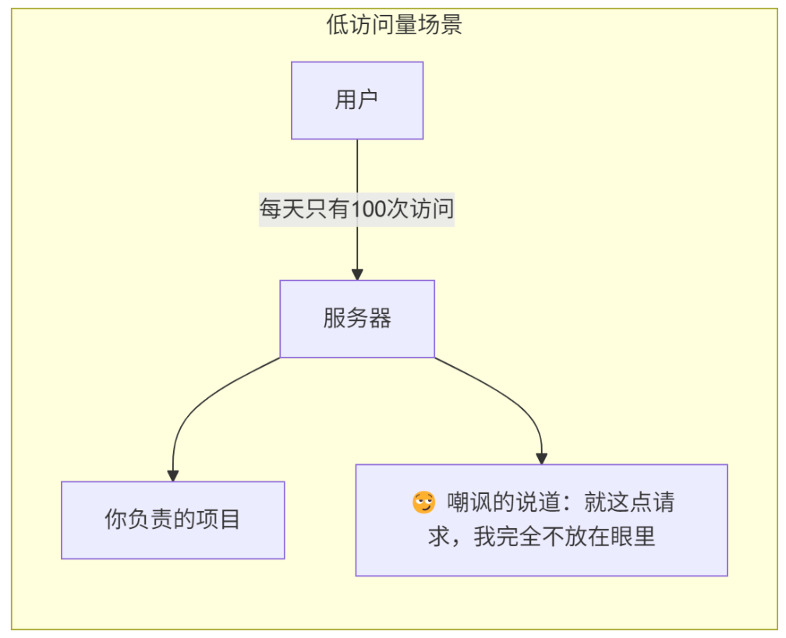

这时，你们老板请了明星代言，大力推广你们的这个项目，每天的访问量从之前的 100 次变成了 1000 万次，每秒 QPS 峰值可达 10000。这时，你的服务器还能正常运行吗？答案是不能。因为服务器的带宽、内存、CPU 等都是有限的，可能对于一台机器来讲，QPS 的峰值最大只能达到 1000，但是你负责的这个项目 QPS 峰值可达 10000，那岂不是服务器会被打垮掉，导致服务不可用？如下：

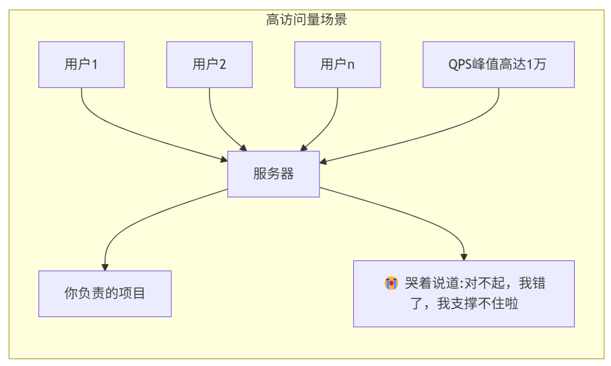

那该怎么办呢？目前的问题是：流量太大，导致服务器扛不住。那我们如果再加 1 台服务器呢？一台不够的话我们再加 20 台呢？让这 20 台均分这些流量是不是就减轻了服务器的压力？这样一来岂不是就能让我们的服务正常运行了？如下所示：

  
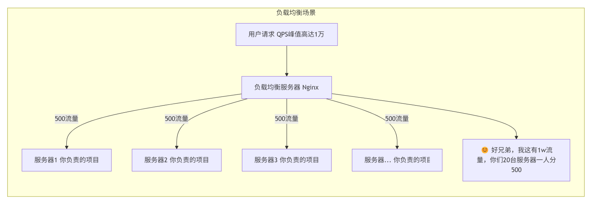

那么，何为集群？上述 20 台机器就凑成了一个集群，从我们之前的单机部署演化成了集群部署。

那为什么需要集群？

因为集群可以分摊流量，减轻单机的压力，使服务稳定运行。那 Sentinel 的集群流控又是个什么玩意？

我举几个例子：

1.  如果我想限制某接口整个集群内只能接收 5000 QPS，结合我们之前学的 Sentinel 流控知识，假设我们有 5 台机器，那么我们可以针对每台机器都配置 1000 QPS，这样整个集群就是 5000 QPS 了。那如果扩容（5 台变 6 台了）或者缩容（5 台变 4 台了）怎么办呢？我们还需要手动去调整？可你别忘了，现在大多数企业都是 K8S 集群，自动扩缩容，对开发者无感的。
2.  如果我们的服务是中台服务，我现在想配置某接口每个业务方的 QPS 为 100，这怎么做呢？大家很快就能想到：前几节刚讲的参数限流！可是，我们配置参数限流的时候也是单机的，也存在上述自动扩缩容问题。

因此，Sentinel 集群流控就诞生了，Sentinel 集群流控支持配置整个集群内的规则，而不是单节点。

接下来，我们就一起实战下 Sentinel 的集群流控。

### **3.11.2 Sentinel 集群流控实战**

官方文档：[https://github.com/alibaba/Sentinel/wiki/%E9%9B%86%E7%BE%A4%E6%B5%81%E6%8E%A7](https://github.com/alibaba/Sentinel/wiki/%E9%9B%86%E7%BE%A4%E6%B5%81%E6%8E%A7)

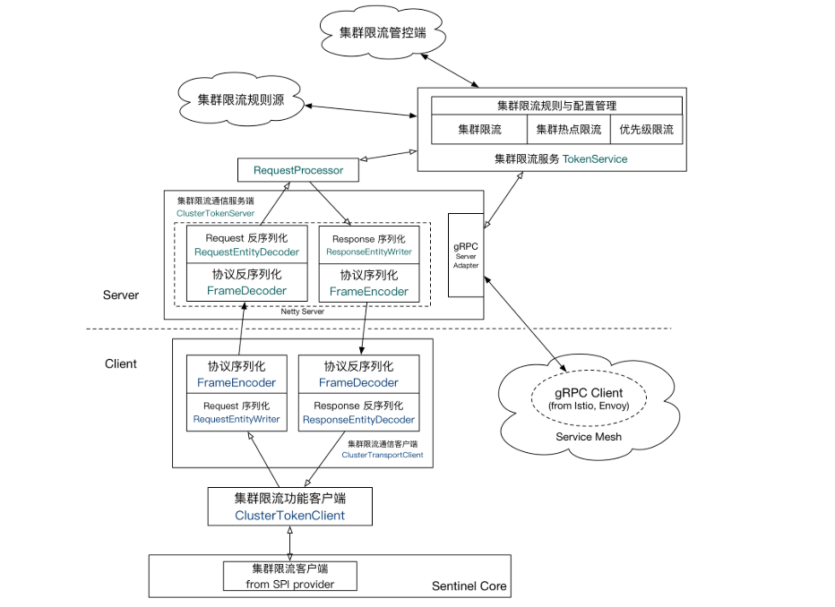

Sentinel 集群限流服务端有两种启动方式：

1.  独立模式（Alone），即作为独立的 token server 进程启动，独立部署，隔离性好，但是需要额外的部署操作。独立模式适合作为 Global Rate Limiter 给集群提供流控服务。

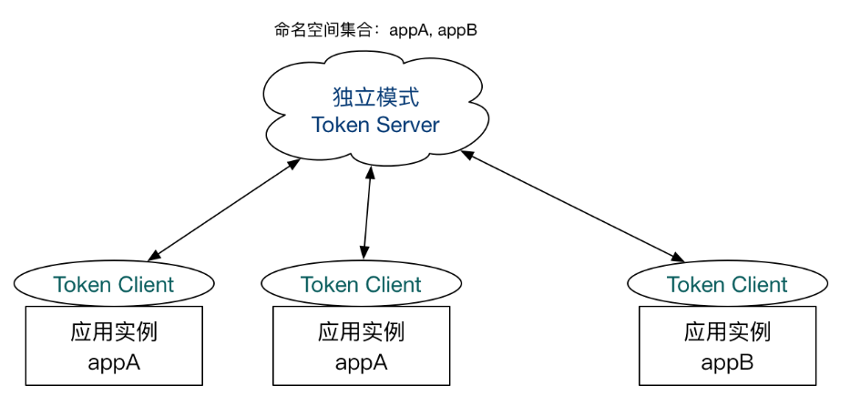

1.  嵌入模式（Embedded），即作为内置的 token server 与服务在同一进程中启动。在此模式下，集群中各个实例都是对等的，token server 和 client 可以随时进行转变，因此无需单独部署，灵活性比较好。但是隔离性不佳，需要限制 token server 的总 QPS，防止影响应用本身。嵌入模式适合某个应用集群内部的流控。以 Web 应用为示例，可以启动多个实例分别作为 Token Server 和 Token Client。数据源的相关配置可以参考 [DemoClusterInitFunc](https://github.com/alibaba/Sentinel/blob/master/sentinel-demo/sentinel-demo-cluster/sentinel-demo-cluster-embedded/src/main/java/com/alibaba/csp/sentinel/demo/cluster/init/DemoClusterInitFunc.java)。

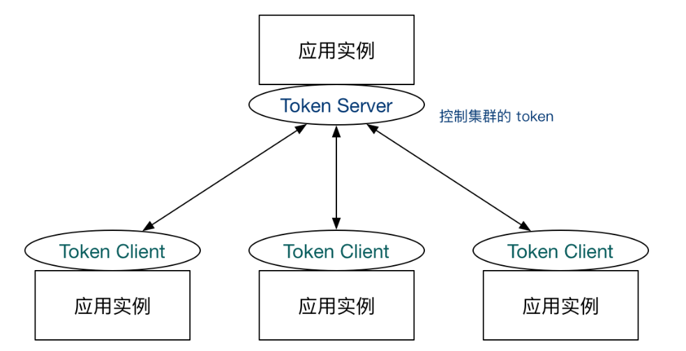

集群流控 Demo 并不需要我们自己去写，Sentinel 源码为集群流控自带了 Demo ，这里我们以「**嵌入模式**」为例，其隶属于如下位置：

  
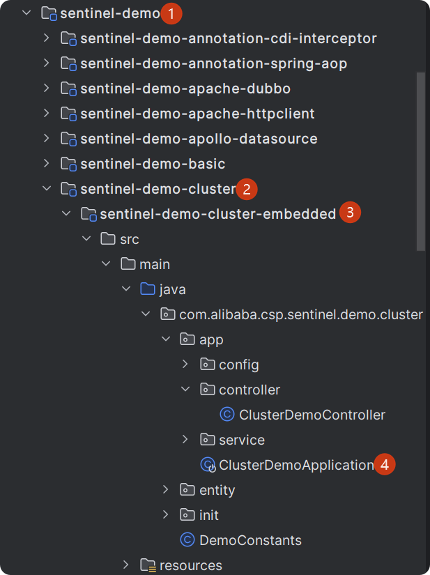

因此，我们直接启动 [com.alibaba.csp.sentinel.demo.cluster.app.ClusterDemoApplication](http://com.alibaba.csp.sentinel.demo.cluster.app.clusterdemoapplication/) 即可。为了演示集群效果，我们启动三次此项目，分别指定不同的端口。

启动之前，我们需要添加如下 JVM 参数：

\# 注意：若在本地启动多个 Demo 示例，需要加上 -Dcsp.sentinel.log.use.pid=true 参数，否则控制台显示监控会不准确。

\-Dcsp.sentinel.log.use.pid=true -Dproject.name=sentinle.cluster.demo.embedded -Dserver.port=8081 -Dcsp.sentinel.dashboard.server=localhost:8080 -Dcsp.sentinel.api.port=8881

\-Dcsp.sentinel.log.use.pid=true -Dproject.name=sentinle.cluster.demo.embedded -Dserver.port=8082 -Dcsp.sentinel.dashboard.server=localhost:8080 -Dcsp.sentinel.api.port=8882

\-Dcsp.sentinel.log.use.pid=true -Dproject.name=sentinle.cluster.demo.embedded -Dserver.port=8083 -Dcsp.sentinel.dashboard.server=localhost:8080 -Dcsp.sentinel.api.port=8883

我们都知道在 IDEA 中同一个项目只能打开一次，无法新窗口打开，那么如何操作 3 次呢？

  
这里我补充下两个操作步骤。

1.  如何添加上述 JVM 配置？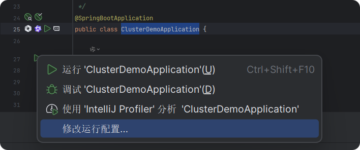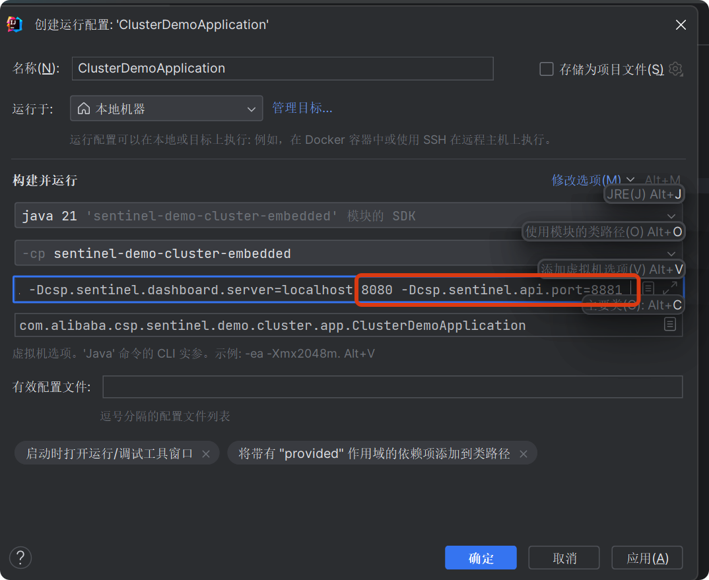
2.  如何针对同一个 Application 启动类启动多次？也很简单，点完复制后就会多出一个启动类，然后更改 VM options ，启动即可。如下图：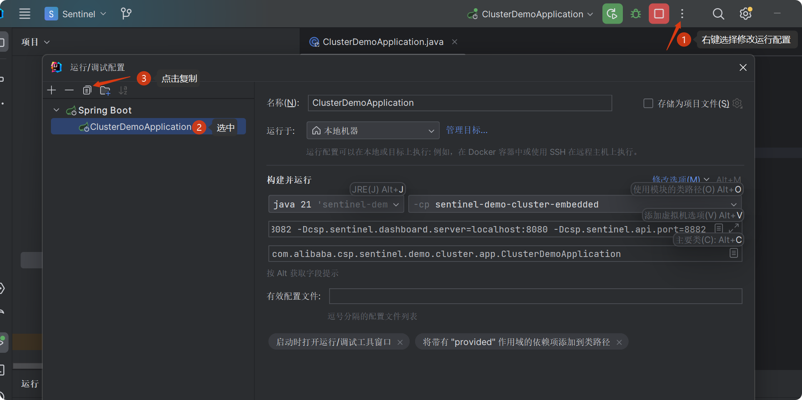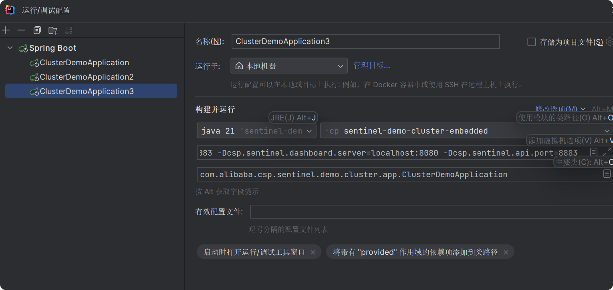

最后启动成功界面如下：

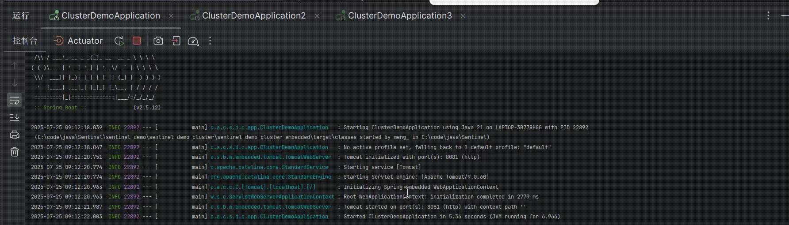

项目启动完成后，我们需要访问三次资源接口，否则 Sentinel Dashboard 不会显示（懒加载嘛），那接口需要我们自己写吗？答案是不需要！Demo 里已经替我们写好了，如下：

  
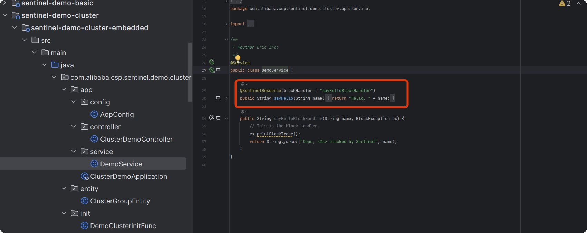

接着我们分别访问：

[http://localhost:8081/hello/sentinel](http://localhost:8081/hello/sentinel)

[http://localhost:8082/hello/sentinel](http://localhost:8082/hello/sentinel)​

[http://localhost:8083/hello/sentinel](http://localhost:8083/hello/sentinel)  

  
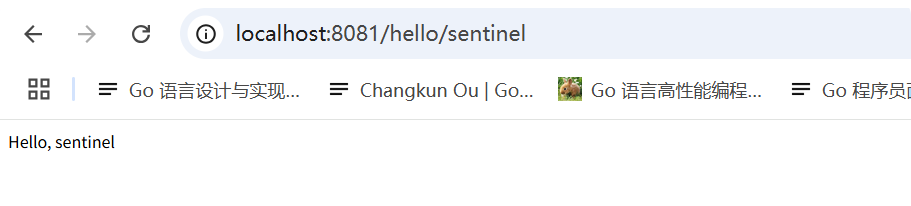

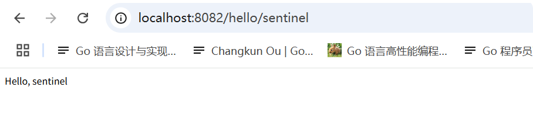

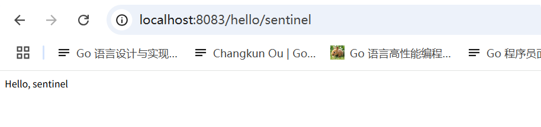

接着，我们打开 Sentinel Dashboard，看看这三个服务是否成功注册进来，如下图所示：

  
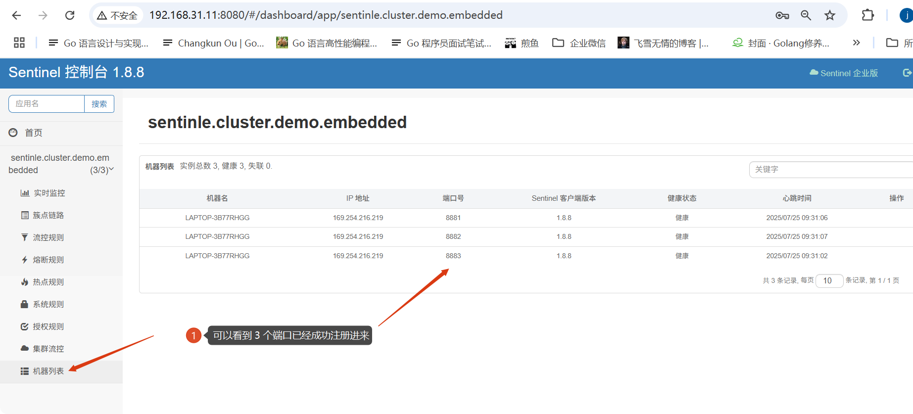

现在，我们的基础环境算是准备好了，我们接下来就可以进行集群维度的流控规则配置进行效果演示啦。

首先，我们需要新增 Token Server 和 Token Client，如下图所示：

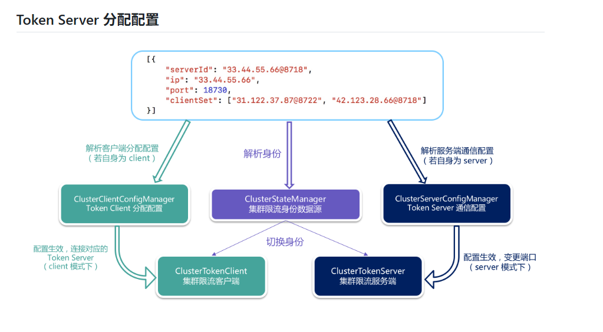

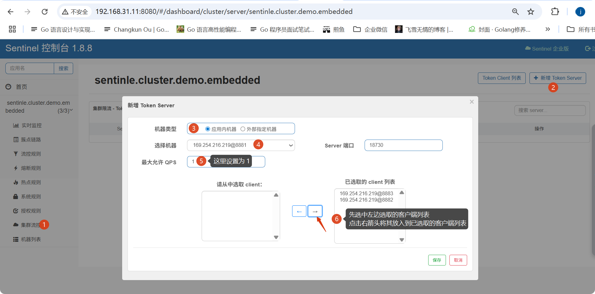

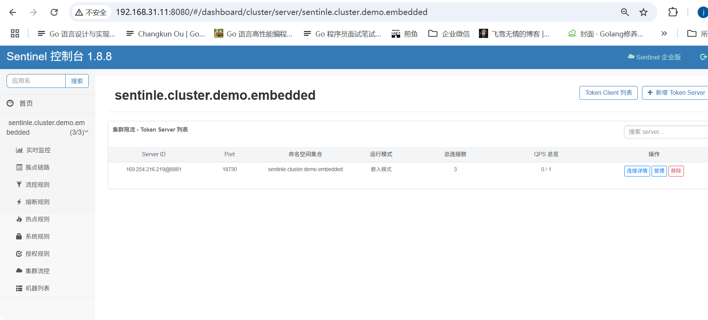

我们可以随意选择一个服务作为 Token Server，另外两台作为 Token Client。接着，我们新建一个集群规则：集群 QPS 阈值为 1，这也就意味着我们三台服务加起来的 QPS 为 1，也就是说整个集群内 1s 只能访问一次。

配置如下图所示：

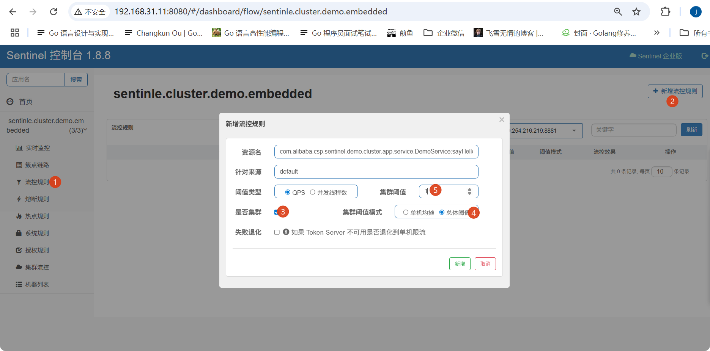

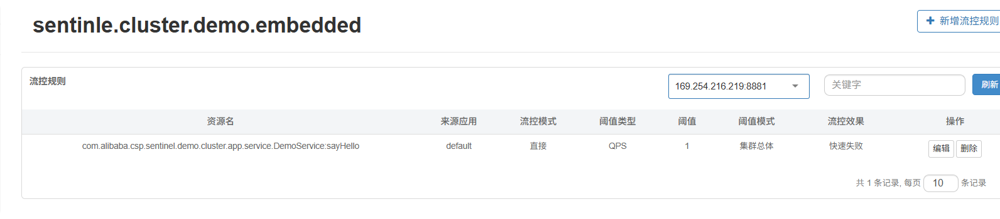

至此，我们就完成了集群限流的实战，希望大家能够自己动手一步步操作下。这里大家可能对集群流控的原理有点模糊，尤其是添加 Token Server 和 Token Client 的时候，我们先将官网的描述贴到下面，其底层源码我们到后面源码篇还会深度剖析。

1.  Token Client：集群流控客户端，用于向所属 Token Server 通信请求 token。集群限流服务端会返回给客户端结果，决定是否限流。
2.  Token Server：即集群流控服务端，处理来自 Token Client 的请求，根据配置的集群规则判断是否应该发放 token（是否允许通过）。

通俗解释：想象你进入一个豪华酒店，门口有一个安保人员（Token Server），他负责确保只有持有酒店通行证的人才能进入。你拿出你的酒店房卡（Token Client），安保人员检查后，如果一切正常，他会放行，然后你可以自由地进入酒店。在这里，Token Server 就是安保人员，Token Client 就是你的房卡，它们一起保障了你进入酒店的合法性和安全性。

因此，Token Server 可以被看作是一个独立部署的服务，它负责维护令牌（Tokens），并对 Token Clients（业务系统）提供身份验证和访问控制服务。Token Server 通常拥有资源的访问权限信息和令牌生成逻辑，而 Token Clients 则通过向 Token Server 发送请求并提供令牌来验证身份并获得访问权限。

所以，我们的 QPS 限制数等都交由统一一个 Token Server 去维护了，而不是散落在各个业务系统的服务器上，这就是实现集群流控的核心之一，相当于找了一个中介负责维护各个项目的令牌，没达到阈值就发令牌，达到阈值了就不给令牌，令牌在一个中介所单独维护。

上面提到 Token Server 可以被看作是一个独立部署的服务，但是我们演示的时候好像并没有独立部署，是内嵌到业务系统当中的呢。确实如此，Sentinel 的集群流控 Token Server 可以支持单独部署也可以内嵌到业务系统当中随着业务系统一起部署，我们这里演示的方式是内嵌方式，独立部署方式也很简单，无非就是写一段程序将 Token Server 启动起来，然后作为一个项目独立部署，里面不夹杂业务代码。针对独立部署的方式官网也提供了一个 Demo: [https://github.com/alibaba/Sentinel/blob/master/sentinel-demo/sentinel-demo-cluster/sentinel-demo-cluster-server-alone/src/main/java/com/alibaba/csp/sentinel/demo/cluster/ClusterServerDemo.java](https://github.com/alibaba/Sentinel/blob/master/sentinel-demo/sentinel-demo-cluster/sentinel-demo-cluster-server-alone/src/main/java/com/alibaba/csp/sentinel/demo/cluster/ClusterServerDemo.java)。

## **3.12 Sentinel DashBoard 总结**

总的来说，Sentinel Dashboard 是一个功能强大的可视化管理和监控平台，它针对分布式系统提供了一系列实用的工具和功能。通过 Sentinel Dashboard，开发者和运维人员可以轻松地管理流控规则、熔断降级规则、系统规则、热点参数限流规则、授权规则以及集群流控规则等，实现对分布式系统中各种资源的精细化管理和保护。

Sentinel Dashboard 还提供了实时监控和统计功能，使得开发者和运维人员能够实时了解系统的运行状态，识别系统中的瓶颈和潜在问题。通过簇点链路和机器列表等功能，可以更好地分析调用链路和资源之间的关系，进而优化系统性能。

综上，Sentinel Dashboard 是一个对分布式系统进行有效管理和保护的必备工具，通过它，我们可以确保系统的稳定性和可用性，为业务发展提供强大的支撑。