从今天之后的一段时间内，华仔会带着大家一起从零开始搭建并研发一套高并发的电商实战项目，这里会涉及到很多互联网大厂开发过程中所使用的核心技术和架构设计模式，希望大家学完之后可以用到自己的简历中。

接下来我们会重点架构设计和开发一下我们高并发电商实战项目中的「**商品中心服务**」。

这是第四十六篇，本篇我们继续进行电商实战项目设计与开发，本篇将进行「**商品中心服务**」千万级商品数据全量同步 ES 性能优化。

文章汇总位置：[https://wx.zsxq.com/dweb2/index/columns/51122554151214](https://wx.zsxq.com/dweb2/index/columns/51122554151214)

源码授权与获取地址：[https://articles.zsxq.com/id\_1s85grnaae4p.html](https://articles.zsxq.com/id_1s85grnaae4p.html)

本章源码地址：[https://gitcode.net/u011359591/huazai-ecshop/-/tree/ecshop-chapter-46](https://gitcode.net/u011359591/huazai-ecshop/-/tree/ecshop-chapter-46)

## **01 前言**

终于要设计与研发电商项目代码了，今天我们主要对「**商品中心服务**」 千万级商品数据全量同步 ES 性能优化。

这里需要注意下，我们整个项目目前是不提供前端的，这个后续有时间在搞，主要是进行后端接口以及微服务模块架构设计。

## **02 千万级商品数据全量同步 ES**

在测试千万级商品数据全量同步 ES 前，我们需要生成 1000w 条商品数据，这里是基于之前的 10w 数据随机生成 1000w 数据，数据不好造，都是 mock 数据就暂时不管数据重复了。

## **2.1 生成千万级商品 mock 数据**

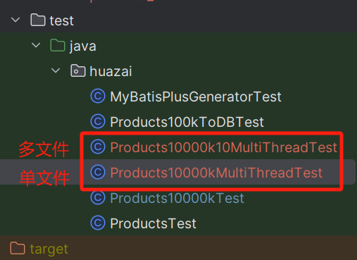

主要有两个：

1.  生成单文件 1000w，总共 1.3G。
2.  生成多文件，每个文件 100 w，占用约 100M，总共 1.3 G。

这里只看下生成多文件这部分的代码：

public class Products10000k10MultiThreadTest {

public static void main(String\[\] args) {

// 输入文件路径 基于这个文件生成千万商品 mock 数据

String inputFilePath \= "products\_100k.txt";

int targetLineCount \= 10000000; // 目标行数

int threadCount \= 30; // 线程数

log.info("Products10000k10MultiThreadTest threadCount:{}", threadCount);

InputStream resourceAsStream \= Products10000kTest.class.getClassLoader().getResourceAsStream(inputFilePath);

InputStreamReader inputStreamReader \= new InputStreamReader(resourceAsStream);

// 记录开始执行时间

long startTime \= System.currentTimeMillis();

try (BufferedReader reader \= new BufferedReader(inputStreamReader)) {

String line;

List<String> column2Values = new ArrayList<>();

Map<String, List<String>> otherColumnsMap = new ConcurrentHashMap<>();

// 第一次读取文件，提取下标 2 的值和其他列的值

while ((line = reader.readLine()) != null) {

String\[\] fields = line.split(",");

if (fields.length >= 4) {

String column2Value \= fields\[2\];

column2Values.add(column2Value);

String key \= fields\[0\] + "," + fields\[1\] + "," + fields\[3\];

otherColumnsMap.putIfAbsent(key, new CopyOnWriteArrayList<>());

otherColumnsMap.get(key).add(column2Value);

}

}

Collections.shuffle(column2Values, ThreadLocalRandom.current());

ExecutorService executorService \= Executors.newFixedThreadPool(threadCount);

List<Future<?>> futures = new ArrayList<>();

int batchSize \= 1000000; // 每个文件的数据量

int fileCount \= (targetLineCount + batchSize - 1) / batchSize; // 文件数量

for (int fileIndex \= 0; fileIndex < fileCount; fileIndex++) {

final int index \= fileIndex;

Future<?> future = executorService.submit(() -> {

String outputFilePath \= "products\_10000k\_" + (index + 1) + ".txt";

try (BufferedWriter writer \= new BufferedWriter(new FileWriter(outputFilePath))) {

for (int i \= 0; i < batchSize && (index \* batchSize + i) < targetLineCount; i++) {

if ((index \* batchSize + i) % 10000 == 0) {

System.out.println("Generating line " + (index \* batchSize + i));

}

String randomColumn2Value \= column2Values.get(ThreadLocalRandom.current().nextInt(column2Values.size()));

List<String> otherColumnsKeys = new ArrayList<>(otherColumnsMap.keySet());

Collections.shuffle(otherColumnsKeys, ThreadLocalRandom.current());

String randomKey \= otherColumnsKeys.get(ThreadLocalRandom.current().nextInt(otherColumnsKeys.size()));

String\[\] otherColumnsParts = randomKey.split(",");

String part0 \= String.valueOf(index \* batchSize + i);

String part1 \= otherColumnsParts\[1\];

String part3 \= otherColumnsParts\[2\];

String newLine \= part0 + "," + part1 + "," + randomColumn2Value + "," + part3;

log.info("第{}文件正在写入， newLine:{}", index + 1, newLine);

writer.write(newLine);

writer.newLine();

}

} catch (IOException e) {

e.printStackTrace();

}

});

futures.add(future);

}

for (Future<?> future : futures) {

try {

future.get();

} catch (InterruptedException | ExecutionException e) {

e.printStackTrace();

}

}

executorService.shutdown();

long endTime \= System.currentTimeMillis();

long elapsedSeconds \= (endTime - startTime) / 1000;

long perSecond \= elapsedSeconds > 0 ? targetLineCount / elapsedSeconds : targetLineCount;

log.info("本次共生成\[{}\]条商品数据，耗时\[{}\]秒，平均每秒生成\[{}\]条数据", targetLineCount, elapsedSeconds, perSecond);

} catch (IOException e) {

throw new RuntimeException(e);

}

}

}

效果：

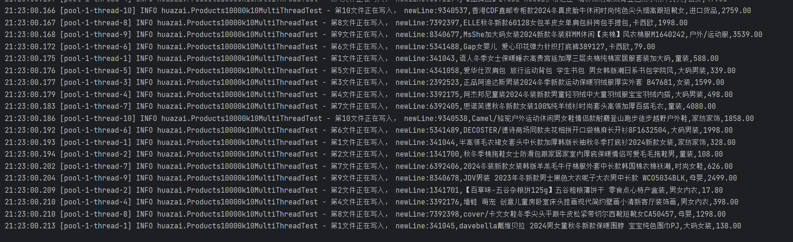

文件目录效果，每个文件大概 100 M， 100 万数据：

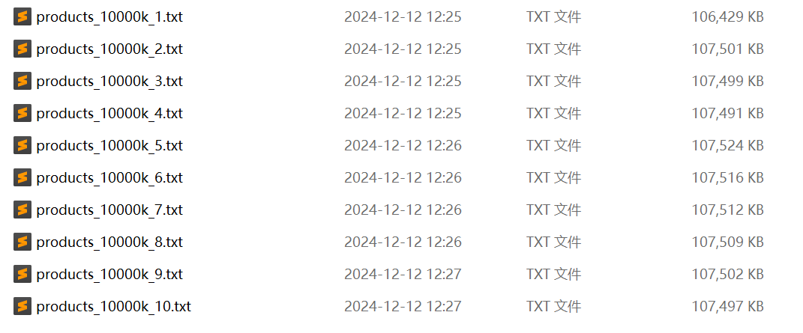

文件比较大，就不提交到代码仓库了，需要的自行百度网盘下载，然后放到这个目录下：

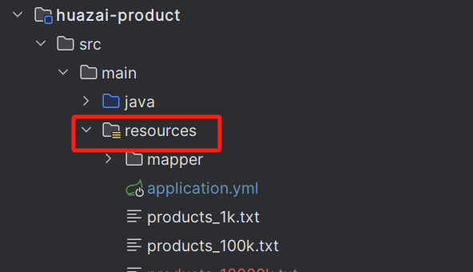

通过网盘分享的文件：商品数据文件

链接: https://pan.baidu.com/s/1Cfj1eeELHnnM9gR6rVN-Yg?pwd\=k5kx 提取码: k5kx

\--来自百度网盘超级会员v9的分享

也可以扫码保存下载：

## **2.2 千万级商品数据同步 ES**

为了测试过程简化，这里就不将这 1000w 数据写入到数据库中，直接从文件中同步到 ES 中。

目前是在我本地测试，此图 CPU 100% 是正在生成这 1000w 条商品数据，内存也快占满。

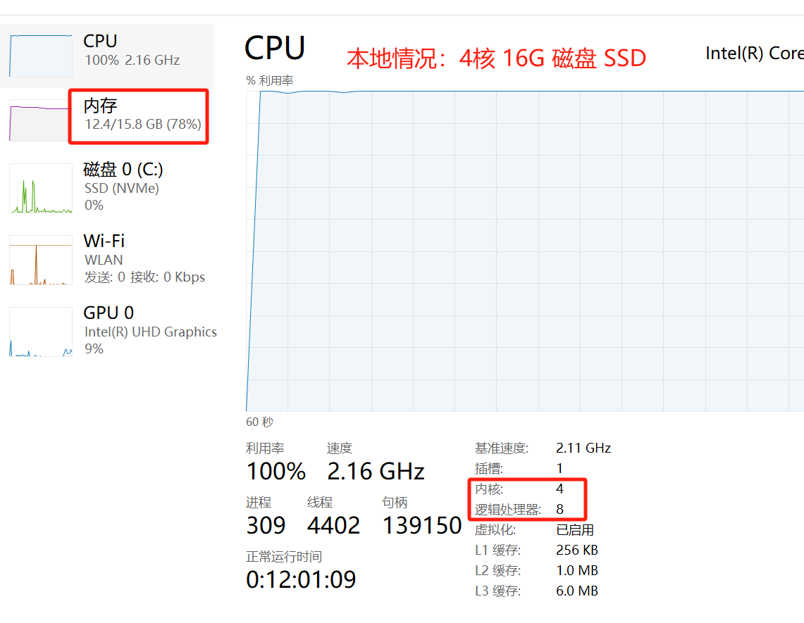

等生成完这1000w商品数据空闲下来后，我们再来通过「**多线程**」+ 「**ES bulk 请求**」测试批量写入 ES 的性能。

我们会通过两种方式来测试：

1.  30 个线程批量导入 1000w 商品数据。
2.  60 个线程批量导入 1000w 商品数据。

> 注意：这里测试就不用从数据库分页拉取导入 ES 了，会比文件慢一个数量级，后面有空的话可以搞一下。

### **2.2.1 30个线程批量导入 1000w 商品数据**

这里以每批 1000 条（本地测试单 bulk 超过1000条就写入失败了），总计执行 10000 次，30 个线程来从已经生成好的 10 个商品源数据文件中拉取并通过 bulk 请求批量导入到 ES，代码如下：

/\*\*

\* 多线程批量从数据库导入商品 SkU 到 es sku 索引中

\* 官方地址：https://www.elastic.co/guide/en/elasticsearch/client/java-rest/7.17/java-rest-high-document-bulk.html

\* @param multiThreadImportEntity

\* @return

\* @throws IOException

\* @throws InterruptedException

\*/

@Override

public Map<String, Object> importProductDatasSkuIndex1000W(MultiThreadImportDoubleIndexEntity multiThreadImportEntity) throws IOException, InterruptedException {

// 获取 es sku 索引

String indexName \= multiThreadImportEntity.getIndexName();

// 获取插入次数

int batchTimes \= multiThreadImportEntity.getBatchTimes();

// 获取批次大小

int batchSize \= multiThreadImportEntity.getBatchSize();

// 获取线程数

int threadCount \= multiThreadImportEntity.getThreadCount();

// 每个文件包含100万条数据

int recordsPerFile \= 1000000;

// 总共10个文件

int numberOfFiles \= 10;

/\*\*

\* 这里使用 CountDownLatch 来倒计数

\* 当一个线程完成之后进行countDown，当所有线程都完成了以后才算真正结束

\*/

CountDownLatch countDownLatch \= new CountDownLatch(batchTimes);

/\*\*

\* 这里使用 semaphore 信号量，一个线程可以尝试从 semaphore 获取一个信号，如果获取不到就阻塞等待，

\* 获取到并用完该信号之后，就可以把信号还回去，本实例最多就只有 threadCount 个线程去获取到信号量

\*/

Semaphore semaphore \= new Semaphore(threadCount);

/\*\*

\* 这里使用 SynchronousQueue 队列，可能会出现比 semaphore 多需要线程的情况，这里 maximumPoolSize 设置为 threadCount \* 2，实际不会超过该值

\*/

ThreadPoolExecutor threadPoolExecutor \= new ThreadPoolExecutor(threadCount, threadCount \* 2,

60, TimeUnit.SECONDS, new SynchronousQueue<>());

// 记录开始执行时间

long startTime \= System.currentTimeMillis();

// 1、每次会随机取出 batchSize 个商品数据，然后批量插入，一共执行 batchTimes 次写入 es 操作

for (int i \= 0; i < batchTimes; i++) {

// 保证一直有 threadCount 个线程同时在执行批量插入的操作,获取到信号量就执行批量插入，否则就等待有空余信号量

semaphore.acquireUninterruptibly();

// 创建一个局部变量来保存当前的i值

int currentIndex \= i;

// 计算文件 index

int currentIndex2 \= i \* batchSize;

// 计算当前批次属于哪个文件

int fileIndex \= ((currentIndex2 / recordsPerFile) % numberOfFiles) + 1;

// log.info("importProductDatasSkuIndex1000W currentIndex:{},currentIndex2:{},fileIndex={}", currentIndex, currentIndex2,fileIndex);

// 提交线程池进行执行

threadPoolExecutor.submit(() -> {

try {

log.info("importProductDatasSkuIndex1000W currentIndex:{},currentIndex2:{},fileIndex={}", currentIndex, currentIndex2,fileIndex);

// 2、分批从计算好的文件中获取商品 mock 数据,每批 10000 条

List<Map<String, Object>> skuList = loadBatchProductSkusFromFile(fileIndex, currentIndex, batchSize);

// 构建 sku bulk 批次请求

BulkRequest bulkRequest \= buildSkuEsBulkRequest1000w(indexName, currentIndex, batchSize, skuList);

// 发送 sku bulk 导入请求

BulkResponse responses \= restHighLevelClient.bulk(bulkRequest, RequestOptions.DEFAULT);

log.info("importProductDatasSkuIndex1000W 本次导入\[{}\]条商品数据,请求\[{}\],响应结果\[{}\]", batchSize, bulkRequest, responses);

if (responses.hasFailures()) {

for (BulkItemResponse itemResponse : responses) {

if (itemResponse.isFailed()) {

BulkItemResponse.Failure failure \= itemResponse.getFailure();

System.err.println(failure.getMessage());

log.error("importProductDatasSkuIndex1000W 本次导入出现异常\[{}\]", failure.getMessage());

}

}

}

} catch (IOException e) {

e.printStackTrace();

} catch (URISyntaxException e) {

throw new RuntimeException(e);

} finally {

// 释放信号量

semaphore.release();

// 进行倒计数

countDownLatch.countDown();

}

});

}

// 记录结束执行时间

long endTime \= System.currentTimeMillis();

// 需要等待最后一个批次的批量插入操作执行完成

countDownLatch.await();

// 手动关闭线程池

threadPoolExecutor.shutdown();

// 3、统计信息

int totalCount \= batchSize \* batchTimes;

// 记录执行消耗时间

long elapsedSeconds \= (endTime - startTime) / 1000;

// 记录平均每秒导入条数

long perSecond \= elapsedSeconds > 0 ? totalCount / elapsedSeconds : totalCount;

log.info("importProductDatasSkuIndex1000W 本次共导入\[{}\]条商品数据，耗时\[{}\]秒，平均每秒导入\[{}\]条数据", totalCount, elapsedSeconds, perSecond);

Map<String, Object> result = new LinkedHashMap<>();

result.put("totalCount", totalCount);

result.put("elapsedSeconds", elapsedSeconds);

result.put("perSecond", perSecond);

return result;

}

/\*\*

\* 从 txt 文件里面分批加载加载 1000w 条商品 mock 数据，每批次 10000

\* 通过内存映射的方式读取

\* @param fileIndex

\* @param startIndex

\* @param batchSize

\* @return

\* @throws IOException

\*/

public List<Map<String, Object>> loadBatchProductSkusFromFile(int fileIndex, int startIndex, int batchSize) throws IOException, URISyntaxException {

// 每个文件包含100万条数据

int recordsPerFile \= 1000000;

// 计算读取偏移量

long globalOffset \= (long) startIndex \* batchSize;

// 计算文件偏移量

long fileOffset \= globalOffset % recordsPerFile;

// 根据文件索引构建文件名

String productFileNameNum \= "products\_10000k\_"+(fileIndex == 0 ? 1 : fileIndex)+".txt";

log.info("loadBatchProductSkusFromFile1000w 开始加载，fileIndex={}, startIndex={}, productFileNameNum={}", fileIndex, startIndex, productFileNameNum);

// 获取文件的URL

URL resourceUrl \= getClass().getClassLoader().getResource(productFileNameNum);

if (resourceUrl == null) {

throw new IllegalArgumentException("File not found: " + productFileNameNum);

}

// 将URL转换为文件路径

File file \= Paths.get(resourceUrl.toURI()).toFile();

log.info("loadBatchProductSkusFromFile1000w 准备加载，startIndex={}, batchSize={}, resourceUrl={}, file={}", startIndex, batchSize, resourceUrl, file);

try (RandomAccessFile randomAccessFile \= new RandomAccessFile(file, "r");

FileChannel fileChannel \= randomAccessFile.getChannel()) {

try {

MappedByteBuffer mappedByteBuffer \= fileChannel.map(FileChannel.MapMode.READ\_ONLY, 0, fileChannel.size());

// 跳过前面的行

for (int i \= 0; i < fileOffset; i++) {

while (mappedByteBuffer.hasRemaining()) {

if (mappedByteBuffer.get() == '\\n') {

break;

}

}

// log.info("loadBatchProductSkusFromFile1000w Skipped {} lines", i + 1);

}

// 初始化批次

List<Map<String, Object>> batch = new ArrayList<>(batchSize);

//log.info("loadBatchProductSkusFromFile 加载完成，startIndex={}, batchSize={}, file={}, mappedByteBuffer={}", startIndex, batchSize, file, mappedByteBuffer);

byte\[\] buffer = new byte\[1024\];

// 使用 ByteBuffer 的 asCharBuffer 方法来获取 CharBuffer，然后读取字符串

StringBuilder lineBuilder \= new StringBuilder();

// 读取指定数量的行,循环判断是否读完

int linesRead \= 0;

while (mappedByteBuffer.hasRemaining() && linesRead < batchSize) {

byte b \= mappedByteBuffer.get();

if (b == '\\n') {

// 转换编码

String line \= new String(lineBuilder.toString().getBytes(StandardCharsets.ISO\_8859\_1), StandardCharsets.UTF\_8);

// 解析每行数据元素

String\[\] segments = line.split(",");

// 处理商品数据

Map<String, Object> sku = parseSku(segments);

// log.info("loadBatchProductSkusFromFile1000w 处理数据中 sku:{}", sku);

// 追加到批次中

batch.add(sku);

// 行号计数器

linesRead++;

// 重置

lineBuilder.setLength(0);

} else {

buffer\[0\] = b;

// 追加

lineBuilder.append(new String(buffer, 0, 1, StandardCharsets.ISO\_8859\_1));

}

}

log.info("loadBatchProductSkusFromFile1000w Read {} records from file {}", batch.size(), productFileNameNum);

return batch;

} finally {

}

}

}

/\*\*

\* 处理 sku 数据

\* @param segments

\* @return

\*/

private Map<String, Object> parseSku(String\[\] segments) {

// es 索引中 10 个商品字段

Map<String, Object> sku = new HashMap<>();

// 第一个索引为商品 id

int id \= Integer.parseInt(segments\[0\]);

// 第二个索引为商品名称

String skuName \= segments\[1\];

// 第三个索引为商品分类

String category \= segments\[2\];

// 第四个索引为商品原价格

int basePrice \= Integer.parseInt(segments\[3\].substring(0, segments\[3\].indexOf(".")));

sku.put("skuId", id);

sku.put("skuName", skuName);

sku.put("skuNameCompletion", skuName);

sku.put("category", category);

sku.put("basePrice", basePrice);

if (basePrice <= 100) {

sku.put("basePrice", 200);

}

sku.put("vipPrice", basePrice - CommonUtil.genRandomInt(50, 100));

// 图片这里就固定一个就行了，对于搜索来说用处不大

sku.put("mainUrl", "http://img12.360buyimg.com/n1/s450x450\_jfs/t1/198920/1/50667/47720/6736c429Fc2f747c8/4cadbe7a136fdb39.jpg.avif");

sku.put("skuStatus", 1);

// 创建一个 Date 对象和 SimpleDateFormat 对象并指定转换格式， 使用 SimpleDateFormat 对象的 format() 方法将 Date 对象转换为指定格式的字符串

sku.put("createTime", new SimpleDateFormat("yyyy-MM-dd HH:mm:ss").format(new Date()));

sku.put("updateTime", new SimpleDateFormat("yyyy-MM-dd HH:mm:ss").format(new Date()));

return sku;

}

这块代码之前 10 w数据（10M左右）可以通过 [BufferedReader](http://bufferedreader/) 一行行读，现在单文件百万数据（100M+）还是通过 [BufferedReader](http://bufferedreader/) 一行行读很卡，半天没反应。所以这里通过「**内存映射**」的方式进行大文件读取的很快，几乎不卡。

由于本地「**I/O**」以及「**内存**」影响，效果不明显，千万级数据 30 个线程批量导入花了 1 小时，整个过程中包括「**磁盘文件读取时间**」、「**商品数据组装时间**」、「**bulk 请求构建时间**」、「**bulk 请求 ES 处理时间**」等。

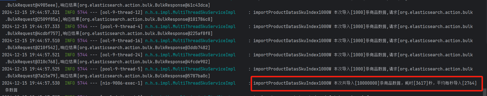

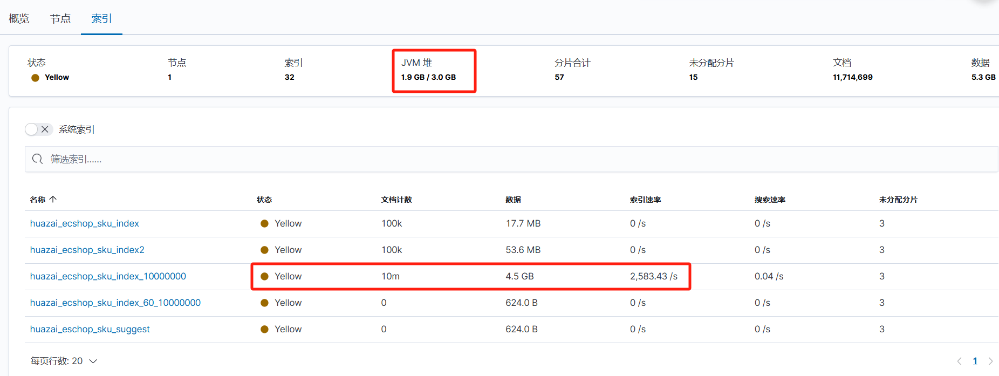

### **2.2.2 60个线程批量导入 1000w 商品数据**

这里以每批 1000 条（本地测试单 bulk 超过1000条就写入失败了），总计执行 10000 次，60 个线程来从已经生成好的 10 个商品源数据文件中拉取并通过 bulk 请求批量导入到 ES，代码同上。只不过这里线程数不一样。

30 个线程本地效果不理想，同样的代码，我们来看看 60 个线程怎么样？

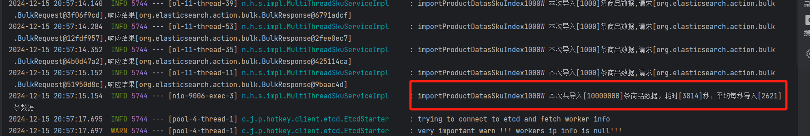

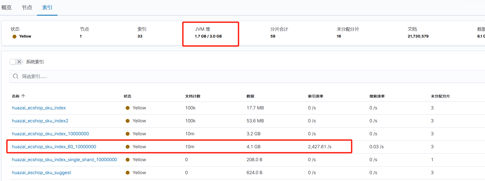

通过结果来看，还不如 30个线程，看来随着线程数的增加，并没有带来多少改善。

下面我们通过性能调优来看看有没有什么改进。

## **2.3 千万级商品数据全量同步 ES 性能优化**

我们来看看 ES 写入的全过程，然后再剖析哪个缓环节可以进行调整和优化。

### **2.3.1 数据写入路由机制**

数据写入路由机制：

1.  索引是分片设计，路由选择写入到哪个分片。
2.  优先会写入到主分片，然后再写入到副本分片。
3.  路由计算默认基于数据 ID 来进行的，也可以自己指定。

如图所示：

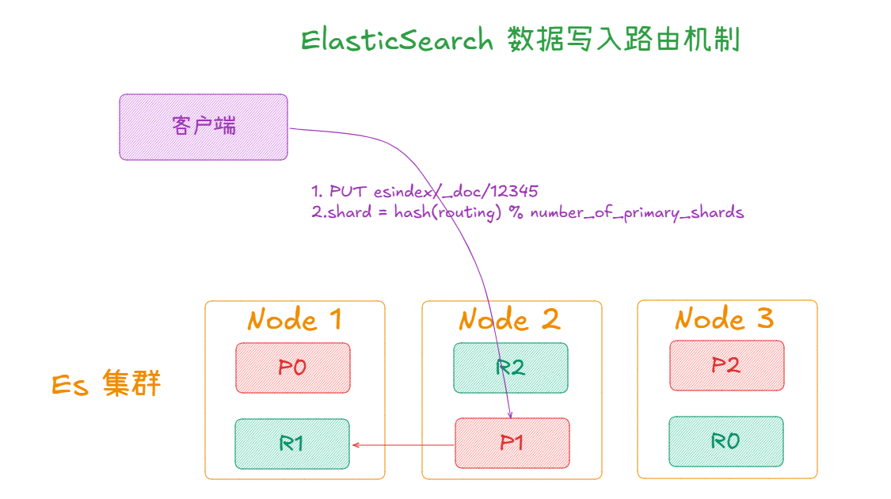

其中 P0、P1、P2 都是「**主副本分片**」，R0、R1、R2 都是「**副本分片**」。可以看到一个请求进来会先写入到「**主副本分片**」中，然后再同步到「**副本分片**」中。

以前的 ES 版本需要写入「**所有的副本分片**」才算成功，后来从 7.0 新版本做了调整，写入「**主副本分片**」就可以算成功了。

### **2.3.2 数据写入处理逻辑**

这里我们来简单了解下 ES 数据写入的底层大体处理逻辑：

1.  首先数据会写入到「**内存 buffer**」中，这个「**内存 buffer**」是在「**JVM 堆里面**」，然后再写入「**translog 日志文件**」中。
2.  当「**内存 buffer**」达到一定数量级/每秒会做「**refresh**」操作，刷到操作系统的「**PageCache Segment**」中，会定期「**flush**」到磁盘中的「**Segment 分段文件**」。
3.  然后再将「**Segment 分段文件**」加载到操作系统的 「**PageCache Segment**」，此时就可以进行搜索了。
4.  最后「**translog 日志文件**」早期是通过「**异步刷盘**」的，新版本支持调整为「**同步刷盘**」了。

如图所示：

  
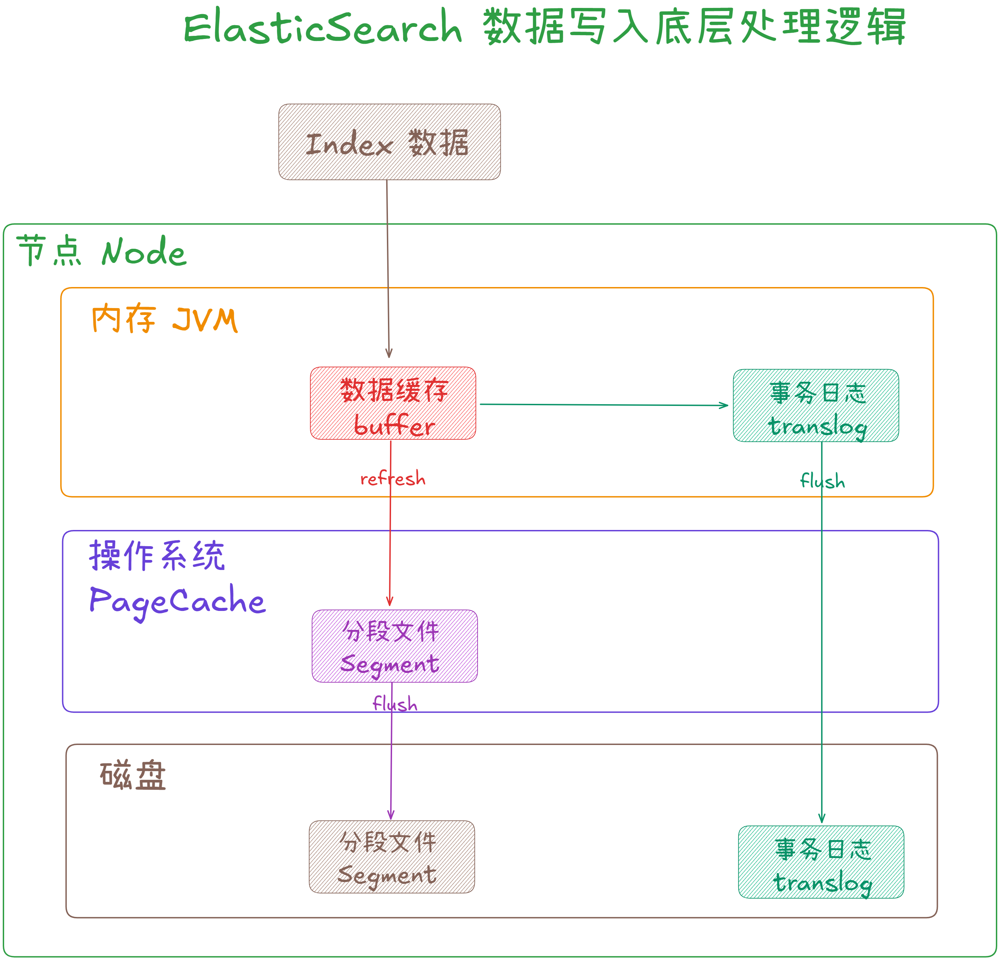

### **2.3.3 数据写入性能调优**

了解了 ES 写入大概实现原理之后，我们来看看都有哪些环节可以进行调优的。

### **2.3.3.1 refresh\_interval (支持动态调整)**

官方文档地址：[https://www.elastic.co/guide/en/elasticsearch/reference/7.9/index-modules.html](https://www.elastic.co/guide/en/elasticsearch/reference/7.9/index-modules.html)

在批量导入数据的场景下，对于「**写入后 1s 就能搜索到**」的要求没那么高的话，可以将该值调大一些，比如：[index.refresh\_interval=30s、60s、120s](http://index.xn--refresh_interval=30s60s120s-n81zda/) 等。调整后可以减少频繁的 refresh 及频繁的 lucene 段合并操作。

  

###   
**2.3.3.2 number\_of\_replicas (支持动态调整)**

官方文档地址：[https://www.elastic.co/guide/en/elasticsearch/reference/7.9/index-modules.html](https://www.elastic.co/guide/en/elasticsearch/reference/7.9/index-modules.html)

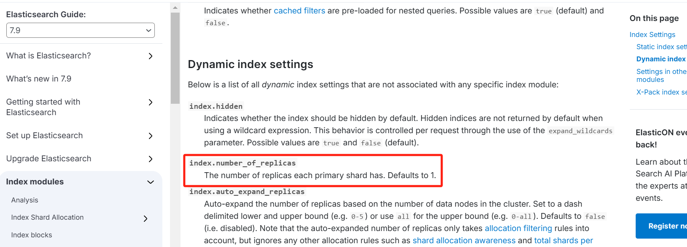

ES 的副本数是支持动态调整的，写入数据的时候可以先把副本数设置为 0，缩短数据写入的流程。等批量导入完成后，重新设置副本数。

### **2.3.3.3 index\_buffer\_size**

官方文档：[https://www.elastic.co/guide/en/elasticsearch/reference/7.9/indexing-buffer.html](https://www.elastic.co/guide/en/elasticsearch/reference/7.9/indexing-buffer.html)

该配置需要在 [elasticsearch.yml](http://elasticsearch.yml/) 配置文件中修改。

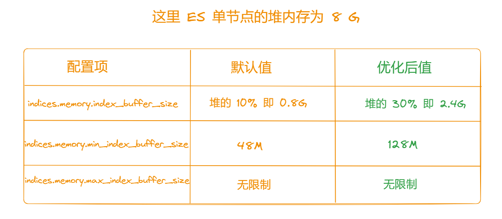

这里我本地给 ES JVM 是 3G，也就是堆内存调整后为 1G 左右。

[indices.memory.index\_buffer\_size](http://indices.memory.index_buffer_size/) 和 [indices.memory.min\_index\_buffer\_size](http://indices.memory.min_index_buffer_size/) 是 ES 中用于控制内存分配的两个重要参数，它们对索引性能有显著影响。

### **1、indices.memory.index\_buffer\_size**

作用：

1.  此参数定义了用于索引操作的内存缓冲区的大小。
2.  索引缓冲区主要用于存储倒排索引数据和临时数据结构，在执行索引和合并操作时使用。

其默认值：ES 会根据可用堆内存自动计算并设置此值，通常是堆内存的 10%。

调优建议：

1.  如果是写密集型的，可以考虑增加此值以提高索引速度。
2.  如果是读密集型的，可以适当减少此值以释放更多内存给搜索操作。
3.  通常建议将其设置为堆内存的 10% 到 30% 之间，具体取决于你的硬件资源和应用场景。

### **2、indices.memory.min.index\_buffer\_size**

作用：

1.  此参数定义了索引缓冲区的最小大小。
2.  即使在内存紧张的情况下，Elasticsearch 也会保证至少有这么多内存分配给索引缓冲区。

其 默认值为 128MB。

调优建议：

1.  如果你的集群节点拥有大量内存，并且索引操作非常频繁，可以考虑增加此值以确保有足够的内存用于索引操作。
2.  如果你的集群节点内存有限，或者主要进行搜索操作，可以适当减少此值以节省内存资源。

### **3、如何调优**

调优这两个参数时，需要考虑以下因素：

1.  硬件资源：节点的总内存大小，以及用来 Elasticsearch 的堆内存大小。
2.  工作负载：索引操作的频率和规模，以及搜索操作的频率和规模。
3.  性能目标：期望的索引速度和搜索性能。

假设你的节点总内存为 64GB，堆内存设置为 24GB，以下是一个可能的调优配置：

indices.memory.index\_buffer\_size: 30%

indices.memory.min\_index\_buffer\_size: 256mb

在这个配置中：

1.  indices.memory.index\_buffer\_size 设置为堆内存的 30%，即 7.2GB，适用于写密集型工作负载。
2.  indices.memory.min\_index\_buffer\_size 设置为 256MB，确保即使在内存紧张的情况下也有足够的内存用于索引操作。

### **4、监控与调整**

在调整这些参数后，务必监控集群的性能指标，如索引速度、搜索延迟和内存使用情况。根据实际表现进一步微调参数，以达到最佳性能，提高整体集群效率。

### **2.3.3.4 translog 事务日志**

官方文档地址：[https://www.elastic.co/guide/en/elasticsearch/reference/7.9/index-modules-translog.html](https://www.elastic.co/guide/en/elasticsearch/reference/7.9/index-modules-translog.html)

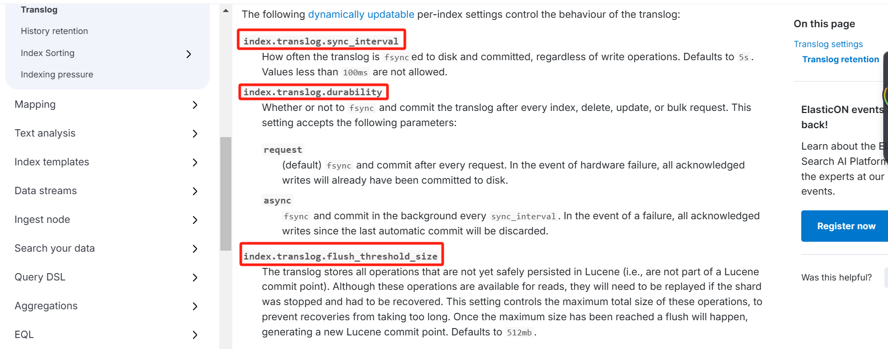

官方的优化写入速度的文档里面没说这个，但是也可以进行调整，注意：这个参数调整后可能会导致丢失数据。

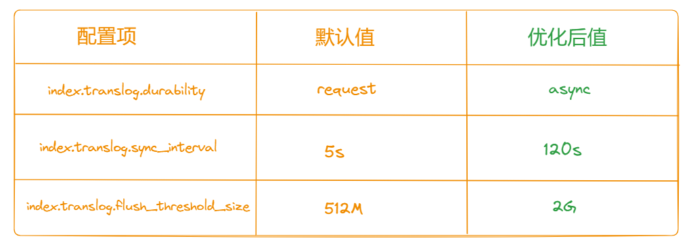

其中 [flush\_threshold\_size](http://flush_threshold_size/) 是一个在 ES 中与索引刷新（refresh）操作相关的参数。其主要作用是控制索引数据何时被刷新到磁盘，从而使得数据能够被搜索到。

  
在 Elasticsearch 的默认配置中，[flush\_threshold\_size](http://flush_threshold_size%20/) 通常设置为 512MB。

其作用：

1.  控制刷新频率：
2.  当索引中的新数据达到或超过 flush\_threshold\_size 设置的字节数时，会触发一次刷新操作。
3.  平衡性能和实时性：
4.  较小的阈值可以提高数据的实时性，但会增加 I/O 操作和系统负载。
5.  较大的阈值可以减少不必要的刷新，提升写入性能，但可能会延迟数据的可见性。
6.  防止过度刷新：
7.  避免因频繁的小批量写入而导致频繁的磁盘刷新，这样有助于维持稳定的写入吞吐量。

  
注意事项:

1.  调整此参数时应综合考虑业务需求、硬件资源和性能测试结果。
2.  过低的值可能导致过多的 I/O 操作影响整体性能；而过高的值则可能延迟数据的搜索可见性。

### **2.3.3.5 准备工作**

### **1、修改 ES 配置参数**

该配置需要在 [elasticsearch.yml](http://elasticsearch.yml/) 配置文件中修改。

\# 写入优化参数

indices.memory.index\_buffer\_size: 30%

indices.memory.min\_index\_buffer\_size: 128m

改完配置后需要进行重启。

\# 杀掉 es 进程

ps -ef|grep es

kill -9 xxx

\# 启动 es

cd /home/es/elasticsearch-7.9.3/bin && ./elasticsearch -d

### **2、index module 级别配置需要在创建索引时配置**

官方文档地址：[https://www.elastic.co/guide/en/elasticsearch/reference/7.9/indices-update-settings.html](https://www.elastic.co/guide/en/elasticsearch/reference/7.9/indices-update-settings.html)

PUT /huazai\_ecshop\_sku\_index\_single\_shard\_10000000

{

"settings":{

"number\_of\_shards" : 1,

"number\_of\_replicas":0,

"index.refresh\_interval":"120s",

"index.translog.durability":"async",

"index.translog.sync\_interval":"120s",

"index.translog.flush\_threshold\_size":"2048mb"

},

"mappings":{

"properties":{

"skuId": {

"type" :"integer"

},

"skuName" : {

"type" : "text",

"analyzer": "ik\_max\_word",

"search\_analyzer":"ik\_smart"

},

"skuNameCompletion": {

"type": "completion"

},

"category":{

"type" :"keyword"

},

"brand":{

"type" :"keyword"

},

"price":{

"type":"integer"

},

"vipPrice":{

"type":"integer"

},

"mainUrl" :{

"type":"keyword",

"index": false

},

"skuStatus" : {

"type":"integer"

},

"createTime":{

"type": "date",

"format": "yyyy-MM-dd HH:mm:ss"

},

"updateTime":{

"type": "date",

"format": "yyyy-MM-dd HH:mm:ss"

}

}

}

}

### **2.3.3.6 调整后千万级数据量性能测试**

重启 ES 后，我们来测试下调整后的效果。

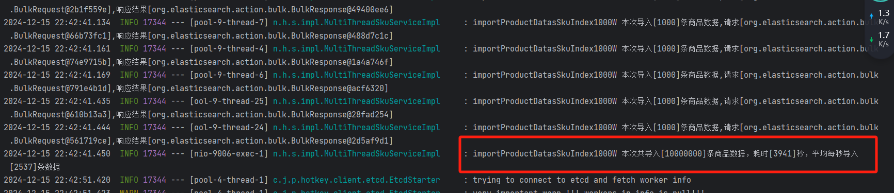

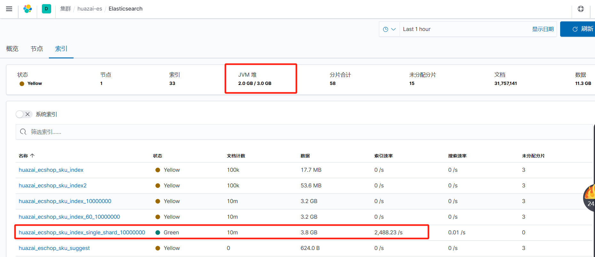

从测试效果来看，并没有什么提升，平均每秒处理速度在 2500+。

又进行了调整如下：

这里从 128 M调大为 256 M，从测试结果看快了 10%，每秒可以 3000+。

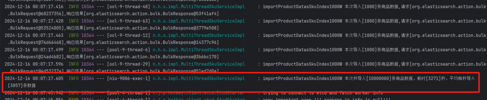

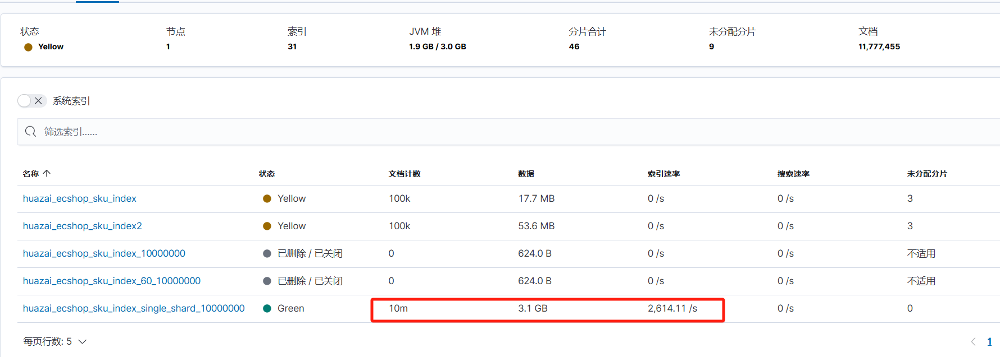

后续我们再来进行调试后压测，这里就先这样。看来本地就这性能了。