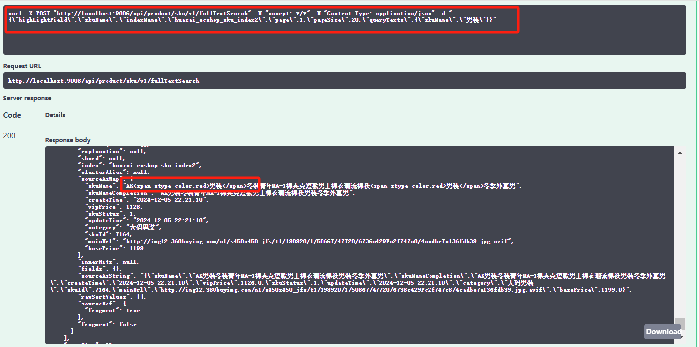
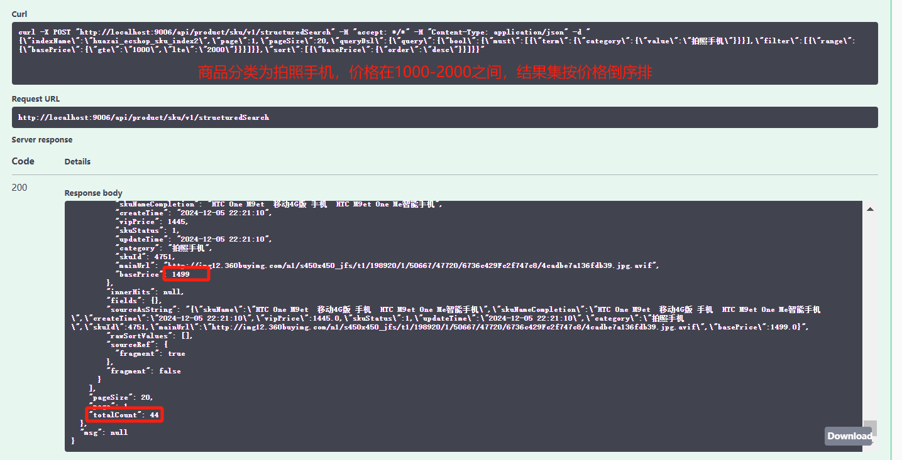
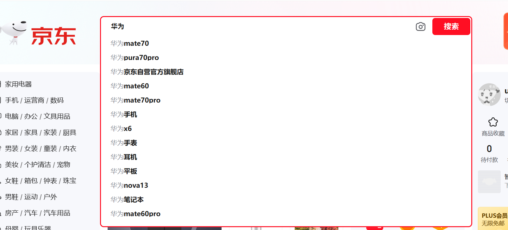
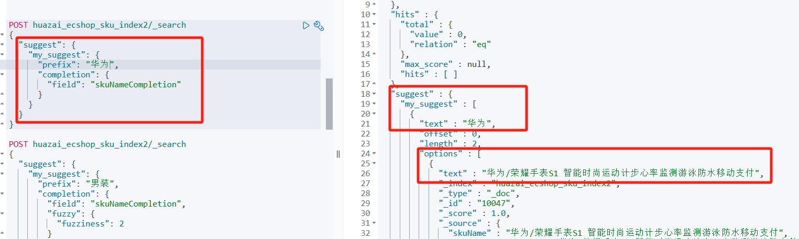
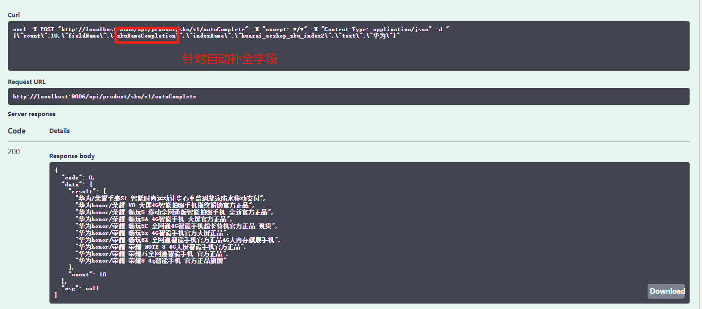
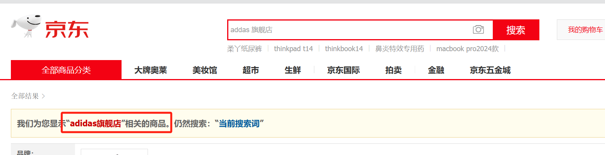
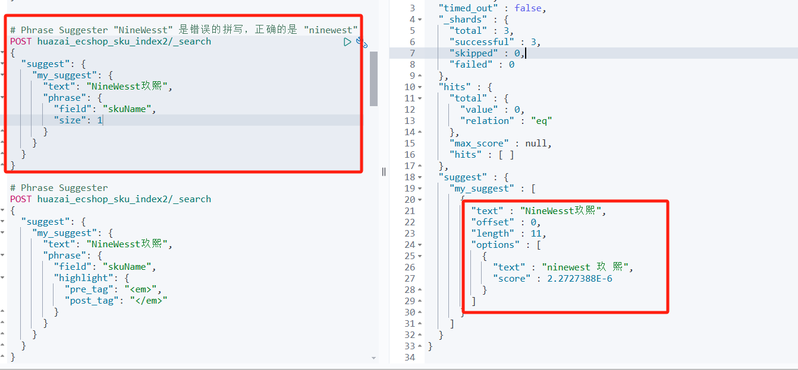
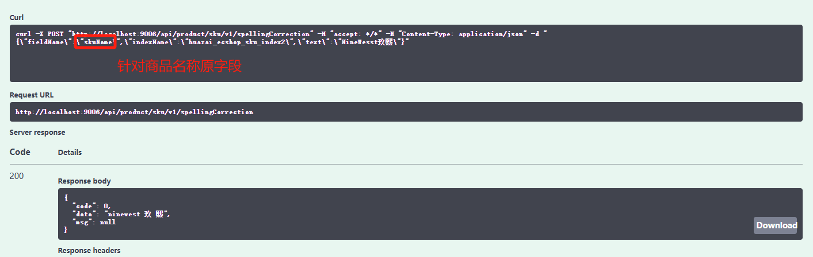

从今天之后的一段时间内，华仔会带着大家一起从零开始搭建并研发一套高并发的电商实战项目，这里会涉及到很多互联网大厂开发过程中所使用的核心技术和架构设计模式，希望大家学完之后可以用到自己的简历中。

接下来我们会重点架构设计和开发一下我们高并发电商实战项目中的「**商品中心服务**」。

这是第四十四篇，本篇我们继续进行电商实战项目设计与开发，本篇将进行「**商品中心服务**」 Elasticsearch 10W商品搜索及suggest接口开发。

文章汇总位置：[https://wx.zsxq.com/dweb2/index/columns/51122554151214](https://wx.zsxq.com/dweb2/index/columns/51122554151214)

源码授权与获取地址：[https://articles.zsxq.com/id\_1s85grnaae4p.html](https://articles.zsxq.com/id_1s85grnaae4p.html)

本章源码地址：[https://gitcode.net/u011359591/huazai-ecshop/-/tree/ecshop-chapter-44](https://gitcode.net/u011359591/huazai-ecshop/-/tree/ecshop-chapter-44)

## **01 前言**

终于要设计与研发电商项目代码了，今天我们主要对「**商品中心服务**」 Elasticsearch 10W 商品搜索及 suggest 接口开发。

这里需要注意下，我们整个项目目前是不提供前端的，这个后续有时间在搞，主要是进行后端接口以及微服务模块架构设计。

## **02 商品中心服务 ES 搜索接口开发**

在 [【电商实战项目第三十九篇】华仔电商实战项目商品中心服务手把手安装 ElasticSearch 7.9.3 版本及分词器](https://articles.zsxq.com/id_wp5i9us9k7d4.html)、 [【电商实战项目第四十一篇】华仔电商实战项目商品中心服务 Elasticsearch 写入10W商品数据基础功能接口开发](https://articles.zsxq.com/id_gz67j9sbworq.html) 篇中，我们已经对 es 商品 sku 索引进行了搭建及构建，本篇我们就来开发下关于 suggest 相关搜索接口。

主要有两个：

1.  商品全文检索接口。
2.  商品结构化搜索接口。

## **2.1 商品全文检索接口**

代码实现如下：

/\*\*

\* sku 商品全文检索

\* @param fullTextSearch

\* @return

\*/

@Override

public Map<String, Object> fullTextSearch(FullTextSearchEntity fullTextSearch) throws IOException {

SearchSourceBuilder searchSourceBuilder \= new SearchSourceBuilder();

searchSourceBuilder.trackTotalHits(true);

/\*\*

\* 构建 match 匹配条件

\*/

fullTextSearch.getQueryTexts().forEach((field, text) -> {

searchSourceBuilder.query(QueryBuilders.matchQuery(field, text));

});

/\*\*

\* 2、设置搜索高亮配置

\*/

HighlightBuilder highlightBuilder \= new HighlightBuilder();

highlightBuilder.field(fullTextSearch.getHighLightField());

// 搜索结果里商品 sku 名称跟你的搜索词匹配的部分会显示为红色

highlightBuilder.preTags("");

highlightBuilder.postTags("");

highlightBuilder.numOfFragments(0);

searchSourceBuilder.highlighter(highlightBuilder);

/\*\*

\* 3、设置搜索分页参数

\*/

int from \= (fullTextSearch.getPage() - 1) \* fullTextSearch.getPageSize();

searchSourceBuilder.from(from);

searchSourceBuilder.size(fullTextSearch.getPageSize());

/\*\*

\* 4、封装搜索请求

\*/

SearchRequest searchRequest \= new SearchRequest(fullTextSearch.getIndexName());

searchRequest.source(searchSourceBuilder);

/\*\*

\* 5、真正发送 es search 请求

\*/

SearchResponse searchResponse \= restHighLevelClient.search(searchRequest, RequestOptions.DEFAULT);

/\*\*

\* 6、对结果进行高亮处理

\*/

SearchHits hits \= searchResponse.getHits();

for (SearchHit hit : hits) {

// 获取高亮字段

HighlightField highlightField \= hit.getHighlightFields().get(fullTextSearch.getHighLightField());

Map<String, Object> sourceAsMap = hit.getSourceAsMap();

Text\[\] fragments = highlightField.fragments();

StringBuilder builder \= new StringBuilder();

for (Text fragment : fragments) {

builder.append(fragment.string());

}

sourceAsMap.put(fullTextSearch.getHighLightField(), builder.toString());

}

/\*\*

\* 7、返回结果集

\*/

Map<String, Object> resultMap = new HashMap<>();

SearchHit\[\] searchHits = hits.getHits();

long totalCount \= searchResponse.getHits().getTotalHits().value;

resultMap.put("searchHits", searchHits);

resultMap.put("totalCount", totalCount);

resultMap.put("page", fullTextSearch.getPage());

resultMap.put("pageSize", fullTextSearch.getPageSize());

return resultMap;

}

搜索条件与结果如下：

{

"highLightField": "skuName",

"indexName": "huazai\_ecshop\_sku\_index2",

"page": 1,

"pageSize": 20,

"queryTexts": {

"skuName": "男装"

}

}

{

"code": 0,

"data": {

"searchHits": \[

{

"score": 4.829898,

"id": "70854",

"type": "\_doc",

"nestedIdentity": null,

"version": \-1,

"seqNo": \-2,

"primaryTerm": 0,

"highlightFields": {

"skuName": {

"name": "skuName",

"fragments": \[

{

"fragment": true

}

\],

"fragment": true

}

},

"sortValues": \[\],

"matchedQueries": \[\],

"explanation": null,

"shard": null,

"index": "huazai\_ecshop\_sku\_index2",

"clusterAlias": null,

"sourceAsMap": {

"skuName": "真维斯男装 冬装 男装舒适圆领提花长袖毛衣",

"skuNameCompletion": "真维斯男装 冬装 男装舒适圆领提花长袖毛衣",

"createTime": "2024-12-05 22:21:15",

"vipPrice": 107,

"skuStatus": 1,

"updateTime": "2024-12-05 22:21:15",

"category": "大码男装",

"skuId": 70854,

"mainUrl": "http://img12.360buyimg.com/n1/s450x450\_jfs/t1/198920/1/50667/47720/6736c429Fc2f747c8/4cadbe7a136fdb39.jpg.avif",

"basePrice": 180

},

"innerHits": null,

"fields": {},

"sourceAsString": "{\\"skuName\\":\\"真维斯男装 冬装 男装舒适圆领提花长袖毛衣\\",\\"skuNameCompletion\\":\\"真维斯男装 冬装 男装舒适圆领提花长袖毛衣\\",\\"createTime\\":\\"2024-12-05 22:21:15\\",\\"vipPrice\\":107.0,\\"skuStatus\\":1,\\"updateTime\\":\\"2024-12-05 22:21:15\\",\\"category\\":\\"大码男装\\",\\"skuId\\":70854,\\"mainUrl\\":\\"http://img12.360buyimg.com/n1/s450x450\_jfs/t1/198920/1/50667/47720/6736c429Fc2f747c8/4cadbe7a136fdb39.jpg.avif\\",\\"basePrice\\":180.0}",

"rawSortValues": \[\],

"sourceRef": {

"fragment": true

},

"fragment": false

},

{

"score": 4.522438,

"id": "14690",

"type": "\_doc",

"nestedIdentity": null,

"version": \-1,

"seqNo": \-2,

"primaryTerm": 0,

"highlightFields": {

"skuName": {

"name": "skuName",

"fragments": \[

{

"fragment": true

}

\],

"fragment": true

}

},

"sortValues": \[\],

"matchedQueries": \[\],

"explanation": null,

"shard": null,

"index": "huazai\_ecshop\_sku\_index2",

"clusterAlias": null,

"sourceAsMap": {

"skuName": "男装名人瑞裳 2023新品 男装时尚商务修身男裤 3113150",

"skuNameCompletion": "男装名人瑞裳 2023新品 男装时尚商务修身男裤 3113150",

"createTime": "2024-12-05 22:21:11",

"vipPrice": 927,

"skuStatus": 1,

"updateTime": "2024-12-05 22:21:11",

"category": "女装",

"skuId": 14690,

"mainUrl": "http://img12.360buyimg.com/n1/s450x450\_jfs/t1/198920/1/50667/47720/6736c429Fc2f747c8/4cadbe7a136fdb39.jpg.avif",

"basePrice": 998

},

"innerHits": null,

"fields": {},

"sourceAsString": "{\\"skuName\\":\\"男装名人瑞裳 2023新品 男装时尚商务修身男裤 3113150\\",\\"skuNameCompletion\\":\\"男装名人瑞裳 2023新品 男装时尚商务修身男裤 3113150\\",\\"createTime\\":\\"2024-12-05 22:21:11\\",\\"vipPrice\\":927.0,\\"skuStatus\\":1,\\"updateTime\\":\\"2024-12-05 22:21:11\\",\\"category\\":\\"女装\\",\\"skuId\\":14690,\\"mainUrl\\":\\"http://img12.360buyimg.com/n1/s450x450\_jfs/t1/198920/1/50667/47720/6736c429Fc2f747c8/4cadbe7a136fdb39.jpg.avif\\",\\"basePrice\\":998.0}",

"rawSortValues": \[\],

"sourceRef": {

"fragment": true

},

"fragment": false

},

{

"score": 4.522438,

"id": "21696",

"type": "\_doc",

"nestedIdentity": null,

"version": \-1,

"seqNo": \-2,

"primaryTerm": 0,

"highlightFields": {

"skuName": {

"name": "skuName",

"fragments": \[

{

"fragment": true

}

\],

"fragment": true

}

},

"sortValues": \[\],

"matchedQueries": \[\],

"explanation": null,

"shard": null,

"index": "huazai\_ecshop\_sku\_index2",

"clusterAlias": null,

"sourceAsMap": {

"skuName": "真维斯男装 冬装 男装弹性舒适柔软反脚牛仔裤@",

"skuNameCompletion": "真维斯男装 冬装 男装弹性舒适柔软反脚牛仔裤@",

"createTime": "2024-12-05 22:21:11",

"vipPrice": 106,

"skuStatus": 1,

"updateTime": "2024-12-05 22:21:11",

"category": "大码男装",

"skuId": 21696,

"mainUrl": "http://img12.360buyimg.com/n1/s450x450\_jfs/t1/198920/1/50667/47720/6736c429Fc2f747c8/4cadbe7a136fdb39.jpg.avif",

"basePrice": 199

},

"innerHits": null,

"fields": {},

"sourceAsString": "{\\"skuName\\":\\"真维斯男装 冬装 男装弹性舒适柔软反脚牛仔裤@\\",\\"skuNameCompletion\\":\\"真维斯男装 冬装 男装弹性舒适柔软反脚牛仔裤@\\",\\"createTime\\":\\"2024-12-05 22:21:11\\",\\"vipPrice\\":106.0,\\"skuStatus\\":1,\\"updateTime\\":\\"2024-12-05 22:21:11\\",\\"category\\":\\"大码男装\\",\\"skuId\\":21696,\\"mainUrl\\":\\"http://img12.360buyimg.com/n1/s450x450\_jfs/t1/198920/1/50667/47720/6736c429Fc2f747c8/4cadbe7a136fdb39.jpg.avif\\",\\"basePrice\\":199.0}",

"rawSortValues": \[\],

"sourceRef": {

"fragment": true

},

"fragment": false

},

{

"score": 4.505287,

"id": "21781",

"type": "\_doc",

"nestedIdentity": null,

"version": \-1,

"seqNo": \-2,

"primaryTerm": 0,

"highlightFields": {

"skuName": {

"name": "skuName",

"fragments": \[

{

"fragment": true

}

\],

"fragment": true

}

},

"sortValues": \[\],

"matchedQueries": \[\],

"explanation": null,

"shard": null,

"index": "huazai\_ecshop\_sku\_index2",

"clusterAlias": null,

"sourceAsMap": {

"skuName": "真维斯男装 冬装 男装简洁时尚防风保暖针织舒适牛仔裤",

"skuNameCompletion": "真维斯男装 冬装 男装简洁时尚防风保暖针织舒适牛仔裤",

"createTime": "2024-12-05 22:21:11",

"vipPrice": 108,

"skuStatus": 1,

"updateTime": "2024-12-05 22:21:11",

"category": "大码男装",

"skuId": 21781,

"mainUrl": "http://img12.360buyimg.com/n1/s450x450\_jfs/t1/198920/1/50667/47720/6736c429Fc2f747c8/4cadbe7a136fdb39.jpg.avif",

"basePrice": 199

},

"innerHits": null,

"fields": {},

"sourceAsString": "{\\"skuName\\":\\"真维斯男装 冬装 男装简洁时尚防风保暖针织舒适牛仔裤\\",\\"skuNameCompletion\\":\\"真维斯男装 冬装 男装简洁时尚防风保暖针织舒适牛仔裤\\",\\"createTime\\":\\"2024-12-05 22:21:11\\",\\"vipPrice\\":108.0,\\"skuStatus\\":1,\\"updateTime\\":\\"2024-12-05 22:21:11\\",\\"category\\":\\"大码男装\\",\\"skuId\\":21781,\\"mainUrl\\":\\"http://img12.360buyimg.com/n1/s450x450\_jfs/t1/198920/1/50667/47720/6736c429Fc2f747c8/4cadbe7a136fdb39.jpg.avif\\",\\"basePrice\\":199.0}",

"rawSortValues": \[\],

"sourceRef": {

"fragment": true

},

"fragment": false

},

{

"score": 4.489089,

"id": "60027",

"type": "\_doc",

"nestedIdentity": null,

"version": \-1,

"seqNo": \-2,

"primaryTerm": 0,

"highlightFields": {

"skuName": {

"name": "skuName",

"fragments": \[

{

"fragment": true

}

\],

"fragment": true

}

},

"sortValues": \[\],

"matchedQueries": \[\],

"explanation": null,

"shard": null,

"index": "huazai\_ecshop\_sku\_index2",

"clusterAlias": null,

"sourceAsMap": {

"skuName": "柒牌长袖衬衫 男装春季新款时尚休闲格子男装长袖衬衣",

"skuNameCompletion": "柒牌长袖衬衫 男装春季新款时尚休闲格子男装长袖衬衣",

"createTime": "2024-12-05 22:21:14",

"vipPrice": 418,

"skuStatus": 1,

"updateTime": "2024-12-05 22:21:14",

"category": "大码男装",

"skuId": 60027,

"mainUrl": "http://img12.360buyimg.com/n1/s450x450\_jfs/t1/198920/1/50667/47720/6736c429Fc2f747c8/4cadbe7a136fdb39.jpg.avif",

"basePrice": 499

},

"innerHits": null,

"fields": {},

"sourceAsString": "{\\"skuName\\":\\"柒牌长袖衬衫 男装春季新款时尚休闲格子男装长袖衬衣\\",\\"skuNameCompletion\\":\\"柒牌长袖衬衫 男装春季新款时尚休闲格子男装长袖衬衣\\",\\"createTime\\":\\"2024-12-05 22:21:14\\",\\"vipPrice\\":418.0,\\"skuStatus\\":1,\\"updateTime\\":\\"2024-12-05 22:21:14\\",\\"category\\":\\"大码男装\\",\\"skuId\\":60027,\\"mainUrl\\":\\"http://img12.360buyimg.com/n1/s450x450\_jfs/t1/198920/1/50667/47720/6736c429Fc2f747c8/4cadbe7a136fdb39.jpg.avif\\",\\"basePrice\\":499.0}",

"rawSortValues": \[\],

"sourceRef": {

"fragment": true

},

"fragment": false

},

{

"score": 4.434608,

"id": "78596",

"type": "\_doc",

"nestedIdentity": null,

"version": \-1,

"seqNo": \-2,

"primaryTerm": 0,

"highlightFields": {

"skuName": {

"name": "skuName",

"fragments": \[

{

"fragment": true

}

\],

"fragment": true

}

},

"sortValues": \[\],

"matchedQueries": \[\],

"explanation": null,

"shard": null,

"index": "huazai\_ecshop\_sku\_index2",

"clusterAlias": null,

"sourceAsMap": {

"skuName": "TRiES/才子男装2024秋季新品男装商务条纹男青年夹克外套jacket",

"skuNameCompletion": "TRiES/才子男装2024秋季新品男装商务条纹男青年夹克外套jacket",

"createTime": "2024-12-05 22:21:15",

"vipPrice": 794,

"skuStatus": 1,

"updateTime": "2024-12-05 22:21:15",

"category": "大码男装",

"skuId": 78596,

"mainUrl": "http://img12.360buyimg.com/n1/s450x450\_jfs/t1/198920/1/50667/47720/6736c429Fc2f747c8/4cadbe7a136fdb39.jpg.avif",

"basePrice": 889

},

"innerHits": null,

"fields": {},

"sourceAsString": "{\\"skuName\\":\\"TRiES/才子男装2024秋季新品男装商务条纹男青年夹克外套jacket\\",\\"skuNameCompletion\\":\\"TRiES/才子男装2024秋季新品男装商务条纹男青年夹克外套jacket\\",\\"createTime\\":\\"2024-12-05 22:21:15\\",\\"vipPrice\\":794.0,\\"skuStatus\\":1,\\"updateTime\\":\\"2024-12-05 22:21:15\\",\\"category\\":\\"大码男装\\",\\"skuId\\":78596,\\"mainUrl\\":\\"http://img12.360buyimg.com/n1/s450x450\_jfs/t1/198920/1/50667/47720/6736c429Fc2f747c8/4cadbe7a136fdb39.jpg.avif\\",\\"basePrice\\":889.0}",

"rawSortValues": \[\],

"sourceRef": {

"fragment": true

},

"fragment": false

},

{

"score": 4.418584,

"id": "63261",

"type": "\_doc",

"nestedIdentity": null,

"version": \-1,

"seqNo": \-2,

"primaryTerm": 0,

"highlightFields": {

"skuName": {

"name": "skuName",

"fragments": \[

{

"fragment": true

}

\],

"fragment": true

}

},

"sortValues": \[\],

"matchedQueries": \[\],

"explanation": null,

"shard": null,

"index": "huazai\_ecshop\_sku\_index2",

"clusterAlias": null,

"sourceAsMap": {

"skuName": "真维斯羽绒男装冬装男装潮流撞色拼合三防保暖羽绒外套",

"skuNameCompletion": "真维斯羽绒男装冬装男装潮流撞色拼合三防保暖羽绒外套",

"createTime": "2024-12-05 22:21:15",

"vipPrice": 495,

"skuStatus": 1,

"updateTime": "2024-12-05 22:21:15",

"category": "大码男装",

"skuId": 63261,

"mainUrl": "http://img12.360buyimg.com/n1/s450x450\_jfs/t1/198920/1/50667/47720/6736c429Fc2f747c8/4cadbe7a136fdb39.jpg.avif",

"basePrice": 569

},

"innerHits": null,

"fields": {},

"sourceAsString": "{\\"skuName\\":\\"真维斯羽绒男装冬装男装潮流撞色拼合三防保暖羽绒外套\\",\\"skuNameCompletion\\":\\"真维斯羽绒男装冬装男装潮流撞色拼合三防保暖羽绒外套\\",\\"createTime\\":\\"2024-12-05 22:21:15\\",\\"vipPrice\\":495.0,\\"skuStatus\\":1,\\"updateTime\\":\\"2024-12-05 22:21:15\\",\\"category\\":\\"大码男装\\",\\"skuId\\":63261,\\"mainUrl\\":\\"http://img12.360buyimg.com/n1/s450x450\_jfs/t1/198920/1/50667/47720/6736c429Fc2f747c8/4cadbe7a136fdb39.jpg.avif\\",\\"basePrice\\":569.0}",

"rawSortValues": \[\],

"sourceRef": {

"fragment": true

},

"fragment": false

},

{

"score": 4.2997003,

"id": "4847",

"type": "\_doc",

"nestedIdentity": null,

"version": \-1,

"seqNo": \-2,

"primaryTerm": 0,

"highlightFields": {

"skuName": {

"name": "skuName",

"fragments": \[

{

"fragment": true

}

\],

"fragment": true

}

},

"sortValues": \[\],

"matchedQueries": \[\],

"explanation": null,

"shard": null,

"index": "huazai\_ecshop\_sku\_index2",

"clusterAlias": null,

"sourceAsMap": {

"skuName": "柒牌男装夹克棉衣新款男装外套男士休闲青年羊毛修身立领夹克",

"skuNameCompletion": "柒牌男装夹克棉衣新款男装外套男士休闲青年羊毛修身立领夹克",

"createTime": "2024-12-05 22:21:10",

"vipPrice": 1435,

"skuStatus": 1,

"updateTime": "2024-12-05 22:21:10",

"category": "大码男装",

"skuId": 4847,

"mainUrl": "http://img12.360buyimg.com/n1/s450x450\_jfs/t1/198920/1/50667/47720/6736c429Fc2f747c8/4cadbe7a136fdb39.jpg.avif",

"basePrice": 1499

},

"innerHits": null,

"fields": {},

"sourceAsString": "{\\"skuName\\":\\"柒牌男装夹克棉衣新款男装外套男士休闲青年羊毛修身立领夹克\\",\\"skuNameCompletion\\":\\"柒牌男装夹克棉衣新款男装外套男士休闲青年羊毛修身立领夹克\\",\\"createTime\\":\\"2024-12-05 22:21:10\\",\\"vipPrice\\":1435.0,\\"skuStatus\\":1,\\"updateTime\\":\\"2024-12-05 22:21:10\\",\\"category\\":\\"大码男装\\",\\"skuId\\":4847,\\"mainUrl\\":\\"http://img12.360buyimg.com/n1/s450x450\_jfs/t1/198920/1/50667/47720/6736c429Fc2f747c8/4cadbe7a136fdb39.jpg.avif\\",\\"basePrice\\":1499.0}",

"rawSortValues": \[\],

"sourceRef": {

"fragment": true

},

"fragment": false

},

{

"score": 4.284015,

"id": "4673",

"type": "\_doc",

"nestedIdentity": null,

"version": \-1,

"seqNo": \-2,

"primaryTerm": 0,

"highlightFields": {

"skuName": {

"name": "skuName",

"fragments": \[

{

"fragment": true

}

\],

"fragment": true

}

},

"sortValues": \[\],

"matchedQueries": \[\],

"explanation": null,

"shard": null,

"index": "huazai\_ecshop\_sku\_index2",

"clusterAlias": null,

"sourceAsMap": {

"skuName": "EMPORIO ARMANI/阿玛尼EA7男装长袖T恤 男装卫衣274719",

"skuNameCompletion": "EMPORIO ARMANI/阿玛尼EA7男装长袖T恤 男装卫衣274719",

"createTime": "2024-12-05 22:21:10",

"vipPrice": 1402,

"skuStatus": 1,

"updateTime": "2024-12-05 22:21:10",

"category": "进口货品",

"skuId": 4673,

"mainUrl": "http://img12.360buyimg.com/n1/s450x450\_jfs/t1/198920/1/50667/47720/6736c429Fc2f747c8/4cadbe7a136fdb39.jpg.avif",

"basePrice": 1499

},

"innerHits": null,

"fields": {},

"sourceAsString": "{\\"skuName\\":\\"EMPORIO ARMANI/阿玛尼EA7男装长袖T恤 男装卫衣274719\\",\\"skuNameCompletion\\":\\"EMPORIO ARMANI/阿玛尼EA7男装长袖T恤 男装卫衣274719\\",\\"createTime\\":\\"2024-12-05 22:21:10\\",\\"vipPrice\\":1402.0,\\"skuStatus\\":1,\\"updateTime\\":\\"2024-12-05 22:21:10\\",\\"category\\":\\"进口货品\\",\\"skuId\\":4673,\\"mainUrl\\":\\"http://img12.360buyimg.com/n1/s450x450\_jfs/t1/198920/1/50667/47720/6736c429Fc2f747c8/4cadbe7a136fdb39.jpg.avif\\",\\"basePrice\\":1499.0}",

"rawSortValues": \[\],

"sourceRef": {

"fragment": true

},

"fragment": false

},

{

"score": 4.25178,

"id": "33798",

"type": "\_doc",

"nestedIdentity": null,

"version": \-1,

"seqNo": \-2,

"primaryTerm": 0,

"highlightFields": {

"skuName": {

"name": "skuName",

"fragments": \[

{

"fragment": true

}

\],

"fragment": true

}

},

"sortValues": \[\],

"matchedQueries": \[\],

"explanation": null,

"shard": null,

"index": "huazai\_ecshop\_sku\_index2",

"clusterAlias": null,

"sourceAsMap": {

"skuName": "PANMAX潮牌大码男装 大码男装衬衫 男士休闲长袖衬衫加肥加大",

"skuNameCompletion": "PANMAX潮牌大码男装 大码男装衬衫 男士休闲长袖衬衫加肥加大",

"createTime": "2024-12-05 22:21:12",

"vipPrice": 409,

"skuStatus": 1,

"updateTime": "2024-12-05 22:21:12",

"category": "大码男装",

"skuId": 33798,

"mainUrl": "http://img12.360buyimg.com/n1/s450x450\_jfs/t1/198920/1/50667/47720/6736c429Fc2f747c8/4cadbe7a136fdb39.jpg.avif",

"basePrice": 468

},

"innerHits": null,

"fields": {},

"sourceAsString": "{\\"skuName\\":\\"PANMAX潮牌大码男装 大码男装衬衫 男士休闲长袖衬衫加肥加大\\",\\"skuNameCompletion\\":\\"PANMAX潮牌大码男装 大码男装衬衫 男士休闲长袖衬衫加肥加大\\",\\"createTime\\":\\"2024-12-05 22:21:12\\",\\"vipPrice\\":409.0,\\"skuStatus\\":1,\\"updateTime\\":\\"2024-12-05 22:21:12\\",\\"category\\":\\"大码男装\\",\\"skuId\\":33798,\\"mainUrl\\":\\"http://img12.360buyimg.com/n1/s450x450\_jfs/t1/198920/1/50667/47720/6736c429Fc2f747c8/4cadbe7a136fdb39.jpg.avif\\",\\"basePrice\\":468.0}",

"rawSortValues": \[\],

"sourceRef": {

"fragment": true

},

"fragment": false

},

{

"score": 4.25178,

"id": "16190",

"type": "\_doc",

"nestedIdentity": null,

"version": \-1,

"seqNo": \-2,

"primaryTerm": 0,

"highlightFields": {

"skuName": {

"name": "skuName",

"fragments": \[

{

"fragment": true

}

\],

"fragment": true

}

},

"sortValues": \[\],

"matchedQueries": \[\],

"explanation": null,

"shard": null,

"index": "huazai\_ecshop\_sku\_index2",

"clusterAlias": null,

"sourceAsMap": {

"skuName": "jow男装2024秋冬男士纯羊毛衫 条纹毛衣圆领针织休闲毛衫男装",

"skuNameCompletion": "jow男装2024秋冬男士纯羊毛衫 条纹毛衣圆领针织休闲毛衫男装",

"createTime": "2024-12-05 22:21:11",

"vipPrice": 997,

"skuStatus": 1,

"updateTime": "2024-12-05 22:21:11",

"category": "大码男装",

"skuId": 16190,

"mainUrl": "http://img12.360buyimg.com/n1/s450x450\_jfs/t1/198920/1/50667/47720/6736c429Fc2f747c8/4cadbe7a136fdb39.jpg.avif",

"basePrice": 1080

},

"innerHits": null,

"fields": {},

"sourceAsString": "{\\"skuName\\":\\"jow男装2024秋冬男士纯羊毛衫 条纹毛衣圆领针织休闲毛衫男装\\",\\"skuNameCompletion\\":\\"jow男装2024秋冬男士纯羊毛衫 条纹毛衣圆领针织休闲毛衫男装\\",\\"createTime\\":\\"2024-12-05 22:21:11\\",\\"vipPrice\\":997.0,\\"skuStatus\\":1,\\"updateTime\\":\\"2024-12-05 22:21:11\\",\\"category\\":\\"大码男装\\",\\"skuId\\":16190,\\"mainUrl\\":\\"http://img12.360buyimg.com/n1/s450x450\_jfs/t1/198920/1/50667/47720/6736c429Fc2f747c8/4cadbe7a136fdb39.jpg.avif\\",\\"basePrice\\":1080.0}",

"rawSortValues": \[\],

"sourceRef": {

"fragment": true

},

"fragment": false

},

{

"score": 4.235278,

"id": "51687",

"type": "\_doc",

"nestedIdentity": null,

"version": \-1,

"seqNo": \-2,

"primaryTerm": 0,

"highlightFields": {

"skuName": {

"name": "skuName",

"fragments": \[

{

"fragment": true

}

\],

"fragment": true

}

},

"sortValues": \[\],

"matchedQueries": \[\],

"explanation": null,

"shard": null,

"index": "huazai\_ecshop\_sku\_index2",

"clusterAlias": null,

"sourceAsMap": {

"skuName": "贵人鸟男装卫衣2024秋冬新品运动男士时尚字母圆领套头卫衣男装",

"skuNameCompletion": "贵人鸟男装卫衣2024秋冬新品运动男士时尚字母圆领套头卫衣男装",

"createTime": "2024-12-05 22:21:13",

"vipPrice": 200,

"skuStatus": 1,

"updateTime": "2024-12-05 22:21:13",

"category": "户外/运动服",

"skuId": 51687,

"mainUrl": "http://img12.360buyimg.com/n1/s450x450\_jfs/t1/198920/1/50667/47720/6736c429Fc2f747c8/4cadbe7a136fdb39.jpg.avif",

"basePrice": 279

},

"innerHits": null,

"fields": {},

"sourceAsString": "{\\"skuName\\":\\"贵人鸟男装卫衣2024秋冬新品运动男士时尚字母圆领套头卫衣男装\\",\\"skuNameCompletion\\":\\"贵人鸟男装卫衣2024秋冬新品运动男士时尚字母圆领套头卫衣男装\\",\\"createTime\\":\\"2024-12-05 22:21:13\\",\\"vipPrice\\":200.0,\\"skuStatus\\":1,\\"updateTime\\":\\"2024-12-05 22:21:13\\",\\"category\\":\\"户外/运动服\\",\\"skuId\\":51687,\\"mainUrl\\":\\"http://img12.360buyimg.com/n1/s450x450\_jfs/t1/198920/1/50667/47720/6736c429Fc2f747c8/4cadbe7a136fdb39.jpg.avif\\",\\"basePrice\\":279.0}",

"rawSortValues": \[\],

"sourceRef": {

"fragment": true

},

"fragment": false

},

{

"score": 4.235278,

"id": "31237",

"type": "\_doc",

"nestedIdentity": null,

"version": \-1,

"seqNo": \-2,

"primaryTerm": 0,

"highlightFields": {

"skuName": {

"name": "skuName",

"fragments": \[

{

"fragment": true

}

\],

"fragment": true

}

},

"sortValues": \[\],

"matchedQueries": \[\],

"explanation": null,

"shard": null,

"index": "huazai\_ecshop\_sku\_index2",

"clusterAlias": null,

"sourceAsMap": {

"skuName": "真维斯男装 冬装 男装加绒加厚韩版修身长袖牛仔衬衫男 衬衫男",

"skuNameCompletion": "真维斯男装 冬装 男装加绒加厚韩版修身长袖牛仔衬衫男 衬衫男",

"createTime": "2024-12-05 22:21:12",

"vipPrice": 206,

"skuStatus": 1,

"updateTime": "2024-12-05 22:21:12",

"category": "大码男装",

"skuId": 31237,

"mainUrl": "http://img12.360buyimg.com/n1/s450x450\_jfs/t1/198920/1/50667/47720/6736c429Fc2f747c8/4cadbe7a136fdb39.jpg.avif",

"basePrice": 299

},

"innerHits": null,

"fields": {},

"sourceAsString": "{\\"skuName\\":\\"真维斯男装 冬装 男装加绒加厚韩版修身长袖牛仔衬衫男 衬衫男\\",\\"skuNameCompletion\\":\\"真维斯男装 冬装 男装加绒加厚韩版修身长袖牛仔衬衫男 衬衫男\\",\\"createTime\\":\\"2024-12-05 22:21:12\\",\\"vipPrice\\":206.0,\\"skuStatus\\":1,\\"updateTime\\":\\"2024-12-05 22:21:12\\",\\"category\\":\\"大码男装\\",\\"skuId\\":31237,\\"mainUrl\\":\\"http://img12.360buyimg.com/n1/s450x450\_jfs/t1/198920/1/50667/47720/6736c429Fc2f747c8/4cadbe7a136fdb39.jpg.avif\\",\\"basePrice\\":299.0}",

"rawSortValues": \[\],

"sourceRef": {

"fragment": true

},

"fragment": false

},

{

"score": 4.2197585,

"id": "16800",

"type": "\_doc",

"nestedIdentity": null,

"version": \-1,

"seqNo": \-2,

"primaryTerm": 0,

"highlightFields": {

"skuName": {

"name": "skuName",

"fragments": \[

{

"fragment": true

}

\],

"fragment": true

}

},

"sortValues": \[\],

"matchedQueries": \[\],

"explanation": null,

"shard": null,

"index": "huazai\_ecshop\_sku\_index2",

"clusterAlias": null,

"sourceAsMap": {

"skuName": "TRiES/才子男装2024秋季新品男装多色修身商务时尚修身针织休闲裤",

"skuNameCompletion": "TRiES/才子男装2024秋季新品男装多色修身商务时尚修身针织休闲裤",

"createTime": "2024-12-05 22:21:11",

"vipPrice": 345,

"skuStatus": 1,

"updateTime": "2024-12-05 22:21:11",

"category": "大码男装",

"skuId": 16800,

"mainUrl": "http://img12.360buyimg.com/n1/s450x450\_jfs/t1/198920/1/50667/47720/6736c429Fc2f747c8/4cadbe7a136fdb39.jpg.avif",

"basePrice": 429

},

"innerHits": null,

"fields": {},

"sourceAsString": "{\\"skuName\\":\\"TRiES/才子男装2024秋季新品男装多色修身商务时尚修身针织休闲裤\\",\\"skuNameCompletion\\":\\"TRiES/才子男装2024秋季新品男装多色修身商务时尚修身针织休闲裤\\",\\"createTime\\":\\"2024-12-05 22:21:11\\",\\"vipPrice\\":345.0,\\"skuStatus\\":1,\\"updateTime\\":\\"2024-12-05 22:21:11\\",\\"category\\":\\"大码男装\\",\\"skuId\\":16800,\\"mainUrl\\":\\"http://img12.360buyimg.com/n1/s450x450\_jfs/t1/198920/1/50667/47720/6736c429Fc2f747c8/4cadbe7a136fdb39.jpg.avif\\",\\"basePrice\\":429.0}",

"rawSortValues": \[\],

"sourceRef": {

"fragment": true

},

"fragment": false

},

{

"score": 4.2197585,

"id": "69026",

"type": "\_doc",

"nestedIdentity": null,

"version": \-1,

"seqNo": \-2,

"primaryTerm": 0,

"highlightFields": {

"skuName": {

"name": "skuName",

"fragments": \[

{

"fragment": true

}

\],

"fragment": true

}

},

"sortValues": \[\],

"matchedQueries": \[\],

"explanation": null,

"shard": null,

"index": "huazai\_ecshop\_sku\_index2",

"clusterAlias": null,

"sourceAsMap": {

"skuName": "劲霸男装风衣 男士西装领外套秋新款修身风衣外套男装|BFHY1109",

"skuNameCompletion": "劲霸男装风衣 男士西装领外套秋新款修身风衣外套男装|BFHY1109",

"createTime": "2024-12-05 22:21:15",

"vipPrice": 1286,

"skuStatus": 1,

"updateTime": "2024-12-05 22:21:15",

"category": "大码男装",

"skuId": 69026,

"mainUrl": "http://img12.360buyimg.com/n1/s450x450\_jfs/t1/198920/1/50667/47720/6736c429Fc2f747c8/4cadbe7a136fdb39.jpg.avif",

"basePrice": 1380

},

"innerHits": null,

"fields": {},

"sourceAsString": "{\\"skuName\\":\\"劲霸男装风衣 男士西装领外套秋新款修身风衣外套男装|BFHY1109\\",\\"skuNameCompletion\\":\\"劲霸男装风衣 男士西装领外套秋新款修身风衣外套男装|BFHY1109\\",\\"createTime\\":\\"2024-12-05 22:21:15\\",\\"vipPrice\\":1286.0,\\"skuStatus\\":1,\\"updateTime\\":\\"2024-12-05 22:21:15\\",\\"category\\":\\"大码男装\\",\\"skuId\\":69026,\\"mainUrl\\":\\"http://img12.360buyimg.com/n1/s450x450\_jfs/t1/198920/1/50667/47720/6736c429Fc2f747c8/4cadbe7a136fdb39.jpg.avif\\",\\"basePrice\\":1380.0}",

"rawSortValues": \[\],

"sourceRef": {

"fragment": true

},

"fragment": false

},

{

"score": 4.189103,

"id": "32361",

"type": "\_doc",

"nestedIdentity": null,

"version": \-1,

"seqNo": \-2,

"primaryTerm": 0,

"highlightFields": {

"skuName": {

"name": "skuName",

"fragments": \[

{

"fragment": true

}

\],

"fragment": true

}

},

"sortValues": \[\],

"matchedQueries": \[\],

"explanation": null,

"shard": null,

"index": "huazai\_ecshop\_sku\_index2",

"clusterAlias": null,

"sourceAsMap": {

"skuName": "PANMAX潮牌大码男装 大码男装秋宽松简约男士加肥加大长袖衬衫",

"skuNameCompletion": "PANMAX潮牌大码男装 大码男装秋宽松简约男士加肥加大长袖衬衫",

"createTime": "2024-12-05 22:21:12",

"vipPrice": 721,

"skuStatus": 1,

"updateTime": "2024-12-05 22:21:12",

"category": "大码男装",

"skuId": 32361,

"mainUrl": "http://img12.360buyimg.com/n1/s450x450\_jfs/t1/198920/1/50667/47720/6736c429Fc2f747c8/4cadbe7a136fdb39.jpg.avif",

"basePrice": 798

},

"innerHits": null,

"fields": {},

"sourceAsString": "{\\"skuName\\":\\"PANMAX潮牌大码男装 大码男装秋宽松简约男士加肥加大长袖衬衫\\",\\"skuNameCompletion\\":\\"PANMAX潮牌大码男装 大码男装秋宽松简约男士加肥加大长袖衬衫\\",\\"createTime\\":\\"2024-12-05 22:21:12\\",\\"vipPrice\\":721.0,\\"skuStatus\\":1,\\"updateTime\\":\\"2024-12-05 22:21:12\\",\\"category\\":\\"大码男装\\",\\"skuId\\":32361,\\"mainUrl\\":\\"http://img12.360buyimg.com/n1/s450x450\_jfs/t1/198920/1/50667/47720/6736c429Fc2f747c8/4cadbe7a136fdb39.jpg.avif\\",\\"basePrice\\":798.0}",

"rawSortValues": \[\],

"sourceRef": {

"fragment": true

},

"fragment": false

},

{

"score": 4.189103,

"id": "63520",

"type": "\_doc",

"nestedIdentity": null,

"version": \-1,

"seqNo": \-2,

"primaryTerm": 0,

"highlightFields": {

"skuName": {

"name": "skuName",

"fragments": \[

{

"fragment": true

}

\],

"fragment": true

}

},

"sortValues": \[\],

"matchedQueries": \[\],

"explanation": null,

"shard": null,

"index": "huazai\_ecshop\_sku\_index2",

"clusterAlias": null,

"sourceAsMap": {

"skuName": "阿迪达斯男装 2024秋款男装针织长袖圆领透气运动套头卫衣S98358",

"skuNameCompletion": "阿迪达斯男装 2024秋款男装针织长袖圆领透气运动套头卫衣S98358",

"createTime": "2024-12-05 22:21:15",

"vipPrice": 410,

"skuStatus": 1,

"updateTime": "2024-12-05 22:21:15",

"category": "户外/运动服",

"skuId": 63520,

"mainUrl": "http://img12.360buyimg.com/n1/s450x450\_jfs/t1/198920/1/50667/47720/6736c429Fc2f747c8/4cadbe7a136fdb39.jpg.avif",

"basePrice": 469

},

"innerHits": null,

"fields": {},

"sourceAsString": "{\\"skuName\\":\\"阿迪达斯男装 2024秋款男装针织长袖圆领透气运动套头卫衣S98358\\",\\"skuNameCompletion\\":\\"阿迪达斯男装 2024秋款男装针织长袖圆领透气运动套头卫衣S98358\\",\\"createTime\\":\\"2024-12-05 22:21:15\\",\\"vipPrice\\":410.0,\\"skuStatus\\":1,\\"updateTime\\":\\"2024-12-05 22:21:15\\",\\"category\\":\\"户外/运动服\\",\\"skuId\\":63520,\\"mainUrl\\":\\"http://img12.360buyimg.com/n1/s450x450\_jfs/t1/198920/1/50667/47720/6736c429Fc2f747c8/4cadbe7a136fdb39.jpg.avif\\",\\"basePrice\\":469.0}",

"rawSortValues": \[\],

"sourceRef": {

"fragment": true

},

"fragment": false

},

{

"score": 4.189103,

"id": "82581",

"type": "\_doc",

"nestedIdentity": null,

"version": \-1,

"seqNo": \-2,

"primaryTerm": 0,

"highlightFields": {

"skuName": {

"name": "skuName",

"fragments": \[

{

"fragment": true

}

\],

"fragment": true

}

},

"sortValues": \[\],

"matchedQueries": \[\],

"explanation": null,

"shard": null,

"index": "huazai\_ecshop\_sku\_index2",

"clusterAlias": null,

"sourceAsMap": {

"skuName": "归心中国风男装 设计师原创设计 长款棉麻纯色风衣休闲男装",

"skuNameCompletion": "归心中国风男装 设计师原创设计 长款棉麻纯色风衣休闲男装",

"createTime": "2024-12-05 22:21:16",

"vipPrice": 3701,

"skuStatus": 1,

"updateTime": "2024-12-05 22:21:16",

"category": "大码男装",

"skuId": 82581,

"mainUrl": "http://img12.360buyimg.com/n1/s450x450\_jfs/t1/198920/1/50667/47720/6736c429Fc2f747c8/4cadbe7a136fdb39.jpg.avif",

"basePrice": 3800

},

"innerHits": null,

"fields": {},

"sourceAsString": "{\\"skuName\\":\\"归心中国风男装 设计师原创设计 长款棉麻纯色风衣休闲男装\\",\\"skuNameCompletion\\":\\"归心中国风男装 设计师原创设计 长款棉麻纯色风衣休闲男装\\",\\"createTime\\":\\"2024-12-05 22:21:16\\",\\"vipPrice\\":3701.0,\\"skuStatus\\":1,\\"updateTime\\":\\"2024-12-05 22:21:16\\",\\"category\\":\\"大码男装\\",\\"skuId\\":82581,\\"mainUrl\\":\\"http://img12.360buyimg.com/n1/s450x450\_jfs/t1/198920/1/50667/47720/6736c429Fc2f747c8/4cadbe7a136fdb39.jpg.avif\\",\\"basePrice\\":3800.0}",

"rawSortValues": \[\],

"sourceRef": {

"fragment": true

},

"fragment": false

},

{

"score": 4.189103,

"id": "6262",

"type": "\_doc",

"nestedIdentity": null,

"version": \-1,

"seqNo": \-2,

"primaryTerm": 0,

"highlightFields": {

"skuName": {

"name": "skuName",

"fragments": \[

{

"fragment": true

}

\],

"fragment": true

}

},

"sortValues": \[\],

"matchedQueries": \[\],

"explanation": null,

"shard": null,

"index": "huazai\_ecshop\_sku\_index2",

"clusterAlias": null,

"sourceAsMap": {

"skuName": "AK男装2024秋季新款男装MA-1棒球领尼龙记忆面料单夹克男士夹克",

"skuNameCompletion": "AK男装2024秋季新款男装MA-1棒球领尼龙记忆面料单夹克男士夹克",

"createTime": "2024-12-05 22:21:10",

"vipPrice": 849,

"skuStatus": 1,

"updateTime": "2024-12-05 22:21:10",

"category": "大码男装",

"skuId": 6262,

"mainUrl": "http://img12.360buyimg.com/n1/s450x450\_jfs/t1/198920/1/50667/47720/6736c429Fc2f747c8/4cadbe7a136fdb39.jpg.avif",

"basePrice": 899

},

"innerHits": null,

"fields": {},

"sourceAsString": "{\\"skuName\\":\\"AK男装2024秋季新款男装MA-1棒球领尼龙记忆面料单夹克男士夹克\\",\\"skuNameCompletion\\":\\"AK男装2024秋季新款男装MA-1棒球领尼龙记忆面料单夹克男士夹克\\",\\"createTime\\":\\"2024-12-05 22:21:10\\",\\"vipPrice\\":849.0,\\"skuStatus\\":1,\\"updateTime\\":\\"2024-12-05 22:21:10\\",\\"category\\":\\"大码男装\\",\\"skuId\\":6262,\\"mainUrl\\":\\"http://img12.360buyimg.com/n1/s450x450\_jfs/t1/198920/1/50667/47720/6736c429Fc2f747c8/4cadbe7a136fdb39.jpg.avif\\",\\"basePrice\\":899.0}",

"rawSortValues": \[\],

"sourceRef": {

"fragment": true

},

"fragment": false

},

{

"score": 4.189103,

"id": "7164",

"type": "\_doc",

"nestedIdentity": null,

"version": \-1,

"seqNo": \-2,

"primaryTerm": 0,

"highlightFields": {

"skuName": {

"name": "skuName",

"fragments": \[

{

"fragment": true

}

\],

"fragment": true

}

},

"sortValues": \[\],

"matchedQueries": \[\],

"explanation": null,

"shard": null,

"index": "huazai\_ecshop\_sku\_index2",

"clusterAlias": null,

"sourceAsMap": {

"skuName": "AK男装冬装青年MA-1棉夹克短款男士棉衣潮流棉袄男装冬季外套男",

"skuNameCompletion": "AK男装冬装青年MA-1棉夹克短款男士棉衣潮流棉袄男装冬季外套男",

"createTime": "2024-12-05 22:21:10",

"vipPrice": 1126,

"skuStatus": 1,

"updateTime": "2024-12-05 22:21:10",

"category": "大码男装",

"skuId": 7164,

"mainUrl": "http://img12.360buyimg.com/n1/s450x450\_jfs/t1/198920/1/50667/47720/6736c429Fc2f747c8/4cadbe7a136fdb39.jpg.avif",

"basePrice": 1199

},

"innerHits": null,

"fields": {},

"sourceAsString": "{\\"skuName\\":\\"AK男装冬装青年MA-1棉夹克短款男士棉衣潮流棉袄男装冬季外套男\\",\\"skuNameCompletion\\":\\"AK男装冬装青年MA-1棉夹克短款男士棉衣潮流棉袄男装冬季外套男\\",\\"createTime\\":\\"2024-12-05 22:21:10\\",\\"vipPrice\\":1126.0,\\"skuStatus\\":1,\\"updateTime\\":\\"2024-12-05 22:21:10\\",\\"category\\":\\"大码男装\\",\\"skuId\\":7164,\\"mainUrl\\":\\"http://img12.360buyimg.com/n1/s450x450\_jfs/t1/198920/1/50667/47720/6736c429Fc2f747c8/4cadbe7a136fdb39.jpg.avif\\",\\"basePrice\\":1199.0}",

"rawSortValues": \[\],

"sourceRef": {

"fragment": true

},

"fragment": false

}

\],

"pageSize": 20,

"totalCount": 5126,

"page": 1

},

"msg": null

}

## **2.2 商品结构化搜索接口**

代码实现如下：

/\*\*

\* sku 商品结构化搜索

\* @param structuredSearch

\* @return

\*/

@Override

public Map<String, Object> structuredSearch(StructuredSearchEntity structuredSearch) throws IOException {

SearchSourceBuilder searchSourceBuilder \= new SearchSourceBuilder();

searchSourceBuilder.trackTotalHits(true);

/\*\*

\* 1、解析 queryDSL

\*/

String queryDsl \= JSON.toJSONString(structuredSearch.getQueryDsl());

SearchModule searchModule \= new SearchModule(Settings.EMPTY, false, Collections.emptyList());

NamedXContentRegistry namedXContentRegistry \= new NamedXContentRegistry(searchModule.getNamedXContents());

XContent xContent \= XContentFactory.xContent(XContentType.JSON);

XContentParser xContentParser \= xContent.createParser(namedXContentRegistry, LoggingDeprecationHandler.INSTANCE, queryDsl);

searchSourceBuilder.parseXContent(xContentParser);

/\*\*

\* 2、设置搜索分页参数

\*/

int from \= (structuredSearch.getPage() - 1) \* structuredSearch.getPageSize();

searchSourceBuilder.from(from);

searchSourceBuilder.size(structuredSearch.getPageSize());

/\*\*

\* 3、封装搜索请求

\*/

SearchRequest searchRequest \= new SearchRequest(structuredSearch.getIndexName());

searchRequest.source(searchSourceBuilder);

/\*\*

\* 4、真正发送 es search 请求

\*/

SearchResponse searchResponse \= restHighLevelClient.search(searchRequest, RequestOptions.DEFAULT);

/\*\*

\* 5、返回结果集

\*/

Map<String, Object> resultMap = new HashMap<>();

SearchHit\[\] searchHits = searchResponse.getHits().getHits();

long totalCount \= searchResponse.getHits().getTotalHits().value;

resultMap.put("searchHits", searchHits);

resultMap.put("totalCount", totalCount);

resultMap.put("page", structuredSearch.getPage());

resultMap.put("pageSize", structuredSearch.getPageSize());

return resultMap;

}

搜索条件与结果如下：

{

"indexName": "huazai\_ecshop\_sku\_index2",

"page": 1,

"pageSize": 20,

"queryDsl":{

"query":{

"bool":{

"must":\[

{

"term":{

"category":{

"value":"拍照手机"

}

}

}

\],

"filter":\[

{

"range":{

"basePrice":{

"gte":"1000",

"lte":"2000"

}

}

}

\]

}

},

"sort":\[

{

"basePrice":{

"order":"desc"

}

}

\]

}

}

{

"code": 0,

"data": {

"searchHits": \[

{

"score": "NaN",

"id": "67052",

"type": "\_doc",

"nestedIdentity": null,

"version": \-1,

"seqNo": \-2,

"primaryTerm": 0,

"highlightFields": {},

"sortValues": \[

2000

\],

"matchedQueries": \[\],

"explanation": null,

"shard": null,

"index": "huazai\_ecshop\_sku\_index2",

"clusterAlias": null,

"sourceAsMap": {

"skuName": "金立官方旗舰店 Gionee/金立 S6 PRO智能分屏 八核美颜手机全网通",

"skuNameCompletion": "金立官方旗舰店 Gionee/金立 S6 PRO智能分屏 八核美颜手机全网通",

"createTime": "2024-12-05 22:21:15",

"vipPrice": 1912,

"skuStatus": 1,

"updateTime": "2024-12-05 22:21:15",

"category": "拍照手机",

"skuId": 67052,

"mainUrl": "http://img12.360buyimg.com/n1/s450x450\_jfs/t1/198920/1/50667/47720/6736c429Fc2f747c8/4cadbe7a136fdb39.jpg.avif",

"basePrice": 2000

},

"innerHits": null,

"fields": {},

"sourceAsString": "{\\"skuName\\":\\"金立官方旗舰店 Gionee/金立 S6 PRO智能分屏 八核美颜手机全网通\\",\\"skuNameCompletion\\":\\"金立官方旗舰店 Gionee/金立 S6 PRO智能分屏 八核美颜手机全网通\\",\\"createTime\\":\\"2024-12-05 22:21:15\\",\\"vipPrice\\":1912.0,\\"skuStatus\\":1,\\"updateTime\\":\\"2024-12-05 22:21:15\\",\\"category\\":\\"拍照手机\\",\\"skuId\\":67052,\\"mainUrl\\":\\"http://img12.360buyimg.com/n1/s450x450\_jfs/t1/198920/1/50667/47720/6736c429Fc2f747c8/4cadbe7a136fdb39.jpg.avif\\",\\"basePrice\\":2000.0}",

"rawSortValues": \[\],

"sourceRef": {

"fragment": true

},

"fragment": false

},

{

"score": "NaN",

"id": "16832",

"type": "\_doc",

"nestedIdentity": null,

"version": \-1,

"seqNo": \-2,

"primaryTerm": 0,

"highlightFields": {},

"sortValues": \[

1999

\],

"matchedQueries": \[\],

"explanation": null,

"shard": null,

"index": "huazai\_ecshop\_sku\_index2",

"clusterAlias": null,

"sourceAsMap": {

"skuName": "【新品上市】OPPO A59s 全网通前置1600万4G运存正面指纹识别a59s",

"skuNameCompletion": "【新品上市】OPPO A59s 全网通前置1600万4G运存正面指纹识别a59s",

"createTime": "2024-12-05 22:21:11",

"vipPrice": 1931,

"skuStatus": 1,

"updateTime": "2024-12-05 22:21:11",

"category": "拍照手机",

"skuId": 16832,

"mainUrl": "http://img12.360buyimg.com/n1/s450x450\_jfs/t1/198920/1/50667/47720/6736c429Fc2f747c8/4cadbe7a136fdb39.jpg.avif",

"basePrice": 1999

},

"innerHits": null,

"fields": {},

"sourceAsString": "{\\"skuName\\":\\"【新品上市】OPPO A59s 全网通前置1600万4G运存正面指纹识别a59s\\",\\"skuNameCompletion\\":\\"【新品上市】OPPO A59s 全网通前置1600万4G运存正面指纹识别a59s\\",\\"createTime\\":\\"2024-12-05 22:21:11\\",\\"vipPrice\\":1931.0,\\"skuStatus\\":1,\\"updateTime\\":\\"2024-12-05 22:21:11\\",\\"category\\":\\"拍照手机\\",\\"skuId\\":16832,\\"mainUrl\\":\\"http://img12.360buyimg.com/n1/s450x450\_jfs/t1/198920/1/50667/47720/6736c429Fc2f747c8/4cadbe7a136fdb39.jpg.avif\\",\\"basePrice\\":1999.0}",

"rawSortValues": \[\],

"sourceRef": {

"fragment": true

},

"fragment": false

},

{

"score": "NaN",

"id": "16829",

"type": "\_doc",

"nestedIdentity": null,

"version": \-1,

"seqNo": \-2,

"primaryTerm": 0,

"highlightFields": {},

"sortValues": \[

1999

\],

"matchedQueries": \[\],

"explanation": null,

"shard": null,

"index": "huazai\_ecshop\_sku\_index2",

"clusterAlias": null,

"sourceAsMap": {

"skuName": "Xiaomi/小米 小米手机5S 4g大屏智能超声波指纹解锁金属拍照手机",

"skuNameCompletion": "Xiaomi/小米 小米手机5S 4g大屏智能超声波指纹解锁金属拍照手机",

"createTime": "2024-12-05 22:21:11",

"vipPrice": 1911,

"skuStatus": 1,

"updateTime": "2024-12-05 22:21:11",

"category": "拍照手机",

"skuId": 16829,

"mainUrl": "http://img12.360buyimg.com/n1/s450x450\_jfs/t1/198920/1/50667/47720/6736c429Fc2f747c8/4cadbe7a136fdb39.jpg.avif",

"basePrice": 1999

},

"innerHits": null,

"fields": {},

"sourceAsString": "{\\"skuName\\":\\"Xiaomi/小米 小米手机5S 4g大屏智能超声波指纹解锁金属拍照手机\\",\\"skuNameCompletion\\":\\"Xiaomi/小米 小米手机5S 4g大屏智能超声波指纹解锁金属拍照手机\\",\\"createTime\\":\\"2024-12-05 22:21:11\\",\\"vipPrice\\":1911.0,\\"skuStatus\\":1,\\"updateTime\\":\\"2024-12-05 22:21:11\\",\\"category\\":\\"拍照手机\\",\\"skuId\\":16829,\\"mainUrl\\":\\"http://img12.360buyimg.com/n1/s450x450\_jfs/t1/198920/1/50667/47720/6736c429Fc2f747c8/4cadbe7a136fdb39.jpg.avif\\",\\"basePrice\\":1999.0}",

"rawSortValues": \[\],

"sourceRef": {

"fragment": true

},

"fragment": false

},

{

"score": "NaN",

"id": "16916",

"type": "\_doc",

"nestedIdentity": null,

"version": \-1,

"seqNo": \-2,

"primaryTerm": 0,

"highlightFields": {},

"sortValues": \[

1999

\],

"matchedQueries": \[\],

"explanation": null,

"shard": null,

"index": "huazai\_ecshop\_sku\_index2",

"clusterAlias": null,

"sourceAsMap": {

"skuName": "Asus/华硕 ZenFone Selfie 5.5英寸自拍照高清美颜八核4g智能手机",

"skuNameCompletion": "Asus/华硕 ZenFone Selfie 5.5英寸自拍照高清美颜八核4g智能手机",

"createTime": "2024-12-05 22:21:11",

"vipPrice": 1906,

"skuStatus": 1,

"updateTime": "2024-12-05 22:21:11",

"category": "拍照手机",

"skuId": 16916,

"mainUrl": "http://img12.360buyimg.com/n1/s450x450\_jfs/t1/198920/1/50667/47720/6736c429Fc2f747c8/4cadbe7a136fdb39.jpg.avif",

"basePrice": 1999

},

"innerHits": null,

"fields": {},

"sourceAsString": "{\\"skuName\\":\\"Asus/华硕 ZenFone Selfie 5.5英寸自拍照高清美颜八核4g智能手机\\",\\"skuNameCompletion\\":\\"Asus/华硕 ZenFone Selfie 5.5英寸自拍照高清美颜八核4g智能手机\\",\\"createTime\\":\\"2024-12-05 22:21:11\\",\\"vipPrice\\":1906.0,\\"skuStatus\\":1,\\"updateTime\\":\\"2024-12-05 22:21:11\\",\\"category\\":\\"拍照手机\\",\\"skuId\\":16916,\\"mainUrl\\":\\"http://img12.360buyimg.com/n1/s450x450\_jfs/t1/198920/1/50667/47720/6736c429Fc2f747c8/4cadbe7a136fdb39.jpg.avif\\",\\"basePrice\\":1999.0}",

"rawSortValues": \[\],

"sourceRef": {

"fragment": true

},

"fragment": false

},

{

"score": "NaN",

"id": "16917",

"type": "\_doc",

"nestedIdentity": null,

"version": \-1,

"seqNo": \-2,

"primaryTerm": 0,

"highlightFields": {},

"sortValues": \[

1999

\],

"matchedQueries": \[\],

"explanation": null,

"shard": null,

"index": "huazai\_ecshop\_sku\_index2",

"clusterAlias": null,

"sourceAsMap": {

"skuName": "Asus/华硕 Zenwatch2安卓智能手表运动蓝牙睡眠监测支持导航",

"skuNameCompletion": "Asus/华硕 Zenwatch2安卓智能手表运动蓝牙睡眠监测支持导航",

"createTime": "2024-12-05 22:21:11",

"vipPrice": 1945,

"skuStatus": 1,

"updateTime": "2024-12-05 22:21:11",

"category": "拍照手机",

"skuId": 16917,

"mainUrl": "http://img12.360buyimg.com/n1/s450x450\_jfs/t1/198920/1/50667/47720/6736c429Fc2f747c8/4cadbe7a136fdb39.jpg.avif",

"basePrice": 1999

},

"innerHits": null,

"fields": {},

"sourceAsString": "{\\"skuName\\":\\"Asus/华硕 Zenwatch2安卓智能手表运动蓝牙睡眠监测支持导航\\",\\"skuNameCompletion\\":\\"Asus/华硕 Zenwatch2安卓智能手表运动蓝牙睡眠监测支持导航\\",\\"createTime\\":\\"2024-12-05 22:21:11\\",\\"vipPrice\\":1945.0,\\"skuStatus\\":1,\\"updateTime\\":\\"2024-12-05 22:21:11\\",\\"category\\":\\"拍照手机\\",\\"skuId\\":16917,\\"mainUrl\\":\\"http://img12.360buyimg.com/n1/s450x450\_jfs/t1/198920/1/50667/47720/6736c429Fc2f747c8/4cadbe7a136fdb39.jpg.avif\\",\\"basePrice\\":1999.0}",

"rawSortValues": \[\],

"sourceRef": {

"fragment": true

},

"fragment": false

},

{

"score": "NaN",

"id": "96545",

"type": "\_doc",

"nestedIdentity": null,

"version": \-1,

"seqNo": \-2,

"primaryTerm": 0,

"highlightFields": {},

"sortValues": \[

1993

\],

"matchedQueries": \[\],

"explanation": null,

"shard": null,

"index": "huazai\_ecshop\_sku\_index2",

"clusterAlias": null,

"sourceAsMap": {

"skuName": "【现货】TCL 750 初现5.2英寸全网通2.5D玻璃超薄安卓智能手机",

"skuNameCompletion": "【现货】TCL 750 初现5.2英寸全网通2.5D玻璃超薄安卓智能手机",

"createTime": "2024-12-05 22:21:17",

"vipPrice": 1916,

"skuStatus": 1,

"updateTime": "2024-12-05 22:21:17",

"category": "拍照手机",

"skuId": 96545,

"mainUrl": "http://img12.360buyimg.com/n1/s450x450\_jfs/t1/198920/1/50667/47720/6736c429Fc2f747c8/4cadbe7a136fdb39.jpg.avif",

"basePrice": 1993

},

"innerHits": null,

"fields": {},

"sourceAsString": "{\\"skuName\\":\\"【现货】TCL 750 初现5.2英寸全网通2.5D玻璃超薄安卓智能手机\\",\\"skuNameCompletion\\":\\"【现货】TCL 750 初现5.2英寸全网通2.5D玻璃超薄安卓智能手机\\",\\"createTime\\":\\"2024-12-05 22:21:17\\",\\"vipPrice\\":1916.0,\\"skuStatus\\":1,\\"updateTime\\":\\"2024-12-05 22:21:17\\",\\"category\\":\\"拍照手机\\",\\"skuId\\":96545,\\"mainUrl\\":\\"http://img12.360buyimg.com/n1/s450x450\_jfs/t1/198920/1/50667/47720/6736c429Fc2f747c8/4cadbe7a136fdb39.jpg.avif\\",\\"basePrice\\":1993.0}",

"rawSortValues": \[\],

"sourceRef": {

"fragment": true

},

"fragment": false

},

{

"score": "NaN",

"id": "55813",

"type": "\_doc",

"nestedIdentity": null,

"version": \-1,

"seqNo": \-2,

"primaryTerm": 0,

"highlightFields": {},

"sortValues": \[

1899

\],

"matchedQueries": \[\],

"explanation": null,

"shard": null,

"index": "huazai\_ecshop\_sku\_index2",

"clusterAlias": null,

"sourceAsMap": {

"skuName": "Xiaomi/小米 小米5S 特供版大屏智能超声波指纹解锁金属拍照手机",

"skuNameCompletion": "Xiaomi/小米 小米5S 特供版大屏智能超声波指纹解锁金属拍照手机",

"createTime": "2024-12-05 22:21:14",

"vipPrice": 1818,

"skuStatus": 1,

"updateTime": "2024-12-05 22:21:14",

"category": "拍照手机",

"skuId": 55813,

"mainUrl": "http://img12.360buyimg.com/n1/s450x450\_jfs/t1/198920/1/50667/47720/6736c429Fc2f747c8/4cadbe7a136fdb39.jpg.avif",

"basePrice": 1899

},

"innerHits": null,

"fields": {},

"sourceAsString": "{\\"skuName\\":\\"Xiaomi/小米 小米5S 特供版大屏智能超声波指纹解锁金属拍照手机\\",\\"skuNameCompletion\\":\\"Xiaomi/小米 小米5S 特供版大屏智能超声波指纹解锁金属拍照手机\\",\\"createTime\\":\\"2024-12-05 22:21:14\\",\\"vipPrice\\":1818.0,\\"skuStatus\\":1,\\"updateTime\\":\\"2024-12-05 22:21:14\\",\\"category\\":\\"拍照手机\\",\\"skuId\\":55813,\\"mainUrl\\":\\"http://img12.360buyimg.com/n1/s450x450\_jfs/t1/198920/1/50667/47720/6736c429Fc2f747c8/4cadbe7a136fdb39.jpg.avif\\",\\"basePrice\\":1899.0}",

"rawSortValues": \[\],

"sourceRef": {

"fragment": true

},

"fragment": false

},

{

"score": "NaN",

"id": "68143",

"type": "\_doc",

"nestedIdentity": null,

"version": \-1,

"seqNo": \-2,

"primaryTerm": 0,

"highlightFields": {},

"sortValues": \[

1898

\],

"matchedQueries": \[\],

"explanation": null,

"shard": null,

"index": "huazai\_ecshop\_sku\_index2",

"clusterAlias": null,

"sourceAsMap": {

"skuName": "【直降300】nubia/努比亚 Z11 Max大电池6英寸大屏拍照美颜",

"skuNameCompletion": "【直降300】nubia/努比亚 Z11 Max大电池6英寸大屏拍照美颜",

"createTime": "2024-12-05 22:21:15",

"vipPrice": 1828,

"skuStatus": 1,

"updateTime": "2024-12-05 22:21:15",

"category": "拍照手机",

"skuId": 68143,

"mainUrl": "http://img12.360buyimg.com/n1/s450x450\_jfs/t1/198920/1/50667/47720/6736c429Fc2f747c8/4cadbe7a136fdb39.jpg.avif",

"basePrice": 1898

},

"innerHits": null,

"fields": {},

"sourceAsString": "{\\"skuName\\":\\"【直降300】nubia/努比亚 Z11 Max大电池6英寸大屏拍照美颜\\",\\"skuNameCompletion\\":\\"【直降300】nubia/努比亚 Z11 Max大电池6英寸大屏拍照美颜\\",\\"createTime\\":\\"2024-12-05 22:21:15\\",\\"vipPrice\\":1828.0,\\"skuStatus\\":1,\\"updateTime\\":\\"2024-12-05 22:21:15\\",\\"category\\":\\"拍照手机\\",\\"skuId\\":68143,\\"mainUrl\\":\\"http://img12.360buyimg.com/n1/s450x450\_jfs/t1/198920/1/50667/47720/6736c429Fc2f747c8/4cadbe7a136fdb39.jpg.avif\\",\\"basePrice\\":1898.0}",

"rawSortValues": \[\],

"sourceRef": {

"fragment": true

},

"fragment": false

},

{

"score": "NaN",

"id": "26566",

"type": "\_doc",

"nestedIdentity": null,

"version": \-1,

"seqNo": \-2,

"primaryTerm": 0,

"highlightFields": {},

"sortValues": \[

1866

\],

"matchedQueries": \[\],

"explanation": null,

"shard": null,

"index": "huazai\_ecshop\_sku\_index2",

"clusterAlias": null,

"sourceAsMap": {

"skuName": "6+64G当天发【选Type耳机中移动Letv/乐视 乐Max2 双6版乐视手机2",

"skuNameCompletion": "6+64G当天发【选Type耳机中移动Letv/乐视 乐Max2 双6版乐视手机2",

"createTime": "2024-12-05 22:21:12",

"vipPrice": 1772,

"skuStatus": 1,

"updateTime": "2024-12-05 22:21:12",

"category": "拍照手机",

"skuId": 26566,

"mainUrl": "http://img12.360buyimg.com/n1/s450x450\_jfs/t1/198920/1/50667/47720/6736c429Fc2f747c8/4cadbe7a136fdb39.jpg.avif",

"basePrice": 1866

},

"innerHits": null,

"fields": {},

"sourceAsString": "{\\"skuName\\":\\"6+64G当天发【选Type耳机中移动Letv/乐视 乐Max2 双6版乐视手机2\\",\\"skuNameCompletion\\":\\"6+64G当天发【选Type耳机中移动Letv/乐视 乐Max2 双6版乐视手机2\\",\\"createTime\\":\\"2024-12-05 22:21:12\\",\\"vipPrice\\":1772.0,\\"skuStatus\\":1,\\"updateTime\\":\\"2024-12-05 22:21:12\\",\\"category\\":\\"拍照手机\\",\\"skuId\\":26566,\\"mainUrl\\":\\"http://img12.360buyimg.com/n1/s450x450\_jfs/t1/198920/1/50667/47720/6736c429Fc2f747c8/4cadbe7a136fdb39.jpg.avif\\",\\"basePrice\\":1866.0}",

"rawSortValues": \[\],

"sourceRef": {

"fragment": true

},

"fragment": false

},

{

"score": "NaN",

"id": "17440",

"type": "\_doc",

"nestedIdentity": null,

"version": \-1,

"seqNo": \-2,

"primaryTerm": 0,

"highlightFields": {},

"sortValues": \[

1799

\],

"matchedQueries": \[\],

"explanation": null,

"shard": null,

"index": "huazai\_ecshop\_sku\_index2",

"clusterAlias": null,

"sourceAsMap": {

"skuName": "Xiaomi/小米 小米手机5 全网通高配版 4g大屏智能指纹识别手机",

"skuNameCompletion": "Xiaomi/小米 小米手机5 全网通高配版 4g大屏智能指纹识别手机",

"createTime": "2024-12-05 22:21:11",

"vipPrice": 1712,

"skuStatus": 1,

"updateTime": "2024-12-05 22:21:11",

"category": "拍照手机",

"skuId": 17440,

"mainUrl": "http://img12.360buyimg.com/n1/s450x450\_jfs/t1/198920/1/50667/47720/6736c429Fc2f747c8/4cadbe7a136fdb39.jpg.avif",

"basePrice": 1799

},

"innerHits": null,

"fields": {},

"sourceAsString": "{\\"skuName\\":\\"Xiaomi/小米 小米手机5 全网通高配版 4g大屏智能指纹识别手机\\",\\"skuNameCompletion\\":\\"Xiaomi/小米 小米手机5 全网通高配版 4g大屏智能指纹识别手机\\",\\"createTime\\":\\"2024-12-05 22:21:11\\",\\"vipPrice\\":1712.0,\\"skuStatus\\":1,\\"updateTime\\":\\"2024-12-05 22:21:11\\",\\"category\\":\\"拍照手机\\",\\"skuId\\":17440,\\"mainUrl\\":\\"http://img12.360buyimg.com/n1/s450x450\_jfs/t1/198920/1/50667/47720/6736c429Fc2f747c8/4cadbe7a136fdb39.jpg.avif\\",\\"basePrice\\":1799.0}",

"rawSortValues": \[\],

"sourceRef": {

"fragment": true

},

"fragment": false

},

{

"score": "NaN",

"id": "17546",

"type": "\_doc",

"nestedIdentity": null,

"version": \-1,

"seqNo": \-2,

"primaryTerm": 0,

"highlightFields": {},

"sortValues": \[

1799

\],

"matchedQueries": \[\],

"explanation": null,

"shard": null,

"index": "huazai\_ecshop\_sku\_index2",

"clusterAlias": null,

"sourceAsMap": {

"skuName": "Asus/华硕 Zenfone 2 ZE551ML高配版千元机5.5英寸4g智能手机移动",

"skuNameCompletion": "Asus/华硕 Zenfone 2 ZE551ML高配版千元机5.5英寸4g智能手机移动",

"createTime": "2024-12-05 22:21:11",

"vipPrice": 1718,

"skuStatus": 1,

"updateTime": "2024-12-05 22:21:11",

"category": "拍照手机",

"skuId": 17546,

"mainUrl": "http://img12.360buyimg.com/n1/s450x450\_jfs/t1/198920/1/50667/47720/6736c429Fc2f747c8/4cadbe7a136fdb39.jpg.avif",

"basePrice": 1799

},

"innerHits": null,

"fields": {},

"sourceAsString": "{\\"skuName\\":\\"Asus/华硕 Zenfone 2 ZE551ML高配版千元机5.5英寸4g智能手机移动\\",\\"skuNameCompletion\\":\\"Asus/华硕 Zenfone 2 ZE551ML高配版千元机5.5英寸4g智能手机移动\\",\\"createTime\\":\\"2024-12-05 22:21:11\\",\\"vipPrice\\":1718.0,\\"skuStatus\\":1,\\"updateTime\\":\\"2024-12-05 22:21:11\\",\\"category\\":\\"拍照手机\\",\\"skuId\\":17546,\\"mainUrl\\":\\"http://img12.360buyimg.com/n1/s450x450\_jfs/t1/198920/1/50667/47720/6736c429Fc2f747c8/4cadbe7a136fdb39.jpg.avif\\",\\"basePrice\\":1799.0}",

"rawSortValues": \[\],

"sourceRef": {

"fragment": true

},

"fragment": false

},

{

"score": "NaN",

"id": "93974",

"type": "\_doc",

"nestedIdentity": null,

"version": \-1,

"seqNo": \-2,

"primaryTerm": 0,

"highlightFields": {},

"sortValues": \[

1699

\],

"matchedQueries": \[\],

"explanation": null,

"shard": null,

"index": "huazai\_ecshop\_sku\_index2",

"clusterAlias": null,

"sourceAsMap": {

"skuName": "nubia/努比亚 My 布拉格 玫瑰版全网通手机",

"skuNameCompletion": "nubia/努比亚 My 布拉格 玫瑰版全网通手机",

"createTime": "2024-12-05 22:21:16",

"vipPrice": 1603,

"skuStatus": 1,

"updateTime": "2024-12-05 22:21:16",

"category": "拍照手机",

"skuId": 93974,

"mainUrl": "http://img12.360buyimg.com/n1/s450x450\_jfs/t1/198920/1/50667/47720/6736c429Fc2f747c8/4cadbe7a136fdb39.jpg.avif",

"basePrice": 1699

},

"innerHits": null,

"fields": {},

"sourceAsString": "{\\"skuName\\":\\"nubia/努比亚 My 布拉格 玫瑰版全网通手机\\",\\"skuNameCompletion\\":\\"nubia/努比亚 My 布拉格 玫瑰版全网通手机\\",\\"createTime\\":\\"2024-12-05 22:21:16\\",\\"vipPrice\\":1603.0,\\"skuStatus\\":1,\\"updateTime\\":\\"2024-12-05 22:21:16\\",\\"category\\":\\"拍照手机\\",\\"skuId\\":93974,\\"mainUrl\\":\\"http://img12.360buyimg.com/n1/s450x450\_jfs/t1/198920/1/50667/47720/6736c429Fc2f747c8/4cadbe7a136fdb39.jpg.avif\\",\\"basePrice\\":1699.0}",

"rawSortValues": \[\],

"sourceRef": {

"fragment": true

},

"fragment": false

},

{

"score": "NaN",

"id": "27336",

"type": "\_doc",

"nestedIdentity": null,

"version": \-1,

"seqNo": \-2,

"primaryTerm": 0,

"highlightFields": {},

"sortValues": \[

1699

\],

"matchedQueries": \[\],

"explanation": null,

"shard": null,

"index": "huazai\_ecshop\_sku\_index2",

"clusterAlias": null,

"sourceAsMap": {

"skuName": "Asus/华硕 Zenfone2 selfie5.5英寸直板千元4g智能手机移动双十二",

"skuNameCompletion": "Asus/华硕 Zenfone2 selfie5.5英寸直板千元4g智能手机移动双十二",

"createTime": "2024-12-05 22:21:12",

"vipPrice": 1617,

"skuStatus": 1,

"updateTime": "2024-12-05 22:21:12",

"category": "拍照手机",

"skuId": 27336,

"mainUrl": "http://img12.360buyimg.com/n1/s450x450\_jfs/t1/198920/1/50667/47720/6736c429Fc2f747c8/4cadbe7a136fdb39.jpg.avif",

"basePrice": 1699

},

"innerHits": null,

"fields": {},

"sourceAsString": "{\\"skuName\\":\\"Asus/华硕 Zenfone2 selfie5.5英寸直板千元4g智能手机移动双十二\\",\\"skuNameCompletion\\":\\"Asus/华硕 Zenfone2 selfie5.5英寸直板千元4g智能手机移动双十二\\",\\"createTime\\":\\"2024-12-05 22:21:12\\",\\"vipPrice\\":1617.0,\\"skuStatus\\":1,\\"updateTime\\":\\"2024-12-05 22:21:12\\",\\"category\\":\\"拍照手机\\",\\"skuId\\":27336,\\"mainUrl\\":\\"http://img12.360buyimg.com/n1/s450x450\_jfs/t1/198920/1/50667/47720/6736c429Fc2f747c8/4cadbe7a136fdb39.jpg.avif\\",\\"basePrice\\":1699.0}",

"rawSortValues": \[\],

"sourceRef": {

"fragment": true

},

"fragment": false

},

{

"score": "NaN",

"id": "27342",

"type": "\_doc",

"nestedIdentity": null,

"version": \-1,

"seqNo": \-2,

"primaryTerm": 0,

"highlightFields": {},

"sortValues": \[

1699

\],

"matchedQueries": \[\],

"explanation": null,

"shard": null,

"index": "huazai\_ecshop\_sku\_index2",

"clusterAlias": null,

"sourceAsMap": {

"skuName": "【苏宁直发】Xiaomi/小米 小米4s 高配版 64G全网通4G大屏手机",

"skuNameCompletion": "【苏宁直发】Xiaomi/小米 小米4s 高配版 64G全网通4G大屏手机",

"createTime": "2024-12-05 22:21:12",

"vipPrice": 1632,

"skuStatus": 1,

"updateTime": "2024-12-05 22:21:12",

"category": "拍照手机",

"skuId": 27342,

"mainUrl": "http://img12.360buyimg.com/n1/s450x450\_jfs/t1/198920/1/50667/47720/6736c429Fc2f747c8/4cadbe7a136fdb39.jpg.avif",

"basePrice": 1699

},

"innerHits": null,

"fields": {},

"sourceAsString": "{\\"skuName\\":\\"【苏宁直发】Xiaomi/小米 小米4s 高配版 64G全网通4G大屏手机\\",\\"skuNameCompletion\\":\\"【苏宁直发】Xiaomi/小米 小米4s 高配版 64G全网通4G大屏手机\\",\\"createTime\\":\\"2024-12-05 22:21:12\\",\\"vipPrice\\":1632.0,\\"skuStatus\\":1,\\"updateTime\\":\\"2024-12-05 22:21:12\\",\\"category\\":\\"拍照手机\\",\\"skuId\\":27342,\\"mainUrl\\":\\"http://img12.360buyimg.com/n1/s450x450\_jfs/t1/198920/1/50667/47720/6736c429Fc2f747c8/4cadbe7a136fdb39.jpg.avif\\",\\"basePrice\\":1699.0}",

"rawSortValues": \[\],

"sourceRef": {

"fragment": true

},

"fragment": false

},

{

"score": "NaN",

"id": "62713",

"type": "\_doc",

"nestedIdentity": null,

"version": \-1,

"seqNo": \-2,

"primaryTerm": 0,

"highlightFields": {},

"sortValues": \[

1599

\],

"matchedQueries": \[\],

"explanation": null,

"shard": null,

"index": "huazai\_ecshop\_sku\_index2",

"clusterAlias": null,

"sourceAsMap": {

"skuName": "DOOV/朵唯 S5 宝石边框 安卓智能手机女款 真八核移动联通双4G",

"skuNameCompletion": "DOOV/朵唯 S5 宝石边框 安卓智能手机女款 真八核移动联通双4G",

"createTime": "2024-12-05 22:21:14",

"vipPrice": 1501,

"skuStatus": 1,

"updateTime": "2024-12-05 22:21:14",

"category": "拍照手机",

"skuId": 62713,

"mainUrl": "http://img12.360buyimg.com/n1/s450x450\_jfs/t1/198920/1/50667/47720/6736c429Fc2f747c8/4cadbe7a136fdb39.jpg.avif",

"basePrice": 1599

},

"innerHits": null,

"fields": {},

"sourceAsString": "{\\"skuName\\":\\"DOOV/朵唯 S5 宝石边框 安卓智能手机女款 真八核移动联通双4G\\",\\"skuNameCompletion\\":\\"DOOV/朵唯 S5 宝石边框 安卓智能手机女款 真八核移动联通双4G\\",\\"createTime\\":\\"2024-12-05 22:21:14\\",\\"vipPrice\\":1501.0,\\"skuStatus\\":1,\\"updateTime\\":\\"2024-12-05 22:21:14\\",\\"category\\":\\"拍照手机\\",\\"skuId\\":62713,\\"mainUrl\\":\\"http://img12.360buyimg.com/n1/s450x450\_jfs/t1/198920/1/50667/47720/6736c429Fc2f747c8/4cadbe7a136fdb39.jpg.avif\\",\\"basePrice\\":1599.0}",

"rawSortValues": \[\],

"sourceRef": {

"fragment": true

},

"fragment": false

},

{

"score": "NaN",

"id": "62653",

"type": "\_doc",

"nestedIdentity": null,

"version": \-1,

"seqNo": \-2,

"primaryTerm": 0,

"highlightFields": {},

"sortValues": \[

1599

\],

"matchedQueries": \[\],

"explanation": null,

"shard": null,

"index": "huazai\_ecshop\_sku\_index2",

"clusterAlias": null,

"sourceAsMap": {

"skuName": "【12日10点开抢】OPPO A57全网通前置1600万美颜指纹识别4G手机",

"skuNameCompletion": "【12日10点开抢】OPPO A57全网通前置1600万美颜指纹识别4G手机",

"createTime": "2024-12-05 22:21:14",

"vipPrice": 1537,

"skuStatus": 1,

"updateTime": "2024-12-05 22:21:14",

"category": "拍照手机",

"skuId": 62653,

"mainUrl": "http://img12.360buyimg.com/n1/s450x450\_jfs/t1/198920/1/50667/47720/6736c429Fc2f747c8/4cadbe7a136fdb39.jpg.avif",

"basePrice": 1599

},

"innerHits": null,

"fields": {},

"sourceAsString": "{\\"skuName\\":\\"【12日10点开抢】OPPO A57全网通前置1600万美颜指纹识别4G手机\\",\\"skuNameCompletion\\":\\"【12日10点开抢】OPPO A57全网通前置1600万美颜指纹识别4G手机\\",\\"createTime\\":\\"2024-12-05 22:21:14\\",\\"vipPrice\\":1537.0,\\"skuStatus\\":1,\\"updateTime\\":\\"2024-12-05 22:21:14\\",\\"category\\":\\"拍照手机\\",\\"skuId\\":62653,\\"mainUrl\\":\\"http://img12.360buyimg.com/n1/s450x450\_jfs/t1/198920/1/50667/47720/6736c429Fc2f747c8/4cadbe7a136fdb39.jpg.avif\\",\\"basePrice\\":1599.0}",

"rawSortValues": \[\],

"sourceRef": {

"fragment": true

},

"fragment": false

},

{

"score": "NaN",

"id": "94518",

"type": "\_doc",

"nestedIdentity": null,

"version": \-1,

"seqNo": \-2,

"primaryTerm": 0,

"highlightFields": {},

"sortValues": \[

1599

\],

"matchedQueries": \[\],

"explanation": null,

"shard": null,

"index": "huazai\_ecshop\_sku\_index2",

"clusterAlias": null,

"sourceAsMap": {

"skuName": "【6期免息】Samsung/三星 On7 G6100臻金版 全网通4G智能手机",

"skuNameCompletion": "【6期免息】Samsung/三星 On7 G6100臻金版 全网通4G智能手机",

"createTime": "2024-12-05 22:21:16",

"vipPrice": 1519,

"skuStatus": 1,

"updateTime": "2024-12-05 22:21:16",

"category": "拍照手机",

"skuId": 94518,

"mainUrl": "http://img12.360buyimg.com/n1/s450x450\_jfs/t1/198920/1/50667/47720/6736c429Fc2f747c8/4cadbe7a136fdb39.jpg.avif",

"basePrice": 1599

},

"innerHits": null,

"fields": {},

"sourceAsString": "{\\"skuName\\":\\"【6期免息】Samsung/三星 On7 G6100臻金版 全网通4G智能手机\\",\\"skuNameCompletion\\":\\"【6期免息】Samsung/三星 On7 G6100臻金版 全网通4G智能手机\\",\\"createTime\\":\\"2024-12-05 22:21:16\\",\\"vipPrice\\":1519.0,\\"skuStatus\\":1,\\"updateTime\\":\\"2024-12-05 22:21:16\\",\\"category\\":\\"拍照手机\\",\\"skuId\\":94518,\\"mainUrl\\":\\"http://img12.360buyimg.com/n1/s450x450\_jfs/t1/198920/1/50667/47720/6736c429Fc2f747c8/4cadbe7a136fdb39.jpg.avif\\",\\"basePrice\\":1599.0}",

"rawSortValues": \[\],

"sourceRef": {

"fragment": true

},

"fragment": false

},

{

"score": "NaN",

"id": "71581",

"type": "\_doc",

"nestedIdentity": null,

"version": \-1,

"seqNo": \-2,

"primaryTerm": 0,

"highlightFields": {},

"sortValues": \[

1558

\],

"matchedQueries": \[\],

"explanation": null,

"shard": null,

"index": "huazai\_ecshop\_sku\_index2",

"clusterAlias": null,

"sourceAsMap": {

"skuName": "免息领券Coolpad/酷派 C106-9高配版 cool1 4G全网通智能拍照手机",

"skuNameCompletion": "免息领券Coolpad/酷派 C106-9高配版 cool1 4G全网通智能拍照手机",

"createTime": "2024-12-05 22:21:15",

"vipPrice": 1462,

"skuStatus": 1,

"updateTime": "2024-12-05 22:21:15",

"category": "拍照手机",

"skuId": 71581,

"mainUrl": "http://img12.360buyimg.com/n1/s450x450\_jfs/t1/198920/1/50667/47720/6736c429Fc2f747c8/4cadbe7a136fdb39.jpg.avif",

"basePrice": 1558

},

"innerHits": null,

"fields": {},

"sourceAsString": "{\\"skuName\\":\\"免息领券Coolpad/酷派 C106-9高配版 cool1 4G全网通智能拍照手机\\",\\"skuNameCompletion\\":\\"免息领券Coolpad/酷派 C106-9高配版 cool1 4G全网通智能拍照手机\\",\\"createTime\\":\\"2024-12-05 22:21:15\\",\\"vipPrice\\":1462.0,\\"skuStatus\\":1,\\"updateTime\\":\\"2024-12-05 22:21:15\\",\\"category\\":\\"拍照手机\\",\\"skuId\\":71581,\\"mainUrl\\":\\"http://img12.360buyimg.com/n1/s450x450\_jfs/t1/198920/1/50667/47720/6736c429Fc2f747c8/4cadbe7a136fdb39.jpg.avif\\",\\"basePrice\\":1558.0}",

"rawSortValues": \[\],

"sourceRef": {

"fragment": true

},

"fragment": false

},

{

"score": "NaN",

"id": "26565",

"type": "\_doc",

"nestedIdentity": null,

"version": \-1,

"seqNo": \-2,

"primaryTerm": 0,

"highlightFields": {},

"sortValues": \[

1537

\],

"matchedQueries": \[\],

"explanation": null,

"shard": null,

"index": "huazai\_ecshop\_sku\_index2",

"clusterAlias": null,

"sourceAsMap": {

"skuName": "速发\[送透明壳+钢膜等\]联想 zuk Z2 4G+64G 全网通手机edge pro",

"skuNameCompletion": "速发\[送透明壳+钢膜等\]联想 zuk Z2 4G+64G 全网通手机edge pro",

"createTime": "2024-12-05 22:21:12",

"vipPrice": 1460,

"skuStatus": 1,

"updateTime": "2024-12-05 22:21:12",

"category": "拍照手机",

"skuId": 26565,

"mainUrl": "http://img12.360buyimg.com/n1/s450x450\_jfs/t1/198920/1/50667/47720/6736c429Fc2f747c8/4cadbe7a136fdb39.jpg.avif",

"basePrice": 1537

},

"innerHits": null,

"fields": {},

"sourceAsString": "{\\"skuName\\":\\"速发\[送透明壳+钢膜等\]联想 zuk Z2 4G+64G 全网通手机edge pro\\",\\"skuNameCompletion\\":\\"速发\[送透明壳+钢膜等\]联想 zuk Z2 4G+64G 全网通手机edge pro\\",\\"createTime\\":\\"2024-12-05 22:21:12\\",\\"vipPrice\\":1460.0,\\"skuStatus\\":1,\\"updateTime\\":\\"2024-12-05 22:21:12\\",\\"category\\":\\"拍照手机\\",\\"skuId\\":26565,\\"mainUrl\\":\\"http://img12.360buyimg.com/n1/s450x450\_jfs/t1/198920/1/50667/47720/6736c429Fc2f747c8/4cadbe7a136fdb39.jpg.avif\\",\\"basePrice\\":1537.0}",

"rawSortValues": \[\],

"sourceRef": {

"fragment": true

},

"fragment": false

},

{

"score": "NaN",

"id": "4751",

"type": "\_doc",

"nestedIdentity": null,

"version": \-1,

"seqNo": \-2,

"primaryTerm": 0,

"highlightFields": {},

"sortValues": \[

1499

\],

"matchedQueries": \[\],

"explanation": null,

"shard": null,

"index": "huazai\_ecshop\_sku\_index2",

"clusterAlias": null,

"sourceAsMap": {

"skuName": "HTC One M9et 移动4G版 手机 HTC M9et One Me智能手机",

"skuNameCompletion": "HTC One M9et 移动4G版 手机 HTC M9et One Me智能手机",

"createTime": "2024-12-05 22:21:10",

"vipPrice": 1445,

"skuStatus": 1,

"updateTime": "2024-12-05 22:21:10",

"category": "拍照手机",

"skuId": 4751,

"mainUrl": "http://img12.360buyimg.com/n1/s450x450\_jfs/t1/198920/1/50667/47720/6736c429Fc2f747c8/4cadbe7a136fdb39.jpg.avif",

"basePrice": 1499

},

"innerHits": null,

"fields": {},

"sourceAsString": "{\\"skuName\\":\\"HTC One M9et 移动4G版 手机 HTC M9et One Me智能手机\\",\\"skuNameCompletion\\":\\"HTC One M9et 移动4G版 手机 HTC M9et One Me智能手机\\",\\"createTime\\":\\"2024-12-05 22:21:10\\",\\"vipPrice\\":1445.0,\\"skuStatus\\":1,\\"updateTime\\":\\"2024-12-05 22:21:10\\",\\"category\\":\\"拍照手机\\",\\"skuId\\":4751,\\"mainUrl\\":\\"http://img12.360buyimg.com/n1/s450x450\_jfs/t1/198920/1/50667/47720/6736c429Fc2f747c8/4cadbe7a136fdb39.jpg.avif\\",\\"basePrice\\":1499.0}",

"rawSortValues": \[\],

"sourceRef": {

"fragment": true

},

"fragment": false

}

\],

"pageSize": 20,

"page": 1,

"totalCount": 44

},

"msg": null

}

## **03 商品中心服务 ES Suggest 接口开发**

在 [【电商实战项目第四十二篇】华仔电商实战项目商品中心服务 Elasticsearch 10W商品数据接口优化与双索引写入](https://articles.zsxq.com/id_ws9nsh460mbt.html)、[【电商实战项目第四十三篇】华仔电商实战项目商品中心服务 Elasticsearch 10W商品 suggest 索引优化](https://articles.zsxq.com/id_6dh27mzwcap4.html) 篇中，我们已经对 es suggest 搜索服务进行了搭建及构建，本篇我们就来开发下关于 suggest 相关搜索接口。

主要有两个：

1.  输入内容自动补全接口。
2.  输入内容拼写纠错接口。

##   
**3.1 自动补全接口**

搜索效果同下：

代码相对比较简单，如下：

/\*\*

\* 输入内容 sku 自动补全

\* @param autoComplete

\* @return

\*/

@Override

public Map<String, Object> autoComplete(AutoCompleteEntity autoComplete) throws IOException {

/\*\*

\* 1、构建 CompletionSuggestion 自动补全搜索建议条件

\* "suggest": {

\* "my\_suggest": {

\* "prefix": "BEANPOLE韩国",

\* "completion": {

\* "field": "skuNameCompletion"

\* }

\* }

\* }

\*/

CompletionSuggestionBuilder completionSuggestionBuilder \= SuggestBuilders.completionSuggestion(autoComplete.getFieldName());

// 用户输入搜索关键字

completionSuggestionBuilder.prefix(autoComplete.getText());

// 是否跳过重复的词

completionSuggestionBuilder.skipDuplicates(true);

// 需要自动补全多少个词

completionSuggestionBuilder.size(autoComplete.getCount());

/\*\*

\* 2、添加 suggest 名称为 my\_suggest 即结果集中的这部分

\* "suggest" : {

\* "my\_suggest" : \[

\* {}

\* \]

\* }

\*/

SearchSourceBuilder searchSourceBuilder \= new SearchSourceBuilder();

// 根据搜索结果集的 score 相关度进行降序排序

searchSourceBuilder.sort(new ScoreSortBuilder().order(SortOrder.DESC));

searchSourceBuilder.suggest(new SuggestBuilder().addSuggestion(MY\_SUGGEST, completionSuggestionBuilder));

/\*\*

\* 3、封装搜索请求

\*/

SearchRequest searchRequest \= new SearchRequest();

// 设置索引

searchRequest.indices(autoComplete.getIndexName());

// 设置搜索源

searchRequest.source(searchSourceBuilder);

/\*\*

\* 4、真正发送 es search 请求

\*/

SearchResponse searchResponse \= restHighLevelClient.search(searchRequest, RequestOptions.DEFAULT);

/\*\*

\* 5、获取响应中的补全的词的列表

\*/

CompletionSuggestion completionSuggestion \= searchResponse.getSuggest().getSuggestion(MY\_SUGGEST);

/\*\*

\* 获取结果集 options

\* "options" : \[

\* {

\* "text" : "BEANPOLE韩国三星 新品女童英伦条纹T恤 BK5141031",

\* "\_index" : "huazai\_ecshop\_sku\_index2",

\* "\_type" : "\_doc",

\* "\_id" : "79034",

\* "\_score" : 1.0,

\* "\_source" : {

\* "skuName" : "BEANPOLE韩国三星 新品女童英伦条纹T恤 BK5141031",

\* "skuNameCompletion" : "BEANPOLE韩国三星 新品女童英伦条纹T恤 BK5141031"

\* ....

\* }

\* }

\* \]

\*/

List<CompletionSuggestion.Entry.Option> options = completionSuggestion.getEntries().get(0).getOptions();

List<String> result = new ArrayList<>();

// 这里主要获取集合中的 text

for (CompletionSuggestion.Entry.Option option : options) {

result.add(option.getText().string());

}

Map<String, Object> skuResult = new LinkedHashMap<>();

skuResult.put("result", result);

skuResult.put("count", result.size());

return skuResult;

}

搜索条件与结果如下：

{

"count": 10,

"fieldName": "skuNameCompletion",

"indexName": "huazai\_ecshop\_sku\_index2",

"text": "华为"

}

## **3.2 拼写纠错接口**

搜索效果同下：

代码也比较简单，如下：

/\*\*

\* 输入内容 sku 拼写纠错

\* 这里主要针对英文/拼音单词：fazzy 模糊搜索

\* @param spellingCorrection

\* @return

\*/

@Override

public String spellingCorrection(SpellingCorrectionEntity spellingCorrection) throws IOException {

/\*\*

\* 1、构建 PhraseSuggestion 条件

\*/

PhraseSuggestionBuilder phraseSuggestionBuilder \= new PhraseSuggestionBuilder(spellingCorrection.getFieldName());

// 这里主要设置 text

phraseSuggestionBuilder.text(spellingCorrection.getText());

phraseSuggestionBuilder.size(1);

/\*\*

\* 2、添加 suggest 名称为 my\_suggest 即结果集中的这部分

\* "suggest" : {

\* "my\_suggest" : \[

\* {}

\* \]

\* }

\*/

SearchSourceBuilder searchSourceBuilder \= new SearchSourceBuilder();

// 根据搜索结果集的 score 相关度进行降序排序

searchSourceBuilder.sort(new ScoreSortBuilder().order(SortOrder.DESC));

searchSourceBuilder.suggest(new SuggestBuilder().addSuggestion(MY\_SUGGEST, phraseSuggestionBuilder));

/\*\*

\* 3、封装搜索请求

\*/

SearchRequest searchRequest \= new SearchRequest();

// 设置索引

searchRequest.indices(spellingCorrection.getIndexName());

// 设置搜索源

searchRequest.source(searchSourceBuilder);

/\*\*

\* 4、真正发送 es search 请求

\*/

SearchResponse searchResponse \= restHighLevelClient.search(searchRequest, RequestOptions.DEFAULT);

/\*\*

\* 5、获取响应中纠错后的词

\*/

PhraseSuggestion phraseSuggestion \= searchResponse.getSuggest().getSuggestion(MY\_SUGGEST);

// 获取结果集 options

List<PhraseSuggestion.Entry.Option> options = phraseSuggestion.getEntries().get(0).getOptions();

return Optional.ofNullable(options).filter(e -> !e.isEmpty()).map(e -> e.get(0)).map(e -> e.getText().string()).orElse("");

}

搜索条件与结果如下：

{

"fieldName": "skuName",

"indexName": "huazai\_ecshop\_sku\_index2",

"text": "NineWesst玖熙"

}

## **04 总结**

至此，整个 ES 商品搜索服务的「**架构设计**」、「**环境搭建**」、「**索引构建**」、「**搜索相关接口**」实现都已完成了，接下来，我们会进行「**千万级商品数量**」的性能压测及总结。