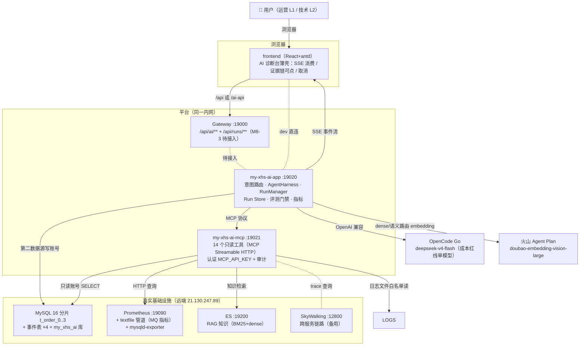
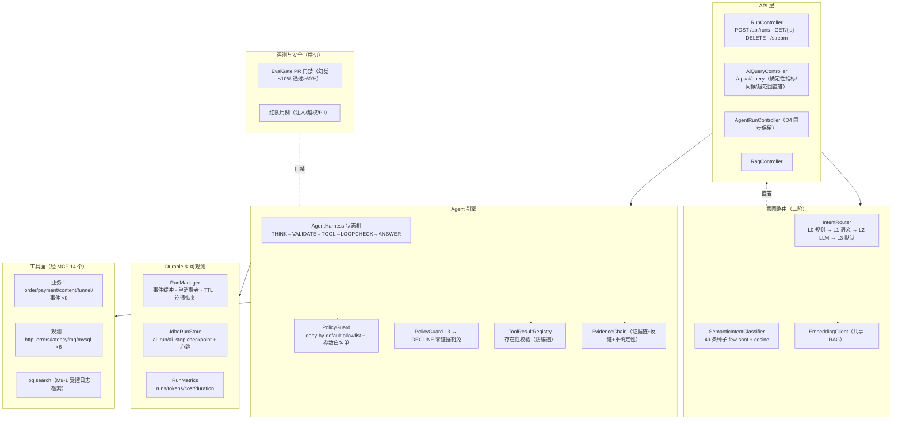
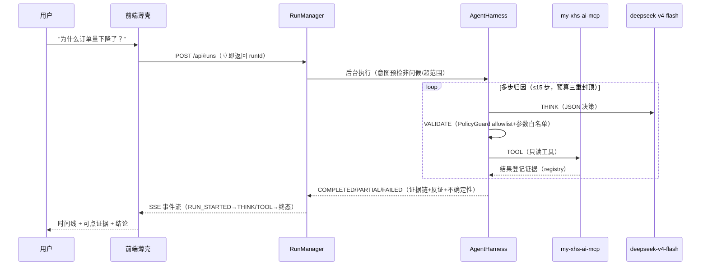

# my-xhs-ai C4 架构图

> 日期：2026-08-15 | 配套：HANDOFF-AI-v3.md、production-roadmap.md §14（面试证据映射）
> 说明：V1 单 Agent（受限多步归因），无多智能体；安全横切（认证/审计/护栏/评测门禁）。

## 1. 容器图（Container Diagram）

## 2. 组件图（Component Diagram，app 内部）

## 3. 关键请求流（诊断 run）

