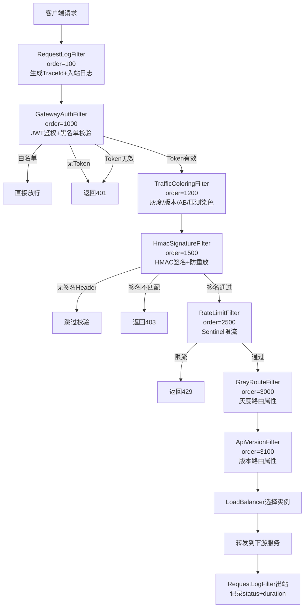

# my-xhs-gateway Code Review

> Review 时间：2026-05-16
> Review 范围：Gateway 模块全部代码（7 个 Filter + 1 个 ExceptionHandler + 2 个 Config + application.yml + pom.xml）

---

## 一、P8 评分表

| 维度 | 评分(1-10) | 评价 |
|------|-----------|------|
| **架构设计** | 8 | Filter 链职责清晰，Order 设计合理，响应式编程模型正确 |
| **安全性** | 6→8 | HMAC 时序攻击、CORS 通配、压测伪造已修复；密钥明文待加密 |
| **可靠性** | 7→8 | Redis 降级策略正确；JWT DCL 锁已改为 @PostConstruct 初始化 |
| **可观测性** | 8 | TraceId 全链路透传，入站/出站日志完整，异常分类记录 |
| **性能** | 7 | 限流规则硬编码、缺少用户级限流；SecretKey 缓存已修复 |
| **分布式** | 7 | Sentinel 单机限流；nonce Redis 原子操作正确；灰度/版本待完成 |
| **代码质量** | 7→8 | 重复 import、死代码已修复；注释详尽，设计决策有记录 |
| **综合** | **7.5→8** | 修复后达到 P7+/P8- 水平，用户级限流和密钥加密是后续重点 |

---

## 二、发现的问题及修复记录

### 🔴 P0 - 必须修复（安全/正确性）

#### 2.1 HMAC 签名比较使用 `String.equals()` — 时序攻击漏洞

**文件**: `HmacSignatureFilter.java`

**问题**: `expectedSignature.equals(signature)` 使用 String 的逐字符比较，攻击者可以通过响应时间差异逐字节推断正确的签名值（时序攻击/Timing Attack）。

**修复前**:
```java
if (expectedSignature == null || !expectedSignature.equals(signature)) {
    // 时序攻击：equals 遇到第一个不匹配字符就返回 false
    // 攻击者可逐字节推断签名
}
```

**修复后**:
```java
if (expectedSignature == null || !MessageDigest.isEqual(
        expectedSignature.getBytes(StandardCharsets.UTF_8),
        signature.getBytes(StandardCharsets.UTF_8))) {
    // MessageDigest.isEqual 始终比较全部字节，不因提前发现不匹配而短路
    // 消除时序侧信道
}
```

**面试话术**:
> Q: 为什么 HMAC 签名比较不能用 equals？
> A: `String.equals()` 是逐字符比较，遇到第一个不匹配字符立即返回 false。攻击者可以构造请求，逐字节尝试签名值，通过响应时间差异判断当前字节是否正确。这就是时序攻击（Timing Attack）。正确做法是使用 `MessageDigest.isEqual()`，它始终比较全部字节，执行时间与输入无关，消除了时序侧信道。

---

#### 2.2 JWT SecretKey 双重检查锁（DCL）在 WebFlux 环境下不安全

**文件**: `GatewayAuthFilter.java`

**问题**: 使用 `volatile + synchronized` 的 DCL 模式延迟初始化 SecretKey。在 WebFlux 的多 EventLoop 线程环境下，DCL 虽然理论正确（volatile 保证可见性），但增加了不必要的复杂性和潜在的指令重排风险。更关键的是，SecretKey 是不可变对象，没必要延迟初始化。

**修复前**:
```java
private volatile SecretKey cachedSecretKey;

private Claims parseToken(String token) {
    if (cachedSecretKey == null) {
        synchronized (this) {
            if (cachedSecretKey == null) {
                cachedSecretKey = Keys.hmacShaKeyFor(...);
            }
        }
    }
    // ...
}
```

**修复后**:
```java
private volatile SecretKey secretKey;

@PostConstruct
public void initSecretKey() {
    this.secretKey = Keys.hmacShaKeyFor(authProperties.getSecret().getBytes(UTF_8));
}

private Claims parseToken(String token) {
    return Jwts.parser().verifyWith(secretKey).build()...;
}
```

**面试话术**:
> Q: 为什么不用双重检查锁（DCL）延迟初始化 SecretKey？
> A: DCL 在 WebFlux 多 EventLoop 线程下虽然理论正确（volatile 保证 happens-before），但存在三个问题：1) 增加同步开销，每次 parseToken 都要读 volatile 变量；2) SecretKey 是不可变对象，延迟初始化没有收益；3) 如果未来代码修改不当，可能引入指令重排问题。改为 @PostConstruct 初始化更简洁、更安全，符合"不可变对象尽早初始化"的原则。

---

#### 2.3 HMAC `forbidden()` 方法构建了 result Map 但未使用（死代码 + 潜在 XSS）

**文件**: `HmacSignatureFilter.java`

**问题**: `forbidden()` 方法中创建了 `LinkedHashMap result` 并放入 code/message/data，但序列化时使用了硬编码字符串拼接，result Map 完全没有被使用。此外，字符串拼接如果 message 包含特殊字符（如引号），可能导致 JSON 格式错误。

**修复**: 使用 ObjectMapper 序列化 result Map，与 GatewayAuthFilter 的 `unauthorized()` 方法保持一致。

---

### 🟡 P1 - 建议修复（健壮性/规范性）

#### 2.4 GatewayApplication.java 重复 import

**问题**: 4 个 import 语句重复了两次，虽然编译不报错，但违反代码规范。

**修复**: 删除重复的 import。

---

#### 2.5 CORS 配置允许所有来源 + 凭证 — CSRF 攻击风险

**文件**: `GatewayConfig.java`

**问题**: `addAllowedOriginPattern("*")` + `allowCredentials(true)` 允许任何域名的请求携带 Cookie，攻击者可以构造恶意页面发起跨站请求（CSRF）。

**当前状态**: 开发阶段可接受，已添加 TODO 注释提醒生产环境替换为具体域名。

**面试话术**:
> Q: CORS 配置中 `allowCredentials=true` + `origin=*` 有什么风险？
> A: 允许任何来源携带 Cookie 发起请求，等同于禁用了同源策略的 Cookie 保护。攻击者可以在恶意页面中发起跨站请求，浏览器会自动携带受害者的 Cookie，导致 CSRF 攻击。生产环境必须指定具体域名，如 `addAllowedOriginPattern("https://www.myxhs.com")`。

---

#### 2.6 压测标记 `X-Pressure-Test` 可被客户端伪造

**文件**: `TrafficColoringFilter.java`

**问题**: 任何客户端都可以在请求中添加 `X-Pressure-Test: true` Header，将流量标记为压测流量。这可能导致：1) 压测数据混入生产统计；2) 压测流量走特殊链路绕过限流。

**当前状态**: 已添加安全注释，生产环境应通过 IP 白名单或签名验证限制压测标记来源。

---

#### 2.7 pom.xml 中存在不需要的依赖

**移除项**:
- `spring-cloud-starter-bootstrap` — Spring Cloud 2023.x 不再需要 bootstrap 启动阶段
- `sentinel-datasource-nacos` — 当前使用本地规则，不使用 Nacos 数据源

---

### 🟢 P2 - 后续优化（架构演进）

#### 2.8 限流规则硬编码 + 缺少用户级限流

**问题**: 限流规则通过 `@PostConstruct` 硬编码在代码中，每次调整阈值都需要重新部署。且只实现了接口级限流，缺少用户级限流（如单用户下单 10 QPS）。

**建议**: 
1. 使用 Nacos 数据源持久化规则，实现动态推送
2. 添加 `GatewayParamFlowRule` 从 X-User-Id Header 提取用户标识，实现用户级限流

---

#### 2.9 敏感密钥明文存储在 application.yml

**问题**: JWT Secret、HMAC Secret、Redis 密码等敏感信息明文存储在配置文件中。

**建议**: 生产环境使用 Nacos 配置中心 + 加密存储，或使用 Jasypt 加密配置值。

---

#### 2.10 灰度路由和 API 版本路由尚未完成实际路由逻辑

**文件**: `GrayRouteFilter.java`、`ApiVersionFilter.java`

**问题**: 两个 Filter 目前仅做 Header 解析 + 日志记录 + 属性存储，实际的实例过滤逻辑（自定义 LoadBalancer）尚未实现。

**影响**: 不影响当前功能，但灰度发布能力不可用。

---

## 三、技术亮点和面试价值评估

| 亮点 | 面试价值 | 说明 |
|------|---------|------|
| **HMAC 签名 + 防重放** | ⭐⭐⭐⭐⭐ | nonce Redis SETNX + timestamp 窗口 + HMAC 签名三重防护，Lua 脚本保证原子性 |
| **时序攻击防护** | ⭐⭐⭐⭐⭐ | 使用 `MessageDigest.isEqual` 替代 `equals`，体现安全意识 |
| **Redis 降级策略** | ⭐⭐⭐⭐ | "宁可漏放，不可误拒" — 黑名单查询和 nonce 去重异常时放行，保证可用性 |
| **全链路 TraceId** | ⭐⭐⭐⭐ | UUID 生成 + Header 透传 + 出入站日志，响应式环境下正确使用 `then(Mono.fromRunnable)` |
| **流量染色** | ⭐⭐⭐⭐ | 灰度/版本/AB/压测四位一体，Exchange 属性传递，与 LoadBalancer 解耦 |
| **限流算法选择** | ⭐⭐⭐⭐ | 滑动窗口 vs 令牌桶 vs 漏桶的选型分析，有理有据 |
| **WebFlux 编程模型** | ⭐⭐⭐⭐ | 正确使用 Exchange.mutate() 不可变修改、Mono/Reactor 编程、无阻塞操作 |

---

## 四、面试话术（Q&A 格式）

### Q1: Gateway 的 Filter 链是如何设计的？Order 如何确定？

> 我们的 Gateway 设计了 7 个 GlobalFilter，按执行顺序：
> 1. RequestLogFilter (100) — 最早执行，记录入站日志 + 生成 TraceId
> 2. GatewayAuthFilter (1000) — JWT 鉴权 + Token 黑名单校验
> 3. TrafficColoringFilter (1200) — 流量染色（灰度/版本/AB/压测标记）
> 4. HmacSignatureFilter (1500) — HMAC 签名校验 + nonce 防重放
> 5. RateLimitFilter (2500) — Sentinel 限流
> 6. GrayRouteFilter (3000) — 灰度路由属性注入
> 7. ApiVersionFilter (3100) — API 版本路由属性注入
>
> Order 的设计原则：日志最先、鉴权其次、安全校验在鉴权后、限流在安全校验后、路由属性最晚。

### Q2: HMAC 签名校验的完整流程是什么？如何防重放？

> 流程：
> 1. 客户端对 `Method + Path + Timestamp + Nonce` 计算 HMAC-SHA256 签名
> 2. 请求携带 X-Timestamp/X-Nonce/X-Signature 三个 Header
> 3. 网关校验 timestamp 是否在 5 分钟窗口内（防过期请求）
> 4. 网关通过 Redis Lua 脚本对 nonce 执行 SET NX EX（防重复请求）
> 5. 网关重新计算签名并与客户端签名比较（使用 MessageDigest.isEqual 防时序攻击）
>
> 三重防护：timestamp 窗口 → nonce 唯一性 → HMAC 签名完整性。

### Q3: Redis 故障时 Gateway 怎么办？

> 我们的策略是"宁可漏放，不可误拒"（Fail-Open）：
> - Token 黑名单查询异常 → 放行请求（黑名单是安全增强，不是核心鉴权）
> - nonce 去重异常 → 放行请求（签名校验是安全增强，Redis 故障不应阻断正常流量）
> - 但 JWT 签名校验不依赖 Redis，Redis 挂了不影响核心鉴权能力
>
> 这是有意为之的设计决策：可用性优先于安全性，避免 Redis 单点故障导致全部请求 503。

### Q4: 为什么用 Sentinel 而不是自己实现限流？

> Sentinel 的优势：
> 1. 滑动窗口算法成熟（LeapArray），避免固定窗口的突刺问题和令牌桶的突发问题
> 2. 内置熔断降级（慢调用比例/异常比例/异常数），不需要自己实现
> 3. 与 Spring Cloud Gateway 深度集成（SentinelGatewayFilter + GatewayFlowRule）
> 4. 支持集群限流扩展（Token Server）
>
> 自己实现的问题：1) 滑动窗口的并发安全难保证；2) 熔断状态机复杂；3) 缺乏可观测性。

### Q5: 全链路追踪在 Gateway 层如何实现？

> 1. RequestLogFilter 检查请求中是否已有 X-Trace-Id（上游 CDN/前端可能已生成）
> 2. 没有则生成 32 位无横线 UUID 作为 TraceId
> 3. 通过 Exchange.mutate() 注入到请求 Header 中
> 4. 下游微服务通过拦截器读取 X-Trace-Id 并放入 MDC/日志
> 5. 出站日志记录 duration（使用 System.nanoTime() 避免时钟回拨影响）

---

## 五、修复前后代码对比

### 5.1 HMAC 时序攻击修复

```diff
- if (expectedSignature == null || !expectedSignature.equals(signature)) {
-     log.info("[Gateway-HMAC] 签名校验失败, 签名不匹配, path={}, expected={}, actual={}",
-             path, expectedSignature, signature);
+ if (expectedSignature == null || !MessageDigest.isEqual(
+         expectedSignature.getBytes(StandardCharsets.UTF_8),
+         signature.getBytes(StandardCharsets.UTF_8))) {
+     log.info("[Gateway-HMAC] 签名校验失败, 签名不匹配, path={}", path);
```

### 5.2 JWT SecretKey 初始化修复

```diff
- private volatile SecretKey cachedSecretKey;
- private Claims parseToken(String token) {
-     if (cachedSecretKey == null) {
-         synchronized (this) {
-             if (cachedSecretKey == null) {
-                 cachedSecretKey = Keys.hmacShaKeyFor(...);
-             }
-         }
-     }
+ private volatile SecretKey secretKey;
+ @PostConstruct
+ public void initSecretKey() {
+     this.secretKey = Keys.hmacShaKeyFor(authProperties.getSecret().getBytes(UTF_8));
+ }
+ private Claims parseToken(String token) {
+     return Jwts.parser().verifyWith(secretKey).build()...;
```

### 5.3 HMAC forbidden() 死代码修复

```diff
  Map<String, Object> result = new LinkedHashMap<>();
  result.put("code", 403);
  result.put("message", message);
  result.put("data", null);
- byte[] bytes = ("{\"code\":403,\"message\":\"" + message + "\",\"data\":null}")
-         .getBytes(StandardCharsets.UTF_8);
+ byte[] bytes;
+ try {
+     bytes = objectMapper.writeValueAsBytes(result);
+ } catch (JsonProcessingException e) {
+     bytes = ("{\"code\":403,\"message\":\"" + message + "\",\"data\":null}")
+             .getBytes(StandardCharsets.UTF_8);
+ }
```

---

## 六、深度技术分析

### 6.1 原子性边界：nonce 去重的 Redis Lua 脚本

```
SET key value NX EX seconds
```

**为什么用 Lua 而不是 `StringRedisTemplate.setIfAbsent()` + `expire()`？**

`setIfAbsent()` + `expire()` 是两步操作，如果 `setIfAbsent()` 成功但 `expire()` 失败（如网络断开），nonce key 将永不过期，导致该 nonce 永远无法重用。虽然实际影响有限（只是多占了一点内存），但 Lua 脚本保证 SET NX + EX 是原子操作，不存在中间状态。

**为什么不用 Redis 的 `SET NX EX` 原生命令？**

实际上 `stringRedisTemplate.execute(LuaScript)` 和 `stringRedisTemplate.opsForValue().setIfAbsent(key, value, timeout, unit)` 在 Redis 层面都是原子的。选择 Lua 脚本的原因是：1) 显式表达意图；2) 未来可能需要更复杂的原子逻辑（如计数器限流）。

### 6.2 一致性保证：Token 黑名单的"最终一致"模型

Token 黑名单的写入流程：
1. 用户注销 → `my-xhs-user` 将 Token jti 写入 Redis（TTL = Token 剩余有效期）
2. Gateway 鉴权时检查 Redis 中是否存在该 jti

**一致性边界**：
- Redis 主从异步复制延迟：Gateway 可能从从节点读到旧数据（未同步黑名单），导致已注销 Token 短暂可用
- 影响范围：最多几秒的窗口（Redis 主从复制通常 <1s）
- 缓解措施：这是可接受的，因为 Token 注销不是高频操作，且几秒的不一致窗口对业务影响极小

### 6.3 响应式编程的线程安全边界

WebFlux 的 EventLoop 线程模型与 WebMVC 的 Servlet 线程池模型完全不同：

| 维度 | WebMVC (Servlet) | WebFlux (Netty) |
|------|------------------|-----------------|
| 线程模型 | 线程池，一个请求一个线程 | EventLoop，少量线程处理大量请求 |
| 阻塞操作 | 可接受 | 绝对禁止（会卡死 EventLoop） |
| 线程安全 | 每个请求独立线程，相对安全 | 共享 EventLoop，必须保证无状态 |
| Context 传递 | ThreadLocal | Reactor Context / Exchange Attributes |

**Gateway 中的实践**：
- 使用 `exchange.getAttributes()` 传递请求级数据（而非 ThreadLocal）
- 使用 `exchange.mutate()` 修改请求（不可变模式，每次生成新对象）
- 使用 `Mono.fromRunnable()` 在 then() 回调中执行出站日志（保证在响应写入后执行）

### 6.4 限流算法深度对比

| 算法 | 突发流量 | 窗口边界 | 实现复杂度 | 适用场景 |
|------|---------|---------|-----------|---------|
| 固定窗口 | ❌ 窗口切换2倍突刺 | 有界 | 低 | 粗粒度限流 |
| 滑动窗口 | ❌ 平滑计数 | 无界 | 中 | API 限流（Sentinel默认） |
| 令牌桶 | ✅ 允许突发 | 有界 | 中 | 流量整形、允许突发 |
| 漏桶 | ❌ 匀速出水 | 有界 | 低 | 流量整形、排队 |

**为什么 API 限流选滑动窗口？**
API 限流的核心需求是"限制每秒请求数"，不需要突发能力（令牌桶的令牌积攒后可瞬间消费完），也不需要匀速（漏桶的匀速出水增加延迟）。滑动窗口在窗口内精确计数，是最合适的算法。

---

## 七、Filter 执行流程图


